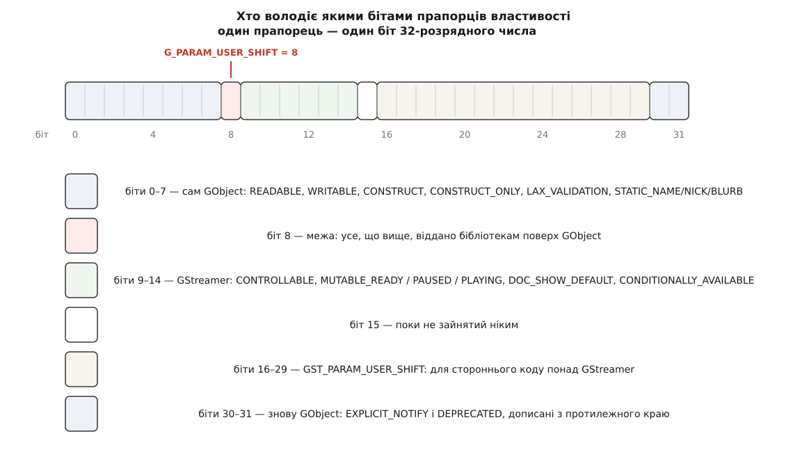
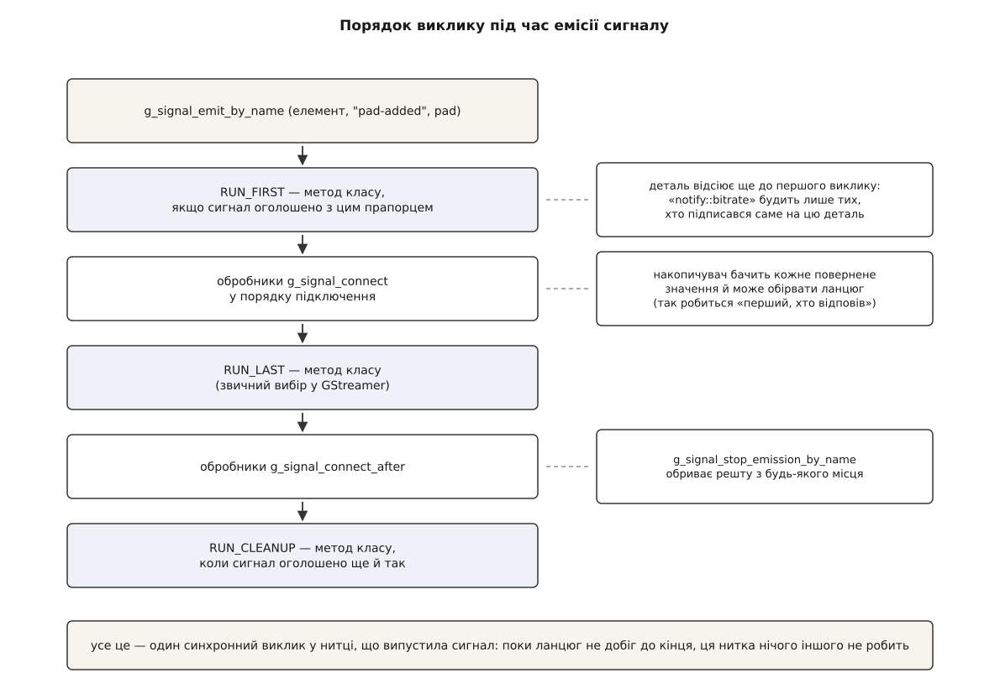

# 📋 Поверхня GObject у GStreamer: властивості, сигнали, володіння

Довідка з тієї частини GObject, якою справді користуються, коли пишуть код під GStreamer: як поставити й прочитати ручку елемента, як оголосити власну, що означає кожен прапорець у виводі `gst-inspect-1.0`, як улаштовані сигнали разом із деталями та сигналами-діями і хто кому винен посилання на кожному виклику. Потрібна тоді, коли готового рядка конвеєра вже мало: треба або керувати елементом із програми, або написати свій. Сигнатури й числа взято з заголовків GLib `gobject/gparam.h`, `gparamspecs.h`, `gsignal.h` та GStreamer `gst/gstparamspecs.h`, `gstobject.h`, `gstelement.h` — гілка 1.28, стабільна серія від випуску 1.28.0 27 січня 2026 року; де щось з'явилося пізніше за 1.0, версію вказано окремо.

## Поставити й прочитати властивість

Найкоротший шлях — варіативні функції з переліком «ім'я, значення» і **обов'язковим `NULL` наприкінці**. Забутий `NULL` — це читання сміття зі стека, а не помилка компіляції.

```c
void  g_object_set (gpointer object, const gchar *first_property_name, ...) G_GNUC_NULL_TERMINATED;
void  g_object_get (gpointer object, const gchar *first_property_name, ...) G_GNUC_NULL_TERMINATED;

g_object_set (enc, "bitrate", 4096, "speed-preset", 2, NULL);

guint  bitrate = 0;
gchar *preset  = NULL;
g_object_get (enc, "bitrate", &bitrate, "speed-preset-name", &preset, NULL);
g_free (preset);            /* вихід g_object_get — ЗАВЖДИ ваш */
```

Останній рядок — головне, що плутають у цій парі. `g_object_set` **позичає** все, що ви йому дали: рядок скопіюється всередині, об'єктові додадуть посилання, коробку продублюють. А `g_object_get` **видає власне**: рядок треба звільнити `g_free`, об'єкт — `g_object_unref`, коробку — функцією її типу (`gst_caps_unref`, `gst_structure_free`). Правило симетричне й без винятків: у `set` віддаєте позичене, з `get` забираєте своє.

Типізована пара для тих випадків, коли ім'я властивості відоме лише під час роботи:

```c
void  g_object_set_property (GObject *object, const gchar *property_name, const GValue *value);
void  g_object_get_property (GObject *object, const gchar *property_name, GValue *value);
```

`GValue` перед читанням треба **ініціалізувати потрібним типом** — інакше функція не знає, куди класти:

```c
GValue v = G_VALUE_INIT;
g_value_init (&v, G_TYPE_UINT);
g_object_get_property (G_OBJECT (enc), "bitrate", &v);
guint bitrate = g_value_get_uint (&v);
g_value_unset (&v);                       /* звільняє вміст, якщо він був */
```

`g_value_unset` обов'язковий для всього, що всередині щось тримає — рядка, коробки, об'єкта. Для чисел він нічого не робить, але писати його варто завжди: тип у `GValue` легко міняється разом із кодом.

Коли значення прийшло текстом (файл налаштувань, аргумент командного рядка), розбирати його руками не треба — GStreamer має для цього готову дорогу, ту саму, якою користується розбирач рядка конвеєра:

```c
void gst_util_set_object_arg (GObject *object, const gchar *name, const gchar *value);
```

Вона знаходить опис властивості, перетворює рядок на її тип і ставить значення. Пастка одна й тиха: якщо властивості з таким іменем немає або рядок не перетворюється, функція **мовчки нічого не робить** — ані повернення, ані попередження. Для масивів є парна `gst_util_set_object_array (GObject *, const gchar *, const GValueArray *)`, що складає `GST_TYPE_ARRAY` (з 1.12).

Ще три функції — коли треба працювати з властивостями, не знаючи їх наперед:

| Сигнатура | Що дає | Володіння |
| --- | --- | --- |
| `GParamSpec *g_object_class_find_property (GObjectClass *, const gchar *name)` | опис однієї властивості або `NULL` | позичене |
| `GParamSpec **g_object_class_list_properties (GObjectClass *, guint *n)` | масив описів усього класу разом зі спадком | масив ваш (`g_free`), описи в ньому позичені |
| `GObjectClass *g_type_class_ref (GType)` | клас **без створення об'єкта** — уся ця довідка доступна вже тут | ваше (`g_type_class_unref`) |

Остання — саме та, завдяки якій інспектор перелічує ручки елемента, якого неможливо ввімкнути: немає камери, немає ліцензії, зайнятий пристрій кодування. Опис лежить у класі, а клас не потребує жодного примірника.

## Оголосити властивість у власному елементі

З боку того, хто пише елемент, властивість — це три речі: номер у переліку, опис у класі й гілка в двох спільних функціях.

```c
enum { PROP_0, PROP_BITRATE, PROP_LOCATION, PROP_LAST };

static void
gst_my_enc_class_init (GstMyEncClass * klass)
{
  GObjectClass *gobject_class = G_OBJECT_CLASS (klass);

  gobject_class->set_property = gst_my_enc_set_property;
  gobject_class->get_property = gst_my_enc_get_property;

  g_object_class_install_property (gobject_class, PROP_BITRATE,
      g_param_spec_uint ("bitrate", "Bitrate", "Bitrate in kbit/sec",
          1, 2048000, 2048,
          G_PARAM_READWRITE | G_PARAM_STATIC_STRINGS | GST_PARAM_MUTABLE_PLAYING));
}
```

`PROP_0` на початку переліку не декоративний: нуль зарезервовано самим GObject, і властивість із номером 0 не встановиться. Дві функції класу мають строго визначені підписи — переплутати місцями `value` й `pspec` компілятор не дасть, а от переплутати `set` із `get` дасть залюбки, бо різниться лише `const`:

```c
void (*set_property) (GObject *object, guint property_id, const GValue *value, GParamSpec *pspec);
void (*get_property) (GObject *object, guint property_id,       GValue *value, GParamSpec *pspec);
```

У `set_property` значення **позичене** — його треба скопіювати в поле, а не запам'ятати вказівник. У `get_property` навпаки: ви заповнюєте чужий `GValue`, і для рядка чи об'єкта це має бути копія або нове посилання, бо викликач її звільнить.

```c
static void
gst_my_enc_set_property (GObject * object, guint prop_id,
    const GValue * value, GParamSpec * pspec)
{
  GstMyEnc *self = GST_MY_ENC (object);

  switch (prop_id) {
    case PROP_BITRATE:
      GST_OBJECT_LOCK (self);                    /* нитка потоку читає це поле */
      self->bitrate = g_value_get_uint (value);
      GST_OBJECT_UNLOCK (self);
      break;
    case PROP_LOCATION:
      GST_OBJECT_LOCK (self);
      g_free (self->location);
      self->location = g_value_dup_string (value);  /* dup, а не get: рядок наш */
      GST_OBJECT_UNLOCK (self);
      break;
    default:
      G_OBJECT_WARN_INVALID_PROPERTY_ID (object, prop_id, pspec);
      break;
  }
}
```

`GST_OBJECT_LOCK` — не перестрахування, а домовленість GStreamer: властивість ставлять із однієї нитки, а поле читає [нитка потоку](topic:sys-media/threads-and-queues), яка саме зараз обробляє кадр. Той самий м'ютекс живе в `GstObject` і використовується всередині ядра, тож брати окремий не треба. Чому спільне поле без узгодження — це не «зрідка не те значення», а невизначена поведінка, розібрано в [безпеці щодо ниток](topic:sf-tasks/thread-safety).

Дві дрібниці, що заощаджують час. `g_object_class_install_properties (GObjectClass *, guint n, GParamSpec **)` (з 2.26) ставить одразу масив і дає той самий номер, що й індекс у масиві, — зручно, коли властивостей два десятки. А `g_object_class_override_property` потрібна лише тоді, коли ви реалізуєте інтерфейс із уже оголошеною властивістю.

## Конструктори GParamSpec

Конструктор обирають за **типом значення**, і саме він визначає, що можна написати в межах і що надрукує інспектор. Перші три аргументи в усіх однакові — `name`, `nick`, `blurb`, — останній теж: `flags`. Різниця посередині.

| Тип значення | Конструктор | Аргументи між `blurb` і `flags` | Дістати з `GValue` |
| --- | --- | --- | --- |
| `gboolean` | `g_param_spec_boolean` | `default` | `g_value_get_boolean` |
| `gint` / `guint` | `g_param_spec_int` / `_uint` | `min`, `max`, `default` | `g_value_get_int` / `_uint` |
| `gint64` / `guint64` | `g_param_spec_int64` / `_uint64` | `min`, `max`, `default` | `g_value_get_int64` / `_uint64` |
| `gfloat` / `gdouble` | `g_param_spec_float` / `_double` | `min`, `max`, `default` | `g_value_get_float` / `_double` |
| рядок | `g_param_spec_string` | `default` (можна `NULL`) | `g_value_get_string` — позичене, `g_value_dup_string` — ваше |
| перелік | `g_param_spec_enum` | `GType` переліку, `default` | `g_value_get_enum` |
| набір бітів | `g_param_spec_flags` | `GType` набору, `default` | `g_value_get_flags` |
| коробка (`GstCaps`, `GstStructure`, `GstTagList`) | `g_param_spec_boxed` | `GType` коробки | `g_value_get_boxed` — позичене, `g_value_dup_boxed` — ваше |
| об'єкт (`GstElement`, `GstPad`) | `g_param_spec_object` | `GType` об'єкта | `g_value_get_object` — позичене, `g_value_dup_object` — ваше |
| голий вказівник | `g_param_spec_pointer` | — | `g_value_get_pointer` |
| `GVariant` | `g_param_spec_variant` | `GVariantType *`, `GVariant *default` | `g_value_get_variant` |
| дріб | `gst_param_spec_fraction` | `min_num`, `min_denom`, `max_num`, `max_denom`, `default_num`, `default_denom` | `gst_value_get_fraction_numerator` / `_denominator` |
| масив однотипних значень | `gst_param_spec_array` (1.14) | `GParamSpec *` одного елемента | `gst_value_array_get_size` / `_get_value` |

Два останні — власні конструктори GStreamer, і потрібні вони не з примхи. Частота кадрів і співвідношення сторін мусять бути **точними дробами**: 30000/1001 — це не 29.97, і саме на цій різниці розходяться мітки часу за годину відтворення.

Перелік потребує окремого `GType`, який теж треба зареєструвати під час роботи. Звична форма — функція з таблицею членів:

```c
GType
gst_my_enc_pass_get_type (void)
{
  static gsize id = 0;
  static const GEnumValue values[] = {
    { GST_MY_ENC_PASS_CBR,  "Constant Bitrate Encoding", "cbr"  },
    { GST_MY_ENC_PASS_QUANT, "Constant Quantizer",       "quant" },
    { 0, NULL, NULL }
  };
  if (g_once_init_enter (&id)) {
    GType t = g_enum_register_static ("GstMyEncPass", values);
    g_once_init_leave (&id, t);
  }
  return id;
}
```

Третє поле кожного члена — короткий псевдонім, і саме його пишуть у рядку конвеєра: `pass=cbr`. Друге — людський опис, який покаже інспектор. Отже, псевдонім є частиною зовнішнього інтерфейсу елемента нарівні з іменем властивості, і міняти його — те саме, що ламати чужі рядки конвеєра.

## Прапорці властивості

Прапорці — це біти одного 32-розрядного числа, і поділено їх між двома господарями. GObject лишив собі молодші вісім бітів і два найстарші; від дев'ятого починається територія бібліотек, що стоять поверх нього.



*Межу задано однією константою `G_PARAM_USER_SHIFT = 8`; кожна бібліотека, що надбудовує GObject, відлічує свої біти від неї — тому прапорці GStreamer ніколи не зіткнуться з новими прапорцями самого GObject.*

**Прапорці GObject.**

| Прапорець | Біт | Що означає |
| --- | --- | --- |
| `G_PARAM_READABLE` | 0 | можна читати |
| `G_PARAM_WRITABLE` | 1 | можна писати |
| `G_PARAM_READWRITE` | 0 і 1 | обидва разом — звична основа |
| `G_PARAM_CONSTRUCT` | 2 | під час створення властивість ставлять у типове значення явно |
| `G_PARAM_CONSTRUCT_ONLY` | 3 | ставиться **лише** у `g_object_new`; далі не міняється ніколи |
| `G_PARAM_LAX_VALIDATION` | 4 | послаблена звірка значення з межами |
| `G_PARAM_STATIC_NAME` | 5 | ім'я — сталий рядок, копіювати не треба |
| `G_PARAM_STATIC_NICK` | 6 | те саме про короткий підпис |
| `G_PARAM_STATIC_BLURB` | 7 | те саме про довгий опис |
| `G_PARAM_STATIC_STRINGS` | 5–7 | усі три разом |
| `G_PARAM_EXPLICIT_NOTIFY` | 30 | GObject **не** випускає `notify` сам — це робить ваш сетер |
| `G_PARAM_DEPRECATED` | 31 | застаріла; при `G_ENABLE_DIAGNOSTIC=1` попереджає в журналі |

`G_PARAM_STATIC_STRINGS` варто ставити завжди, коли всі три рядки — літерали в коді, а в елементі GStreamer вони саме такі. Без нього GObject копіює кожен рядок у купу на кожен клас: дрібниця, помножена на кількість властивостей, помножена на кількість завантажених плагінів.

`G_PARAM_CONSTRUCT_ONLY` заслуговує уваги, бо його дія жорсткіша, ніж здається з назви. Така властивість ставиться **тільки** через `g_object_new (тип, "ім'я", значення, NULL)` — не через `g_object_set` навіть у стані `NULL`, і не через рядок конвеєра, бо розбирач створює елемент фабрикою, а вже потім ставить ручки. Тому в GStreamer цей прапорець рідкісний: він робить властивість недосяжною зі звичайного `gst-launch-1.0`.

`G_PARAM_EXPLICIT_NOTIFY` міняє поведінку сповіщень. Типово GObject випускає `notify` після кожного успішного запису, **навіть якщо значення не змінилося**: система не знає, як порівнювати значення довільного типу. З цим прапорцем відповідальність переходить до вас — сетер сам вирішує, чи щось насправді змінилося, і сам кличе `g_object_notify_by_pspec`. Для властивості, яку крутять на кожному кадрі, різниця між «сповістити завжди» і «сповістити на зміну» — це різниця між шквалом подій і тишею.

**Прапорці GStreamer.** Усі відлічені від межі й описані в `gst/gstparamspecs.h`.

| Прапорець | Біт | Що означає | Як друкує `gst-inspect-1.0` |
| --- | --- | --- | --- |
| `GST_PARAM_CONTROLLABLE` | 9 | значення має сенс вести кривою в часі | `controllable` |
| `GST_PARAM_MUTABLE_READY` | 10 | міняти можна у стані `READY` і нижчому | `changeable only in NULL or READY state` |
| `GST_PARAM_MUTABLE_PAUSED` | 11 | у `PAUSED` і нижчому; включає попередній | `changeable only in NULL, READY or PAUSED state` |
| `GST_PARAM_MUTABLE_PLAYING` | 12 | у `PLAYING` і нижчому, тобто будь-коли | `changeable in NULL, READY, PAUSED or PLAYING state` |
| `GST_PARAM_DOC_SHOW_DEFAULT` | 13 | інспектор друкує типове значення замість поточного (1.18) | — |
| `GST_PARAM_CONDITIONALLY_AVAILABLE` | 14 | властивість є не завжди: залежить від системи чи пристрою (1.18) | `conditionally available` |
| `GST_PARAM_USER_SHIFT` | 16 | від цього біта — місце для стороннього коду понад GStreamer | — |

Три прапорці мінливості складаються в **драбину, а не в набір**: `MUTABLE_PLAYING` включає `MUTABLE_PAUSED`, той включає `MUTABLE_READY`. Тому ставлять рівно один — найвищий із дозволених. Інспектор друкує теж рівно один: у його коді стоїть ланцюг «інакше якщо», і виграє найвищий.

Найважливіше про цей ряд — **що означає його відсутність**. Властивість без жодного `MUTABLE_*` можна безпечно міняти лише у стані `NULL`. Це не заборона на рівні коду: `g_object_set` спрацює й у `PLAYING`, значення в поле ляже, а от що з ним зробить нитка потоку посеред кадру — питання відкрите, від тихого ігнорування до запису пікселів у буфер невідповідного розміру. Що саме означає кожен стан і як опустити елемент, не зупиняючи решти конвеєра, — у [станах конвеєра](topic:sys-media/states-lifecycle): переходи йдуть щаблями `NULL` → `READY` → `PAUSED` → `PLAYING`, і частина ресурсів звільняється саме на них.

## Як усе це виглядає у виводі інспектора

`gst-inspect-1.0` не має жодного знання про конкретні елементи — він друкує опис із класу. Тому за виводом однозначно читається те, що написали в `class_init`:

```
  bitrate             : Bitrate in kbit/sec
                        flags: readable, writable, changeable in NULL, READY,
                               PAUSED or PLAYING state
                        Unsigned Integer. Range: 1 - 2048000 Default: 2048

  pass                : Encoding pass/type
                        flags: readable, writable, changeable only in NULL or READY state
                        Enum "GstX264EncPass" Default: 0, "cbr"
                           (0): cbr              - Constant Bitrate Encoding
                           (4): quant            - Constant Quantizer
```

Перший рядок — це `blurb` із конструктора, а не `nick`. Рядок `flags:` складається з прапорців у сталому порядку: `readable`, `writable`, `deprecated`, `controllable`, `conditionally available`, а вкінці — один рядок мінливості. Останній рядок — тип із межами, і слова в ньому теж сталі, по одному на конструктор:

| Конструктор | Слово у виводі |
| --- | --- |
| `g_param_spec_boolean` | `Boolean. Default: true` |
| `g_param_spec_uint` | `Unsigned Integer. Range: 1 - 2048000 Default: 2048` |
| `g_param_spec_int64` | `Integer64. Range: … Default: …` |
| `g_param_spec_double` | `Double. Range: … Default: …` |
| `g_param_spec_string` | `String. Default: "…"` або `Default: null` |
| `g_param_spec_enum` | `Enum "ІмʼяТипу" Default: 0, "cbr"` і далі перелік членів |
| `g_param_spec_flags` | `Flags "ІмʼяТипу" Default: 0x00000000, "…"` |
| `g_param_spec_boxed` | `Boxed pointer of type "GstCaps"` |
| `g_param_spec_object` | `Object of type "GstPad"` |
| `g_param_spec_pointer` | `Pointer of type "…"` або просто `Pointer.` |
| `gst_param_spec_fraction` | `Fraction. Range: 0/1 - 2147483647/1 Default: 30/1` |

> 🔧 **Навіщо це.** Ці слова — не косметика, а спосіб дізнатися про елемент те, чого немає в документації. Побачили `Boxed pointer of type "GstCaps"` — значить, у властивість треба класти `GstCaps *` через `g_object_set`, а з `g_object_get` вийде **ваше** посилання, яке треба відпустити `gst_caps_unref`. Побачили `Enum` — значить, у рядку конвеєра пишеться псевдонім із дужок, а не число, хоча число теж приймається. Побачили порожній рядок мінливості — значить, ручку крутять до старту, і код, що робить це на ходу, працює випадково.

## Оголосити сигнал

Сигнал — це запис у таблиці типів із власним номером, а не поле в структурі. Оголошують його раз у `class_init`:

```c
guint g_signal_new (const gchar *signal_name,
                    GType itype,
                    GSignalFlags signal_flags,
                    guint class_offset,
                    GSignalAccumulator accumulator,
                    gpointer accu_data,
                    GSignalCMarshaller c_marshaller,
                    GType return_type,
                    guint n_params, ...);
```

| Аргумент | Що туди йде |
| --- | --- |
| `signal_name` | ім'я через дефіс: `"pad-added"`, `"new-sample"` |
| `itype` | тип-власник, звично `G_TYPE_FROM_CLASS (klass)` |
| `signal_flags` | коли кликати метод класу й чи приймає сигнал деталь |
| `class_offset` | `G_STRUCT_OFFSET (GstElementClass, pad_added)` або `0`, якщо методу класу немає |
| `accumulator` | функція, що зводить відповіді кількох обробників в одну; `NULL` — виграє останній |
| `accu_data` | дані для неї |
| `c_marshaller` | перекладач із масиву `GValue` у C-виклик; `NULL` — універсальний |
| `return_type` | `G_TYPE_NONE` для сповіщень; конкретний тип для дій |
| `n_params`, `...` | скільки аргументів і `GType` кожного |

Коли метод класу є не полем у структурі, а звичайною функцією, зручніша `g_signal_new_class_handler` — той самий підпис, але замість зсуву в структурі там прямо `GCallback class_handler`.

| Прапорець | Біт | Що робить |
| --- | --- | --- |
| `G_SIGNAL_RUN_FIRST` | 0 | метод класу виконується **перед** підключеними обробниками |
| `G_SIGNAL_RUN_LAST` | 1 | після звичайних обробників, але перед `_after`; звичний вибір GStreamer |
| `G_SIGNAL_RUN_CLEANUP` | 2 | найостаннішим, після `_after` |
| `G_SIGNAL_NO_RECURSE` | 3 | повторна емісія під час емісії не вкладається, а перезапускає |
| `G_SIGNAL_DETAILED` | 4 | сигнал приймає деталь: `"notify::bitrate"` |
| `G_SIGNAL_ACTION` | 5 | сигнал можна випускати ззовні як виклик методу |
| `G_SIGNAL_NO_HOOKS` | 6 | до сигналу не можна причепити перехоплювачі |
| `G_SIGNAL_MUST_COLLECT` | 7 | аргумент треба збирати через `GValue` (для типів змінного розміру) |
| `G_SIGNAL_DEPRECATED` | 8 | застарілий |
| `G_SIGNAL_ACCUMULATOR_FIRST_RUN` | 17 | накопичувач бачить і результат методу класу (з 2.68) |

Порядок виклику під час емісії задають саме ці прапорці, і він строгий.



*Ланцюг обривається або накопичувачем, або явним `g_signal_stop_emission_by_name`; в усьому іншому емісія — це звичайний синхронний виклик усіх ланок одна за одною.*

Накопичувач потрібен лише тоді, коли сигнал щось повертає. Його підпис — `gboolean (*)(GSignalInvocationHint *ihint, GValue *return_accu, const GValue *handler_return, gpointer data)`, і повернене `FALSE` обриває емісію. Двома готовими користуються найчастіше: `g_signal_accumulator_true_handled` спиняє ланцюг на першому обробнику, що повернув `TRUE` («хтось уже впорався»), а `g_signal_accumulator_first_wins` (з 2.28) бере перше значення й спиняється.

`NULL` замість маршалера означає універсальний, що збирає C-виклик на льоту за описом типів. Це працює для будь-якої сигнатури й коштує помітно більше за прямий виклик — тому сигнали й лишаються механізмом для рідкісних подій.

## Підписатися, відписатися, випустити

| Сигнатура | Що робить |
| --- | --- |
| `gulong g_signal_connect (instance, "ім'я", G_CALLBACK (f), data)` | обгортка над `connect_data` без прибирання й без прапорців |
| `gulong g_signal_connect_after (…)` | те саме з `G_CONNECT_AFTER` |
| `gulong g_signal_connect_swapped (…)` | те саме з `G_CONNECT_SWAPPED`: об'єкт і `data` міняються місцями |
| `gulong g_signal_connect_data (gpointer instance, const gchar *detailed_signal, GCallback c_handler, gpointer data, GClosureNotify destroy_data, GConnectFlags connect_flags)` | повна форма з функцією прибирання даних |
| `gulong g_signal_connect_object (gpointer instance, const gchar *detailed_signal, GCallback c_handler, gpointer gobject, GConnectFlags flags)` | сам зніме підписку, коли `gobject` помре |
| `void g_signal_handler_disconnect (gpointer instance, gulong handler_id)` | зняти за номером |
| `g_signal_handlers_disconnect_by_func (instance, func, data)` | зняти за парою «функція + дані» |
| `guint g_signal_handlers_disconnect_matched (…)` | зняти за довільним поєднанням ознак |
| `void g_signal_handler_block / _unblock (gpointer instance, gulong handler_id)` | тимчасово вимкнути, не знімаючи |
| `gboolean g_signal_handler_is_connected (gpointer instance, gulong handler_id)` | чи живий обробник |
| `void g_signal_emit (gpointer instance, guint signal_id, GQuark detail, ...)` | випустити за номером — швидше |
| `void g_signal_emit_by_name (gpointer instance, const gchar *detailed_signal, ...)` | випустити за іменем — зручніше |
| `void g_signal_stop_emission_by_name (gpointer instance, const gchar *detailed_signal)` | обірвати поточну емісію зсередини обробника |

Номер обробника — `gulong`, і **нуль означає «немає»**: саме такою заготовкою ініціалізують поле, щоб потім безпечно перевірити, чи є що знімати.

`G_CONNECT_SWAPPED` існує заради однієї конструкції: `g_signal_connect_swapped (src, "pad-added", G_CALLBACK (gst_element_link), sink)` — обробником стає функція, якій об'єкт-джерело треба другим аргументом, а не першим. Без обміну довелося б писати проміжну функцію на два рядки.

`g_signal_connect_object` розв'язує типову халепу довгоживучих конвеєрів: обробник тримає вказівник на об'єкт, який може померти раніше за джерело сигналу. Звичайна підписка після цього кличе функцію з мертвим вказівником; ця — знімається сама.

Другий бік цієї ж проблеми — дані. Коли `user_data` виділені в купі, звільняти їх треба тоді, коли підписку знято, а не тоді, коли ви про це згадали:

```c
g_signal_connect_data (demux, "pad-added", G_CALLBACK (on_pad_added),
                       ctx, (GClosureNotify) my_ctx_free, 0);
/* ctx звільниться сам: коли підписку знімуть або коли demux помре */
```

Про порядок ниток тут варто пам'ятати одне: **обробник виконується в тій нитці, що випустила сигнал**, і поки він працює, ця нитка стоїть. Для `pad-added` це нитка, яка розбирає потік. Саме тому помилки й кінець потоку GStreamer доставляє не сигналами елемента, а через [шину повідомлень](topic:sys-media/bus-and-messages), яка перекладає їх у нитку головного циклу. Загальна форма цієї схеми — [спостерігач](topic:sf-apps/observer): джерело оголошує подію, не знаючи своїх слухачів.

## Деталі

Деталь — це другий, уточнювальний складник імені після двох двокрапок. Приймають її лише сигнали, оголошені з `G_SIGNAL_DETAILED`; технічно вона є `GQuark`, тобто числом за рядком.

| Сигнал із деталлю | Де живе | Коли приходить |
| --- | --- | --- |
| `"notify::bitrate"` | будь-який `GObject` | значення властивості `bitrate` записали |
| `"deep-notify::bitrate"` | `GstObject` | те саме, але в **будь-якого нащадка** цього контейнера |
| `"message::error"` | `GstBus` | у шину надійшло повідомлення типу `error` |
| `"sync-message::element"` | `GstBus` | те саме, але негайно, у нитці постача |

Правило перетину просте: обробник, підписаний **без** деталі, отримує всі емісії сигналу; обробник із деталлю — лише свою. Тому `"notify"` без уточнення на елементі з двадцятьма ручками — це двадцять різних приводів для одного обробника, і розбирати їх доведеться за `pspec->name`.

`deep-notify` — власний сигнал `GstObject`, оголошений як `RUN_FIRST | NO_RECURSE | DETAILED | NO_HOOKS` із двома аргументами: об'єкт, чия властивість змінилася, і її опис. Підписка на конвеєрі ловить зміни в усіх його елементах — на цьому й тримається `gst-launch-1.0 -v`, який друкує сповіщення про властивості. Готовий обробник для такого друку є в бібліотеці: `gst_object_default_deep_notify`.

Але сучасний GStreamer до цього сигналу напряму не чіпляється, і причина знову в нитках. Сповіщення прилітає в нитці потоку, а друкувати чи оновлювати інтерфейс треба з головного циклу. Тому є пара функцій, що перетворює сповіщення на **повідомлення шини** (з 1.10):

```c
gulong gst_element_add_property_notify_watch      (GstElement *element, const gchar *property_name, gboolean include_value);
gulong gst_element_add_property_deep_notify_watch (GstElement *element, const gchar *property_name, gboolean include_value);
void   gst_element_remove_property_notify_watch   (GstElement *element, gulong watch_id);
```

`property_name` рівний `NULL` означає «усі властивості». Наслідок — сповіщення виходить у шину як `GST_MESSAGE_PROPERTY_NOTIFY` і потрапляє до застосунку вже в його власній нитці. Саме цим викликом і послуговується `gst-launch-1.0` для `-v`.

## Сигнали-дії

Сигнал із прапорцем `G_SIGNAL_ACTION` — це метод, одягнений у сигнал. Підписуватися на нього не треба; його **випускають**, і він виконує роботу:

```c
GstFlowReturn ret;
g_signal_emit_by_name (appsrc, "push-buffer", buf, &ret);
```

Останній аргумент — місце під поверненим значенням, бо `return_type` цього сигналу — `GST_TYPE_FLOW_RETURN`. Уся конструкція існує заради прив'язок: метод, оголошений як сигнал, автоматично видно з Python, Rust чи Vala, тимчасом як звичайна C-функція `gst_app_src_push_buffer` потребувала б окремої роботи в кожній прив'язці. Механіку такого мосту між мовами описано у [виклику рідного коду з іншої мови](topic:sf-lang/foreign-function-interface).

| Елемент | Сигнал-дія | Аргументи | Повертає |
| --- | --- | --- | --- |
| `appsrc` | `push-buffer` | `GstBuffer *` | `GstFlowReturn` |
| `appsrc` | `push-buffer-list` | `GstBufferList *` | `GstFlowReturn` |
| `appsrc` | `push-sample` | `GstSample *` — заразом виставляє caps | `GstFlowReturn` |
| `appsrc` | `end-of-stream` | — | `GstFlowReturn` |
| `appsink` | `pull-sample` | — | `GstSample *` або `NULL` |
| `appsink` | `pull-preroll` | — | `GstSample *` або `NULL` |
| `appsink` | `try-pull-sample` | `guint64` час очікування | `GstSample *` або `NULL` |

І тут ховається розбіжність, через яку ловлять або витік, або подвійне звільнення. **Сигнал-дія й однойменна C-функція мають різні угоди про володіння.** `gst_app_src_push_buffer()` позначено `transfer full` — вона забирає буфер собі, і ваш `unref` після неї буде помилкою. А сигнал `"push-buffer"` буфера **не забирає**: він бере власне посилання, тож ваше лишається вашим і його треба відпустити. Зроблено так навмисно — прив'язки не вміють передавати володіння через сигнал, — але C-код, переписаний із виклику функції на емісію сигналу, після такої заміни тече.

Зворотний бік — `pull-sample`: зразок повертають **вам у власність**, і `gst_sample_unref` обов'язковий. Пропущений — це втримана пам'ять кадру, помножена на частоту.

Звичайні, не-дійові сигнали цих елементів — `need-data`, `enough-data`, `seek-data` в `appsrc` і `new-sample`, `new-preroll`, `eos` в `appsink` — сповіщають, а не діють. І в них є асиметрія, яку варто знати: `emit-signals` у `appsink` типово **вимкнено**, а в `appsrc` типово **ввімкнено** — друге лишили заради сумісності зі старим кодом. Обидва працюють на гарячому шляху, тож сигнали там коштують: замість них ставлять структуру зі зворотними викликами, як описано в [мості між конвеєром і власним кодом](topic:sys-media/appsink-appsrc).

## Володіння

Лічильник посилань у GStreamer крутять цими функціями. Усі беруть `gpointer`, тому працюють і з `GstElement *`, і з `GstPad *` без приведення типу.

| Сигнатура | Що робить |
| --- | --- |
| `gpointer gst_object_ref (gpointer object)` | +1 і повертає той самий вказівник |
| `void gst_object_unref (gpointer object)` | −1; на нулі об'єкт розбирають |
| `gpointer gst_object_ref_sink (gpointer object)` | **привласнює** плавальне посилання, не збільшуючи лічильника; для не-плавального бере звичайне нове |
| `gboolean gst_object_replace (GstObject **oldobj, GstObject *newobj)` | атомарно міняє вказівник, беручи посилання на нове й віддаючи на старе |
| `gst_clear_object (&obj)` | `unref`, якщо не `NULL`, і занулення вказівника |
| `gchar *gst_object_get_name (GstObject *object)` | **копія** імені — `g_free` |
| `GstObject *gst_object_get_parent (GstObject *object)` | нове посилання на батька — `gst_object_unref` |

Позначка в документації відповідає рівно на одне питання: чи треба вам щось звільняти.

| Позначка | Читається як | Ваш обов'язок |
| --- | --- | --- |
| `transfer none` | позичили показати | нічого; зберігати «на потім» теж не можна без власного `ref` |
| `transfer full` | віддали у власність | звільнити відповідною функцією типу |
| `transfer floating` | посилання нічиє | нічого; перший, хто додасть об'єкт у контейнер, привласнить його |
| `transfer container` | ваш лише **контейнер**, не вміст | звільнити масив чи список, вміст не чіпати |

Типові виклики, які плутають найчастіше:

| Виклик | Що повертає | Володіння |
| --- | --- | --- |
| `gst_element_factory_make ()` | новий елемент | **floating** — `unref` після `gst_bin_add` буде помилкою |
| `gst_element_get_bus ()` | шину конвеєра | full — `gst_object_unref` |
| `gst_element_get_static_pad ()` | пад за іменем | full — `gst_object_unref` |
| `gst_element_request_pad_simple ()` (1.20) | новий пад на запит | full — і `gst_element_release_request_pad` окремо |
| `gst_bin_get_by_name ()` | елемент за іменем | full — `gst_object_unref` |
| `gst_element_get_clock ()` | годинник елемента | full — `gst_object_unref` |
| `gst_element_get_compatible_pad ()` | пад, до якого можна під'єднатися | full — `gst_object_unref` |
| `gst_pad_get_current_caps ()` | узгоджений формат | full — `gst_caps_unref` |
| `gst_element_get_factory ()` | фабрику, з якої зроблено елемент | **none** — не чіпати |
| `GST_MESSAGE_SRC ()` | того, хто постив повідомлення | none — не чіпати |
| `g_object_class_find_property ()` | опис властивості | none — не чіпати |

Закономірність, що покриває майже всі рядки: якщо у виклику є слово `get` і повертає він **об'єкт із лічильником**, посилання ваше. Винятки — там, де об'єкт логічно не може пережити того, у кого його спитали: фабрика елемента, джерело повідомлення, опис у класі.

`gst_element_request_pad_simple` стоїть окремо, бо володіння там подвійне: посилання треба відпустити `gst_object_unref`, а сам пад — повернути елементові через `gst_element_release_request_pad`. Одне без другого лишає елемент із падом, якого ніхто не використовує; як пади взагалі з'являються й від чого залежить їхня кількість — у [падах і з'єднанні елементів](topic:sys-media/pads-and-linking).

Плавальне посилання — єдина річ у цьому переліку, що ламає симетрію «створив — звільни». Свіжий елемент має лічильник 1 із прапорцем «нічиє»; `gst_bin_add` кличе `ref_sink`, знімає прапорець і стає власником, **не збільшуючи лічильника**. Тому після додавання в контейнер вашого посилання просто немає, і `unref` зайвий. Механіку самого рахунку розібрано в [підрахунку посилань](topic:sf-lang/reference-counting): об'єкт живе, доки на нього є посилання, і звільняє його той, хто відпустив останнє.

І межа, за якою ці правила не діють: `GstBuffer`, `GstCaps`, `GstEvent`, `GstQuery`, `GstSample` — **не** об'єкти GObject, а міні-об'єкти. У них немає ані властивостей, ані сигналів, ані вказівника на клас там, де його шукає GObject. Кожен має власну пару функцій — `gst_buffer_ref`/`_unref`, `gst_caps_ref`/`_unref` і так далі, — і `g_object_unref` на буфері мовчки псує чужу пам'ять.

## Мінімальний повний виклик

Скелет, у якому зійшлося все: оголошення властивості з прапорцями, сетер із замком і явним сповіщенням, оголошення сигналу, підписка з деталлю та з прибиранням даних і чисте зняття.

```c
/* ── у класі елемента ─────────────────────────────────────────────────── */
enum { PROP_0, PROP_BITRATE };
enum { SIGNAL_KEYFRAME, SIGNAL_LAST };

static guint signals[SIGNAL_LAST];

static void gst_my_enc_set_property (GObject *, guint, const GValue *, GParamSpec *);
static void gst_my_enc_get_property (GObject *, guint,       GValue *, GParamSpec *);

static void
gst_my_enc_class_init (GstMyEncClass * klass)
{
  GObjectClass *go = G_OBJECT_CLASS (klass);

  go->set_property = gst_my_enc_set_property;
  go->get_property = gst_my_enc_get_property;

  g_object_class_install_property (go, PROP_BITRATE,
      g_param_spec_uint ("bitrate", "Bitrate", "Bitrate in kbit/sec",
          1, 2048000, 2048,
          G_PARAM_READWRITE | G_PARAM_STATIC_STRINGS |
          G_PARAM_EXPLICIT_NOTIFY |          /* сповіщаємо самі, лише на зміну */
          GST_PARAM_MUTABLE_PLAYING | GST_PARAM_CONTROLLABLE));

  signals[SIGNAL_KEYFRAME] =
      g_signal_new ("keyframe", G_TYPE_FROM_CLASS (klass),
          G_SIGNAL_RUN_LAST, 0, NULL, NULL, NULL,
          G_TYPE_NONE, 1, G_TYPE_UINT64);   /* мітка часу опорного кадру */
}

static void
gst_my_enc_set_property (GObject * object, guint prop_id,
    const GValue * value, GParamSpec * pspec)
{
  GstMyEnc *self = GST_MY_ENC (object);

  switch (prop_id) {
    case PROP_BITRATE: {
      guint v = g_value_get_uint (value);
      gboolean changed;

      GST_OBJECT_LOCK (self);
      changed = (self->bitrate != v);
      self->bitrate = v;
      GST_OBJECT_UNLOCK (self);

      if (changed)                          /* EXPLICIT_NOTIFY: наш обов'язок */
        g_object_notify_by_pspec (object, pspec);
      break;
    }
    default:
      G_OBJECT_WARN_INVALID_PROPERTY_ID (object, prop_id, pspec);
      break;
  }
}

/* ── з боку застосунку ───────────────────────────────────────────────── */
GstElement *enc = gst_element_factory_make ("myenc", "enc");  /* floating */
gst_bin_add (GST_BIN (pipeline), enc);          /* ref_sink: власник — конвеєр */

g_object_set (enc, "bitrate", 4096, NULL);      /* значення копіюється всередину */

gulong id = g_signal_connect_data (enc, "notify::bitrate",
                                   G_CALLBACK (on_bitrate), ctx,
                                   (GClosureNotify) ctx_free, 0);

GstPad *sink = gst_element_get_static_pad (enc, "sink");   /* transfer full */
/* … робота … */
gst_object_unref (sink);                        /* пропущений unref = витік */

g_signal_handler_disconnect (enc, id);          /* ctx звільниться сам */
/* enc не чіпаємо: його власник — конвеєр */
```

Три місця, де тут проходять невидимі межі. Після `gst_bin_add` елемент більше не ваш — і `unref` на ньому зламає конвеєр. Пад, узятий `get_static_pad`, навпаки, ваш — і забутий `unref` не впаде, а лише не дасть звільнити конвеєр, що в програмі з перезапусками виглядає як повільне зростання пам'яті без винуватця. А `EXPLICIT_NOTIFY` перекладає сповіщення на сетер: приберіть з нього `g_object_notify_by_pspec` — і жоден підписник `"notify::bitrate"` більше не почує нічого, хоча значення мінятиметься справно.
