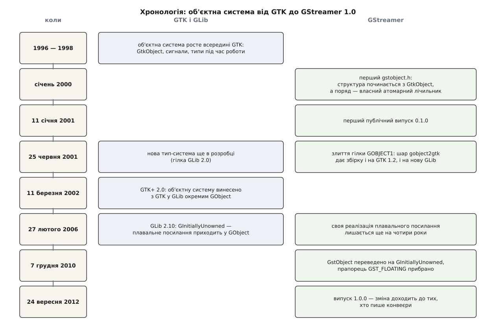

# 📜 Як мова C дістала об'єкти: від GtkObject до GObject

Об'єктна система, на якій тримається кожен елемент конвеєра, народилася не в медійному проєкті, а в програмі для малювання — і GStreamer дістав її вже готовою, бо коли він починався, писати таке самому було безглуздо. Ця історія цікава не датами, а тим, що майже кожне рішення, яке сьогодні здається дивним (чому тип реєструють викликом, чому сигнали окремо від подій, чому перше посилання «нічиє»), має конкретну причину в конкретному році.



*Два ряди подій: ліворуч дозріває сама об'єктна система, праворуч GStreamer то наздоганяє її, то чекає на неї роками.*

## Малювальна програма, якій знадобилися типи

1995 року двоє студентів Каліфорнійського університету в Берклі — Спенсер Кімбол (Spencer Kimball) і Пітер Меттіс (Peter Mattis) — писали растровий редактор GIMP. Комерційна бібліотека віджетів Motif, якою вони скористалися спершу, не годилася для вільної програми, тож вони взялися писати свою. Так з'явився GIMP Toolkit — GTK; окремим проєктом його відділили 1997 року, а версія 1.0 вийшла у квітні 1998-го. Третім автором раннього коду був Джош Макдональд (Josh MacDonald).

Графічний інтерфейс — це задача, яка тисне на мову С сильніше за більшість інших. Кнопка, поле вводу й вікно мають спільну поведінку, але кожне зі своїми відмінностями: це спадкування. Натиснення, рух миші, зміна значення — сповіщення від віджета невідомо кому: це сигнали. І найголовніше — програма, що використовує бібліотеку, хоче зробити **власний віджет, якого в бібліотеці немає**, тобто успадкуватися від чужого типу, зібраного в чужому файлі.

Перші спроби були геть інакші, ніж те, що вийшло: об'єкти GTK спочатку були непрозорими цілими ідентифікаторами, як у OpenGL, і від цього швидко відмовилися на користь вказівників на структури. Далі механізм зворотних викликів, спочатку окремий у кожного віджета, узагальнили до **сигналів** — переліку функцій, прив'язаних до відомого імені на кшталт `clicked`. І врешті з'явилося те, що виявилося найважливішим: **система типів, яка живе під час роботи програми** і дозволяє виводити нові віджети з наявних, зокрема поза деревом вихідних текстів GTK.

Усе це називалося `GtkObject` і жило всередині бібліотеки віджетів. Логіка тут була проста: це ж бібліотека інтерфейсу, кому ще потрібні її типи.

## Тім Яник: об'єкти — не про віджети

Виявилося, що потрібні всім. Наприкінці дев'яностих за частину GLib, що відповідала за об'єкти, сигнали й типи, узявся Тім Яник (Tim Janik), і його метою була вже не графіка. У копірайті файлів `gobject/` донині стоять два власники — Тім Яник і Red Hat, з датами 1998–1999 та 2000–2001: це роки, коли систему переписували з «частини GTK» на самостійну річ.

Саме тоді з'явилися складники, які сьогодні бачить кожен, хто пише елемент GStreamer: `GType` — число-ключ у таблиці типів; `GValue` — комірка, що несе значення разом із його типом; `GParamSpec` — опис параметра з іменем, межами й типовим значенням; фундаментальні типи, від яких усе інше походить. Ці три речі й перетворили «об'єкти для віджетів» на **загальну систему типів для C**.

Мотив був сильніший за охайність. Опис, придатний для читання під час роботи програми, — єдиний спосіб дати бібліотеці С прив'язки до інших мов **без ручного писання обгортки на кожну функцію**. Поки типи описані лише заголовками, кожну мову доводиться прив'язувати руками; коли типи описані даними, обгортку може згенерувати програма. Ця думка визначила все подальше — і саме вона згодом виллється в окремий проєкт самоаналізу, техніку [виклику рідного коду з іншої мови](topic:sf-lang/foreign-function-interface).

Робота дозріла разом із наступною великою версією набору віджетів. **11 березня 2002 року вийшов GTK+ 2.0**, і разом із ним об'єктну систему винесли з GTK в GLib окремою бібліотекою — GObject. Не всю: у GTK лишився `GtkObject` як тонкий шар із тим, що стосувалося саме віджетів, а все загальне піднялося в новий спільний базовий клас. Ця межа проведена саме тоді, і саме через неї далі буде найцікавіший поворот.

## GStreamer прийшов раніше за GObject

Тепер про другу сторону. Ерік Валтінсен (Erik Walthinsen) заснував GStreamer 1999 року; чимало ідей будови прийшло з дослідницького проєкту в Орегонському інституті післядипломної освіти (Oregon Graduate Institute), а взірцем — із застереженнями — була DirectShow. Перший публічний випуск, 0.1.0, оголосили **11 січня 2001 року**; невдовзі до проєкту приєднався Вім Тайманс (Wim Taymans), який згодом став головним архітектором. Наприкінці того самого січня компанія RidgeRun найняла Валтінсена, щоб пристосувати GStreamer до пристроїв класу мобільного телефона, — це був перший комерційний спонсор проєкту.

Порахуйте роки: GObject став окремою бібліотекою в березні 2002-го, а медійний каркас, що на ньому стоїть, публічно вийшов на чотирнадцять місяців раніше. На чому ж він стояв доти?

Відповідь є в самому сховищі. Найдавніша версія `gst/gstobject.h` — від 30 січня 2000 року, автор Ерік Валтінсен, у заголовку файла ще стара назва проєкту, «Gnome-Streamer». Перший рядок серед включень: `#include <gtk/gtk.h>`. А базова структура виглядала так:

```c
struct _GstObject {
  GtkObject object;

  /* have to have a refcount for the object */
  atomic_t refcount;
  ...
};
```

Медійний каркас без жодного вікна залежав від бібліотеки віджетів — просто тому, що об'єктна система жила там і більше ніде. Приведення типів робили макросом `GTK_CHECK_CAST`, а «занурення» плавального посилання було буквально одним рядком: `#define gst_object_sink(obj) gtk_object_sink(GTK_OBJECT(obj))`.

Помітьте другу деталь у тій структурі — власний лічильник посилань, до того ж атомарний, поряд із успадкованим від `GtkObject`. Це не надмірність: лічильник GTK не був розрахований на кілька ниток, а конвеєр із самого початку задумували як річ, де елементи живуть у різних нитках. Отже, вже 2000 року GStreamer брав чуже там, де воно годилося, і докладав своє там, де ні. Той самий підхід визначить усе далі.

## Гілка GOBJECT1 і шар, що вдавав GObject

Перехід стався швидше, ніж вийшов GTK+ 2.0. **25 червня 2001 року** в основну гілку влили гілку з промовистою назвою GOBJECT1 — GStreamer перебрався на нову систему типів ще тоді, коли вона була в розробці й офіційного випуску не мала.

Зробили це так, що варто подивитися. Заголовок після злиття починається з розгалуження:

```c
#ifdef USE_GLIB2
#include <glib-object.h>
#include <gst/gstmarshal.h>
#else
#include <gst/gobject2gtk.h>
#endif
```

Файл `gobject2gtk.h` — це шар сумісності навпаки: він не переносить старий код на нову бібліотеку, а **вдає нову бібліотеку на старій**. Кілька рядків із нього:

```c
#define g_object_ref(obj)          gtk_object_ref((GtkObject *)(obj))
#define G_TYPE_CHECK_INSTANCE_CAST GTK_CHECK_CAST
#define G_TYPE_BOOLEAN             GTK_TYPE_BOOL
#define g_cclosure_marshal_VOID__INT gtk_marshal_NONE__INT
#define GType                      GtkType
```

Увесь код GStreamer уже писали в поняттях GObject, а на машинах, де стояла ще GTK 1.2, ці поняття просто розкривалися у старі виклики. Одне джерело — дві збірки. Так проєкт устиг перейти на систему типів, якої формально ще не існувало, і не втратив користувачів, у яких її не було.

Чому взагалі варто було переходити, а не написати своє? Потреби GStreamer — не такі самі, як у GTK, але механізм потрібен той самий: спільний тип для геть різних елементів; ручки з іменем, типом і межами, які ставлять із текстового рядка; сповіщення в довільну кількість слухачів; спадкування **через межу окремо зібраних файлів**, бо плагін збирають після ядра й окремо від нього. Написати своє означало б не лише повторити роботу, а й повторити її **для кожної мови окремо**: власна система типів — це власні прив'язки до Python, до Perl, до всього наступного, і всі вручну. Чужа система типів, яку вже вміють читати генератори прив'язок, давала це задарма. Ціна — залежність від чужого темпу розвитку; наступний розділ саме про те, скільки та ціна іноді коштує.

## Плавальне посилання, яке лишилося вдома

Найдовший борг цієї історії — механізм «нічийного» першого посилання.

Придумали його для зручності C: `gtk_container_add (box, gtk_button_new ())` не має протікати. Новостворений об'єкт нічий, контейнер привласнює його посилання, і виклик в один рядок не лишає нікому обов'язку прибирати. У GTK 1.x це був прапорець на `GtkObject` і функція `gtk_object_sink`.

Коли 2002 року об'єктну систему винесли в GLib, плавальне посилання **не поїхало разом із нею** — його визнали трюком, специфічним для віджетів, і лишили в `GtkObject`. Для GStreamer це виявилося прикро: він щойно з `GtkObject` пішов, а зручність ця потрібна йому не менше, ніж GTK, бо `gst_bin_add (bin, gst_element_factory_make ("queue", NULL))` — точнісінько той самий візерунок. Тож у `gstobject.h` з'явилися власний прапорець `GST_FLOATING`, макрос `GST_OBJECT_FLOATING` і власна функція `gst_object_sink()` — свій примірник тієї самої ідеї.

Далі GLib наздогнала. **22 грудня 2005 року** Тім Яник перейменував щойно доданий тип `GUnowned` на `GInitiallyUnowned` — базовий клас, чиї примірники народжуються з плавальним посиланням; **27 лютого 2006 року** він вийшов у складі GLib 2.10 разом із функціями `g_object_ref_sink()`, `g_object_is_floating()` і `g_object_force_floating()`. Тепер це був загальний механізм GObject, а не хитрість набору віджетів.

І тут GStreamer не поспішив — з поважної причини. Гілка 0.10 вийшла в грудні 2005-го, за два місяці до тієї GLib, і трималася стабільного інтерфейсу понад тридцять випусків поспіль; міняти в ній базовий тип і викидати `GST_OBJECT_FLOATING` було не можна, бо це зламало б чужі програми й плагіни. Отже, зміни дочекалися наступного великого циклу. **7 грудня 2010 року** Вім Тайманс закомітив у гілку розробки 0.11 те, що згодом стане 1.0:

> object: Removed deprecated fields and methods
> Make GstObject extend from GInitiallyUnowned, remove the FLOATING flag and use GObject methods for managing the floating ref.
> Remove class lock, it was a workaround for a glib < 2.8 bug.

Другий рядок — окрема історія в мініатюрі: замок на клас, що дев'ять років стояв у коді, був обходом хиби в GLib, давно виправленої. Так виглядає борг залежності від чужого темпу.

Випуск 1.0.0 вийшов **24 вересня 2012 року**, і для тих, хто пише конвеєри, зміна проявилася трьома дрібницями: `gst_object_sink()` зник на користь `gst_object_ref_sink()`, `GST_OBJECT_IS_FLOATING` — на користь `g_object_is_floating()`, а прапорця `GST_OBJECT_FLOATING` не стало зовсім. Зміна поведінки була рівно нульова: та сама ідея, тільки тепер її реалізація одна на всю родину GLib, а не своя в кожного проєкту. Кільце замкнулося: механізм, який GStreamer 2000 року позичав у GTK, 2001-го мусив написати сам, а 2012-го знову позичив — уже там, де йому й місце.

Тонкощі лишилися. У липні 2012-го, за два місяці до 1.0, Тім-Філіп Мюллер (Tim-Philipp Müller) окремо погасив плавальне посилання в ініціалізації `GstBus` і `GstClock`: ці об'єкти ніколи не додають у контейнер, і «нічийний» стан для них — не зручність, а пастка. Це підказка й для того, хто читає документацію сьогодні: позначка передавання не однакова навіть у сусідніх типів однієї бібліотеки, і читати її треба щоразу. Тим паче що [підрахунок посилань](topic:sf-lang/reference-counting) сам по собі мовчазний: помилка в ньому не падає на місці, а стріляє пізніше й деінде.

## Що з цього визнано хибою

Історія не закінчилася схваленням. У травні 2019 року Емануеле Бассі (Emmanuele Bassi) додав до документації GLib розділ із назвою, що не потребує перекладу: «Please don't use GInitiallyUnowned and floating refs». Довід простий: зручність тут суто сишна, а всім іншим мовам плавальне посилання коштує окремої підпори в кожному генераторі прив'язок — бо це стан, якого в їхніх моделях пам'яті немає. Порада стосується **нових** бібліотек; наявні, зокрема GStreamer, живуть далі, бо ламати їх дорожче, ніж терпіти.

Тож коли `gst_bin_add()` мовчки забирає ваш об'єкт, ви бачите слід трьох рішень: зручності для C, придуманої 1997 року для кнопок у діалозі; межі, проведеної 2002 року між загальним і віджетним; і компромісу 2010 року, який повернув механізм звідти, де він виріс, туди, де він і мав бути.

## Статус доказовості

Найтвердіше в цій розповіді — те, що взято прямо з коду: вміст `gst/gstobject.h` за 30 січня 2000 року та за 25 червня 2001-го, файл `gobject2gtk.h`, текст коміту від 7 грудня 2010 року — усе це читається в історії сховища GStreamer із іменами авторів і датами. Так само перевірне перейменування `GUnowned` → `GInitiallyUnowned` в історії GLib за 22 грудня 2005 року.

Дати випусків — з оголошень: GTK+ 1.0.0 (квітень 1998), GTK+ 2.0 (11 березня 2002), GLib 2.10.0 (27 лютого 2006), GStreamer 0.1.0 (11 січня 2001), 0.10.0 (грудень 2005), 1.0.0 (24 вересня 2012).

Складнішим є **розподіл заслуг**. «Тім Яник зробив систему типів» — стисла й тому неточна формула: копірайт указує двох власників (Тім Яник і Red Hat), а над GLib 2.0 працювало багато людей, і хто саме придумав конкретне рішення, з копірайту не видно. Так само «GTK написали Меттіс і Кімбол» — правда про початок, але вже до 1.0 внесків було значно більше. Мотиви — чому саме перейшли на GObject, чому не поспішали з `GInitiallyUnowned` — тут викладено як **умовивід із дат і коду**, а не як цитата чийогось рішення: сам код і його хронологію перевірено, а пояснення «чому» лишається тлумаченням.
