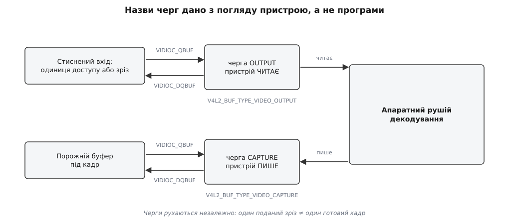
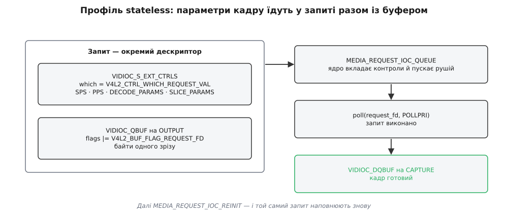

# 📋 Контракт V4L2 mem2mem: чим програма керує апаратним декодером

Довідник інтерфейсу, яким процес у просторі користувача змушує працювати апаратний декодер у Linux: які виклики, в якому порядку і з якими полями структур — від відкриття `/dev/videoN` до кадру, відданого назовні файловим дескриптором. Це рівно те, що роблять усередині елементи `v4l2h264dec` і `v4l2slh264dec`, і рівно те, що доводиться писати самому, коли декодер потрібен без конвеєра.

Керування йде тільки через [ioctl](root:sys-unix/ioctl-interface) — керуючий канал до драйвера, де кожна команда має свій номер, напрямок передачі й власну структуру-аргумент, а не потік байтів. Звичайних `read()` і `write()` на цьому вузлі немає взагалі: дані ходять чергами буферів, а `ioctl` лише переставляє буфери між програмою і драйвером.

## Вузол і перевірка придатності

Декодер — це файл пристрою `/dev/videoN`. Номер `N` нічого не гарантує: на одній платі під ним може бути камера, на іншій — масштабувальник, на третій — потрібний декодер. Тому першою дією після `open()` завжди йде `VIDIOC_QUERYCAP`.

| Поле `struct v4l2_capability` | Тип | Що містить |
|---|---|---|
| `driver[16]` | `__u8` | ім'я модуля ядра: `bcm2835-codec`, `hantro-vpu`, `rkvdec` |
| `card[32]` | `__u8` | назва пристрою для людини |
| `bus_info[32]` | `__u8` | де він сидить: `platform:…`, `PCI:…` |
| `version` | `__u32` | версія драйвера |
| `capabilities` | `__u32` | об'єднання можливостей **усіх** вузлів цього фізичного пристрою |
| `device_caps` | `__u32` | можливості **саме цього** відкритого вузла |
| `reserved[3]` | `__u32` | нулі |

Тут закладена пастка, на якій спотикаються всі, хто пише перший V4L2-код. Одна залізяка може виставляти кілька вузлів — скажімо, кодер і декодер, — і `capabilities` показує суму їхніх умінь. Питання «чи вміє **цей** вузол декодувати» відповідає лише `device_caps`, і читати його дозволено тільки тоді, коли в `capabilities` стоїть `V4L2_CAP_DEVICE_CAPS`.

| Прапорець | Значення | Що означає |
|---|---|---|
| `V4L2_CAP_VIDEO_M2M` | `0x00008000` | одноплощинний пам'ять-у-пам'ять |
| `V4L2_CAP_VIDEO_M2M_MPLANE` | `0x00004000` | багатоплощинний пам'ять-у-пам'ять |
| `V4L2_CAP_STREAMING` | `0x04000000` | черги буферів; без нього говорити нема про що |
| `V4L2_CAP_DEVICE_CAPS` | `0x80000000` | `device_caps` заповнено; сам ніколи не з'являється в `device_caps` |

```c
int fd = open("/dev/video0", O_RDWR | O_NONBLOCK);
if (fd < 0)
    return -1;

struct v4l2_capability cap;
memset(&cap, 0, sizeof cap);
if (ioctl(fd, VIDIOC_QUERYCAP, &cap) < 0)
    return -1;

__u32 caps = (cap.capabilities & V4L2_CAP_DEVICE_CAPS)
           ? cap.device_caps : cap.capabilities;

int mplane = !!(caps & V4L2_CAP_VIDEO_M2M_MPLANE);
int splane = !!(caps & V4L2_CAP_VIDEO_M2M);
if (!(mplane || splane) || !(caps & V4L2_CAP_STREAMING))
    return -1;                       /* це не декодер пам'ять-у-пам'ять */
```

Одноплощинний і багатоплощинний варіанти — це два паралельні набори типів буферів і два набори полів у `struct v4l2_format`. Драйвер зазвичай підтримує рівно один із них, і решта коду залежить від того, який саме: `fmt.fmt.pix` проти `fmt.fmt.pix_mp`, `V4L2_BUF_TYPE_VIDEO_CAPTURE` проти `V4L2_BUF_TYPE_VIDEO_CAPTURE_MPLANE`. Багатоплощинний набір потрібен там, де яскравість і кольоровість лежать у **різних** виділеннях пам'яті; на SoC це радше правило, ніж виняток.

## Дві черги



*Назви `OUTPUT` і `CAPTURE` дано з погляду пристрою: він читає з `OUTPUT` і пише в `CAPTURE`.*

| | `OUTPUT` | `CAPTURE` |
|---|---|---|
| Тип буфера | `V4L2_BUF_TYPE_VIDEO_OUTPUT(_MPLANE)` | `V4L2_BUF_TYPE_VIDEO_CAPTURE(_MPLANE)` |
| Що там лежить | стиснений бітпотік | декодовані кадри |
| Вміст пише | програма | пристрій |
| Формат задає | програма через `VIDIOC_S_FMT` | пристрій; програма читає `VIDIOC_G_FMT` і обирає з переліку |
| `VIDIOC_QBUF` означає | «ось робота» | «ось порожня тара» |
| `VIDIOC_DQBUF` означає | «тару звільнено» | «кадр готовий» |

Черги живуть окремо. Один поданий буфер зі зрізом не дає одного кадру: на початку потоку декодер поглинає кілька одиниць доступу, нічого не віддаючи, а при B-кадрах віддає їх не в тому порядку, в якому приймав. Тому цикл будують не як «подав — забрав», а як два незалежні обміни на одному дескрипторі, і `VIDIOC_DQBUF` на кожній черзі викликають лише тоді, коли [poll() каже](root:sys-unix/select-poll-epoll), що там щось є: `POLLOUT` — звільнився вхідний буфер, `POLLIN` — готовий кадр, `POLLPRI` — прийшла подія.

Зіставити кадр із його входом дозволяє мітка часу: декодер переносить `timestamp` з `OUTPUT`-буфера на той `CAPTURE`-буфер, що з нього вийшов. Драйвер повідомляє про це прапорцем `V4L2_BUF_FLAG_TIMESTAMP_COPY` у `v4l2_buffer.flags`. Мітка тут — не час показу, а просто ярлик; кладіть у неї що завгодно унікальне, аби впізнати кадр на виході.

## Формати на вході

Формат `OUTPUT` — це і є вибір кодека **й профілю розбору**. Один і той самий H.264 має різні fourcc залежно від того, хто розбирає бітпотік.

| fourcc | Ідентифікатор | Що подають у буфері | Профіль |
|---|---|---|---|
| `'H264'` | `V4L2_PIX_FMT_H264` | одиниця доступу зі стартовими кодами Annex B | stateful |
| `'AVC1'` | `V4L2_PIX_FMT_H264_NO_SC` | те саме, але без стартових кодів | stateful |
| `'M264'` | `V4L2_PIX_FMT_H264_MVC` | елементарний потік H.264 MVC | stateful |
| `'S264'` | `V4L2_PIX_FMT_H264_SLICE` | розібрані зрізи + контроли з параметрами | stateless |
| `'HEVC'` | `V4L2_PIX_FMT_HEVC` | одиниця доступу H.265 | stateful |
| `'S265'` | `V4L2_PIX_FMT_HEVC_SLICE` | розібрані зрізи H.265 | stateless |
| `'VP80'` / `'VP8F'` | `V4L2_PIX_FMT_VP8` / `_VP8_FRAME` | кадр VP8 / розібраний кадр | stateful / stateless |
| `'VP90'` / `'VP9F'` | `V4L2_PIX_FMT_VP9` / `_VP9_FRAME` | кадр VP9 / розібраний кадр | stateful / stateless |
| `'MPG2'` / `'MG2S'` | `V4L2_PIX_FMT_MPEG2` / `_MPEG2_SLICE` | картинка MPEG-2 / розібрані зрізи | stateful / stateless |
| `'AV1F'` | `V4L2_PIX_FMT_AV1_FRAME` | розібраний кадр AV1 | stateless |

Побачивши в переліку `VIDIOC_ENUM_FMT` формат із суфіксом `_SLICE` або `_FRAME`, ви вже знаєте головне про драйвер: розбирати потік доведеться самому.

Ще одна дрібниця, яку драйвер вирішити не може. Розмір стисненого буфера залежить від бітрейту, а не від роздільності, тож `sizeimage` для `OUTPUT` задає програма — і задає з запасом, бо один кадр після сцени зі спалахом буває вдесятеро більший за середній. Для 1080p зазвичай беруть від одного до кількох мебібайтів.

Формат `CAPTURE` натомість диктує пристрій: він знає, в якій розкладці його рушій уміє писати. Програма може лише перебрати `VIDIOC_ENUM_FMT` і, якщо там більше однієї позиції, обрати. Найчастіше це `V4L2_PIX_FMT_NV12` або його багатоплощинний двійник `V4L2_PIX_FMT_NV12M`; на SoC трапляються власні тайлові розкладки під окремим fourcc, які нічого, крім того самого чипа, не читає.

## Каркас потоку

| Виклик | Структура | Дія |
|---|---|---|
| `VIDIOC_ENUM_FMT` | `v4l2_fmtdesc` | перебрати формати черги |
| `VIDIOC_S_FMT` / `VIDIOC_G_FMT` | `v4l2_format` | задати / прочитати формат черги |
| `VIDIOC_REQBUFS` | `v4l2_requestbuffers` | створити (або знищити) буфери черги |
| `VIDIOC_CREATE_BUFS` | `v4l2_create_buffers` | додати буфери до наявних, не руйнуючи чергу |
| `VIDIOC_QUERYBUF` | `v4l2_buffer` | дізнатися зсув і розмір для `mmap()` |
| `VIDIOC_EXPBUF` | `v4l2_exportbuffer` | віддати буфер назовні як dma-buf |
| `VIDIOC_QBUF` / `VIDIOC_DQBUF` | `v4l2_buffer` | поставити буфер у чергу / забрати з неї |
| `VIDIOC_STREAMON` / `VIDIOC_STREAMOFF` | `int` (тип черги) | пустити / зупинити чергу |
| `VIDIOC_G_SELECTION` | `v4l2_selection` | видима частина кадру |
| `VIDIOC_SUBSCRIBE_EVENT` / `VIDIOC_DQEVENT` | `v4l2_event_subscription` / `v4l2_event` | підписка на події й їх забір |
| `VIDIOC_DECODER_CMD` | `v4l2_decoder_cmd` | злити хвіст, перезапустити |
| `VIDIOC_G_EXT_CTRLS` / `VIDIOC_S_EXT_CTRLS` | `v4l2_ext_controls` | читати й ставити контроли |

Майже кожен із них стосується **однієї** черги, і яка це черга — сказано полем `type` всередині структури, а не окремим аргументом. Звідси найпоширеніша помилка новачка: `VIDIOC_STREAMON` виконали один раз і чекають кадрів, а насправді пущено лише `OUTPUT`.

### Скільки буферів і звідки вони

```c
struct v4l2_requestbuffers rb;
memset(&rb, 0, sizeof rb);
rb.count  = 8;
rb.type   = V4L2_BUF_TYPE_VIDEO_CAPTURE_MPLANE;
rb.memory = V4L2_MEMORY_MMAP;
ioctl(fd, VIDIOC_REQBUFS, &rb);      /* rb.count може зменшитися */
```

| Поле `v4l2_requestbuffers` | Зміст |
|---|---|
| `count` | скільки просимо; драйвер повертає, скільки дав |
| `type` | яка черга |
| `memory` | `V4L2_MEMORY_MMAP` — пам'ять драйвера; `V4L2_MEMORY_DMABUF` — чужі буфери; `V4L2_MEMORY_USERPTR` — ваша пам'ять (для декодерів практично не трапляється) |
| `capabilities` | **заповнює драйвер**: що ця черга вміє |
| `flags` | додаткові властивості виділення |

Поле `capabilities` — найдешевший спосіб дізнатися правду про драйвер, бо воно приходить без жодного окремого запиту.

| Прапорець `V4L2_BUF_CAP_SUPPORTS_…` | Означає |
|---|---|
| `MMAP`, `USERPTR`, `DMABUF` | які типи пам'яті приймає черга |
| `REQUESTS` | черга працює з механізмом запитів — ознака stateless-декодера |
| `M2M_HOLD_CAPTURE_BUF` | вміє тримати кадр, поки їдуть решта зрізів |
| `ORPHANED_BUFS` | `REQBUFS` дозволено, поки буфери ще відображені або експортовані |
| `MMAP_CACHE_HINTS` | приймає підказки про кешування |

`count = 0` — не «нуль буферів», а команда звільнити чергу цілком: драйвер обриває чи доводить поточний обмін із пам'яттю, робить неявний `VIDIOC_STREAMOFF` і знищує буфери. Саме цим перевиділяють чергу `CAPTURE` при зміні роздільності.

За `V4L2_MEMORY_MMAP` пам'ять належить драйверові, а програма дістає до неї доступ через `VIDIOC_QUERYBUF` і `mmap()` за отриманим зсувом. Це той самий [механізм відображення файлу в пам'ять](root:sys-unix/mmap-model), тільки «файл» тут — вузол пристрою, а «зсув» — не позиція в файлі, а вигаданий драйвером ключ до конкретного буфера.

> 🔧 **Навіщо це.** Кількість буферів `CAPTURE` — не смак, а умова, за якої декодер узагалі рухається. Рушій тримає опорні кадри, поки вони потрібні для передбачення, і якщо вільних буферів менше, ніж глибина буфера декодованих зображень, він зупиняється й чекає. Мінімум для потоку повідомляє контрол `V4L2_CID_MIN_BUFFERS_FOR_CAPTURE`; до нього додають стільки, скільки кадрів ваш код тримає в руках одночасно.

### Поля `v4l2_buffer` під час обміну

| Поле | `QBUF` на `OUTPUT` | `QBUF` на `CAPTURE` | `DQBUF` |
|---|---|---|---|
| `type`, `memory`, `index` | заповнює програма | заповнює програма | `type` і `memory` — програма |
| `bytesused` | **обов'язково**: скільки байтів даних | ігнорується | ставить драйвер |
| `timestamp` | ярлик кадру | ігнорується | скопійовано з `OUTPUT` |
| `field` | `V4L2_FIELD_NONE` для прогресивного | — | ставить драйвер |
| `flags` | `0` або прапорці запиту | `0` | читає програма |
| `m.fd` | дескриптор dma-buf за `V4L2_MEMORY_DMABUF` | те саме | повертається без змін |
| `m.planes`, `length` | масив площин для багатоплощинного набору | те саме | масив **треба подати** й на `DQBUF` |
| `request_fd` | дескриптор запиту, якщо стоїть `V4L2_BUF_FLAG_REQUEST_FD` | не вживається | — |

Прапорці, які має сенс читати на виході: `V4L2_BUF_FLAG_ERROR` — кадр зіпсований, але потік живий (показувати таке чи ні, вирішує програма); `V4L2_BUF_FLAG_LAST` — це останній кадр перед кінцем зливання або перед зміною роздільності.

| Помилка `DQBUF` | Що сталося |
|---|---|
| `EAGAIN` | неблокуючий режим, у черзі порожньо — не помилка, а «ще нічого» |
| `EPIPE` | буфер із `V4L2_BUF_FLAG_LAST` уже забрано, більше не буде до перезапуску |
| `EINVAL` | не той тип черги, індекс поза межами, негодящий `request_fd` |
| `EBUSY` | змішали подання через запити з поданням напряму |
| `EBADR` | черга не приймає запитів або, навпаки, вимагає їх |
| `EIO` | внутрішній збій драйвера |

## Профіль stateful

Прошивка сама читає заголовки, тож програмі не треба знати про потік нічого — навіть роздільності. Ціна: вона й дізнається про роздільність останньою, з події.

| Крок | Виклик | Примітка |
|---|---|---|
| 1 | `VIDIOC_SUBSCRIBE_EVENT` на `V4L2_EVENT_SOURCE_CHANGE` | **до** пуску потоку |
| 2 | `VIDIOC_S_FMT` на `OUTPUT` | fourcc кодека і `sizeimage` |
| 3 | `VIDIOC_REQBUFS` на `OUTPUT` | 2–4 буфери вистачає |
| 4 | `VIDIOC_STREAMON` на `OUTPUT` | `CAPTURE` ще не існує |
| 5 | `QBUF`/`DQBUF` на `OUTPUT` | годуємо потоком, кадрів поки нема |
| 6 | `VIDIOC_DQEVENT` → `V4L2_EVENT_SRC_CH_RESOLUTION` | заголовок розібрано |
| 7 | `VIDIOC_G_FMT` на `CAPTURE` | звідси справжні розміри й розкладка |
| 8 | `VIDIOC_G_SELECTION` на `CAPTURE` | видима частина |
| 9 | `VIDIOC_G_EXT_CTRLS`, `V4L2_CID_MIN_BUFFERS_FOR_CAPTURE` | скільки буферів треба |
| 10 | `VIDIOC_REQBUFS` на `CAPTURE` | мінімум плюс ваш запас |
| 11 | `VIDIOC_STREAMON` на `CAPTURE` | кадри пішли |

Крок 8 не косметичний. Кремній працює макроблоками, тому буфер завжди вирівняно вгору: потік 1080p декодується в буфер висотою 1088, і останні вісім рядків — сміття, яке не можна показувати.

| Ціль `VIDIOC_G_SELECTION` на `CAPTURE` | Що повертає |
|---|---|
| `V4L2_SEL_TGT_CROP_BOUNDS` | закодована роздільність, вирівняна на макроблок |
| `V4L2_SEL_TGT_CROP_DEFAULT` | видима частина кадру |
| `V4L2_SEL_TGT_COMPOSE` | прямокутник у буфері, куди рушій кладе кадр |
| `V4L2_SEL_TGT_COMPOSE_PADDED` | те саме плюс вирівнювання, яке апарат теж записав |

**Зміна роздільності посеред потоку.** Подія `V4L2_EVENT_SOURCE_CHANGE` приходить не лише на початку — вона приходить щоразу, коли в потоці змінюються параметри послідовності. Порядок дій жорсткий: дочекатися на `CAPTURE` буфера з `V4L2_BUF_FLAG_LAST` (це останній кадр старого розміру), `VIDIOC_STREAMOFF` на `CAPTURE`, `VIDIOC_REQBUFS` з `count = 0`, потім кроки 7–11 наново. Черга `OUTPUT` при цьому не зупиняється й нічого не втрачає.

**Злити хвіст.** Коли вхід скінчився, у рушії ще сидять кадри. `VIDIOC_DECODER_CMD` з `cmd = V4L2_DEC_CMD_STOP` наказує їх віддати; програма забирає `CAPTURE`-буфери, доки не прийде той із `V4L2_BUF_FLAG_LAST`. Якщо кадрів уже не було, драйвер віддасть порожній буфер із `bytesused = 0` і цим самим прапорцем. Наступний `DQBUF` поверне `EPIPE` — це нормальний кінець, а не збій. Продовжити той самий сеанс дозволяє `V4L2_DEC_CMD_START`.

**Перемотування.** `VIDIOC_STREAMOFF` на `OUTPUT` викидає все, що ви подали й що ще не розібрано, і скидає стан розбору; черга `CAPTURE` при цьому не чіпається. Після `VIDIOC_STREAMON` годувати треба з ключового кадру.

## Профіль stateless



*Параметри кадру не мають власного місця в потоці — вони їдуть у запиті разом із буфером.*

Тут прошивки-розбирача немає взагалі, і всю синтаксичну роботу робить програма: читає SPS і PPS, будує буфер декодованих зображень, вираховує списки опорних кадрів. Драйверу дістаються сирі байти зрізу **плюс** повний набір параметрів — і от де вони не помістилися в стару модель. Контроли V4L2 глобальні для пристрою: поставили значення — воно чинне відтепер. Для декодування це нікуди не годиться, бо кожен кадр має власні параметри, а буфери йдуть конвеєром і виконуються не миттєво. Механізм запитів (Request API) саме це й лагодить: контроли й буфер складають в один пакет, який виконується цілком.

| Крок | Виклик | Примітка |
|---|---|---|
| 1 | `MEDIA_IOC_REQUEST_ALLOC` на `/dev/mediaN` | повертає дескриптор запиту |
| 2 | `VIDIOC_S_EXT_CTRLS` з `which = V4L2_CTRL_WHICH_REQUEST_VAL`, `request_fd` | значення **зберігаються**, а не застосовуються |
| 3 | `VIDIOC_QBUF` на `OUTPUT` з `V4L2_BUF_FLAG_REQUEST_FD` і `request_fd` | буфер належить запитові |
| 4 | `VIDIOC_QBUF` на `CAPTURE` **звичайно** | кадри в запити не кладуть — це `EBADR` |
| 5 | `MEDIA_REQUEST_IOC_QUEUE` на дескрипторі запиту | без жодного буфера — `ENOENT` |
| 6 | `poll()` на дескрипторі запиту, `POLLPRI` | виконано |
| 7 | `VIDIOC_DQBUF` на обох чергах | кадр і звільнений вхід |
| 8 | `MEDIA_REQUEST_IOC_REINIT` | очистити й наповнити знову |

Два обмеження, які легко проґавити. Змішувати подання через запити з поданням буферів напряму на одній черзі не можна — це `EBUSY`; заборона знімається закриттям дескриптора, `VIDIOC_STREAMOFF` або `VIDIOC_REQBUFS`. І ставити один і той самий контрол обома шляхами — і в запиті, і напряму — документація ядра називає невизначеною поведінкою, тому на практиці всі шість контролів H.264 кладуть у кожен запит, навіть незмінні.

| Контрол | Структура-навантаження | Що описує |
|---|---|---|
| `V4L2_CID_STATELESS_H264_SPS` | `v4l2_ctrl_h264_sps` | набір параметрів послідовності |
| `V4L2_CID_STATELESS_H264_PPS` | `v4l2_ctrl_h264_pps` | набір параметрів картинки |
| `V4L2_CID_STATELESS_H264_SCALING_MATRIX` | `v4l2_ctrl_h264_scaling_matrix` | матриці масштабування коефіцієнтів |
| `V4L2_CID_STATELESS_H264_PRED_WEIGHTS` | `v4l2_ctrl_h264_pred_weights` | таблиця ваг зваженого передбачення |
| `V4L2_CID_STATELESS_H264_SLICE_PARAMS` | `v4l2_ctrl_h264_slice_params` | заголовок зрізу й списки опорних кадрів |
| `V4L2_CID_STATELESS_H264_DECODE_PARAMS` | `v4l2_ctrl_h264_decode_params` | стан буфера декодованих зображень на цей кадр |

Два контроли-модифікатори кажуть драйверові, як саме нарізано вхід. Значення в них не вигадують — їх читають меню контролю, бо апарат зазвичай уміє рівно одне.

| Контрол | Значення |
|---|---|
| `V4L2_CID_STATELESS_H264_DECODE_MODE` | `V4L2_STATELESS_H264_DECODE_MODE_SLICE_BASED` (0) — один буфер = один зріз; `…_FRAME_BASED` (1) — один буфер = усі зрізи кадру |
| `V4L2_CID_STATELESS_H264_START_CODE` | `V4L2_STATELESS_H264_START_CODE_NONE` (0) — голі зрізи; `…_ANNEX_B` (1) — зі стартовими кодами |

**Кілька зрізів на один кадр.** У режимі за зрізами кілька запитів працюють на один і той самий `CAPTURE`-буфер, і віддавати його після першого ж зрізу не можна. Для цього є прапорець `V4L2_BUF_FLAG_M2M_HOLD_CAPTURE_BUF` на `OUTPUT`-буфері: доки він стоїть, кадр лишається в драйвері. Черга мусить оголосити `V4L2_BUF_CAP_SUPPORTS_M2M_HOLD_CAPTURE_BUF` — інакше багатозрізні потоки на цьому апараті просто не зберуться.

Тонкість у тому, що «останній зріз кадру» розпізнають лише за початком наступного. Тому програма тримає буфер і на останньому зрізі теж, а коли з'ясовується, що кадр скінчився (або скінчився весь потік), віддає його командою `VIDIOC_DECODER_CMD` з `cmd = V4L2_DEC_CMD_FLUSH`.

## Кадр назовні: `VIDIOC_EXPBUF`

Буфер `CAPTURE` лежить у пам'яті драйвера. Щоб віддати кадр далі — на екран, у кодер, у графічний конвеєр — не копіюючи, його перетворюють на dma-buf: спільний буфер ядра, представлений [файловим дескриптором](root:sys-unix/dma-and-buffers), який будь-який інший драйвер може імпортувати й прочитати ту саму фізичну пам'ять.

| Поле `v4l2_exportbuffer` | Зміст |
|---|---|
| `type` | тип черги, звідки беремо |
| `index` | номер буфера |
| `plane` | номер площини; для одноплощинного набору — `0` |
| `flags` | `O_CLOEXEC`, `O_RDONLY`, `O_WRONLY`, `O_RDWR` |
| `fd` | **виходить**: дескриптор dma-buf |

```c
struct v4l2_exportbuffer eb;
memset(&eb, 0, sizeof eb);
eb.type  = V4L2_BUF_TYPE_VIDEO_CAPTURE_MPLANE;
eb.index = buf_index;
eb.plane = 0;                     /* NV12M: 0 — яскравість, 1 — кольоровість */
eb.flags = O_CLOEXEC | O_RDONLY;
if (ioctl(fd, VIDIOC_EXPBUF, &eb) == 0)
    give_to_display(eb.fd);       /* закрити, коли більше не потрібен */
```

Експорт нічого не забирає: буфер лишається в черзі, його так само ставлять у чергу й забирають, а дескриптор — просто друга ручка до тієї самої пам'яті. Багатоплощинний буфер експортують по площині, тож NV12M дає два дескриптори. `EINVAL` тут означає одне з чотирьох: черга не в режимі `MMAP`, драйвер не вміє експортувати, або хибний `index`/`plane`.

Той самий місток працює й у зворотний бік. Якщо чергу `CAPTURE` створити з `memory = V4L2_MEMORY_DMABUF`, то буфери виділяє не декодер, а хтось інший — наприклад драйвер дисплея, — і програма подає їхні дескриптори в полі `m.fd` при `VIDIOC_QBUF`. Декодер тоді пише кадр одразу в ту пам'ять, з якої його покажуть.

## Мінімальний цикл

```c
/* Один прохід stateful-декодера. Обробку помилок скорочено. */
static int decode_step(int fd, struct v4l2_plane *op, struct v4l2_plane *cp)
{
    struct pollfd pfd = { .fd = fd, .events = POLLIN | POLLOUT | POLLPRI };
    if (poll(&pfd, 1, 500) <= 0)
        return 0;

    if (pfd.revents & POLLPRI) {           /* зміна роздільності */
        struct v4l2_event ev;
        memset(&ev, 0, sizeof ev);
        ioctl(fd, VIDIOC_DQEVENT, &ev);
        if (ev.type == V4L2_EVENT_SOURCE_CHANGE &&
            (ev.u.src_change.changes & V4L2_EVENT_SRC_CH_RESOLUTION))
            return RESETUP_CAPTURE;
    }

    if (pfd.revents & POLLOUT) {           /* звільнився вхідний буфер */
        struct v4l2_buffer b;
        memset(&b, 0, sizeof b);
        b.type     = V4L2_BUF_TYPE_VIDEO_OUTPUT_MPLANE;
        b.memory   = V4L2_MEMORY_MMAP;
        b.m.planes = op;
        b.length   = 1;
        if (ioctl(fd, VIDIOC_DQBUF, &b) == 0)
            refill_and_queue(fd, &b);      /* наступна одиниця доступу */
    }

    if (pfd.revents & POLLIN) {            /* готовий кадр */
        struct v4l2_buffer b;
        memset(&b, 0, sizeof b);
        b.type     = V4L2_BUF_TYPE_VIDEO_CAPTURE_MPLANE;
        b.memory   = V4L2_MEMORY_MMAP;
        b.m.planes = cp;
        b.length   = 2;                    /* NV12M: дві площини */
        if (ioctl(fd, VIDIOC_DQBUF, &b) < 0)
            return (errno == EPIPE) ? STREAM_END : 0;
        if (b.flags & V4L2_BUF_FLAG_LAST)
            return DRAIN_DONE;
        if (!(b.flags & V4L2_BUF_FLAG_ERROR))
            use_frame(fd, b.index, b.timestamp);
        ioctl(fd, VIDIOC_QBUF, &b);        /* тару — назад у чергу */
    }
    return 0;
}
```

Тут видно все, що робить контракт незручним і водночас робочим: один дескриптор на дві черги, події окремим каналом, повернення тари як обов'язок програми. Забути останній `VIDIOC_QBUF` — і декодер стане через кілька кадрів, коли скінчиться пул.

## Первинні джерела

Документація ядра — єдине місце, де ці інтерфейси описані нормативно, і вона змінюється разом із ними.

- [Stateful Video Decoder Interface](https://docs.kernel.org/userspace-api/media/v4l/dev-decoder.html) — послідовності ініціалізації, зміни роздільності, зливання й перемотування.
- [Stateless Video Decoder Interface](https://docs.kernel.org/userspace-api/media/v4l/dev-stateless-decoder.html) — вимоги до запитів, утримання кадру, порядок контролів.
- [Request API](https://docs.kernel.org/userspace-api/media/mediactl/request-api.html) — життєвий цикл запиту й правила змішування.
- [Codec Control Reference (stateless)](https://docs.kernel.org/userspace-api/media/v4l/ext-ctrls-codec-stateless.html) — поля структур `v4l2_ctrl_h264_*`.
- [Compressed Video Formats](https://docs.kernel.org/userspace-api/media/v4l/pixfmt-compressed.html) — повний перелік fourcc з поділом на профілі.
