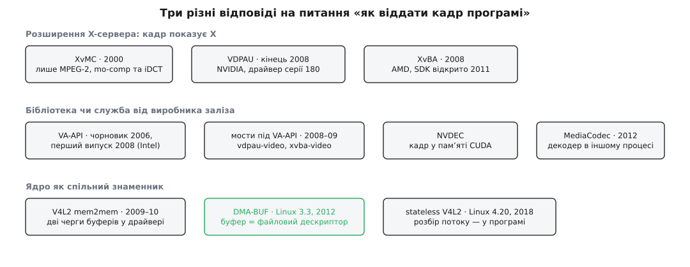

# 📜 Як Linux отримав чотири інтерфейси декодування замість одного

Коли в чипі зʼявився блок, що вміє декодувати відео, комусь треба було описати, як до нього достукатися, — і кожного разу цей опис писав виробник заліза, під власний кремній. Звідси й вийшло, що замість одного інтерфейсу у світі Unix живуть VA-API, VDPAU, XvBA, V4L2 та MediaCodec, і жоден із них не переміг остаточно. Ця історія варта переказу не через імена й дати, а через причину: фрагментація тут — не наслідок чиєїсь недбалості чи впертості, а прямий наслідок того, що інтерфейс декодування описує межу поділу праці між кремнієм і програмою, а цю межу кожен виробник провів у своєму місці.

*Три ряди — три різні уявлення про те, де взагалі мусить жити такий інтерфейс. Спільним знаменником зрештою став найнижчий із них.*

## XvMC: коли прискорення було справою X-сервера

Перша спроба датується 2000 роком. Специфікацію X-Video Motion Compensation написав Марк Войкович (Mark Vojkovich); перший чорновик — 6 вересня 2000-го, другий — 31 жовтня того ж року, і саме другий розширив інтерфейс так, щоб пристроєві можна було віддавати не лише компенсацію руху, а й обернене дискретне косинусне перетворення. XvMC був розширенням Xv — тієї частини X-сервера, яка вміла масштабувати й показувати відео, — і саме тому опинився там, де опинився: у 2000-му єдиним, хто мав доступ до відеокарти, був X-сервер, тож будь-яка розмова з відеозаліззям ішла через нього.

Це був перший unix-відповідник Microsoft DirectX Video Acceleration. І він майже одразу застарів, причому не з вини авторів. XvMC описує рівно ту межу поділу праці, яку залізо 2000 року вміло тримати: програма сама розбирає бітпотік і сама робить ентропійне декодування, а пристроєві віддає вже готові коефіцієнти й вектори руху. Стандарт, під який його писали, — MPEG-2. Коли зʼявилися H.264 і VC-1, виявилося дві незручні речі. По-перше, у них ентропійне кодування (CABAC) настільки дороге, що виносити в кремній треба саме його, а це зовсім інша межа — «слайсовий рівень», VLD. По-друге, кожен новий стандарт приносить власний набір параметрів послідовності, кадру й зрізу, і кожен такий набір довелося б вписувати в протокол X-сервера окремими запитами. Розширювати XvMC було дорожче, ніж почати спочатку: до речі, єдиним помітним винятком лишилося залізо VIA Unichrome, драйвер якого підтримував через XvMC і VLD, і MPEG-4 ASP — рідкісний доказ того, що технічно це було можливо, просто нікому не вигідно.

## VA-API: інтерфейс окремо від драйвера

Наступний хід зробила Intel. Перший чорновик Video Acceleration API — ревізія 0.10, датована 10 грудня 2006 року, автор Джонатан Біан (Jonathan Bian) з Intel; на списку розсилки x.org специфікацію оголосили в березні 2007-го, і протягом усього 2007-го Біан випускав нові ревізії. Перший практичний випуск бібліотеки `libva` — версія 0.29, лютий 2008-го. Задум був сформульований прямо: замінити XvMC і стати тим, чим для Windows є DXVA. Пізніше, у ревізії 0.30 (березень 2009), до декодування додали ще й кодування — цього не вміла жодна з конкурентних відповідей.

Головне рішення VA-API — не в наборі функцій, а в тому, де він живе. Це не розширення X-протоколу, а звичайна бібліотека простору користувача з чітко відокремленою реалізацією: інтерфейс окремо, драйвер під конкретне залізо окремо. Спочатку це виглядало як слабкість — перший час єдиною справжньою реалізацією був закритий драйвер `psb-video` під чипсети Poulsbo, — але саме ця конструкція дала VA-API довголіття. Драйвери можна дописувати, не чіпаючи інтерфейсу, і сьогодні під ним живуть і `iHD` для Intel, і реалізація AMD через Mesa, і навіть шар над NVIDIA.

VA-API описує іншу межу, ніж XvMC: програма розбирає заголовки й віддає структури параметрів разом із сирими байтами зрізів, а ентропійне декодування вже на пристрої. Вихід — не масив пікселів, а `VASurfaceID`, номер поверхні всередині драйвера. Читати цю поверхню процесором можна, але дорого: вона живе в памʼяті пристрою й розкладена так, як зручно кремнію, а не програмі.

## VDPAU: NVIDIA пише свій, бо їй потрібно більше

Наприкінці 2008 року NVIDIA випустила драйвер серії 180 (VDPAU зʼявився у версії 180.06), і разом з ним — Video Decode and Presentation API for Unix. Окрему бібліотеку `libvdpau`, щоб інтерфейс могли реалізувати й інші виробники, NVIDIA виклала пізніше: анонс версії 0.2 зробив Аарон Платтнер (Aaron Plattner) 17 вересня 2009-го, ліцензія MIT, подальший супровід — на freedesktop.org.

Спокуслива й неправильна відповідь на питання «чому NVIDIA не взяла VA-API» — «бо NVIDIA». Насправді причин дві, і обидві технічні. Перша — час: VA-API у 2008-му ще був специфікацією з однією закритою реалізацією під чужий чипсет, а в NVIDIA вже працював PureVideo у кремнії та власний драйвер, і чекати, поки чужий інтерфейс визріє, означало не випустити нічого. Друга й важливіша — обсяг: у назві VDPAU не дарма стоїть **presentation**. NVIDIA описувала не «як декодувати», а весь шлях кадру — декодування, постобробку (деінтерлейсинг, шумозаглушення), змішування шарів і показ на екрані. Це рівно те, що вміє їхній кремній, і рівно та межа, яку вони провели. Інтерфейс, у якому декодування закінчується поверненням поверхні комусь іншому, для цього просто замалий.

## XvBA: як не треба відкривати інтерфейс

Третій виробник, AMD, у 2008-му ввімкнув у драйвері Catalyst 8.10 підтримку блоку UVD2 і завів власне розширення — X-Video Bitstream Acceleration. Про нього першим написав Phoronix того ж 2008-го, і на цьому публічна історія майже закінчилася: сам API лишався непублічним, а єдиним практичним способом до нього достукатися був сторонній фронтенд під VA-API. Офіційний SDK AMD виклала аж 24 лютого 2011 року.

Три роки затримки вирішили долю XvBA. За цей час користувачі вже або сиділи на VA-API, або на VDPAU, розробники вільних програвачів не мали за що вхопитися, а всередині самої AMD дозрів інший план — відкриті драйвери в Mesa з реалізацією VA-API та VDPAU. Коли SDK нарешті вийшов, для нього вже не було ніші. Це найчистіший приклад того, що інтерфейс без реалізацій і без документації вчасно — не інтерфейс, а внутрішня деталь драйвера.

## Мости: доказ, що моделі майже збігаються

Наприкінці 2008-го стався сюжет, який пояснює природу всієї фрагментації краще за будь-які маніфести. Компанія Splitted-Desktop Systems вибрала VA-API для своїх малопотужних Linux-коробок, і її розробник Ґвеноле Бошен (Gwenolé Beauchesne) написав мости: `vdpau-video` і `xvba-video` — реалізації VA-API, під якими насправді працювали VDPAU і XvBA. Пізніше зʼявився міст у зворотний бік, `libvdpau-va-gl`.

Мости працювали. Це означає, що моделі декодування в трьох інтерфейсах були близькі: скрізь програма розбирає потік до рівня зрізів, скрізь пристрій повертає непрозору поверхню, скрізь кадр лишається в памʼяті пристрою. Але мости працювали **не повністю**: через VDPAU не можна було дістати кодування, якого VDPAU не має; постобробка й керування поверхнями поводилися по-різному; а найдорожче губилося на стиках памʼяті — кадр, що народився поверхнею одного інтерфейсу й мусить стати поверхнею іншого, часто доводилося копіювати. Виходило, що інтерфейси розходяться не в тому, які кнопки натискати, а в тому, чиєю власністю є буфер і хто вирішує, як він розкладений.

## Паралельний світ: SoC, у яких немає ні X, ні відеокарти

Поки три виробники настільних GPU ділили спадок XvMC, у світі мобільних і вбудованих чипів це змагання не мало сенсу. Там немає ні X-сервера, ні «драйвера відеокарти» в звичному сенсі — є окремий блок IP на шині, часто куплений у третьої компанії, і драйвер до нього в ядрі. Питання «як програмі дістатися до декодера» там зводиться до питання «як програмі дістатися до пристрою», а на нього в Linux відповідь давно є: вузол у `/dev`, черги буферів і керуючі виклики.

Так у підсистемі [V4L2](root:sys-unix/v4l2-video-devices) виріс режим **памʼять-у-памʼять**: драйвер відкриває дві черги, з однієї читає, у другу пише. Допоміжний каркас `v4l2-mem2mem` у ядрі написали Павел Осьцяк (Paweł Ościak) і Марек Шиправський (Marek Szyprowski) із Samsung — копірайт у файлі стоїть 2009–2010 роками. Тут не було ані нового API, ані розмови про стандарт: декодер просто оголосили ще одним різновидом відеопристрою, який нічого не знімає, а перетворює.

Другий крок зробили заради найдешевшого кремнію. Рушії в бюджетних SoC часто не мають прошивки, здатної самостійно розбирати бітпотік і стежити за станом послідовності, — вони вміють лише відновити один кадр за готовим набором параметрів. Під них у ядрі зробили **stateless**-профіль: програма розбирає потік сама й подає параметри кожного кадру через механізм запитів (Request API), а драйвер лише запускає кремній. Першим таким драйвером у головній гілці став Cedrus для чипів Allwinner — Linux 4.20, кінець 2018-го. Показово, що це та сама межа, яку VA-API провів на дванадцять років раніше: коли кремній не має парсера, розбір неминуче лишається програмі, і не має значення, десктоп це чи телефон.

## DMA-BUF: перемирʼя на поверх нижче

Спільного інтерфейсу декодування так і не зʼявилося. Зате зʼявився спільний інтерфейс **буфера** — і саме він виявився тим, чого всі шукали.

Набір патчів для розділяння DMA-буферів між драйверами вперше надіслав Марек Шиправський у серпні 2011-го; далі його підхопив і суттєво переробив Суміт Семвал (Sumit Semwal), і в такому вигляді механізм увійшов у Linux 3.3 навесні 2012 року. Ідея гранично проста: буфер, до якого має доступ пристрій, отримує файловий дескриптор, а файловий дескриптор — це те, що в Unix уміє передати куди завгодно будь-хто. Далі [передача без копіювання](root:sys-unix/zero-copy) між декодером, композитором і кодером стає питанням не спільного API, а спільного дескриптора: [DMA-BUF](root:sys-unix/dma-buf) описує, як саме буфер експортують, імпортують і синхронізують.

Ось чому перемир'я вкоренилося саме тут. Про те, хто розбирає бітпотік, виробники сперечалися чесно — у них справді різний кремній. Але про те, як передати готовий кадр далі, сперечатися нічого: тут ніякої переваги в конкуренції немає, є лише спільна втрата. А оскільки цей механізм живе в ядрі, на нього поширюється залізне правило [сталості інтерфейсу простору користувача](root:sys-unix/kernel-abi-stability) — те, чого не мала жодна бібліотека виробника.

## Ще одна відповідь: Android

Android розвʼязував ту саму задачу під іншим обмеженням. Клас `MediaCodec` зʼявився в Android 4.1 (API 16) у липні 2012-го, і внизу під ним лежав OpenMAX IL — інтерфейс, через який виробник чипа під'єднував свій кодек до системного рушія. Ключова відмінність не в моделі декодування, а в тому, що декодер працює **в іншому процесі**: програма не має прав розмовляти з пристроєм напряму. Звідси й фірмовий режим, коли кадр віддають не програмі, а прямо на `Surface` — тобто в чергу композитора; програма його жодного разу не бачить, і саме тому він дешевий.

## Що з цього лишилося

Розстановка сил, яку ми маємо сьогодні, читається просто, якщо дивитися на конструкцію, а не на бренди. VA-API дожив, бо єдиний із чотирьох відокремив інтерфейс від драйвера, — під ним змінилося вже кілька поколінь заліза й кілька виробників. VDPAU законсервувався: він робить те, що робив, його підтримують, але нових меж він не описує. XvBA помер від того, що його три роки не показували. V4L2 виріс знизу вгору й тепер покриває майже все, що не десктоп. А спільним знаменником усіх чотирьох став не інтерфейс декодування, а DMA-BUF — рівень, на якому їм нічого ділити.

І остання спроба звести все докупи вже теж є: Khronos додала до Vulkan розширення для декодування й кодування відео, знову з наміром дати один інтерфейс на всіх. Її шанси варто оцінювати тим самим критерієм, який пояснює всю цю історію: чи описує вона межу, яку кожен виробник справді провів у своєму кремнії, — чи ту, яку зручно було описати авторам.

**Джерела:** [Video Acceleration API (Wikipedia)](https://en.wikipedia.org/wiki/Video_Acceleration_API) · [VA API slowly — but surely — making progress (LWN, 2009)](https://lwn.net/Articles/339349/) · [X-Video Motion Compensation (Wikipedia)](https://en.wikipedia.org/wiki/X-Video_Motion_Compensation) · [VDPAU (Wikipedia)](https://en.wikipedia.org/wiki/VDPAU) · [X-Video Bitstream Acceleration (Wikipedia)](https://en.wikipedia.org/wiki/X-Video_Bitstream_Acceleration) · [DMA buffer sharing in 3.3 (LWN)](https://lwn.net/Articles/474819/) · [V4L2 memory-to-memory (kernel.org)](https://www.kernel.org/doc/html/latest/driver-api/media/v4l2-mem2mem.html) · [Stateless decoder interface (kernel.org)](https://docs.kernel.org/userspace-api/media/v4l/dev-stateless-decoder.html)
