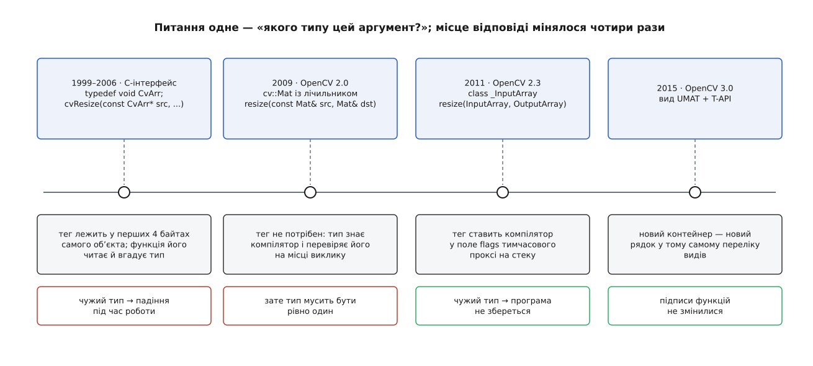

# 📜 Від `void*` до типобезпечного проксі: чотири відповіді на одне питання

Питання, на яке OpenCV відповідала чотири рази за півтора десятиліття, коротке: як одна наперед зібрана функція може приймати різні контейнери пікселів. Відповіді змінювалися, а конструкція — ні: і в 1999-му, і сьогодні справжній вид аргумента записано кількома бітами цілого числа, а функція розбирає ці біти під час роботи. Мінялося одне — **хто ці біти ставить**. Це й пояснює, чому теперішній `InputArray` виглядає саме так.



*Питання лишається тим самим на всіх чотирьох етапах; змінюється місце, де на нього відповідають, — і разом із ним момент, коли виявляється помилка.*

## Метатип, якого немає в мові

У C-інтерфейсі 1.x параметр «будь-який масив» називався `CvArr`. Ось увесь його опис у заголовку:

```c
typedef void CvArr;
```

Тобто `const CvArr*` після препроцесора — це буквально `const void*`. Ім'я `CvArr` існувало для людини, яка читає довідник, а не для компілятора: він бачив нетипізований покажчик і не перевіряв нічого. Так виглядала кожна функція обробки:

```c
void cvResize(const CvArr* src, CvArr* dst, int interpolation CV_DEFAULT(CV_INTER_LINEAR));
void cvSmooth(const CvArr* src, CvArr* dst, int smoothtype, int size1, int size2, double s1, double s2);
```

Довідник самої бібліотеки не приховував механіки й називав `CvArr` метатипом: функція приймає масиви кількох типів — `IplImage*`, `CvMat*`, іноді навіть `CvSeq*`, — а «конкретний тип масиву визначається під час роботи аналізом перших 4 байтів заголовка».

## Підпис у перших чотирьох байтах

Аналіз чотирьох байтів — не метафора. Структура `CvMat` починається полем `type`, і старші шістнадцять бітів цього поля зайняті сталою, яку в код заклали навмисно:

```c
#define CV_MAT_MAGIC_VAL    0x42420000
#define CV_MATND_MAGIC_VAL  0x42430000

#define CV_IS_MAT_HDR(mat) \
    ((mat) != NULL && \
    (((const CvMat*)(mat))->type & CV_MAGIC_MASK) == CV_MAT_MAGIC_VAL && \
    ((const CvMat*)(mat))->cols > 0 && ((const CvMat*)(mat))->rows > 0)
```

Байт `0x42` — це код літери `B` у ASCII, тож підпис двовимірної матриці читається як `BB`, а багатовимірної — як `BC`. Молодші біти того самого поля тримають глибину й кількість каналів. Одне ціле число, поділене навпіл: старша половина відповідає «що це таке», молодша — «з чого воно складається». Запам'ятайте цей поділ, бо через дванадцять років він повернеться майже незмінним.

З `IplImage` вийшло цікавіше — магічного числа в ньому немає, бо структура не своя: її, як прямо каже довідник, узято з Intel Image Processing Library, де цей формат рідний. Перевіряти довелося тим, що є, а перше поле там — `nSize`:

```c
#define CV_IS_IMAGE_HDR(img) \
    ((img) != NULL && ((const IplImage*)(img))->nSize == sizeof(IplImage))
```

Підписом зображення був **його власний розмір у байтах**. Працює це рівно доти, доки всі учасники зібрані з однаковим вирівнюванням полів і однаковою версією структури; будь-яке ціле число, що випадково дорівнює `sizeof(IplImage)`, перевірку теж проходить. Заради повноти картини варто сказати, що це не вада OpenCV, а наслідок рішення взяти чужий контейнер разом із його історією — про саму ту спадщину докладніше в [«Від cvReleaseImage до UMatData»](topic:sys-media/mat-memory-model/hist-mat-vs-iplimage.md).

Розбір виду не розсипався по всій бібліотеці — його зібрали в одну лійку:

```c
CvMat* cvGetMat(const CvArr* arr, CvMat* header, int* coi CV_DEFAULT(NULL), int allowND CV_DEFAULT(0));
```

Якщо всередині вже `CvMat` — повертається той самий покажчик; якщо `IplImage` — заповнюється переданий `header` за параметрами поточної ROI; якщо дані відсутні — повідомляється помилка. Окремим виходом іде `coi`: канал інтересу в `CvMat` подати нема куди, тож його віддають назовні. Практично кожна функція бібліотеки починалася з виклику цієї лійки — і лише після неї працювала з однорідним заголовком.

Сама ідея «покласти тег типу в перше поле структури й розбирати його вручну» — не винахід OpenCV, а звичайний спосіб побудувати [об'єктну систему поверх C](topic:sf-lang/object-system-in-c): мова не дає ані спільного предка, ані запиту типу, тож і те, й те роблять даними.

## Чому це трималося — і де ламалося

Трималося з двох причин. По-перше, ціна нульова: перевірка виду — це одне читання цілого числа й одне порівняння, тобто дешевше за будь-який виклик функції. По-друге, `void*` — найпростіша річ, яку взагалі можна покласти на межу бібліотеки: сигнатура не змінюється ніколи, її однаково розуміють C, C++, Python і всі обгортки, а `.so` можна замінити новішою, не перезбираючи чужий код.

Ламалося ж у місці, яке коштує найдорожче. Компілятор **знав** справжній тип аргумента на місці виклику — і викидав це знання, бо параметр був `void*`. Далі бібліотека витрачала такти, щоб вгадати назад те, що вже було відоме безплатно. А коли вгадування не сходилося, дізнавалися про це не під час збірки, а посеред роботи: передали не той покажчик — і замість повідомлення компілятора отримали помилку з надр `cvGetMat`, у найкращому разі. У найгіршому — покажчик указував на щось стороннє, і перевірка сама читала чужу пам'ять, щоб порівняти її з `0x42420000`.

Додайте до цього, що `const` тут захищав тільки покажчик, а не дані під ним, і що ніщо не заважало подати `int*` або структуру з іншої бібліотеки. Тип аргумента перестав бути твердженням, яке хтось перевіряє наперед, і став припущенням, яке перевіряють постфактум.

## 2009: компілятор знову бачить типи

Версія 2.0 (журнал змін бібліотеки датує її вереснем 2009-го, деякі джерела — жовтнем) принесла, за формулюванням того самого журналу, «цілком новий C++-інтерфейс для більшості можливостей OpenCV» з автоматичним керуванням пам'яттю. Замість `CvArr*` — клас `cv::Mat` із лічильником посилань, а замість нетипізованого покажчика — звичайний параметр:

```cpp
void resize(const Mat& src, Mat& dst, Size dsize, double fx = 0, double fy = 0, int interpolation = INTER_LINEAR);
```

Помилка типу знову стала помилкою збірки — компілятор просто не знайде перетворення. Здавалося б, питання закрите.

## Чого не вміє `const Mat&`

Не закрите, і з двох цілком конкретних причин.

Перша — **вихід**. На вхід `std::vector<Point2f>` іще проходить: у `Mat` є шаблонний конструктор від вектора, тож компілятор збудує тимчасовий заголовок над чужим буфером і прив'яже до нього константне посилання. А от `Mat& dst` до тимчасового об'єкта не прив'язується — і навіть якби прив'язався, користі з того нуль. Функція, що знайшла 137 кутів, мусить **змінити розмір вашого вектора**, а `Mat` цього не вміє й не має права: перевиділення пам'яті вектора — справа самого вектора, з його алокатором і його правилами. Вихідний параметр зобов'язаний уміти покликати `vector::resize`, а отже — знати, що під ним саме вектор.

Друга — **типи, які не мають права виділяти пам'ять узагалі**. У версії 2.2 (5 грудня 2010-го) з'явився `cv::Matx<T, m, n>` — матриця фіксованого типу й фіксованого розміру, що живе на стеку; `Vec<T, n>` став окремим випадком `Matx<T, n, 1>`. Матриця гомографії `Matx33d` — це дев'ять чисел, які ніколи не стануть десятьма. Функція, якій таке віддали як вихід, мусить не «створити результат потрібного розміру», а «перевірити, що потрібний розмір і є 3×3, інакше — помилка». Ця відмінність — властивість **аргумента**, а не типу `Mat`, і в системі типів `const Mat&` її нема де записати.

Обійти обидві причини перевантаженнями не виходить: чотири-п'ять контейнерів на вході, стільки ж на виході — це десятки підписів на кожну з тисяч функцій. Обійти шаблоном теж не виходить: тіло шаблона мусить бути видиме на місці виклику, а це означає, що весь код бібліотеки переїжджає в заголовки й збирається наново в кожному проєкті, а разом із ним зникає [стабільна двійкова межа](topic:sys-plang-cpp/abi-stability-cpp), заради якої бібліотеку й постачають зібраною.

Отже, тип має бути один, а знання про справжній вид аргумента доводиться передавати всередину як дані. Це рівно те, що робив `CvArr` — і бібліотека повернулася до тієї самої конструкції, свідомо.

## 2011: та сама ідея, але тег ставить компілятор

У теці `modules/core` версії 2.2 класу `_InputArray` ще немає. У версії 2.3 він уже є — і разом із ним псевдонім, який відтоді бачать у кожному підписі:

```cpp
class CV_EXPORTS _InputArray
{
public:
    enum { KIND_SHIFT=16, NONE=0<<KIND_SHIFT, MAT=1<<KIND_SHIFT,
        MATX=2<<KIND_SHIFT, STD_VECTOR=3<<KIND_SHIFT,
        STD_VECTOR_VECTOR=4<<KIND_SHIFT,
        STD_VECTOR_MAT=5<<KIND_SHIFT, EXPR=6<<KIND_SHIFT };
    // ...
};

typedef const _InputArray& InputArray;
```

Довідник версії 2.3, датований 15 жовтня 2011 року, описує це вже як усталену річ: спеціальні «проксі»-класи введено, щоб уникнути численних дублікатів в API, `InputArray` — базовий, для масивів лише для читання, похідний від нього `OutputArray` — для вихідних. І окремо втішає читача: замість `InputArray`/`OutputArray` завжди можна підставити `Mat`, `std::vector<>`, `Matx<>`, `Vec<>` чи `Scalar`.

Тепер придивіться до `KIND_SHIFT=16`. Вид масиву займає біти від шістнадцятого й вище, а молодші шістнадцять лишаються під тип елемента — той самий поділ цілого числа навпіл, що був у полі `type` структури `CvMat`, де старша половина тримала `0x4242`, а молодша — глибину й канали. Різниця в одному, і вона вирішальна: у C ці біти лежали **всередині чужого об'єкта** й бібліотека їх читала, сподіваючись на краще, а тепер їх **записує компілятор** у тимчасовий об'єкт на стеку виклику. Немає конструктора для вашого типу — немає й збірки.

Так дві половини питання розійшлися по різних етапах. Перевірка «чи взагалі можна це передати» повернулася в момент компіляції, як у C++-інтерфейсі 2.0. Вибір гілки «що саме з цим робити» лишився на час виконання, як у C-інтерфейсі. Заодно знайшлося місце й для тих властивостей аргумента, яких не було куди подіти: біти `FIXED_TYPE` і `FIXED_SIZE` кажуть функції, що тип елемента чи розмір міняти не вільно, — саме те, чого вимагав `Matx`.

> 🔧 **Навіщо це.** Коли API виглядає «нетипізованим», варто спершу спитати, **де** у ньому втрачено тип, а не чи втрачено взагалі. `CvArr` і `InputArray` роблять усередині те саме — розбирають вид під час роботи. Але один змушує компілятор мовчати про те, що він знає, а другий саме компілятора й призначає свідком. Диспетчеризація під час роботи не мусить коштувати типобезпечності; за неї платять тільки тоді, коли тег бере не той, хто знає відповідь.

## 2015: другий виток тієї самої ідеї

4 червня 2015 року вийшла версія 3.0 з прозорим інтерфейсом (T-API) — шаром прискорення на OpenCL, який, за словами анонсу, не додає ані залежності часу збірки, ані залежності часу виконання. Новий контейнер `cv::UMat` мав пролізти в ті самі `cv::resize` і `cv::filter2D`, не змінивши жодного підпису.

Ось як це виглядає в переліку видів версії 3.0.0:

```cpp
enum { KIND_SHIFT = 16,
    FIXED_TYPE = 0x8000 << KIND_SHIFT,
    FIXED_SIZE = 0x4000 << KIND_SHIFT,
    KIND_MASK  = 31 << KIND_SHIFT,
    NONE = 0 << KIND_SHIFT,   MAT = 1 << KIND_SHIFT,
    MATX = 2 << KIND_SHIFT,   STD_VECTOR = 3 << KIND_SHIFT,
    STD_VECTOR_VECTOR = 4 << KIND_SHIFT,
    STD_VECTOR_MAT    = 5 << KIND_SHIFT,
    EXPR              = 6 << KIND_SHIFT,
    OPENGL_BUFFER     = 7 << KIND_SHIFT,
    CUDA_HOST_MEM     = 8 << KIND_SHIFT,
    CUDA_GPU_MAT      = 9 << KIND_SHIFT,
    UMAT              = 10 << KIND_SHIFT,
    STD_VECTOR_UMAT   = 11 << KIND_SHIFT,
    STD_BOOL_VECTOR   = 12 << KIND_SHIFT
};
```

Сім видів стало тринадцять, і серед них — буфер OpenGL, закріплена пам'ять CUDA, матриця на відеокарті та довгожданий `UMAT`. Ціна кожного новачка: один конструктор, один рядок у переліку, кілька гілок у `getMat`. Підписи тисяч функцій не змінилися, двійкова сумісність не постраждала, чужі програми збираються далі.

Варто чесно назвати причину такої дешевизни, бо вона не в геніальності задуму. Шов у потрібному місці вже існував — його прорізали за чотири роки до того заради `std::vector` і `Matx`, а прискорювачі скористалися готовим. Як через цей шов протягли ще й дві копії пікселів, ліниву синхронізацію та тихий відступ на процесор, розказано в темі про [бекенди й прискорення](topic:sys-media/opencv-backends) та її історичній вставці [«Як OpenCV училася прискорюватися»](topic:sys-media/opencv-backends/hist-tapi-birth.md).

## Чого джерела не кажуть

Про дати й версії тут можна говорити впевнено: межі перевіряються за теґами репозиторію (у заголовках 2.2 класу немає, у 2.3.0 він є) і за друкованим довідником 2.3 від 15 жовтня 2011 року. А от імені автора цієї конструкції публічні джерела не дають: ані анонси, ані журнали змін не називають, хто саме написав перший варіант `_InputArray`, — тодішня історія бібліотеки жила в SVN у Willow Garage і в Intel, звідки її пізніше імпортували на GitHub одним потоком.

Тож правильне формулювання — не «X придумав InputArray», а «конструкція з'явилася в такому проміжку версій». Сам проєкт почався в Intel 1999 року, першу публічну альфу показали на конференції CVPR 2000-го, а `IplImage`, з якого все почалося, узято з Intel Image Processing Library; це — задокументовані факти. Одноосібне авторство проксі — ні, і вигадувати його не варто.
