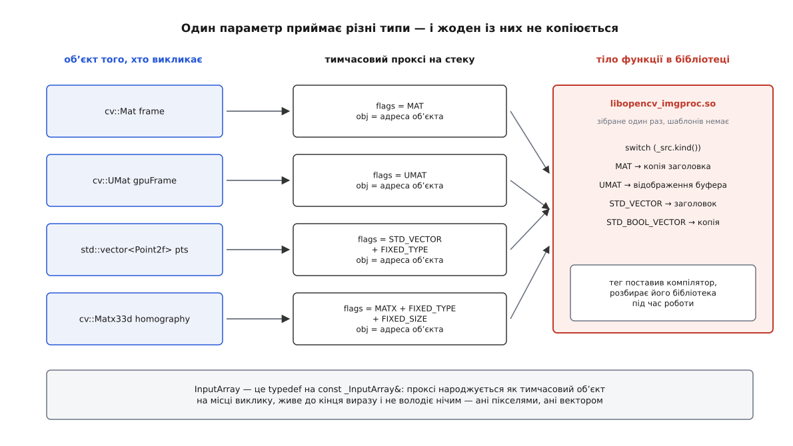
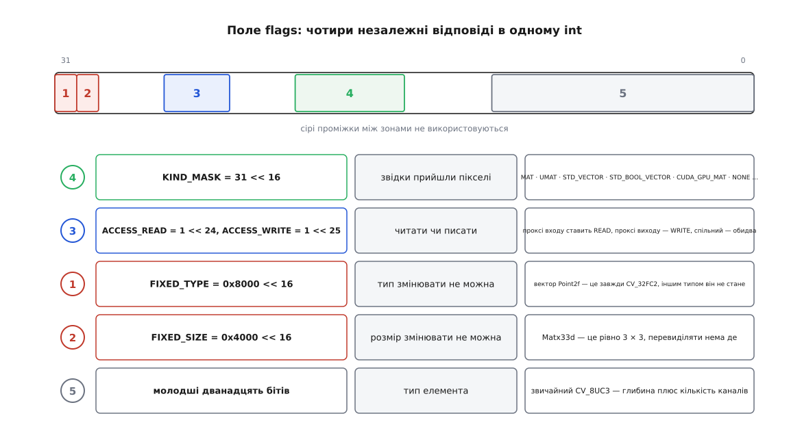
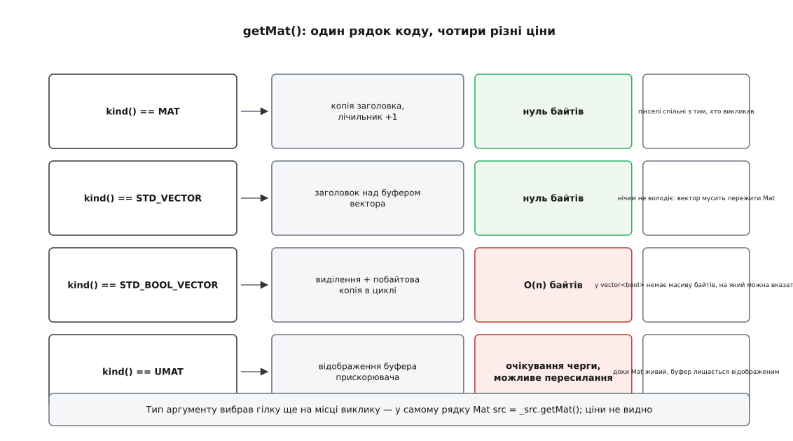
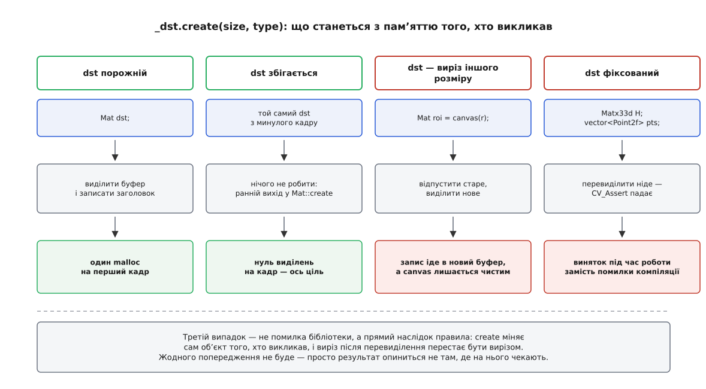

# InputArray і OutputArray: спільний вхід для Mat, UMat і вектора

<preknowlist>
- [cv::Mat: пам'ять, лічильник посилань і володіння](root:sys-media/mat-memory-model) — заголовок окремо від пікселів, спільний керівний блок, лічильник, що вирішує, хто звільняє буфер.
- [Види без копії: ROI і заголовок над чужим буфером](root:sys-media/mat-views-no-copy) — `Mat`, який описує чужу пам'ять і нічим не володіє.
- [Бекенди й прискорення: UMat, OpenCL, апаратна збірка](root:sys-media/opencv-backends) — `UMat`, дві копії пікселів під одним керівним блоком, ціна перетину межі хост↔пристрій.
- [Стирання типу](root:sf-lang/type-erasure) — як один параметр приймає багато різних типів, а справжній тип відновлюється вже під час роботи.
- [Посилання і правила зв'язування](root:sys-plang-cpp/references-binding) — константне посилання, тимчасовий об'єкт і продовження його життя.
- [Висячі посилання й звернення після звільнення](root:sys-plang-cpp/dangling-references) — що стається, коли посилання переживає те, на що вказує.
- [Стабільність ABI у C++](root:sys-plang-cpp/abi-stability-cpp) — чому тіло функції зі зібраної бібліотеки не можна параметризувати типом того, хто її викликає.
- [Формати пікселів і буферів зображення](root:sf-visual/pixel-formats) — глибина, кількість каналів, крок рядка.
</preknowlist>

Спробуйте описати сигнатуру функції `resize`, яка мала б задовольнити всіх. Прийняти вона повинна кадр у системній пам'яті (`cv::Mat`), кадр у пам'яті прискорювача (`cv::UMat`), набір точок як `std::vector<cv::Point2f>`, матрицю перетворення `cv::Matx33d`, кадр на відеокарті (`cv::cuda::GpuMat`), список кадрів (`std::vector<cv::Mat>`). І те саме — для другого параметра, куди піде результат. Шість варіантів на вході, шість на виході: тридцять шість перевантажень на одну функцію. У бібліотеці таких функцій кілька тисяч.

Очевидна відповідь — шаблон. Написали тіло один раз, а компілятор нехай сам зробить із нього версію під кожен тип. Але OpenCV — це зібрана наперед бібліотека: `cv::resize` живе в `libopencv_imgproc.so`, а не в заголовку, який ви вмикаєте. Тіло шаблона мусить бути видиме на місці виклику — інакше компілятор не має з чого породити версію. Тобто шаблон означав би, що весь код зміни розміру, з усіма гілками під SIMD і всіма таблицями коефіцієнтів, переїжджає у ваш заголовок і збирається наново в кожному проєкті. Разом із ним зникає стабільна межа бібліотеки: заміна `.so` на новішу версію без перезбирання ваших файлів стає неможливою, бо код бібліотеки тепер ваш.

Отже, тіло має бути зібране один раз і мусить приймати щось одне. Тип, який туди приходить, зобов'язаний бути **один** — а знання про те, чим цей аргумент був насправді, треба якось передати всередину як **дані**, а не як тип. Це і є конструкція, яку OpenCV назвала `InputArray`.

## Проксі, що не володіє нічим

Проксі (англ. *proxy*, від лат. *procuratio* — «дія за дорученням») — це об'єкт, який стоїть замість іншого й передає йому звернення. Тут він мусить робити рівно дві речі: пам'ятати адресу справжнього об'єкта й пам'ятати, якого той був типу.

Саме з цього він і складається — три поля, більше нічого:

```cpp
class CV_EXPORTS _InputArray
{
    // ...
protected:
    int flags;      // тег: звідки прийшли дані, що з ними можна робити
    void* obj;      // адреса справжнього об'єкта
    Size sz;        // розмір — лише для тих видів, де він відомий одразу
};
```

Конструктори — не `explicit`, по одному на кожен підтримуваний тип, і кожен лише запам'ятовує адресу:

```cpp
inline _InputArray::_InputArray(const Mat& m)  { init(+MAT + ACCESS_READ, &m); }
inline _InputArray::_InputArray(const UMat& m) { init(+UMAT + ACCESS_READ, &m); }

template<typename _Tp> inline
_InputArray::_InputArray(const std::vector<_Tp>& vec)
{
    init(FIXED_TYPE + STD_VECTOR + traits::Type<_Tp>::value + ACCESS_READ, &vec);
}

template<typename _Tp, int m, int n> inline
_InputArray::_InputArray(const Matx<_Tp, m, n>& mtx)
{
    init(FIXED_TYPE + FIXED_SIZE + MATX + traits::Type<_Tp>::value + ACCESS_READ,
         &mtx, Size(n, m));
}
```

Ніде немає ані копіювання пікселів, ані навіть збільшення лічильника посилань — самий лише `&`. Це три-чотири присвоєння цілих чисел і покажчика, тобто вартість, яку компілятор здебільшого просто розчиняє в місці виклику.

Далі — сам параметр. Сигнатура функції виглядає як `void resize(InputArray src, OutputArray dst, ...)`, і слово `InputArray` тут — не клас, а псевдонім:

```cpp
typedef const _InputArray&  InputArray;
typedef InputArray          InputArrayOfArrays;
typedef const _OutputArray& OutputArray;
typedef const _InputOutputArray& InputOutputArray;
```

Параметр — константне посилання. Коли ви пишете `cv::resize(frame, out, sz)`, компілятор бачить, що `frame` типу `Mat`, а параметр — `const _InputArray&`; знаходить неявний конструктор, створює **тимчасовий** `_InputArray` просто на стеку виклику й прив'язує до нього посилання. Тимчасовий об'єкт живе до кінця повного виразу — тобто рівно доти, доки триває виклик.



*Компілятор ставить тег на місці виклику, бібліотека розбирає його під час роботи; тіло функції зібране один раз і про ваші типи нічого не знає.*

Звідси й пояснення, чому в довідці OpenCV сотні функцій показані з параметром `InputArray`, а в жодному прикладі коду цього типу не видно: його ніхто не пише руками, він народжується сам.

## Одне ціле число з чотирма відповідями

Поле `flags` виглядає як єдине число, але насправді це чотири незалежні відповіді, укладені в різні його біти.

```cpp
enum KindFlag {
    KIND_SHIFT = 16,
    FIXED_TYPE = 0x8000 << KIND_SHIFT,
    FIXED_SIZE = 0x4000 << KIND_SHIFT,
    KIND_MASK  = 31 << KIND_SHIFT,

    NONE              = 0 << KIND_SHIFT,
    MAT               = 1 << KIND_SHIFT,
    MATX              = 2 << KIND_SHIFT,
    STD_VECTOR        = 3 << KIND_SHIFT,
    STD_VECTOR_VECTOR = 4 << KIND_SHIFT,
    STD_VECTOR_MAT    = 5 << KIND_SHIFT,
    OPENGL_BUFFER     = 7 << KIND_SHIFT,
    CUDA_HOST_MEM     = 8 << KIND_SHIFT,
    CUDA_GPU_MAT      = 9 << KIND_SHIFT,
    UMAT              =10 << KIND_SHIFT,
    STD_VECTOR_UMAT   =11 << KIND_SHIFT,
    STD_BOOL_VECTOR   =12 << KIND_SHIFT,
    STD_VECTOR_CUDA_GPU_MAT = 13 << KIND_SHIFT,
    STD_ARRAY_MAT     =15 << KIND_SHIFT,
    CUDA_GPU_MATND    =16 << KIND_SHIFT
};

enum AccessFlag { ACCESS_READ=1<<24, ACCESS_WRITE=1<<25,
    ACCESS_RW=3<<24, ACCESS_MASK=ACCESS_RW, ACCESS_FAST=1<<26 };
```



*Молодші біти зайняті звичайним кодом типу елемента, тому вид джерела зсунуто на шістнадцять розрядів угору — і в одному цілому числі вміщаються чотири різні питання.*

Зсув на шістнадцять — не примха. Молодші біти вже зайняті звичайним для OpenCV кодом типу (`CV_8UC3` і подібні), і саме тому в конструкторі вектора видно доданок `traits::Type<_Tp>::value`: проксі несе не лише «це вектор», а й «вектор чого». Для `std::vector<Point2f>` компілятор укладе туди `CV_32FC2` — і зробить це в момент компіляції, безплатно.

Дві інші групи бітів пояснюють, чому одна й та сама функція поводиться з різними аргументами не однаково.

**`ACCESS_READ` / `ACCESS_WRITE`** ставить не ви, а сам конструктор — і різні проксі ставлять їх по-різному: вхідний завжди `READ`, вихідний `WRITE`, спільний `_InputOutputArray` — обидва. Отже, намір «я збираюся це читати» чи «я збираюся це переписати» приїжджає всередину функції разом із адресою. Для звичайного `Mat` це нічого не змінює, зате для `UMat` міняє все: якщо пікселі зараз лежать у пам'яті прискорювача, а вам потрібен доступ лише на запис, то тягнути їх звідти на хост немає сенсу — усе одно перепишете. Прапорець доступу — це те, що дозволяє бібліотеці пропустити пересилання, якого ніхто не помітив би.

**`FIXED_TYPE` і `FIXED_SIZE`** — це заборони. `std::vector<Point2f>` завжди має тип елемента `CV_32FC2`: перетворити його на однобайтову маску неможливо, бо це просто інший вектор. `Matx33d` — це три на три, і його розмір узагалі частина типу, він живе не в купі, а всередині самого об'єкта. Тому конструктор проксі одразу позначає: тип чіпати не можна, а для `Matx` — ще й розмір.

## Найдорожча властивість: він нічого не тримає при житті

Проксі зберігає `void* obj` — сирий покажчик. Ані лічильник посилань `Mat` не збільшується, ані вектор не копіюється. Це і робить передавання безплатним, і це ж робить його небезпечним поза межами одного виразу.

Документація OpenCV каже про це прямо: клас створено виключно для передавання параметрів, і оголошувати змінні цього типу — членами класу, локальними чи глобальними — не слід. Причина видно з правил мови:

```cpp
cv::Mat makeFrame();            // повертає кадр за значенням

InputArray bad = makeFrame();   // ← вже зіпсовано
cv::Mat out;
cv::blur(bad, out, {3, 3});     // читання зі звільненої пам'яті
```

Розберімо, що тут відбувається. `InputArray` — це `const _InputArray&`. Праворуч від знаку рівності стоїть `Mat`, тож компілятор створює тимчасовий `_InputArray`, і посилання `bad` прив'язується саме до нього. Час життя цього тимчасового проксі справді продовжується до кінця області видимості — правило зв'язування константного посилання працює. Але **не** продовжується час життя `Mat`, який повернув `makeFrame()`: цей кадр був лише аргументом конструктора, а не тим об'єктом, до якого прив'язалося посилання. Він помирає в кінці свого повного виразу, тобто вже в першому рядку. Лишається живий проксі з покажчиком у звільнену пам'ять — і жодного попередження від компілятора, бо формально все законно.

Так само ламається і спроба зберегти проксі в полі класу: об'єкт-джерело живе десь у викликача, а поле переживе виклик і вкаже в нікуди.

Правило звідси одне й просте: `InputArray` існує лише в дужках виклику. Треба зберегти кадр — зберігайте `Mat` або `UMat`, у них є лічильник, і вони для цього й зроблені.

> 🔧 **Навіщо це.** У конвеєрі обробки відео спокуса зберегти проксі виникає щоразу, коли пишуть власний клас-обгортку: «нехай кадр приймається як `InputArray`, а я покладу його в чергу». Наслідок — падіння, яке відтворюється раз на кілька тисяч кадрів, бо звільнений буфер часто ще деякий час містить старі байти. Обгортка мусить приймати `InputArray` і **одразу** робити з нього те, чим володітиме: або `getMat()`, якщо кадр надалі житиме в системній пам'яті, або копію, якщо джерело зникне.

## Читання: один рядок, чотири різні ціни

Усередині функції все починається з того, що проксі просять віддати справжні дані:

```cpp
Mat src = _src.getMat();
```

Рядок скрізь однаковий, а от що за ним стоїть — залежить від тегу, і різниця сягає кількох порядків.

Для `MAT` це копія заголовка: `Mat` з тими самими полями й тим самим керівним блоком, лічильник посилань збільшено на одиницю. Нуль скопійованих пікселів.

Для `STD_VECTOR` бібліотека будує заголовок просто над буфером вектора. У джерелі це видно в макросі, яким розгорнуто всі типи елементів:

```cpp
#define GET_MAT(T) \
{ \
    std::vector<T>* v; \
    ... \
    return v->empty() ? Mat() : Mat(1, int(v->size()), t, v->data()); \
}
```

Конструктор `Mat`, якому передали готовий покажчик, створює заголовок, що **нічим не володіє**: керівного блоку немає, лічильника немає, звільняти нічого. Отже, отриманий `Mat` не тримає вектор при житті — вектор мусить пережити його самотужки. Усередині функції це виконується автоматично, бо вектор належить викликачеві й точно живий, доки триває виклик. А от якщо ви повторюєте цей прийом у власному коді — обов'язок стежити за порядком знищення ваш.

Для `STD_BOOL_VECTOR` те саме зробити неможливо, і причина суто мовна: `std::vector<bool>` — це впакований набір бітів, у ньому просто немає масиву байтів, на який можна вказати. Тому бібліотека виділяє пам'ять і переписує значення поелементно:

```cpp
if( k == STD_BOOL_VECTOR )
{
    ...
    Mat m(1, n, t);
    uchar* dst = m.data;
    for( j = 0; j < n; j++ )
        dst[j] = (uchar)v[j];
    return m;
}
```

Це єдиний вид, де `getMat()` коштує виділення пам'яті й лінійного проходу.

Для `UMAT` виклик перетворюється на відображення буфера прискорювача в адресний простір процесора. Тут ціна вже не в байтах, а в очікуванні: перш ніж процесор побачить пікселі, черга команд пристрою має доробити все, що в ній стоїть, а на дискретній відеокарті вміст ще й мусить перетнути шину. Доки повернений `Mat` живий, буфер лишається відображеним — і повернути його прискорювачеві не можна.



*Гілку вибрано ще на місці виклику — типом аргументу; у самому рядку `getMat()` ціни не видно.*

> 🔧 **Навіщо це.** Профіль, у якому дивно багато часу висить у якійсь тривіальній функції на кшталт `cv::mean`, майже завжди означає одне: у неї передали `UMat`, і час, який вона «витратила», насправді був очікуванням черги пристрою. Прибирається це не оптимізацією самої функції, а перенесенням межі — щоб дані переходили в системну пам'ять один раз за кадр, а не в кожній дрібній операції.

## Запис: чому вихідний проксі мусить уміти виділяти

Вхідний бік має легке завдання: дані вже існують. Вихідний — важче. Коли ви пишете `cv::Mat dst;` і передаєте `dst` як приймач, у ньому немає ані розміру, ані типу, ані буфера. Скільки пам'яті потрібно, знає лише сама функція, і то не одразу: розмір результату `cv::findContours` залежить від того, що знайдеться в зображенні.

Тому вихідний проксі — це не просто вхідний із дозволом на запис. У `_OutputArray` є те, чого у `_InputArray` бути не може: **право змінити об'єкт викликача**.

```cpp
void create(Size sz, int type, int i=-1, bool allowTransposed=false) const;
void create(int rows, int cols, int type, int i=-1, bool allowTransposed=false) const;
bool needed() const;
bool fixedSize() const;
bool fixedType() const;
```

Домовленість, якої дотримуються всі функції бібліотеки, звучить так: спочатку `create` з потрібним розміром і типом, і лише потім `getMat`. Ось як це виглядає в реальному коді порогової обробки:

```cpp
Mat src = _src.getMat();

if (!isDisabled)
    _dst.create( src.size(), src.type() );
Mat dst = isDisabled ? cv::Mat() : _dst.getMat();
```

Зверніть увагу на порядок: `src` беруть **до** `create`. Це не випадковість і не стиль. Виклик `resize(m, m, ...)` чи `threshold(m, m, ...)` цілком законний — вхід і вихід можуть виявитися тим самим об'єктом. Якби спершу викликали `create`, а той вирішив перевиділити буфер, то лічильник посилань старого блоку впав би до нуля, пікселі звільнилися б — і читати вже було б нічого. Заголовок `src`, узятий заздалегідь, тримає лічильник, і старий буфер доживає до кінця роботи функції, навіть якщо приймач тим часом переїхав на нову пам'ять.

Усередині `create` для звичайного `Mat` усе зводиться до кількох рядків:

```cpp
if( k == MAT && i < 0 && !allowTransposed && fixedDepthMask == 0 )
{
    CV_Assert(!fixedSize() || ((Mat*)obj)->size.operator()() == _sz);
    CV_Assert(!fixedType() || ((Mat*)obj)->type() == mtype);
    ((Mat*)obj)->create(_sz, mtype);
    return;
}
```

Тобто перевірити заборони — і покликати `Mat::create` того самого об'єкта, що його передав викликач. А `Mat::create` починається з раннього виходу:

```cpp
if( data && (d == dims || (d == 1 && dims <= 2)) && _type == type() )
{
    ...
    if( d == 2 && rows == _sizes[0] && cols == _sizes[1] )
        return;
    ...
}
```

Буфер уже є, розмір збігається, тип збігається — не робити нічого. Це і є той механізм, заради якого варто тримати приймачі поза циклом кадрів: якщо `dst` живе між ітераціями, то на першому кадрі буде одне виділення пам'яті, а на всіх наступних — нуль.

```cpp
cv::Mat frame, gray, blurred, mask;   // ← оголошені один раз, поза циклом

while (grabFrame(frame)) {
    cv::cvtColor(frame, gray, cv::COLOR_BGR2GRAY);
    cv::GaussianBlur(gray, blurred, {5, 5}, 1.5);
    cv::threshold(blurred, mask, 128, 255, cv::THRESH_BINARY);
}
```

Перенесіть ці чотири оголошення всередину циклу — і кожен кадр почнеться з чотирьох виділень і чотирьох звільнень. На тридцяти кадрах за секунду це сто двадцять походів до розподільника пам'яті щосекунди, з відповідною фрагментацією; на вбудованій платі різниця цілком помітна.



*Той самий рядок у бібліотеці — і чотири різні речі з пам'яттю того, хто викликав; вирішує стан приймача, а не код функції.*

## Дві пастки, що ростуть із того самого кореня

Право `create` міняти об'єкт викликача корисне, але воно ж породжує два наслідки, на яких регулярно спотикаються.

**Виріз, що тихо відв'язується.** Природний спосіб скласти мозаїку — виділити велике полотно й писати результати просто у його прямокутники:

```cpp
cv::Mat canvas(720, 1280, CV_8UC3);
cv::Mat cell = canvas(cv::Rect(0, 0, 640, 360));  // виріз, спільні пікселі

cv::resize(frame, cell, cv::Size(640, 360));      // ✔ пише в canvas
cv::resize(frame, cell, cv::Size(320, 180));      // ✘ canvas лишиться незайманим
```

Перший виклик просить розмір, який у `cell` уже є, `Mat::create` виходить одразу, і функція пише прямо в пікселі полотна. Другий просить інший розмір — `create` відпускає старий заголовок і виділяє свіжий буфер. Формально все спрацювало: `cell` тепер містить правильно зменшений кадр. Тільки він більше не виріз, а окреме зображення, і полотно про нього не знає. Ані винятку, ані попередження — просто результат опинився не там, де на нього чекають. Механіку самого відв'язування розібрано в темі про [види без копії](root:sys-media/mat-views-no-copy).

**Заборона, що спрацьовує під час роботи.** Коли приймач — `std::vector<Point2f>` чи `Matx33d`, `create` не може ані змінити тип, ані перевиділити пам'ять, тож `CV_Assert` кидає виняток. Причому помилка того самого ґатунку, що й звичайна помилка типів, — але компілятор її не бачить, бо для нього обидва випадки однакові: неявне перетворення в `_OutputArray`. Це і є свідома плата за ширину інтерфейсу: тип аргументу перестав бути справою компілятора й став даними, які розбирають під час роботи. Повний перелік видів, того, який із них що дозволяє, і того, які методи проксі має, зібрано окремо — [контракт InputArray і OutputArray](root:sys-media/input-output-array/api-input-output-array.md).

Є ще один вид, який виглядає як виняток із усього сказаного, — порожній. Функція `cv::noArray()` повертає проксі з тегом `NONE`, а метод `needed()` відповідає на питання «чи взагалі просили цей результат»:

```cpp
CV_EXPORTS InputOutputArray noArray();
```

Це не декорація: необов'язкові виходи трапляються часто — маска, вектор помилок, друга матриця розкладу. Замість того щоб виділяти їх «про всяк випадок», функція питає `needed()` і, отримавши відмову, пропускає весь блок обчислень. Тобто той самий тег керує не лише тим, звідки брати пам'ять, а й тим, чи виконувати роботу.

## Тег як вимикач гілки прискорювача

Найважливіший для відеоконвеєра наслідок сховано в тому, що вид джерела перевіряють **до** будь-якої роботи з даними. Ось перший рядок тіла порогової обробки:

```cpp
CV_OCL_RUN_(_src.dims() <= 2 && _dst.isUMat(),
            ocl_threshold(_src, _dst, cv::noArray(), thresh, maxval, type), thresh)
```

Макрос розгортається приблизно так: якщо OpenCL увімкнено, умова істинна й реалізація на прискорювачі відпрацювала успішно — вийти з функції, повернувши її результат; інакше просто йти далі, на процесорну гілку. Умова тут дивиться на `_dst.isUMat()` — тобто на тег **приймача**.

Звідси прямий висновок, який рідко формулюють уголос: у прозорому прискоренні OpenCV вибір «процесор чи прискорювач» роблять **типи ваших змінних**, а не якесь налаштування. Оголосили `cv::UMat dst` — і той самий рядок пішов на OpenCL. Оголосили `cv::Mat dst` — і він лишився на процесорі, навіть якщо джерело було `UMat` (у цьому разі його ще й доведеться стягнути в системну пам'ять). Одна невдало оголошена змінна посеред ланцюжка обробки повертає кадр туди й назад через шину, а в коді нічого схожого на пересилання не написано. Ціну цих перетинів і те, як їх рахувати, розібрано в темі про [бекенди й прискорення](root:sys-media/opencv-backends).

> 🔧 **Навіщо це.** Коли обробку переводять на `UMat`, найкорисніша дисципліна — тримати весь ланцюжок в одному типі й міняти його рівно двічі за кадр: на вході й на виході. Кожна проміжна змінна «не того» типу — це не стильова дрібниця, а два перетини межі й дві точки очікування, які проксі створить мовчки.

## Стик із відеоконвеєром

Кадр, що приходить із конвеєра GStreamer, не належить OpenCV. Він живе в `GstBuffer`, і доступ до його байтів відкриває `gst_buffer_map`, а закриває `gst_buffer_unmap`. Між цими двома викликами байти нікуди не подінуться; після другого — жодних обіцянок.

Природний спосіб віддати такий кадр алгоритмові — побудувати над ним заголовок, який нічим не володіє, і передати його як `InputArray`:

```cpp
GstMapInfo info;
gst_buffer_map(buf, &info, GST_MAP_READ);

cv::Mat frame(height, width, CV_8UC3, info.data, stride);  // заголовок над чужим буфером
cv::Mat gray;
cv::cvtColor(frame, gray, cv::COLOR_BGR2GRAY);             // жодної копії пікселів

gst_buffer_unmap(buf, &info);
```

Вийшов ланцюжок із трьох ланок, і жодна з них не володіє пікселями: буфер конвеєра тримає пам'ять, `Mat` лише описує її, проксі лише вказує на `Mat`. Володіє всім `GstBuffer`, і момент його розмапування — це момент, після якого решта ланцюжка стає брехнею. Тому все, що має пережити `gst_buffer_unmap`, мусить бути окремим буфером: `gray` тут виділений самою бібліотекою через `create` і живе за власним лічильником, а от `frame` після розмапування чіпати не можна. Детально формати пікселів і сам міст між конвеєром та бібліотекою розібрано в темі про [стик із відеоконвеєром](root:sys-media/frame-interop); тут важливе інше — що проксі не додає до цього ланцюжка жодної гарантії, а лише передає покажчик далі.

Зворотний бік стику виглядає симетрично. Щоб віддати результат назад у конвеєр, вихідний проксі має записати пікселі туди, де їх чекає `GstBuffer`, а не в свіжий буфер. Отже, приймач мусить бути заголовком над відображеною пам'яттю буфера й мусить **вже мати** потрібний розмір і тип — інакше `create` перевиділить його, і кадр піде в конвеєр порожнім. Той самий ранній вихід із `Mat::create`, який на процесорному конвеєрі просто економить виділення, тут стає умовою правильності.

Як побудувати таку функцію самотужки — щоб вона приймала `Mat`, `UMat` і вектор, коректно поводилася при збігу входу з виходом і мала обидві гілки, — розібрано окремо: [власна функція з сигнатурою InputArray/OutputArray](root:sys-media/input-output-array/proj-universal-function.md).

## Що з цього випливає

`InputArray` виглядає як зручність — «пишіть що завгодно, воно прийме». Насправді це перенесення питання про тип з етапу компіляції на етап виконання, зроблене свідомо й заради однієї конкретної речі: щоб тіло функції можна було зібрати один раз і покласти в бібліотеку.

І весь набір несподіванок навколо цих двох типів — прямий наслідок саме цього перенесення. Компілятор більше не бачить різниці між `vector<Point2f>` і `vector<Point2i>` у ролі приймача, тому невідповідність типів стає винятком під час роботи. Він не бачить різниці між `Mat` і `UMat`, тому вибір обчислювача стає властивістю змінної, а не запису виклику. Він не бачить, що проксі пережив свій об'єкт, тому час життя стає обов'язком того, хто пише код. Взамін — кілька тисяч функцій, кожна з яких приймає з десяток різних подань даних і не має жодного зайвого перевантаження.

Історію цього обміну — від нетипізованого `CvArr*` старого C-інтерфейсу до нинішнього проксі — зібрано окремо: [як OpenCV дійшла від void* до InputArray](root:sys-media/input-output-array/hist-cvarr-to-inputarray.md).
