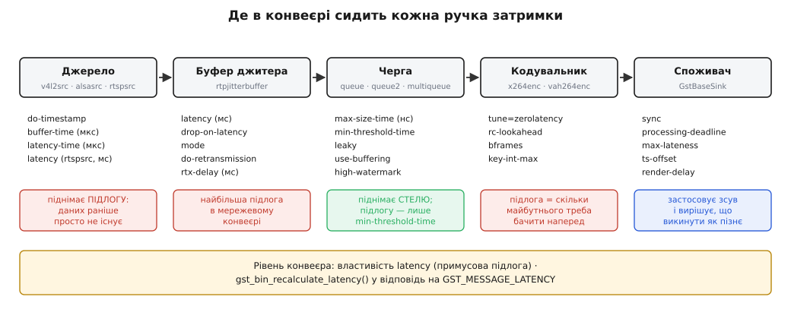

# 📋 Ручки, запити й повідомлення, якими керують затримкою

Затримкою в GStreamer керує не один параметр, а два десятки ручок, розкиданих по різних елементах, — і найпідступніше в них те, що ті самі двісті мілісекунд одна ручка приймає як `200`, друга як `200000`, а третя як `200000000`. Тут зібрано весь контракт: три функції запиту, подія й перерахунок, поля обох повідомлень і властивості елементів — кожна з одиницею, типовим значенням і одним рядком про наслідок зміни.



*Ручки не рівноправні: одні піднімають підлогу (мінімальну затримку), інші — стелю (терпіння конвеєра), треті вирішують, що викинути. Плутанина між цими трьома групами — джерело майже всіх помилок налаштування.*

## Одиниці: перше, на чому спотикаються

Ядро GStreamer міряє час у наносекундах — тип `GstClockTime` (беззнакове 64-бітове). Але окремі елементи виставляють свої властивості в тих одиницях, що були природні для їхнього шару: RTP рахує мілісекунди, звукові драйвери — мікросекунди. Ось як **одна й та сама затримка 200 мс** пишеться в кожному місці:

| Де | Ручка | Одиниця | «200 мс» |
|---|---|---|---|
| `GstPipeline` | `latency` | нс | `200000000` |
| `GstBaseSink` | `processing-deadline`, `render-delay`, `ts-offset`, `max-lateness` | нс | `200000000` |
| `queue`, `queue2`, `multiqueue` | `max-size-time`, `min-threshold-time` | нс | `200000000` |
| `rtpjitterbuffer` | `latency`, `rtx-delay`, `max-misorder-time` | **мс** | `200` |
| `rtspsrc` | `latency` | **мс** | `200` |
| `GstAudioBaseSink` / `Src` | `buffer-time`, `latency-time`, `drift-tolerance` | **мкс** | `200000` |
| `GstAudioBaseSink` | `alignment-threshold`, `discont-wait` | нс | `200000000` |
| повідомлення про буферизацію | `buffering-left` | **мс** | `200` |

У коді на C наносекундні поля краще ніколи не писати цифрами — є макроси, які роблять намір видимим:

```c
GST_MSECOND   /* 1 000 000 нс */
GST_SECOND    /* 1 000 000 000 нс */

g_object_set (queue, "max-size-time", (guint64) 200 * GST_MSECOND, NULL);
g_object_set (jbuf,  "latency",       (guint) 200, NULL);        /* а тут — просто мс */
```

Друга група пасток — **особливі значення**. Одне й те саме `-1` в різних місцях означає протилежні речі:

| Значення | Де | Що означає |
|---|---|---|
| `GST_CLOCK_TIME_NONE` (= `(guint64) -1`) | `max-latency` у запиті | нескінченне терпіння: елемент витримає будь-який зсув |
| `GST_CLOCK_TIME_NONE` | `pipeline.latency` | автоматично — брати число з запиту (типове) |
| `-1` | `max-lateness` | не викидати пізні буфери взагалі (типове) |
| `-1` | `rtx-delay`, `rtx-retry-timeout`, `rtx-retry-period` | обчислити з інтервалу між пакетами |
| `0` | `max-size-time`, `min-threshold-time` | обмеження вимкнено |
| `0` | `key-int-max` | вибрати самому (у `x264enc` — приблизно 2 с) |

> 🔧 **Навіщо це.** Найдорожча помилка тут дає не збій, а тишу. `latency=200000000` на `rtspsrc` не є помилкою типу — властивість беззнакова й приймає число, тільки означає воно 200 000 секунд буферизації, тобто конвеєр просто ніколи нічого не покаже. Симетрично `max-size-time=200` на черзі — це 200 наносекунд місткості, тобто черга, якої фактично немає. Обидві «настройки» виглядають правдоподібно в командному рядку й обидві мовчки ламають конвеєр. Тому перше, що варто робити з незнайомою ручкою, — дивитися одиницю, а не значення.

## Запит `GST_QUERY_LATENCY`

Запит — це те, чим конвеєр збирає з елементів їхні вимоги. Три функції, три поля.

```c
GstQuery * gst_query_new_latency   (void);

void       gst_query_parse_latency (GstQuery     *query,
                                    gboolean     *live,
                                    GstClockTime *min_latency,
                                    GstClockTime *max_latency);

void       gst_query_set_latency   (GstQuery     *query,
                                    gboolean      live,
                                    GstClockTime  min_latency,
                                    GstClockTime  max_latency);
```

| Поле | Тип | Одиниця | Значення |
|---|---|---|---|
| `live` | `gboolean` | — | десь угорі гілки сидить джерело, прив'язане до реального часу |
| `min-latency` | `GstClockTime` | нс | скільки часу дані **фізично не готові**; нижня межа зсуву |
| `max-latency` | `GstClockTime` | нс | найбільший зсув, який гілка переживе без втрат; `GST_CLOCK_TIME_NONE` = ∞ |

**Опитати конвеєр із програми.** Запит, надісланий у сам конвеєр, `GstBin` розводить по всіх споживачах і зводить відповіді за тим самим правилом, за яким рахує затримку: `min` = максимум із мінімумів, `max` = мінімум із максимумів, `live` = логічне «або».

```c
GstQuery *q = gst_query_new_latency ();

if (gst_element_query (GST_ELEMENT (pipeline), q)) {
    gboolean     live;
    GstClockTime min, max;

    gst_query_parse_latency (q, &live, &min, &max);
    g_print ("live=%d  min=%" GST_TIME_FORMAT "  max=%" GST_TIME_FORMAT "\n",
             live, GST_TIME_ARGS (min), GST_TIME_ARGS (max));
}
gst_query_unref (q);
```

Число, яке поверне цей запит, — це **вимога** гілок, а не те, що конвеєр застосував: примусове `pipeline.latency` тут не враховано. Застосований зсув віддає `gst_pipeline_get_configured_latency()`.

**Відповісти на запит зі свого елемента.** Правило одне: спершу передай запит угору за течією, потім додай своє. Самому розбирати запит у більшості випадків не треба — базові класи роблять і передачу, і додавання; від вас потрібні лише два числа. І вони ж самі кладуть на шину повідомлення про зміну затримки, коли ці числа змінилися:

```c
void gst_video_encoder_set_latency (GstVideoEncoder *encoder,
                                    GstClockTime min_latency, GstClockTime max_latency);
void gst_video_decoder_set_latency (GstVideoDecoder *decoder,
                                    GstClockTime min_latency, GstClockTime max_latency);
void gst_video_encoder_get_latency (GstVideoEncoder *encoder,
                                    GstClockTime *min_latency, GstClockTime *max_latency);
```

Для джерел і споживачів є свої помічники, які самі розбирають запит:

```c
gboolean gst_base_src_query_latency  (GstBaseSrc *src, gboolean *live,
                                      GstClockTime *min_latency, GstClockTime *max_latency);

gboolean gst_base_sink_query_latency (GstBaseSink *sink, gboolean *live,
                                      gboolean *upstream_live,
                                      GstClockTime *min_latency, GstClockTime *max_latency);

void     gst_base_src_set_live (GstBaseSrc *src, gboolean live);
gboolean gst_base_src_is_live  (GstBaseSrc *src);
```

У споживача два окремі прапорці, і різниця між ними принципова: `live` каже, що **сам споживач** синхронізується за годинником (тобто `sync=TRUE`), а `upstream_live` — що вгорі гілки живе джерело. Компенсувати чужу затримку споживач мусить лише тоді, коли обидва істинні.

## Подія `LATENCY`, перерахунок і примусове число

Порахувавши, конвеєр розсилає результат **подією** — і саме вона змушує споживачів зсунути дедлайни.

```c
GstEvent * gst_event_new_latency   (GstClockTime latency);
void       gst_event_parse_latency (GstEvent *event, GstClockTime *latency);
```

| Виклик | Що робить | Коли потрібен |
|---|---|---|
| `gboolean gst_bin_recalculate_latency (GstBin *bin)` | ще раз опитує гілки й розсилає нову подію | у відповідь на `GST_MESSAGE_LATENCY` |
| сигнал `do-latency` на `GstBin` | `gboolean cb (GstBin *bin, gpointer user_data)`, `RUN_LAST` | коли треба **власне** правило зведення замість типового |
| `void gst_pipeline_set_latency (GstPipeline *p, GstClockTime latency)` | примусова підлога; `GST_CLOCK_TIME_NONE` повертає автоматичний режим (від 1.6) | коли треба запас понад пораховане |
| `GstClockTime gst_pipeline_get_latency (GstPipeline *p)` | що **задали** через `set_latency` (від 1.6) | перевірка власного налаштування |
| `GstClockTime gst_pipeline_get_configured_latency (GstPipeline *p)` | що конвеєр **справді застосував** (від 1.24) | коли треба знати чинний зсув |

Типове значення властивості `latency` конвеєра — `GST_CLOCK_TIME_NONE`, тобто «бери з запиту». Підняти число вище за пораховане безпечно — це просто більший запас; опустити нижче за `MAX(min)` не вийде осмислено, бо ви вимагаєте показувати дані, яких у цю мить іще немає.

Типовий обробник сигналу `do-latency` робить те саме, що й `gst_bin_recalculate_latency`: опитує й роздає найменшу можливу спільну затримку. Підміняти його варто рідко — здебільшого тоді, коли гілкам свідомо потрібні **різні** зсуви й ви готові самі відповідати за їхню синхронність.

## Повідомлення на шині

Обидва повідомлення приходять через звичайну [шину конвеєра](topic:sys-media/bus-and-messages) — асинхронний канал, яким елементи говорять із програмою; обробляє їх ваш код, а не рушій.

### `GST_MESSAGE_LATENCY`

```c
GstMessage * gst_message_new_latency (GstObject *src);
```

Полів немає — це чистий сигнал «моя затримка змінилася, перерахуйте». Його шлють `rtpjitterbuffer`, коли переоцінює мережу, і базові класи кодувальників та декодувальників із `..._set_latency()`. Обов'язок програми — рівно один рядок:

```c
case GST_MESSAGE_LATENCY:
    gst_bin_recalculate_latency (GST_BIN (pipeline));
    break;
```

Не обробили — конвеєр залишиться зі старим числом, і елементи, що з'явилися пізніше (наприклад, пади `rtspsrc`, створені вже під час роботи), у домовленість не потраплять.

### `GST_MESSAGE_BUFFERING`

```c
GstMessage * gst_message_new_buffering        (GstObject *src, gint percent);
void         gst_message_parse_buffering      (GstMessage *message, gint *percent);

void gst_message_set_buffering_stats   (GstMessage *message, GstBufferingMode mode,
                                        gint avg_in, gint avg_out, gint64 buffering_left);
void gst_message_parse_buffering_stats (GstMessage *message, GstBufferingMode *mode,
                                        gint *avg_in, gint *avg_out, gint64 *buffering_left);
```

| Поле | Тип | Одиниця | Значення |
|---|---|---|---|
| `percent` | `gint` | % | наповнення від 0 до 100; `100` = накопичення завершено |
| `mode` | `GstBufferingMode` | — | де осідають дані (таблиця нижче) |
| `avg-in-rate` | `gint` | байт/с | середня швидкість надходження |
| `avg-out-rate` | `gint` | байт/с | середня швидкість споживання |
| `buffering-left` | `gint64` | **мс** | скільки ще чекати до `100 %` за поточних швидкостей |

| `GstBufferingMode` | Де осідають дані | Наслідок |
|---|---|---|
| `GST_BUFFERING_STREAM` | у пам'яті елемента | звичайна пауза; назад перемотати не можна |
| `GST_BUFFERING_DOWNLOAD` | у файл на диску | переглянуте лишається доступним для перемотування |
| `GST_BUFFERING_TIMESHIFT` | у кільцевий файл сталого розміру | вікно перемотування назад для тривалого потоку |
| `GST_BUFFERING_LIVE` | ніде — стан не міняється | сталий зсув замість паузи |

Мінімальний обробник разом із винятком для живого:

```c
case GST_MESSAGE_BUFFERING: {
    gint percent;

    if (is_live)                 /* живий конвеєр стану НЕ міняє */
        break;

    gst_message_parse_buffering (msg, &percent);
    gst_element_set_state (pipeline,
        percent < 100 ? GST_STATE_PAUSED : GST_STATE_PLAYING);
    break;
}
```

Прапорець `is_live` беруть із того, що повернув перший `gst_element_set_state (pipeline, GST_STATE_PAUSED)`: значення `GST_STATE_CHANGE_NO_PREROLL` і означає «джерело живе, преролу не буде». Це той самий поділ, на якому тримаються всі [стани конвеєра](topic:sys-media/states-lifecycle) — набір NULL/READY/PAUSED/PLAYING і правила переходу між ними.

## Споживач: властивості `GstBaseSink`

Тут затримка перетворюється на конкретний момент показу, тому ручок найбільше. Типові значення — з коду базового класу.

| Властивість | Тип | Типово | Одиниця | Наслідок зміни |
|---|---|---|---|---|
| `sync` | `gboolean` | `TRUE` | — | `FALSE` — малювати одразу, без годинника: затримка мінімальна, синхронності немає |
| `processing-deadline` | `guint64` | `20000000` (20 мс) | нс | запас на власну промальовку; **додається до `min` лише для живого** (від 1.16) |
| `max-lateness` | `gint64` | `-1` | нс | наскільки буфер може спізнитися, перш ніж його викинуть; `-1` — не викидати |
| `ts-offset` | `gint64` | `0` | нс | зсув **лише цього** споживача: більший — показувати пізніше; так вручну підганяють картинку до звуку |
| `render-delay` | `guint64` | `0` | нс | скільки часу забирає показ **після** того, як споживач віддав буфер (HDMI-ланцюг, зовнішній екран) |
| `async` | `gboolean` | `TRUE` | — | `FALSE` — не чекати преролу при переході в PAUSED; звичне для другорядних гілок |
| `qos` | `gboolean` | `FALSE` | — | слати вгору повідомлення QoS, щоб виробник сам зменшив темп |
| `throttle-time` | `guint64` | `0` | нс | примусова пауза між кадрами: спосіб знизити частоту, а не затримку |
| `enable-last-sample` | `gboolean` | `TRUE` | — | тримати останній буфер у `last-sample`; вимкнення економить пам'ять |
| `blocksize` | `guint` | `4096` | байт | розмір порції в режимі витягування |

Найбільше плутають `processing-deadline` і `render-delay`. Обидва в наносекундах, обидва потрапляють у домовленість — але вимірюють різні відрізки й поводяться по-різному в запиті. Дослівна логіка з коду:

```c
if (l) {                                     /* обидва блоки — лише для живого */
  min += render_delay;                       /* затримка ПІСЛЯ споживача */
  if (max != -1)
    max += render_delay;                     /* ... іде і в підлогу, і в стелю */
}

if (l) {
  if (max == -1 || min + processing_deadline <= max)
    min += processing_deadline;              /* запас на роботу самого споживача */
  else
    GST_ELEMENT_WARNING (sink, CORE, CLOCK, (…), (…));   /* не влазить під стелю */
}
```

Різниця в тому, який відрізок часу описує кожна ручка. `processing-deadline` — це запас **усередині** споживача, на його власну промальовку, тому він додається лише до підлоги: він не робить конвеєр терплячішим. `render-delay` — це затримка **після** споживача, у ланцюзі, до якого GStreamer уже не має доступу; вона зсуває обидві межі, а потім споживач віднімає її назад під час обчислення моменту показу — тобто малює **раніше** рівно на цю величину, щоб картинка з'явилася на екрані вчасно.

І в обох випадках `if (l)`: типові 20 мс беруться до уваги **тільки для живих конвеєрів**, у файлі вони нічого не змінюють. А коли підлога з ними вже не влазить під стелю, конвеєр не мовчить, а попереджає.

Звукові споживачі й джерела додають до цього власний шар — і саме він зазвичай ставить підлогу в аудіоконвеєрі:

| Властивість `GstAudioBaseSink` / `Src` | Типово | Одиниця | Наслідок зміни |
|---|---|---|---|
| `buffer-time` | `200000` (200 мс) | мкс | увесь кільцевий буфер драйвера: менше — менша стеля |
| `latency-time` | `10000` (10 мс) | мкс | розмір однієї порції; **це і є підлога** звукової гілки |
| `provide-clock` | `TRUE` | — | звукова карта дає годинник конвеєрові |
| `slave-method` | `skew` | — | як підганяти чужий годинник під власний темп карти |
| `alignment-threshold` | `40000000` (40 мс) | нс | розбіжність, після якої вставляють розрив замість підгонки |
| `drift-tolerance` | `40000` (40 мс) | мкс | допустимий розбіг годинників |
| `discont-wait` | `1000000000` (1 с) | нс | скільки чекати, перш ніж оголосити розрив |

Зменшувати `latency-time` нижче за кілька мілісекунд можна, але платити доведеться процесором: порцій за секунду стає більше, кожна — окреме пробудження потоку.

## Черги: `queue`, `queue2`, `multiqueue`

### `queue`

| Властивість | Типово | Одиниця | Наслідок зміни |
|---|---|---|---|
| `max-size-buffers` | `200` | буфери | межа за кількістю; `0` — вимкнено |
| `max-size-bytes` | `10485760` (10 МіБ) | байти | межа за обсягом; `0` — вимкнено |
| `max-size-time` | `1000000000` (1 с) | нс | межа за часом — **саме вона піднімає стелю затримки** |
| `min-threshold-time` | `0` | нс | не віддавати, доки не накопичено стільки; **єдина ручка черги, що піднімає підлогу** |
| `min-threshold-buffers` / `-bytes` | `0` | буфери / байти | те саме, але в інших одиницях |
| `leaky` | `no` (0) | — | `upstream` (1) — викидати найновіше, `downstream` (2) — найстаріше |
| `flush-on-eos` | `FALSE` | — | `TRUE` — викинути вміст на EOS замість віддати |
| `silent` | `FALSE` | — | `TRUE` — не слати сигнали переповнення й спорожнення |

Сигнали: `overrun` (черга заповнилася), `underrun` (спорожніла), `running` (даних знову досить), `pushing` (можна віддавати далі). Усі приходять із нитки потоку, а не з нитки програми, — важкої роботи в обробнику робити не можна.

Як `queue` відповідає на запит про затримку — дослівно з її коду:

```c
if (queue->max_size.time > 0 && max != -1 && queue->leaky == GST_QUEUE_NO_LEAK)
    max += queue->max_size.time;                    /* звичайна: стеля +місткість */
else if (queue->max_size.time > 0 && queue->leaky != GST_QUEUE_NO_LEAK)
    max = MAX (queue->max_size.time, max);          /* протікає: не звужує стелю */
else
    max = -1;                                       /* без межі в часі — нескінченність */

if (queue->min_threshold.time > 0)
    min += queue->min_threshold.time;               /* єдиний внесок у підлогу */
```

Звідси видно головне: **у `min` черга не додає нічого**, доки їй не задали поріг. Тому й `queue` між камерою та повільним споживачем не з'являється в домовленості — і саме тому затримка, що накопичується в ній фізично, лишається невидимою для механізму узгодження.

### `queue2`

Відрізняється тим, що вміє класти дані на диск і вміє слати повідомлення про буферизацію.

| Властивість | Типово | Одиниця | Наслідок зміни |
|---|---|---|---|
| `use-buffering` | `FALSE` | — | `TRUE` — слати `GST_MESSAGE_BUFFERING`; без цього повідомлень не буде взагалі |
| `high-watermark` | `0.99` | частка | рівень, на якому накопичення вважають завершеним (`percent = 100`) |
| `low-watermark` | `0.01` | частка | рівень, нижче за який починається нове накопичення |
| `high-percent` / `low-percent` | `99` / `1` | % | те саме у відсотках, **застаріле** — беріть `high-watermark`/`low-watermark` |
| `max-size-buffers` | `100` | буфери | межа за кількістю |
| `max-size-bytes` | `2097152` (2 МіБ) | байти | межа за обсягом |
| `max-size-time` | `2000000000` (2 с) | нс | межа за часом |
| `temp-template` | `NULL` | шаблон шляху | задано — вмикається режим `download`: дані осідають у файл |
| `temp-remove` | `TRUE` | — | `FALSE` — не стирати тимчасовий файл після зупинки |
| `ring-buffer-max-size` | `0` | байти | ненуль — режим `timeshift` у кільцевому файлі |
| `use-rate-estimate` | `TRUE` | — | оцінювати `buffering-left` за виміряними швидкостями |

Типові пороги означають, що конвеєр чекатиме, доки черга наповниться на 99 %. За `max-size-time=2 с` це до двох секунд паузи перед стартом — перше, що варто зменшити там, де важливий швидкий початок.

### `multiqueue`

Кілька незалежних черг з окремим обліком, які тримають гілки разом; використовує його `decodebin`.

| Властивість | Типово | Одиниця | Наслідок зміни |
|---|---|---|---|
| `max-size-buffers` | `5` | буфери | навмисно мало: облік ведеться переважно за часом |
| `max-size-bytes` | `10485760` (10 МіБ) | байти | межа за обсягом |
| `max-size-time` | `2000000000` (2 с) | нс | головна межа; вона ж — стеля затримки гілки |
| `use-buffering` | `FALSE` | — | `TRUE` — слати повідомлення про буферизацію |
| `sync-by-running-time` | `FALSE` | — | `TRUE` — випускати гілки узгоджено за running-time |
| `use-interleave` | `FALSE` | — | підбирати місткість під реальний розбіг гілок у контейнері |
| `min-interleave-time` | `250000000` (250 мс) | нс | нижня межа для цього підбору |
| `unlinked-cache-time` | `250000000` (250 мс) | нс | скільки тримати дані для ще не під'єднаної гілки |

Властивості `extra-size-buffers`, `extra-size-bytes` і `extra-size-time` існують, але **не реалізовані** — крутити їх безглуздо.

## Мережа: `rtpjitterbuffer` і `rtspsrc`

`rtpjitterbuffer` — це [буфер джитера](topic:com-signal/jitter-buffer): черга, що навмисно притримує пакети, аби ті, що прийшли не в тому порядку або із запізненням, ще встигли на своє місце. Він майже завжди дає найбільший внесок у затримку мережевого конвеєра. **Одиниця тут — мілісекунди.**

| Властивість | Типово | Одиниця | Наслідок зміни |
|---|---|---|---|
| `latency` | `200` | **мс** | розмір вікна очікування; менше — менша затримка й більше втрат |
| `drop-on-latency` | `FALSE` | — | `TRUE` — викидати найстаріше замість рости понад `latency` |
| `mode` | `slave` (1) | — | `none` (0) — не переставляти мітки; `buffer` (2) — низький джитер, дозволяє паузу; `synced` (4) — за RTCP |
| `do-lost` | `FALSE` | — | `TRUE` — слати вниз подію про втрачений пакет, щоб декодувальник знав про дірку |
| `do-retransmission` | `FALSE` | — | `TRUE` — просити повторити втрачене; менше втрат, але `latency` мусить бути більшою за оберт |
| `rtx-delay` | `-1` | мс | скільки чекати, перш ніж просити повтор; `-1` — вивести з інтервалу між пакетами |
| `rtx-delay-reorder` | `3` | пакети | розрив у номерах, після якого пакет вважають втраченим, а не переставленим |
| `rtx-retry-timeout` / `rtx-retry-period` | `-1` / `-1` | мс | пауза між спробами й загальний час спроб; `-1` — вивести автоматично |
| `rtx-max-retries` | `-1` | спроби | межа кількості спроб; `-1` — без межі в межах періоду |
| `max-dropout-time` | `60000` (60 с) | мс | розрив, після якого потік вважають перезапущеним |
| `max-misorder-time` | `2000` (2 с) | мс | наскільки старий пакет ще беруть до уваги |
| `percent` | `0` | % | лише читання: поточне наповнення |

Повтори (RTX) — це механізм [RTP і RTCP](topic:com-protocol/rtp-rtcp), сімейства протоколів, у якому медіа їде окремим потоком, а звіти про якість і запити на повтор — окремим керівним. Вмикати `do-retransmission` без збільшення `latency` немає сенсу: повтор має встигнути повернутися **всередині** вікна очікування, інакше він приїде в порожнечу.

`rtspsrc` створює буфер джитера всередині себе й транслює на нього свої властивості:

| Властивість | Типово | Одиниця | Наслідок зміни |
|---|---|---|---|
| `latency` | `2000` | **мс** | те саме вікно, але типове значення вдесятеро більше — головний винуватець «двосекундного» RTSP |
| `buffer-mode` | `auto` (3) | — | `none` (0), `slave` (1), `buffer` (2), `auto` (3), `synced` (4) — передається в `mode` буфера |
| `drop-on-latency` | `FALSE` | — | те саме, що в буфера джитера |
| `do-retransmission` | `TRUE` | — | тут увімкнено типово, на відміну від самого буфера |
| `do-rtcp` | `TRUE` | — | вимкнення прибирає звіти й синхронізацію потоків між собою |
| `ntp-sync` | `FALSE` | — | `TRUE` — вирівнювати кілька камер за спільним часом |
| `protocols` | `tcp+udp-mcast+udp` | — | обмеження до `udp` прибирає повторні спроби через TCP при старті |
| `teardown-timeout` | `100000000` (100 мс) | нс | скільки чекати на завершення сеансу — тут раптом наносекунди |

Останній рядок — не помилка набору: `latency` в `rtspsrc` міряється мілісекундами, а `teardown-timeout` — наносекундами, бо перше прийшло зі світу RTP, а друге є звичайним `GstClockTime`.

## Кодувальники: скільки майбутнього треба бачити

Затримка кодувальника дорівнює кадровому періоду, помноженому на кількість кадрів, які він мусить прийняти, перш ніж віддати перший. Керують нею кілька ручок, і три з них вирішальні.

| Властивість `x264enc` | Типово | Одиниця | Наслідок зміни |
|---|---|---|---|
| `tune` | не задано | прапорці | `zerolatency` вимикає все зазирання наперед одним рухом |
| `rc-lookahead` | `40` | кадри | вікно [керування бітрейтом](topic:com-signal/rate-control-algorithms) — алгоритму, що розподіляє біти між кадрами; **типово це і є головна затримка** |
| `bframes` | `0` | кадри | [двонапрямлені кадри](topic:com-signal/inter-frame) спираються на майбутній опорний; у GStreamer типово **вимкнені** |
| `key-int-max` | `0` | кадри | найбільша відстань між ключовими кадрами; `0` — вибрати самому (близько 2 с) |
| `sync-lookahead` | `-1` | кадри | глибина черги потокового зазирання; `-1` — авто, `0` — вимкнути |
| `sliced-threads` | `FALSE` | — | `TRUE` — розпаралелювати всередині кадру, а не між кадрами: прибирає затримку від потоків |
| `speed-preset` | `medium` (6) | — | швидші профілі зменшують час обробки, але не структурну затримку |
| `bitrate` | `2048` | кбіт/с | цільовий бітрейт |
| `pass` | `cbr` (0) | — | двопрохідні режими вимагають повного файлу — для живого не годяться |

Найкорисніший факт тут той, що суперечить поширеній думці: **`bframes` у GStreamer типово вже `0`**, тож двонапрямлені кадри затримки не додають, доки ви їх свідомо не ввімкнули. Типова затримка `x264enc` — це `rc-lookahead=40`: при 30 к/с рівно 1.33 с. Саме тому `tune=zerolatency` дає такий разючий ефект — він одним рухом ставить `rc-lookahead=0`, `sync-lookahead=0` і вмикає нарізку кадру між потоками замість конвеєра з кадрів.

Число, яке `x264enc` заявляє в запиті, — не оцінка з властивостей, а відповідь самої бібліотеки: елемент питає `x264_encoder_maximum_delayed_frames()` і множить її на кадровий період. Тому змінити `tune` чи `speed-preset` означає змінити й заявлену затримку, а не лише фактичну, — і конвеєр про це дізнається одразу, повідомленням на шині.

Апаратні кодувальники мають ту саму структуру ручок під іншими іменами:

| Елемент | Ручка «без зазирання» | Двонапрямлені кадри | Що ще впливає |
|---|---|---|---|
| `nvh264enc` (NVCODEC) | `zerolatency=true` | `bframes` (типово `0`), `b-adapt` (типово `FALSE`) | `rc-lookahead` (типово `0`), `gop-size` (типово `75`) |
| `vah264enc` (VA-API) | окремої немає — ставте вручну | `b-frames` (типово `0`) | `ref-frames` (типово `3`), `key-int-max` (типово `0`), `target-usage` (типово `4`) |
| `v4l2h264enc` (V4L2 M2M) | залежить від драйвера | через `extra-controls` | через `extra-controls` |

`v4l2h264enc` не має власних іменованих властивостей кодування — усе йде однією структурою керівних значень V4L2:

```sh
gst-launch-1.0 v4l2src ! v4l2h264enc \
  extra-controls="controls,h264_i_frame_period=30,video_bitrate=4000000,repeat_sequence_header=1" \
  ! h264parse ! rtph264pay ! udpsink host=192.168.1.10 port=5600
```

Набір доступних імен усередині `controls` задає драйвер, а не GStreamer, — тому перевіряти його треба на конкретній платі (`v4l2-ctl --list-ctrls`), а не в документації елемента.

## Як звірити все це з реальністю

Типові значення змінюються між версіями, а частина елементів іде від вендора. Джерело правди для вашої збірки — сам реєстр:

```sh
gst-inspect-1.0 rtpjitterbuffer | grep -A2 "latency"   # типове значення й діапазон
gst-inspect-1.0 x264enc                                # усі ручки з поточними типовими
```

А що конвеєр порахував насправді — покаже трасувальник, який друкує і наскрізний час, і те, що заявив кожен елемент:

```sh
GST_DEBUG=GST_TRACER:7 GST_TRACERS="latency(flags=pipeline+element+reported)" \
  gst-launch-1.0 rtspsrc location=rtsp://camera/stream ! decodebin ! autovideosink
```

Прапорці означають три різні речі: `pipeline` — виміряний час від джерела до споживача, `element` — виміряний час усередині кожного елемента, `reported` — те, що елементи **заявили** у відповіді на запит. Розбіжність між `pipeline` і `reported` і є та затримка, про яку ніхто не домовлявся.
