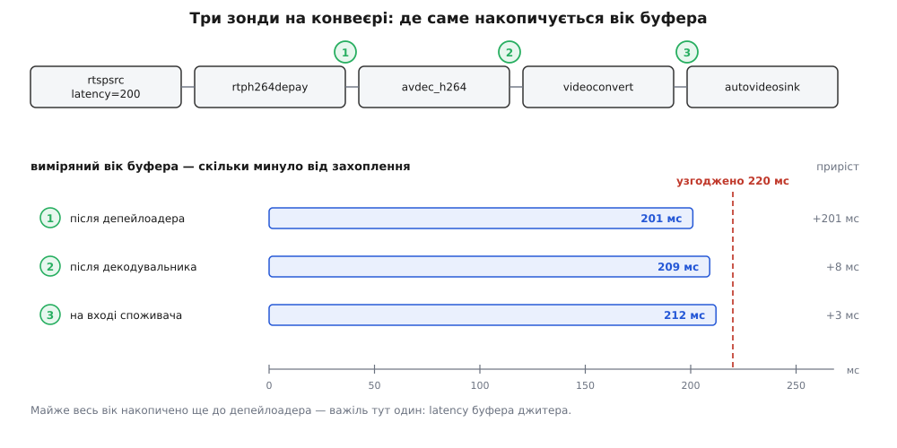
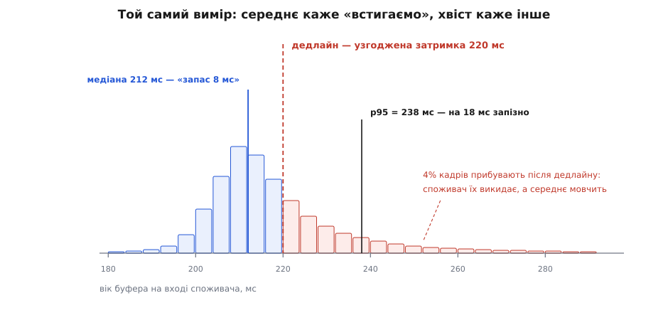

# ⚙️ Виміряти затримку живого конвеєра: що пообіцяно і що вийшло

<preknowlist>
- [Годинник, мітки часу й синхронізація](root:sys-media/clock-and-sync) — спільний годинник конвеєра, базовий час і running-time: шкала, у якій «зараз» і «мітка буфера» стають порівнянними числами.
- [Пади і з'єднання елементів](root:sys-media/pads-and-linking) — пад як точка, крізь яку йдуть буфери й події; саме на пад чіпляється зонд.
- [Буфери й пам'ять](root:sys-media/buffers-and-memory) — буфер як одиниця даних і мітка `PTS`, яку він несе.
- [Шина повідомлень](root:sys-media/bus-and-messages) — як конвеєр говорить із програмою; звідси приходить `GST_MESSAGE_LATENCY`.
- [Перцентилі й хвости](root:math-probability/percentiles-quantiles) — чому середнє й медіана описують розподіл по-різному і що каже верхній квантиль.
</preknowlist>

Конвеєр працює, картинка йде, і хтось питає: «а яка в нас затримка?» Питання здається одним, а насправді їх два, і відповіді на них різні. Перше — **скільки конвеєр пообіцяв**: те узгоджене число, яке споживач додає до кожного дедлайну. Друге — **скільки минуло насправді** від захоплення кадру до миті, коли він доїхав до конкретної точки конвеєра. Обидва добуваються кількома рядками коду, і найкорисніше — їхня різниця.

Обіцянку віддає запит `GST_QUERY_LATENCY`. Фактичний вік буфера — зонд на паді, який у мить проходження порівнює мітку буфера з показом годинника. Далі — робоча програма, яка робить і те, і те одразу в кількох точках, і розбір того, чому наївне вимірювання дає завищене число.

## Обіцянка: одне запитання до конвеєра

Запит про затримку — звичайний `GstQuery`, який можна поставити будь-якому елементу; конвеєр як бін відповідає на нього вже зведеним числом усіх гілок:

```c
GstQuery *q = gst_query_new_latency ();
gboolean live;
GstClockTime min, max;

if (gst_element_query (pipeline, q))
  gst_query_parse_latency (q, &live, &min, &max);
gst_query_unref (q);
```

`min` — та сама узгоджена затримка: підлога, під яку опуститися неможливо, і водночас число, яке споживачі фактично додають до дедлайну. `max` — стеля терпіння конвеєра; `GST_CLOCK_TIME_NONE` тут означає «стелі немає». `live` каже, чи є в конвеєрі джерело, прив'язане до реального часу. Якщо немає, дальша арифметика віку буфера сенсу не має: у не-живому конвеєрі дані йдуть попереду годинника, і «вік» виходить від'ємний.

Момент опитування важить. До переходу в PLAYING конвеєр ще не обрав годинника й не зафіксував базового часу, тож питати треба **після** того, як стан змінився. І ще: число живе, воно змінюється на ходу. Тому програма зобов'язана обробляти `GST_MESSAGE_LATENCY`:

```c
case GST_MESSAGE_LATENCY:
  gst_bin_recalculate_latency (GST_BIN (pipeline));
  break;
```

Пропустити цей рядок — не дрібниця саме для вимірювання. `rtspsrc` створює свої пади вже під час роботи; [буфер джитера](root:com-signal/jitter-buffer) переоцінює мережу й міняє власний внесок. Без перерахунку споживачі лишаються зі старим числом, а ваш вимірювач порівнює вік буферів із дедлайном, якого вже ніхто не дотримується.

## Факт: вік буфера в довільній точці

Тепер друге число. Ідея коротка: **мітка буфера каже, коли цей кадр існував; годинник каже, котра зараз.** Різниця і є вік — скільки часу кадр уже витратив на дорогу.

Обидві величини треба звести в одну шкалу — running-time, час від початку відтворення. Для буфера це робить сегмент:

```
running_time(буфера) = gst_segment_to_running_time(сегмент, GST_FORMAT_TIME, PTS)
```

Для «зараз» — годинник конвеєра мінус базовий час:

```
running_time(зараз) = gst_clock_get_time(годинник) − base_time(конвеєра)
```

Друга формула — дослівно те, що з версії 1.18 робить `gst_element_get_current_running_time()`. Обидва числа тепер в одній шкалі, і

```
вік = running_time(зараз) − running_time(буфера)
```

Сегмент доводиться ловити окремо: він приїжджає на пад подією `GST_EVENT_SEGMENT`, і без нього мітку нікуди перевести. Добра новина — сегмент належить до серіалізованих подій, тобто йде тим самим потоком і строго в черзі з буферами, тож зберігати його можна без жодних замків.

Зонд ставиться одним викликом:

```c
gst_pad_add_probe (pad,
    GST_PAD_PROBE_TYPE_BUFFER | GST_PAD_PROBE_TYPE_EVENT_DOWNSTREAM,
    on_pad, point, NULL);
```

І тут — головне рішення всієї програми: зондів має бути **кілька**. Одне число «затримка 212 мс» не каже нічого про те, що з нею робити. Три числа — після депейлоадера, після декодувальника, на вході споживача — одразу показують, **де** вік накопичився, а отже, яку ручку крутити.



*Приріст між точками важить більше за самі числа: якщо 201 мс із 212 набігло ще до депейлоадера, оптимізувати декодувальник — марна праця.*

## Робоча програма

Програма бере опис конвеєра рядком і список точок у вигляді `елемент:пад`. Так її можна натравити на будь-який конвеєр, не переписуючи код, — треба лише дати елементам імена через `name=` в описі.

:::tabs
```c
/* latency-probe.c — вік буфера в кількох точках живого конвеєра GStreamer.
 *
 *   gcc -O2 latency-probe.c -o latency-probe \
 *       $(pkg-config --cflags --libs gstreamer-1.0)
 *
 *   ./latency-probe "<опис конвеєра>" елемент:пад [елемент:пад ...]
 */
#include <gst/gst.h>

#define HIST_MS 2048                 /* гістограма до 2.048 с із кроком 1 мс */
#define WARMUP  (2 * GST_SECOND)     /* перші дві секунди не рахуємо */

typedef struct _Probe Probe;

typedef struct {
  Probe        *owner;
  gchar        *label;
  GstSegment    segment;             /* чіпає лише потік цього пада */
  gboolean      have_segment;
  guint64       n, late;             /* нижче — під замком */
  GstClockTime  worst;
  guint32       hist[HIST_MS];
} Point;

struct _Probe {
  GstElement   *pipeline;
  GMainLoop    *loop;
  GMutex        lock;
  Point         pt[16];
  guint         n_points;
  gboolean      live;
  GstClockTime  contract, ceiling;
};

/* ── 1. Що конвеєр ПООБІЦЯВ ───────────────────────────────────────────── */
static void
read_contract (Probe *pr)
{
  GstQuery *q = gst_query_new_latency ();
  gboolean live = FALSE;
  GstClockTime min = GST_CLOCK_TIME_NONE, max = GST_CLOCK_TIME_NONE;

  if (gst_element_query (pr->pipeline, q))
    gst_query_parse_latency (q, &live, &min, &max);
  gst_query_unref (q);

  g_mutex_lock (&pr->lock);
  pr->live = live;
  pr->contract = min;         /* саме це число споживач додає до дедлайну */
  pr->ceiling = max;          /* GST_CLOCK_TIME_NONE = стелі немає */
  g_mutex_unlock (&pr->lock);
}

/* ── 2. Що вийшло НАСПРАВДІ ───────────────────────────────────────────── */
static GstPadProbeReturn
on_pad (GstPad *pad, GstPadProbeInfo *info, gpointer user_data)
{
  Point *p = user_data;
  Probe *pr = p->owner;
  GstBuffer *buf;
  GstClock *clock;
  GstClockTime pts, rt_buf, base, abs_now, now, age;

  /* Сегмент серіалізований з буферами й іде тим самим потоком,
     тож зберігаємо його просто тут — замок не потрібен. */
  if (GST_PAD_PROBE_INFO_TYPE (info) & GST_PAD_PROBE_TYPE_EVENT_DOWNSTREAM) {
    GstEvent *ev = GST_PAD_PROBE_INFO_EVENT (info);
    if (GST_EVENT_TYPE (ev) == GST_EVENT_SEGMENT) {
      gst_event_copy_segment (ev, &p->segment);
      p->have_segment = TRUE;
    }
    return GST_PAD_PROBE_OK;
  }

  buf = GST_PAD_PROBE_INFO_BUFFER (info);
  pts = GST_BUFFER_PTS (buf);
  if (!p->have_segment || !GST_CLOCK_TIME_IS_VALID (pts))
    return GST_PAD_PROBE_OK;

  /* позиція буфера у спільній шкалі конвеєра */
  rt_buf = gst_segment_to_running_time (&p->segment, GST_FORMAT_TIME, pts);
  if (!GST_CLOCK_TIME_IS_VALID (rt_buf))        /* мітка поза сегментом */
    return GST_PAD_PROBE_OK;

  /* «зараз» у ТІЙ САМІЙ шкалі: показ годинника мінус базовий час.
     Дослівно те, що з 1.18 робить gst_element_get_current_running_time(). */
  clock = gst_element_get_clock (pr->pipeline);
  if (clock == NULL)                            /* годинника ще не обрано */
    return GST_PAD_PROBE_OK;
  base = gst_element_get_base_time (pr->pipeline);
  abs_now = gst_clock_get_time (clock);
  gst_object_unref (clock);

  if (!GST_CLOCK_TIME_IS_VALID (base) ||
      !GST_CLOCK_TIME_IS_VALID (abs_now) || abs_now < base)
    return GST_PAD_PROBE_OK;                    /* base_time ще не зафіксовано */
  now = abs_now - base;

  /* now < rt_buf — дані попереду годинника, тобто джерело не живе;
     now < WARMUP — розігрів, ці виміри брехливі (див. далі). */
  if (now < rt_buf || now < WARMUP)
    return GST_PAD_PROBE_OK;

  age = now - rt_buf;

  /* У потоковому потоці — тільки арифметика. Жодного вводу-виводу. */
  g_mutex_lock (&pr->lock);
  {
    guint ms = (guint) (age / GST_MSECOND);
    p->hist[ms < HIST_MS ? ms : HIST_MS - 1]++;
    p->n++;
    if (age > p->worst)
      p->worst = age;
    if (GST_CLOCK_TIME_IS_VALID (pr->contract) && age > pr->contract)
      p->late++;
  }
  g_mutex_unlock (&pr->lock);

  return GST_PAD_PROBE_OK;
}

/* ── 3. Звіт: квантилі з гістограми й приріст між точками ─────────────── */
static double
quantile_ms (const Point *p, double q)
{
  guint64 need = (guint64) (p->n * q), acc = 0;
  guint i;

  for (i = 0; i < HIST_MS; i++) {
    acc += p->hist[i];
    if (acc > 0 && acc >= need)
      return i;
  }
  return -1.0;
}

static const gchar *                            /* один виклик на g_print! */
ms_str (GstClockTime t)
{
  static gchar buf[32];
  if (!GST_CLOCK_TIME_IS_VALID (t))
    return "∞";
  g_snprintf (buf, sizeof buf, "%.1f мс", t / (double) GST_MSECOND);
  return buf;
}

static gboolean
report (gpointer user_data)
{
  Probe *pr = user_data;
  double prev = 0;
  guint i;

  read_contract (pr);                  /* число могло змінитися на ходу */

  g_mutex_lock (&pr->lock);
  g_print ("\nконтракт: live=%s  min=%s", pr->live ? "так" : "ні",
           ms_str (pr->contract));
  g_print ("  max=%s\n", ms_str (pr->ceiling));
  g_print ("%-24s %7s %8s %8s %8s %9s\n",
           "точка", "n", "p50", "p95", "макс", "приріст");

  for (i = 0; i < pr->n_points; i++) {
    Point *p = &pr->pt[i];
    double p50, p95;

    if (p->n == 0) {
      g_print ("%-24s       —\n", p->label);
      continue;
    }
    p50 = quantile_ms (p, 0.50);
    p95 = quantile_ms (p, 0.95);
    g_print ("%-24s %7" G_GUINT64_FORMAT " %8.0f %8.0f %8.1f %+9.0f\n",
             p->label, p->n, p50, p95,
             p->worst / (double) GST_MSECOND, p50 - prev);
    prev = p50;

    if (i + 1 == pr->n_points && GST_CLOCK_TIME_IS_VALID (pr->contract)) {
      double budget = pr->contract / (double) GST_MSECOND;
      g_print ("   запас до дедлайну: p50 %+.0f мс, p95 %+.0f мс; "
               "після дедлайну %" G_GUINT64_FORMAT " з %" G_GUINT64_FORMAT
               " (%.1f%%)\n",
               budget - p50, budget - p95, p->late, p->n,
               100.0 * p->late / p->n);
    }
  }
  g_mutex_unlock (&pr->lock);
  return G_SOURCE_CONTINUE;
}

/* ── 4. Шина: без цього контракт застаріває ───────────────────────────── */
static gboolean
on_bus (GstBus *bus, GstMessage *msg, gpointer user_data)
{
  Probe *pr = user_data;

  switch (GST_MESSAGE_TYPE (msg)) {
    case GST_MESSAGE_LATENCY:
      /* Хтось змінив свій внесок: rtspsrc додав пад, буфер джитера
         переоцінив мережу. Перерахувати й розіслати наново. */
      gst_bin_recalculate_latency (GST_BIN (pr->pipeline));
      read_contract (pr);
      g_print ("↻ затримку перераховано: %s\n", ms_str (pr->contract));
      break;

    case GST_MESSAGE_STATE_CHANGED:
      if (GST_MESSAGE_SRC (msg) == GST_OBJECT (pr->pipeline)) {
        GstState now;
        gst_message_parse_state_changed (msg, NULL, &now, NULL);
        if (now == GST_STATE_PLAYING)
          read_contract (pr);          /* аж тепер є годинник і base_time */
      }
      break;

    case GST_MESSAGE_ERROR: {
      GError *err = NULL;
      gchar *dbg = NULL;
      gst_message_parse_error (msg, &err, &dbg);
      g_printerr ("помилка: %s\n%s\n", err->message, dbg ? dbg : "");
      g_clear_error (&err);
      g_free (dbg);
      g_main_loop_quit (pr->loop);
      break;
    }

    case GST_MESSAGE_EOS:
      g_main_loop_quit (pr->loop);
      break;

    default:
      break;
  }
  return TRUE;
}

/* ── 5. Складання ─────────────────────────────────────────────────────── */
static gboolean
add_point (Probe *pr, const gchar *spec)         /* «dec:src» */
{
  gchar **bits = g_strsplit (spec, ":", 2);
  GstElement *el;
  GstPad *pad;
  Point *p;

  if (bits[0] == NULL || bits[1] == NULL) {
    g_printerr ("точка має вигляд «елемент:пад», а не «%s»\n", spec);
    g_strfreev (bits);
    return FALSE;
  }
  el = gst_bin_get_by_name (GST_BIN (pr->pipeline), bits[0]);
  if (el == NULL) {
    g_printerr ("немає елемента «%s» — дайте йому name= в описі конвеєра\n",
                bits[0]);
    g_strfreev (bits);
    return FALSE;
  }
  pad = gst_element_get_static_pad (el, bits[1]);
  gst_object_unref (el);
  if (pad == NULL) {
    g_printerr ("в елемента «%s» немає статичного пада «%s»\n",
                bits[0], bits[1]);
    g_strfreev (bits);
    return FALSE;
  }
  g_strfreev (bits);

  p = &pr->pt[pr->n_points++];
  p->owner = pr;
  p->label = g_strdup (spec);
  gst_segment_init (&p->segment, GST_FORMAT_UNDEFINED);

  gst_pad_add_probe (pad,
      GST_PAD_PROBE_TYPE_BUFFER | GST_PAD_PROBE_TYPE_EVENT_DOWNSTREAM,
      on_pad, p, NULL);
  gst_object_unref (pad);
  return TRUE;
}

int
main (int argc, char **argv)
{
  Probe pr = { 0 };
  GError *err = NULL;
  GstBus *bus;
  int i;

  gst_init (&argc, &argv);
  if (argc < 3) {
    g_printerr ("вжиток: %s \"<опис конвеєра>\" елемент:пад [елемент:пад ...]\n",
                argv[0]);
    return 1;
  }

  g_mutex_init (&pr.lock);
  pr.contract = pr.ceiling = GST_CLOCK_TIME_NONE;
  pr.pipeline = gst_parse_launch (argv[1], &err);
  if (pr.pipeline == NULL) {
    g_printerr ("не склався конвеєр: %s\n", err->message);
    g_clear_error (&err);
    return 1;
  }
  for (i = 2; i < argc && pr.n_points < G_N_ELEMENTS (pr.pt); i++)
    if (!add_point (&pr, argv[i]))
      return 1;

  bus = gst_element_get_bus (pr.pipeline);
  gst_bus_add_watch (bus, on_bus, &pr);
  gst_object_unref (bus);

  pr.loop = g_main_loop_new (NULL, FALSE);
  g_timeout_add_seconds (2, report, &pr);

  gst_element_set_state (pr.pipeline, GST_STATE_PLAYING);
  g_main_loop_run (pr.loop);

  gst_element_set_state (pr.pipeline, GST_STATE_NULL);
  gst_object_unref (pr.pipeline);
  return 0;
}
```
```python
#!/usr/bin/env python3
"""latency-probe.py — вік буфера в кількох точках живого конвеєра.

    python3 latency-probe.py "<опис конвеєра>" елемент:пад [елемент:пад ...]

Прототип: тримає ковзне вікно останніх вимірів замість гістограми —
коротше й показує свіжу поведінку, а не всю історію.
"""
import sys
import threading
from collections import deque

import gi
gi.require_version("Gst", "1.0")
from gi.repository import Gst, GLib

WARMUP = 2 * Gst.SECOND
WINDOW = 3000


class Point:
    def __init__(self, label):
        self.label = label
        self.segment = None                  # чіпає лише потік цього пада
        self.ages = deque(maxlen=WINDOW)     # мс, під замком
        self.n = 0
        self.late = 0

    def quantile(self, q):
        w = sorted(self.ages)
        return w[min(int(q * len(w)), len(w) - 1)] if w else None


class Probe:
    def __init__(self, desc, specs):
        self.pipeline = Gst.parse_launch(desc)
        self.lock = threading.Lock()
        self.live, self.contract, self.ceiling = False, None, None
        self.points = []
        for spec in specs:
            name, _, padname = spec.partition(":")
            el = self.pipeline.get_by_name(name)
            if el is None:
                sys.exit(f"немає елемента «{name}» — дайте йому name= в описі")
            pad = el.get_static_pad(padname)
            if pad is None:
                sys.exit(f"в елемента «{name}» немає пада «{padname}»")
            pt = Point(spec)
            pad.add_probe(
                Gst.PadProbeType.BUFFER | Gst.PadProbeType.EVENT_DOWNSTREAM,
                self._on_pad, pt)
            self.points.append(pt)

    # ── що конвеєр пообіцяв
    def read_contract(self):
        q = Gst.Query.new_latency()
        if not self.pipeline.query(q):
            return
        live, mn, mx = q.parse_latency()
        with self.lock:
            self.live = live
            self.contract = None if mn == Gst.CLOCK_TIME_NONE else mn
            self.ceiling = None if mx == Gst.CLOCK_TIME_NONE else mx

    # ── що вийшло насправді
    def _on_pad(self, pad, info, pt):
        if info.type & Gst.PadProbeType.EVENT_DOWNSTREAM:
            ev = info.get_event()
            if ev.type == Gst.EventType.SEGMENT:
                pt.segment = ev.parse_segment()
            return Gst.PadProbeReturn.OK

        buf = info.get_buffer()
        if pt.segment is None or buf.pts == Gst.CLOCK_TIME_NONE:
            return Gst.PadProbeReturn.OK

        rt_buf = pt.segment.to_running_time(Gst.Format.TIME, buf.pts)
        now = self.pipeline.get_current_running_time()   # годинник − base_time
        if rt_buf == Gst.CLOCK_TIME_NONE or now == Gst.CLOCK_TIME_NONE:
            return Gst.PadProbeReturn.OK
        if now < rt_buf or now < WARMUP:      # не живе джерело або розігрів
            return Gst.PadProbeReturn.OK

        age = now - rt_buf
        with self.lock:
            pt.ages.append(age // Gst.MSECOND)
            pt.n += 1
            if self.contract is not None and age > self.contract:
                pt.late += 1
        return Gst.PadProbeReturn.OK

    # ── звіт раз на дві секунди
    def report(self):
        self.read_contract()
        with self.lock:
            budget = None if self.contract is None else self.contract / Gst.MSECOND
            if budget is None:
                print("\nконтракт: ще невідомий")
            else:
                live = "так" if self.live else "ні"
                print(f"\nконтракт: live={live}  min={budget:.1f} мс")
            print(f"{'точка':<24} {'n':>7} {'p50':>8} {'p95':>8} "
                  f"{'макс':>8} {'приріст':>9}")

            prev = 0
            for pt in self.points:
                p50, p95 = pt.quantile(0.50), pt.quantile(0.95)
                if p50 is None:
                    print(f"{pt.label:<24} {'—':>7}")
                    continue
                print(f"{pt.label:<24} {pt.n:>7} {p50:>8.0f} {p95:>8.0f} "
                      f"{max(pt.ages):>8.0f} {p50 - prev:>+9.0f}")
                prev = p50

            last = self.points[-1]
            if budget is not None and last.n:
                print(f"   запас до дедлайну: p50 {budget - last.quantile(0.50):+.0f} мс,"
                      f" p95 {budget - last.quantile(0.95):+.0f} мс;"
                      f" після дедлайну {last.late} з {last.n}")
        return True                          # таймер лишається жити

    # ── шина
    def on_bus(self, bus, msg):
        if msg.type == Gst.MessageType.LATENCY:
            self.pipeline.recalculate_latency()   # інакше контракт застаріє
            self.read_contract()
        elif msg.type == Gst.MessageType.STATE_CHANGED and msg.src == self.pipeline:
            if msg.parse_state_changed()[1] == Gst.State.PLAYING:
                self.read_contract()              # аж тепер є base_time
        elif msg.type == Gst.MessageType.ERROR:
            print(msg.parse_error()[0].message, file=sys.stderr)
            self.loop.quit()
        elif msg.type == Gst.MessageType.EOS:
            self.loop.quit()
        return True

    def run(self):
        bus = self.pipeline.get_bus()
        bus.add_signal_watch()
        bus.connect("message", self.on_bus)
        self.loop = GLib.MainLoop()
        GLib.timeout_add_seconds(2, self.report)
        self.pipeline.set_state(Gst.State.PLAYING)
        try:
            self.loop.run()
        finally:
            self.pipeline.set_state(Gst.State.NULL)


if __name__ == "__main__":
    Gst.init(None)
    if len(sys.argv) < 3:
        sys.exit('вжиток: latency-probe.py "<опис конвеєра>" елемент:пад ...')
    Probe(sys.argv[1], sys.argv[2:]).run()
```
:::

Запуск на мережевій камері з трьома точками:

```sh
./latency-probe \
  "rtspsrc location=rtsp://cam/stream latency=200 \
   ! rtph264depay name=depay ! h264parse \
   ! avdec_h264 name=dec ! videoconvert \
   ! autovideosink name=out" \
  depay:src dec:src out:sink
```

І те, що вона друкує:

```
контракт: live=так  min=220.0 мс  max=∞
точка                          n      p50      p95     макс   приріст
depay:src                   1794      201      204    214.8      +201
dec:src                     1794      209      226    271.2        +8
out:sink                    1791      212      238    287.6        +3
   запас до дедлайну: p50 +8 мс, p95 -18 мс; після дедлайну 71 з 1791 (4.0%)
```

Уся діагностика — в одному стовпчику приросту. Двісті одна мілісекунда з двохсот дванадцяти набігає ще до депейлоадера, тобто в буфері джитера, якому ми самі наказали `latency=200`. Декодувальник додає вісім, решта конвеєра — три. Скільки не оптимізуй декодування, наскрізне число зрушить хіба на кілька мілісекунд; єдина ручка, що тут щось означає, — те саме `latency=200`.

Другий стовпчик, вартий уваги, — розкид. Після буфера джитера `p50` і `p95` майже збігаються (201 і 204): він на те й існує, щоб перетворювати нерівний прихід пакетів на рівний. Після декодувальника розкид роз'їжджається (209 і 226) — опорні кадри коштують дорожче за решту.

## Пастка перша: зонд бачить прибуття, а не показ

Найтиповіша спроба виміряти затримку — засікти час від захоплення до появи на екрані. Число виходить велике, і з нього роблять хибний висновок.

Розберімо, що воно містить. Споживач малює кадр не тоді, коли той прийшов, а тоді, коли настане дедлайн:

```
показ    = running_time(буфера) + base_time + затримка   ← обіцянка конвеєра
прибуття = running_time(буфера) + base_time + вік        ← те, що бачить зонд
запас    = затримка − вік
```

Зонд на паді споживача спрацьовує **до** того, як `GstBaseSink` ляже чекати годинника. Отже, зонд міряє прибуття, а різниця «захоплення → показ» дорівнює не віку, а **затримці** — тому самому числу, яке ви задали налаштуваннями. Здоровий конвеєр покаже наскрізні 220 мс і при швидкому декодувальнику, і при вдвічі повільнішому: різниця піде в запас, а не в екран.

Звідси два висновки, що рятують купу марної роботи. Наскрізне вимірювання відповідає на питання «скільки ми **пообіцяли**», а не «скільки ми **витрачаємо**»; воно не зрушить від оптимізації коду й зрушить від однієї зміни `latency=200` на `latency=80`. А от протилежний випадок — коли наскрізне помітно **більше** за контракт — і є тим самим тихим наростанням у чергах: конвеєр не має про нього гадки, бо черга нічого не додає до узгодженого мінімуму. Зонд — єдиний інструмент, який це бачить.

> 🔧 **Навіщо це.** Два числа відповідають на два різні питання. «Чи вкладаємося?» — це запас, тобто контракт мінус вік. «Чи можна швидше?» — це зменшити контракт і подивитися, чи запас лишився додатним. Питати «яка в нас затримка» одним числом означає не відповісти на жодне з них.

## Пастка друга: перші кадри брешуть

Спокуса почати рахувати з першого ж буфера коштує дорого — з двох різних причин.

Формальна: до переходу в PLAYING базового часу просто немає. `gst_element_get_current_running_time()` поверне `GST_CLOCK_TIME_NONE`, а наївне віднімання `годинник − base_time` на нулі дасть колосальне число, яке одразу зіпсує і максимум, і середнє. Тому в коді стоїть перевірка `GST_CLOCK_TIME_IS_VALID (base)`, а не сподівання на щасливий збіг.

Змістовна: навіть коли базовий час уже є, перші кадри проходять не через той конвеєр, який ви збираєтеся міряти. Ще узгоджуються caps, ще створюються пули буферів, апаратний декодувальник щойно ініціалізувався, `rtspsrc` чекає на опорний кадр, а буфер джитера ще не вийшов на свій режим. Перші виміри бувають утричі більші за сталі — і одного такого досить, щоб зіпсувати весь звіт.

Ліки прості: `WARMUP` — не рахувати нічого, доки running-time конвеєра не перевалить за дві секунди. Це чесніше за викидання «викидів» постфактум: ви відкидаєте виміри за **відомою причиною**, а не за тим, що вони вам не сподобалися.

## Пастка третя: середнє без розкиду

Одне число «середня затримка 216 мс» при дедлайні 220 звучить заспокійливо. Подивімося на той самий вимір розподілом.



*Половина кадрів має вісім мілісекунд запасу, а верхні п'ять відсотків спізнюються на вісімнадцять. Середнє про це не каже нічого.*

**Умова.** Той самий прогін: 1791 вимір на вході споживача, узгоджена затримка 220 мс, потік 25 к/с.

```
середнє = 216 мс  →  «дедлайн 220 мс, вкладаємось»
p50     = 212 мс      половина кадрів має 8 мс запасу
p95     = 238 мс      кожен двадцятий спізнюється на 18 мс
макс    = 288 мс
після дедлайну: 71 кадр із 1791 = 4.0%  ≈  кадр на секунду
```

Причина розбіжності — форма розподілу. У віку буфера є **підлога** (менше фізично не буває) і **хвіст** угору: планувальник, промах кешу, важчий кадр, ретрансмісія в мережі. Серцевина щільна, тож середнє сидить близько до медіани й вигляд має пристойний, а ламає систему саме хвіст: споживач викидає не «середній» кадр, а той, що запізнився. Тому програма й тримає гістограму: медіана каже про типову поведінку, `p95` і максимум — про те, скільки кадрів реально пропаде.

І ще одна підступність, через яку в звіті стоїть стовпчик `n`. Якщо десь вище за течією працює черга, що скидає старе (`leaky=downstream`), або буфер джитера з `drop-on-latency=true`, то до споживача доходять лише свіжі кадри — старі викидають дорогою. Вік виглядатиме чудово **саме тому, що дані зникають**. Метрика покращується, поки система гіршає. Порятунок один: дивитися на вік і на кількість вимірів разом, а падіння `n` при незмінному прогоні читати як втрату кадрів.

## Пастка четверта: мітку могли переписати

Уся арифметика тримається на припущенні, що `PTS` буфера означає мить його народження. Це правда не завжди.

Для локальної камери — правда: `v4l2src` ставить мітку в момент захоплення, і вік справді читається як «минуло від зйомки». Для [мережевого джерела](root:sys-media/network-sources) — з поправкою: буфер джитера відображає RTP-мітки у свою шкалу, спираючись на оцінку розбіжності годинників, тож початок відліку — не показ годинника камери, а момент, який буфер джитера цьому кадрові **призначив**. Без звітів відправника по RTCP (`rtspsrc ntp-sync=true` разом із `buffer-mode=synced`) абсолютне число несе в собі похибку цієї оцінки. Приріст між точками похибки не має — це чиста арифметика одного місцевого годинника, і саме тому приріст надійніший за абсолютне значення.

Окремо варто пам'ятати про елементи, які переставляють мітки самі: `videorate` вирівнює їх під сталу частоту, джерела з `do-timestamp=true` штампують за часом прийому, `identity single-segment=true` склеює сегменти. Точка після такого елемента міряє вік від іншого початку відліку, і порівнювати її з точкою до нього не можна. Ознака в звіті проста й помітна: приріст виходить від'ємний або підозріло круглий.

## Пастка п'ята: зонд коштує

Зонд виконується **в потоковому потоці, посеред шляху, який ви міряєте**. Усе, що він робить, додається до виміряного числа.

Тому в програмі під замком лише інкремент комірки гістограми й три порівняння — десятки наносекунд при кадровому періоді в сорок мільйонів наносекунд. Друк винесено в таймер головного циклу. Спокуслива однорядкова версія «просто надрукувати вік кожного буфера» коштує системний виклик, блокування на потоці виводу й можливе очікування на терміналі — цілком реальні одиниці мілісекунд, які ви ж і побачите в результаті.

У Python до цього додається глобальний замок інтерпретатора: кожен зонд бере його на час свого виконання, тож зонди на різних гілках починають чекати одне одного. Прототип на Python чесно показує **порядок** величин і те, де накопичується вік; коли йдеться про десятки мілісекунд на всю обробку, міряти треба на C або трасувальником.

## Складність і ціна

На буфер — стала робота: одне перетворення сегмента, одне читання годинника з парою атомарних операцій на посилання, короткий замок на кілька арифметичних дій. Пам'ять теж стала: гістограма з 2048 комірок по чотири байти — вісім кілобайтів на точку, незалежно від того, скільки годин крутиться конвеєр. Квантиль дістається одним проходом по гістограмі, і робиться це раз на дві секунди, а не на кадр.

Точність гістограми — одна мілісекунда, і для живого відео цього досить: кадровий період на 30 к/с — 33 мс. Для звуку з порціями по 10 мс крок треба дрібнити, скажімо, до 0.1 мс — це та сама структура з іншим дільником.

Стеля гістограми в 2.048 с — свідомий компроміс: усе, що більше, лягає в останню комірку. Максимум при цьому не губиться, бо `worst` рахується окремо, повним значенням.

## Те саме задарма: вбудований трасувальник

Якщо потрібне не постійне вимірювання у власній програмі, а разовий погляд, писати нічого не треба — усе вже є в GStreamer:

```sh
GST_TRACERS="latency(flags=pipeline+element+reported)" \
GST_DEBUG=GST_TRACER:7 \
  gst-launch-1.0 rtspsrc location=rtsp://cam/stream latency=200 \
    ! rtph264depay ! h264parse ! avdec_h264 ! videoconvert ! autovideosink \
  2> latency.log
```

Трасувальник працює тим самим прийомом, що й наш зонд, тільки зсередини: він вставляє власну подію в джерелі й обробляє її в споживачі. Три прапорці дають три різні зрізи.

`pipeline` — наскрізний час від джерела до споживача, по рядку на кадр:

```
latency, src-element-id=(string)0x55b1c04a2100, src-element=(string)rtspsrc0,
  src=(string)src, sink-element-id=(string)0x55b1c051f3c0,
  sink-element=(string)autovideosink0-actual-sink-xvimage, sink=(string)sink,
  time=(guint64)212418000, ts=(guint64)46656191434
```

`time` — це вік у наносекундах: 212418000 нс = 212.4 мс, той самий показник, що й у нашої останньої точки. `ts` — коли вимір записано, у running-time; за ним рядки шикуються в часовий ряд.

`element` — час усередині одного елемента, теж по рядку на кадр:

```
element-latency, element-id=(string)0x55b1c04d8a20, element=(string)avdec_h264-0,
  src=(string)src, time=(guint64)7940000, ts=(guint64)46656183000
```

Це прямий аналог нашого стовпчика приросту, тільки з розбивкою по кожному елементу, а не по обраних точках.

`reported` — те, що кожен елемент **сам повідомив** у відповідь на запит: його власне вікно `min`/`max`. Це вже не вимір, а контракт у розібраному вигляді — відповідь на питання «хто саме поставив підлогу в 220 мс».

Різниця між трасувальником і зондом — не в точності, а в тому, що з числами робити далі. Трасувальник видає потік рядків, які ще треба зібрати в статистику: `p95` він не порахує, запасу до дедлайну не покаже, у вашу телеметрію не потрапить. Зате не вимагає ані рядка коду й одразу дає розбивку по всіх елементах.

Два зауваги на практику. Виводити треба у файл, а не в термінал: на 30 к/с із трьома прапорцями це тисячі рядків на секунду, і сам вивід почне впливати на те, що міряється. І трасувальник спирається на те, що елементи пропускають крізь себе чужі спадні події, — переважна більшість пропускає, але елемент, який їх ковтає, тихо розірве ланцюжок, і рядків `latency` ви просто не побачите.

Тож розклад інструментів такий. Разово подивитися, куди йде час, — трасувальник із `flags=pipeline+element`. Дізнатися, хто поставив підлогу, — той самий трасувальник із `reported` або один запит `GST_QUERY_LATENCY`. А зонди на падах потрібні там, де вимірювання має жити далі за один запуск: коли треба стежити за запасом до дедлайну, рахувати спізнілі кадри й віддавати ці числа у власну телеметрію, а не в журнал налагодження.
