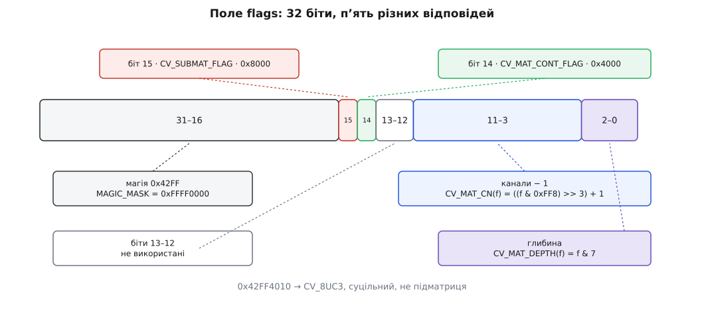

# 📋 Контракт володіння в `cv::Mat`: поля, конструктори, виклики

Аркуш для того, хто мусить відповісти на одне питання про конкретний `Mat`: **хто звільнить ці байти й коли**. Тут кожне поле заголовка з точним значенням, кожен конструктор із позначкою «володіє / не володіє», що робить із лічильником кожен виклик і що зобов'язана реалізувати власна підстановка алокатора.

Усі сигнатури — з гілки OpenCV `4.x` (`modules/core/include/opencv2/core/mat.hpp`, `mat.inl.hpp`; реалізації — `modules/core/src/matrix.cpp`, `copy.cpp`, `alloc.cpp`, `umatrix.cpp`). Де щось з'явилося пізніше за 4.0 або відрізняється від 3.x — версія стоїть поруч.

## Поля заголовка

```cpp
int flags;               // магія · суцільність · підматриця · глибина · канали
int dims;                // кількість вимірів
int rows, cols;          // при dims > 2 обидва дорівнюють −1
uchar* data;             // перший байт ЦЬОГО заголовка
const uchar* datastart;  // помічники для locateROI / adjustROI
const uchar* dataend;
const uchar* datalimit;
MatAllocator* allocator; // індивідуальний алокатор або 0
UMatData* u;             // керівний блок; 0 — заголовок нічим не володіє
MatSize size;
MatStep step;
```

| Поле | Тип | Що означає точно |
|---|---|---|
| `flags` | `int` | бітове поле; розкладене нижче |
| `dims` | `int` | кількість вимірів; для зображення 2, для порожнього `Mat` — 0 |
| `rows`, `cols` | `int` | розміри при `dims == 2`; при `dims > 2` виставлені в −1, читати їх не можна |
| `data` | `uchar*` | перший байт **цього** вигляду даних; у вирізі зміщений усередину чужого блоку |
| `datastart` | `const uchar*` | початок **усього** блоку; виріз успадковує від батька без змін |
| `dataend` | `const uchar*` | за останнім байтом, який адресує цей заголовок |
| `datalimit` | `const uchar*` | за останнім байтом усього блоку |
| `allocator` | `MatAllocator*` | алокатор саме цього заголовка; `0` означає «взяти `getDefaultAllocator()`» |
| `u` | `UMatData*` | керівний блок із лічильниками; `nullptr` — володіння немає взагалі |
| `size` | `MatSize` | `size[i]` — розмір i-го виміру; при `dims ≤ 2` внутрішній покажчик дивиться прямо на `rows` |
| `step` | `MatStep` | `step[i]` — байтів між сусідніми елементами i-го виміру; `step[dims−1] == elemSize()` завжди |

Три «межові» покажчики оголошені як `const uchar*` і в самій бібліотеці підписані як помічники для `locateROI`/`adjustROI` — це не декоративні поля, а єдине джерело даних про батьківський буфер, коли на руках лишився самий виріз.

## `flags` побітово

| Біти | Що там | Маска | Читається як |
|---|---|---|---|
| 0–2 | глибина (`CV_8U` … `CV_16F`) | `CV_MAT_DEPTH_MASK` = 7 | `CV_MAT_DEPTH(flags)` |
| 3–11 | кількість каналів **мінус один** | `CV_MAT_CN_MASK` = `(512−1) << 3` = `0xFF8` | `CV_MAT_CN(flags)` |
| 0–11 | тип цілком (глибина + канали) | `CV_MAT_TYPE_MASK` = `0x00000FFF` | `CV_MAT_TYPE(flags)` = `type()` |
| 12–13 | не використані | — | — |
| 14 | суцільність | `CV_MAT_CONT_FLAG` = `1 << 14` = `0x4000` | `isContinuous()` |
| 15 | підматриця | `CV_SUBMAT_FLAG` = `1 << 15` = `0x8000` | `isSubmatrix()` |
| 16–31 | сигнатура типу | `MAGIC_MASK` = `0xFFFF0000`, `MAGIC_VAL` = `0x42FF0000` | ознака дійсного заголовка |



*Ті самі біти читають і макроси з `cvdef.h`, і константи всередині `Mat` — `Mat::TYPE_MASK` і `CV_MAT_TYPE_MASK` описують один і той самий діапазон.*

**Умова.** У налагоджувачі видно `flags = 0x42FF4010`. Розкладаємо.

```
0x42FF4010 & 0xFFFF0000 = 0x42FF0000   → MAGIC_VAL: заголовок дійсний
0x42FF4010 & 0x00000FFF = 0x010 = 16   → тип
    глибина = 16 & 7 = 0                        → CV_8U
    канали  = ((16 & 0xFF8) >> 3) + 1 = 2 + 1   → 3
    разом                                       → CV_8UC3
0x42FF4010 & 0x4000 = 0x4000           → суцільний: isContinuous() == true
0x42FF4010 & 0x8000 = 0                → не підматриця: isSubmatrix() == false
```

Біт 15 виставляє **лише** конструктор вирізу, і то за умовою `roi.width < m.cols || roi.height < m.rows`. Тому виріз «на весь кадр» підматрицею не рахується, а заголовок над чужим буфером із великим кроком рядка не має цього біта ніколи — навіть коли він несуцільний. `isSubmatrix()` відповідає на питання «звідки взявся заголовок», `isContinuous()` — на питання «чи стикаються рядки»; плутати їх не можна.

## Межі буфера: точні формули

```
власна пам'ять (finalizeHdr):
    datastart = data = u->data
    datalimit = datastart + size[0] · step[0]
    dataend   = data + size[d−1] · step[d−1] + Σ (size[i] − 1) · step[i],  i = 0 … d−2

заголовок над чужим буфером — Mat(rows, cols, type, void* p, step):
    datastart = data = p
    datalimit = datastart + step · rows
    dataend   = datalimit − step + cols · elemSize()
```

| Поле | Що з ним робить виріз `m(Rect)` |
|---|---|
| `data` | зсувається: `m.data + roi.y·step[0] + roi.x·elemSize()` |
| `step[0]`, `step[1]` | успадковуються від батька без змін |
| `datastart`, `dataend`, `datalimit` | копіюються від батька **як є** — саме тому за вирізом відновлюється весь кадр |
| `flags` | копіюються, далі додається `SUBMATRIX_FLAG` і перераховується біт суцільності |
| `u` | той самий покажчик, `refcount` +1 |

Конструктор із чужим покажчиком перевіряє крок жорстко: `step ≥ cols · elemSize()`, інакше `CV_Assert`; `step % elemSize1() != 0` — `CV_Error(Error::BadStep)`. Значення `AUTO_STEP` (це просто 0) означає «рядки стикаються».

## Конструктори: володіє чи ні

| Конструктор | Пам'ять | `u` | Хто звільняє байти |
|---|---|---|---|
| `Mat()` | немає | `0` | нікому нічого |
| `Mat(int rows, int cols, int type)` | виділяє | `≠ 0`, `refcount = 1` | **володіє**: останній `release()` |
| `Mat(Size size, int type)` | виділяє | `≠ 0` | **володіє** |
| `Mat(int rows, int cols, int type, const Scalar& s)` | виділяє й заповнює | `≠ 0` | **володіє** |
| `Mat(int ndims, const int* sizes, int type)` | виділяє | `≠ 0` | **володіє** |
| `Mat(const std::vector<int>& sizes, int type)` | виділяє | `≠ 0` | **володіє** |
| `Mat(const Mat& m)` | не виділяє | `= m.u`, `refcount` +1 | **спільно**: останній із власників |
| `Mat(Mat&& m)` | не виділяє | забирає `m.u`, лічильника **не чіпає** | **спільно**; джерело стає порожнім |
| `Mat(int rows, int cols, int type, void* data, size_t step = AUTO_STEP)` | не виділяє | `0` | **не володіє** — тільки ви |
| `Mat(Size size, int type, void* data, size_t step = AUTO_STEP)` | не виділяє | `0` | **не володіє** |
| `Mat(int ndims, const int* sizes, int type, void* data, const size_t* steps = 0)` | не виділяє | `0` | **не володіє** |
| `Mat(const std::vector<int>& sizes, int type, void* data, const size_t* steps = 0)` | не виділяє | `0` | **не володіє** |
| `Mat(const Mat& m, const Rect& roi)` | не виділяє | `= m.u`, +1 | **спільно**; `SUBMATRIX_FLAG` за умовою вище |
| `Mat(const Mat& m, const Range& rowRange, const Range& colRange = Range::all())` | не виділяє | `= m.u`, +1 | **спільно** |
| `Mat(const Mat& m, const Range* ranges)` та варіант зі `std::vector<Range>` | не виділяє | `= m.u`, +1 | **спільно** |
| `template<class T> explicit Mat(const std::vector<T>& vec, bool copyData = false)` | при `false` не виділяє | `0` | **не володіє**: живе, доки живий вектор і доки той не переселив свій буфер |
| той самий із `copyData = true` | виділяє й копіює | `≠ 0` | **володіє** |
| `explicit Mat(const cuda::GpuMat& m)` | виділяє й завантажує з пристрою | `≠ 0` | **володіє** |

Ключ до всієї таблиці — поле `u`. Три конструктори з чужим покажчиком просто записують його в `data` і лишають `u` нулем; далі `release()` бачить нуль, нічого не зменшує й нічого не звільняє. Це не аварійний, а звичайний робочий стан заголовка.

## Виклики, що рухають лічильник

| Виклик | Лічильник | Перевиділення | Що робить із даними |
|---|---|---|---|
| `void addref()` | +1, якщо `u ≠ 0` | ні | нічого |
| `void release()` | −1; на переході 1 → 0 кличе `deallocate()` | так, на нулі | обнуляє `u`, `data`, всі три межові покажчики й усі `size[i]` |
| `void deallocate()` | не чіпає | так | внутрішній: кличе `unmap(u)` в алокатора, а не `deallocate(u)` |
| `void create(int rows, int cols, int type)` | `release()` + `addref()`, коли перевиділяє | **умовно** | умова «нічого не робити» точна: `dims ≤ 2 && rows == _rows && cols == _cols && type() == _type && data` |
| `void create(Size, int)`, `create(int ndims, const int*, int)`, `create(const std::vector<int>&, int)` | так само | умовно | для n-вимірних порівнюються всі `size[i]` |
| `Mat& operator=(const Mat& m)` | +1 джерелу, **потім** −1 своєму | ні | дані спільні; порядок операцій рятує `a = a(roi)` |
| `Mat& operator=(Mat&& m)` | −1 своєму, потім перенесення без `addref` | ні | джерело стає порожнім |
| `Mat clone() const` | новий блок із `refcount = 1` | так | усередині просто `Mat m; copyTo(m); return m;` |
| `void copyTo(OutputArray m) const` | залежить від приймача | **так**: кличе `m.create(rows, cols, type())` | якщо `data == dst.data` — виходить одразу, не копіюючи |
| `void copyTo(OutputArray m, InputArray mask) const` | так само | так | коли `create` перевиділив, новий буфер спершу занулюється |
| `void copyAt(OutputArray m) const` (з 4.13) | не чіпає приймача | **ніколи** | вимагає збіг розміру й типу, інакше виняток; далі та сама механіка `copyTo` |
| `Mat& setTo(InputArray value, InputArray mask = noArray())` | не чіпає | ніколи | пише крізь заголовок у спільні байти; на порожньому `Mat` тихо нічого не робить |
| `Mat reshape(int cn, int rows = 0) const` | новий заголовок, +1 | ні | ті самі байти; змінити `rows` можна лише на суцільному, інакше `CV_Error(BadStep)` |
| `Mat reshape(int cn, int newndims, const int* newsz) const` | +1 | ні | те саме для n вимірів |
| `Mat operator()(const Rect& roi) const`, `operator()(Range, Range)` | +1 | ні | конструктор вирізу |
| `void locateROI(Size& wholeSize, Point& ofs) const` | не чіпає | ні | суто арифметика над покажчиками; вимагає `dims ≤ 2 && step[0] > 0` |
| `Mat& adjustROI(int dtop, int dbottom, int dleft, int dright)` | не чіпає | ні | рухає `data` і розміри **в межах батьківського буфера**, зайве обрізає до `wholeSize`, перераховує суцільність |
| `~Mat()` | −1 | так, на нулі | кличе `release()` |

Дві дрібниці з реалізації, які видно тільки в коді.

Перша: `release()` у налагоджувальній збірці (`_DEBUG`) робить більше, ніж у робочій — додатково скидає `flags`, `dims`, `rows`, `cols` і звільняє окремий буфер кроків для n-вимірних. Тому код, що читає заголовок після звільнення, у Debug падає, а в Release «працює».

Друга стосується приймача. `copyTo` приймає не `Mat&`, а проксі `OutputArray`, і саме проксі вирішує, чи дозволено перевиділення: у проксі є біти `FIXED_TYPE` і `FIXED_SIZE`. Проксі з `Mat&` не має жодного — перевиділення дозволене. Проксі з `const Mat&` (а саме сюди потрапляє **тимчасовий** `Mat`, як-от `canvas(rect)` прямо в списку аргументів) має обидва — і замість тихого відчеплення вирізу ви дістаєте виняток «Can't reallocate Mat with locked type (probably due to misused 'const' modifier)». Проксі з `Mat_<T>&` несе `FIXED_TYPE`, а `Matx` — обидва. Механіка самих проксі-типів — окремо: [InputArray й OutputArray](topic:sys-media/input-output-array).

## Довідкові аксесори

| Виклик | Що повертає точно |
|---|---|
| `int type() const` | `flags & 0xFFF` |
| `int depth() const` | `flags & 7` |
| `int channels() const` | `((flags & 0xFF8) >> 3) + 1` |
| `size_t elemSize() const` | `step.p[dims−1]` — **береться з кроку, не з типу**; на порожньому `Mat` (`dims == 0`) це 0 |
| `size_t elemSize1() const` | `CV_ELEM_SIZE1(flags)` — байтів на один канал |
| `size_t total() const` | `rows · cols` при `dims ≤ 2`, інакше добуток усіх `size[i]` |
| `size_t total(int startDim, int endDim = INT_MAX) const` | добуток `size[i]` на проміжку `[startDim, min(endDim, dims))` |
| `size_t step1(int i = 0) const` | `step.p[i] / elemSize1()` — крок у **каналах**, не в байтах |
| `bool isContinuous() const` | `(flags & CONTINUOUS_FLAG) != 0` — читання біта, не обчислення |
| `bool isSubmatrix() const` | `(flags & SUBMATRIX_FLAG) != 0` |
| `bool empty() const` | істина, коли `data == 0`, або `total() == 0`, або `dims == 0` |
| `void updateContinuityFlag()` | перераховує біт 14 за фактичними `size` і `step` |

`elemSize1` рахується не таблицею й не `switch`, а зсувом по упакованому в константу списку:

```
CV_ELEM_SIZE1(type) = (0x28442211 >> (CV_MAT_DEPTH(type) · 4)) & 15

глибина 0 CV_8U  → 1      глибина 4 CV_32S → 4
        1 CV_8S  → 1              5 CV_32F → 4
        2 CV_16U → 2              6 CV_64F → 8
        3 CV_16S → 2              7 CV_16F → 2

CV_ELEM_SIZE(type) = CV_MAT_CN(type) · CV_ELEM_SIZE1(type)
```

Умова суцільності, яку перевіряє `updateContinuityFlag`, у загальному вигляді така: рядки стикаються, якщо для кожного виміру `step[j] · size[j] == step[j−1]`. Для двовимірного випадку це згортається у звичне `step[0] == cols · elemSize()`.

## `UMatData`: керівний блок

| Поле | Тип | Призначення |
|---|---|---|
| `prevAllocator` | `const MatAllocator*` | попередній алокатор (перед відображенням на пристрій) |
| `currAllocator` | `const MatAllocator*` | **чинний** — саме йому `Mat::deallocate()` віддає блок |
| `urefcount` | `int` | скільки заголовків `UMat` тримають блок |
| `refcount` | `int` | скільки заголовків `Mat` тримають блок |
| `data` | `uchar*` | поточна адреса байтів (після відображення може відрізнятися) |
| `origdata` | `uchar*` | те, що треба віддати назад алокаторові; стандартний звільняє саме це |
| `size` | `size_t` | розмір блоку в байтах |
| `flags` | `MemoryFlag` | набір прапорців із таблиці нижче |
| `handle` | `void*` | дескриптор об'єкта пристрою (наприклад `cl_mem`) |
| `userdata` | `void*` | вільне поле для вашого алокатора |
| `allocatorFlags_` | `int` | внутрішнє для алокатора |
| `mapcount` | `int` | скільки разів блок відображено |
| `originalUMatData` | `UMatData*` | звідки зроблено тимчасову копію |
| `allocatorContext` | `std::shared_ptr<void>` | контекст алокатора, що живе рівно стільки, скільки цей `UMatData` |

Свіжий `UMatData` виходить із конструктора з **нулями**: `refcount = urefcount = mapcount = 0`, `data = origdata = 0`, `flags = 0`. Одиницю в `refcount` ставить не алокатор, а `Mat::create()` власним викликом `addref()` одразу після вдалого `allocate`.

| Прапорець `UMatData::MemoryFlag` | Значення | Що означає |
|---|---|---|
| `COPY_ON_MAP` | 1 | відображення на хост робиться копіюванням, а не спільним доступом |
| `HOST_COPY_OBSOLETE` | 2 | копія на боці процесора застаріла — перед читанням із CPU потрібне завантаження |
| `DEVICE_COPY_OBSOLETE` | 4 | навпаки: застаріла копія на боці прискорювача |
| `TEMP_UMAT` | 8 | `UMat` створено тимчасово навколо наявного `Mat` |
| `TEMP_COPIED_UMAT` | 24 | тимчасовий `UMat`, у який дані **скопійовано**; це 8 + 16, тобто біт `TEMP_UMAT` усередині нього теж стоїть |
| `USER_ALLOCATED` | 32 | байти прийшли ззовні — стандартне звільнення їх не чіпає |
| `DEVICE_MEM_MAPPED` | 64 | пам'ять пристрою відображено в адресний простір процесу |
| `ASYNC_CLEANUP` | 128 | звільнення відкладене |

Через `TEMP_COPIED_UMAT = 24` перевірка на кшталт `flags & TEMP_UMAT` дає істину в обох тимчасових випадках. Для розрізнення в структурі є готові предикати: `tempUMat()`, `tempCopiedUMat()`, `hostCopyObsolete()`, `deviceCopyObsolete()`, `deviceMemMapped()`, `copyOnMap()` — і сетери `markHostCopyObsolete(bool)`, `markDeviceCopyObsolete(bool)`, `markDeviceMemMapped(bool)`. Пара `lock()`/`unlock()` дає атомарний доступ до самої структури.

Два лічильники навмисно окремі: `refcount` рахує сторону `Mat`, `urefcount` — сторону `UMat`, а блок звільняється, лише коли обидва нульові. Що відбувається з тими самими байтами на боці прискорювача — [бекенди й прискорення](topic:sys-media/opencv-backends).

## `MatAllocator`: інтерфейс

```cpp
class CV_EXPORTS MatAllocator
{
public:
    virtual UMatData* allocate(int dims, const int* sizes, int type,
                               void* data, size_t* step,
                               AccessFlag flags, UMatUsageFlags usageFlags) const = 0;
    virtual bool allocate(UMatData* data, AccessFlag accessflags,
                          UMatUsageFlags usageFlags) const = 0;
    virtual void deallocate(UMatData* data) const = 0;
    virtual void map(UMatData* data, AccessFlag accessflags) const;
    virtual void unmap(UMatData* data) const;
    virtual void download(UMatData* data, void* dst, int dims, const size_t sz[],
                          const size_t srcofs[], const size_t srcstep[],
                          const size_t dststep[]) const;
    virtual void upload(UMatData* data, const void* src, int dims, const size_t sz[],
                        const size_t dstofs[], const size_t dststep[],
                        const size_t srcstep[]) const;
    virtual void copy(UMatData* srcdata, UMatData* dstdata, int dims, const size_t sz[],
                      const size_t srcofs[], const size_t srcstep[],
                      const size_t dstofs[], const size_t dststep[], bool sync) const;
    virtual BufferPoolController* getBufferPoolController(const char* id = NULL) const;
};
```

| Метод | Обов'язковий | Хто кличе | Що робить типова реалізація |
|---|---|---|---|
| `allocate(dims, sizes, type, data, step, …)` | так | `Mat::create()` | заповнити `step[i]`, створити `UMatData`, покласти в нього `data`/`origdata`/`size`; `data != 0` означає «загорни ці байти» → поставити `USER_ALLOCATED` |
| `allocate(UMatData*, …)` | так | шлях `UMat` | у стандартному просто `return u != 0` |
| `deallocate(UMatData*)` | так | `unmap` | звільнити байти **і** видалити сам `UMatData` |
| `map(UMatData*, AccessFlag)` | ні | доступ із хоста | порожня |
| `unmap(UMatData*)` | ні | **`Mat::deallocate()`** | `if (u->urefcount == 0 && u->refcount == 0) deallocate(u);` |
| `download` / `upload` / `copy` | ні | обмін із пристроєм | перенесення байтів через `NAryMatIterator` + `memcpy` — для алокатора в оперативній пам'яті це і є правильна поведінка |
| `getBufferPoolController(const char*)` | ні | керування пулом | повертає заглушку |

Найважливіший рядок тут — `unmap`. Знищення `Mat` доходить до звільнення **не навпростець**:

```
~Mat() → release() → CV_XADD(&u->refcount, −1) повернув 1
       → Mat::deallocate()
       → (u->currAllocator ? u->currAllocator
                           : allocator ? allocator : getDefaultAllocator())->unmap(u)
       → MatAllocator::unmap: refcount == 0 && urefcount == 0 → deallocate(u)
       → StdMatAllocator::deallocate: якщо нема USER_ALLOCATED — fastFree(u->origdata);
                                      далі delete u
```

Звідси два зобов'язання для власної реалізації. Перевизначили `unmap` — самі перевірте обидва лічильники й самі покличте `deallocate`, інакше блок не звільниться **ніколи**. У `deallocate` не забудьте `delete u` — байти можуть бути чужі, але керівний блок ви створювали своїм `new`, і потече саме він. Загальні пастки підстановки алокаторів — [власні алокатори](topic:sys-plang-cpp/custom-allocators): там і про пул, і про вирівнювання, і про те, чому звільнення чужим алокатором — невизначена поведінка.

Вибір алокатора при виділенні:

```cpp
static MatAllocator* Mat::getStdAllocator();       // вбудований, єдиний на процес
static MatAllocator* Mat::getDefaultAllocator();   // поточний типовий (спершу = getStdAllocator())
static void Mat::setDefaultAllocator(MatAllocator* allocator);   // глобально
MatAllocator* allocator;                           // НЕстатичне поле: цього заголовка й тільки його
```

`create()` бере `allocator`, а якщо там нуль — `getDefaultAllocator()`. І ще одна деталь, про яку варто знати заздалегідь: **якщо ваш `allocate` кине виняток, `create()` мовчки повторить виділення типовим алокатором** і перепише поле `allocator` на нього. Тобто вичерпаний пул не падає — він тихо перетворюється на звичайний `malloc`, і помітити це можна лише за зростанням часу кадру. `setDefaultAllocator` — звичайний глобальний покажчик без жодної синхронізації, тож ставити його можна тільки на старті, до появи потоків.

## Мінімальний робочий алокатор для чужих байтів

Це найкоротша повна реалізація третього режиму володіння: байти виділив хтось інший, а відпустити їх треба тоді, коли зникне останній заголовок. Час життя чужого ресурсу прив'язується до лічильника `Mat` рівно однією функцією зворотного виклику.

```cpp
#include <opencv2/core.hpp>
#include <functional>
#include <utility>

// Заголовок над ЧУЖИМИ байтами, але під лічильником Mat.
// release_ спрацює на останньому release() — не раніше й не пізніше.
class BorrowedAllocator final : public cv::MatAllocator {
public:
    BorrowedAllocator(uchar* bytes, size_t nbytes, size_t rowStep,
                      std::function<void()> release)
        : bytes_(bytes), nbytes_(nbytes), rowStep_(rowStep), release_(std::move(release)) {}

    cv::UMatData* allocate(int dims, const int* sizes, int type,
                           void* data0, size_t* step,
                           cv::AccessFlag, cv::UMatUsageFlags) const override
    {
        CV_Assert(data0 == nullptr && dims == 2 && step != nullptr);

        const size_t esz = CV_ELEM_SIZE(type);
        step[1] = esz;                                   // create() перевіряє саме цей крок
        step[0] = rowStep_ ? rowStep_ : sizes[1] * esz;  // крок рядка джерела, а не ширина
        CV_Assert(step[0] >= sizes[1] * esz);
        CV_Assert(step[0] * sizes[0] <= nbytes_);

        cv::UMatData* u = new cv::UMatData(this);
        u->data = u->origdata = bytes_;
        u->size = step[0] * sizes[0];
        u->flags |= cv::UMatData::USER_ALLOCATED;        // байти не наші: fastFree не чіпати
        return u;
    }

    bool allocate(cv::UMatData* u, cv::AccessFlag, cv::UMatUsageFlags) const override
    {
        return u != nullptr;
    }

    void deallocate(cv::UMatData* u) const override
    {
        if (!u) return;
        CV_Assert(u->refcount == 0 && u->urefcount == 0);
        if (release_) release_();   // ось де відпускається чужий буфер
        delete u;                   // керівний блок завжди наш
    }

private:
    uchar* bytes_;
    size_t nbytes_;
    size_t rowStep_;
    std::function<void()> release_;
};
```

Виклик:

```cpp
BorrowedAllocator alloc(bytes, nbytes, srcRowStep, [handle] { external_unref(handle); });

cv::Mat frame;
frame.allocator = &alloc;                 // алокатор саме цього заголовка
frame.create(height, width, CV_8UC3);     // виділення піде через нього; refcount = 1

// далі frame копіюється, ставиться в чергу й передається між потоками як звичайний Mat:
// external_unref() відпрацює рівно один раз — на останньому release()
```

Дві умови, без яких це не працює. Сам об'єкт `alloc` мусить пережити всі копії заголовка — його час життя ніхто не рахує, а покажчик на нього лежить і в `Mat::allocator`, і в `UMatData::currAllocator`. І `rowStep` треба брати з джерела кадру, а не рахувати з ширини: зовнішні буфери вирівнюють рядки, і різниця між `step[0]` і `cols · elemSize()` — це саме те, через що зображення «їде» по діагоналі.

## Знімок володіння для будь-якого `Mat`

Коли треба з'ясувати, у якому саме стані заголовок, що прийшов іззовні, вистачає одного виводу:

```cpp
void dumpOwnership(const cv::Mat& m, const char* name)
{
    std::printf("%s: %dx%d type=%d flags=0x%08X cont=%d sub=%d step0=%zu\n",
                name, m.rows, m.cols, m.type(), m.flags,
                (int)m.isContinuous(), (int)m.isSubmatrix(), m.step[0]);

    if (m.u)
        std::printf("   u=%p refcount=%d urefcount=%d size=%zu user_allocated=%d\n",
                    (void*)m.u, m.u->refcount, m.u->urefcount, m.u->size,
                    (int)((m.u->flags & cv::UMatData::USER_ALLOCATED) != 0));
    else
        std::printf("   u=nullptr — заголовок нічим не володіє\n");

    if (m.dims == 2 && m.step[0] > 0) {
        cv::Size whole; cv::Point ofs;
        m.locateROI(whole, ofs);
        std::printf("   вигляд %dx%d у буфері %dx%d зі зсувом (%d, %d)\n",
                    m.cols, m.rows, whole.width, whole.height, ofs.x, ofs.y);
    }
}
```

`refcount` тут читається звичайним доступом, без атомарної операції, тож це знімок на мить виводу: у багатопотоковій програмі значення могло змінитися вже під час друку. Для діагностики цього досить, для логіки — ні: жодного рішення на підставі `refcount` ухвалювати не можна.

## Що змінювалося між версіями

| Що | Коли |
|---|---|
| лічильник жив як `int* refcount` просто в `Mat` | до 3.0 (у 2.4 це поле оголошене прямо в класі) |
| `UMatData` як спільний керівний блок `Mat` і `UMat` | з 3.0, разом із T-API |
| `MatAllocator::allocate` дістав типізовані `AccessFlag` замість `int flags` | 4.0 (у 3.4 було `int flags`, `int accessflags`) |
| `copyAt()` — копіювання без права перевиділити приймача | 4.13 (PR #27318, злито 17 листопада 2025) |
| `CV_MALLOC_ALIGN` = 64 | внутрішня константа `modules/core/src/precomp.hpp` — не публічний заголовок, у застосунку на неї покладатися не можна |
| змінна оточення `OPENCV_ENABLE_MEMALIGN` | вимикає шлях через `posix_memalign`; на glibc/Linux типово **вимкнена** (issue #15526), але вирівнювання на 64 байти лишається — ручний шлях у `fastMalloc` теж вирівнює покажчик |
