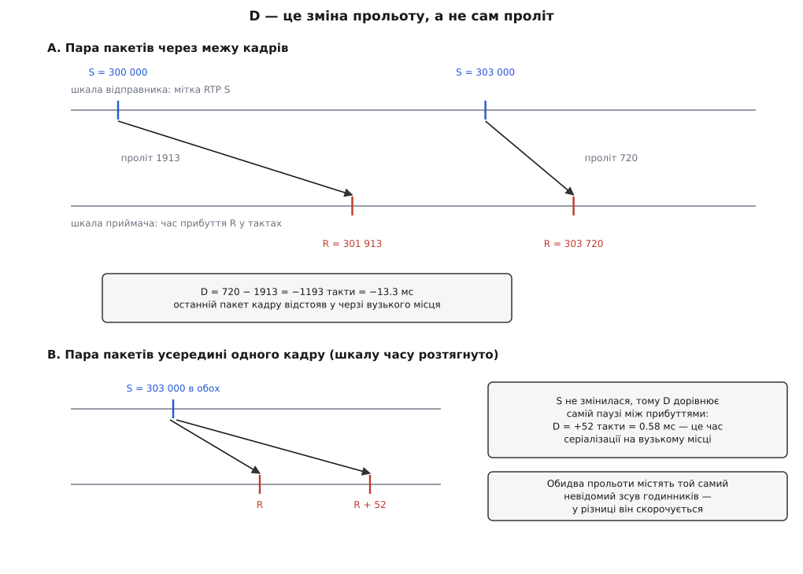
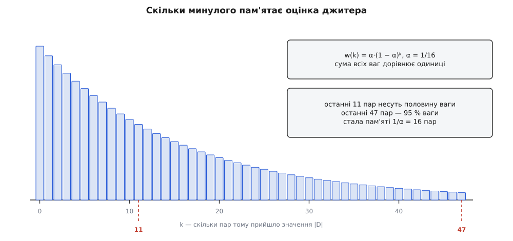
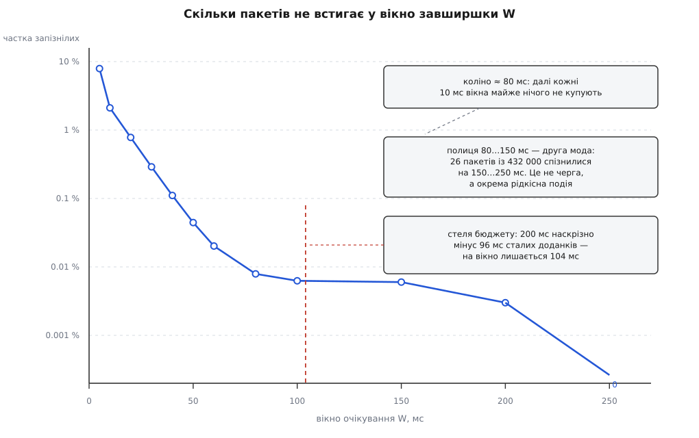

# 🧮 Скільки чекати на спізнюваного: арифметика вікна очікування

<preknowlist>
- [Джитер: варіація затримки](topic:com-transport/jitter) — затримка пакета не стала, вона плаває від пакета до пакета; звідси й потреба тримати пакет якийсь час, перш ніж віддавати далі. Сама ідея розкиду береться звідти готовою — тут ми його міряємо й перетворюємо на число.
- [Черги в мережах: затримка і втрати](topic:com-transport/queue-theory-networks) — чому затримка має жорстку підлогу й довгий правий хвіст: пакет чекає в черзі, а черга наростає й розсмоктується протягом сотень пакетів. Форму розподілу беремо як дану.
- [Експоненційне згладжування (EMA)](topic:math-probability/exponential-smoothing) — оцінка виду `J ← J + (x − J)·α`, що оновлюється однією дією й не потребує пам'яті на минулі значення. Тут ми розберемо саме її ваги, але сам прийом уже мав би бути знайомий.
- [Показниковий розподіл](topic:math-probability/exponential-distribution) — хвіст виду `e^(−x/τ)` і те, що для нього частка «понад x» залежить лише від x/τ. На цьому стоїть уся арифметика бюджету втрат.
</preknowlist>

Буфер джитера керується одним-єдиним числом — скільки часу тримати пакет, перш ніж віддати його далі. Тут це число рахується з вимірів: як із міток RTP дістати розкид затримки, не маючи спільного годинника з відправником; чому оцінка джитера з RFC 3550 відповідає не на те питання, яке ви ставите; і як із розподілу затримок будується крива, за якою вікно нарешті вибирають.

Наскрізний приклад один і той самий: H.264 1080p, 30 кадрів на секунду, бітрейт 8 Мбіт/с, шкала RTP 90 кГц, корисне навантаження в пакеті 1400 байтів, вузьке місце тракту — 20 Мбіт/с. Звідси відразу кілька чисел, які знадобляться далі:

```
біт на кадр        = 8 000 000 / 30      = 266 667
пакетів на кадр    = 266 667 / (1400·8)  = 23.8  →  24
пакетів на секунду = 24 · 30             = 720
кадровий інтервал  = 90 000 / 30         = 3000 тактів
один такт          = 1 / 90 000 с        = 11.11 мкс
```

## Що взагалі можна виміряти без спільного годинника

Питання «яка затримка в цій мережі» приймач сам розв'язати не може. Щоб дізнатися затримку, треба відняти момент відправлення від моменту прибуття — а це показ двох різних годинників, між якими сидить невідомий зсув. До того ж лічильник RTP стартує з довільного числа: відправник має право почати з чого завгодно. Тобто в кожному вимірі є дві невідомі сталі, і жоден окремий вимір від них не вільний.

Але вікну очікування абсолютна затримка й не потрібна. Буфер вирівнює потік відносно самого себе: йому важить не те, скільки пакет летів, а те, наскільки цей пакет летів **довше за сусіда**. А різниця двох вимірів від сталих вільна.

Запишемо це акуратно. Хай `S(i)` — мітка RTP пакета `i`, а `R(i)` — час його прибуття за годинником приймача, переведений у ті самі такти 90 кГц. Величину `T(i) = R(i) − S(i)` називають **прольотом** (англ. *transit*):

```
T(i) = R(i) − S(i) = 90000·( d(i) + θ ) − c₀

  d(i) — справжня затримка пакета i, секунди
  θ    — невідомий зсув годинника приймача проти годинника відправника
  c₀   — довільне початкове значення лічильника RTP

D(i−1, i) = T(i) − T(i−1) = 90000·( d(i) − d(i−1) )
```

Обидві невідомі сталі входять у кожен проліт однаково — і в різниці скорочуються. RFC 3550 записує ту саму тотожність так: `D(i,j) = (Rj − Ri) − (Sj − Si) = (Rj − Sj) − (Ri − Si)`. Ліва форма читається як «наскільки паузи між прибуттями відрізняються від пауз між відправленнями», права — як «наскільки змінився проліт». Це одне й те саме число, і воно вимірне без будь-якої синхронізації годинників.



*Скорочується не лише зсув годинників, а й довільний початок лічильника RTP: у різниці прольотів лишається чиста зміна затримки.*

Одна деталь тут не косметична. Прольоти рахують цілими беззнаковими числами по 32 біти, і віднімання `arrival − rtp_ts` дає правильний результат навіть тоді, коли лічильник RTP переповнився між двома пакетами: беззнакова арифметика за модулем 2³² сама «загортається» разом із ним. Тому в реалізаціях це віднімання ніколи не пишуть через знакові типи.

Що **не** скорочується — це різниця **ходу** кварців. Якщо годинник приймача біжить на 30 мільйонних долей швидше, то за кадровий інтервал 33.33 мс він набігає на 1.0 мкс, тобто на 0.09 такти — величину, яку в жодному `D` не побачити. Зате за годину набігає 30·10⁻⁶ · 3600 = 0.108 с. Ось чому розбіжність ходу лікують підстроюванням шкали, а не ширшим вікном: вікна на 108 мс вистачить рівно на першу годину. Ця механіка — [про те, як конвеєр узгоджує чужу шкалу часу зі своєю](topic:sys-media/clock-and-sync); тут важливо лише, що вона до вибору `latency` стосунку не має.

## Чому фільтр, а не вікно, і що означає коефіцієнт 1/16

Маючи послідовність `D`, приймач мусить якось звести її в одне число, яке можна покласти у звіт. RFC 3550 (липень 2003, Internet Standard STD 64; та сама формула стояла ще в RFC 1889 від січня 1996 року) робить це так:

```
J(i) = J(i−1) + ( |D(i−1, i)| − J(i−1) ) / 16
```

Розкриємо дужки — і побачимо звичайне зважене середнє:

```
J(i) = (1 − α)·J(i−1) + α·|D(i)|,          α = 1/16

розгортаючи рекурсію:
J(i) = α · Σ (1 − α)ᵏ · |D(i−k)|,          k = 0, 1, 2, …
       сума ваг = α / (1 − (1 − α)) = 1
```

Кожне минуле значення входить із вагою, що спадає геометрично. Порахуємо, наскільки далеко сягає ця пам'ять:

```
половина всієї ваги:  1 − (15/16)ⁿ = 0.5   →  n = ln 0.5 / ln(15/16)  = 10.7  →  11 пар
95 % усієї ваги:      1 − (15/16)ⁿ = 0.95  →  n = ln 0.05 / ln(15/16) = 46.4  →  47 пар
спад ваги в e разів:  n = −1 / ln(15/16) = 15.5 пари
```



*Ваги спадають геометрично, тому «межі вікна» немає: старе не випадає стрибком, а тихне.*

Тепер зрозуміло, навіщо фільтр замість чесного середнього по вікну. Ковзне середнє по 47 останніх значеннях мусило б зберігати 47 чисел і кільцевий покажчик, а на кожному пакеті — додавати нове й віднімати те, що випало з вікна. Експоненційне згладжування дає приблизно ту саму пам'ять за один регістр і три дії; це та сама вигода, задля якої [експоненційне згладжування](topic:math-probability/exponential-smoothing) стоїть усюди, де оцінку треба тримати в реальному часі й задешево. Плюс воно не має краю: у ковзному середньому одна велика подія рівно через 47 пакетів раптово зникає, і оцінка стрибає без жодної нової причини.

А чому саме 1/16, а не 1/10 чи 1/20? Ділення на шістнадцять — це зсув на чотири біти. Формулу писали для приймача, який обробляє тисячі пакетів на секунду цілими числами, і кожен пакет коштує рівно віднімання, зсув і додавання. Це не єдина причина — RFC формулює її як «добре співвідношення шумозаглушення за розумної швидкості збіжності», — але саме вона пояснює, чому константа степенева.

Обидва боки того співвідношення рахуються. Якщо `|D|` — незалежні значення з дисперсією σ², то усталена дисперсія оцінки

```
Var J = α²σ² / (1 − (1−α)²) = α·σ² / (2 − α) = σ² / 31

σ_J = σ / √31 = σ / 5.57
```

Тобто фільтр придушує шум оцінки в 5.6 раза. Ціна — інерція: після стрибка рівня похибка спадає в e разів за 15.5 пакета. І ось де константа підступна: **15.5 пакетів — це різний час для різних потоків**. Голосовий потік із пакетом на 20 мс дає 50 пакетів на секунду, тож стала виходить 0.31 с. Наше відео дає 720 пакетів на секунду — і стала стискається до 21 мс. Одна й та сама цифра в стандарті означає «повільна оцінка, що добре усереднює» для аудіо й «швидка оцінка, що майже не усереднює» для відео.

## Що насправді показує J на відеопотоці

Тепер найнеприємніше. Візьмімо лінк **зовсім без дрижання**: жодної конкуренції, черга порожня, кожен пакет летить рівно стільки, скільки й попередній. Порахуймо, що покаже RFC-оцінка.

Відправник викидає всі 24 пакети кадру одним сплеском — у них однакова мітка часу, бо це один момент відліку. Вузьке місце на 20 Мбіт/с розсуває цей сплеск: пакет разом із заголовками важить 1400 + 12 + 8 + 20 = 1440 байтів, тобто 11 520 бітів, і на серіалізацію йде

```
11 520 / 20 000 000 = 576 мкс = 0.576 мс = 51.84 такти
```

Значить, усередині кадру сусідні пакети приходять із паузою 52 такти, а мітка `S` між ними **не змінюється**. За формулою `D` = пауза між прибуттями мінус пауза між відправленнями = 52 − 0 = **+52 такти**. Мережа тут ні до чого: це чиста серіалізація.

Далі — межа кадрів. Кадр зливається з вузького місця за 23 · 0.576 = 13.25 мс, а наступний сплеск відправник шле через 33.33 мс після попереднього. Отже пауза між останнім пакетом кадру й першим пакетом наступного:

```
пауза прибуття   = 33.33 − 13.25 = 20.08 мс = 1807 тактів
пауза відправлення                          = 3000 тактів
D                = 1807 − 3000              = −1193 такти = −13.3 мс
```

Сума всіх `D` за цикл нульова — бо за повний кадровий цикл проліт повертається до того самого значення: 23 · 51.84 − 1193 ≈ 0. А от сума **модулів** — ні, і саме модулі йдуть у фільтр:

**Умова: 24 пакети на кадр, 23 пари всередині кадру з |D| = 51.84, одна пара на межі з |D| = 1193, α = 1/16.**

```
середнє |D| за цикл = (23 · 51.84 + 1193) / 24 = 2385 / 24 = 99.4 такти = 1.10 мс

усталена «пилка» J (пряме прогонювання рекурсії):
  перед межею кадру   J = 72.4 такти  = 0.80 мс
  одразу після межі   J = 142.4 такти = 1.58 мс
```

На лінку, де розкид затримки дорівнює **нулю**, RFC-оцінка джитера коливається між 0.8 і 1.6 мс із періодом одного кадру. Число у звіті RTCP залежить від того, у якій фазі кадру звіт склали, — тобто змінюється вдвічі без жодної зміни в мережі.

Причина проста: формула `D` мовчазно припускає, що кожен пакет має свою мітку часу. Для аудіо так і є. Для відео мітка одна на цілий кадр, тому 23 пари з 24 міряють не мережу, а пакетизацію й ширину вузького місця. Реальне дрижання додається до цієї підлоги, але відокремити його від неї, маючи на руках лише `J`, неможливо: у звіті RTCP не пишуть, скільки пакетів було в кадрі.

> 🔧 **Навіщо це.** Із цього прямо випливає, як читати джитер у звітах приймача ([їх возить RTCP](topic:com-protocol/rtp-rtcp)): для відео він годиться як **індикатор змін** — зросло вдвічі проти вчорашнього, значить, у мережі щось сталося, — і не годиться як абсолютна міра. Порівнювати `J` двох потоків із різним бітрейтом чи різним MTU безглуздо: у них різна підлога.

## Чому з J не порахувати вікно, навіть коли він чесний

Припустімо навіть, що підлоги пакетизації немає — потік аудіо, одна мітка на пакет. Чи можна тоді взяти `latency = k·J`?

Порахуймо перекладний коефіцієнт для найпростішого випадку: затримки `d(i)` незалежні між собою й розподілені нормально з середньоквадратичним відхиленням σ_d. Тоді `D` — різниця двох незалежних, її дисперсія вдвічі більша, а математичне сподівання модуля для нормальної величини з нульовим середнім дорівнює σ·√(2/π):

```
σ_D  = σ_d · √2
E|D| = σ_D · √(2/π) = σ_d · √2 · 0.7979 = 1.128 · σ_d

отже   σ_d = 0.886 · J

99.9-й процентиль однобічно: 3.09 · σ_d = 3.09 · 0.886 · J = 2.74 · J
```

Виходить гарне правило «вікно ≈ 3J» — і воно неправильне, бо обидва припущення хибні.

**Незалежності немає.** Затримка росте не через окремі пакети, а через чергу, яка наповнюється й розсмоктується протягом сотень пакетів; [саме черги й породжують розподіл затримок](topic:com-transport/queue-theory-networks). Уявімо чергу, що рівномірно наростає на 30 мс за 100 пакетів і так само спадає. Тоді кожна пара дає |D| ≈ 0.3 мс, і фільтр осяде на `J ≈ 27 тактів = 0.3 мс`, — тоді як розмах затримки становить 30 мс. Помилка не у відсотках, а в сто разів. `J` міряє **швидкість** зміни затримки, а вікно треба на її **розмах**.

**Нормальності теж немає.** Затримка має жорстку підлогу — швидкість світла плюс серіалізація, — і не має стелі. Розподіл однобічний, із довгим правим хвостом, а хвіст живе за іншими законами, ніж тіло; [розподіли з важкими хвостами](topic:math-probability/heavy-tail-distributions) тим і відомі, що середнє й дисперсія про їхні високі процентилі майже нічого не кажуть.

Тому `J` — це індикатор перевантаження, який відправник читає, щоб вирішити, чи не збавити бітрейт. Вибирати за ним вікно — все одно що вибирати висоту дверей за середнім зростом мешканців.

## Чому «максимум мінус мінімум» дає завелику відповідь

Найспокусливіше правило звучить так: поміряй усі затримки, візьми найбільшу, відніми найменшу — ось і вікно, за яким жоден пакет не спізниться. Воно хибне не через похибку, а через саму постановку: **максимум вибірки не є властивістю лінка, він є властивістю тривалості спостереження**.

Це рахується. Хай хвіст розподілу надлишкової затримки експоненційний: частка пакетів, що спізнилися понад `x`, дорівнює `e^(−x/τ)`. Тоді очікуваний максимум із `N` вимірів — класична [порядкова статистика](topic:math-probability/order-statistics):

```
E[max] ≈ τ · ( ln N + γ ),     γ = 0.5772 (стала Ейлера — Маскероні)

10 хвилин при 720 пакетах/с:  N = 432 000
ln N = 12.98   →   E[max] ≈ 13.55 · τ

подвоєння часу спостереження додає   τ · ln 2 = 0.69 · τ
```

Максимум росте логарифмічно й ніколи не зупиняється. Поміряли десять хвилин — отримали одне число; поміряли годину — інше, більше; поміряли добу — ще більше. У правила просто немає нерухомої точки, тому воно й не відповідає на питання.

Друга половина біди — ціна. За вікно платять **завжди**, а рятує воно останні кілька пакетів із мільйона. Для експоненційного хвоста вікно під бюджет утрат `p` дорівнює `τ · ln(1/p)`, а отже:

```
кожна наступна «дев'ятка» надійності коштує рівно  τ · ln 10 = 2.30 · τ

p = 10⁻³  →  6.91 · τ
p = 10⁻⁴  →  9.21 · τ
p = 10⁻⁵  →  11.5 · τ
```

Ціна десятикратного зменшення втрат стала: щоразу ті самі 2.3 сталої часу. Ніякого «майже безкоштовно наприкінці» не буває — і саме тому питання «де зупинитися» має сенс лише разом із бюджетом.

## Крива, за якою число нарешті вибирають

Правильна постановка виглядає так. Буфер прив'язує мітку RTP до шкали конвеєра й випускає кожен пакет через `W` після його місця на цій шкалі. Пакет вважається запізнілим, якщо його проліт перевищив базовий більш ніж на `W`. Означимо **надлишкову затримку** `e(i) = T(i) − min T` — скільки цей пакет летів понад підлогу лінка. Тоді потрібна нам функція — це доповнювальна функція розподілу:

```
L(W) = частка пакетів, у яких e > W
```

Її не виводять із формул, а міряють. Рецепт цілком механічний:

1. на кожен пакет порахувати проліт `T = R − S` цілими беззнаковими числами;
2. розкласти прольоти по гістограмі з дрібним кроком;
3. підлогою вважати найменший непорожній кошик;
4. `L(W)` = частка пакетів у кошиках, що лежать далі ніж `W` від підлоги.

Усе це вміщається в кілька десятків рядків у гарячому шляху приймача:

```c
#include <stdint.h>
#include <stddef.h>

#define BINW    32     /* крок кошика, такти 90 кГц: 32 такти = 0.356 мс   */
#define NBIN  1024     /* охоплення разом із ZERO: від −22.8 до +341 мс    */
#define ZERO    64     /* кошик, у який лягає проліт першого пакета        */

struct delay_stats {
    uint32_t ref;          /* проліт першого пакета — довільна точка відліку */
    uint32_t prev;         /* проліт попереднього пакета                     */
    int      started;
    double   jitter;       /* J у тактах — те саме число, що йде в RTCP      */
    uint64_t hist[NBIN];
    uint64_t under, over;  /* усе, що не влізло в гістограму                 */
};

/* arrival — показ локального годинника, переведений у такти шкали RTP;
   rtp_ts  — мітка часу з заголовка пакета.                              */
void on_packet(struct delay_stats *s, uint32_t arrival, uint32_t rtp_ts)
{
    uint32_t transit = arrival - rtp_ts;   /* зсув годинників іще всередині */

    if (!s->started) {
        s->started = 1;
        s->ref = transit;
        s->prev = transit;
    }

    int32_t d = (int32_t)(transit - s->prev);   /* а тут зсув скоротився */
    s->prev = transit;
    if (d < 0) d = -d;
    s->jitter += ((double)d - s->jitter) / 16.0;

    int32_t off = (int32_t)(transit - s->ref);  /* може бути й від'ємним */
    int32_t bin = ZERO + (off >= 0 ? off / BINW : (off - BINW + 1) / BINW);

    if      (bin < 0)     s->under++;
    else if (bin >= NBIN) s->over++;
    else                  s->hist[bin]++;
}

/* Частка пакетів, що спізнилися більш ніж на window тактів понад підлогу.
   under > 0 означає, що підлога вийшла за гістограму: розширюй охоплення. */
double late_fraction(const struct delay_stats *s, int32_t window)
{
    uint64_t total = s->under + s->over;
    size_t i, floor_bin = 0, edge;

    for (i = 0; i < NBIN; i++)
        total += s->hist[i];
    while (floor_bin < NBIN && s->hist[floor_bin] == 0)
        floor_bin++;

    edge = floor_bin + (size_t)(window / BINW);
    uint64_t late = s->over;
    for (i = edge; i < NBIN; i++)
        late += s->hist[i];

    return total ? (double)late / (double)total : 0.0;
}
```

Гістограма коштує вісім кілобайтів на потік, а обробка пакета — кілька додавань. Це достатньо дешево, щоб тримати її ввімкненою постійно, а не лише під час налаштування.

> 🔧 **Навіщо це.** Хвостовий процентиль оцінюється тим гірше, чим він далі в хвості, і це теж арифметика. Середньоквадратична похибка оцінки частки `p` за `N` вимірами дорівнює √(p(1−p)/N), тож відносна похибка ε вимагає `N = (1−p) / (p·ε²)`. Для бюджету 10⁻³ із точністю 10 % це `N ≈ 99 900` — при 720 пакетах на секунду 139 секунд запису. Для бюджету 10⁻⁵ уже 10⁷ пакетів, тобто **3.9 години**. Звідси практичне правило: хвилинного запису вистачає на бюджет 0.1 %, а число, витягнуте з десяти секунд, — це не вимір, а випадковість.

Ось як виглядає крива для нашого лінка — Wi-Fi у приміщенні, запис 10 хвилин, 432 000 пакетів:

```
   W, мс        e > W          пакетів
  ───────────────────────────────────────
      5        7.9 %            34 100
     10        2.11 %            9 120
     20        0.78 %            3 360
     30        0.290 %           1 250
     40        0.111 %             478
     50        0.0445 %            192
     60        0.0202 %             87
     80        0.00791 %            34
    100        0.00626 %            27
    150        0.00600 %            26
    200        0.00300 %            13
    250        0                     0
```



*У напівлогарифмічних осях видно те, чого не видно в таблиці: крива має дві геть різні ділянки, і межа між ними — це межа корисності вікна.*

На ділянці від 10 до 60 мс крива падає в сто разів — кожні десять мілісекунд вікна ділять втрати приблизно на `e`. Це чиста черга: хвіст лягає на пряму зі сталою τ ≈ 10 мс, і на ньому працює правило «декада коштує 2.3 τ ≈ 23 мс».

А потім крива стає пласкою. Від 80 до 150 мс вікно росте на 70 мс, а частка запізнілих спадає з 0.0079 % лише до 0.0060 % — на чверть. Причина видна з чисел: 26 пакетів із 432 000 спізнилися на 150–250 мс, і це **не черга**. Це окрема рідкісна подія іншої природи — повторна передача на канальному рівні Wi-Fi, перескок каналу, зміна маршруту. Її масштаб не має нічого спільного з τ, тому екстраполяція хвоста на неї не поширюється.

Тепер видно, чому «максимум мінус мінімум» дає завелику відповідь. Найбільша надлишкова затримка в цьому записі — трохи менша за 250 мс, і вона цілком належить другій моді. Правило пропонує заплатити чверть секунди сталої затримки за 26 пакетів із 432 000, тобто за подію, що трапляється двічі-тричі на хвилину. Ці пакети справді будуть урятовані — але чвертю секунди відставання картинки, за якої керувати апаратом уже не можна. Правило не бреше про арифметику; воно просто оптимізує не те.

## Бюджет утрат ставлять у кадрах, а не в пакетах

Тут ховається помилка, через яку вікно часто виявляється замалим, хоча арифметику зробили правильно. Втрата одного пакета не псує один пакет — вона псує **весь кадр**: депейлоадер не збере NAL-одиницю з діркою. А кадр у нас складається з 24 пакетів, і йому треба, щоб устигли всі:

```
P(кадр цілий) = (1 − p)²⁴
P(кадр битий) = 1 − (1 − p)²⁴ ≈ 24·p     для малих p
```

Множник 24 перекидає всю задачу на порядок із гаком. Переведімо криву в те, що бачить оператор, — секунди чистого відео між артефактами при 30 кадрах на секунду:

```
   W, мс     p — на пакет      битих кадрів     один битий кадр
  ──────────────────────────────────────────────────────────────
     50       4.45·10⁻⁴          1.06 %          раз на 3.1 с
     60       2.02·10⁻⁴          0.48 %          раз на 6.9 с
     80       7.91·10⁻⁵          0.19 %          раз на 17.6 с
    100       6.26·10⁻⁵          0.15 %          раз на 22.2 с
    150       6.00·10⁻⁵          0.14 %          раз на 23.2 с
    250       0                  0               ніколи
```

Тепер рішення читається прямо з таблиці. Перехід від 60 до 80 мс коштує 20 мс затримки й купує проміжки чистої картинки в два з половиною рази довші — вигідний обмін. Перехід від 80 до 150 мс коштує ще 70 мс, а купує 17.6 → 23.2 с — обмін, який не варто робити. Коліно кривої стоїть на **80 мс**, і це відповідь для цього лінка.

З того самого множника 24 випливає ще один важіль, про який зазвичай не думають. Кількість пакетів на кадр — це кількість незалежних шансів зіпсувати кадр. Удвічі менший бітрейт або вдвічі більший MTU дають удвічі менше пакетів на кадр — і вдвічі рідші артефакти **за того самого вікна**. На локальному лінку з підтримкою великих кадрів це часто дешевше, ніж докидати десятки мілісекунд затримки.

## Що складається по конвеєру, а що ні

Лишилося поставити 80 мс у бюджет усього тракту. Сталі доданки для нашого прикладу: знімання й кодування ≈ 33 мс (кадровий інтервал), черга відправника й ефір ≈ 20 мс, декодер без B-кадрів ≈ 10 мс, стік із синхронізацією ≈ 33 мс. Разом 96 мс. Якщо оператору дрона наскрізна затримка не має перевищувати 200 мс:

```
на вікно лишається   200 − 96 = 104 мс
коліно кривої                    80 мс   ✓ вміщається
наступна корисна точка          250 мс   ✗ удвічі з половиною більше
```

Вікно — це те, що **лишилося** після сталих доданків. Звідси неочевидний наслідок: викроївши 33 мс на стіку (показувати кадр щойно він прийшов, а не в його час за шкалою), ви не просто зменшуєте затримку — ви **купуєте надійність**, бо звільнене місце можна віддати вікну. Механіка того, як конвеєр збирає всі ці внески в одне число, — [окрема тема про затримку й буферизацію](topic:sys-media/latency-and-buffering).

І остання арифметика — про те, що вирівнювати темп треба **в одному місці**. Хай у тракті стоять два буфери підряд, кожен на 40 мс: скажімо, той, що всередині мережевого джерела, і ще один, доданий вручну. Перший випускає пакети рівно за своєю шкалою, тобто на його виході надлишкова затримка всіх уцілілих пакетів дорівнює нулю. Другому вирівнювати вже нічого — він додає свої 40 мс і не рятує нікого:

```
два буфери по 40 мс:   затримка 80 мс,  втрати L(40)  = 0.111 %
один буфер на 80 мс:   затримка 80 мс,  втрати L(80)  = 0.0079 %
```

Ті самі 80 мс, витрачені в одному місці замість двох, дають у чотирнадцять разів менше запізнілих пакетів. Затримки складаються, захист — ні: він визначається найширшим окремим вікном, а не їхньою сумою. Тому місце, де потік вирівнюють, у тракті має бути одне — і число для нього рахують по кривій, а не по джитеру й не по максимуму.
