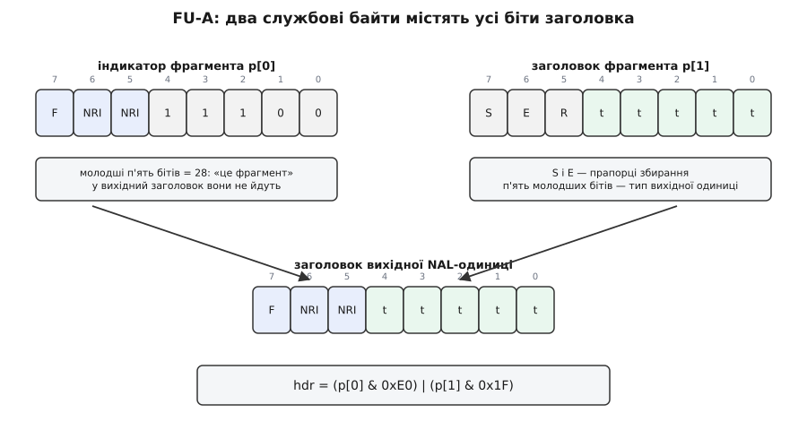
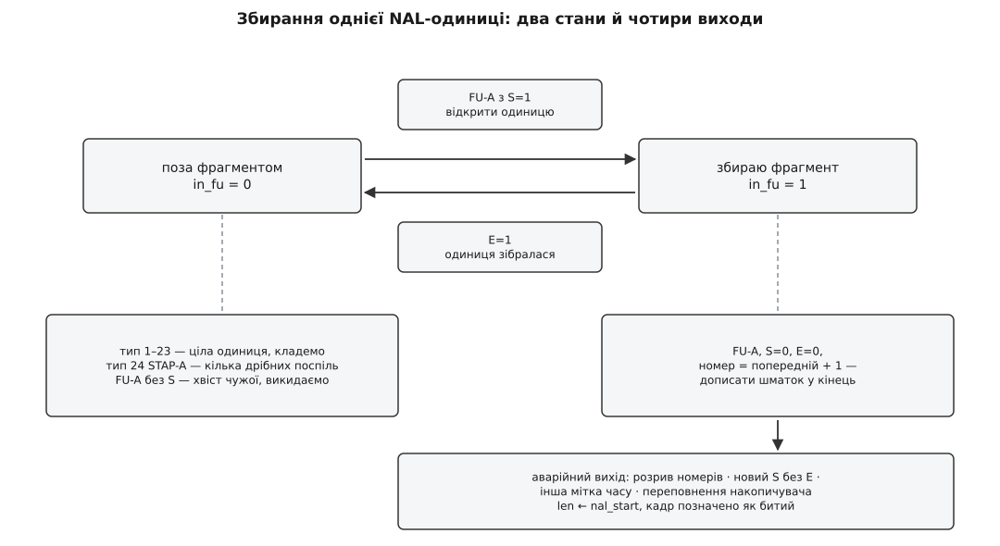
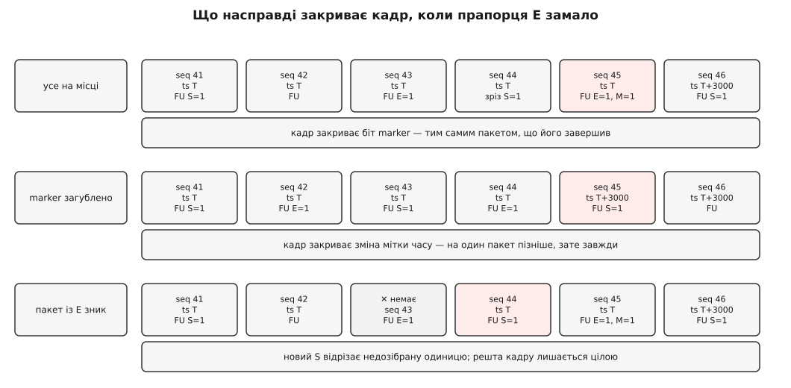

# ⚙️ Свій депейлоадер H.264: збираємо кадр із RTP-пакетів на C

Ось приймач на двісті рядків, який із потоку RTP-пакетів складає готові до декодування кадри H.264 — і ось усі місця, де «просто склеїти шматки» ламається на живій камері вже через півтори хвилини роботи.

Писати таке доводиться нечасто, але коли доводиться — то по-справжньому: на мікроконтролері, куди GStreamer не влізе; у мості, де треба знати, який саме пакет утворив дірку в кадрі; у зв'язці з власним кодом виправляння помилок. І ще частіше цей код доводиться **читати** — щоб зрозуміти, чому чужий приймач сипле зеленими квадратами, а `rtph264depay` на тому самому потоці мовчки працює.

## Контракт, сформульований точно

На вході — датаграми UDP, кожна з яких є одним RTP-пакетом. На виході — **access unit**: усі [NAL-одиниці](root:com-signal/h264-nal-structure) одного зображення, поспіль, кожна з попереду поставленим стартовим кодом `00 00 00 01`. Саме такий формат називають byte-stream, і саме його чекає декодер, коли йому не дали жодного контейнера.

Одна річ у цей контракт **не входить**, і це принципово: наш код не переставляє пакети. Він вимагає, щоб вони прийшли за номерами. Упорядкування — окрема робота з окремою ціною у вигляді затримки, і виконує її [буфер джитера](root:com-signal/jitter-buffer). Спроба зліпити переставляння й збирання в одну функцію дає код, який неможливо ні налаштувати, ні виміряти: ви більше не знаєте, скільки саме мілісекунд ви чекаєте й скільки пакетів через це врятували.

Що наш код таки мусить зробити сам — це помітити, що пакета **немає**, і не віддати декодерові кадр, зшитий із двох різних.

## Дванадцять байтів, яких насправді не дванадцять

Заголовок [RTP](root:com-protocol/rtp-rtcp) описують як дванадцятибайтовий, і майже в кожному потоці він такий і є. Проблема в тих небагатьох, де ні: три поля першого байта здатні посунути початок навантаження, і код, який їх не читає, одного дня отримає замість NAL-одиниці зсунуте на чотири байти сміття.

**CC** — чотири молодші біти першого байта — це кількість чотирибайтових ідентифікаторів змішаних джерел, які лежать відразу за фіксованою частиною заголовка. У прямому потоці з камери там нуль, у потоці з мікшера — ні.

**X** — біт розширення. Якщо він стоїть, за списком CSRC іде ще один заголовок: два байти профілю, два байти довжини — і довжина ця рахується **в 32-бітних словах**, а не в байтах. Розширеннями возять, зокрема, орієнтацію камери й мітки абсолютного часу.

**P** — біт вирівнювання. Якщо він стоїть, у **хвості** пакета лежать зайві байти, і останній із них містить їхню кількість, включно з собою. Не відрізати їх — значить дописати в кадр кілька випадкових байтів; такого декодер майже ніколи не переживає.

```c
typedef struct {
    uint8_t        pt;      /* тип корисного навантаження: 96 у типовому H.264 */
    bool           marker;  /* останній пакет кадру — для відео саме так */
    uint16_t       seq;
    uint32_t       ts, ssrc;
    const uint8_t *pl;      /* корисне навантаження й тільки воно */
    size_t         pl_len;
} rtp_view;

static bool rtp_parse(const uint8_t *p, size_t n, rtp_view *r)
{
    if (n < 12 || (p[0] >> 6) != 2)          /* версія RTP мусить бути 2 */
        return false;

    size_t hdr = 12 + 4u * (p[0] & 0x0F);    /* CC: скільки 4-байтових CSRC */
    if (n < hdr) return false;

    if (p[0] & 0x10) {                       /* X: за списком CSRC іде розширення */
        if (n < hdr + 4) return false;
        size_t words = ((size_t)p[hdr + 2] << 8) | p[hdr + 3];
        hdr += 4 + 4 * words;                /* довжина — у 32-бітних словах */
        if (n < hdr) return false;
    }

    size_t end = n;
    if (p[0] & 0x20) {                       /* P: у хвості вирівнювання */
        uint8_t skip = p[n - 1];             /* останній байт — його довжина */
        if (skip == 0 || skip > end - hdr) return false;
        end -= skip;
    }
    if (end <= hdr) return false;            /* порожнє навантаження */

    r->pt     = p[1] & 0x7F;
    r->marker = (p[1] & 0x80) != 0;
    r->seq    = (uint16_t)((p[2] << 8) | p[3]);
    r->ts     = ((uint32_t)p[4] << 24) | ((uint32_t)p[5] << 16)
              | ((uint32_t)p[6] <<  8) |  (uint32_t)p[7];
    r->ssrc   = ((uint32_t)p[8] << 24) | ((uint32_t)p[9] << 16)
              | ((uint32_t)p[10] << 8) |  (uint32_t)p[11];
    r->pl     = p + hdr;
    r->pl_len = end - hdr;
    return true;
}
```

Складання чисел зі зсувами тут не примха: у мережі багатобайтові поля лежать старшим байтом уперед, а більшість процесорів, на яких цей код працюватиме, тримають числа навпаки. Прочитати чотири байти через `memcpy` у `uint32_t` — значить отримати число з переставленими байтами. Побайтове складання зі зсувами дає той самий результат на будь-якому [порядку байтів](root:sf-algorithms/bits-bytes-endianness).

## Три форми, у яких приїжджає NAL-одиниця

Перший байт навантаження — це або сам заголовок NAL-одиниці, або підробка під нього. П'ять молодших бітів дають тип, і саме за ним RFC 6184 (травень 2011 року, замінив RFC 3984) розрізняє три випадки.

**Типи 1–23** — це справжні типи NAL-одиниць зі стандарту H.264: одиниця приїхала цілою, навантаження є вона сама. Копіюємо як є.

**Тип 24, STAP-A** — агрегат. Перший байт службовий, далі парами: два байти довжини (старший уперед) і стільки ж байтів самої одиниці. Так возять SPS і PPS, які поодинці не варті власної датаграми.

**Тип 28, FU-A** — шматок великої одиниці. Перший байт — «індикатор фрагмента», другий — «заголовок фрагмента», далі шматок навантаження.

Два службові байти FU-A влаштовані так, що з них можна відновити заголовок вихідної одиниці, і це варте окремої уваги, бо виглядає як фокус. Індикатор зберігає з оригіналу два старші поля — біт `F` і два біти `NRI` (важливість одиниці для декодера), а замість типу несе число 28. Заголовок фрагмента несе прапорці `S` (перший шматок) і `E` (останній), зарезервований нуль — і **тип вихідної одиниці** у своїх п'яти молодших бітах. Отже, оригінальний байт — це старші три біти першого й молодші п'ять другого:

```c
uint8_t hdr = (uint8_t)((p[0] & 0xE0) | (p[1] & 0x1F));
```



*Жоден із двох службових байтів не є заголовком вихідної одиниці, але разом вони містять усі його біти: важливість беремо з індикатора, тип — із заголовка фрагмента.*

Решта типів — STAP-B (25), MTAP16 (26), MTAP24 (27) і FU-B (29) — існують задля потоків із порядком декодування, відмінним від порядку передачі. У живих лінках вони не трапляються практично ніколи, тож наш код їх не підтримує — але помічає й позначає кадр як битий, а не мовчки їх ковтає.

## Дві машини станів, а не одна

Тут ховається головна причина, чому саморобні депейлоадери працюють через раз. Здається, що стан один: «збираю фрагмент» або «не збираю». Насправді станів **два поверхи**, і плутанина між ними дає рівно ті помилки, які потім списують на мережу.

Нижній поверх — **NAL-одиниця**. Вона відкривається пакетом із `S=1` і закривається пакетом із `E=1`. Між ними — лише дописування байтів у кінець.

Верхній поверх — **access unit**. Він відкривається першою одиницею нового кадру й закривається зовсім іншими подіями: бітом `marker`, зміною мітки часу або появою одиниці, яка за стандартом належить уже наступному зображенню. Одна ціла NAL-одиниця не закриває кадр — у кадрі їх зазвичай кілька.



*Нижній поверх машини: пакет із S відкриває одиницю, пакет із E її закриває, усе інше або дописує байти, або викидає недозібране. Верхній поверх — накопичувач кадру — живе окремо й закривається іншими подіями.*

Накопичувач кадру тримає зсув початку поточної одиниці. Коли фрагмент обривається, ми не «викидаємо буфер» — ми відкочуємо довжину накопичувача на цей зсув. Усе, що вже зібралося в кадрі до битої одиниці, лишається цілим і придатним: декодер із дірою в одному зрізі покаже зіпсований прямокутник, а не розсиплеться.

## Лічильники, які переповнюються

Номер пакета — шістнадцять бітів. Мітка часу — тридцять два. Обидва рано чи пізно обертаються через нуль, і обидва порівнюють неправильно приблизно всі, хто пише це вперше.

**Умова: H.264 на 8 Мбіт/с, у пакеті близько 1400 байтів корисного навантаження, `clock-rate` = 90 000.**

```
пакетів за секунду   = 8 000 000 / (8 · 1400) ≈ 714
оберт номера         = 65 536 / 714 ≈ 92 с ≈ півтори хвилини

оберт мітки часу     = 2³² / 90 000 = 4 294 967 296 / 90 000
                     ≈ 47 722 с ≈ 13 год 15 хв
```

Півтори хвилини. Не «раз на тиждень під навантаженням», а на другій хвилині кожного сеансу приймач із перевіркою `if (seq > last_seq)` побачить після пакета 65530 пакет 3, визнає його запізнілим і почне викидати все підряд, доки номер знову не доповзе до 65530. Мітка часу ламається так само, тільки раз на тринадцять годин — і такі помилки шукають місяцями, бо відтворити їх можна лише залишивши стенд працювати на ніч.

Ліки одні й ті самі. Різницю рахують **у тій самій розрядності, у якій лічильник обертається**, і читають результат як **знакове** число. Тоді 3 − 65530 у шістнадцяти бітах дає 9, а не мінус 65527, і порівняння працює через нуль так само, як усередині діапазону. Цей прийом називають арифметикою послідовних чисел; його формалізували в RFC 1982 (серпень 1996 року, Роберт Елз із Мельбурнського університету й Ренді Буш) для порядкових номерів зон DNS, і відтоді ним живе кожен протокол зі скінченним лічильником — докладніше про саму механіку в статті про [нумерацію послідовності пакетів](root:com-transport/sequence-numbering).

```c
static int seq_ahead(uint16_t a, uint16_t b) { return (int16_t)(a - b); }
static int ts_ahead(uint32_t a, uint32_t b)  { return (int32_t)(a - b); }
```

Дві функції на два рядки — і два класи помилок, яких у коді більше не буде.

У цього прийому є своя межа, і про неї треба знати відразу: він розрізняє «вперед» і «назад» лише в межах половини діапазону. Стрибок на 40 000 пакетів уперед — наприклад, коли камера перезапустилася й почала нумерацію з нового випадкового числа — читається як «на 25 536 назад». Приймач, який просто відкидає все «старе», після такого стрибка замовкне назавжди. Тому відкинуті пакети лічать поспіль: кілька підряд означає вже не перестановку, а те, що джерело почало нумерацію заново, — і відлік треба взяти новий. RFC 3550 описує це докладніше — там є і поріг `MAX_MISORDER` (100 пакетів назад ще вважаються перестановкою), і правило прийняти новий відлік після `MIN_SEQUENTIAL` (двох) послідовних пакетів на новому місці.

## Код

Далі — сам приймач. Він тримає стан обох поверхів, накопичує кадр у буфер, який дає користувач, і на кожен зібраний access unit кличе зворотний виклик.

```c
/* h264_depay.c — збирання access unit H.264 з RTP-пакетів (RFC 6184).
 *
 * Вхід : RTP-пакети, УЖЕ впорядковані за номерами (це робота буфера джитера).
 * Вихід: byte-stream — NAL-одиниці зі стартовими кодами 00 00 00 01;
 *        один виклик cb() на один access unit.
 *
 * Той самий файл: rtp_view / rtp_parse() і seq_ahead() / ts_ahead() вище.
 */
#include <stdbool.h>
#include <stdint.h>
#include <string.h>

typedef struct {
    const uint8_t *data;
    size_t         len;
    uint32_t       rtp_ts;    /* мітка часу RTP у тиках clock-rate */
    bool           keyframe;  /* усередині є IDR-зріз (тип 5) */
    bool           damaged;   /* під час збирання була дірка в номерах */
} h264_au;

typedef void (*h264_au_cb)(const h264_au *au, void *user);

typedef struct {
    uint8_t   *buf;           /* накопичувач одного кадру — дає користувач */
    size_t     cap, len;
    h264_au_cb cb;
    void      *user;
    uint8_t    want_pt;

    /* стан потоку */
    bool       have_seq;
    uint16_t   last_seq;
    uint32_t   ssrc;
    unsigned   rejects;       /* скільки «старих» пакетів відкинуто поспіль */

    /* нижній поверх: фрагмент FU-A */
    bool       in_fu;
    size_t     nal_start;     /* зсув, з якого почалася поточна NAL-одиниця */

    /* верхній поверх: access unit */
    bool       have_au, pic_started, keyframe, damaged;
    uint32_t   au_ts;
} h264_depay;

void h264_depay_init(h264_depay *s, uint8_t *buf, size_t cap,
                     uint8_t payload_type, h264_au_cb cb, void *user)
{
    memset(s, 0, sizeof(*s));
    s->buf = buf; s->cap = cap;
    s->want_pt = payload_type; s->cb = cb; s->user = user;
}

/* ── накопичувач кадру ──────────────────────────────────────────────────── */

static bool au_put(h264_depay *s, const uint8_t *p, size_t n)
{
    if (s->len + n > s->cap) return false;
    memcpy(s->buf + s->len, p, n);
    s->len += n;
    return true;
}

/* Викинути недозібрану одиницю: відкотити довжину на її початок.
   Усе, що зібралося в кадрі ДО неї, лишається цілим. */
static void nal_abort(h264_depay *s)
{
    if (s->in_fu) { s->len = s->nal_start; s->in_fu = false; s->damaged = true; }
}

static void au_reset(h264_depay *s)
{
    s->len = 0;
    s->in_fu = s->have_au = s->pic_started = s->keyframe = s->damaged = false;
}

static void au_emit(h264_depay *s)
{
    nal_abort(s);                       /* хвіст без кінця декодерові не потрібен */
    if (s->have_au && s->len > 0) {
        h264_au au = { s->buf, s->len, s->au_ts, s->keyframe, s->damaged };
        s->cb(&au, s->user);
    }
    au_reset(s);
}

/* Почати нову NAL-одиницю. body — байти ПІСЛЯ заголовка; перший із них
   потрібен, щоб побачити межу картинки. */
static bool nal_open(h264_depay *s, uint8_t hdr,
                     const uint8_t *body, size_t body_n, uint32_t ts)
{
    static const uint8_t start_code[4] = { 0, 0, 0, 1 };
    unsigned type = hdr & 0x1F;

    /* Службові одиниці 6–9 і зріз, що починається з макроблока 0, належать
       НАСТУПНІЙ картинці — отже, закривають поточну. */
    if (s->pic_started &&
        ((type >= 6 && type <= 9) ||
         ((type == 1 || type == 2 || type == 5) && body_n >= 1 && (body[0] & 0x80))))
        au_emit(s);

    if (!s->have_au) { s->have_au = true; s->au_ts = ts; }

    s->nal_start = s->len;
    if (!au_put(s, start_code, 4) || !au_put(s, &hdr, 1) ||
        !au_put(s, body, body_n)) {
        s->len = s->nal_start;          /* не влізло — цієї одиниці не буде */
        s->damaged = true;
        return false;
    }
    if (type == 1 || type == 2 || type == 5) s->pic_started = true;
    if (type == 5) s->keyframe = true;
    return true;
}

/* ── головний вхід: один RTP-пакет ──────────────────────────────────────── */

void h264_depay_packet(h264_depay *s, const uint8_t *pkt, size_t len)
{
    rtp_view r;
    if (!rtp_parse(pkt, len, &r) || r.pt != s->want_pt)
        return;                          /* не наш формат — мовчки повз */

    if (s->have_seq && r.ssrc != s->ssrc) {   /* у порт полізло друге джерело */
        au_reset(s);
        s->have_seq = false;
    }
    s->ssrc = r.ssrc;

    int step = s->have_seq ? seq_ahead(r.seq, s->last_seq) : 1;

    if (step <= 0) {
        /* Дублікат або пакет, що приплентався після свого кадру. Але й
           стрибок більш ніж на 32768 уперед читається як мінус, тому
           лічимо відкинуті поспіль: кілька підряд — джерело перезапустилося
           і треба взяти новий відлік (RFC 3550, A.1). */
        if (++s->rejects < 8) return;
        au_reset(s);
        step = 1;
    }
    s->rejects  = 0;
    s->last_seq = r.seq;
    s->have_seq = true;

    if (step != 1) {                     /* дірка: тих пакетів уже не буде ніколи */
        nal_abort(s);
        s->damaged = true;
    }

    if (s->have_au) {
        int dt = ts_ahead(r.ts, s->au_ts);
        if (dt < 0) return;              /* пакет старішого кадру — той уже поїхав */
        if (dt > 0) au_emit(s);          /* інша мітка — це вже інший кадр */
    }

    const uint8_t *p = r.pl;
    size_t         n = r.pl_len;
    unsigned    type = p[0] & 0x1F;

    if (type >= 1 && type <= 23) {                  /* одна ціла NAL-одиниця */
        s->in_fu = false;
        nal_open(s, p[0], p + 1, n - 1, r.ts);

    } else if (type == 24) {                        /* STAP-A: кілька дрібних */
        s->in_fu = false;
        for (size_t i = 1; i + 2 <= n; ) {
            size_t sz = ((size_t)p[i] << 8) | p[i + 1];
            i += 2;
            if (sz == 0 || i + sz > n) { s->damaged = true; break; }
            nal_open(s, p[i], p + i + 1, sz - 1, r.ts);
            i += sz;
        }

    } else if (type == 28 && n >= 3) {              /* FU-A: шматок великої */
        bool S = (p[1] & 0x80) != 0;
        bool E = (p[1] & 0x40) != 0;

        if (S) {
            nal_abort(s);                           /* попередній фрагмент без E */
            uint8_t hdr = (uint8_t)((p[0] & 0xE0) | (p[1] & 0x1F));
            s->in_fu = nal_open(s, hdr, p + 2, n - 2, r.ts);
        } else if (s->in_fu) {
            if (!au_put(s, p + 2, n - 2)) nal_abort(s);
            else if (E) s->in_fu = false;           /* одиниця зібралася повністю */
        }
        /* пакет без S, коли фрагмент не почато, — хвіст чужої одиниці: тиша */

    } else {
        s->damaged = true;               /* 25–27, 29 і сміття — не наш випадок */
    }

    if (r.marker)                        /* останній пакет кадру */
        au_emit(s);
}
```

Читання з сокета не додає до цього нічого — і це добре: увесь стан живе в одній структурі, тож той самий код працює і в окремому потоці, і в обробнику переривання.

```c
#include <arpa/inet.h>
#include <stdio.h>
#include <sys/socket.h>

static uint8_t au_buf[4u << 20];        /* 4 МіБ — з запасом на ключовий кадр */

static void on_au(const h264_au *au, void *user)
{
    (void)user;
    printf("AU %zu Б, ts=%u%s%s\n", au->len, au->rtp_ts,
           au->keyframe ? ", ключовий" : "",
           au->damaged  ? ", БИТИЙ"    : "");
}

int main(void)
{
    int fd = socket(AF_INET, SOCK_DGRAM, 0);
    struct sockaddr_in a = { .sin_family = AF_INET,
                             .sin_port   = htons(5600),
                             .sin_addr.s_addr = htonl(INADDR_ANY) };
    bind(fd, (struct sockaddr *)&a, sizeof(a));

    h264_depay d;
    h264_depay_init(&d, au_buf, sizeof(au_buf), 96, on_au, NULL);

    uint8_t pkt[2048];
    for (;;) {
        ssize_t n = recv(fd, pkt, sizeof(pkt), 0);
        if (n <= 0) break;
        h264_depay_packet(&d, pkt, (size_t)n);
    }
    return 0;
}
```

> 🔧 **Навіщо це.** Вихід цього коду можна перевірити без декодера: перенаправте його у файл `out.264` замість `printf` і згодуйте той файл у `gst-launch-1.0 filesrc location=out.264 ! h264parse ! avdec_h264 ! autovideosink`. Якщо картинка є — стартові коди й межі одиниць ви поставили правильно. Якщо `h264parse` мовчить, а `damaged` не спрацював — у вас проблема саме з межами, а не з мережею.

## Чому прапорець E — не ознака кінця

Тепер найважливіше. У специфікації написано просто: `S` починає, `E` закінчує. Але в коді вище кадр закривають **три різні події**, і `E` серед них немає взагалі. Це не перестраховка: у кожної з трьох подій своя окрема причина існувати.

**Причина перша: `E` закриває одиницю, а не кадр.** Ключовий кадр — це SPS, PPS і кілька зрізів. Останній фрагмент останнього зрізу справді має `E=1`, але точно такий самий `E=1` має і останній фрагмент першого зрізу. З погляду фрагмента ці два стани не розрізнити ніяк — інформації про те, чи є в кадрі ще щось, у заголовку фрагмента просто немає.

**Причина друга: пакет із `E` губиться так само, як будь-який інший.** Тоді одиниця лишається відкритою назавжди — доки не прийде щось інше, що дасть підставу її закрити. Якщо код чекає тільки на `E`, він тихо накопичує шматки двох, трьох, десяти кадрів в одному буфері, доки той не переповниться.

**Причина третя: чимало пейлоадерів `E` не ставлять.** Це не теорія: у самому GStreamer шлях, який обробляє появу нового `S` при незакритому фрагменті, супроводжується коментарем про те, що віддалений пейлоадер вважається несправним, бо не поставив біт кінця. Код, який такого не передбачає, з подібним відправником не працює взагалі — і причину доведеться шукати не в собі.

Тому надійних сигналів теж три, і жоден із них не самодостатній.

**`marker`** — найшвидший: кадр закривається тим самим пакетом, що його завершив, без затримки на жоден пакет. Але його теж можна загубити, а деякі відправники його просто не ставлять.

**Зміна мітки часу** — найнадійніший: усі пакети одного access unit несуть **однакову** мітку, і RFC 6184 вимагає цього прямо. Ціна — кадр закривається аж першим пакетом наступного, тобто на один пакет пізніше, ніж міг би.

**Заголовок зрізу** — резервний. Перше поле в тілі зрізу зветься `first_mb_in_slice` і каже, з якого макроблока цей зріз починається; у першого зрізу картинки там нуль. Кодується це поле експоненційним кодом Голомба, у якому значення нуль — це один-єдиний біт `1`. Отже, старший біт першого байта тіла зрізу відповідає на питання «чи це початок нової картинки» без жодного розбору потоку — саме тому в коді стоїть `body[0] & 0x80`, і саме так це перевіряє GStreamer. Як влаштоване саме таке кодування чисел, розібрано окремо: [експоненційний код Голомба](root:com-signal/exp-golomb).



*Три сигнали не дублюють один одного, а страхують: коли зникає швидкий, спрацьовує повільніший, і кадр усе одно виходить цілим — просто на пакет пізніше.*

## Що ще ламається

**Дублікат.** Та сама датаграма приходить двічі — звичайна річ у мережах із резервуванням шляхів. Перевірка `step <= 0` ловить і його, і будь-який запізнілий пакет: обидва мають номер, не більший за вже прийнятий. Без цієї перевірки дубльований фрагмент допишеться в одиницю вдруге, і декодер отримає зріз із подвоєним шматком усередині.

**Пакет після `marker` свого кадру.** Здається неможливим, а трапляється у двох різних випадках. Перший — перестановка: пакет вийшов раніше, а прийшов пізніше за той, що ніс `marker`. Ловиться тією самою перевіркою номера, і це правильна поведінка: кадр уже поїхав до декодера, вставити в нього щось назад неможливо. Другий шлях гірший — відправник ставить `marker` на останньому зрізі, а потім шле для того самого кадру ще одну службову одиницю з **тією самою** міткою часу. Наш код відкриє новий access unit із тією ж міткою, і декодер отримає два кадри з однаковим часом показу. Виправляти це в депейлоадері не варто: правильне місце — парсер далі по конвеєру, який зводить одиниці в access unit за самим потоком, а не за пакетами.

**Розрив номерів.** Дірка означає, що частина кадру втрачена назавжди — чекати немає на що. Ми обриваємо фрагмент, який зараз збирали, і позначаємо кадр як битий, але **не викидаємо** те, що вже зібралося. RFC 6184 радить саме це: якщо втрачено фрагмент, приймач має відкинути решту фрагментів **тієї самої** одиниці, а не всього кадру. Далі рішення — за тим, хто отримує кадр: віддати декодерові биту картинку (побачите розсипані квадрати) чи мовчати до наступного ключового кадру. Прапорець `damaged` у зворотному виклику існує рівно для того, щоб це рішення можна було прийняти зовні.

**Переповнення накопичувача.** Ключовий кадр 1080p — це сотні кілобайтів, а при поганому налаштуванні кодера й кілька мегабайтів. Але переповнення — це майже завжди не великий кадр, а **незакрита одиниця**, у яку без кінця дописуються шматки різних кадрів. Тому реакція на переповнення — не «збільшити буфер», а відкотити поточну одиницю й позначити кадр битим: буфер із запасом у чотири мегабайти при коректному закритті кадрів не заповнюється ніколи.

**Байти запобігання емуляції.** У байтовому потоці стартовий код `00 00 00 01` не має права трапитися всередині даних, тому кодер вставляє в такі місця додатковий байт `03`. Спокуса «прибрати зайві трійки» під час збирання є, і піддаватися їй не можна: ці байти — частина синтаксису NAL-одиниці, вони приїжджають у RTP уже вставленими, і декодер їх чекає. Наша робота — скопіювати одиницю дослівно й нічого в ній не тлумачити.

## Те саме робить `rtph264depay` — і робить краще

Написане вище — це той самий алгоритм, який виконує елемент GStreamer. Розбіжність не в ідеї, а в тому, скільки навколо ідеї треба ще коду.

`rtph264depay` уміє всі форми пакування, включно з STAP-B і MTAP, а не лише дві найчастіші. Він видає не тільки byte-stream, а й формат `avc` — той самий набір одиниць, але з чотирибайтовим префіксом довжини замість стартового коду, потрібний, щоб покласти потік у контейнер MP4. Він дістає SPS і PPS із поля `sprop-parameter-sets` у caps і вставляє їх у потік перед першим кадром — саме тому потік із RTSP часто показує картинку відразу, а не після першого ключового кадру.

Він бачить дірку **раніше**, ніж її видно за номерами: буфер джитера, який знає про пропущений пакет, посилає вниз по конвеєру подію про втрату, і депейлоадер дізнається про неї в тому самому місці потоку, де вона утворилася, а не з наступного пакета. Він уміє за цією подією попросити відправника прислати ключовий кадр — запит іде вгору по конвеєру й далі через RTCP. Він уміє мовчати до першого цілого ключового кадру, замість показувати сміття. Він проставляє на буферах позначки, за якими наступні елементи розрізняють ключовий кадр і розрив. Він віддає результат списком буферів через пул пам'яті, не переливаючи кожен байт у суцільний масив, як це робить наш `memcpy`. І він переузгоджує формат далі по конвеєру, коли посеред потоку приходить новий SPS зі зміненою роздільністю.

Головне ж не в переліку. Написати щасливий шлях — це справді двісті рядків, і вони вище. Але в зрілому депейлоадері щасливий шлях займає меншість коду; решта — це нещасливі шляхи, і кожен з них колись відповідав конкретній зламаній камері, яку хтось приніс із поля. Саморобний приймач гірший не тому, що його автор гірший інженер, а тому, що в нього не було п'ятнадцяти років таких камер.

Отже, писати своє варто у трьох випадках, і в жодному з них ідеться не про «замінити GStreamer». Коли GStreamer нікуди поставити — мікроконтролер, де на все про все сто кілобайтів пам'яті. Коли потрібна відповідність «пакет → байти кадру», якої депейлоадер назовні не віддає: для власного виправляння помилок, для точного обліку втрат, для журналу, у якому видно, який саме пакет зіпсував який саме зріз. І коли формат пакування свій — власний кодек, нестандартна обгортка, — і готового елемента для нього просто не існує.
