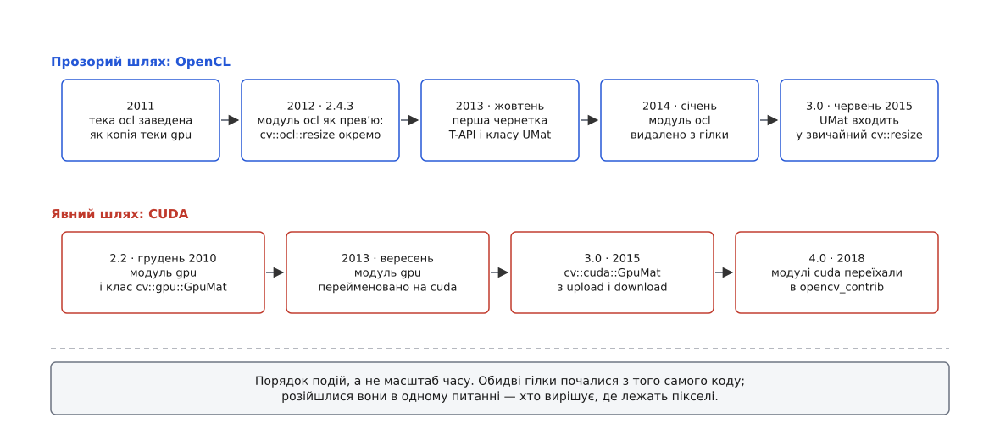

# 📜 Як OpenCV училася прискорюватися

Це історія про те, чому сьогодні `cv::resize` сама вміє піти на прискорювач, а для відеокарти NVIDIA усе одно доводиться писати окрему `cv::cuda::resize` і руками ганяти дані туди-сюди. Бібліотека двічі відповіла на питання «хто вирішує, де лежать пікселі», і обидві відповіді лишилися живими — бо відповідають вони різним людям.



*Обидві гілки виросли з того самого коду й розійшлися в одному питанні.*

## Зразок, з якого все скопіювали

У грудні 2010 виходить OpenCV 2.2, і в списку змін з'являється новий модуль `gpu` з ремаркою, що це «цілком нова частина OpenCV, створена за підтримки NVIDIA», поки що в стані альфи. Щоб її ввімкнути, потрібен встановлений NVIDIA CUDA SDK і прапорець `-DWITH_CUDA=ON` під час збірки; уся функціональність живе в просторі імен `cv::gpu`, а пам'ять пристрою тримає окремий клас `cv::gpu::GpuMat`.

Дизайн тут чесний до останнього рядка. Тип інший — тому видно, що байти лежать не в системній пам'яті. Функція інша — тому видно, що виконуватиме її не процесор. Пересилання пишуться руками — тому видно, скільки їх. Ніхто не обіцяв, що старий код почне працювати швидше сам собою: щоб отримати прискорення, програму треба переписати, і переписати свідомо.

Тоді ж, у 2008–2010, поруч визріває друга технологія. Специфікацію OpenCL 1.0 Khronos Group ухвалила до публікації 8 грудня 2008; початково стандарт розробила Apple й довела до пропозиції разом із технічними командами AMD, IBM, Qualcomm, Intel і NVIDIA. Головне для нашої історії — не дати, а властивість: OpenCL не належить жодному виробникові. Один код може працювати і на дискретній карті AMD, і на вбудованій графіці Intel, і на карті NVIDIA — рівно те, чого модуль `gpu` дати не міг за побудовою.

## Тека, яка почалася з перейменування

7 липня 2011 року в репозиторії з'являється тека `modules/ocl`. Її перші коміти читаються як стенограма рішення: «OclMat implementation», «renamed gpu to ocl», «ocl folder contains the gpu implementations» — автор Salman Ul Haq. Того ж дня Вадим Пісаревський додає свій коміт із промовистим повідомленням: «opencl module is not ready for trunk yet».

Зверніть увагу, що саме зробили. Гілку OpenCL не проєктували з чистого аркуша — її завели як копію модуля `gpu`, у якому виклики CUDA поступово замінювали на виклики OpenCL. Рішення на той момент абсолютно розумне: модуль `gpu` уже мав відповідь на всі нудні питання (як бібліотеці тримати пам'ять пристрою, як рахувати посилання на неї, як передавати її у ядро), і вигадувати їх удруге не було потреби. Але разом із відповідями скопіювалася й форма API. `oclMat` дзеркалив `GpuMat`, `cv::ocl::resize` дзеркалила `cv::gpu::resize`, і жодна з них не мала нічого спільного зі звичайною `cv::resize`, окрім назви.

Через рік, у листопаді 2012, це виходить назовні у версії 2.4.3 — як «технологічний прев'ю модуля ocl», за формулюванням списку змін «contributed by the Chinese Academy of Science»; усередині вже є арифметика, фільтри, геометричні перетворення, каскадний класифікатор і оптичний потік. Заголовки файлів модуля називають правовласників точніше, ніж список змін: Institute Of Software Chinese Academy Of Science, Advanced Micro Devices, Inc. і Multicoreware, Inc., а серед авторів поруч стоять адреси приватних поштових скриньок і корпоративні (`Rock.Li@amd.com`). Тобто AMD у цій гілці справді була — але не як єдиний автор і не з першого дня: перший код 2011 року написала одна людина, а промислову реалізацію 2012-го зробила зв'язка академічного інституту й двох компаній.

Далі модуль швидко дорослішає. У 2.4.4 (березень 2013) розробники окремо наголошують, що правильність роботи перевірено на дискретних картах NVIDIA і AMD, на гібридних процесорах AMD і на вбудованій графіці Intel Ivy Bridge. У 2.4.6 (липень 2013) з'являється двійкова сумісність між платформами: бібліотека, зібрана з SDK будь-кого з трьох виробників, працює на решті. Обіцянка нейтральності виконана.

## Чому два імені на одну дію — це глухий кут

А тепер подивіться, як цим доводилося користуватися.

```cpp
// OpenCV 2.4: розгалуження живе НЕ в бібліотеці, а у вашому коді
cv::ocl::DevicesInfo devices;
if (cv::ocl::getOpenCLDevices(devices) > 0) {   // чи є тут узагалі пристрій
    cv::ocl::setDevice(devices[0]);
    cv::ocl::oclMat gsrc(src), gdst;            // конструктор = пересилання туди
    cv::ocl::resize(gsrc, gdst, dsize);
    gdst.download(dst);                         // і пересилання назад
} else {
    cv::resize(src, dst, dsize);                // те саме, іншим іменем
}
```

Одна операція — дванадцять рядків, два типи, дві назви функції та один `if`, який мусить написати користувач бібліотеки. Помножте це на конвеєр із восьми кроків, і зникне не лише читаність: у гілці для пристрою кожен проміжний результат треба тримати в `oclMat`, у гілці для процесора — у `Mat`, тож розгалужується не виклик, а вся структура програми.

Але незручність — це ще не глухий кут. Глухих кутів тут три, і кожен глибший за попередній.

Перший: розгалуження стоїть **не в тому місці**. Питання «чи є на цій машині придатний прискорювач» має відповідь лише під час запуску, на комп'ютері користувача — а `if` написано під час розробки, на комп'ютері програміста. Автор програми змушений вгадувати наперед те, чого не може знати, і супроводжувати обидві гілки вічно.

Другий: **дві реалізації розходяться**. `cv::resize` і `cv::ocl::resize` — це різні тисячі рядків коду, написані різними людьми в різні роки. Вони збігаються в головному й тихо не збігаються на краях: в округленні координат, у поведінці на межі зображення, у підтримуваних типах пікселів. Списки змін 2.4.x рясніють рядками на кшталт «faceDetect тепер працює й на чипах Intel Ivy Bridge», «erode/dilate тепер працює й на картах NVIDIA» — тобто до того на якомусь із пристроїв та сама функція давала не той результат. Кожне таке розходження треба знайти, відтворити й полагодити окремо, і тести теж потрібні окремі — на кожен пристрій.

Третій, найдорожчий: **така бібліотека не вміє відступати**. Якщо для потрібної операції реалізації на пристрої немає, чесна відповідь — виконати її на процесорі; але для цього дані мають бути в системній пам'яті, а вони лежать в `oclMat`. Відступ — це знову ваш код і знову ваш `if`. Бібліотека, яка знає про свій пристрій усе, не має права нічим зарадити, бо тип у руках користувача вже зафіксував рішення.

Складіть три пункти разом — і вийде висновок, який робить решту історії неминучою: розгалуження мусить переїхати всередину функції. Не тому, що так коротше писати, а тому, що всередині функції — єдине місце, де в момент виклику відомі обидві потрібні речі: що це за операція і що є на цій машині.

## Чернетка від 22 жовтня 2013

Саме тоді Вадим Пісаревський комітить у гілку розробки файл `modules/core/src/umatrix.cpp` із повідомленням «the first draft of transparent API and new UMat class».

Ключ до того, чому це взагалі вдалося зробити без переписування всієї бібліотеки, лежав у OpenCV уже давно. Функції на кшталт `cv::resize` приймають не `const Mat&`, а `InputArray` — стертий тип-перехідник, який усередині розбирається, що йому передали, і дістає звідти дані. Його завели зовсім не заради прискорювачів, а щоб та сама функція приймала і `Mat`, і `std::vector`, і `Matx`. Але саме він виявився тим швом, крізь який можна було просунути новий тип, не змінивши жодного підпису й не зламавши жодної програми.

> 🔧 **Навіщо це.** Прозорий інтерфейс став можливим не через геніальну ідею, а тому що за два роки до нього в бібліотеці з іншої причини завели шов у потрібному місці. `UMat` пролізає в `cv::resize` рівно тому, що `InputArray` уже вмів приймати різні типи. Коли в чужому коді ви шукаєте, куди вставити нову поведінку, дивіться не на найзручніше місце, а на місце, де вже стерто тип: там за вас уже заплачено сумісністю.

Далі події йдуть швидко. 31 січня 2014 Ілля Лавренов видаляє старий модуль із гілки розробки; коміт називається «OCL module 2 trash» — три роки коду пішли у смітник, бо їхню роботу тепер робить `cv::resize` сама. 4 червня 2015 виходить OpenCV 3.0, і в оголошенні прозорий інтерфейс описано як шар прискорення поверх OpenCL, що покриває близько сотні функцій і не вимагає ані OpenCL під час збірки, ані OpenCL під час запуску. Там же — фраза, заради якої варто розрізняти внески: «This work has been done by contract and with generous support from AMD and Intel companies». Ідея й реалізація — команда, що супроводжувала OpenCV (у заголовку `umatrix.cpp` стоїть «Copyright (C) 2014, Itseez Inc.»); гроші — контракти з AMD та Intel. Через рік, у травні 2016, Intel купує Itseez, і компанія, яка платила за прозорий шлях, стає власником команди, яка його зробила.

Заплачено за прозорість було тим самим, чим і виграно. Розгалуження зникло з очей — і разом із ним зникли з очей пересилання пам'яті: сотня покритих функцій — це небагато проти тисяч функцій бібліотеки, тож там, де реалізації на пристрої немає, `UMat` мовчки їде назад у системну пам'ять. Подвоєне API кричало про кожну копію й було непридатне до життя; прозоре придатне — і мовчить. Що саме воно замовчує, видно з влаштування спільного керівного блоку: [cv::Mat: пам'ять, лічильник посилань і володіння](topic:sys-media/mat-memory-model).

## Чому CUDA не пішла тим самим шляхом

У вересні 2013, поки прозорий інтерфейс ще був чернеткою, модуль `gpu` перейменували на `cuda`, а `cv::gpu::GpuMat` став `cv::cuda::GpuMat`. Перейменування чесне: модуль ніколи не був універсальним, і назва нарешті це визнала. Але контракт лишився старим — явні `upload` і `download`, окремі функції, окремий тип. Прозорим його не зробили, і не через брак часу.

Причин дві, і обидві принципові.

Перша — прихований шлях мусить бути **скрізь**. Прозорість працює тільки як мовчазне припущення: `cv::resize` має право сама вирішувати, куди піти, лише якщо на будь-якій машині гірший випадок — це просто виконатися на процесорі. З OpenCL так і виходить: це драйвер, його або є, або немає, і бібліотека від початку збирається так, щоб працювати в обох випадках. CUDA потребує пропрієтарного SDK під час збірки й карти конкретного виробника під час запуску, а `WITH_CUDA` типово вимкнено — тобто у більшості складених бібліотек цих функцій просто фізично немає. Прозорість, яка є лише в одному складанні з десяти, не прозорість, а лотерея.

Друга глибша: людям, які беруть явну гілку, приховування шкодить. Вони приходять по контроль — тримати ввесь конвеєр на пристрої від декодування до результату, не спускаючи кадр у системну пам'ять жодного разу, вручну розкладати роботу по потоках виконання й накладати обчислення на пересилання. Прозорий інтерфейс вирішує про кожен виклик окремо й оптимізує кожен виклик окремо; для наскрізного конвеєра це саме та поведінка, від якої вони тікають. Дати їм «зручність» означало б відібрати єдине, по що вони прийшли.

Тому 18 вересня 2018 у репозиторій лягає коміт із повідомленням «cuda: move CUDA modules to opencv_contrib — OpenCV 4.0+», і у версії 4.0 (листопад 2018) модулі CUDA живуть уже поза головним репозиторієм. Це не присуд якості — переїзд у `opencv_contrib` каже лише те, що типове складання бібліотеки їх не містить, і зібрати їх — окреме свідоме рішення того, хто складає. Що саме вирішується під час складання й чому це доводиться перевіряти в готовій бібліотеці, розібрано окремо: [будова OpenCV: модулі, версії, як її збирають](topic:sys-media/opencv-structure).

Так дві гілки, що почалися з одного скопійованого коду, розійшлися до кінця. Прозора взяла на себе відповідальність за рішення й тому мусить бути обережною: працювати всюди, тихо відступати, вигравати в середньому. Явна відповідальності не взяла й тому може бути сміливою: нічого не ховати, нічого не вгадувати, віддати весь контроль тому, хто готовий його нести. Обидві потрібні рівно тому, що ці два способи вигравати несумісні в одному API — і саме спроба поєднати їх іменами `cv::resize` і `cv::ocl::resize` в одній програмі колись і завела бібліотеку в глухий кут.
