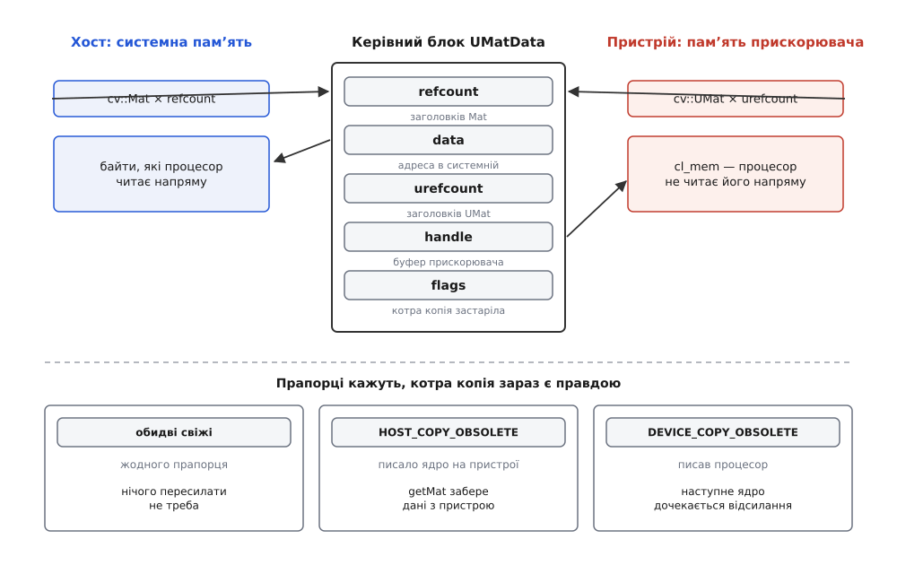
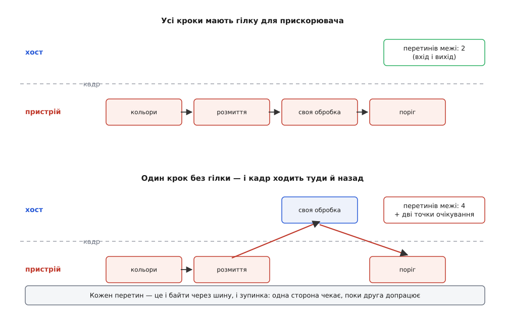
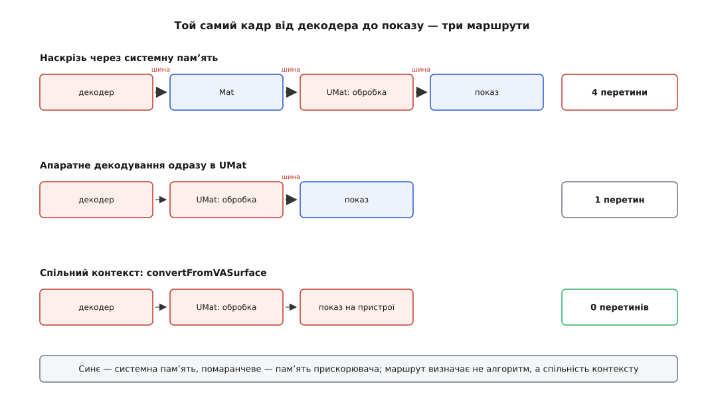

# Бекенди й прискорення: UMat, OpenCL, апаратна збірка

<preknowlist>
- [cv::Mat: пам'ять, лічильник посилань і володіння](topic:sys-media/mat-memory-model) — заголовок окремо від пікселів, спільний керівний блок `UMatData`, лічильник, що вирішує, хто звільняє буфер.
- [SIMT: модель виконання GPU](topic:hw-arch/simt-gpu-execution) — чому прискорювач виграє лише там, де однакову дію треба зробити над мільйоном елементів одразу.
- [OpenCL: контекст, черга команд, ядра й буфери](topic:sf-visual/opencl-compute-model) — з чого складається програма для прискорювача: контекст, буфер, черга команд, ядро.
- [Пам'ять хоста і прискорювача](topic:hw-arch/gpu-host-device-memory) — дискретна карта зі своєю пам'яттю проти інтегрованої зі спільною; чому копія через шину коштує дорого.
- [Формати пікселів і буферів зображення](topic:sf-visual/pixel-formats) — скільки байтів займає кадр у BGR і в NV12, що таке площини й крок рядка.
- [SIMD і векторизація](topic:hw-arch/simd-vectorization) — як процесор обробляє кілька пікселів однією інструкцією.
</preknowlist>

Найчастіша історія про прискорення OpenCV закінчується розчаруванням. Людина дізнається, що бібліотека вміє сама зіштовхувати обчислення на відеокарту, міняє в коді `Mat` на `UMat`, запускає — і кадри йдуть повільніше, ніж ішли на самому процесорі. При цьому нічого не зламано: прискорювач знайдено, обчислення справді виконуються на ньому, результат правильний. Просто виграш з'їло те, чого у вихідному коді не написано жодним рядком.

Це «те» — переміщення пікселів. Прискорювач має власну пам'ять або принаймні власний погляд на спільну; поки кадр не опинився в ній, жодне обчислення на ньому неможливе, а щоб він там опинився, шість мегабайтів мусять перетнути шину. Обчислення на прискорювачі дешеве, дорога — доставка. І весь фокус прозорого прискорення в OpenCV полягає в тому, що доставку **приховано в типі даних**: той самий рядок `cv::GaussianBlur(src, dst, {5,5}, 1.5)` залежно від типу аргументів або нічого не пересилає, або тихо пересилає кадр туди й назад.

Тому питання «як увімкнути GPU» неправильне з самого початку. Правильне звучить інакше: **де зараз лежать пікселі і скільки разів за кадр ця відповідь змінюється**. Усе інше — механіка, яка з цього питання випливає.

## Три різні речі під одним словом

Слово «прискорення» в OpenCV означає щонайменше три різні речі, і плутати їх дорого, бо вони по-різному відповідають на щойно поставлене питання — хто і коли рухає пам'ять.

**Перше — оптимізації всередині звичайної процесорної збірки.** Векторні інструкції, багатопотоковість, підмінені реалізації базових операцій. Пікселі весь час лежать там, де лежали, у системній пам'яті; тип даних не змінюється; вмикається все це під час складання бібліотеки, а не у вашому коді. Пересилань немає взагалі — отже, немає й способу програти.

**Друге — прозорий інтерфейс (T-API) з типом `UMat`.** Той самий вихідний код, той самий виклик функції, але тип аргументів інший, і разом із ним інше місце зберігання: пікселі можуть жити в буфері прискорювача. Хто і коли копіює їх туди й назад, вирішує бібліотека — мовчки, за прапорцями всередині керівного блоку. Саме тут виграють і саме тут програють.

**Третє — явний інтерфейс CUDA з типом `cv::cuda::GpuMat`.** Пам'ять від початку на пристрої, копії пишуться руками (`upload`, `download`), функції окремі (`cv::cuda::resize` замість `cv::resize`), а починаючи з версії 4.0 вони живуть навіть не в головному репозиторії, а в `opencv_contrib`. Прихованих пересилань тут не буває — рівно тому, що приховано взагалі нічого немає.

Різниця між другим і третім — це не «зручно проти швидко», а різниця у **відповідальності за пам'ять**. У третьому варіанті кожне переміщення видно в коді, і воно на вашій совісті. У другому переміщення робить бібліотека, і побачити його можна лише тоді, коли знаєш, де саме воно народжується. Далі — про те, де саме.

## Рівень, на якому пам'ять не рухається

Почати варто з нудного рівня, бо його дуже часто пропускають і одразу лізуть на відеокарту — а він безплатний.

Процесорна збірка OpenCV містить кілька шарів пришвидшення, і жоден із них не змінює ні типу даних, ні розкладки буфера. Перший — універсальні внутрішні інструкції: базові цикли бібліотеки написані один раз через тонку обгортку, з якої компілятор робить SSE, AVX2 або NEON. Другий — вибір набору інструкцій під час запуску: параметри збірки `CPU_BASELINE` (що гарантовано є на будь-якій машині, куди піде бінарник) і `CPU_DISPATCH` (що додатково зібрати кількома варіантами й обрати вже на місці) дають один файл, який на старій машині працює, а на новій використовує AVX2. Третій — сторонні реалізації базових операцій: на x86 це безплатний підмножинний набір IPP від Intel, який OpenCV тягне під час збірки й підставляє в десятки функцій обробки зображень; на ARM — Carotene, під'єднаний через шар апаратної абстракції (HAL), який дозволяє замінити базові операції реалізаціями для конкретного заліза. Четвертий — багатопотоковість: цикли по рядках зображення бібліотека розкидає по потоках через `cv::parallel_for_`, а хто саме ці потоки роздає (власний пул на pthreads, TBB чи OpenMP), теж обирається під час збірки.

Спільна риса всіх чотирьох — вони працюють над тим самим буфером у системній пам'яті. Ніякої доставки, ніякого нового володіння, ніякого нового типу. Тому порядок дій завжди той самий: спочатку переконатися, що процесорна збірка справді має ці шари, і лише потім думати про прискорювач.

```cpp
std::cout << cv::getBuildInformation() << std::endl;   // з чим зібрано
std::cout << cv::getNumThreads() << " потоків\n";       // скільки їх зараз
cv::setUseOptimized(false);                            // вимкнути підмінені реалізації
```

Останній рядок — не для роботи, а для вимірювання: він вимикає оптимізовані шляхи під час виконання, і різниця «увімкнено проти вимкнено» показує, скільки ви вже маєте задарма.

> 🔧 **Навіщо це.** Бібліотека, зібрана без IPP, без диспетчеризації наборів інструкцій і з одним потоком, на типовій обробці кадру програє повній збірці в кілька разів. Це та сама різниця, за якою зазвичай ідуть на відеокарту, — тільки без жодного пересилання пам'яті. Перевірити вивід `getBuildInformation()` варто раніше, ніж переписувати код на `UMat`. Що саме визначають ці параметри під час складання бібліотеки — [будова OpenCV: модулі, версії, як її збирають](topic:sys-media/opencv-structure).

## UMat: один керівний блок, два місця зберігання

Тепер до типу, заради якого все це затівалося. `cv::UMat` виглядає майже як `cv::Mat`: ті самі `rows`, `cols`, `type()`, той самий `step`, ті самі методи. І це не збіг — обидва заголовки посилаються на **один і той самий тип керівного блоку** `UMatData`. Різниця в тому, на яке поле цього блоку вони дивляться.

У керівному блоці є два покажчики на дані й два лічильники:

```cpp
struct CV_EXPORTS UMatData {
    int urefcount;      // скільки заголовків UMat
    int refcount;       // скільки заголовків Mat
    uchar* data;        // байти в системній пам'яті (може бути 0)
    uchar* origdata;
    size_t size;
    UMatData::MemoryFlag flags;
    void* handle;       // буфер прискорювача, cl_mem (може бути 0)
    void* userdata;
    int allocatorFlags_;
    int mapcount;
    UMatData* originalUMatData;
};
```

Ось у чому суть: **пікселі можуть існувати у двох місцях одночасно**. `data` — це адреса в системній пам'яті, доступна процесорові напряму. `handle` — це непрозорий описувач буфера, виділеного через OpenCL; його вміст процесор прочитати не може, для нього треба або відобразити буфер у свій адресний простір, або скопіювати вміст у себе. Коли ви пишете `cv::UMat dst;` і передаєте його як приймач у будь-яку функцію OpenCV, а прискорювач доступний, виділиться саме буфер на пристрої, і поле `data` лишиться нульовим: у системній пам'яті результату просто немає.

І одразу постає питання, якого в `Mat` не було. Якщо байти можуть лежати у двох місцях, то після кожного запису одна з двох копій стає неправдою. Хтось мусить це пам'ятати.



*Той самий керівний блок описує дві копії пікселів; прапорці застарілості кажуть, котра з них зараз є правдою, а лічильники `refcount` і `urefcount` рахують заголовки з кожного боку окремо.*

Пам'ятають прапорці. У полі `flags` того ж керівного блоку живе такий набір:

```cpp
enum MemoryFlag {
    COPY_ON_MAP          = 1,
    HOST_COPY_OBSOLETE   = 2,    // копія в системній памʼяті застаріла
    DEVICE_COPY_OBSOLETE = 4,    // копія на пристрої застаріла
    TEMP_UMAT            = 8,
    TEMP_COPIED_UMAT     = 24,
    USER_ALLOCATED       = 32,
    DEVICE_MEM_MAPPED    = 64,
    ASYNC_CLEANUP        = 128
};
```

Два перші прапорці й тримають усю конструкцію. Правило просте й симетричне: **хто пише, той оголошує чужу копію застарілою**. Ядро OpenCL відпрацювало над буфером пристрою — виставляється `HOST_COPY_OBSOLETE`. Процесор щось записав у системну пам'ять — виставляється `DEVICE_COPY_OBSOLETE`. Обидва прапорці одночасно стояти не можуть: це означало б, що правди немає ніде.

А тепер головний наслідок, заради якого все це розказано. Прапорець сам собою нічого не пересилає — він лише **позначає борг**. Пересилання станеться тоді, коли хтось попросить дані з того боку, чия копія позначена застарілою. Тобто ціна платиться не там, де ви написали `cvtColor`, а там, де ви перетнули межу між світом `Mat` і світом `UMat`. Ці межі й треба навчитися бачити.

## Де саме народжується копія

Меж рівно дві, і кожна має ім'я в API.

**`UMat::getMat(AccessFlag)`** — попросити системну адресу того, що лежить на пристрої. Ось повний код цього методу з гілки 4.x, і в ньому варто розібратися до дна:

```cpp
Mat UMat::getMat(AccessFlag accessFlags) const
{
    if(!u)
        return Mat();
    accessFlags |= ACCESS_RW;
    UMatDataAutoLock autolock(u);
    ...
        if(CV_XADD(&u->refcount, 1) == 0)
            u->currAllocator->map(u, accessFlags);
        if (u->data != 0)
        {
            Mat hdr(dims, size.p, type(), u->data + offset, step.p);
            hdr.u = u;
            ...
            return hdr;
        }
    ...
}
```

Три речі тут важать.

По-перше, `map` викликається лише тоді, коли `refcount` перед збільшенням був нулем, тобто коли **перший** заголовок `Mat` під'єднується до цих даних. Другий і третій `getMat` уже нічого не пересилають — байти в системній пам'яті вже є. Це та сама економія, що й у лічильнику посилань `Mat`, просто рахуються тут заголовки з процесорного боку.

По-друге, `map` — це або справжнє відображення буфера в адресний простір процесу, або чесне копіювання його вмісту в окремо виділену системну пам'ять. Що саме станеться, залежить від того, чи вміє це залізо віддавати свою пам'ять процесорові напряму. І в обох випадках виклик **блокує потік**, доки прискорювач не допрацює все, що стоїть у черзі перед ним.

По-третє — рядок, який псує гарну теорію: `accessFlags |= ACCESS_RW`. У бібліотеці є прапорці доступу `ACCESS_READ`, `ACCESS_WRITE` і `ACCESS_RW`, і задум був очевидний: якщо ви просите дані лише на читання, після роботи їх не треба відсилати назад, а якщо лише на запис — не треба спершу забирати. Але в гілці 4.x і `UMat::getMat`, і `Mat::getUMat` примусово додають `ACCESS_RW`, тобто задекларований намір ігнорують і виконують обмін в обидва боки. Розраховувати на економію від прапорця доступу зараз не можна: вважайте, що **будь-який перехід між `Mat` і `UMat` коштує повний обмін туди й назад**.

**`Mat::getUMat(AccessFlag, UMatUsageFlags)`** — зворотний бік. Бібліотека створює буфер на пристрої й пов'язує його з наявним системним буфером: або обгортає вже наявні байти, якщо адреса й вирівнювання дозволяють (керівний блок дістає позначку тимчасового, `TEMP_UMAT`), або створює окремий буфер і копіює туди вміст (`TEMP_COPIED_UMAT`); у другому разі знищення тимчасового `UMat` тягне зворотне копіювання. Обидва лічильники початкового блоку збільшуються, тож вихідний `Mat` гарантовано переживе свій тимчасовий `UMat`.

І тут захована пастка, яку варто знати напам'ять. Ось початок того самого методу:

```cpp
UMat Mat::getUMat(AccessFlag accessFlags, UMatUsageFlags usageFlags) const
{
    ...
    if (data != datastart)          // це виріз усередині більшого буфера
    {
        ...
        src.adjustROI(dtop, dbottom, dleft, dright);   // розтягнути до цілого
        return src.getUMat(accessFlags, usageFlags)(cv::Rect(ofs.x, ofs.y, sz.width, sz.height));
    }
    CV_Assert(data == datastart);
    ...
}
```

Прочитайте це ще раз. Якщо `Mat` є [вирізом](topic:sys-media/mat-views-no-copy) із більшого кадру, бібліотека спершу **розтягує його назад до цілого батьківського кадру**, переганяє на пристрій увесь кадр і аж потім бере від нього потрібний прямокутник. Виріз 64×64 із кадру 4K коштує пересилання двадцяти чотирьох мегабайтів. Інакше не можна: буфер прискорювача — це суцільний шматок, а виріз має чужий крок рядка й дірки між рядками. Але з боку користувача це виглядає як маленька операція над маленьким прямокутником.

Є ще й третя, менш очевидна межа — коли ви берете сирий описувач буфера прискорювача, щоб віддати його в чужий код:

```cpp
void* UMat::handle(AccessFlag accessFlags) const
{
    ...
    CV_Assert(u->refcount == 0);
    ...
    if (!!(accessFlags & ACCESS_WRITE))
        u->markHostCopyObsolete(true);
    return u->handle;
}
```

Перевірка `refcount == 0` — це залізний інваріант усієї конструкції: **одночасно двома боками користуватися не можна**. Поки живий бодай один заголовок `Mat`, отриманий із цього `UMat`, описувача буфера ви не дістанете. І навпаки: віддавши описувач із наміром писати, ви одразу оголошуєте системну копію застарілою, тож наступний `getMat` неминуче забиратиме дані з пристрою.

## Тихий відкат на процесор

Тепер найголовніша причина, чому «увімкнув і стало гірше». У OpenCV **не в кожної функції є реалізація для прискорювача**, а там, де вона є, вона працює не для всіх типів і не для всіх параметрів. І коли реалізації немає, нічого не падає.

Кожна функція з подвійним шляхом починається з такого макроса:

```cpp
CV_OCL_RUN(_dst.isUMat() && _src.dims() <= 2,
           ocl_resize(_src, _dst, dsize, inv_scale_x, inv_scale_y, interpolation))
```

Розкривається він приблизно так: «якщо прискорювач увімкнено **і** виконано умову **і** спроба запустити ядро повернула успіх — вийти з функції». Причому вся конструкція загорнута у `try`/`catch`: виняток від драйвера всередині ядра теж означає просто «не вийшло». Не вийшло — виконання спокійно продовжується процесорною гілкою, яка починається з `Mat src = _src.getMat()`.

Тобто провал шляху на прискорювачі не тільки не помітний — він **дорожчий за просто процесорний шлях**, бо до звичайної процесорної роботи додається повне пересилання кадру з пристрою й назад. І приводів для такого провалу вистачає: у ядра не той тип елемента, надто велике зображення для наявної пам'яті, невдала компіляція ядра драйвером, глибина `CV_64F` на графіці без підтримки подвійної точності.

Побачити це можна двома способами. Швидкий — узяти той самий код і прогнати двічі, з `cv::ocl::setUseOpenCL(false)` і без; якщо різниці немає або з прискорювачем гірше, кадр десь ходить туди-сюди намарно. Точний — увімкнути внутрішнє трасування бібліотеки змінною середовища `OPENCV_TRACE=1` і подивитися, які реалізації насправді викликано.

**Умова.** Конвеєр на кадр 1920×1080: (1) BGR→сірий, (2) розмиття 5×5, (3) власна обробка, для якої гілки на прискорювачі немає, (4) поріг, (5) показ. Шина — PCIe 3.0 ×16, практично близько 10 ГБ/с.

```
кадр BGR       = 1920 · 1080 · 3 = 6 220 800 Б ≈ 6.22 МБ
кадр сірий     = 1920 · 1080 · 1 = 2 073 600 Б ≈ 2.07 МБ

якби крок 3 мав гілку на пристрої:
  на пристрій    6.22 МБ    (кадр із камери)
  з пристрою     2.07 МБ    (результат на показ)
  разом          8.29 МБ  → 8.29 / 10 000 = 0.83 мс

як є насправді:
  на пристрій    6.22 МБ
  з пристрою     2.07 МБ    ← перед кроком 3
  на пристрій    2.07 МБ    ← після кроку 3
  з пристрою     2.07 МБ    ← на показ
  разом         12.43 МБ  → 12.43 / 10 000 = 1.24 мс

різниця        0.41 мс на кадр; бюджет кадру при 60 к/с — 16.7 мс → 2.5 %
```

Два з половиною відсотки — начебто дрібниця, і саме тому цей рахунок оманливий. Байти — не головна шкода. Головна в тому, що `getMat` **блокує потік до спорожнення черги**: поки процесор робить крок 3, прискорювач стоїть, а поки прискорювач робить кроки 1–2 і 4, стоїть процесор. Замість двох машин, які працюють одночасно над сусідніми кадрами, ви дістаєте одну машину, яка по черзі буває то тою, то тою. Втрачається не пропускна здатність шини, а перекриття роботи — а це вже не відсотки, а рази.



*Кількість перетинів межі, а не кількість кроків, визначає ціну; кожен перетин — це ще й точка, у якій одна зі сторін чекає на іншу.*

Звідси єдине практичне правило прозорого прискорення: **тримати кадр на одному боці якнайдовше**. Ланцюжок із п'яти операцій на `UMat` — це два перетини межі. Той самий ланцюжок, у якому посередині щось звертається до пікселів процесором (`.at<>()`, чужа бібліотека, власний цикл, `imshow` на дискретній карті), — це вже чотири або шість.

## Черга асинхронна, тому час переїжджає

З блокуванням пов'язана друга несподіванка, через яку вимірювання на `UMat` регулярно брешуть.

Виклик функції над `UMat` **не чекає** на завершення обчислення. Він ставить ядро в чергу команд і повертає керування — на цей момент результату ще немає, є лише обіцянка. Тому наївний секундомір навколо `cv::GaussianBlur(u_src, u_dst, ...)` покаже десяті частки мілісекунди незалежно від розміру зображення: ви виміряли час постановки в чергу.

Заплачено буде пізніше — на першій же операції, яка потребує готового результату: `getMat`, `copyTo` в `Mat`, `imshow`, `imwrite`. Класичний наслідок — «профіль показує, що вся програма стоїть у `imshow`». Не стоїть; `imshow` просто перший, хто дочекався всієї попередньої роботи.

Правильний вимір закриває чергу явно:

```cpp
cv::UMat src, dst;
frame.copyTo(src);
cv::ocl::finish();                       // прибрати хвіст попередньої роботи
int64 t0 = cv::getTickCount();
cv::GaussianBlur(src, dst, {5, 5}, 1.5);
cv::ocl::finish();                       // дочекатися саме цього ядра
double ms = (cv::getTickCount() - t0) * 1000.0 / cv::getTickFrequency();
```

Ця сама асинхронність — не лише незручність, а й головний важіль. Поки прискорювач рахує кадр N, процесор може приймати кадр N+1 з конвеєра. Але це працює тільки доти, доки ви не покликали `getMat`: кожен перехід у світ `Mat` вирівнює обидві сторони й перетворює конвеєр на послідовність.

## Спільна пам'ять — це ще не спільний буфер

Усі рахунки вище припускали дискретну відеокарту зі своєю власною пам'яттю за шиною PCIe. Але значна частина роботи з відео відбувається на інтегрованій графіці — вбудоване ядро в процесорі або одноплатний комп'ютер, де прискорювач і процесор фізично сидять на **одних і тих самих мікросхемах пам'яті**. Здається, що там копіювати нема куди й проблема зникає сама.

Не зникає. Спільна фізична пам'ять означає лише, що переслати байти **можна** без переміщення. Чи станеться так насправді, залежить від того, як створено буфер. Якщо буфер прискорювача виділено звичайним способом, драйвер відводить під нього окрему ділянку тієї ж пам'яті, і `map` чесно копіює шість мегабайтів з однієї ділянки в другу — переміщення без сенсу, зате з повною ціною. Щоб замість копіювання сталося відображення, буфер має бути створений над уже наявною системною пам'яттю, а та мусить бути вирівняна так, як вимагає драйвер (зазвичай на межу сторінки й на межу, кратну базовому вирівнюванню пристрою). Коли це вдається, керівний блок дістає позначку `DEVICE_MEM_MAPPED`, і `map` стає майже безплатним.

Спитати залізо про цю можливість можна прямо:

```cpp
const cv::ocl::Device& d = cv::ocl::Device::getDefault();
std::cout << d.name() << ", спільна памʼять із хостом: "
          << d.hostUnifiedMemory() << "\n";

cv::UMat u(1080, 1920, CV_8UC3, cv::USAGE_ALLOCATE_HOST_MEMORY);
```

Прапорець використання `cv::USAGE_ALLOCATE_HOST_MEMORY` просить виділити буфер так, щоб він був доступний і процесорові; на інтегрованій графіці це і є шлях до відображення замість копіювання, на дискретній — навпаки, спосіб зробити повільно. Єдиного рецепта тут немає: ту саму програму треба вимірювати на тому залізі, де вона працюватиме.

І ще одна засторога, специфічна для одноплатників. Навіть коли пам'ять фізично спільна, кеші процесора й прискорювача можуть бути неузгоджені, тож відображення тягне за собою скидання або знеструмлення кеша на всю область. Це вже не копіювання, але й не нуль: на слабкому ядрі ARM «безплатний» `map` шестимегабайтного кадру коштує помітних часток мілісекунди.

> 🔧 **Навіщо це.** На дискретній карті виграє стратегія «завантажив кадр, зробив на пристрої все можливе, забрав результат». На інтегрованій графіці та сама стратегія часто програє процесорній збірці з IPP і кількома потоками: пропускна здатність спільної пам'яті одна на двох, і копія кадру відбирає її і в процесора теж. Вимірювати треба на цільовому залізі, а не на робочому ноутбуці.

## Стик із відеоконвеєром — місце, де все й вирішується

Тепер складімо докупи головний випадок. Кадр не береться з повітря: він приходить із камери або з відеофайлу, і майже завжди — через апаратний декодер. А декодер видає кадр **уже в пам'яті прискорювача**: поверхнею VA-API, буфером NVDEC, спільним описувачем `dmabuf`. Механіку цього боку розібрано окремо — [апаратне декодування: VA-API, NVDEC, V4L2, MediaCodec](topic:sys-media/hardware-decode-elements).

Отже, кадр уже там, де ви хочете рахувати. І тут можливі три маршрути, які відрізняються не швидкістю функцій, а кількістю перетинів межі.



*Той самий обчислювальний результат коштує від чотирьох перетинів межі на кадр до жодного — різниця не в алгоритмі, а в тому, чи спільний контекст у декодера і в OpenCV.*

**Маршрут перший, наївний.** Декодер віддає кадр у свою пам'ять, обгортка `VideoCapture` забирає його в системну (це вже одне пересилання), ви кладете його в `Mat`, робите `getUMat` — і той самий кадр їде назад на пристрій. Далі обробка, потім `getMat` на показ. Кадр перетнув межу чотири рази, і два з цих разів — чиста втрата: він двічі побував у системній пам'яті без жодної на те причини.

**Маршрут другий, наполовину чесний.** Просити апаратне декодування явно й одразу читати в `UMat`:

```cpp
cv::VideoCapture cap(url, cv::CAP_FFMPEG, {
    cv::CAP_PROP_HW_ACCELERATION, cv::VIDEO_ACCELERATION_ANY,
    cv::CAP_PROP_HW_DEVICE, 0
});
cv::UMat frame;
while (cap.read(frame)) { /* обробка лишається на пристрої */ }
```

Параметри апаратного прискорення в `VideoCapture` з'явилися у версії 4.5.2, і бібліотека має власний приклад із таким конвеєром — `samples/tapi/video_acceleration.cpp`. Тут кадр після декодування потрапляє в `UMat` без зайвої мандрівки в обидва боки, а вся обробка лишається на одному боці межі.

**Маршрут третій, повний.** Він потрібен тоді, коли конвеєр ваш власний — GStreamer, VA-API або чужа бібліотека, — і кадр приходить описувачем поверхні. Тоді OpenCV треба **посадити в той самий контекст**, у якому працює конвеєр:

```cpp
cv::va_intel::ocl::initializeContextFromVA(display);          // спільний контекст
cv::UMat frame;
cv::va_intel::convertFromVASurface(display, surface, size, frame);
```

Або, коли ви маєте готовий буфер OpenCL від чужого коду:

```cpp
cv::ocl::attachContext(platformName, platformID, context, deviceID);
cv::UMat frame;
cv::ocl::convertFromBuffer(cl_mem_buffer, step, rows, cols, CV_8UC3, frame);
```

Слово «контекст» тут не формальність, а вся суть. Буфер прискорювача належить контексту; два різні контексти — це два різні світи, і «взаємодія» між ними вироджується у звичайне копіювання через системну пам'ять. Тому першим ділом треба або віддати OpenCV чужий контекст (`attachContext`), або створити його з дескриптора конвеєра (`initializeContextFromVA`). Без цього кроку решта викликів працюватиме — просто мовчки й повільно.

Другий бік цього — володіння. `convertFromBuffer` створює заголовок `UMat` **над чужим буфером**, і буфер лишається чужим: OpenCV не знає, коли конвеєр звільнить поверхню, і не має права її звільняти. Це рівно та сама конструкція, що й `Mat` над сирим покажчиком, з тими самими наслідками — заголовок може пережити дані. Тому кадр, узятий так, або обробляється тут-таки й не покидає межі одного виклику, або клонується.

Третій бік — формат. Апаратні декодери майже ніколи не віддають BGR: їхній вихід — це NV12, дві площини з половинною роздільністю кольору. `UMat` типу `CV_8UC3` над буфером NV12 не дасть ані помилки, ані картинки. Що з цим робити й які формати взагалі можна відобразити без перетворення — [стик із відеоконвеєром: формати пікселів і передача кадру](topic:sys-media/frame-interop); з боку GStreamer те саме питання розібрано в темі [буфери й пам'ять: передача кадру без копіювання](topic:sys-media/buffers-and-memory).

Робочий міст із вимірюванням усіх трьох маршрутів, із виявленням тихого відкату на процесор і з чесним закриттям черги зібрано окремо: [конвеєр на UMat, який не гуляє через шину](topic:sys-media/opencv-backends/proj-umat-boundaries.md).

## Що вирішує збірка, а що — запуск

Лишилося розкласти, які з усіх цих виборів зроблено раз і назавжди під час складання бібліотеки, а які ви можете змінити на робочій машині.

Під час збірки вирішується, чи є в бібліотеці **код** для того чи того шляху: параметр `WITH_OPENCL` (типово ввімкнений), `WITH_IPP`, `WITH_TBB`, `WITH_CUDA` (типово вимкнений і такий, що потребує ще й `opencv_contrib`), а також смуга наборів інструкцій `CPU_BASELINE`/`CPU_DISPATCH`. Тут же вирішується й доля модулів CUDA: якщо їх не зібрано, `cv::cuda::GpuMat` у вашій програмі просто не існує.

Важлива тонкість у тому, що OpenCL **не прив'язується до бібліотеки статично**. Збірка з `WITH_OPENCL=ON` не вимагає наявності прискорювача на машині, де програма врешті запуститься: бібліотека шукає бібліотеку драйвера під час виконання і, не знайшовши, спокійно працює процесорними гілками. Тому одна й та сама зібрана програма поводиться по-різному на різних машинах — і саме тому діагностику треба починати з питання «а що ця бібліотека взагалі бачить тут».

Під час виконання ж змінюється майже все, що стосується вибору пристрою:

```cpp
if (!cv::ocl::haveOpenCL())  { /* драйвера немає взагалі */ }
cv::ocl::setUseOpenCL(false);                     // вимкнути прозорий шлях
std::cout << cv::ocl::Device::getDefault().name(); // на чому саме рахуємо
```

Те саме без правки коду — змінними середовища: `OPENCV_OPENCL_DEVICE` обирає платформу й пристрій у форматі `<платформа>:<GPU|CPU|ACCELERATOR>:<назва>` або приймає значення `disabled`, щоб вимкнути прозорий шлях повністю; `OPENCV_OPENCL_RUNTIME` вказує на іншу бібліотеку драйвера або теж вимикає її. Швидка перевірка з командного рядка — `opencv_version --opencl`.

І остання деталь, яка регулярно з'їдає перші кадри. Ядра OpenCL — це вихідний текст усередині бібліотеки, який **компілює драйвер під час виконання**, уже знаючи конкретний пристрій. Перший виклик кожної функції платить за цю компіляцію (десятки й сотні мілісекунд на всю програму), тому OpenCV зберігає скомпільовані двійкові ядра в кеші на диску й наступного разу бере готові. Кеш вимикається змінною `OPENCV_OPENCL_CACHE_ENABLE=0` — і робити цього не варто ніде, крім налагодження. Практичний висновок простий: **прогрійте конвеєр**, прогнавши кілька кадрів до того, як почнете міряти час або обіцяти комусь затримку.

Повний перелік параметрів збірки, змінних середовища, викликів керування й полів прапорців — у довідковій вставці: [важелі керування бекендами: збірка, середовище, виклики](topic:sys-media/opencv-backends/api-tapi-controls.md). А те, як бібліотека дійшла від окремого модуля `ocl` з подвоєним API до прозорого типу, і чому окремий явний шлях для CUDA все одно лишився, розказано тут: [як OpenCV училася прискорюватися](topic:sys-media/opencv-backends/hist-tapi-birth.md).

---

Уся ця механіка зводиться до двох питань, які варто ставити будь-якому шматку коду, що претендує на прискорення.

**Де зараз лежить кадр** — у системній пам'яті, у буфері прискорювача чи в обох місцях, і котра з копій зараз правдива? Відповідь на нього видно не в типі змінної, а в прапорцях керівного блоку, і саме тому її так легко втратити з очей.

**Скільки разів за кадр ця відповідь змінюється** — бо кожна зміна коштує і пропускної здатності, і, що дорожче, синхронізації двох машин, які мали б працювати одночасно. Ланцюжок операцій, у якому межу перетинають двічі, буде швидким майже завжди. Ланцюжок, у якому її перетинають на кожному кроці, буде повільнішим за чесний однопотоковий цикл на процесорі — і жодна діагностика про це не скаже, бо формально все працює правильно.
