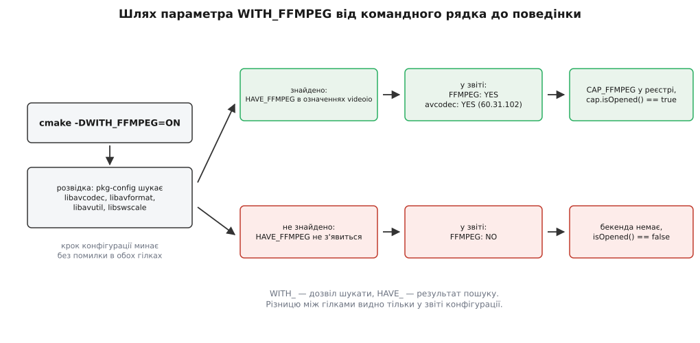

# 🧩 Параметри збірки OpenCV: довідка з конфігурації

Це перелік ключів `cmake`, якими вирішують, що саме вмітиме конкретна збірка OpenCV, і опис того, як прочитати у звіті конфігурації, що з замовленого справді збулося. Потреба саме в такій довідці випливає з однієї властивості цього кроку: **назва параметра описує намір, а не результат**, тож конфігурація без жодної помилки може дати бібліотеку, яка не вміє того, що ви їй замовили.

Значення нижче — для гілки 4.x; де 5.x відрізняється, сказано окремо. Повний перелік із поточної теки збірки завжди друкує `cmake -LAH <тека-збірки>`, а `ccmake` чи `cmake-gui` показують те саме з описами й дозволяють правити на місці.

## Три префікси

Перше, що варто прочитати правильно, — це не значення, а префікс імені. Він каже, **хто задає параметр і що ним керується**.

| Префікс | Хто задає | Що означає |
|---|---|---|
| `WITH_<X>` | ви | дозвіл **шукати** необов'язкову зовнішню залежність; не обіцянка знайти |
| `BUILD_<X>` для залежності (`BUILD_JPEG`, `BUILD_PNG`, `BUILD_ZLIB`, `BUILD_PROTOBUF`) | ви | зібрати **вбудовану копію** з теки `3rdparty/` замість системної |
| `BUILD_<X>` для складників (`BUILD_TESTS`, `BUILD_opencv_world`, `BUILD_opencv_<name>`) | ви | що саме збирати з самої OpenCV |
| `HAVE_<X>` | конфігурація | **результат** розвідки: залежність знайдено й підключено |
| `OPENCV_<X>` | ви | параметри самого проєкту OpenCV, не пов'язані з чужими бібліотеками |
| `ENABLE_<X>`, `CPU_<X>` | ви | важелі компілятора й коду під конкретний процесор |
| `VIDEOIO_<X>`, `HIGHGUI_<X>`, `PARALLEL_<X>` | ви | параметри одного модуля, а не всієї збірки |

`HAVE_` у цьому списку єдиний, який ви не задаєте. Спроба написати `-DHAVE_FFMPEG=1` не додасть підтримки FFmpeg: розвідка перезапише це значення власним висновком. Осідає воно теж не в одному місці — і це варто знати, коли шукаєте його слідів у джерелах. Загальні для всієї бібліотеки макроси (`HAVE_OPENCL`, `HAVE_CUDA`, `HAVE_IPP`, `HAVE_TBB`, `HAVE_JPEG`, `HAVE_PNG`, `HAVE_VA`) потрапляють у згенерований заголовок `cvconfig.h`. А ось бекенди захоплення відео — `HAVE_FFMPEG`, `HAVE_GSTREAMER`, `HAVE_V4L2`, `HAVE_MSMF`, `HAVE_DSHOW`, `HAVE_AVFOUNDATION` — у цьому заголовку відсутні: вони приходять як означення компіляції **самого модуля** `videoio`, разом із його джерелами. Тому шукати їх у `cvconfig.h` марно, а єдине спільне для всіх місце, де видно і ті, і ті, — звіт конфігурації.



*Обидві гілки завершуються успішною конфігурацією; повідомлення про те, що залежності немає, ви не отримаєте.*

Ще одна річ, яка збиває з пантелику саме тут, — довговічність кешу. Значення параметрів і частина результатів пошуку осідають у `CMakeCache.txt` і переживають повторний запуск `cmake`: поставили FFmpeg **після** невдалої конфігурації — і повторний прогін у тій самій теці цілком може не перешукати його наново. Надійний спосіб один: чиста тека збірки. Механіка того, чому кеш поводиться саме так, — [Кеш CMake, опції та їхнє життя між прогонами](root:sys-bsystem/cache-and-options).

## Склад модулів

Ці параметри вирішують, які бібліотеки взагалі з'являться на виході.

| Параметр | Типове значення | Що робить | Слід у звіті |
|---|---|---|---|
| `BUILD_LIST` | порожньо | збирати лише перелічені модулі та їхні залежності: `-DBUILD_LIST=core,imgproc,videoio` | коротший рядок `To be built:` |
| `BUILD_opencv_<name>` | `ON` для кожного доступного | вимкнути один модуль, не чіпаючи решти: `-DBUILD_opencv_dnn=OFF` | модуль переїжджає в `Disabled:` |
| `OPENCV_EXTRA_MODULES_PATH` | порожньо | перелік тек (через `;`) з додатковими модулями; для contrib — `<...>/opencv_contrib/modules` | розділ `Extra modules:` із рядками `Location (extra):` і `Version control (extra):` |
| `BUILD_opencv_world` | `OFF` | склеїти всі увімкнені модулі в одну бібліотеку | `world` зникає з `Disabled:` і з'являється в `To be built:` |
| `OPENCV_ENABLE_NONFREE` | `OFF` | увімкнути алгоритми з патентними обтяженнями (у 4.x це передусім SURF із contrib-модуля `xfeatures2d`) | `Non-free algorithms: YES` |

Рядок `To be built:` — не єдиний, який тут варто читати. Поруч стоять три різні способи не потрапити у збірку, і різниця між ними точно вказує, кого винуватити:

- **`Disabled:`** — ви вимкнули це самі (явним `BUILD_opencv_<name>=OFF` або тим, що не згадали модуль у `BUILD_LIST`).
- **`Disabled by dependency:`** — модуль сам по собі доступний, але вимкнено те, на що він спирається.
- **`Unavailable:`** — модуль є в дереві джерел, але його вимоги не виконані: немає потрібної зовнішньої залежності, компілятора обгорток або цільової платформи. Саме сюди мовчки потрапляють `python3` чи `java`, коли інтерпретатора не знайшлося.

## Форма артефакту

Наступна група не змінює вміст бібліотеки — лише те, у якому вигляді її отримає споживач.

| Параметр | Типове значення | Що робить | Слід у звіті |
|---|---|---|---|
| `BUILD_SHARED_LIBS` | `ON` | спільні бібліотеки (`.so`, `.dll`, `.dylib`) проти статичних (`.a`, `.lib`) | `Built as dynamic libs?: YES` |
| `CMAKE_BUILD_TYPE` | `Release` | рівень оптимізації й налагоджувальні символи | `Configuration:` у розділі `Platform:` |
| `CMAKE_CXX_STANDARD` | `11` у 4.x, `17` у 5.x | стандарт мови, яким збирають саму бібліотеку | `C++ standard:` |
| `BUILD_opencv_apps` | `ON` (крім Android і WinRT) | збирає службові застосунки, серед них `opencv_version` | `Applications:` містить `apps` |
| `BUILD_TESTS`, `BUILD_PERF_TESTS` | `ON` | тести точності та швидкодії | `Applications:` містить `tests`, `perf_tests` |
| `BUILD_EXAMPLES` | `OFF` | приклади з дерева джерел | — |
| `OPENCV_GENERATE_PKGCONFIG` | `OFF` | згенерувати `opencv4.pc` для проєктів не на CMake | окремого рядка немає; перевіряйте наявність файлу в `<prefix>/lib/pkgconfig` |
| `CMAKE_INSTALL_PREFIX` | `/usr/local` на Unix | корінь, куди кладе крок встановлення | `Install to:` в останньому рядку звіту |
| `ENABLE_PIC` | `ON` | позиційно-незалежний код; без нього статичну OpenCV не вкласти всередину чужої спільної бібліотеки | — |

Вибір між спільною і статичною збіркою тут не косметичний: він визначає, коли розв'язуються символи й скільки копій глобального стану опиниться в процесі — [Статичне й динамічне лінкування](root:sys-unix/static-and-dynamic-linking). Друга половина форми — те, як ваш проєкт цю збірку знайде: крок встановлення кладе поруч `OpenCVConfig.cmake`, і далі все залежить від того, звідки `find_package` його візьме ([find_package: Config проти Module](root:sys-bsystem/find-package)).

## Ввід-вивід

Найбільша група `WITH_` і єдина, де «увімкнено» найчастіше розходиться з «працює».

| Параметр | Типове значення | Що дає | Рядок у розділі `Video I/O:` |
|---|---|---|---|
| `WITH_FFMPEG` | `ON` | файли й мережеві потоки через бібліотеки FFmpeg | `FFMPEG: YES` плюс підрядки `avcodec:`, `avformat:`, `avutil:`, `swscale:` з версіями |
| `WITH_GSTREAMER` | `ON` | довільний конвеєр GStreamer як джерело чи приймач | `GStreamer: YES (1.24.2)` |
| `WITH_V4L` | `ON` на Linux | камери через Video4Linux2 | `v4l/v4l2: YES (linux/videodev2.h)` |
| `WITH_MSMF` | `ON` на Windows | Media Foundation — сучасний шлях до камер і файлів | `Media Foundation: YES` |
| `WITH_MSMF_DXVA` | `ON` на Windows | апаратне декодування всередині MSMF | `DXVA: YES` |
| `WITH_DSHOW` | `ON` на Windows | давній DirectShow; лишається для старих пристроїв | `DirectShow: YES` |
| `WITH_AVFOUNDATION` | `ON` на Apple | камери й файли на macOS та iOS | окремий рядок `AVFoundation: YES` |
| `WITH_1394`, `WITH_XINE`, `WITH_MFX`, `WITH_LIBREALSENSE`, `WITH_OPENNI2`, `WITH_ARAVIS`, `WITH_XIMEA`, `WITH_GPHOTO2` | `OFF` | вузькі джерела: промислові камери, глибинні сенсори, фотоапарати | відповідний рядок із `NO` |

Окремо — механізм плагінів. Він переносить рішення «яким кодом декодувати» зі збірки на запуск: бекенд стає окремою бібліотекою, яку `videoio` шукає й підвантажує тоді, коли він насправді знадобився. Це звичайна [плагінна архітектура](root:sf-apps/plugin-architecture) — вкладена всередину бібліотеки, щоб один пакунок працював і там, де FFmpeg є, і там, де його немає.

| Параметр | Типове значення | Що робить |
|---|---|---|
| `VIDEOIO_ENABLE_PLUGINS` | `ON` (`OFF` на Emscripten, iOS, xrOS, WinRT) | дозволяє механізм плагінів узагалі |
| `VIDEOIO_PLUGIN_LIST` | порожньо | які бекенди винести з бібліотеки в окремі файли; приймає `ffmpeg`, `gstreamer`, `mfx`, `msmf`, `ueye` або `all` |
| `HIGHGUI_ENABLE_PLUGINS`, `HIGHGUI_PLUGIN_LIST` | `ON`, порожньо | те саме для віконних бекендів `highgui` |
| `PARALLEL_ENABLE_PLUGINS` | `ON` | те саме для реалізацій `parallel_for_` |

Плагін, зібраний, але не знайдений, поводиться точнісінько як невимкнений бекенд, тому поруч із параметрами збірки стоять змінні оточення, які керують уже готовим бінарником:

| Змінна оточення | Навіщо |
|---|---|
| `OPENCV_VIDEOIO_PLUGIN_PATH` | де шукати плагіни `videoio` |
| `OPENCV_VIDEOIO_PRIORITY_LIST` | порядок, у якому пробувати бекенди |
| `OPENCV_VIDEOIO_PRIORITY_<NAME>` | посунути один бекенд угору або вниз |
| `OPENCV_VIDEOIO_DEBUG=1` | друкує, який бекенд пробували й чому він не підійшов |
| `OPENCV_LOG_LEVEL=DEBUG` | загальний рівень журналу бібліотеки |
| `OPENCV_DUMP_CONFIG=1` | вивалює звіт збірки в `stderr` на старті процесу |

## Прискорення й паралелізм

| Параметр | Типове значення | Що дає | Слід у звіті |
|---|---|---|---|
| `WITH_OPENCL` | `ON` (крім Android) | прозорий API: ті самі виклики на `cv::UMat` виконуються на пристрої OpenCL | розділ `OpenCL:` із рядками `Include path:` і `Link libraries: Dynamic load` |
| `WITH_CUDA` | `OFF` | підтримку CUDA в ядрі бібліотеки; самі `cuda*`-модулі живуть у contrib | `NVIDIA CUDA:` з переліком версій |
| `OPENCV_DNN_CUDA` | `OFF` | бекенд CUDA для `dnn`; вимагає `WITH_CUDA`, cuBLAS і cuDNN | той самий розділ CUDA |
| `CUDA_ARCH_BIN` | усі відомі архітектури | під які покоління GPU генерувати код: `-DCUDA_ARCH_BIN=8.6` | `NVIDIA GPU arch:` |
| `WITH_IPP` | `ON` на x86 і x86_64 | оптимізовані примітиви Intel замість власних реалізацій | `Intel IPP: 2021.12.0` і рядок `at:` зі шляхом |
| `WITH_TBB` | `OFF` | Threading Building Blocks як рушій паралелізму | `Parallel framework: TBB (ver ...)` |
| `WITH_OPENMP` | `OFF` | OpenMP як рушій паралелізму | `Parallel framework: OpenMP` |
| `WITH_PTHREADS_PF` | `ON` на Unix | власний пул потоків OpenCV поверх pthreads — те, що працює, коли не обрано нічого іншого | `Parallel framework: pthreads` |
| `CPU_BASELINE` | `SSE3` на x86_64, `SSE2` на x86, `DETECT` на Apple й aarch64, `VSX` на ppc64le | нижня межа: ці інструкції компілятор уживає всюди, і на процесорі без них бібліотека не запуститься | `Baseline:` і підрядок `requested:` |
| `CPU_DISPATCH` | `SSE4_1;SSE4_2;AVX;FP16;AVX2;AVX512_SKX` на x86_64, `NEON_FP16;NEON_BF16;NEON_DOTPROD` на aarch64 | набори, для яких гарячі функції компілюються кілька разів, а вибір відбувається під час запуску | `Dispatched code generation:` і підрядок `requested:` |
| `ENABLE_LTO`, `ENABLE_THIN_LTO` | `OFF` | оптимізація на етапі лінкування | — |
| `CV_DISABLE_OPTIMIZATION` | `OFF` | вимикає й векторні шляхи, й IPP — потрібне лише для розслідувань | — |
| `ENABLE_CCACHE` | `ON` на Unix | кешування об'єктних файлів між збірками | `ccache:` у розділі компілятора |

`CPU_BASELINE` приймає, крім переліку наборів, два особливі значення: `DETECT` — визначити можливості машини, на якій іде конфігурація, і `NATIVE` (синонім `HOST`) — просто віддати компіляторові `-march=native`. Обидва зручні для збірки «під себе» й небезпечні для пакунка, що поїде на чужі машини. Чому взагалі один набір інструкцій дає не відсотки, а рази, розібрано в темі [SIMD і векторизація](root:hw-arch/simd-vectorization); а рядок `Parallel framework:` читається разом із розумінням того, що таке [пул потоків](root:sf-tasks/thread-pool) — саме він ділить рядки зображення між ядрами, коли ви не підключили ані TBB, ані OpenMP.

## Як читати звіт конфігурації

Звіт друкується наприкінці кроку конфігурації й водночас зашивається в бібліотеку — потім його віддає `cv::getBuildInformation()`, а зібраний застосунок `opencv_version --verbose` друкує без жодного рядка вашого коду (є ще `--hw`, `--threads` і `--opencl` — вони показують уже те, що бачить бібліотека на цій конкретній машині).

Ось скорочений зразок; набір рядків залежить від платформи й версії, але заголовки розділів стабільні:

```
General configuration for OpenCV 4.13.0 =====================================
  Version control:               4.13.0

  Extra modules:
    Location (extra):            /src/opencv_contrib/modules
    Version control (extra):     4.13.0

  Platform:
    Host:                        Linux 6.8.0 x86_64
    Configuration:               Release

  CPU/HW features:
    Baseline:                    SSE SSE2 SSE3
      requested:                 SSE3
    Dispatched code generation:  SSE4_1 SSE4_2 FP16 AVX AVX2 AVX512_SKX
      requested:                 SSE4_1 SSE4_2 AVX FP16 AVX2 AVX512_SKX

  C/C++:
    Built as dynamic libs?:      YES
    C++ standard:                11

  OpenCV modules:
    To be built:                 core imgproc videoio
    Disabled:                    world
    Disabled by dependency:      -
    Unavailable:                 java python2 python3
    Non-free algorithms:         NO

  Video I/O:
    FFMPEG:                      YES
      avcodec:                   YES (60.31.102)
      avformat:                  YES (60.16.100)
      avutil:                    YES (58.29.100)
      swscale:                   YES (7.5.100)
    GStreamer:                   YES (1.24.2)
    v4l/v4l2:                    YES (linux/videodev2.h)

  Parallel framework:            pthreads

  Other third-party libraries:
    Intel IPP:                   2021.12.0 [2021.12.0]
           at:                   /build/3rdparty/ippicv/ippicv_lnx/icv

  OpenCL:                        YES (no extra features)
    Include path:                /src/opencv/3rdparty/include/opencl/1.2
    Link libraries:              Dynamic load

  Install to:                    /opt/opencv-4.13
```

Що читати в кожному розділі:

- **`Extra modules:`** — чи підхопився contrib і якої він ревізії. Порожньо тут означає, що жодного `cuda*`, `aruco` чи `ximgproc` у збірці немає, хоч би що ви ставили в `WITH_CUDA`.
- **`CPU/HW features:`** — пара «`Baseline` проти `requested`» показує, чи компілятор погодився на замовлене. Якщо просили AVX2 в базовому наборі, а в `Baseline` його немає, ваша збірка тихо лишилася на SSE.
- **`OpenCV modules:`** — чотири категорії з попереднього розділу; `Non-free algorithms:` теж тут.
- **`Video I/O:`** — головний розділ для конвеєра. `YES` без версії поруч — привід придивитися: бекенд може бути вбудованою обгорткою, а не системною бібліотекою.
- **`Parallel framework:`** — одне слово, яке пояснює, чому те саме навантаження на двох машинах ділиться між ядрами по-різному.
- **`OpenCL:`** — `YES` тут означає лише те, що збірка вміє звертатися до OpenCL; чи знайдеться пристрій, вирішується під час запуску.
- **`Install to:`** — куди поїдуть файли. Найдешевший спосіб не встановити другу OpenCV поверх системної.

## Поєднання, що дають несподіваний результат

**`WITH_X=ON` без знайденої залежності.** Конфігурація проходить, збірка проходить, а бекенда немає. Це не помилка, а задум: необов'язкову залежність не знайдено — отже, її не буде. Автоматичної перевірки «замовив і не отримав» у CMake немає, тож у складальному конвеєрі варто перевіряти рядок звіту (наприклад, шукати `FFMPEG: *YES` у виводі `cmake`) і валити збірку самотужки.

**`INSTALL_CREATE_DISTRIB=ON` мовчки вмикає `world`.** Типове значення `BUILD_opencv_world` — `OFF`, але воно стає `ON`, коли одночасно ввімкнено `INSTALL_CREATE_DISTRIB` і `BUILD_SHARED_LIBS` (а також у збірці Apple framework). Людина просить «зроби дистрибутив» — і отримує єдину `opencv_world` замість очікуваного набору бібліотек.

**`world` разом із `BUILD_LIST`.** Суперечності тут немає: `world` склеює саме **увімкнені** модулі, тож на виході буде маленька `opencv_world`. Ціна в іншому: склад бібліотеки більше не написаний на її імені й не видно в переліку файлів — єдиний спосіб дізнатися, що всередині, лишається той самий звіт.

**Статична збірка й плагіни.** Плагін за визначенням — окремий файл, який завантажують під час виконання; у збірці з `BUILD_SHARED_LIBS=OFF` це суперечність (скрипт окремої збірки плагіна прямо каже, що статичний плагін не має сенсу, і вимагає спільних бібліотек). Якщо збираєте статично — бекенди мають бути вбудовані, а `VIDEOIO_PLUGIN_LIST` лишіть порожнім.

**`VIDEOIO_PLUGIN_LIST` при `VIDEOIO_ENABLE_PLUGINS=OFF`.** Список ігнорується. Попередження в конфігурації є (`plugins are disabled through VIDEOIO_ENABLE_PLUGINS, so VIDEOIO_PLUGIN_LIST=... is ignored`), але серед сотень рядків його легко проґавити — а бекенд у результаті просто зникає.

**Плагін зібрано, але не знайдено.** Файл `libopencv_videoio_ffmpeg*.so` лежить не там, де його шукають, — і поведінка точнісінько така сама, як без FFmpeg. Лікується `OPENCV_VIDEOIO_PLUGIN_PATH`, діагностується `OPENCV_VIDEOIO_DEBUG=1`.

**`WITH_CUDA=ON` без contrib.** Підтримка CUDA в ядрі з'явиться, `cv::cuda::GpuMat` працюватиме, але жодного `cudaimgproc`, `cudawarping` чи `cudaarithm` не буде: усі вони живуть в `opencv_contrib`. Ознака — порожній розділ `Extra modules:` при ствердному `NVIDIA CUDA:`.

**`CPU_BASELINE=NATIVE` у пакунку для інших машин.** Бібліотека збереться під процесор складального агента і впаде з «недозволеною інструкцією» на машині старшого покоління. Для пакунка базовий набір ставлять свідомо низьким, а виграш забирають через `CPU_DISPATCH`.

**`BUILD_LIST` і тести.** Список звужує складання до перелічених модулів і їхніх залежностей, а модуль `ts`, на якому тримаються тести, у нього зазвичай не потрапляє. Або додайте `ts` до списку явно, або чесно вимкніть `BUILD_TESTS` і `BUILD_PERF_TESTS`.

**`OPENCV_GENERATE_PKGCONFIG` зі статичною збіркою.** Документація прямо застерігає, що перелік залежностей у згенерованому `.pc` може бути неповним; статичне лінкування — саме той випадок, коли неповнота стає помилкою лінкування.

**Дві OpenCV в системі.** Встановлення в `/usr/local` поверх пакунка дистрибутива в `/usr` дає класичну пару: `find_package` під час збірки знаходить одну збірку, а завантажувач під час запуску бере іншу. Ліки — окремий префікс (`-DCMAKE_INSTALL_PREFIX=/opt/opencv-4.13`), явний `-DOpenCV_DIR=/opt/opencv-4.13/lib/cmake/opencv4` у своєму проєкті й свідомо заданий шлях пошуку — [Порядок пошуку бібліотек: rpath, LD_LIBRARY_PATH, кеш](root:sys-unix/library-search-order).

**`WITH_OPENCL=ON` як обіцянка швидкості.** Прозорий API вмикається тільки тоді, коли ви працюєте з `cv::UMat`, а не з `cv::Mat`, і лише якщо рантайм знайшов придатний пристрій. Що саме при цьому відбувається з пам'яттю — [Бекенди й прискорення: UMat, OpenCL, апаратна збірка](root:sys-media/opencv-backends).

## Три робочі конфігурації

**Мінімальна збірка під відеоконвеєр.** Ніяких вікон, тестів і нейромереж — лише те, чим кадр приймають і обробляють:

```bash
cmake -S opencv -B build \
  -D CMAKE_BUILD_TYPE=Release \
  -D BUILD_LIST=core,imgproc,videoio \
  -D WITH_FFMPEG=ON -D WITH_GSTREAMER=ON -D WITH_V4L=ON \
  -D BUILD_TESTS=OFF -D BUILD_PERF_TESTS=OFF -D BUILD_EXAMPLES=OFF \
  -D CMAKE_INSTALL_PREFIX=/opt/opencv-videoio
```

**Збірка з contrib і CUDA** — той випадок, коли «мені потрібна OpenCV з CUDA» означає два репозиторії й довгу компіляцію; `CUDA_ARCH_BIN` скорочує її в рази, бо код генерується лише під ваші відеокарти:

```bash
cmake -S opencv -B build \
  -D CMAKE_BUILD_TYPE=Release \
  -D OPENCV_EXTRA_MODULES_PATH=/src/opencv_contrib/modules \
  -D WITH_CUDA=ON -D OPENCV_DNN_CUDA=ON \
  -D CUDA_ARCH_BIN=8.6 \
  -D BUILD_TESTS=OFF -D BUILD_PERF_TESTS=OFF
```

**Переносний пакунок,** який має запуститися і на десятирічній машині, і на свіжій, а FFmpeg підхопити тоді, коли він є в системі:

```bash
cmake -S opencv -B build \
  -D CMAKE_BUILD_TYPE=Release \
  -D BUILD_SHARED_LIBS=ON \
  -D CPU_BASELINE=SSE3 \
  -D CPU_DISPATCH=SSE4_2,AVX,AVX2,AVX512_SKX \
  -D VIDEOIO_PLUGIN_LIST=ffmpeg,gstreamer \
  -D CMAKE_INSTALL_PREFIX=/opt/opencv-dist
```

Перший рядок після кожної з цих команд, який варто прочитати, — не «Configuring done», а розділи звіту вище. Усе, що конфігурація не знайшла, вона повідомляє одним словом `NO` — і більше ніколи про це не нагадає.
