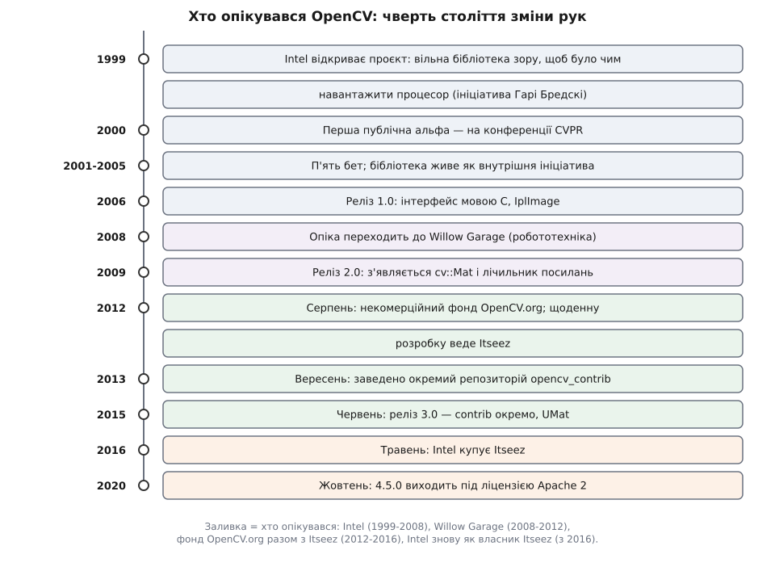

# 📜 Звідки взялася OpenCV: від дослідного відділу Intel до фонду

Бібліотеку, якою сьогодні відкривають камеру в кожному другому проєкті зору, почав виробник процесорів — і почав не заради зору. Ця історія варта переказу не через дати, а через те, що кожна зміна власника лишила слід у коді: розділення на два репозиторії, піврічний ритм релізів і навіть текст ліцензії — усе це наслідки того, хто в який момент платив за супровід.

## Навіщо виробникові процесорів дарувати бібліотеку

1999 рік, Intel. Компанія продає процесори, і продає їх тим краще, чим більше існує програм, яким тісно на теперішньому залізі. Комп'ютерний зір на той момент — ідеальний кандидат: обчислювально ненажерливий, з очевидним комерційним майбутнім і майже без готового коду. Кожна лабораторія писала згортку й перетворення колірних просторів заново, повільно і з власними помилками.

Офіційно проєкт відкрито 1999 року як ініціативу дослідного підрозділу Intel — в одному ряду з трасуванням променів у реальному часі й стінами з 3D-дисплеїв, тобто серед речей, що навантажують процесор (*задокументовано в оглядах історії проєкту; статус — усталений факт*). Ініціатором виступив Гарі Бредскі (Gary Bradski) — дослідник Intel, який згодом описав бібліотеку в статті «The OpenCV Library» у *Dr. Dobb's Journal* 2000 року.

Ціль, як її формулювали самі автори, складалася з трьох частин: дати дослідникам не просто відкритий, а **оптимізований** код базової інфраструктури зору; поширити знання через спільну для всіх основу; пришвидшити появу комерційних застосунків, роздавши переносний і швидкий код задарма. Третій пункт і є відповіддю на «навіщо»: безкоштовна бібліотека — це не благодійність, а спосіб виростити попит на власне залізо.

Звідси й розподіл праці, який варто називати точно. Задум і перша реалізація народилися в дослідному відділі Intel у Каліфорнії; оптимізацією займалася команда Intel у Росії (Нижній Новгород) разом із командою бібліотек продуктивності Intel (*так це фіксують джерела історії проєкту*). Тобто OpenCV від першого дня не була винаходом однієї людини й однієї країни: був ініціатор, була дослідницька частина й була окрема інженерна команда, що робила код швидким. Сучасний корпус бібліотеки — узагалі праця тисяч дописувачів.

## Конференція як спосіб народитися публічно

Першу відкриту альфу показали 2000 року на IEEE Conference on Computer Vision and Pattern Recognition — CVPR, головній конференції галузі. Місце обрано не випадково: у залі сиділа рівно та аудиторія, яка щодня переписувала ті самі функції.

Тут корисно розділити три різні події, які в переказах злипаються в одну. **Ідея** вільної бібліотеки зору носилася в повітрі й нікому не належить. **Реалізація** — конкретний код Intel, який існував уже 1999-го. **Публікація** — альфа на CVPR 2000 і стаття в *Dr. Dobb's Journal* того ж року, після яких бібліотека стала фактом для спільноти. Дата «1999» стосується запуску проєкту всередині компанії, дата «2000» — його появи назовні; обидві правильні, але про різне.

## Шість років до одиниці

Далі йде відрізок, який виглядає дивно на тлі теперішнього темпу: п'ять бет між 2001 і 2005 роками, і лише 2006-го — реліз 1.0. Сім років від запуску до першої версії, яку автори назвали готовою.

Пояснення не в складності зору, а в статусі проєкту. Дослідна ініціатива всередині великої компанії живе доти, доки хтось усередині вважає її цікавою; у неї немає ані зобов'язань перед зовнішніми користувачами, ані дати, до якої треба щось випустити. Бета виходить тоді, коли назбирався матеріал.

Та сама необов'язковість видна і в самому інтерфейсі 1.0: чиста мова C, структура `IplImage`, успадкована від Intel Image Processing Library, і ручне звільнення пам'яті. Це інтерфейс, зроблений усередині компанії для власного вжитку й лише потім відданий назовні — саме тому в ньому стільки слідів сусідньої інтеловської бібліотеки.

Після 1.0 інтерес материнської компанії згас. Проміжний випуск 1.1 «pre-release» датовано жовтнем 2008 року, і на цьому перший період закінчується.

## Друга і третя пари рук

*Кожна зміна опікуна припадає на межу, за якою в бібліотеці змінюється щось структурне: модель пам'яті, склад репозиторіїв, ліцензія.*

Підхопила бібліотеку Willow Garage — приватна лабораторія робототехніки, та сама, що дала світові ROS. Мотив у неї був протилежний інтеловському: не продати залізо, а мати зір для власних роботів, і мати його вільним, щоб ним користувалася вся робототехнічна спільнота. Рік переходу зазвичай називають 2008-м, і це та деталь, яка **гірше задокументована** за решту хронології: офіційного акта передачі опіки, на відміну від пізнішого оголошення про фонд, немає — є узгоджені свідчення учасників і оглядові джерела.

Саме в цей період, у жовтні 2009-го, вийшла версія 2.0 з інтерфейсом на C++, типом `cv::Mat` і автоматичним володінням пам'яттю через лічильник посилань. Це найглибша технічна зміна за всю історію бібліотеки — вона переписала модель даних, на якій тримається все інше (механіка цього володіння — [cv::Mat: пам'ять, лічильник посилань і володіння](topic:sys-media/mat-memory-model)). Робототехніка потребувала коду, який не тече протягом багатогодинної роботи робота; ручне `cvReleaseImage` цієї вимоги не витримувало.

У серпні 2012-го опіка перейшла до некомерційного фонду OpenCV.org. Це вже подія іншого типу: не «інша компанія взялася підтримувати», а спроба зробити бібліотеку такою, що не залежить від планів жодної компанії взагалі. Щоденну ж розробку вела Itseez — компанія, що виросла з тієї самої нижегородської інженерної традиції, звідки походила оптимізаційна команда Intel (*зв'язок широко відомий у спільноті й підтверджений тим, що саме Itseez називають провідним розробником OpenCV, але оформленого документа про спадкоємність команд у відкритому доступі немає — статус: правдоподібно, не доведено формально*).

Двоїстість «фонд плюс компанія-супроводжувач» і є ключем до наступного розділу.

## Як зміна опіки перетворилася на технічні рішення

Коли за супровід відповідає найнята команда, а фонд відповідає перед промисловими користувачами, у головного репозиторію з'являються обіцянки, яких у дослідного проєкту не було: тримати сумісність, проходити повний набір тестів на всіх платформах, не містити коду з нез'ясованим патентним чи ліцензійним статусом. Обіцянки корисні — і водночас нездоланні для половини наявного коду. Нові експериментальні алгоритми не мають стабільного інтерфейсу за визначенням, а найцікавіші детектори особливих точок на той момент були обтяжені патентами.

Розв'язок — не викидати цей код, а винести його туди, де таких обіцянок не дають. Репозиторій `opencv_contrib` заведено 11 вересня 2013 року (*дата — з метаданих самого репозиторію, тобто первинне джерело*), а на люди він вийшов з релізом 3.0 24 червня 2015-го. Розрив у півтора року показує природу події точніше за будь-який опис: розділення сталося як рішення про **керування проєктом** задовго до того, як стало помітним користувачам. Це не технічний рефакторинг, а проведена межа відповідальності, яку потім закріпили в структурі дерева джерел.

Другий слід — темп. Дослідний відділ ішов від альфи до 1.0 шість років; супроводжувач за контрактом випускає версії кожні пів року, і цей ритм тримається донині. Регулярність — не ознака технічної зрілості, а ознака того, що за календар відповідає хтось, кому за це платять.

## Intel купує свого ж супроводжувача

У травні 2016 року Intel уклала угоду про придбання Itseez. Коло замкнулося: компанія, що відкрила проєкт 1999-го й утратила до нього інтерес після 2006-го, повернулася — цього разу не як автор, а як власник команди супроводу.

Причина повернення інша, ніж перша. 2016 рік — це розквіт комп'ютерного зору на нейромережах і початок гонитви за автомобільною автономністю; Intel у ті самі роки скуповувала компанії саме цього профілю. Зір знову став тим, що продає залізо, тільки тепер уже не процесори взагалі, а прискорювачі.

Важливо, що ця купівля не зробила OpenCV інтеловською власністю. Фонд лишився фондом, ліцензія лишилася дозвільною, права на код належать його авторам. Змінилося те, хто платить зарплату більшості тих, хто щодня зливає зміни, — і цього достатньо, щоб впливати на пріоритети, але недостатньо, щоб закрити проєкт.

## Ліцензія: чому дозвільної BSD стало замало

Останній великий слід зміни власника — правовий. Уся OpenCV від початку й до версії 4.4.0 включно (разом з усіма 3.x, 2.x і 1.x) поширювалася під тричленною ліцензією BSD; версії від 4.5.0 і далі — під Apache 2 (*це прямо зафіксовано на офіційній сторінці ліцензії проєкту*). Версія 4.5.0 вийшла 12 жовтня 2020 року, тож саме ця дата ділить корпус надвоє. Рішення оголосили раніше того ж року, але точну дату оголошення я не підтвердив первинним джерелом — на відміну від дати релізу.

Обидві ліцензії дозвільні: бери, змінюй, постачай у закритому продукті. Різниця в тому, про що BSD **мовчить**. Вона говорить про авторське право й нічого не говорить про патенти. Apache 2 містить явне надання патентних прав від кожного дописувача — і вбудований запобіжник: хто подає патентний позов проти проєкту, той негайно втрачає надані права.

Для бібліотеки, більшість супроводжувачів якої працює на компанію з величезним патентним портфелем, ця мовчанка BSD перетворюється на практичну проблему: юрист великого користувача не може довести, що постачання продукту з OpenCV не наразить компанію на позов. Apache 2 знімає саме це питання. (*Такий зв'язок між зміною власника й зміною ліцензії — тлумачення, узгоджене з текстами обох ліцензій, а не заявлений проєктом мотив; сам проєкт формулював мету загальніше — прибрати юридичні перешкоди для впровадження.*) Чим саме дозвільні ліцензії різняться між собою й де проходить межа з копілефтом, розібрано окремо — [ліцензії відкритого коду](topic:sys-notary/open-source-licenses).

Цей перехід має пряму практичну вагу для того, хто постачає продукт: версія бібліотеки визначає не лише набір функцій, а й текст, який доведеться покласти в юридичні документи продукту. Оновлення з 4.4 на 4.5 — це зміна ліцензії, а не тільки зміна коду.

## Кому належить авторство

Питання «хто створив OpenCV» не має чесної однослівної відповіді, і це саме той випадок, коли розкладання на частини корисніше за ім'я. Проєкт **відкрила** корпорація з комерційного розрахунку. **Ініціював** його конкретний дослідник, Гарі Бредскі, і він же вивів бібліотеку на публіку. **Швидкою** її зробила окрема інженерна команда оптимізаторів. **Врятувала** її від забуття лабораторія робототехніки, якій потрібен був зір для власних машин. **Незалежною** її зробив фонд, а **живою** й регулярною — оплачувана команда супроводу.

Жоден із цих внесків не заміщає інших, і жодну з ланок не можна викреслити, не втративши бібліотеку. Найпоширеніша похибка переказів — стиснути цей ланцюг до одного імені чи одного місця; корисніше тримати всі ланки й до кожної дати мати джерело.
