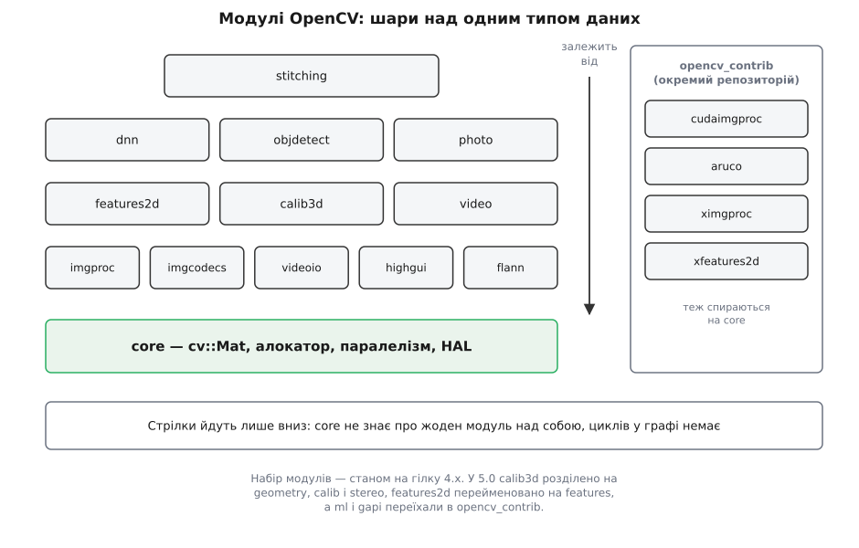
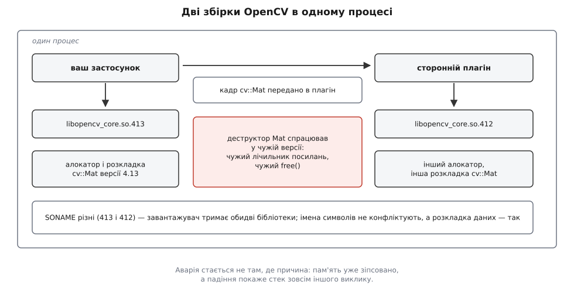
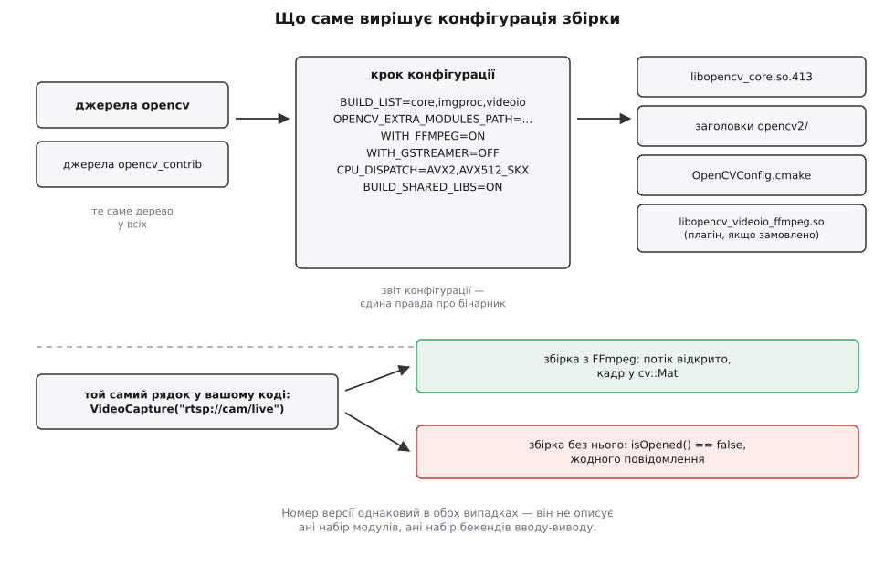

# Будова OpenCV: модулі, версії, як її збирають

<preknowlist>
- [Статичне й динамічне лінкування](topic:sys-unix/static-and-dynamic-linking) — чим `.a` відрізняється від `.so` і коли саме розв'язуються символи.
- [SONAME і версіонування спільних бібліотек](topic:sys-unix/soname-versioning) — за яким іменем завантажувач вирішує, що бібліотека підходить.
- [Динамічний завантажувач](topic:sys-unix/dynamic-loader) — хто й коли підтягує `.so` у процес.
- [Стабільність ABI у C++](topic:sys-plang-cpp/abi-stability-cpp) — що саме в бінарному інтерфейсі ламається від зміни класу.
- [Роль системи збірки](topic:sys-bsystem/build-system-role) — навіщо між деревом джерел і артефактом стоїть окремий інструмент.
- [find_package: Config проти Module](topic:sys-bsystem/find-package) — як проєкт на CMake знаходить чужу бібліотеку.
- [Підрахунок посилань](topic:sf-lang/reference-counting) — спільне володіння буфером через лічильник.
</preknowlist>

Двоє людей збирають той самий код. Один рядок: `cv::VideoCapture cap("rtsp://camera/live")`. У першого потік відкривається, кадри йдуть. У другого `cap.isOpened()` повертає `false` — мовчки, без винятку й без повідомлення в журналі. Обоє викликають `cv::getVersionString()` і бачать однакове «4.13.0». Заголовок той самий, версія та сама, поведінка різна.

Це не рідкісний збіг і не помилка в бібліотеці. Це прямий наслідок того, як OpenCV влаштована: **номер версії не описує, що вміє конкретна збірка**. «OpenCV» — не один артефакт, а набір модулів над одним типом даних, і склад цього набору — які модулі всередині, який код читає відео, хто виділяє пам'ять під кадр — визначає крок конфігурації, а не заголовковий файл.

## Чому єдиний шматок неминуче розпався

Уявіть бібліотеку комп'ютерного зору як один моноліт. Вона має вміти прочитати JPEG з диска, відкрити камеру, декодувати H.264 з мережі, показати вікно, порахувати згортку, запустити нейромережу, відкалібрувати стереопару. Кожна з цих здатностей тягне за собою **чужий код**: бібліотеку кодека, FFmpeg або GStreamer, драйвер камери, віконну систему (GTK, Cocoa, Win32), BLAS, драйвер GPU.

Тепер порахуймо ціну моноліту. Людина, якій потрібно тільки перетворити зображення на градації сірого, мусила б мати в системі FFmpeg, віконну систему й CUDA — інакше бібліотека просто не злінкується. На вбудованій платі без екрана це нездійсненна вимога. І навпаки: якщо зробити всі ці залежності необов'язковими всередині одного бінарника, то один непотрібний вам кодек, що не зібрався, ламає всю бібліотеку цілком.

Звідси перший розкрій: **окремі одиниці збірки, кожна зі своїм гроном зовнішніх залежностей**. Читання файлів зображень — окремо від захоплення відео, показ вікна — окремо від обчислень. Тоді відсутність GTK коштує вам одного модуля, а не всієї бібліотеки.

Але щойно шматки стали окремими, виникає нова вимога, без якої розкрій не працює. Якщо два модулі можуть посилатися один на одного, їх неможливо ані зібрати незалежно, ані злінкувати в передбачуваному порядку, ані викинути один із них. Тому граф залежностей між модулями мусить бути **ациклічним і спрямованим униз**: є низ, від якого залежать усі, і є верх, від якого не залежить ніхто.

## Низ, від якого залежать усі: один тип даних

Що має лежати в цьому низу? Не «найпростіші функції» — а те, чим модулі **обмінюються**. Якщо `videoio` віддає кадр, а `imgproc` його обробляє, вони мусять погодитися на спільний тип. Якщо кожен модуль матиме власний формат зображення, то на кожному стику доведеться конвертувати, а конвертація зображення — це копіювання мегабайтів, тобто найдорожча операція у відеоконвеєрі.

Тому в самому низу лежить не набір утиліт, а **валюта**: тип `cv::Mat` разом із алокатором пам'яті, лічильником посилань, базовою арифметикою над масивами й механізмом паралелізму. Модуль, що це все містить, називається `core`. Решта залежать від нього; він не залежить ні від кого.

> 🔧 **Навіщо це.** Саме звідси випливає головна практична властивість OpenCV у відеоконвеєрі: кадр можна пронести крізь десяток викликів із різних модулів **без жодного перетворення формату** — бо всі вони говорять одним типом. Ціна за це теж є, і вона в іншому місці: тип, спільний для всіх, стає спільною точкою крихкості.

Тип `cv::Mat` — це заголовок (розміри, тип елемента, крок рядка, вказівник на дані) плюс спільне володіння буфером через атомарний лічильник посилань. Копія `Mat` не копіює пікселі: вона копіює заголовок і збільшує лічильник. Механіка володіння, того, коли буфер справді звільняється, і того, що станеться при записі в спільні дані, розібрана окремо — [cv::Mat: пам'ять, лічильник посилань і володіння](topic:sys-media/mat-memory-model). Тут важлива не механіка, а її наслідок для будови.

А наслідок такий: **`cv::Mat` стоїть у публічній сигнатурі майже кожної функції кожного модуля**. Отже, розкладка полів цього класу входить у бінарний інтерфейс усіх бібліотек набору одночасно. Додати до `Mat` одне поле — означає зробити несумісними всі зібрані раніше модулі до одного. Це пояснює дві речі, які інакше виглядають дивно: чому за чверть століття модель даних OpenCV змінювалася лише двічі, і чому кожна така зміна називалася новою мажорною версією.

Є ще одна деталь, без якої картина неповна. Якщо `Mat` стоїть у кожній сигнатурі, то функція не змогла б прийняти ані `std::vector<Point>`, ані буфер на GPU. Щоб не плодити перевантажень, публічні функції беруть не `Mat`, а проксі-тип, який уміє дивитися на будь-яке з цих сховищ — [InputArray і OutputArray](topic:sys-media/input-output-array). Це проксі без володіння: він лише зберігає вказівник і мітку про те, чим насправді є аргумент.

## Що таке модуль фізично

Абстракція «модуль» тут не концептуальна, а буквальна. У дереві джерел це тека `modules/<name>/` з трьома обов'язковими частинами: `include/opencv2/<name>.hpp` — єдиний публічний заголовок; `src/` — реалізація; `CMakeLists.txt`, у якому один рядок оголошує модуль і перелічує його залежності:

```cmake
ocv_define_module(imgproc opencv_core WRAP java objc python js)
```

Із цього рядка система збірки виводить усе інше: одну ціль-бібліотеку (`libopencv_imgproc.so`), порядок збірки, транзитивні залежності, обгортки для Python, Java та JavaScript. Модуль — це одиниця, яку можна цілком вимкнути, і граф сам перерахує, що при цьому доведеться вимкнути слідом.

Другий бік цієї фізичності — збірний заголовок `opencv2/opencv.hpp`, який усі підключають першим. Усередині він виглядає так:

```cpp
#include "opencv2/core.hpp"

#ifdef HAVE_OPENCV_IMGPROC
#include "opencv2/imgproc.hpp"
#endif
#ifdef HAVE_OPENCV_VIDEOIO
#include "opencv2/videoio.hpp"
#endif
// ... і так для кожного модуля
```

`core.hpp` — безумовно, решта — під `#ifdef`. Макроси `HAVE_OPENCV_*` записуються в згенерований заголовок під час конфігурації. Тобто **один і той самий `#include <opencv2/opencv.hpp>` дає різний набір оголошень залежно від того, як зібрано бібліотеку** — і робить це мовчки. Якщо модуля немає, ви отримаєте помилку компіляції «немає такого імені», а не чесне «модуль вимкнено». Це перше місце, де конфігурація протікає у ваш код.

## Мапа модулів



*Стрілки залежності йдуть лише вниз до core; contrib-модулі живуть в окремому репозиторії й підключаються до збірки ззовні.*

Поверх `core` лежить шар, який стикається із зовнішнім світом і з яким має справу будь-який відеоконвеєр:

- **`imgproc`** — операції над зображенням у пам'яті: фільтри, геометричні перетворення, перетворення колірних просторів. Це той модуль, який виконує `cvtColor` при переході від формату конвеєра до формату алгоритму.
- **`imgcodecs`** — читання й запис файлів зображень; тягне libjpeg, libpng, libtiff, WebP.
- **`videoio`** — захоплення й запис відео: камери, файли, мережеві потоки. Тягне найважче — FFmpeg, GStreamer, V4L2, Media Foundation, AVFoundation.
- **`highgui`** — вікна й події миші, тобто `imshow` і `waitKey`; тягне віконну систему.
- **`flann`** — пошук найближчих сусідів у багатовимірному просторі; існує окремо, бо ним користуються модулі порівняння ознак.

Вище — алгоритмічний шар: `features2d` (пошук і зіставлення особливих точок), `calib3d` (геометрія, калібрування, стерео), `video` (рух і трекінг), `objdetect`, `photo`, `dnn` (виконання нейромереж), `stitching` (склеювання панорам). Ці модулі для нас тут — лише вузли графа: **чому** саме так працює згортка, детектор чи трекер — питання теорії алгоритмів, а не будови бібліотеки.

Окремо стоїть `world` — не модуль, а спосіб пакування: збірка з `BUILD_opencv_world=ON` складає всі увімкнені модулі в одну бібліотеку. Це зручно, коли застосунок постачають одним файлом, — і водночас перекреслює весь розкрій, якщо вам потрібна саме мінімальна збірка.

### Головний репозиторій і contrib

Половина того, що люди вважають частиною OpenCV, лежить у другому репозиторії — `opencv_contrib`. Там `aruco`, `ximgproc`, `xfeatures2d`, `tracking` і — що найважливіше для швидкості — **весь набір `cuda*`-модулів**.

Причина розділення не технічна, а редакційна. Головний репозиторій має тримати сумісність, проходити повний набір тестів на всіх платформах і не містити коду з нез'ясованим патентним чи ліцензійним статусом. Contrib цих обіцянок не дає: там код або новий, або вузький, або з обтяженнями. Це не «гірші» модулі — це модулі з іншим рівнем зобов'язань.

Практичний наслідок трапляється частіше, ніж хотілося б: «мені потрібна OpenCV з CUDA» насправді означає «мені потрібна збірка з джерел разом із contrib», бо готові пакунки з дистрибутивів і `pip` зібрані без нього. Contrib підключають однією змінною конфігурації — шляхом до теки `modules` другого репозиторію.

## Версії: що саме змінюється

Тепер, коли видно, що в центрі стоїть тип даних, історія версій читається не як список нововведень, а як послідовність змін моделі володіння пам'яттю.

**1.x (перший реліз 1.0 — 2006).** Інтерфейс мовою C: структура `IplImage`, успадкована від Intel Image Processing Library, і функції `cvCreateImage` / `cvReleaseImage`. Володіння — ручне й повністю на совісті того, хто пише. Кожен вихід із функції через помилку — це місце потенційного витоку.

**2.0 (жовтень 2009).** Перелом: з'являється `cv::Mat` із лічильником посилань, і володіння стає автоматичним. Це найважливіша подія в житті бібліотеки — саме тоді сформувалася та модель пам'яті, якою OpenCV живе досі, і саме тому цей рубіж збігся зі зміною мажорної версії.

**3.0 (2015).** Виокремлено `opencv_contrib`; з'явився «прозорий API» — тип `cv::UMat`, завдяки якому ті самі виклики виконуються на OpenCL-пристрої без переписування коду. Це друга модель володіння поряд із `Mat`: буфер може жити не в системній пам'яті, і питання «де саме зараз дані» стає явним. Механіка цього — [Бекенди й прискорення: UMat, OpenCL, апаратна збірка](topic:sys-media/opencv-backends).

**4.0 (листопад 2018).** Обов'язковий C++11; старий C-інтерфейс оголошено застарілим. `gapi` — графовий API для опису конвеєрів обробки.

**4.5.0 (жовтень 2020).** Ліцензію змінено з тричленної BSD на Apache 2.0. Це не технічна подія, але вона визначає, що саме ви можете постачати: версії до 4.4 включно, а також уся 3.x і 2.x, лишаються під BSD, усе від 4.5 і далі — під Apache 2.

**5.0 (червень 2026).** Мінімум — C++17. Старий C-інтерфейс (`IplImage`, `CvMat`, `cvCreateMat`) вилучено остаточно. `calib3d` розділено на `geometry`, `calib` і `stereo`; `features2d` перейменовано на `features`; `ml` і `gapi` переїхали в contrib. І найголовніше для моделі даних: додано типи елементів `CV_16F`, `CV_16BF`, `CV_32U`, `CV_64U`, `CV_64S`, `CV_Bool`, а `Mat`, обгорнутий навколо `std::vector`, тепер стає справжнім одновимірним масивом, а не матрицею Nx1.

Ця остання деталь показує природу мажорних змін точніше за будь-який перелік. Код, що робив `switch (mat.type())`, роками працював коректно — і після переходу на 5.0 мовчки провалюється в `default` на кадрі, тип якого раніше просто не існував. Змінилася не функція, змінився словник типів.

Хто й навіщо починав цю бібліотеку, як вона пережила зміну власника й перетворилася зі внутрішнього проєкту на інфраструктуру галузі — [історія OpenCV: від лабораторії Intel до фонду](topic:sys-media/opencv-structure/hist-opencv-origin.md). Там же — про роль Гарі Бредскі та про те, чому перша публічна альфа з'явилася саме на конференції.

## Версія в бінарнику: SONAME і чому мінор ламає сумісність

Номер версії, який видно в коді, і номер, за яким працює завантажувач, — різні речі. У збірці OpenCV перший називається `OPENCV_LIBVERSION`, другий — `OPENCV_SOVERSION`, і рахуються вони по-різному:

```
OPENCV_LIBVERSION = MAJOR.MINOR.PATCH          → 4.13.0
OPENCV_SOVERSION  = MAJOR + MINOR (дві цифри)  → 413
```

Друге значення потрапляє у властивість цілі `SOVERSION`, тобто стає SONAME спільної бібліотеки. На Linux ви отримуєте файл `libopencv_core.so.4.13.0`, на нього посилання `libopencv_core.so.413`, і саме це коротке ім'я записується в залежності вашого виконуваного файлу. На Windows той самий принцип дає ім'я файлу: `opencv_world4130.dll`.

Прочитаймо це уважно. **Мінорна версія входить у SONAME.** Отже, для динамічного завантажувача `libopencv_core.so.412` і `libopencv_core.so.413` — дві **різні бібліотеки**, а не дві версії однієї. Це не недогляд: це чесне визнання того, що OpenCV не тримає бінарну сумісність між мінорними випусками. Вона й не могла б її тримати, поки `cv::Mat` стоїть у кожній сигнатурі, а кожен мінорний випуск додає до нього щось нове.

Дві такі бібліотеки цілком можуть зустрітися в одному процесі — і саме там наслідок стає видимим.



*Різні SONAME означають, що обидві бібліотеки спокійно живуть у процесі одночасно; конфлікту імен немає, а ті самі байти `cv::Mat` два боки тлумачать по-різному.*

**Умова.** Ваш застосунок злінковано з OpenCV 4.13. Він завантажує сторонній плагін обробки, зібраний рік тому з OpenCV 4.12. Ви передаєте плагінові кадр — об'єкт `cv::Mat` за значенням.

```
ваш код:      Mat кадр   → заголовок і лічильник за розкладкою 4.13
плагін:       копія Mat  → той самий байтовий вміст читає код 4.12
плагін:       ~Mat()     → зменшує лічильник за зміщенням 4.12
                         → викликає free() свого алокатора
```

Якщо розкладка полів `Mat` між 4.12 і 4.13 хоч десь розійшлася, зменшується не той лічильник. Буфер або звільняється, поки ви ним ще користуєтеся, або не звільняється ніколи. І навіть коли розкладка збіглася, звільнення відбувається алокатором іншої бібліотеки — а це вже невизначена поведінка. Аварія станеться пізніше й в іншому місці, і стек викликів вкаже на щось геть невинне.

> 🔧 **Навіщо це.** Звідси єдине робоче правило постачання: **у процесі має бути рівно одна збірка OpenCV**. Якщо ви віддаєте плагінам чи модулям власний інтерфейс — виносьте `cv::Mat` із його сигнатур і передавайте сирі дані (вказівник, розміри, крок рядка, код формату), а `Mat` збирайте по свій бік межі. Тоді версія OpenCV стає внутрішньою справою кожного боку.

Той самий механізм пояснює, чому статичне лінкування OpenCV не рятує від проблеми, а поглиблює її: дві статичні копії в одному процесі означають два незалежні алокатори й два набори глобального стану.

## Як її збирають

Тепер видно, чому крок конфігурації в OpenCV важить більше, ніж у звичайній бібліотеці: він вирішує не «які прапорці оптимізації», а **склад бібліотеки і склад її здатностей**.



*Номер версії однаковий в обох гілках — він не описує ані набір модулів, ані набір бекендів вводу-виводу.*

Збирають OpenCV системою CMake, і крок конфігурації тут — насамперед **розвідка**: перебрати кілька десятків необов'язкових зовнішніх бібліотек і з'ясувати, які з них є в системі. Параметри згруповані трьома префіксами, і різниця між ними принципова:

- `WITH_<X>` — **дозвіл шукати**. `WITH_FFMPEG=ON` не означає «буде FFmpeg», означає «спробуй знайти».
- `BUILD_<X>` — **зібрати вбудовану копію**, якщо в системі не знайшлося (OpenCV везе із собою джерела libjpeg, libpng, zlib і ще кількох).
- `HAVE_<X>` — **результат розвідки**, який виставляє сама конфігурація. Читати, не задавати.

Ця тріада — причина класичної пастки: людина ставить `WITH_FFMPEG=ON`, збірка проходить без єдиної помилки, а відео не відкривається. Пошук просто не знайшов FFmpeg, і `HAVE_FFMPEG` лишився вимкненим. Помилки немає, бо з погляду CMake нічого поганого не сталося: необов'язкову залежність не знайдено, отже, її не буде.

Тому єдине надійне джерело правди про бінарник — **звіт конфігурації**, який CMake друкує наприкінці й який потім назавжди зашивається всередину бібліотеки. Не «я ж указав прапорець», а «в рядку `Video I/O` звіту написано `FFMPEG: YES`».

Далі — параметри, що керують складом:

- `BUILD_LIST` — перелік потрібних модулів; решту вимкнено, а залежності перелічених дотягуються самі. `BUILD_LIST=core,imgproc,videoio` дає рівно те, що потрібно конвеєрові, і збирається в рази швидше.
- `BUILD_opencv_<name>=OFF` — вимкнути окремий модуль.
- `OPENCV_EXTRA_MODULES_PATH` — шлях (або кілька) до теки `modules` репозиторію contrib.
- `BUILD_SHARED_LIBS` — спільні бібліотеки чи статичні.
- `BUILD_opencv_world` — склеїти все в одну бібліотеку.
- `CPU_BASELINE` і `CPU_DISPATCH` — про них окремо нижче.
- `OPENCV_GENERATE_PKGCONFIG` — згенерувати `.pc` для проєктів не на CMake (з чесним застереженням у документації, що перелік залежностей там може бути неповним).

Повний розбір цих параметрів, що з чим сполучається і які поєднання дають несподіваний результат, зібрано окремо — [параметри збірки OpenCV: довідка](topic:sys-media/opencv-structure/api-build-options.md).

Наприкінці збірки крок встановлення кладе на місце заголовки, бібліотеки й файл `OpenCVConfig.cmake`. Останній — це саме те, що знаходить `find_package(OpenCV REQUIRED)` у вашому проєкті: він оголошує імпортовані цілі `opencv_core`, `opencv_videoio` тощо разом із їхніми залежностями. Тому в сучасному проєкті достатньо написати `target_link_libraries(app PRIVATE opencv_core opencv_videoio)`, і шляхи до заголовків, транзитивні бібліотеки й потрібні прапорці приїдуть самі.

### Одна збірка на кілька процесорів

Ще один вибір, який робиться на конфігурації й потім живе всередині бінарника. Обробка зображень — це той рідкісний випадок, коли векторні інструкції процесора дають не відсотки, а рази: одна інструкція AVX2 обробляє тридцять два байти замість одного. Але зібрати бібліотеку під AVX2 означає, що вона впаде на процесорі, де AVX2 немає.

OpenCV розв'язує це двома параметрами. `CPU_BASELINE` — набір інструкцій, який компілятор має право використовувати **всюди**; це нижня межа, і на процесорі без цих інструкцій бібліотека не запуститься. `CPU_DISPATCH` — перелік наборів, для яких гарячі функції компілюються **кілька разів**, у кілька версій, а вибір потрібної відбувається під час запуску за результатом опитування процесора. Механізм цього опитування описано в темі [CPUID](topic:hw-arch/cpuid), а те, звідки взагалі береться виграш від векторних інструкцій, — у темі [SIMD і векторизація](topic:hw-arch/simd-vectorization).

Диспетчеризація оголошується не для модуля цілком, а пофайлово. У `imgproc`, наприклад, є такий рядок:

```cmake
ocv_add_dispatched_file(color_yuv SSE2 SSE4_1 AVX2 AVX512_SKX AVX512_ICL)
```

Він означає, що перетворення YUV — а це рівно те, що виконується на кожному кадрі з відеоконвеєра, — буде скомпільовано в п'ять варіантів, і на кожній машині виконається найкращий доступний.

Ціна прозора: бінарник більший, час збірки довший. Вигода теж прозора: один пакунок працює і на старій машині, і на новій, використовуючи на кожній максимум доступного.

## Де конфігурація стикається з відеоконвеєром

Питання, з якого все почалося, має тепер конкретну адресу: **хто виділяє пам'ять під кадр і як вона доходить до вашого коду**.

Модуль `videoio` — це фасад. `cv::VideoCapture` не вміє декодувати нічого; вона вибирає **бекенд** і делегує роботу йому. Бекендів багато: `CAP_FFMPEG`, `CAP_GSTREAMER`, `CAP_V4L2`, `CAP_MSMF`, `CAP_AVFOUNDATION`, `CAP_ANDROID`. Які з них узагалі присутні — вирішила конфігурація; який буде обрано мовчки — вирішує порядок у реєстрі; який потрібен вам — кажете явно другим аргументом: `VideoCapture(url, cv::CAP_GSTREAMER)`.

І тут з'являється поворот, який ламає навіть це правило. Починаючи з 4.1 бекенди `videoio` можна збирати не всередину `libopencv_videoio.so`, а **окремими плагінами**, що завантажуються під час виконання: параметр `VIDEOIO_PLUGIN_LIST=ffmpeg,gstreamer` дає файли на кшталт `libopencv_videoio_ffmpeg.so`, а змінна оточення `OPENCV_VIDEOIO_PLUGIN_PATH` каже, де їх шукати. Мета зрозуміла: постачати один пакунок, який працює і там, де FFmpeg є, і там, де його немає. Це та сама ідея, що й у [плагінній архітектурі](topic:sf-apps/plugin-architecture) взагалі, тільки застосована до вводу-виводу.

Тобто рішення «хто декодує кадр» приймається тепер не під час збірки й навіть не під час лінкування, а **під час запуску, в конкретному оточенні** — і разом із ним переїжджає відповідь на питання «хто виділив буфер, який ви зараз тримаєте». Реєстр це чесно показує:

```cpp
#include <opencv2/videoio.hpp>
#include <opencv2/videoio/registry.hpp>
#include <iostream>

int main() {
    for (auto api : cv::videoio_registry::getStreamBackends()) {
        std::cout << cv::videoio_registry::getBackendName(api)
                  << (cv::videoio_registry::isBackendBuiltIn(api)
                          ? "  вбудований\n" : "  плагін\n");
    }
}
```

Що б не написав реєстр, для вашого коду результат однаковий за формою: `cap >> frame` віддає `cv::Mat`, і цей `Mat` **майже завжди володіє власним буфером, у який кадр скопійовано з буфера декодера**. Бекенд і OpenCV живуть у різних моделях пам'яті: у декодера це може бути буфер DMA, апаратна поверхня чи вирівняний блок із власного пулу, а `cv::Mat` вимагає суцільного масиву з відомим кроком рядка. Копія — плата за спільний тип, з якого ми починали.

Обійти цю копію можна лише знявши потребу в перетворенні: віддати з конвеєра вже той формат пікселів, який чекає `Mat`, і побудувати `Mat`-заголовок **над чужим буфером**, не володіючи ним. Обидві половини цього прийому розібрані окремо — [види без копії: ROI і заголовок над чужим буфером](topic:sys-media/mat-views-no-copy) і [стик із відеоконвеєром: формати пікселів і передача кадру](topic:sys-media/frame-interop). З боку GStreamer симетричну роль грає [appsink і appsrc](topic:sys-media/appsink-appsrc) — місце, де кадр залишає конвеєр і потрапляє у ваш код.

Тут же лежить і практичне попередження. Якщо ви взяли `Mat` над чужим буфером, час його життя визначає не лічильник посилань OpenCV, а власник буфера — конвеєр. Той самий кадр, який відпустив GStreamer, для вашого `Mat` перетворюється на висячий вказівник, а `Mat` про це нічого не знає, бо нічим не володіє.

## Питати бінарник, а не номер версії

Звідси випливає одна робоча звичка, яка коштує кількох рядків коду й економить дні. Версія OpenCV **не є специфікацією** — вона говорить про мову, набір типів і форму API, але нічого не говорить про склад модулів, наявність бекендів, набір векторних розширень і присутність contrib. Усе це — властивості конкретного бінарника, і бінарник уміє про себе розповісти.

Найпряміший спосіб — узяти той самий звіт конфігурації, який CMake надрукував під час збірки: він зашитий усередину бібліотеки й доступний у будь-який момент:

```cpp
#include <opencv2/core.hpp>
#include <iostream>

int main() {
    std::cout << cv::getVersionString() << "\n\n"
              << cv::getBuildInformation();
}
```

У виведенні шукайте не загальні слова, а конкретні рядки: секцію `Video I/O` (які бекенди справді ввімкнено), `Parallel framework` (TBB, OpenMP чи власний пул потоків — від цього залежить, як бібліотека ділить роботу між ядрами, див. [пул потоків](topic:sf-tasks/thread-pool)), `CPU/HW features` (базовий і диспетчеризовані набори інструкцій), `Extra modules` (чи є contrib і якої він ревізії), `OpenCL` (чи має сенс `cv::UMat`).

Готовий діагностичний інструмент, який зводить це докупи — версія, модулі, бекенди захоплення й запису, стан плагінів, доступні набори інструкцій — і показує, як така перевірка вбудовується в старт застосунку замість мовчазного падіння через півгодини роботи, зібрано окремо: [програма-ревізор збірки OpenCV](topic:sys-media/opencv-structure/proj-inspect-build.md).

Прийміть цю перевірку як частину контракту постачання — й історія з початку перестає бути загадкою. Двоє людей мали не «однакову OpenCV різної поведінки», а дві різні бібліотеки з однаковим номером на етикетці; звіт конфігурації показав би це за секунду.
