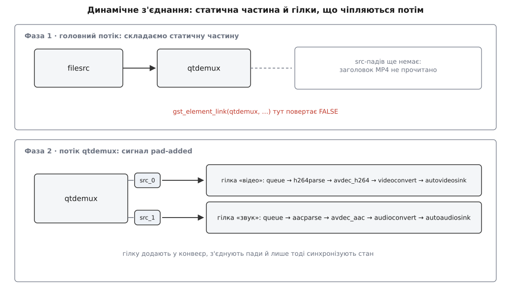
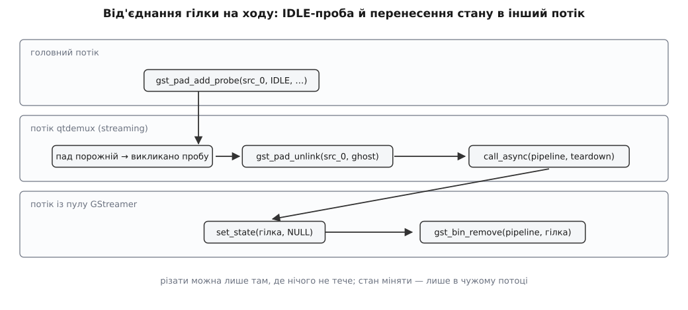

# ⚙️ Динамічне з'єднання: гілка, що з'являється під час роботи

Робоча програма на C, яка складає конвеєр `filesrc ! qtdemux` наперед, гілку розбору й декодування чіпляє до демультиплексора вже під час відтворення — коли той прочитав заголовок і повідомив, які доріжки в файлі, — а потім від'єднує цю гілку на ходу, не зупиняючи конвеєра. Мова тут не вибіркова: ядро GStreamer має C-API, сигнали й проби — це C-колбеки з фіксованими підписами, і будь-яка обгортка над бібліотекою все одно повторює ту саму послідовність викликів.

## Задача

На вході — файл MP4, про який відомо лише те, що це MP4. Скільки в ньому доріжок, які саме, у якому порядку — знає лише заголовок, і прочитає його `qtdemux` уже після запуску конвеєра. Отже, у момент складання нижньої половини конвеєра просто не існує: нема до чого чіпляти декодер, бо нема пада, з якого пішли б дані.

Треба зробити три речі. Перше — зібрати ту частину, що відома наперед, і запустити її. Друге — на кожен новий пад демультиплексора вирішити, що це за доріжка, побудувати відповідну гілку й приєднати її до конвеєра, який уже грає. Третє — через задану кількість секунд вирізати відеогілку так, щоб звук грав далі, а конвеєр не помітив хірургії.

## Ідея: два збирання замість одного

Конвеєр розпадається на дві частини з різними правилами. **Статичний кістяк** (`filesrc ! qtdemux`) складають у головному потоці до старту — тут працює звичайний `gst_element_link`. **Гілки** народжуються в обробнику сигналу `pad-added`, який GStreamer викликає зі свого потоку обробки, коли конвеєр уже в стані `PLAYING`.

Друге рішення економить більшу частину коду: кожну гілку роблять окремим **біном з одним привидним sink-падом**. Тоді гілка будь-якої довжини — це один об'єкт із одним входом, який додають, синхронізують, від'єднують і вилучають одним викликом кожної дії. Без біна довелося б тримати список елементів гілки й повторювати кожну операцію по всьому списку, не переплутавши порядку.



*Перша фаза складається як звичайний конвеєр; друга — щоразу, коли демультиплексор оголошує чергову доріжку.*

## Кістяк і підписка

```c
/* dynlink.c — гілки, що чіпляються до qtdemux під час роботи.
 *   зібрати:   gcc dynlink.c -o dynlink $(pkg-config --cflags --libs gstreamer-1.0)
 *   запустити: ./dynlink кіно.mp4 5     (через 5 с відрізати відеогілку)
 */
#include <gst/gst.h>
#include <stdlib.h>

typedef struct {
  GstElement *pipeline;
  GMainLoop  *loop;

  GstElement *video_branch;   /* бін гілки, доки вона в конвеєрі */
  GstElement *audio_branch;
  GstElement *video_tail;     /* останній елемент відеогілки — треба лише для дренажу */
  GstPad     *video_pad;      /* src-пад qtdemux, з якого живе відеогілка */
  gint        cut_started;    /* одноразовий засув для розрізу */
} App;

static const gchar *const VIDEO_BRANCH[] = {
  "queue", "h264parse", "avdec_h264", "videoconvert", "autovideosink", NULL
};
static const gchar *const AUDIO_BRANCH[] = {
  "queue", "aacparse", "avdec_aac", "audioconvert", "audioresample",
  "autoaudiosink", NULL
};

/* оголошення наперед — тіла нижче */
static void     on_pad_added     (GstElement *demux, GstPad *newpad, gpointer user_data);
static gboolean on_bus_message   (GstBus *bus, GstMessage *msg, gpointer user_data);
static gboolean cut_video_branch (gpointer user_data);

int
main (int argc, char *argv[])
{
  App app = { 0 };

  gst_init (&argc, &argv);
  if (argc < 2) {
    g_printerr ("вжиток: %s файл.mp4 [секунд до відрізання відеогілки]\n", argv[0]);
    return 1;
  }

  app.loop = g_main_loop_new (NULL, FALSE);
  app.pipeline = gst_pipeline_new ("dyn");

  GstElement *src   = gst_element_factory_make ("filesrc", NULL);
  GstElement *demux = gst_element_factory_make ("qtdemux", NULL);
  g_object_set (src, "location", argv[1], NULL);

  gst_bin_add_many (GST_BIN (app.pipeline), src, demux, NULL);
  if (!gst_element_link (src, demux))
    g_error ("filesrc → qtdemux не з'єдналися");

  /* Усе, що нижче qtdemux, з'явиться потім. Єдине, що можна зробити зараз, —
     сказати, кого кликати, коли воно з'явиться. */
  g_signal_connect (demux, "pad-added", G_CALLBACK (on_pad_added), &app);

  GstBus *bus = gst_element_get_bus (app.pipeline);
  gst_bus_add_watch (bus, on_bus_message, &app);
  gst_object_unref (bus);

  gst_element_set_state (app.pipeline, GST_STATE_PLAYING);
  if (argc > 2)
    g_timeout_add_seconds ((guint) atoi (argv[2]), cut_video_branch, &app);

  g_main_loop_run (app.loop);

  gst_element_set_state (app.pipeline, GST_STATE_NULL);
  gst_object_unref (app.pipeline);
  g_main_loop_unref (app.loop);
  return 0;
}
```

Головний цикл `GMainLoop` тут не декорація. Обробник `pad-added` виконуватиметься в потоці демультиплексора, а помилки, які він може накоїти, прилітають окремим каналом — повідомленнями на шину конвеєра. Читає шину `gst_bus_add_watch`, і читає її **в головному потоці**: доки цикл крутиться, потік обробки може щось повідомити, нікого не чекаючи ([шина повідомлень](topic:sys-media/bus-and-messages) — асинхронний канал від конвеєра до програми саме для того, щоб потоки обробки ніколи не блокувалися на розмові з нею).

```c
static gboolean
on_bus_message (GstBus *bus, GstMessage *msg, gpointer user_data)
{
  App *app = user_data;

  switch (GST_MESSAGE_TYPE (msg)) {
    case GST_MESSAGE_ERROR: {
      GError *err = NULL;
      gchar *dbg = NULL;
      gst_message_parse_error (msg, &err, &dbg);
      g_printerr ("помилка від %s: %s\n", GST_OBJECT_NAME (msg->src), err->message);
      if (dbg)
        g_printerr ("  %s\n", dbg);
      g_clear_error (&err);
      g_free (dbg);
      g_main_loop_quit (app->loop);
      break;
    }
    case GST_MESSAGE_EOS:
      g_print ("кінець потоку\n");
      g_main_loop_quit (app->loop);
      break;
    default:
      break;
  }
  return TRUE;   /* лишити спостерігача на шині */
}
```

## Гілка як бін з одним входом

```c
/* Гілка — окремий бін з одним привидним sink-падом. Так її можна додати,
   синхронізувати, від'єднати й вилучити як одне ціле. */
static GstElement *
make_branch (const gchar *name, const gchar *const *factories, GstElement **tail)
{
  GstElement *bin = gst_bin_new (name);
  GstElement *first = NULL, *prev = NULL;

  for (int i = 0; factories[i] != NULL; i++) {
    GstElement *e = gst_element_factory_make (factories[i], NULL);
    if (e == NULL) {
      g_printerr ("немає елемента '%s' — бракує плагіна\n", factories[i]);
      gst_object_unref (bin);
      return NULL;
    }
    gst_bin_add (GST_BIN (bin), e);          /* бін забирає посилання на e */
    if (prev != NULL && !gst_element_link (prev, e)) {
      g_printerr ("не з'єдналися %s → %s\n", factories[i - 1], factories[i]);
      gst_object_unref (bin);
      return NULL;
    }
    if (first == NULL)
      first = e;
    prev = e;
  }

  /* Вхід біна: привид над sink-падом першого елемента. Бін щойно створений,
     тобто в стані NULL, — активувати пад окремо не треба, це зробить перехід
     стану. Пад, доданий до елемента, який ВЖЕ працює, довелося б активувати
     самому: gst_pad_set_active (ghost, TRUE). */
  GstPad *inner = gst_element_get_static_pad (first, "sink");
  GstPad *ghost = gst_ghost_pad_new ("sink", inner);
  gst_element_add_pad (bin, ghost);          /* бін забирає посилання на ghost */
  gst_object_unref (inner);

  if (tail != NULL)
    *tail = prev;              /* позичений покажчик: власник — бін */
  return bin;
}
```

Перший елемент кожної гілки — `queue`, і це не про запас пам'яті. Черга розриває ланцюг вкладених викликів: далі за нею гілка живе у **власному потоці**, а демультиплексор, штовхнувши буфер, одразу вертається до розбору файлу замість того, щоб чекати на декодування ([потоки виконання й черги](topic:sys-media/threads-and-queues) — де саме конвеєр міняє потік і чого це коштує). Для розрізу це теж важить: гілка з чергою вимикається, не чіпаючи потоку, у якому працює `qtdemux`.

## Обробник pad-added

```c
static void
on_pad_added (GstElement *demux, GstPad *newpad, gpointer user_data)
{
  App *app = user_data;

  /* Тип доріжки читаємо з caps самого пада: qtdemux виставляє їх ще до того,
     як оголосити пад. Якщо поточних caps немає — беремо те, що пад уміє. */
  GstCaps *caps = gst_pad_get_current_caps (newpad);
  if (caps == NULL)
    caps = gst_pad_query_caps (newpad, NULL);
  const gchar *media = gst_structure_get_name (gst_caps_get_structure (caps, 0));
  g_print ("новий пад %s: %s\n", GST_PAD_NAME (newpad), media);

  GstElement *branch = NULL;
  if (g_str_has_prefix (media, "video/") && app->video_branch == NULL) {
    branch = make_branch ("video-branch", VIDEO_BRANCH, &app->video_tail);
    if (branch != NULL) {
      app->video_branch = branch;
      app->video_pad = gst_object_ref (newpad);   /* пад у сигналі — позичений */
    }
  } else if (g_str_has_prefix (media, "audio/") && app->audio_branch == NULL) {
    branch = make_branch ("audio-branch", AUDIO_BRANCH, NULL);
    app->audio_branch = branch;
  }
  gst_caps_unref (caps);

  if (branch == NULL) {
    g_print ("  доріжку пропускаємо\n");
    return;
  }

  /* 1. Спершу в конвеєр: інакше пади не мають спільного предка
        і gst_pad_link поверне GST_PAD_LINK_WRONG_HIERARCHY. */
  gst_bin_add (GST_BIN (app->pipeline), branch);

  /* 2. Тепер з'єднання. */
  GstPad *branch_in = gst_element_get_static_pad (branch, "sink");
  GstPadLinkReturn ret = gst_pad_link (newpad, branch_in);
  gst_object_unref (branch_in);
  if (GST_PAD_LINK_FAILED (ret)) {
    g_printerr ("  не з'єдналося: %s\n", gst_pad_link_get_name (ret));
    return;
  }

  /* 3. Гілка щойно створена — вона в NULL, а конвеєр уже в PLAYING.
        Без цього рядка вона просто мовчатиме, і жодної помилки не буде. */
  if (!gst_element_sync_state_with_parent (branch))
    g_printerr ("  гілка не догнала стан конвеєра\n");
}
```

Порядок трьох дій — не питання смаку, кожна перестановка карається по-своєму. З'єднати до `gst_bin_add` не дасть перевірка ієрархії: обидва пади мусять мати спільного предка, бо станами й годинником керують згори вниз по дереву об'єктів. Синхронізувати стан до `gst_bin_add` теж не вийде — синхронізувати нема з чим, батька ще немає. А от забути третій крок легко, і саме це найпідступніше: конвеєр грає, гілка приєднана, помилок нема, картинки нема. Елемент, доданий у працюючий конвеєр, залишається в стані `NULL` доти, доки хтось явно не підніме його ([стани конвеєра](topic:sys-media/states-lifecycle) — перехід у `PLAYING` активує пади й запускає потоки, і новачок у конвеєрі його не отримує задарма).

> 🔧 **Навіщо це.** Рівно цю процедуру виконують `decodebin`, `uridecodebin` і `playbin` усередині — вони будують гілки під розпізнаний вміст і чіпляють їх на ходу. Тому розібраний обробник — це не лише спосіб написати свій програвач, а й спосіб читати чужі проблеми: коли `playbin` мовчить на одному файлі й грає на іншому, питання завжди те саме — який пад він оголосив, які на ньому caps і що з ним сталося далі.

## Різати на ходу

Тепер найтонше. Потік даних у GStreamer — це стек вкладених викликів: доки нижній елемент обробляє буфер, верхній стоїть усередині свого `gst_pad_push`. Якщо в цей момент інший потік почне вимикати й вилучати елементи гілки, вони руйнуватимуться просто під час власного виклику.

Тому різати можна лише там, де в цю мить нічого не тече, а знає про це сам GStreamer. Проба типу `GST_PAD_PROBE_TYPE_IDLE` викликається саме тоді, коли пад порожній: якщо він порожній уже в мить установлення проби, обробник викличуть негайно, з того ж потоку; інакше — зі streaming-потоку, щойно пад звільниться.



*Розрив робить той потік, що володіє падом; вимикання й вилучення — будь-який інший.*

```c
/* Виконується в потоці з пулу GStreamer — не в streaming-потоці.
   Тут уже можна змінювати стани. */
static void
teardown_video_branch (GstElement *pipeline, gpointer user_data)
{
  App *app = user_data;

  gst_element_set_state (app->video_branch, GST_STATE_NULL);
  gst_bin_remove (GST_BIN (pipeline), app->video_branch);  /* конвеєр відпускає своє посилання */
  app->video_branch = NULL;

  gst_object_unref (app->video_pad);
  app->video_pad = NULL;

  g_print ("відеогілку вилучено, звук грає далі\n");
}

/* Проба IDLE: GStreamer кличе її, коли через пад ТОЧНО нічого не тече. */
static GstPadProbeReturn
on_pad_idle (GstPad *pad, GstPadProbeInfo *info, gpointer user_data)
{
  App *app = user_data;

  /* У пробу можна ввійти двічі: негайно, з потоку, який її ставив (якщо пад
     уже був порожній), і зі streaming-потоку. Ріжемо рівно один раз. */
  if (!g_atomic_int_compare_and_exchange (&app->cut_started, 0, 1))
    return GST_PAD_PROBE_REMOVE;

  GstPad *branch_in = gst_pad_get_peer (pad);
  if (branch_in != NULL) {
    gst_pad_unlink (pad, branch_in);       /* розрив дешевий: два покажчики */
    gst_object_unref (branch_in);
  }

  /* set_state(NULL) звідси означало б зупиняти потік, у якому ми стоїмо.
     Тому решту роботи віддаємо чужому потокові. */
  gst_element_call_async (app->pipeline, teardown_video_branch, app, NULL);

  return GST_PAD_PROBE_REMOVE;             /* проба знімає себе, пад вільний */
}

/* Головний потік, за таймером. */
static gboolean
cut_video_branch (gpointer user_data)
{
  App *app = user_data;

  if (app->video_pad != NULL)
    gst_pad_add_probe (app->video_pad, GST_PAD_PROBE_TYPE_IDLE,
                       on_pad_idle, app, NULL);
  return G_SOURCE_REMOVE;                  /* таймер одноразовий */
}
```

Розділення двох дій — розрив тут, вимикання деінде — має точну причину. Перехід у `NULL` зупиняє потоки елемента й **чекає**, доки вони справді зупиняться. Якщо викликати його з потоку, що належить тому самому елементові, чекати доведеться на самого себе — класичне взаємне блокування ([взаємне блокування](topic:sf-tasks/deadlock) — коли учасник чекає на подію, яку сам і мав би спричинити). Документація GStreamer на цей випадок дає готовий інструмент: `gst_element_call_async` викликає передану функцію з іншого потоку саме для змін стану зі streaming-потоку. У нашому складі гілки з чергою перехід, можливо, минувся б і без цього, але правило безумовне, а ціна його — один рядок.

## Коли в гілці запис у файл

Миттєвий розрив губить усе, що встигло накопичитися в черзі гілки. Для екрана це кілька непоказаних кадрів, для запису у файл — зіпсований файл: мультиплексор дописує таблиці й правильні розміри лише тоді, коли дістане `EOS`. Отже, гілку спершу зливають, а вимикають після.

```c
/* Замість негайного call_async у пробі IDLE: проштовхнути EOS у голову гілки
   й дочекатися, поки він дійде до її хвоста. */
static GstPadProbeReturn
on_branch_drained (GstPad *pad, GstPadProbeInfo *info, gpointer user_data)
{
  if (GST_EVENT_TYPE (GST_PAD_PROBE_INFO_DATA (info)) != GST_EVENT_EOS)
    return GST_PAD_PROBE_PASS;             /* решту подій пропускаємо далі */

  App *app = user_data;
  gst_pad_remove_probe (pad, GST_PAD_PROBE_INFO_ID (info));
  gst_element_call_async (app->pipeline, teardown_video_branch, app, NULL);
  return GST_PAD_PROBE_OK;                 /* хай приймач теж дізнається про кінець */
}

/* … у тілі on_pad_idle, одразу після gst_pad_unlink: */
GstPad *tail = gst_element_get_static_pad (app->video_tail, "sink");
gst_pad_add_probe (tail, GST_PAD_PROBE_TYPE_BLOCK | GST_PAD_PROBE_TYPE_EVENT_DOWNSTREAM,
                   on_branch_drained, app, NULL);
gst_object_unref (tail);
gst_pad_send_event (branch_in, gst_event_new_eos ());   /* EOS у голову гілки */
```

Пробу вішають на sink-пад **останнього** елемента гілки: `EOS`, що дійшов туди, означає, що все попереднє вже віддало свій хвіст і мультиплексор дописав, що мав.

## Скільки це коштує

**Умова.** Відео 30 кадрів за секунду, у гілці стандартний `queue` — три ліміти одночасно: 200 буферів, 10 485 760 байтів, 1 000 000 000 наносекунд. Розріз просять у довільний момент.

```
період кадру                        = 1000 / 30            = 33.33 мс
пад порожній між штовханнями → проба спрацює
    найпізніше за один період                              ≈ 33 мс
сам розрив (два покажчики)                                 ≈ 0 мс

скільки даних зникне разом із гілкою:
    за часом                        ліміт черги            = 1.00 с
    за кадрами                      200 / 30               = 6.67 с
    спрацює менший                  min(1.00; 6.67)        = 1.00 с
```

Тобто затримка від «хочу різати» до розриву — частки кадру, а от непоказаного вмісту в черзі може бути до секунди. Дорога тут лише третя дія: перехід у `NULL` руйнує контексти декодера й звільняє буфери, і це вже мілісекунди роботи — саме тому її винесено з потоку, яким тече відео.

## Пастки

**Обробник виконують у чужому потоці.** `pad-added` приходить зі streaming-потоку `qtdemux`, і доки ви в обробнику — демультиплексор стоїть. Звідси заборони: не спати, не чекати на відповідь від головного потоку, не малювати інтерфейс і не читати шину блокувально — `gst_bus_timed_pop_filtered` чекатиме на повідомлення від конвеєра, а конвеєр у цю мить стоїть у вашому обробнику. Треба сказати щось назовні — покладіть повідомлення на шину або віддайте роботу головному циклу через `g_idle_add`.

**Гілку додають у бін, а вже потім з'єднують.** `GST_PAD_LINK_WRONG_HIERARCHY` означає рівно одне: у двох падів немає спільного предка. У динамічному коді це майже завжди забутий `gst_bin_add`.

**`queue` на початку гілки ховає невідповідність форматів.** Черга пропускає будь-які caps, тож `gst_pad_link` завжди скаже `OK`, навіть якщо далі стоїть декодер зовсім не того кодека. Помилка вилізе пізніше й в іншому місці — повідомленням на шину від того елемента, який не зміг домовитися. Перевіряти вміст треба на `media`, а не сподіватися на код повернення з'єднання.

**Права власності різні в кожному виклику.** Пад, що приходить у сигнал, — позичений на час виклику; хочете тримати його довше, як ми для розрізу, — беріть `gst_object_ref`. `gst_element_get_static_pad` і `gst_pad_get_peer` віддають вам зайве посилання, яке треба зняти. `gst_bin_add` і `gst_element_add_pad`, навпаки, забирають ваше посилання собі — саме тому в `make_branch` елементи ніде не звільняють окремо, а один `gst_object_unref (bin)` в аварійній гілці прибирає весь недобудований бін ([лічильник посилань](topic:sf-lang/reference-counting) — володіння визначає не тип, а домовленість функції).

**Порожній демультиплексор — це помилка, а не тиша.** Коли ми відрізали відеогілку, `qtdemux` штовхає у від'єднаний пад і дістає `GST_FLOW_NOT_LINKED`. Рятує те, що демультиплексор зводить коди повернення всіх своїх падів разом і повідомляє `NOT_LINKED` угору лише тоді, коли **всі** пади не з'єднані. Доки грає звук, конвеєр живий. Ріжте останню гілку — і на шину прилетить знайоме `Internal data stream error.` з поясненням `streaming stopped, reason not-linked (-1)`. Якщо потік має тривати без споживача, не лишайте пад голим: приєднайте `fakesink` із `sync=false`.

**IDLE-проба може спрацювати всередині `gst_pad_add_probe`.** Якщо пад у цю мить порожній, обробник викличуть негайно, у потоці, який пробу ставить. Тому не тримайте в момент установлення замка, який бере сам обробник, і не покладайтеся на те, що `gst_pad_add_probe` уже повернувся, коли обробник починає працювати.

**Доріжок може бути більше, ніж ви чекаєте.** Перевірки `app->video_branch == NULL` — це свідоме рішення «беремо першу доріжку кожного типу»; без них файл із двома звуковими доріжками дасть два вивідні пристрої одночасно. І не вважайте, що після першого `pad-added` більше нічого не буде: коли демультиплексор оголосив усе, він надсилає окремий сигнал `no-more-pads` — саме на нього вішають логіку «усі доріжки на місці», а не на таймер.

**Гілка зашита під кодек.** `h264parse ! avdec_h264` — це припущення про вміст, зроблене за префіксом `video/`. У бойовому коді на місці такої гілки ставлять `decodebin` і повторюють на його `pad-added` рівно ту саму процедуру — або дивляться на повний рядок caps і добирають елементи за ним.

## Подивитися, що вийшло

Дві команди дають повну картину без жодного налагоджувача. `GST_DEBUG=qtdemux:5,GST_PADS:5 ./dynlink кіно.mp4` покаже кожне створення й з'єднання пада з іменами та кодами повернення. А `GST_DEBUG_DUMP_DOT_DIR=. ./dynlink кіно.mp4` разом із рядком

```c
GST_DEBUG_BIN_TO_DOT_FILE (GST_BIN (app->pipeline),
                           GST_DEBUG_GRAPH_SHOW_ALL, "after-cut");
```

у кінці `teardown_video_branch` покладе поруч файл `.dot` — граф конвеєра з усіма падами й погодженими caps на кожному зв'язку. Поставте такий самий рядок наприкінці `on_pad_added`, і матимете два знімки: до хірургії й після ([діагностика конвеєра](topic:sys-media/pipeline-debugging) — графи, рівні журналу й читання типових затиків).
