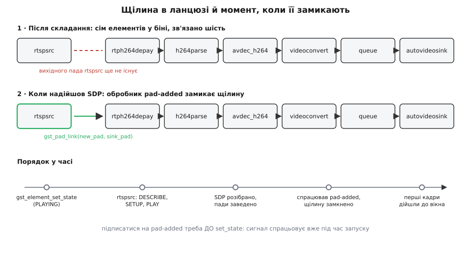
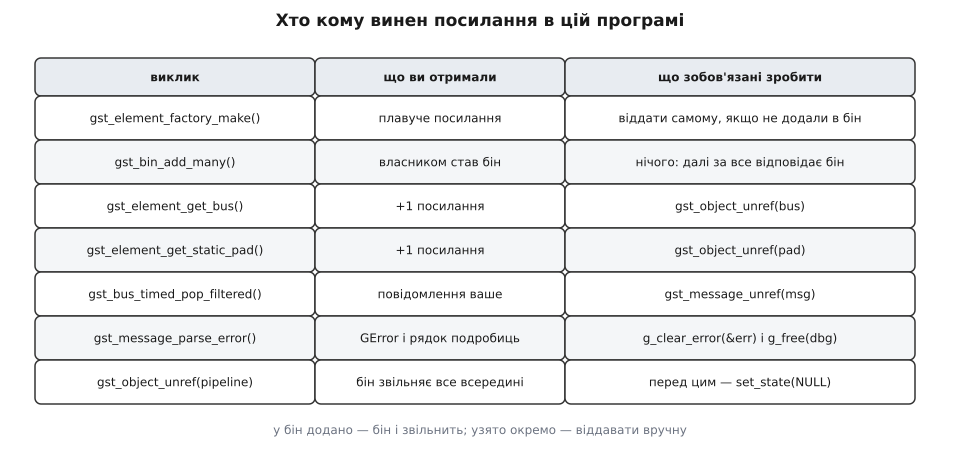

# ⚙️ Той самий ланцюг руками: перший конвеєр на C

Один рядок `gst-launch-1.0` показує камеру на екрані за секунду — і саме тому з нього легко зробити хибний висновок, ніби програма буде такою самою, тільки в дужках. Не буде. Той однорядковий запуск робить за вас чотири кроки складання, а ще обходить одну річ, яка в ці чотири кроки не вкладається: **елемент, до якого нема чого приєднувати, бо його вихідного пада на момент складання ще не існує**. Зберімо ту саму камеру програмою й подивімося, де саме однорядковий запуск був до нас добрий.

Ланцюг лишається той самий: `rtspsrc → rtph264depay → h264parse → avdec_h264 → videoconvert → queue → autovideosink`.

## Задача: чого не вміє рядок

Рядок робить рівно одну річ — доводить, що ланцюг узагалі складається й камера жива. Далі починається те, заради чого пишуть код.

Камера відпадає. Мережа проковтнула пакети, живлення моргнуло, оператор висмикнув кабель — і конвеєр стає з помилкою. Рядок у цей момент друкує повідомлення й завершується; програмі треба **дізнатися про подію й вирішити**, що з нею робити: перепідключитися, показати заглушку, записати в журнал, розбудити оператора. Щоб дізнатися — треба читати шину.

Далі: камера може віддавати не лише відео. Якщо в потоці є ще й звук, `rtspsrc` заведе два пади замість одного, і програма мусить сама розібрати, котрий із них їй потрібен. Рядок цього не вміє взагалі — там про це домовляється маленька мова опису, а в коді немає нікого, хто зробив би вибір за вас.

І нарешті погашення. Рядок гасить конвеєр за вас; програма, яка забула це зробити, лишає працювати нитки обробки й падає в найцікавіший момент — на виході з `main`.

Тобто задача звучить так: **скласти той самий ланцюг, замкнути його тоді, коли з'явиться потрібний пад, слухати шину й коректно погасити все на виході.** Півтори сотні рядків проти одного — і зараз стане видно, за що саме платимо.

## Ідея: чотири кроки й один виняток

Складання будь-якого конвеєра в коді — це чотири кроки, завжди в цьому порядку.

**Створити** елементи за назвою. Не конструктором: `gst_element_factory_make("avdec_h264", NULL)` шукає фабрику в реєстрі й повертає готовий об'єкт. Назви немає в реєстрі — повернеться `NULL`, і це не помилка програми, а відсутній плагін на машині.

**Додати** їх у бін. Це не формальність: зв'язати можна лише елементи **зі спільним батьком**, бо з'єднання падів веде облік у межах одного біна. Спроба зв'язати два елементи, які ще нікуди не додано, дає попередження про «елементи без спільного предка» й `FALSE` — класична перша помилка, коли кроки міняють місцями.

**Зв'язати** сусідів. `gst_element_link_many()` іде парами й для кожної пари шукає сумісні пади. Зверніть увагу: на цьому кроці ніякої домовленості про формат ще немає — є лише перевірка, що пади в принципі можуть про щось домовитися. Справжнє [узгодження caps](topic:sys-media/caps-negotiation) станеться під час запуску, і саме тому зв'язування може пройти, а конвеєр — стати з `not-negotiated`.

**Запустити**: перевести конвеєр у `PLAYING`.

А тепер виняток, заради якого все й затівалося. `rtspsrc` на момент складання **не має жодного вихідного пада**. І не може мати: скільки в потоці доріжок, які там кодеки й яка роздільність — усе це написано в SDP-описі, який камера віддасть у відповідь на запит `DESCRIBE`, тобто вже після того, як конвеєр піде в роботу. Пади там з'являться згодом, по одному на доріжку.

Отже, ланцюг складається **зі щілиною**. Шість ланок зв'язано намертво, сьома стоїть окремо, а замкнути її можна лише тоді, коли `rtspsrc` скаже, що завів пад. Каже він це сигналом `pad-added`, і підписатися на сигнал треба **до** запуску: спрацює він уже під час переходу в `PLAYING`.



*Щілина в ланцюзі — не недогляд, а прямий наслідок того, що склад потоку з'ясовується по мережі вже під час роботи.*

> 🔧 **Навіщо це.** Та сама схема — «зв'язати статичну частину, решту замкнути з обробника» — працює скрізь, де вміст з'ясовується під час роботи: `uridecodebin` і будь-який демультиплексор заводять пади так само. Хто раз розібрався з нею на `rtspsrc`, той більше не питає, чому «файл MP4 не грає, хоча всі елементи на місці».

## Робочий код

Мова тут не обирається: увесь GStreamer — це C-бібліотека поверх [об'єктної системи GObject](topic:sys-media/gobject-basics), звідки й беруться властивості (`g_object_set`), сигнали (`g_signal_connect`) і правила володіння об'єктами. Прив'язки до інших мов повторюють ці самі виклики; побачити модель без завіси найпростіше в оригіналі.

```c
/* first-pipeline.c — той самий ланцюг, зібраний руками.
 *
 *   gcc first-pipeline.c -o first-pipeline \
 *       $(pkg-config --cflags --libs gstreamer-1.0)
 *   ./first-pipeline rtsp://192.168.1.90/stream
 */
#include <gst/gst.h>

enum { SRC, DEPAY, PARSE, DEC, CONV, QUEUE, SINK, N_EL };

static const char *FACTORY[N_EL] = {
  "rtspsrc", "rtph264depay", "h264parse", "avdec_h264",
  "videoconvert", "queue", "autovideosink"
};

typedef struct {
  GstElement *pipeline;
  GstElement *e[N_EL];
} Chain;

/* ── Замикання щілини ────────────────────────────────────────────────────
 * Виклик приходить із нитки rtspsrc — тієї, що розбирає відповідь камери.
 * Блокуватися тут надовго не можна: доки ми не повернемось, потік стоїть.  */
static void
on_pad_added (GstElement *src, GstPad *new_pad, gpointer user_data)
{
  Chain *c = user_data;
  GstPad *sink_pad;
  GstCaps *caps;
  const gchar *media = NULL, *encoding = NULL;

  sink_pad = gst_element_get_static_pad (c->e[DEPAY], "sink");   /* +1 */

  caps = gst_pad_get_current_caps (new_pad);
  if (caps == NULL)                       /* пад ще без узгодженого формату */
    caps = gst_pad_query_caps (new_pad, NULL);

  if (gst_caps_get_size (caps) > 0) {
    const GstStructure *st = gst_caps_get_structure (caps, 0);
    media    = gst_structure_get_string (st, "media");
    encoding = gst_structure_get_string (st, "encoding-name");
  }

  /* Імена падів різняться між версіями, вміст — ні: дивимося на caps.
     Для звукової доріжки тут буде media=audio — її ми не чіпаємо.        */
  if (g_strcmp0 (media, "video") != 0 || g_strcmp0 (encoding, "H264") != 0) {
    g_print ("пропускаємо потік %s/%s\n",
             media ? media : "?", encoding ? encoding : "?");
  } else if (gst_pad_is_linked (sink_pad)) {
    g_print ("відеогілку вже під'єднано, другу не чіпаємо\n");
  } else if (GST_PAD_LINK_FAILED (gst_pad_link (new_pad, sink_pad))) {
    g_printerr ("пад %s не став на вхід депейлоадера\n",
                GST_PAD_NAME (new_pad));
  } else {
    g_print ("відеогілку замкнено на паді %s\n", GST_PAD_NAME (new_pad));
  }

  gst_caps_unref (caps);              /* обидві гілки вище дали нам +1 */
  gst_object_unref (sink_pad);        /* віддаємо те, що взяли */
}

/* ── Складання ───────────────────────────────────────────────────────── */
static gboolean
build_chain (Chain *c, const char *uri)
{
  int i;

  c->pipeline = gst_pipeline_new ("cam");

  for (i = 0; i < N_EL; i++) {
    c->e[i] = gst_element_factory_make (FACTORY[i], NULL);
    if (c->e[i] == NULL) {
      g_printerr ("немає елемента «%s»: не встановлено плагін, що його дає\n",
                  FACTORY[i]);
      while (i-- > 0)         /* створене досі ще нічиє — віддати вручну */
        gst_object_unref (c->e[i]);
      return FALSE;
    }
  }

  g_object_set (c->e[SRC], "location", uri, "latency", (guint) 200, NULL);
  g_object_set (c->e[SINK], "sync", TRUE, NULL);   /* показувати за годинником */

  /* Спершу в бін: зв'язувати можна лише елементи зі спільним батьком.
     Бін забирає плавуче посилання — далі за їхнє життя відповідає він. */
  gst_bin_add_many (GST_BIN (c->pipeline),
                    c->e[SRC], c->e[DEPAY], c->e[PARSE], c->e[DEC],
                    c->e[CONV], c->e[QUEUE], c->e[SINK], NULL);

  /* Статична частина: від депейлоадера до вікна. rtspsrc сюди не входить. */
  if (!gst_element_link_many (c->e[DEPAY], c->e[PARSE], c->e[DEC],
                              c->e[CONV], c->e[QUEUE], c->e[SINK], NULL)) {
    g_printerr ("статичну частину ланцюга не вдалося зв'язати\n");
    return FALSE;
  }

  /* Підписка ДО запуску: пад з'явиться вже під час переходу в PLAYING. */
  g_signal_connect (c->e[SRC], "pad-added", G_CALLBACK (on_pad_added), c);
  return TRUE;
}

/* ── Запуск, шина, погашення ─────────────────────────────────────────── */
int
main (int argc, char *argv[])
{
  Chain c = { 0 };
  GstBus *bus = NULL;
  GstStateChangeReturn ret;
  gboolean quit = FALSE;
  int rc = 0;

  gst_init (&argc, &argv);          /* забирає свої аргументи з argv */
  if (argc < 2) {
    g_printerr ("вжиток: %s rtsp://…\n", argv[0]);
    return 1;
  }

  if (!build_chain (&c, argv[1])) { rc = 1; goto shutdown; }

  bus = gst_element_get_bus (c.pipeline);          /* +1 */

  ret = gst_element_set_state (c.pipeline, GST_STATE_PLAYING);
  if (ret == GST_STATE_CHANGE_FAILURE) {
    g_printerr ("конвеєр не рушив: не склалася вже перша сходинка\n");
    rc = 1; goto shutdown;
  }
  /* GST_STATE_CHANGE_ASYNC тут — норма: відповідь прийде в шину.
     Для живого джерела на сходинці PAUSED буває NO_PREROLL.        */

  while (!quit) {
    GstMessage *msg = gst_bus_timed_pop_filtered (
        bus, GST_CLOCK_TIME_NONE,
        GST_MESSAGE_ERROR | GST_MESSAGE_EOS | GST_MESSAGE_STATE_CHANGED);
    if (msg == NULL)
      continue;

    switch (GST_MESSAGE_TYPE (msg)) {
      case GST_MESSAGE_ERROR: {
        GError *err = NULL;
        gchar  *dbg = NULL;
        gst_message_parse_error (msg, &err, &dbg);
        g_printerr ("помилка від %s: %s\n",
                    GST_OBJECT_NAME (GST_MESSAGE_SRC (msg)), err->message);
        if (dbg)
          g_printerr ("подробиці: %s\n", dbg);
        g_clear_error (&err);
        g_free (dbg);
        rc = 1; quit = TRUE;
        break;
      }
      case GST_MESSAGE_EOS:
        g_print ("потік скінчився\n");
        quit = TRUE;
        break;
      case GST_MESSAGE_STATE_CHANGED:
        /* Стан міняють усі елементи; нас цікавить лише сам конвеєр. */
        if (GST_MESSAGE_SRC (msg) == GST_OBJECT (c.pipeline)) {
          GstState from, to;
          gst_message_parse_state_changed (msg, &from, &to, NULL);
          g_print ("конвеєр: %s → %s\n",
                   gst_element_state_get_name (from),
                   gst_element_state_get_name (to));
        }
        break;
      default:
        break;
    }
    gst_message_unref (msg);        /* повідомлення теж наше */
  }

shutdown:
  if (c.pipeline) {
    gst_element_set_state (c.pipeline, GST_STATE_NULL);  /* спершу погасити */
    gst_object_unref (c.pipeline);                       /* потім віддати */
  }
  if (bus)
    gst_object_unref (bus);
  return rc;
}
```

Збірка й запуск:

```sh
gcc first-pipeline.c -o first-pipeline $(pkg-config --cflags --libs gstreamer-1.0)
./first-pipeline rtsp://192.168.1.90/stream
```

Кілька секунд на збірку — і на екрані той самий кадр, що й від однорядкового запуску. Уся різниця в тому, що ці півтори сотні рядків знають, коли камера відпала.

Про цикл шини варто сказати окремо. `gst_bus_timed_pop_filtered()` блокує нитку до наступного повідомлення — це найпростіший спосіб, і для програми без вікна він цілком робочий. У застосунку з інтерфейсом так робити не можна: там уже крутиться свій [цикл подій](topic:sf-tasks/event-loop) — цикл, що без упину забирає події з черги й роздає їх обробникам, — і другого блокувального циклу поруч не буває. Тоді замість вибирання руками ставлять сторожа: `gst_bus_add_watch(bus, on_bus_message, &c)` вішає шину на головний цикл GLib, і повідомлення приходять зворотним викликом уже в нитці застосунку. Правило залишається те саме: **шину треба читати**, і читати саме з тієї нитки, з якої дозволено чіпати вікно. Що ще ходить шиною, крім помилок і кінця потоку, — у темі [шина повідомлень](topic:sys-media/bus-and-messages).

## Чотири пастки

Кожна з них ловить не новачка, а неуважного: усі чотири дають працездатний на вигляд код.

### Ланцюг, що не зв'язався

Найтихіша з бід. `gst_element_link_many()` повертає `gboolean`, і це значення дуже часто не перевіряють. Тоді програма спокійно доходить до `set_state`, конвеєр іде в `PLAYING`, а на екрані порожньо.

Причин у розриву дві, і обидві механічні. Перша — порядок кроків: зв'язати елементи, яких ще не додано в бін, неможливо, бо з'єднання шукає спільного батька. Друга — несумісні пади: якщо між `avdec_h264` і `autovideosink` забути `videoconvert`, шаблони падів можуть не перетнутися вже на цьому кроці.

Але найпідступніший розрив — той, що в нашій програмі виникає **законно**: щілина під `rtspsrc`. Якщо камера віддає H.265, а не H.264, перевірка `encoding-name` в обробнику не пройде, пад так і залишиться ні до чого не приєднаним — і жодної помилки не буде. Незв'язаний пад повертає своєму елементові `GST_FLOW_NOT_LINKED`, той тихо зупиняє задачу цієї доріжки, а конвеєр далі стоїть у `PLAYING` із чорним вікном. Тому в обробнику стоїть друк «пропускаємо потік …»: без цього рядка діагностувати нема чого.

Коли й це не допомагає, конвеєр просять намалювати себе. Достатньо запустити програму зі змінною середовища `GST_DEBUG_DUMP_DOT_DIR=.` і вставити один рядок після переходу в `PLAYING`:

```c
GST_DEBUG_BIN_TO_DOT_FILE (GST_BIN (c.pipeline),
                           GST_DEBUG_GRAPH_SHOW_ALL, "cam");
```

Поруч ляже `.dot`-файл, у якому видно кожен елемент, кожен пад і кожну ланку — а незв'язаний пад видно як пад, від якого не йде жодної стрілки. Решта прийомів такої розвідки — у темі [діагностика конвеєра](topic:sys-media/pipeline-debugging).

### Забутий `queue` після `tee`

Тепер додамо до програми другу гілку: те саме відео ще й у файл. Роздвоює потік елемент `tee`, і напрошується найкоротший запис:

```c
/* ✗ ТАК НЕ ПРАЦЮЄ: конвеєр застрягне на переході в PLAYING.
   tee, conv, videosink, enc, filesink створено тим самим
   gst_element_factory_make і вже додано в той самий бін.      */
gst_element_link_many (c.e[DEC], tee, NULL);
gst_element_link_many (tee, conv,  videosink, NULL);   /* гілка на екран */
gst_element_link_many (tee, enc,   filesink,  NULL);   /* гілка у файл   */
```

Виглядає бездоганно, зв'язується без помилок — і конвеєр застрягає, не дійшовши до `PLAYING`. Механіка ось яка.

Стік, отримавши перший буфер у стані `PAUSED`, **не повертається** з функції обробки: він тримає цей кадр як передпоказ (preroll) і чекає команди на `PLAYING`. Конвеєр же переходить у `PLAYING` лише тоді, коли передпоказ зробили **всі** стоки. А `tee` штовхає буфер у гілки по черзі, однією ниткою: спершу в першу, і поки та не поверне керування — у другу нічого не піде. Отже, перший стік чекає на `PLAYING`, `PLAYING` чекає на другий стік, другий стік чекає на буфер, буфер чекає на перший стік. Замкнене коло, у якому кожен чекає попереднього, — звичайний [дедлок](topic:sf-tasks/deadlock), тільки складений не з м'ютексів, а з топології.

Ліки — розірвати спільну нитку, тобто поставити `queue` на кожній гілці одразу після `tee`:

```c
/* ✓ Кожна гілка починається з черги — і має власну нитку */
gst_element_link_many (c.e[DEC], tee, NULL);
gst_element_link_many (tee, q_screen, conv, videosink, NULL);
gst_element_link_many (tee, q_file,   enc,  filesink,  NULL);
```

Тут `gst_element_link_many()` робить іще одну річ мовчки: у `tee` немає готових вихідних падів, вони **запитувані** — створюються на вимогу, по одному на гілку. Зв'язування помічає це й запитує пад самотужки. Коли гілку треба буде згодом прибрати, самого `gst_object_unref` на її пад буде мало: запитуваний пад ще й повертають елементові через `gst_element_release_request_pad()`, інакше `tee` вважатиме гілку живою. Звідки взагалі беруться такі пади й чим вони відрізняються від постійних — у темі [пади і з'єднання](topic:sys-media/pads-and-linking).

### Проігнорований код повернення зміни стану

`gst_element_set_state()` повертає не `gboolean`, і плутають тут не тип, а сенс. Значень чотири, і жодне з них не означає «уже працює».

```
GST_STATE_CHANGE_SUCCESS      перехід завершено просто зараз
GST_STATE_CHANGE_ASYNC        перехід почато, відповідь прийде згодом
GST_STATE_CHANGE_NO_PREROLL   вийшло, але передпоказу не буде: джерело живе
GST_STATE_CHANGE_FAILURE      не вийшло
```

`ASYNC` — це норма, а не тривога: конвеєр не може завершити перехід негайно, бо мусить дочекатися передпоказу від стоків, а стоки — першого кадру, а перший кадр — відповіді камери. `NO_PREROLL` — теж норма, і саме його дає живе джерело на сходинці `PAUSED`: у камери нема чого «підготувати наперед», кадри просто йдуть у реальному часі.

Пастка глибша за перевірку значення. Навіть `SUCCESS` не обіцяє, що все гаразд, бо переважна більшість бід приходить **пізніше й іншою дорогою** — повідомленням у шину. Камера недоступна, логін не той, кодека нема в системі, пади не домовилися про формат: усе це станеться після того, як `set_state` уже повернув керування. Тому перевірка коду повернення й читання шини — не альтернативи, а дві половини одного обов'язку. Якщо потрібне синхронне очікування (скажімо, у тесті), його дає окремий виклик:

```c
GstState st, pending;
ret = gst_element_get_state (c.pipeline, &st, &pending,
                             5 * GST_SECOND);      /* GST_SECOND = 10⁹ нс */
if (ret != GST_STATE_CHANGE_SUCCESS)
  g_printerr ("за 5 с конвеєр не дійшов далі за %s\n",
              gst_element_state_get_name (st));
```

Чому взагалі сходинок чотири, чому переходи розсилають знизу вгору й чому `PAUSED` існує окремо від `PLAYING` — у темі [стани конвеєра](topic:sys-media/states-lifecycle).

### Витік посилань

Тут ловить не складність, а те, що правил насправді два, а виглядають вони як одне.

Об'єктами GStreamer володіють через [лічильник посилань](topic:sf-lang/reference-counting), але новостворений елемент має посилання особливе — **плавуче**: об'єкт живий, а власника в нього ще немає. `gst_bin_add()` це посилання поглинає й стає власником. Звідси перше правило: **що додали в бін — те бін і звільнить**, і руками такий елемент чіпати вже не можна (зайвий `gst_object_unref` на нього — не витік, а падіння). Дзеркальне: елемент, створений і **не** доданий у бін, не звільнить ніхто — саме тому в `build_chain` на невдалій гілці стоїть цикл `while (i-- > 0) gst_object_unref (...)`.

Друге правило стосується всього, що бібліотека **повертає з функції**: пад, шина, caps, повідомлення. Кожна така функція дає вам своє посилання, і кожне треба віддати.



*Правило одне на два випадки: у бін додано — бін і звільнить; узято окремо — віддавати вручну.*

Течуть найчастіше два місця, і обидва — не разово, а по краплині. Перше: `sink_pad` в обробнику `pad-added`. Обробник спрацьовує на кожен пад камери й на кожне перепідключення, тож пропущений `gst_object_unref (sink_pad)` капає рівно й тихо. Друге: повідомлення в циклі шини. `GST_MESSAGE_STATE_CHANGED` приходить на кожен елемент за кожного переходу, і на живому конвеєрі це тисячі повідомлень за годину. Жодне з цих місць не дає стрибка пам'яті, який видно на тесті, — тому такий витік і знаходять не на тесті, а на третю добу роботи.

Окремо — **порядок погашення**. Спокуса написати просто `gst_object_unref (pipeline)` велика, і код навіть відпрацює. Але в конвеєрі, який ще в `PLAYING`, крутяться задачі — нитки, що прямо зараз стоять усередині функцій обробки й тримають вказівники на ці самі об'єкти. `gst_element_set_state (pipeline, GST_STATE_NULL)` існує зокрема для того, щоб їх зупинити й дочекатися: після повернення з нього жодна нитка обробки вже не працює. Тільки після цього віддавати посилання безпечно.

## Що це коштувало

```
рядок gst-launch:                  1 рядок
програма:                        179 рядків лістингу,
                                 155 непорожніх, із них
  шапка, назви фабрик, структура    18
  обробник pad-added                33
  складання ланцюга                 33
  запуск, цикл шини, погашення      71

що куплено цією різницею:
  реакція на помилку          так   (читання шини)
  вибір потрібної доріжки     так   (caps в обробнику)
  коректне погашення          так   (NULL перед unref)
  доступ до кадрів            ні
  перепідключення             ні
```

Останні два рядки — це чесна межа цієї програми. Перепідключення після падіння камери тут довелося б будувати руками: побачив помилку в шині, перевів у `NULL`, зачекав, підняв знову — і зробити це не з обробника шини, а з окремої нитки, бо гасити конвеєр зсередини його ж зворотного виклику не можна. А щоб дістати кадр у свій код — скажімо, віддати його в обробку зору, — `autovideosink` треба замінити на `appsink`, і це вже інша розмова: [appsink і appsrc](topic:sys-media/appsink-appsrc).

Але головне куплено вже тут. Однорядковий запуск відповідає на питання «чи працює». Ці півтори сотні рядків відповідають на питання «що робити, коли перестане» — а в системі, яка має жити довше за одну демонстрацію, значення має саме друге.
