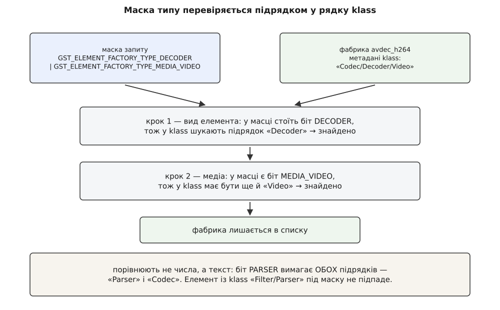

# 📋 Реєстр і фабрики: довідка інтерфейсу

Тут зібрано точні підписи, константи й формати, якими програма розмовляє з реєстром GStreamer: перелічити фабрики, відсіяти їх за видом і за caps, прочитати чи переставити ранг, дізнатися, з якого файла взято елемент, — і те саме ззовні, змінними середовища й ключами `gst-inspect-1.0`. Усе звірено з чинною гілкою GStreamer 1.x за заголовками `gst/gstregistry.h`, `gst/gstelementfactory.h`, `gst/gstpluginfeature.h`, `gst/gstplugin.h`; де можливість з'явилася пізніше за 1.0, стоїть позначка «з 1.х».

Увесь інтерфейс живе в одному заголовку й одній бібліотеці:

```c
#include <gst/gst.h>
```

```
gcc app.c -o app $(pkg-config --cflags --libs gstreamer-1.0)
```

Жодна з наведених функцій не працює до `gst_init (&argc, &argv)`: реєстру до того просто немає.

## Володіння: правило, на якому течуть програми

Кожен підпис нижче має позначку `transfer none` або `transfer full`, і це не примха документації, а різниця між робочою програмою й тихою течею пам'яті. GStreamer стоїть на об'єктах GLib із лічильником посилань: функція, що повертає вказівник, або дає вам **зайве посилання** — тоді знімати його вам, — або лише показує чуже, яке живе своїм життям.

> [Підрахунок посилань](root:sf-lang/reference-counting) — лічильник живих власників усередині самого об'єкта: хто бере об'єкт собі, той збільшує лічильник, хто відпускає — зменшує, а на нулі об'єкт звільняється. Звідси й береться поділ на «передали володіння» й «дали подивитися».

| позначка | що робити з поверненим |
|---|---|
| `transfer none` | нічого; вказівник дійсний, поки живий той, хто його дав |
| `transfer full` | ваше — зняти посилання `gst_object_unref()` |
| `GList *` фіч, `transfer full` | `gst_plugin_feature_list_free (list)` |
| `GList *` плагінів, `transfer full` | `gst_plugin_list_free (list)` |
| `transfer floating` | плаваюче посилання: `gst_bin_add()` забирає його собі; якщо елемент нікуди не додали — `gst_object_unref()` |

Найчастіша помилка тут одна: `g_list_free()` замість `gst_plugin_feature_list_free()`. Список звільниться, а посилання на кожну фічу в ньому — ні, і теча вийде рівно на розмір переліку фабрик, який ви щойно запитали. Із рядками простіше: усе, що повертають як `const gchar *`, належить реєстрові й не звільняється ніколи.

## Реєстр

Реєстр у процесі один, він з'являється під час `gst_init` і живе до кінця. Тому окремої функції створення немає — є функція «дайте той самий».

```c
/* transfer none — сталий об'єкт процесу, unref не потрібен */
GstRegistry *      gst_registry_get                     (void);

/* transfer full, nullable — фіча заданого виду за іменем */
GstPluginFeature * gst_registry_find_feature            (GstRegistry *registry,
                                                         const gchar *name,
                                                         GType type);

/* transfer full, nullable — фіча за іменем, вид байдужий */
GstPluginFeature * gst_registry_lookup_feature          (GstRegistry *registry,
                                                         const char *name);

/* transfer full — усі фічі заданого виду */
GList *            gst_registry_get_feature_list        (GstRegistry *registry,
                                                         GType type);

/* transfer full — усі фічі, які дав один плагін */
GList *            gst_registry_get_feature_list_by_plugin
                                                        (GstRegistry *registry,
                                                         const gchar *name);

/* transfer full — усі відомі плагіни */
GList *            gst_registry_get_plugin_list         (GstRegistry *registry);

/* transfer full, nullable — плагін за коротким іменем */
GstPlugin *        gst_registry_find_plugin             (GstRegistry *registry,
                                                         const gchar *name);

/* transfer full — власний відбір: filter кличуть на кожну фічу;
   first=TRUE зупиняє пошук на першій, що підійшла */
GList *            gst_registry_feature_filter          (GstRegistry *registry,
                                                         GstPluginFeatureFilter filter,
                                                         gboolean first,
                                                         gpointer user_data);

/* чи є така фіча й чи не старіша вона за задану версію */
gboolean           gst_registry_check_feature_version   (GstRegistry *registry,
                                                         const gchar *feature_name,
                                                         guint min_major,
                                                         guint min_minor,
                                                         guint min_micro);

/* лічильник змін переліку фіч */
guint32            gst_registry_get_feature_list_cookie (GstRegistry *registry);

/* просканувати теку негайно; TRUE, якщо реєстр змінився */
gboolean           gst_registry_scan_path               (GstRegistry *registry,
                                                         const gchar *path);
```

Аргумент `type` — це `GType`, числовий ідентифікатор класу в об'єктній системі GLib. Виду фіч рівно стільки, скільки різновидів записів уміє створювати `plugin_init`:

| `GType` | що це |
|---|---|
| `GST_TYPE_ELEMENT_FACTORY` | фабрика елемента — те, з чого складають конвеєр |
| `GST_TYPE_TYPE_FIND_FACTORY` | розпізнавач типу за першими байтами потоку |
| `GST_TYPE_DEVICE_PROVIDER_FACTORY` | постачальник пристроїв: камери, звукові карти |
| `GST_TYPE_TRACER_FACTORY` | трасувальник для вимірювань |
| `GST_TYPE_DYNAMIC_TYPE_FACTORY` | тип, що реєструється на вимогу, коли його згадали в caps |

Окремої згадки вартий `gst_registry_get_feature_list_cookie`. Перелік фабрик — не константа: ранги переставляють на ходу, плагіни довантажують, реєстр перескановують. Число-cookie змінюється щоразу, коли перелік фіч став іншим, тож той, хто кешує в себе відібраний список кандидатів (а саме так і роблять елементи автопідбору), тримає поруч запам'ятоване число й перебудовує список лише тоді, коли воно розійшлося з поточним. Це найдешевша перевірка чинності з можливих: одне порівняння цілих замість повторного обходу реєстру.

## Фабрика елемента: знайти, розглянути, створити

Ці дві дії варто тримати нарізно. Знайти й розглянути фабрику — дешево й не відкриває жодного файла. Створити елемент — дорого: саме тут плагін нарешті завантажують у процес.

```c
/* transfer full, nullable — фабрика за іменем */
GstElementFactory *gst_element_factory_find   (const gchar *name);

/* transfer floating, nullable — знайти фабрику й одразу створити елемент;
   name=NULL → ім'я породжується само й буде неповторним у процесі */
GstElement *gst_element_factory_make          (const gchar *factoryname,
                                               const gchar *name);

/* те саме плюс властивості одразу, перелік завершує NULL (з 1.20) */
GstElement *gst_element_factory_make_full     (const gchar *factoryname,
                                               const gchar *first, ...);

/* те саме масивами, зручно з мов-обгорток (з 1.20) */
GstElement *gst_element_factory_make_with_properties
                                              (const gchar *factoryname,
                                               guint n,
                                               const gchar **names,
                                               const GValue *values);

/* створити з уже знайденої фабрики */
GstElement *gst_element_factory_create        (GstElementFactory *factory,
                                               const gchar *name);
GstElement *gst_element_factory_create_with_properties
                                              (GstElementFactory *factory,
                                               guint n,
                                               const gchar **names,
                                               const GValue *values);

/* 0, поки плагін не завантажено */
GType        gst_element_factory_get_element_type (GstElementFactory *factory);

/* transfer none — метадані з реєстру, файл не відкривається */
const gchar *gst_element_factory_get_metadata (GstElementFactory *factory,
                                               const gchar *key);
gchar **     gst_element_factory_get_metadata_keys (GstElementFactory *factory);

/* transfer none — шаблони падів разом із їхніми caps */
const GList *gst_element_factory_get_static_pad_templates (GstElementFactory *factory);
guint        gst_element_factory_get_num_pad_templates    (GstElementFactory *factory);

/* швидка перевірка сумісності за шаблонами, без створення елемента */
gboolean gst_element_factory_can_sink_all_caps (GstElementFactory *f, const GstCaps *caps);
gboolean gst_element_factory_can_sink_any_caps (GstElementFactory *f, const GstCaps *caps);
gboolean gst_element_factory_can_src_all_caps  (GstElementFactory *f, const GstCaps *caps);
gboolean gst_element_factory_can_src_any_caps  (GstElementFactory *f, const GstCaps *caps);

/* URI-схеми й інтерфейси, оголошені фабрикою */
GstURIType            gst_element_factory_get_uri_type      (GstElementFactory *factory);
const gchar * const * gst_element_factory_get_uri_protocols (GstElementFactory *factory);
gboolean              gst_element_factory_has_interface     (GstElementFactory *factory,
                                                             const gchar *interfacename);
```

Ключі метаданих — рядкові сталі, і саме вони заповнюються макросом `gst_element_class_set_static_metadata`:

| стала | рядок | що в ній |
|---|---|---|
| `GST_ELEMENT_METADATA_LONGNAME` | `long-name` | людська назва: «H.264 parser» |
| `GST_ELEMENT_METADATA_KLASS` | `klass` | категорія через `/`: `Codec/Parser/Converter/Video` |
| `GST_ELEMENT_METADATA_DESCRIPTION` | `description` | речення про призначення |
| `GST_ELEMENT_METADATA_AUTHOR` | `author` | автор і пошта |
| `GST_ELEMENT_METADATA_DOC_URI` | `doc-uri` | посилання на документацію, здебільшого відсутнє |
| `GST_ELEMENT_METADATA_ICON_NAME` | `icon-name` | значок для довідників пристроїв |

Пара `find` + `create` рівносильна одному `make`, але має сенс тоді, коли фабрику спершу розглядають і лише потім вирішують, створювати чи ні, — і коли з однієї фабрики роблять кілька елементів поспіль, не шукаючи її щоразу.

## Добір за видом і за caps

Ось той запит, заради якого реєстр і збирали: «дай усі декодери відео, ранг не нижчий за такий, і викинь ті, що не приймають цих caps».

```c
/* transfer full — список фабрик, УЖЕ впорядкований за спаданням рангу */
GList *gst_element_factory_list_get_elements (GstElementFactoryListType type,
                                              GstRank minrank);

/* transfer full — новий список; вхідний НЕ споживається і НЕ звільняється */
GList *gst_element_factory_list_filter       (GList *list,
                                              const GstCaps *caps,
                                              GstPadDirection direction,
                                              gboolean subsetonly);

/* та сама перевірка виду для однієї фабрики */
gboolean gst_element_factory_list_is_type    (GstElementFactory *factory,
                                              GstElementFactoryListType type);
```

Тип фабрики — не перелічуваний тип, а набір бітів: `typedef guint64 GstElementFactoryListType`. Молодші біти кажуть, **що елемент робить**, старші — **над чим**.

| стала | біт | підрядок, який шукають у `klass` |
|---|---|---|
| `GST_ELEMENT_FACTORY_TYPE_DECODER` | 0 | `Decoder` |
| `GST_ELEMENT_FACTORY_TYPE_ENCODER` | 1 | `Encoder` |
| `GST_ELEMENT_FACTORY_TYPE_SINK` | 2 | `Sink` |
| `GST_ELEMENT_FACTORY_TYPE_SRC` | 3 | `Source` |
| `GST_ELEMENT_FACTORY_TYPE_MUXER` | 4 | `Muxer` |
| `GST_ELEMENT_FACTORY_TYPE_DEMUXER` | 5 | `Demux` |
| `GST_ELEMENT_FACTORY_TYPE_PARSER` | 6 | `Parser` **і** `Codec` |
| `GST_ELEMENT_FACTORY_TYPE_PAYLOADER` | 7 | `Payloader` |
| `GST_ELEMENT_FACTORY_TYPE_DEPAYLOADER` | 8 | `Depayloader` |
| `GST_ELEMENT_FACTORY_TYPE_FORMATTER` | 9 | `Formatter` |
| `GST_ELEMENT_FACTORY_TYPE_DECRYPTOR` | 10 | `Decryptor` |
| `GST_ELEMENT_FACTORY_TYPE_ENCRYPTOR` | 11 | `Encryptor` |
| `GST_ELEMENT_FACTORY_TYPE_HARDWARE` | 12 | `Hardware` |
| `GST_ELEMENT_FACTORY_TYPE_TIMESTAMPER` (з 1.24) | 13 | `Timestamper` **і** `Codec` |
| `GST_ELEMENT_FACTORY_TYPE_MEDIA_VIDEO` | 49 | `Video` |
| `GST_ELEMENT_FACTORY_TYPE_MEDIA_AUDIO` | 50 | `Audio` |
| `GST_ELEMENT_FACTORY_TYPE_MEDIA_IMAGE` | 51 | `Image` |
| `GST_ELEMENT_FACTORY_TYPE_MEDIA_SUBTITLE` | 52 | `Subtitle` |
| `GST_ELEMENT_FACTORY_TYPE_MEDIA_METADATA` | 53 | `Metadata` |

Правий стовпчик — найважливіше в цій таблиці й водночас те, чого не видно з підписів. Порівнюють **не числа з числами**: маска лише каже, які підрядки шукати в рядку `klass`, а сам відбір робить пошук підрядка в тексті. Тому біт `PARSER` вимагає, щоб у `klass` були обидва слова — `Parser` і `Codec`: без цієї пари під нього підпадали б усі розбирачі підряд, включно з тими, що не мають до кодеків стосунку.



*Два кроки з різною логікою: бітів виду досить одного збігу, а біти медіа перевіряють лише тоді, коли їх узагалі запитали.*

Складені маски позбавляють від ручного набору бітів:

```
GST_ELEMENT_FACTORY_TYPE_MAX_ELEMENTS     = 1 << 48        межа між видом і медіа
GST_ELEMENT_FACTORY_TYPE_ANY              = (1 << 49) − 1  усі біти виду
GST_ELEMENT_FACTORY_TYPE_MEDIA_ANY        = ~0 << 48       усі біти медіа

GST_ELEMENT_FACTORY_TYPE_DECODABLE        = DECODER | DEMUXER | DEPAYLOADER
                                          | PARSER | DECRYPTOR
GST_ELEMENT_FACTORY_TYPE_VIDEO_ENCODER    = ENCODER | MEDIA_VIDEO | MEDIA_IMAGE
GST_ELEMENT_FACTORY_TYPE_AUDIO_ENCODER    = ENCODER | MEDIA_AUDIO
GST_ELEMENT_FACTORY_TYPE_AUDIOVIDEO_SINKS = SINK | MEDIA_AUDIO | MEDIA_VIDEO
                                          | MEDIA_IMAGE
```

Порожній проміжок між бітом 13 і бітом 48 — це запас: нові види елементів додають угору молодшої половини, і маска `ANY` при цьому лишається чинною, бо накриває всю половину, а не перелік відомих сьогодні бітів.

Другий крок відбору — caps. Аргумент `direction` каже, який бік фабрики перевіряти: `GST_PAD_SINK` — те, що елемент **приймає**, `GST_PAD_SRC` — те, що **віддає**. Аргумент `subsetonly` вирішує, наскільки сувора перевірка:

| `subsetonly` | умова, за якої фабрика лишається |
|---|---|
| `FALSE` | caps шаблона й ваші caps мають хоч якийсь спільний переріз |
| `TRUE` | ваші caps цілком уміщаються в caps шаблона |

Різниця між ними — це різниця між «можливо, домовляться» і «точно потягне». Для автопідбору беруть `FALSE`: на цьому етапі caps потоку ще неповні, і суворий тест викинув би всіх придатних.

> [Узгодження caps](root:sys-media/caps-negotiation) — caps як машинний опис формату: назва типу плюс поля, де значення бувають не одним числом, а множиною чи проміжком. Саме тому «переріз» і «підмножина» тут різні дії, а не те саме порівняння.

> [Пади і з'єднання елементів](root:sys-media/pads-and-linking) — пад як точка входу-виходу елемента й напрямок, у якому крізь неї течуть дані; шаблон пада — опис пада, який елемент матиме, разом із caps, оголошеними наперед.

## Фіча: ім'я, ранг, порядок

Фабрика — окремий випадок фічі, і все, що стосується імені та рангу, працює однаково для всіх видів записів у реєстрі.

```c
/* насправді макрос: gst_plugin_feature_get_name(f) → GST_OBJECT_NAME(f) */
const gchar *gst_plugin_feature_get_name        (GstPluginFeature *feature);

guint        gst_plugin_feature_get_rank        (GstPluginFeature *feature);
void         gst_plugin_feature_set_rank        (GstPluginFeature *feature,
                                                 guint rank);

/* transfer full, nullable — плагін, який дав цю фічу */
GstPlugin *  gst_plugin_feature_get_plugin      (GstPluginFeature *feature);
/* transfer none, nullable — лише коротке ім'я плагіна (з 1.2) */
const gchar *gst_plugin_feature_get_plugin_name (GstPluginFeature *feature);

/* transfer full — завантажити плагін і повернути «повноцінну» фічу */
GstPluginFeature *gst_plugin_feature_load       (GstPluginFeature *feature);

gboolean gst_plugin_feature_check_version (GstPluginFeature *feature,
                                           guint min_major, guint min_minor,
                                           guint min_micro);

/* GCompareFunc для g_list_sort */
gint  gst_plugin_feature_rank_compare_func (gconstpointer p1, gconstpointer p2);

void   gst_plugin_feature_list_free  (GList *list);
GList *gst_plugin_feature_list_copy  (GList *list);
void   gst_plugin_feature_list_debug (GList *list);
```

Те, що `gst_plugin_feature_get_name` — макрос над `GST_OBJECT_NAME`, важить практично: виклик нічого не коштує й не бере блокування, тож у циклі по кількох сотнях фабрик його можна не берегти.

Ранг — просто ціле число з чотирма іменованими орієнтирами; проміжні значення цілком дозволені й ними активно користуються.

| стала | значення | що означає |
|---|---|---|
| `GST_RANK_NONE` | 0 | автопідбір не візьме ніколи |
| `GST_RANK_MARGINAL` | 64 | візьме, коли нема кращого |
| `GST_RANK_SECONDARY` | 128 | цілком придатний |
| `GST_RANK_PRIMARY` | 256 | брати першим |

`gst_plugin_feature_rank_compare_func` упорядковує за **спаданням** рангу: після `g_list_sort` перший у списку — найвищий. Однакові ранги розводить порівняння імен, тож порядок виходить сталим від запуску до запуску — дрібниця, без якої відтворити чужу халепу було б неможливо.

## Плагін як об'єкт: завантаження й паспорт

```c
/* transfer full — завантажити файл у процес; повертає ту саму або нову
   «завантажену» обгортку, стару після цього не вживають */
GstPlugin *gst_plugin_load         (GstPlugin *plugin);
GstPlugin *gst_plugin_load_by_name (const gchar *name);
GstPlugin *gst_plugin_load_file    (const gchar *filename, GError **error);

/* усе нижче — transfer none, беруть із дескриптора */
const gchar *gst_plugin_get_name                 (GstPlugin *plugin);
const gchar *gst_plugin_get_description          (GstPlugin *plugin);
const gchar *gst_plugin_get_filename             (GstPlugin *plugin);
const gchar *gst_plugin_get_license              (GstPlugin *plugin);
const gchar *gst_plugin_get_source               (GstPlugin *plugin);
const gchar *gst_plugin_get_package              (GstPlugin *plugin);
const gchar *gst_plugin_get_origin               (GstPlugin *plugin);
const gchar *gst_plugin_get_version              (GstPlugin *plugin);
const gchar *gst_plugin_get_release_date_string  (GstPlugin *plugin);

gboolean     gst_plugin_is_loaded                (GstPlugin *plugin);

const GstStructure *gst_plugin_get_cache_data (GstPlugin *plugin);
void                gst_plugin_set_cache_data (GstPlugin *plugin,
                                               GstStructure *cache_data);
```

Три схожі поля паспорта плутають найчастіше, а різняться вони по суті:

| функція | що повертає | приклад |
|---|---|---|
| `gst_plugin_get_source` | **набір**, із якого зібрано плагін | `gst-plugins-bad` |
| `gst_plugin_get_package` | пакунок у тому вигляді, як його постачають | `GStreamer Bad Plug-ins source release` |
| `gst_plugin_get_origin` | адреса того, хто це зібрав | `Unknown package origin` або URL проєкту |

`gst_plugin_get_filename` повертає `NULL` для плагінів, зареєстрованих статично: файла в них немає. Рядок ліцензії ядро звіряє зі своїм переліком — `LGPL`, `GPL`, `QPL`, `GPL/QPL`, `MPL`, `BSD`, `MIT/X11`, `Proprietary`, `unknown` — але невідоме значення завантаженню не заважає, лише лишає попередження в журналі.

Окремо стоїть пара `get_cache_data` / `set_cache_data`. Плагін може покласти в реєстр власні дані — наприклад, перелік того, що знайшов на машині під час першого сканування, — і на наступному старті прочитати їх звідти, не повторюючи дорогого опитування апаратури.

## Статична збірка й залежності

Коли плагіни вкомпільовують у застосунок (типова ситуація для iOS, Android і вбудованих образів), файла для сканування немає й реєстр наповнюють руками.

```c
gboolean gst_plugin_register_static (gint major_version, gint minor_version,
                                     const gchar *name,
                                     const gchar *description,
                                     GstPluginInitFunc init_func,
                                     const gchar *version,
                                     const gchar *license,
                                     const gchar *source,
                                     const gchar *package,
                                     const gchar *origin);

/* те саме, але init_func отримує ще й user_data */
gboolean gst_plugin_register_static_full (…, gpointer user_data);
```

Порядок аргументів тут дослівно повторює поля дескриптора, який у динамічному випадку заповнює `GST_PLUGIN_DEFINE`, — так і замислено: статична реєстрація підставляє те саме, тільки без файла. Для плагінів, зібраних із чужих джерел, той самий ефект дають два макроси, які треба виконати до першого звертання до елемента:

```c
GST_PLUGIN_STATIC_DECLARE (myfilter);   /* десь угорі файла */
GST_PLUGIN_STATIC_REGISTER (myfilter);  /* після gst_init */
```

Друга рідковживана, але потрібна річ — оголошення залежностей. Плагін, який сам щось шукає на диску (шрифти, набори кодеків, теки з моделями), мусить сказати про це реєстрові, інакше кеш вважатиметься чинним і після того, як шукане з'явилося чи зникло.

```c
void gst_plugin_add_dependency_simple (GstPlugin *plugin,
                                       const gchar *env_vars,
                                       const gchar *paths,
                                       const gchar *names,
                                       GstPluginDependencyFlags flags);
```

Розділювачі в трьох рядках різні, і саме на цьому спотикаються: `env_vars` і `paths` розбирають за будь-яким із `:`, `;`, `,`, а `names` — **лише за комою**. Ім'я змінної можна доповнити хвостом шляху через `/`: запис `HOME/.local/share/myplugin` означає «тека з `$HOME` плюс цей хвіст».

| прапорець | значення | що робить |
|---|---|---|
| `GST_PLUGIN_DEPENDENCY_FLAG_NONE` | 0 | без особливостей |
| `…_RECURSE` | 1 | зазирати й у підтеки |
| `…_PATHS_ARE_DEFAULT_ONLY` | 2 | вжити `paths` лише тоді, коли змінних середовища не задано |
| `…_FILE_NAME_IS_SUFFIX` | 4 | `names` — не повні імена, а закінчення (наприклад `.so`) |
| `…_FILE_NAME_IS_PREFIX` | 8 | `names` — початки імен |
| `…_PATHS_ARE_RELATIVE_TO_EXE` | 16 | невідносні шляхи відлічувати від теки застосунку |

## Мінімальний робочий виклик

Програма нижче робить те, що зазвичай доводиться робити руками під час розбирання халепи: за іменем елемента показує його паспорт і файл, із якого його візьмуть. Цікаве в ній — рядок про завантаження: усе, що надруковано вище, добуто з реєстру, і жодного файла на той момент ще не відкрито.

```c
#include <gst/gst.h>

int
main (int argc, char *argv[])
{
  gst_init (&argc, &argv);

  if (argc < 2) {
    g_printerr ("вжиток: %s <ім'я-елемента>\n", argv[0]);
    return 2;
  }

  GstRegistry *registry = gst_registry_get ();          /* transfer none */
  GstPluginFeature *feature =
      gst_registry_find_feature (registry, argv[1], GST_TYPE_ELEMENT_FACTORY);

  if (feature == NULL) {
    g_print ("%s: у реєстрі немає такої фабрики\n", argv[1]);
    return 1;
  }

  GstElementFactory *factory = GST_ELEMENT_FACTORY (feature);

  g_print ("фабрика   %s\n", gst_plugin_feature_get_name (feature));
  g_print ("ранг      %u\n", gst_plugin_feature_get_rank (feature));
  g_print ("klass     %s\n",
      gst_element_factory_get_metadata (factory, GST_ELEMENT_METADATA_KLASS));
  g_print ("назва     %s\n",
      gst_element_factory_get_metadata (factory, GST_ELEMENT_METADATA_LONGNAME));

  GstPlugin *plugin = gst_plugin_feature_get_plugin (feature);   /* transfer full */
  if (plugin != NULL) {
    g_print ("плагін    %s (набір %s, ліцензія %s)\n",
        gst_plugin_get_name (plugin), gst_plugin_get_source (plugin),
        gst_plugin_get_license (plugin));
    g_print ("файл      %s\n", gst_plugin_get_filename (plugin));
    g_print ("файл відкрито: %s\n",
        gst_plugin_is_loaded (plugin) ? "так" : "ні");
    gst_object_unref (plugin);
  }

  /* аж ось тут plugin_init нарешті виконають */
  GstElement *element = gst_element_factory_create (factory, NULL);
  g_print ("створено  %s\n", GST_OBJECT_NAME (element));
  gst_object_unref (element);

  gst_object_unref (feature);
  return 0;
}
```

**Вивід на десктопній збірці, `./app h264parse`:**

```
фабрика   h264parse
ранг      257
klass     Codec/Parser/Converter/Video
назва     H.264 parser
плагін    videoparsersbad (набір gst-plugins-bad, ліцензія LGPL)
файл      /usr/lib/x86_64-linux-gnu/gstreamer-1.0/libgstvideoparsersbad.so
файл відкрито: ні
створено  h264parse0
```

Ранг 257 тут не описка: `h264parse` реєструють як `GST_RANK_PRIMARY + 1`, тобто на одиницю вище за звичайний «брати першим», щоб він певно випереджав будь-який інший розбирач того самого потоку. Такі зсуви на одиницю-дві — звичайна практика, і саме через них ранг корисніше запитувати, ніж пригадувати.

## Змінні середовища

Усе, що описано вище, налаштовується ззовні — без перезбирання й без правок у коді. Це основний важіль на пристрої, куди вже нічого не покладеш.

| змінна | значення | що робить |
|---|---|---|
| `GST_PLUGIN_PATH`, `GST_PLUGIN_PATH_1_0` | теки через `:` (у Windows `;`) | додаткові теки з плагінами; їх обходять **перед** системними. Варіант із `_1_0` має перевагу |
| `GST_PLUGIN_SYSTEM_PATH`, `…_1_0` | теки через `:` | заміняє типові системні теки; порожній рядок вимикає системний обхід цілком |
| `GST_REGISTRY`, `GST_REGISTRY_1_0` | шлях до файла | інший файл кешу замість `$XDG_CACHE_HOME/gstreamer-1.0/registry.<арх>.bin` |
| `GST_REGISTRY_UPDATE` | `no` | не оновлювати реєстр: беруть кеш як є |
| `GST_REGISTRY_FORK` | `no` | не породжувати помічника, скановувати в самому процесі |
| `GST_REGISTRY_REUSE_PLUGIN_SCANNER` | `no` | не перевикористовувати один процес-сканер на всі файли — на кожен файл свій |
| `GST_REGISTRY_MODE` (з 1.20) | одна-чотири вісімкові цифри, як у `chmod` | права на записаний файл реєстру; типово читання й запис лише власникові |
| `GST_PLUGIN_SCANNER`, `…_1_0` | шлях до програми | звідки брати `gst-plugin-scanner`, коли він лежить не там, де його шукають |
| `GST_PLUGIN_FEATURE_RANK` (з 1.18) | пари через кому | переставити ранги ззовні |
| `GST_PLUGIN_LOADING_WHITELIST` | записи через `:` (у Windows `;`) | єдиний перелік того, що взагалі дозволено завантажувати |

Дві останні мають нетривіальний формат, і помилка в ньому не викликає жодної скарги — просто нічого не відбувається. Тому далі точно.

### `GST_PLUGIN_FEATURE_RANK`

Пари розділяє кома, ім'я від рангу відділяє двокрапка. Ранг пишуть числом або одним із імен `NONE`, `MARGINAL`, `SECONDARY`, `PRIMARY`, `MAX` — регістр байдужий.

```
GST_PLUGIN_FEATURE_RANK=vah264dec:PRIMARY,avdec_h264:NONE,vp9dec:128
```

Фічу, якої немає, пропускають мовчки: повідомлення про це лишається на рівні `debug` і на очі не потрапляє. Тобто описка в імені виглядає точно так само, як «не подіяло». До гілки 1.30 змінна діяла лише на фабрики елементів; у 1.30 її поширили на будь-яку фічу.

### `GST_PLUGIN_LOADING_WHITELIST`

Записи розділяє той самий знак, що й шляхи в системі: `:` в Unix, `;` у Windows. Кожен запис має вигляд `назви@префікс-шляху`, де частину з `@` можна опустити, а `@*` і просто `@` означають «шлях будь-який».

```
GST_PLUGIN_LOADING_WHITELIST="gstreamer:gst-plugins-base:myplugin@/opt/myapp/lib"
```

Тонкість, яку легко проґавити: **одиничне ім'я** звіряють і з іменем плагіна, і з іменем набору, тож `gst-plugins-base` пропускає ввесь набір. А от **перелік через кому** всередині запису звіряють лише з іменами плагінів:

```
GST_PLUGIN_LOADING_WHITELIST="coreelements,typefindfunctions,playback@/usr/lib"
```

Окремий запис `*` дозволяє все. Запис, що починається не з літери й не з цифри, вважають хибним і скаржаться попередженням. Плагін, який не підпав під жоден запис, не завантажують і в реєстр не заносять — для решти системи його просто не існує.

І остання деталь, яка економить годину розгублення: хеш білого списку зберігають усередині реєстру. Через це сама лише зміна змінної робить кеш нечинним і змушує перескановувати — реєстр, зібраний з іншим списком, описував би інший набір світу.

## `gst-inspect-1.0`

Та сама розмова з реєстром із командного рядка. Без аргументів показує все, що бачить ядро; з іменем — усе про одну фабрику або плагін.

| ключ | що робить |
|---|---|
| `-a`, `--print-all` | вивести всі елементи повністю, а не переліком |
| `-b`, `--print-blacklist` | файли, позначені непридатними |
| `--print-plugin-auto-install-info` | машиночитний перелік того, що дає плагін |
| `--plugin` | тлумачити аргумент як плагін і показати його вміст |
| `-t`, `--types <перелік>` | обмежити переліком категорій `klass` через `/`, порядок неважливий |
| `--exists` | лише перевірити наявність; відповідь — код виходу, вивід порожній |
| `--atleast-version X.Y[.Z]` | разом із `--exists`: ще й звірити версію |
| `-u`, `--uri-handlers` | схеми URI та елементи, що їх обслуговують |
| `--sort <ключ>` | `name` (типово) або `none` |
| `--no-colors` | вимкнути кольори |
| `-C`, `--color` | увімкнути кольори навіть тоді, коли вивід іде не в термінал |

Ключ `--exists` призначений для сценаріїв складання й перевірок середовища: він нічого не друкує, а відповідає кодом виходу.

| код | що сталося |
|---|---|
| 0 | є (і версія достатня, якщо її питали) |
| 1 | такого елемента чи плагіна немає |
| 2 | є, але версія нижча за задану в `--atleast-version` |

```
gst-inspect-1.0 --exists --atleast-version=1.20 h264parse && echo "придатний"
```

## Спільні ключі будь-якого застосунку на GStreamer

Ці ключі розбирає сам `gst_init`, тож вони працюють однаково в `gst-inspect-1.0`, `gst-launch-1.0` і у вашій програмі, щойно ви передали в неї `argc`/`argv`.

| ключ | що робить |
|---|---|
| `--gst-version` | надрукувати версію GStreamer |
| `--gst-plugin-path=ШЛЯХИ` | теки з плагінами через двокрапку; переглядають найпершими |
| `--gst-plugin-load=ПЕРЕЛІК` | завантажити ці плагіни наперед, через кому |
| `--gst-disable-registry-update` | не оновлювати реєстр |
| `--gst-disable-registry-fork` | не породжувати помічника під час сканування |
| `--gst-disable-segtrap` | не перехоплювати падіння під час завантаження плагінів |
| `--gst-debug=ПАРИ` | рівні журналу за категоріями: `GST_REGISTRY:5,GST_PLUGIN_*:4` |
| `--gst-debug-level=N` | типовий рівень від 1 (лише помилки) до 9 |
| `--gst-debug-help` | перелічити доступні категорії й вийти |
| `--gst-fatal-warnings` | обірвати роботу на першому попередженні |

Дві категорії журналу варті того, щоб їх знати напам'ять: `GST_REGISTRY` показує, які теки обійшли, що звірили й чому вирішили перескановувати, а `GST_PLUGIN_LOADING` — які файли відкривали і чим це скінчилося. Разом вони відповідають на найпоширеніше питання цієї теми — чому потрібного елемента «не існує».
