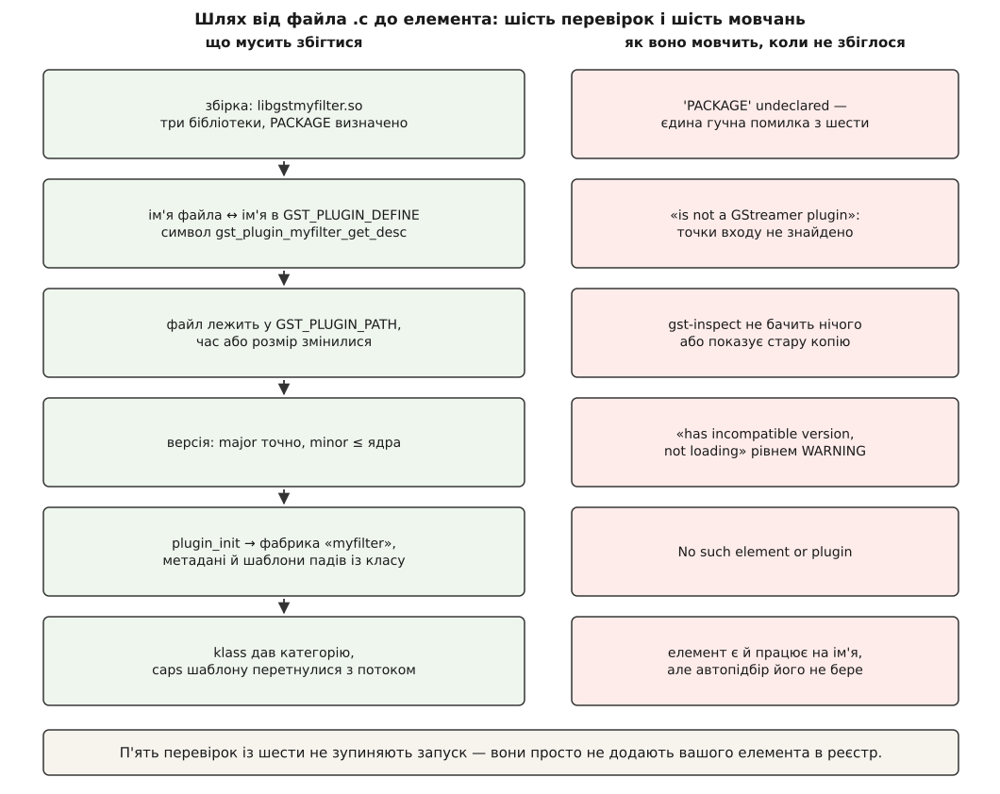

# ⚙️ Власний плагін від нуля: `myfilter` від файла `.c` до запису в реєстрі

Зберемо найдрібніший плагін, який ще має право так називатися, — один елемент, що інвертує яскравість кадру `GRAY8`, — і проведемо його весь шлях: код, збірка, підхоплення ядром, `gst-inspect-1.0`, живий конвеєр. Корисної роботи в елементі рівно один вираз, `row[x] = 255 - row[x]`, і це навмисно: усе інше тут — про те, як ядро взагалі дізнається, що ваш елемент існує, і чому саме цей шлях так часто обривається мовчки.

## Задача: елемент, у якому нема чого ламати

Роботу обрано так, щоб її не було видно за рештою.

`GRAY8` — один байт яскравості на піксель і рівно одна площина: ні окремих площин кольору, ні підвибірки, ні арифметики зміщень. Інверсія не міняє ані розмірів кадру, ані формату — отже, елемент нічого не мусить перераховувати, і те, що прийшло, тим і вийде. Робиться вона **на місці**, у тому самому буфері, тож не треба ані просити вихідний буфер, ані рахувати його розмір.

Одну річ проігнорувати все ж не вийде: рядки кадру в пам'яті майже ніколи не лежать щільно. Між кінцем одного рядка й початком наступного буває запас до вирівнювання, і справжня відстань між початками сусідніх рядків зветься кроком (англ. *stride*). Розкладка кадру взагалі — окрема тема: [формати пікселів і буферів зображення](root:sf-visual/pixel-formats) розбирають, чому кадр у пам'яті ніколи не буває просто прямокутником байтів і звідки беруться площини, зміщення й кроки. Нам звідти потрібне одне: адресу пікселя рахують через крок, а не через ширину.

Перевірити результат теж легко без жодних інструментів. Подаємо на вхід чорний кадр — на виході має бути білий.

## Три реєстрації, які легко сплутати

Слово «зареєструвати» трапиться в цьому коді тричі, і йдеться щоразу про інше. Поки ці три речі злиті в одну, поведінка плагіна виглядає випадковою, а помилки — містичними.

**Тип.** `G_DEFINE_TYPE` заводить в об'єктній системі новий тип і розкладає його на дві структури: **клас**, який існує в одному примірнику на весь процес, і **примірник**, який створюють на кожен елемент. Клас заповнює функція `class_init`, і викликають її рівно один раз — тоді, коли тип уперше комусь знадобився. Це звичайна механіка [об'єктної системи поверх C](root:sf-lang/object-system-in-c): у мові немає ані класів, ані віртуальних методів, тож їх будують руками — структура класу з вказівниками на функції, структура примірника з даними, і функція `..._get_type()`, що реєструє пару в рантаймі. Нам звідти потрібен один наслідок: усе, що покладено в клас, доступне без жодного створеного об'єкта.

**Фіча.** `gst_element_register (plugin, "myfilter", GST_RANK_NONE, GST_TYPE_MY_FILTER)` створює **фабрику елемента** — запис, який потрапить у реєстр. Усередині цього виклику стається річ, варта запам'ятовування: він робить `g_type_class_ref` на ваш тип. Тобто саме реєстрація фічі вперше створює клас і виконує `class_init`, а тоді копіює з класу метадані й переганяє caps ваших шаблонів у рядки. Ось звідки береться правило «метадані мусять бути статичні»: їх забирають із класу в момент, коли жодного елемента ще немає й не передбачається.

**Файл.** `GST_PLUGIN_DEFINE` не реєструє нічого — він описує сам файл: під яку версію ядра зібрано, під якою ліцензією, з якого пакунка, і де шукати `plugin_init`. Цей опис ядро знаходить першим, ще до всього іншого.

Разом виходить один ланцюжок, у якому ваш код бере участь лише двічі:

```
dlopen("libgstmyfilter.so")
  → символ gst_plugin_myfilter_get_desc   ← ім'я виведено з імені ФАЙЛА
  → звірка версій: major точно, minor ≤ ядра
  → plugin_init (plugin)                        ← ваш код
      → gst_element_register (…, GST_TYPE_MY_FILTER)
          → g_type_class_ref → gst_my_filter_class_init   ← ваш код
          → GstElementFactory: метадані, klass, шаблони падів, rank
  → фабрику переписано в реєстр
```

Кожна стрілка в цьому ланцюжку — місце, де все може тихо зупинитися.



*Гучно скаржиться лише компілятор; решта п'яти перевірок просто не додають вашого елемента в реєстр.*

## Тип, шаблони, метадані

Увесь плагін — один файл `gstmyfilter.c` приблизно на сто рядків. Почнімо з опису типу.

```c
/* gstmyfilter.c — інвертор яскравості GRAY8 на GstBaseTransform */
#include <gst/gst.h>
#include <gst/base/gstbasetransform.h>
#include <gst/video/video.h>

GST_DEBUG_CATEGORY_STATIC (myfilter_debug);
#define GST_CAT_DEFAULT myfilter_debug

#define GST_TYPE_MY_FILTER (gst_my_filter_get_type ())
G_DECLARE_FINAL_TYPE (GstMyFilter, gst_my_filter, GST, MY_FILTER,
    GstBaseTransform)

struct _GstMyFilter
{
  GstBaseTransform parent;
  GstVideoInfo info;            /* заповнює set_caps, читає transform_ip */
};

G_DEFINE_TYPE (GstMyFilter, gst_my_filter, GST_TYPE_BASE_TRANSFORM)

/* Єдиний формат, який елемент розуміє, — і той самий з обох боків:
   інверсія не міняє ані розкладки кадру, ані його розміру. */
#define MYFILTER_CAPS "video/x-raw, format=(string)GRAY8"

static GstStaticPadTemplate sink_template =
GST_STATIC_PAD_TEMPLATE ("sink", GST_PAD_SINK, GST_PAD_ALWAYS,
    GST_STATIC_CAPS (MYFILTER_CAPS));

static GstStaticPadTemplate src_template =
GST_STATIC_PAD_TEMPLATE ("src", GST_PAD_SRC, GST_PAD_ALWAYS,
    GST_STATIC_CAPS (MYFILTER_CAPS));
```

`G_DECLARE_FINAL_TYPE` — скорочення, що пише за вас оголошення `gst_my_filter_get_type()`, структуру класу й макрос приведення `GST_MY_FILTER()`. Структуру примірника ви описуєте самі, бо саме в ній лежать ваші дані; тут це один `GstVideoInfo` — розібрана розкладка кадру, яку рахують раз на узгодження, а не на кожному кадрі.

Шаблони падів оголошено як **статичні** структури на рівні файла. Це не стиль, а вимога: їх мусить бути видно з `class_init`, який виконають задовго до появи першого елемента. Слово `ALWAYS` каже, що пади є в елемента завжди, а не з'являються за потребою.

Тепер клас:

```c
static void
gst_my_filter_class_init (GstMyFilterClass * klass)
{
  GstElementClass *element_class = GST_ELEMENT_CLASS (klass);
  GstBaseTransformClass *bt_class = GST_BASE_TRANSFORM_CLASS (klass);

  gst_element_class_set_static_metadata (element_class,
      "Інвертор яскравості",          /* людська назва */
      "Filter/Effect/Video",          /* klass: категорія для автопідбору */
      "Інвертує яскравість кадру GRAY8 на місці",
      "Ім'я Прізвище <mail@example.org>");

  gst_element_class_add_static_pad_template (element_class, &sink_template);
  gst_element_class_add_static_pad_template (element_class, &src_template);

  bt_class->set_caps = gst_my_filter_set_caps;
  bt_class->transform_ip = gst_my_filter_transform_ip;
}

static void
gst_my_filter_init (GstMyFilter * self)
{
  gst_video_info_init (&self->info);
}
```

Чотири рядки метаданих і два шаблони падів — це і є все, що система знатиме про ваш елемент, не відкриваючи файла. Другий із них, `Filter/Effect/Video`, зветься `klass` і виглядає як декорація, але саме за підрядками в ньому автопідбір відбирає кандидатів за категорією. Порожній або довільний рядок тут означає елемент, якого `decodebin` ніколи не розгляне.

Тіла двох методів, які ми щойно підключили до класу:

```c
static gboolean
gst_my_filter_set_caps (GstBaseTransform * base, GstCaps * incaps,
    GstCaps * outcaps)
{
  GstMyFilter *self = GST_MY_FILTER (base);

  if (!gst_video_info_from_caps (&self->info, incaps)) {
    GST_ERROR_OBJECT (self, "не розібрав caps %" GST_PTR_FORMAT, incaps);
    return FALSE;
  }
  return TRUE;
}

static GstFlowReturn
gst_my_filter_transform_ip (GstBaseTransform * base, GstBuffer * buf)
{
  GstMyFilter *self = GST_MY_FILTER (base);
  GstVideoFrame frame;
  guint8 *plane;
  gint stride, w, h, x, y;

  if (!gst_video_frame_map (&frame, &self->info, buf, GST_MAP_READWRITE))
    return GST_FLOW_ERROR;

  plane = GST_VIDEO_FRAME_PLANE_DATA (&frame, 0);
  stride = GST_VIDEO_FRAME_PLANE_STRIDE (&frame, 0);
  w = GST_VIDEO_FRAME_WIDTH (&frame);
  h = GST_VIDEO_FRAME_HEIGHT (&frame);

  for (y = 0; y < h; y++) {
    guint8 *row = plane + (gsize) y * stride;
    for (x = 0; x < w; x++)
      row[x] = 255 - row[x];
  }

  gst_video_frame_unmap (&frame);
  return GST_FLOW_OK;
}
```

`gst_video_frame_map` замість простого `gst_buffer_map` тут не з педантизму: справжній крок приїздить разом із кадром у метаданих, і взяти його можна лише звідти. Ширина в цьому коді використана рівно один раз — як межа внутрішнього циклу, а адреса рядка рахується через `stride`.

Зверніть увагу, чого в класі **немає**: жодного слова про те, що елемент працює на місці. `GstBaseTransform` виводить це сам: якщо метода `transform` не задано, значить, іншого способу, крім роботи в тому самому буфері, у підкласу немає — і кличуть `transform_ip`. Якщо не задано жодного з двох, елемент стає прозорим і кадри проходять крізь нього незайманими.

## Точка входу й дескриптор файла

Лишилося дві частини — і вони найкоротші в усьому файлі:

```c
static gboolean
plugin_init (GstPlugin * plugin)
{
  GST_DEBUG_CATEGORY_INIT (myfilter_debug, "myfilter", 0,
      "інвертор яскравості GRAY8");

  return gst_element_register (plugin, "myfilter", GST_RANK_NONE,
      GST_TYPE_MY_FILTER);
}

#ifndef PACKAGE
#define PACKAGE "gst-myfilter"
#endif
#ifndef VERSION
#define VERSION "1.0"
#endif

GST_PLUGIN_DEFINE (GST_VERSION_MAJOR, GST_VERSION_MINOR,
    myfilter,                                     /* коротке ім'я плагіна */
    "Інвертор яскравості для перевірки моделі плагінів",
    plugin_init, VERSION, "LGPL", "myplugins", "https://example.org/")
```

Аргументи макроса розкладаються так: дві перші цифри — версія ядра, під яке зібрано (їх підставляє сам заголовок); далі коротке ім'я плагіна, опис, функція ініціалізації, версія плагіна, ліцензія, ім'я бінарного пакунка й походження. Плюс один аргумент, якого в списку не видно: макрос читає визначення `PACKAGE` і кладе його в окреме поле дескриптора — «модуль джерел». Забути його не можна, бо збірка просто не пройде — і це, як не дивно, найкраща новина цього тексту: єдина з усіх помилок, про яку вам скажуть уголос.

`GST_RANK_NONE` тут не скромність, а чесність: наш елемент нічого не декодує й не розбирає, тож автопідборові просто ніде його розглядати. Ранг має сенс лише там, де кандидатів на одну роль кілька.

## Збірка: три бібліотеки й одна змінна pkg-config

```meson
project('gst-myfilter', 'c',
  version : '1.0',
  default_options : ['warning_level=2', 'c_std=c11'])

gst_dep      = dependency('gstreamer-1.0',       version : '>= 1.16')
gstbase_dep  = dependency('gstreamer-base-1.0',  version : '>= 1.16')
gstvideo_dep = dependency('gstreamer-video-1.0', version : '>= 1.16')

# Куди дистрибутив кладе плагіни, знає сам gstreamer-1.0.pc:
#   pkg-config --variable=pluginsdir gstreamer-1.0
plugins_install_dir = gst_dep.get_variable(pkgconfig : 'pluginsdir')

shared_library('gstmyfilter',
  'gstmyfilter.c',
  c_args : [
    '-DPACKAGE="@0@"'.format(meson.project_name()),
    '-DVERSION="@0@"'.format(meson.project_version()),
  ],
  dependencies : [gst_dep, gstbase_dep, gstvideo_dep],
  install : true,
  install_dir : plugins_install_dir)
```

Бібліотек саме три, і кожна відповідає за свій рівень. `gstreamer-1.0` — ядро: буфери, пади, стани. `gstreamer-base-1.0` — готові напівфабрикати елементів, серед них `GstBaseTransform`. `gstreamer-video-1.0` — усе про кадр: `GstVideoInfo`, `GstVideoFrame`, розбір відеоформатів із caps. Забути третю легко, бо код компілюється до самого лінкування.

`get_variable(pkgconfig : 'pluginsdir')` бере зі згенерованого `gstreamer-1.0.pc` рядок `pluginsdir=${libdir}/gstreamer-1.0` — тобто типову системну теку плагінів саме цієї збірки GStreamer. Жодного шляху вписувати руками не треба, і на чужому дистрибутиві він так само буде правильний.

Ім'я цілі підібрано не на око. Meson додасть до `gstmyfilter` префікс `lib` і суфікс платформи, вийде `libgstmyfilter.so` — а ядро, побачивши цей файл, відкине префікс `libgst`, візьме частину до крапки й шукатиме символ `gst_plugin_myfilter_get_desc`. Рівно таке ім'я створює `GST_PLUGIN_DEFINE` з короткого імені плагіна — третього свого аргумента, `myfilter`. Ці два імені мусять збігатися, і зв'язку між ними не перевіряє ніхто, крім вас.

Одна платформна дрібниця: теки плагінів обходять, дивлячись на суфікс модуля, а він на всіх юніксах, включно з macOS, — `so`. Meson там типово робить `.dylib`, тож на macOS цілі треба дописати `name_suffix : 'so'`, інакше файл просто не потрапить у поле зору сканера.

Далі — звичайне:

```sh
meson setup build
ninja -C build
```

## Перше побачення з реєстром

Плагін ще нікуди не встановлено, і встановлювати його заради перевірки не треба. Досить показати ядру теку збірки:

```sh
export GST_PLUGIN_PATH=$PWD/build
gst-inspect-1.0 myfilter
```

Перший запуск буде трохи повільніший за наступні: у теці з'явився невідомий файл, тож ядро мусить його відкрити насправді й перечитати опис. Далі опис лежатиме в кеші, доки не зміниться час чи розмір файла.

```
Factory Details:
  Rank                     none (0)
  Long-name                Інвертор яскравості
  Klass                    Filter/Effect/Video
  Description              Інвертує яскравість кадру GRAY8 на місці
  Author                   Ім'я Прізвище <mail@example.org>

Plugin Details:
  Name                     myfilter
  Description              Інвертор яскравості для перевірки моделі плагінів
  Filename                 /home/user/myfilter/build/libgstmyfilter.so
  Version                  1.0
  License                  LGPL
  Source module            gst-myfilter
  Binary package           myplugins
  Origin URL               https://example.org/

Pad Templates:
  SINK template: 'sink'
    Availability: Always
    Capabilities:
      video/x-raw
                 format: GRAY8
  SRC template: 'src'
    Availability: Always
    Capabilities:
      video/x-raw
                 format: GRAY8
```

Цей вивід варто прочитати як звіт про те, чи все з ваших чотирьох джерел доїхало. Верхній блок — метадані з `class_init`. `Source module` — те саме `PACKAGE` із командного рядка компілятора, `Binary package` — восьмий аргумент макроса; їх плутають постійно, а насправді перше означає «з якого дерева джерел це зібрано», друге — «у якому пакунку це приїхало користувачеві». `Filename` — найкорисніший рядок з усіх: він відповідає на питання, яку саме копію плагіна взяло ядро.

Найважливіше — блок шаблонів. Він показує **не те, що написано в коді**, а те, що ядро змогло розібрати й покласти в реєстр. Помилка в рядку caps виявиться тут і тільки тут: замість `format: GRAY8` буде порожньо або зовсім інший набір.

## Перевірка оком

```sh
# чорний кадр на вході, білий PNG на виході
gst-launch-1.0 videotestsrc pattern=black num-buffers=1 \
  ! videoconvert ! video/x-raw,format=GRAY8,width=320,height=240 \
  ! myfilter ! videoconvert ! pngenc ! filesink location=out.png

# і те саме живцем
gst-launch-1.0 videotestsrc ! videoconvert ! myfilter ! videoconvert \
  ! autovideosink
```

У другій команді жодного `capsfilter` немає, а `GRAY8` усе одно з'явиться: приймальний шаблон нашого елемента більше нічого не приймає, тож перетин можливостей `videoconvert` із ним дає єдиний формат. Це найдешевша перевірка того, що шаблони описані правильно, — і водночас пояснення, навіщо `videoconvert` стоїть з обох боків: перший перетворює те, що дає джерело, у `GRAY8`, другий вертає картинку до формату, який розуміє вікно.

## Ціна кадру й копія, якої ви не просили

Порахуймо, скільки коштує наш один рядок роботи.

**Умова: кадр 640×480, GRAY8, 30 кадрів на секунду.**

```
кадр                        = 640 · 480        = 307 200 байт
робота: прочитати й записати кожен байт
                            = 2 · 307 200      = 614 400 байт на кадр
при 30 кадр/с               = 614 400 · 30     ≈ 18.4 МБ/с

а тепер той самий елемент після tee:
базовий клас копіює кадр    + 2 · 307 200      = 614 400 байт на кадр
разом                                          ≈ 36.9 МБ/с — рівно вдвічі
```

Звідки береться друга половина. Робота «на місці» можлива лише тоді, коли в буфер узагалі дозволено писати, а дозволено це лише його єдиному власникові. `GstBaseTransform` перевіряє це на кожному кадрі: буфер записуваний — його й віддають вашому `transform_ip`; не записуваний — базовий клас мовчки робить копію цілого кадру й передає вам її. Ніякої помилки, ніякого попередження — просто продуктивність, удвічі гірша за очікувану.

Найчастіша причина незаписуваного буфера — `tee`: гілки тримають по посиланню на той самий кадр, і жодна з них уже не одноосібний власник. Те саме дає елемент вище за течією, який зберіг посилання на відданий кадр. Механіка тут спільна для всього конвеєра — [буфери й пам'ять](root:sys-media/buffers-and-memory) розбирають, як кадр мандрує без копіювання і чому право на запис визначається кількістю посилань.

І одна засідка на майбутнє. Наш елемент працює лише тому, що `GstBaseTransform` типово **не** вмикає прозорий режим навіть тоді, коли caps з обох боків однакові. Варто дописати в `class_init` рядок `bt_class->passthrough_on_same_caps = TRUE;` — і елемент, у якого вхід і вихід збігаються за визначенням, опиниться в прозорому режимі назавжди. Формально `transform_ip` при цьому все одно покличуть, бо базовий клас типово так робить, — але буфер прийде туди як є, без клопоту про право на запис, і мапування на запис має всі шанси не вдатися.

## Пастки

**`PACKAGE` не визначено.** Компіляція падає на `'PACKAGE' undeclared`, і це збиває з пантелику, бо в коді такого слова немає — його читає макрос. Лікування — рядок `-DPACKAGE="..."` у збірці або пара `#ifndef` перед макросом, як вище.

**Ім'я файла не збігається з іменем у макросі.** Ядро виводить ім'я символу з імені файла й нізвідки більше. Якщо файл зветься `libgstmyfilter.so`, а в `GST_PLUGIN_DEFINE` написано `myfilt`, шуканого символу в файлі не буде, запасний варіант теж не спрацює, і ви отримаєте «File … is not a GStreamer plugin» — повідомлення, яке звучить як вирок якості коду, а насправді означає невідповідність двох рядків. Те саме буває від збірки в статичну бібліотеку: у плагіна нема сенсу без `dlopen`, тож ціль мусить бути саме спільною бібліотекою. Загальна механіка пошуку експортованих імен — [розв'язання символів](root:sys-unix/symbol-resolution): завантажувач бачить лише те, що бібліотека справді експортує, і мовчки не знаходить решти.

**Неправильні caps у шаблоні.** Найпідступніша з усіх, бо елемент при цьому цілком робочий. Автопідбір відсіює кандидатів за шаблонними caps **до** завантаження файла, і ваш елемент вибуває, навіть не діставши шансу. Симптом упізнаваний: у `gst-launch-1.0` з іменем усе працює, а `decodebin` вас не бере ніколи. Дві типові причини — надто широкий шаблон (`video/x-raw` без формату, після чого елемент обіцяє те, чого не вміє) і синтаксична помилка в рядку, від якої caps виходять порожні. Перевірка одна: дивитися не в код, а у вивід `gst-inspect-1.0`. Що саме означають ці рядки й чому шаблон — обіцянка, а не факт, розібрано в темі про [узгодження caps](root:sys-media/caps-negotiation).

**Забутий `klass`.** Порожній рядок або щось на кшталт `Generic` у другому полі метаданих не заважає ні реєстрації, ні `gst-inspect`. Ламається лише автопідбір: маски категорій перевіряють наявність підрядків у `klass`, і елемент без категорії не потрапляє в жоден список кандидатів. Виглядає це так само, як попередня пастка, а лікується в іншому місці — тому й дивитися варто на обидва поля одразу.

**Зіткнення імені фічі.** Простір імен один на всю систему, без префіксів і пакунків. Назвіть свій елемент `videoflip` — і після сканування вашої теки цим іменем зватиметься саме ваш елемент, а системний зникне з реєстру. Постраждає не ваш конвеєр, а чужий: усе, що на цій машині користувалося справжнім `videoflip`, почне поводитися дивно. Звідси два правила: імена своїх елементів починати зі свого префікса, а в `GST_PLUGIN_PATH` тримати тільки власну теку збірки, ніколи не копію системної.

**Невідповідність версії ядра.** Перевірка сувора й асиметрична: старша цифра версії мусить збігтися точно, молодша в плагіні не сміє перевищувати молодшої в ядрі. Плагін, зібраний під 1.20, у ядрі 1.24 працюватиме; зібраний під 1.24 у ядрі 1.20 — ні. Помітити це найважче, бо плагін просто не з'являється: повідомлення «has incompatible version …, not loading» іде рівнем WARNING, а такі рядки типово не показують. Витягти його назовні можна одним запуском:

```sh
GST_DEBUG=GST_PLUGIN_LOADING:5 gst-inspect-1.0 myfilter 2>&1 | grep -i version
```

Такий самий тихий вигляд має і будь-яка інша причина відмови — тому за «елемента не видно» варто одразу дивитися журнал завантаження, а не переставляти шляхи навмання. Ширше про рівні й категорії журналу — [діагностика конвеєра](root:sys-media/pipeline-debugging).

**Ліцензія, на відміну від версії, ні на що не впливає.** Невідомий рядок у полі ліцензії дає попередження в журналі й нічого більше: ядро прямо вважає, що перевіряти ліцензії — не його справа. Розраховувати на цю перевірку як на запобіжник не варто.

**Застряглий кеш реєстру.** Запис у реєстрі вважають чинним, поки збігаються час зміни й розмір файла — а це не хеш умісту. Копіювання зі збереженням часу (`cp -p`, розпакування архіву, синхронізація образу) цілком може підсунути новий файл під старий опис, якщо розмір випадково не змінився. Симптом — ви правите шаблони, перезбираєте, а `gst-inspect-1.0` уперто показує старе. Лікування грубе й надійне:

```sh
rm -f ~/.cache/gstreamer-1.0/registry.*.bin
```

Наступний запуск збере реєстр наново. На пристрої, де кореневу файлову систему змонтовано лише для читання, ця ж дрібниця обертається іншим боком: реєстр нікуди записати, тож кожен процес перескановує все з нуля — там реєстр збирають один раз на етапі складання образу й підсовують готовим.
