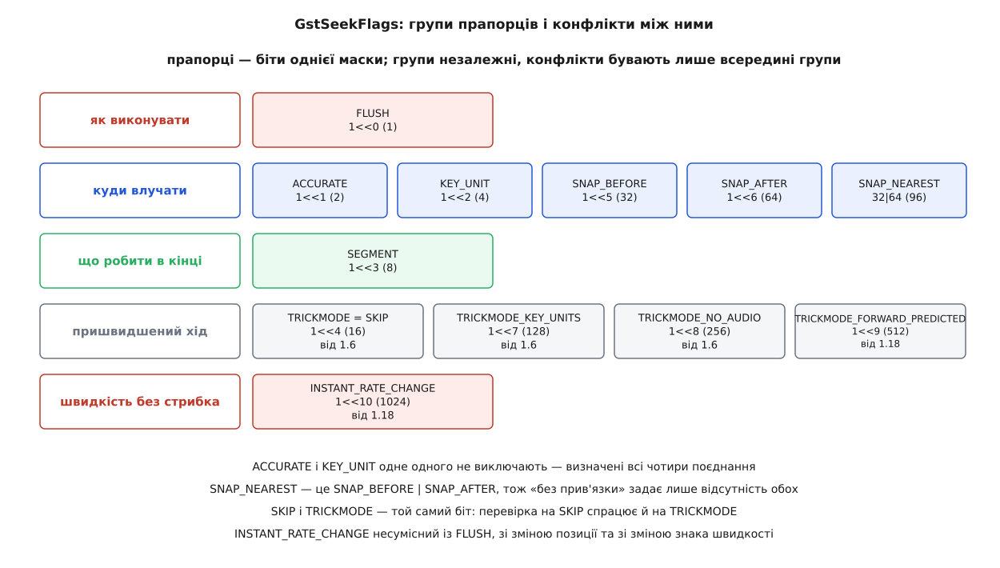
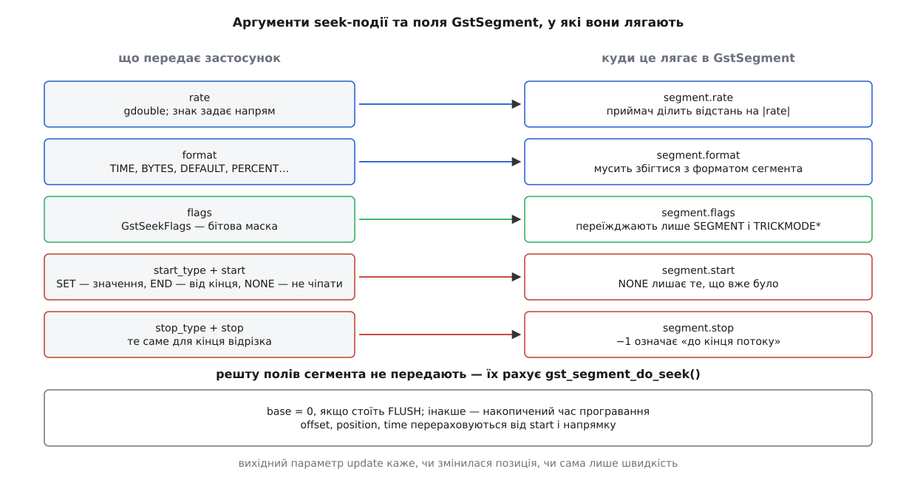

# 📋 Контракт перемотування: виклики, прапорці, події й точки розширення

Це структурна довідка по тій частині API GStreamer, якою рухають позицію: три способи послати seek-подію, чотирнадцять прапорців із правилами поєднання, події й запити, що обслуговують перемотування, і віртуальні функції, які мусить заповнити автор власного елемента. Тримати її під рукою варто через те, що більшість затиків із перемотуванням — не помилки в логіці застосунку, а неправильно зібрана маска прапорців або пропущений крок у послідовності, яку базовий клас робить за вас лише наполовину.

Усе нижче стосується GStreamer 1.x і звірене із заголовками `gstsegment.h`, `gstevent.h`, `gstquery.h`, `gstmessage.h`, `gstelement.h`, `gstutils.h`, `gstformat.h` гілки `main`, документацією базових класів і документом плану `part-seeking.md`. Значення прапорців наведено і бітом, і десятковим числом: у журналі `GST_DEBUG` маска друкується десятковою, і розібрати її на складники доводиться самому.

## Три способи послати seek

```c
/* gstutils.h — найкоротший шлях */
gboolean   gst_element_seek_simple (GstElement   *element,
                                    GstFormat     format,
                                    GstSeekFlags  seek_flags,
                                    gint64        seek_pos);

/* gstelement.h — повний контроль */
gboolean   gst_element_seek        (GstElement   *element,
                                    gdouble       rate,
                                    GstFormat     format,
                                    GstSeekFlags  flags,
                                    GstSeekType   start_type, gint64 start,
                                    GstSeekType   stop_type,  gint64 stop);

/* gstevent.h — коли подію треба потримати в руках */
GstEvent * gst_event_new_seek      (gdouble       rate,
                                    GstFormat     format,
                                    GstSeekFlags  flags,
                                    GstSeekType   start_type, gint64 start,
                                    GstSeekType   stop_type,  gint64 stop);
void       gst_event_parse_seek    (GstEvent     *event,
                                    gdouble      *rate,
                                    GstFormat    *format,
                                    GstSeekFlags *flags,
                                    GstSeekType  *start_type, gint64 *start,
                                    GstSeekType  *stop_type,  gint64 *stop);

gboolean   gst_element_send_event  (GstElement *element, GstEvent *event);
gboolean   gst_pad_send_event      (GstPad     *pad,     GstEvent *event);
```

Механізм за ними один: `gst_element_seek()` створює подію тими самими сімома аргументами й віддає її `gst_element_send_event()`, а `gst_element_seek_simple()` — це один рядок поверх `gst_element_seek()`:

```c
gst_element_seek (element, 1.0, format, seek_flags,
                  GST_SEEK_TYPE_SET, seek_pos,
                  GST_SEEK_TYPE_SET, GST_CLOCK_TIME_NONE);
```

Швидкість тут жорстко `1.0`, кінець відрізка не заданий. Тому все, що стосується швидкості, зворотного ходу, відрізків і зациклення, простим викликом недосяжне за побудовою — не через обмеження, а тому що ці аргументи в ньому просто не передбачені.

Третій спосіб потрібен рівно у двох випадках: коли до події треба доклеїти щось своє (`gst_event_set_seek_trickmode_interval()`, від 1.16) і коли подію адресують конкретному падові, обходячи вибір адресата.

**Кому слати.** Це вирішує реалізація `send_event` того об'єкта, якому ви віддали подію, і три варіанти поводяться по-різному:

| Адресат | Що зробить `send_event` |
|---|---|
| конвеєр або будь-який `GstBin` | подія проти течії йде **всім приймачам** контейнера, за течією — усім джерелам; успіх, якщо взявся хоч хтось |
| окремий елемент | типова реалізація бере **один довільний** пад потрібного напрямку (для seek — вихідний) і шле подію туди |
| конкретний пад | подія входить саме в цей пад; жодного вибору не робиться |

Різниця має практичний наслідок: у конвеєрі з двома гілками seek, посланий конвеєру, обійде обидві, а той самий seek, посланий одному елементу з кількома вихідними падами, піде лише в один із них — і який саме, не визначено.

**Що означає повернене `TRUE`.** Тільки те, що якийсь елемент угорі за течією взявся виконувати прохання. Позиція в цю мить ще стара, конвеєр ще не спорожнів, а перший кадр із нового місця ще не декодовано. Ознака справжнього завершення — повідомлення на шині, і про нього окремо нижче.

> 🔧 **Навіщо це.** Усі три виклики виконуються синхронно в потоці того, хто їх викликав, і всередині чекають на звільнення потоку обробки. Викликати їх із ланцюжкової функції елемента, з проби на паді, з сигналу `handoff` чи з обробника `new-sample` в `appsink` означає чекати самому на себе — [взаємне блокування](root:sf-tasks/deadlock) без шансу розв'язатися. Безпечні місця виклику два: потік застосунку й обробник [шини повідомлень](root:sys-media/bus-and-messages). Якщо перемотування треба запустити саме з потоку обробки, роботу перекладають на пул через `gst_element_call_async()`.

## Формат позиції і тип відліку

```c
typedef enum {
  GST_FORMAT_UNDEFINED = 0,
  GST_FORMAT_DEFAULT   = 1,
  GST_FORMAT_BYTES     = 2,
  GST_FORMAT_TIME      = 3,
  GST_FORMAT_BUFFERS   = 4,
  GST_FORMAT_PERCENT   = 5
} GstFormat;
```

| Формат | Одиниця | Хто це розуміє |
|---|---|---|
| `GST_FORMAT_TIME` | наносекунди | майже все: демультиплексори, декодери, приймачі |
| `GST_FORMAT_BYTES` | байти | джерела файлів і потоків; у цей формат демультиплексор перекладає час, коли шле seek далі вгору |
| `GST_FORMAT_DEFAULT` | «своя» одиниця елемента: кадри для відео, семпли для звуку | окремі парсери й кодери |
| `GST_FORMAT_BUFFERS` | буфери | зрідка, у службових ланцюгах |
| `GST_FORMAT_PERCENT` | частка потоку | джерела, що знають розмір, але не знають тривалості |

Відсотки не дробові — вони цілі, у масштабованих одиницях:

```
GST_FORMAT_PERCENT_MAX   = 1000000     ← це 100 %
GST_FORMAT_PERCENT_SCALE = 10000       ← стільки одиниць в одному відсотку

50 %  →  50 * GST_FORMAT_PERCENT_SCALE  =  500000
```

Тип відліку каже, як читати числа `start` і `stop`:

| Константа | Число | Як читати значення |
|---|---|---|
| `GST_SEEK_TYPE_NONE` | 0 | значення ігнорується; те, що вже стоїть у сегменті, лишається без змін |
| `GST_SEEK_TYPE_SET` | 1 | абсолютна величина в заданому форматі |
| `GST_SEEK_TYPE_END` | 2 | відлік від кінця матеріалу; величина зазвичай від'ємна або нуль |

**Відносного перемотування в 1.x немає.** У 0.10 був четвертий тип, `GST_SEEK_TYPE_CUR`, і саме його шукають у прикладах зі старих статей. У чинному заголовку перелічення має рівно три значення. Щоб перемотати на десять секунд уперед, спершу питають позицію, додають, потім роблять абсолютний seek:

```c
gint64 pos;
if (gst_element_query_position (pipeline, GST_FORMAT_TIME, &pos))
  gst_element_seek_simple (pipeline, GST_FORMAT_TIME,
      GST_SEEK_FLAG_FLUSH | GST_SEEK_FLAG_KEY_UNIT, pos + 10 * GST_SECOND);
```

Окремо про `-1`. У всьому API GStreamer `GST_CLOCK_TIME_NONE` — це `(GstClockTime) -1`, і в аргументах seek воно означає «не задано». Тому `stop = GST_CLOCK_TIME_NONE` при `stop_type = GST_SEEK_TYPE_SET` не помилка й не «нуль часу», а звичайний спосіб сказати «кінця відрізка немає, грай до кінця матеріалу».

## GstSeekFlags: повна таблиця

```c
typedef enum {
  GST_SEEK_FLAG_NONE                        = 0,
  GST_SEEK_FLAG_FLUSH                       = (1 << 0),
  GST_SEEK_FLAG_ACCURATE                    = (1 << 1),
  GST_SEEK_FLAG_KEY_UNIT                    = (1 << 2),
  GST_SEEK_FLAG_SEGMENT                     = (1 << 3),
  GST_SEEK_FLAG_TRICKMODE                   = (1 << 4),
  GST_SEEK_FLAG_SKIP                        = (1 << 4),
  GST_SEEK_FLAG_SNAP_BEFORE                 = (1 << 5),
  GST_SEEK_FLAG_SNAP_AFTER                  = (1 << 6),
  GST_SEEK_FLAG_SNAP_NEAREST                = GST_SEEK_FLAG_SNAP_BEFORE |
                                              GST_SEEK_FLAG_SNAP_AFTER,
  GST_SEEK_FLAG_TRICKMODE_KEY_UNITS         = (1 << 7),
  GST_SEEK_FLAG_TRICKMODE_NO_AUDIO          = (1 << 8),
  GST_SEEK_FLAG_TRICKMODE_FORWARD_PREDICTED = (1 << 9),
  GST_SEEK_FLAG_INSTANT_RATE_CHANGE         = (1 << 10),
} GstSeekFlags;
```

| Константа | Біт | Число | З версії | Що просить |
|---|---|---|---|---|
| `GST_SEEK_FLAG_NONE` | — | 0 | | порожня маска |
| `GST_SEEK_FLAG_FLUSH` | `1<<0` | 1 | | викинути все, що в польоті, обірвати всі чекання й почати відлік наново |
| `GST_SEEK_FLAG_ACCURATE` | `1<<1` | 2 | | не наближати позицію за жодних обставин; для стиснених форматів помітно повільніше |
| `GST_SEEK_FLAG_KEY_UNIT` | `1<<2` | 4 | | поставити початок сегмента на [ключовий кадр](root:com-signal/inter-frame), а не на прохану позицію |
| `GST_SEEK_FLAG_SEGMENT` | `1<<3` | 8 | | дійшовши до `stop`, не оголошувати кінець потоку, а покласти на шину `SEGMENT_DONE` |
| `GST_SEEK_FLAG_TRICKMODE` | `1<<4` | 16 | 1.6 | на пришвидшеному ході дозволити елементам пропускати кадри замість того, щоб видавати всі |
| `GST_SEEK_FLAG_SKIP` | `1<<4` | 16 | | застаріла назва **того самого біта**, лишена для сумісності |
| `GST_SEEK_FLAG_SNAP_BEFORE` | `1<<5` | 32 | | прив'язатися до позиції **перед** проханою (з `KEY_UNIT` — до ключового кадру на ній або раніше) |
| `GST_SEEK_FLAG_SNAP_AFTER` | `1<<6` | 64 | | прив'язатися до позиції **після** проханої |
| `GST_SEEK_FLAG_SNAP_NEAREST` | `1<<5\|1<<6` | 96 | | до найближчої; при рівній відстані поводиться як `SNAP_BEFORE` |
| `GST_SEEK_FLAG_TRICKMODE_KEY_UNITS` | `1<<7` | 128 | 1.6 | розгортати **лише** ключові кадри, решту вмісту пропускати |
| `GST_SEEK_FLAG_TRICKMODE_NO_AUDIO` | `1<<8` | 256 | 1.6 | звуковим декодерам не декодувати взагалі — видавати тишу або події пропуску |
| `GST_SEEK_FLAG_TRICKMODE_FORWARD_PREDICTED` | `1<<9` | 512 | 1.18 | розгортати ключові кадри й ті, що спираються лише на минуле; двонапрямлені пропускати |
| `GST_SEEK_FLAG_INSTANT_RATE_CHANGE` | `1<<10` | 1024 | 1.18 | застосувати нову швидкість негайно, не чіпаючи позиції й не спорожнюючи конвеєр |



*Групи незалежні, тому маска майже завжди збирається як «по одному з кожної потрібної групи»; заплутатися можна тільки всередині групи.*

Прапорці — звичайна бітова маска, і збирають її побітовим «або»; хто не має справи з [масками](root:sf-algorithms/bitwise-operations) щодня, легко пише `+` замість `|`, і тоді `SNAP_BEFORE + SNAP_AFTER` випадково дає `SNAP_NEAREST` правильно, а `TRICKMODE + TRICKMODE` — уже сміття.

### Які поєднання законні

**`ACCURATE` і `KEY_UNIT` одне одного не виключають.** Це найпоширеніша хиба в розумінні: обидва прапорці описують **різні** речі — перший забороняє наближення, другий переставляє початок сегмента. Документ плану визначає всі чотири поєднання:

| Маска | Початок сегмента | Звідки йдуть дані | Наближення |
|---|---|---|---|
| жодного з двох | на проханій позиції | від попереднього ключового кадру | дозволене |
| `KEY_UNIT` | на найближчому ключовому кадрі | звідти ж | дозволене |
| `ACCURATE` | на проханій позиції | від попереднього ключового кадру | **заборонене** |
| `ACCURATE \| KEY_UNIT` | на найближчому ключовому кадрі | звідти ж | **заборонене** |

Різниця між першим і третім рядком не в результаті, а в дозволі: без `ACCURATE` елемент має право змахлювати — оцінити позицію, а не шукати її точно, — і в контейнері без таблиці індексів саме так і зробить.

**`SNAP_*` уточнюють бік прив'язки, а не вмикають її.** Прив'язка відбувається й без них; прапорці лише кажуть, у який бік округляти. Один наслідок варто мати на увазі: `SNAP_NEAREST` — це не окремий біт, а `SNAP_BEFORE | SNAP_AFTER`, тому перевірка виду `if (flags & GST_SEEK_FLAG_SNAP_BEFORE)` істинна й для `SNAP_NEAREST`. Розрізняти три випадки треба порівнянням маскованої групи з константою, а не окремими перевірками бітів.

**Родина `TRICKMODE` має старший прапорець і уточнення.** `GST_SEEK_FLAG_TRICKMODE` — загальний дозвіл пропускати кадри; три інші кажуть, що саме пропускати. Уточнення без старшого прапорця елементи здебільшого ігнорують, а `TRICKMODE_KEY_UNITS` і `TRICKMODE_FORWARD_PREDICTED` разом безглузді: перший вимагає викидати все, крім ключових кадрів, другий велить лишити ще й однонапрямлені. Ставте один із двох.

До `TRICKMODE_KEY_UNITS` окремо приклеюється інтервал — мінімальна відстань між кадрами, які елементу дозволено видавати:

```c
void gst_event_set_seek_trickmode_interval   (GstEvent *event, GstClockTime interval);   /* від 1.16 */
void gst_event_parse_seek_trickmode_interval (GstEvent *event, GstClockTime *interval);
```

Ставиться він тільки на подію, яку ви створили самі через `gst_event_new_seek()` і яка ще не пішла — четвертого аргументу в `gst_element_seek()` під нього немає.

**`SEGMENT` міняє те, що станеться в кінці.** Без нього, дійшовши до `stop`, конвеєр оголошує кінець потоку. З ним кінець потоку не оголошується — натомість на шину лягає `SEGMENT_DONE`. Це єдиний прапорець, який стосується не початку перемотування, а його завершення, і саме на ньому будується безшовне зациклення.

**`INSTANT_RATE_CHANGE` має жорсткі обмеження.** Документація формулює їх прямо: подія з цим прапорцем має право змінити лише швидкість і прапорці трюкового режиму, але не може змінити позицію й не може бути флашною.

| Що заборонено разом з `INSTANT_RATE_CHANGE` | Чому |
|---|---|
| `GST_SEEK_FLAG_FLUSH` | сенс прапорця саме в тому, щоб конвеєр не порожнів |
| `start_type` або `stop_type`, відмінні від `GST_SEEK_TYPE_NONE` | позицію змінювати не можна; обидва значення мають бути `GST_CLOCK_TIME_NONE` |
| зміна знака швидкості | розворот вимагає перезбирання груп кадрів, миттєво це неможливо |

Порушення будь-якого з трьох рядків дає відмову, а не мовчазне ігнорування прапорця.

## Що з події лягає в сегмент

Подію перетворює на новий сегмент одна функція, і саме її викликають базові класи всередині:

```c
gboolean gst_segment_do_seek (GstSegment  *segment,
                              gdouble      rate,
                              GstFormat    format,
                              GstSeekFlags flags,
                              GstSeekType  start_type, guint64 start,
                              GstSeekType  stop_type,  guint64 stop,
                              gboolean    *update);
```



*Копіюється менше, ніж здається: у сегмент переїжджають п'ять величин, а найважливіше поле — `base` — обчислюється, і його значення залежить від наявності `FLUSH`.*

Три речі, які тут варто знати напам'ять. Перша: у `segment.flags` переїжджають **не всі** прапорці події, а лише ті, що мають сенс для подальшого відтворення, — `SEGMENT` і родина `TRICKMODE`; `FLUSH`, `ACCURATE`, `KEY_UNIT`, `SNAP_*` живуть лише в момент виконання перемотування й у сегменті сліду не лишають.

Друга: `segment.base` дорівнює нулю, якщо стоїть `FLUSH`, і накопиченому часу програвання, якщо не стоїть. Це і є те єдине число, яким флашне перемотування відрізняється від нефлашного з погляду [часу програвання](root:sys-media/clock-and-sync); повна алгебра перекладу міток — у [розгортці формул](root:sys-media/clock-and-sync/math-running-time.md).

Третя: вихідний параметр `update` каже, чи позиція справді змінилася. `FALSE` означає «змінено лише швидкість» — і саме за цією ознакою елемент вирішує, чи треба взагалі щось перечитувати з носія. Для перемотування, яке лише прискорює відтворення, робота з носієм не потрібна.

## Мінімальний робочий виклик

Найкоротший чесний код, який питає дозвіл, перемотує й дочікується справжнього завершення:

```c
#include <gst/gst.h>

static gboolean
seek_and_wait (GstElement *pipeline, gint64 pos_ns, gboolean accurate)
{
  GstQuery *q = gst_query_new_seeking (GST_FORMAT_TIME);
  gboolean seekable = FALSE;
  gint64 lo = 0, hi = 0;

  /* 1. чи взагалі можна і в яких межах */
  if (!gst_element_query (pipeline, q)) {
    gst_query_unref (q);
    return FALSE;                       /* ніхто не відповів — не перемотуємо */
  }
  gst_query_parse_seeking (q, NULL, &seekable, &lo, &hi);
  gst_query_unref (q);

  if (!seekable || pos_ns < lo || (hi != -1 && pos_ns > hi))
    return FALSE;

  /* 2. прохання; FLUSH обов'язковий, якщо файл уже дограв до кінця */
  GstSeekFlags flags = GST_SEEK_FLAG_FLUSH |
      (accurate ? GST_SEEK_FLAG_ACCURATE : GST_SEEK_FLAG_KEY_UNIT);

  if (!gst_element_seek (pipeline, 1.0, GST_FORMAT_TIME, flags,
          GST_SEEK_TYPE_SET, pos_ns,
          GST_SEEK_TYPE_SET, GST_CLOCK_TIME_NONE))
    return FALSE;                       /* ніхто не взявся */

  /* 3. справжнє завершення — ASYNC_DONE від самого конвеєра */
  GstBus *bus = gst_element_get_bus (pipeline);
  GstMessage *msg = gst_bus_timed_pop_filtered (bus, 5 * GST_SECOND,
      GST_MESSAGE_ASYNC_DONE | GST_MESSAGE_ERROR);
  gboolean ok = (msg && GST_MESSAGE_TYPE (msg) == GST_MESSAGE_ASYNC_DONE);

  if (msg)
    gst_message_unref (msg);
  gst_object_unref (bus);
  return ok;
}
```

Верхня межа `hi`, повернена запитом, може дорівнювати `-1` — це не помилка, а «кінець невідомий», звичайна відповідь для потоку, що ще пишеться. Порівнювати з нею позицію в такому разі нема з чим, тому перевірка й пропускає цей випадок.

Зациклення відрізка збирається з двох різних масок, і різниця між ними — уся суть безшовності:

```c
/* перший захід: флашний, бо треба стрибнути на початок відрізка */
gst_element_seek (pipeline, 1.0, GST_FORMAT_TIME,
    GST_SEEK_FLAG_FLUSH | GST_SEEK_FLAG_SEGMENT | GST_SEEK_FLAG_ACCURATE,
    GST_SEEK_TYPE_SET, 10 * GST_SECOND,
    GST_SEEK_TYPE_SET, 20 * GST_SECOND);

/* у відповідь на SEGMENT_DONE: той самий відрізок, але БЕЗ флаша */
gst_element_seek (pipeline, 1.0, GST_FORMAT_TIME,
    GST_SEEK_FLAG_SEGMENT | GST_SEEK_FLAG_ACCURATE,
    GST_SEEK_TYPE_SET, 10 * GST_SECOND,
    GST_SEEK_TYPE_SET, 20 * GST_SECOND);
```

Миттєва зміна швидкості (від 1.18) виглядає інакше — обидва типи позиції `NONE`, обидва значення «не задано»:

```c
gst_element_seek (pipeline, 2.0, GST_FORMAT_TIME,
    GST_SEEK_FLAG_INSTANT_RATE_CHANGE,
    GST_SEEK_TYPE_NONE, GST_CLOCK_TIME_NONE,
    GST_SEEK_TYPE_NONE, GST_CLOCK_TIME_NONE);
```

## Події

Перемотування обслуговують п'ять типів подій, і властивості кожного типу пояснюють, чому вони йдуть саме в такому порядку. Напрямок і серіалізованість — не деталь реалізації, а частина контракту; загальний механізм [подій і запитів](root:sys-media/events-and-queries) описує, що ці властивості означають.

| Тип | Напрямок | Серіалізована | Липка | Що робить |
|---|---|---|---|---|
| `GST_EVENT_SEEK` | лише проти течії | ні | ні | прохання змінити позицію, швидкість або відрізок |
| `GST_EVENT_FLUSH_START` | в обидва боки | **ні** | ні | переводить пади у флашний стан, обриваючи всі чекання |
| `GST_EVENT_FLUSH_STOP` | в обидва боки | **так** | ні | знімає флашний стан і за потреби скидає відлік часу |
| `GST_EVENT_SEGMENT` | за течією | так | **так** | нове правило перекладу міток буферів |
| `GST_EVENT_SEGMENT_DONE` | за течією | так | ні | відрізок дограно до `stop` |
| `GST_EVENT_INSTANT_RATE_CHANGE` | за течією | ні | **так** | нова швидкість, застосовна негайно (від 1.18) |
| `GST_EVENT_INSTANT_RATE_SYNC_TIME` | проти течії | ні | ні | мить, від якої нову швидкість застосовують (від 1.18) |

Уся різниця між двома подіями флаша вміщається в один стовпчик: `FLUSH_START` **не** серіалізована, тобто обганяє буфери в чергах, а `FLUSH_STOP` серіалізована, тобто стоїть у потоці даних на своєму місці й проводить межу між старим і новим. Липкість `SEGMENT` теж не декоративна: подія лишається на паді, і кожен, хто під'єднається пізніше, отримає її автоматично.

```c
GstEvent * gst_event_new_flush_start  (void);
GstEvent * gst_event_new_flush_stop   (gboolean reset_time);
void       gst_event_parse_flush_stop (GstEvent *event, gboolean *reset_time);

GstEvent * gst_event_new_segment      (const GstSegment *segment);
void       gst_event_parse_segment    (GstEvent *event, const GstSegment **segment);
void       gst_event_copy_segment     (GstEvent *event, GstSegment *segment);

GstEvent * gst_event_new_segment_done   (GstFormat format, gint64 position);
void       gst_event_parse_segment_done (GstEvent *event, GstFormat *format,
                                         gint64 *position);

GstEvent * gst_event_new_instant_rate_change   (gdouble rate_multiplier,
                                                GstSegmentFlags new_flags);
void       gst_event_parse_instant_rate_change (GstEvent *event,
                                                gdouble *rate_multiplier,
                                                GstSegmentFlags *new_flags);
GstEvent * gst_event_new_instant_rate_sync_time (gdouble rate_multiplier,
                                                 GstClockTime running_time,
                                                 GstClockTime upstream_running_time);

GstEvent * gst_event_new_step (GstFormat format, guint64 amount, gdouble rate,
                               gboolean flush, gboolean intermediate);
```

Єдиний аргумент `gst_event_new_flush_stop()` вирішує долю відліку часу:

| `reset_time` | Що станеться | Коли так |
|---|---|---|
| `TRUE` | час програвання скидається в нуль, конвеєр обчислює й роздає новий базовий час | звичайне флашне перемотування — конвеєр порожній, старої осі більше не існує |
| `FALSE` | відлік триває далі, базовий час не змінюється | флаш заради розчищення дороги, після якого показ має продовжитися з тієї самої осі |

Пара `INSTANT_RATE_CHANGE` і `INSTANT_RATE_SYNC_TIME` працює разом: перша (за течією, липка) розносить нову швидкість, друга (проти течії) повертає мить, від якої її застосовують, щоб усі гілки перемкнулися одночасно. Розсинхронізації звуку й зображення при зміні швидкості уникають саме так.

`gst_event_copy_segment()` варта окремої згадки: на відміну від `gst_event_parse_segment()`, вона копіює вміст у **вашу** структуру, і саме її треба брати, якщо сегмент зберігається в елементі довше, ніж живе подія.

## Запити

```c
GstQuery * gst_query_new_seeking   (GstFormat format);
void       gst_query_set_seeking   (GstQuery *query, GstFormat format,
                                    gboolean seekable,
                                    gint64 segment_start, gint64 segment_end);
void       gst_query_parse_seeking (GstQuery *query, GstFormat *format,
                                    gboolean *seekable,
                                    gint64 *segment_start, gint64 *segment_end);

GstQuery * gst_query_new_position  (GstFormat format);
void       gst_query_parse_position (GstQuery *query, GstFormat *format, gint64 *cur);

GstQuery * gst_query_new_duration  (GstFormat format);
void       gst_query_parse_duration (GstQuery *query, GstFormat *format, gint64 *duration);

GstQuery * gst_query_new_segment   (GstFormat format);
void       gst_query_parse_segment (GstQuery *query, gdouble *rate, GstFormat *format,
                                    gint64 *start_value, gint64 *stop_value);
```

Для трьох найчастіших є короткі обгортки в `gstutils.h` — вони самі створюють запит, шлють його й розбирають відповідь:

```c
gboolean gst_element_query_position (GstElement *element, GstFormat format, gint64 *cur);
gboolean gst_element_query_duration (GstElement *element, GstFormat format, gint64 *duration);
gboolean gst_element_query_convert  (GstElement *element,
                                     GstFormat src_format,  gint64  src_val,
                                     GstFormat dest_format, gint64 *dest_val);
```

Обгортки для `SEEKING` немає — цей запит завжди створюють руками.

| Запит | Хто зазвичай відповідає | Що повертає |
|---|---|---|
| `SEEKING` | демультиплексор або джерело | чи можна перемотувати в цьому форматі та межі `[segment_start, segment_end]`, у яких дозволено |
| `POSITION` | приймач | де відтворення зараз; рахується з сегмента й мітки останнього буфера |
| `DURATION` | демультиплексор або джерело | тривалість матеріалу; `-1` — невідомо |
| `SEGMENT` | той, хто тримає чинний сегмент | швидкість і межі чинного сегмента — не те саме, що межі перемотування |
| `CONVERT` | той, хто вміє переводити одиниці | значення в іншому форматі |

Запити подорожують в обидва боки, тому надсилати їх правильно **конвеєру**, а не окремому елементу: конвеєр роздасть їх туди, де на них є відповідь. Питати `POSITION` у джерела безглуздо — воно знає лише байти, а не мить показу.

Дві поведінки, що псують життя тим, хто цього не чекає. `DURATION` до переходу конвеєра в `PAUSED` майже завжди дає `FALSE`: демультиплексор ще не прочитав заголовка. І тривалість, і межі перемотування можуть змінитися вже під час відтворення — тоді на шину лягає `DURATION_CHANGED`, і кешоване значення треба перепитати.

## Повідомлення шини

| Тип | Хто постить | Чи доходить до застосунку | Розбір |
|---|---|---|---|
| `GST_MESSAGE_ASYNC_START` | елемент, що почав асинхронний перехід | **ні** — контейнер перехоплює | — |
| `GST_MESSAGE_ASYNC_DONE` | елемент, що завершив наповнення | лише те, що постить конвеєр верхнього рівня | `gst_message_parse_async_done()` |
| `GST_MESSAGE_SEGMENT_START` | елемент, що почав грати відрізок | **ні** — контейнер збирає й не пропускає далі | `gst_message_parse_segment_start()` |
| `GST_MESSAGE_SEGMENT_DONE` | елемент, що дограв відрізок | так — але одне на весь конвеєр | `gst_message_parse_segment_done()` |
| `GST_MESSAGE_DURATION_CHANGED` | елемент, що виявив нову тривалість | так | тривалість перепитують запитом |
| `GST_MESSAGE_EOS` | приймачі | так, коли **всі** приймачі дійшли до кінця | — |

```c
void gst_message_parse_async_done    (GstMessage *message, GstClockTime *running_time);
void gst_message_parse_segment_start (GstMessage *message, GstFormat *format, gint64 *position);
void gst_message_parse_segment_done  (GstMessage *message, GstFormat *format, gint64 *position);
```

Логіка збирання в контейнері описана в документації `GstBin` прямо: повідомлення `SEGMENT_START` збираються й ніколи не передаються вгору — за ними контейнер лічить, скільки елементів іще грають свій відрізок. Власне `SEGMENT_DONE` він постить лише тоді, коли всі, хто постив `SEGMENT_START`, уже відзвітували. Практичний наслідок для зациклення: у конвеєрі зі звуком і зображенням застосунок отримає **одне** повідомлення на обидві гілки, а не два, — тож наступне перемотування шлють один раз, і жодного лічильника вести не треба.

`ASYNC_DONE` несе час програвання, на якому конвеєр зупинився після наповнення. Після флашного перемотування там стоїть позиція, з якої відтворення продовжиться; при першому переході в `PAUSED` — зазвичай `GST_CLOCK_TIME_NONE`, бо відліку ще не існує.

## Точки розширення: GstBaseSrc

```c
struct _GstBaseSrcClass {
  /* ... */
  gboolean      (*is_seekable)          (GstBaseSrc *src);
  gboolean      (*prepare_seek_segment) (GstBaseSrc *src, GstEvent *seek,
                                         GstSegment *segment);
  gboolean      (*do_seek)              (GstBaseSrc *src, GstSegment *segment);
  gboolean      (*get_size)             (GstBaseSrc *src, guint64 *size);
  gboolean      (*query)                (GstBaseSrc *src, GstQuery *query);
  gboolean      (*event)                (GstBaseSrc *src, GstEvent *event);
  gboolean      (*unlock)               (GstBaseSrc *src);
  gboolean      (*unlock_stop)          (GstBaseSrc *src);
  GstFlowReturn (*create)               (GstBaseSrc *src, guint64 offset,
                                         guint size, GstBuffer **buf);
};
```

Базовий клас бере на себе всю послідовність — прийом seek-події, обидва флаші, зупинку й перезапуск завдання, розсилку нового сегмента. Від автора елемента він хоче чотири відповіді, і кожну — у своїй віртуальній функції:

| Vfunc | Питання, на яке вона відповідає | Обов'язковість |
|---|---|---|
| `is_seekable` | «чи вміє це джерело позиціюватися взагалі» | без неї перемотування відхиляється завжди |
| `do_seek` | «переставте носій на початок цього сегмента» | обов'язкова, якщо `is_seekable` каже `TRUE` |
| `prepare_seek_segment` | «як саме перекласти цю подію в сегмент» | лише для нетипових форматів; типова реалізація викликає `gst_segment_do_seek()` |
| `unlock` / `unlock_stop` | «як обірвати ваше блокувальне читання» | обов'язкові, якщо `create()` десь блокується |

Пара `unlock` / `unlock_stop` — те місце, де найчастіше застрягають власні джерела. `unlock()` викликають при `FLUSH_START`, і він мусить **негайно повернути** з блокування ваш `create()` — розбудити умовну змінну, записати в самотрубу, закрити чекання на сокеті. `unlock_stop()` викликають при `FLUSH_STOP`, і він вертає джерело в стан, у якому читання знову можливе. Джерело, що чекає в `read()` без жодного способу це чекання обірвати, підвісить усе перемотування, і ніякий правильний `do_seek()` цього не врятує.

```c
static gboolean
my_src_is_seekable (GstBaseSrc *src)
{
  MySrc *self = MY_SRC (src);
  return self->fd >= 0 && self->size > 0;    /* живий потік поверне FALSE */
}

static gboolean
my_src_do_seek (GstBaseSrc *src, GstSegment *segment)
{
  MySrc *self = MY_SRC (src);

  /* сегмент уже готовий: базовий клас застосував до нього подію.
     Наше діло — переставити носій на segment->start і сказати «так». */
  if (lseek (self->fd, segment->start, SEEK_SET) < 0)
    return FALSE;

  self->read_offset = segment->start;
  return TRUE;
}
```

Формат, у якому джерело працює, задають один раз при створенні: `gst_base_src_set_format (src, GST_FORMAT_BYTES)`. Живе джерело позначають `gst_base_src_set_live (src, TRUE)` — і тоді `is_seekable` майже завжди `FALSE`, бо минулого в живого джерела немає.

Для випадку, коли джерело саме хоче оголосити новий сегмент посеред роботи, є пара:

```c
gboolean gst_base_src_new_segment          (GstBaseSrc *src, const GstSegment *segment);   /* від 1.18 */
gboolean gst_base_src_new_seamless_segment (GstBaseSrc *src,
                                            gint64 start, gint64 stop, gint64 time);       /* застаріла з 1.18 */
```

Стара функція брала три числа, нова — цілу структуру; заміна з'явилася саме тому, що трьох чисел перестало вистачати після появи трюкових режимів.

## Точки розширення: GstBaseSink

Приймач у перемотуванні майже нічого не робить сам — усе робить за нього базовий клас. Він приймає seek-подію на вхідному паді й штовхає її вгору за течією; він обробляє обидва флаші, знімає чекання на годиннику й скидає стан наповнення; він викликає `gst_element_lost_state()`, коли після флаша наповнюватися доводиться наново.

Авторові приймача лишаються ті самі чотири речі:

```c
gboolean      (*unlock)      (GstBaseSink *sink);
gboolean      (*unlock_stop) (GstBaseSink *sink);
gboolean      (*event)       (GstBaseSink *sink, GstEvent *event);
gboolean      (*query)       (GstBaseSink *sink, GstQuery *query);

GstFlowReturn gst_base_sink_wait_preroll (GstBaseSink *sink);
GstFlowReturn gst_base_sink_wait_clock   (GstBaseSink *sink, GstClockTime time,
                                          GstClockTimeDiff *jitter);
GstFlowReturn gst_base_sink_wait         (GstBaseSink *sink, GstClockTime time,
                                          GstClockTimeDiff *jitter);
```

`unlock` / `unlock_stop` тут потрібні з тієї самої причини, що й у джерелі: якщо ваш `render()` блокується на чомусь своєму (запис у пристрій, чекання на буфер відеокарти), базовий клас мусить мати ручку, якою це обірвати.

Найгостріше місце — **повернене значення** з чекань. Коли під час `gst_base_sink_wait_preroll()` приходить флаш, функція повертає `GST_FLOW_FLUSHING`, і цей код треба віддати нагору без змін, а не проковтнути. Приймач, що ігнорує `FLOW_FLUSHING` і йде рендерити далі, покаже кадр, який щойно викинули.

Окремо про властивість `async`: приймач із `async=false` наповнення не робить, а отже, не постить ні `ASYNC_START`, ні `ASYNC_DONE`. Застосунок, який чекає `ASYNC_DONE` після перемотування в такому конвеєрі, чекатиме вічно — і це не поламка, а прямий наслідок вимкненого наповнення.

## Демультиплексор: перемотування власними руками

Елемент, що читає в режимі витягування ([потік обробки](root:sys-media/threads-and-queues) у ньому свій, і завдання на паді запускає він сам), робить усю послідовність вручну. Порядок дій задає контракт подій, і кожен крок має свою причину:

```c
static gboolean
my_demux_handle_seek (MyDemux *self, GstEvent *event)
{
  gdouble rate;
  GstFormat format;
  GstSeekFlags flags;
  GstSeekType start_type, stop_type;
  gint64 start, stop;
  gboolean flush, update;

  gst_event_parse_seek (event, &rate, &format, &flags,
      &start_type, &start, &stop_type, &stop);

  if (format != GST_FORMAT_TIME)          /* ми розуміємо лише час */
    return FALSE;

  flush = (flags & GST_SEEK_FLAG_FLUSH) != 0;

  /* 1. розчистити дорогу: обидва напрямки, поза чергою */
  if (flush) {
    gst_pad_push_event (self->sinkpad, gst_event_new_flush_start ());
    gst_pad_push_event (self->srcpad,  gst_event_new_flush_start ());
  } else {
    gst_pad_pause_task (self->sinkpad); /* нефлашний: просто спинити завдання */
  }

  /* 2. дочекатися, доки потік обробки справді вийде: замок вільний
        лише тоді, коли ніхто не всередині ланцюжкової функції */
  GST_PAD_STREAM_LOCK (self->sinkpad);

  /* 3. застосувати подію до свого сегмента й знайти байтове зміщення */
  gst_segment_do_seek (&self->segment, rate, format, flags,
      start_type, start, stop_type, stop, &update);

  if (update)
    self->byte_offset = my_demux_index_lookup (self, self->segment.start);

  /* 4. відпустити пади й оголосити новий сегмент */
  if (flush) {
    gst_pad_push_event (self->sinkpad, gst_event_new_flush_stop (TRUE));
    gst_pad_push_event (self->srcpad,  gst_event_new_flush_stop (TRUE));
  }
  self->need_segment = TRUE;              /* SEGMENT піде перед першим буфером */

  /* 5. пустити дані */
  gst_pad_start_task (self->sinkpad,
      (GstTaskFunction) my_demux_loop, self, NULL);

  GST_PAD_STREAM_UNLOCK (self->sinkpad);
  return TRUE;
}
```

Чотири місця, у яких тут помиляються найчастіше.

**Замок потоку беруть після `FLUSH_START`, а не до.** Замок звільниться лише тоді, коли ланцюжкова функція вийде, а вийде вона лише тоді, коли перестане чекати. Спроба взяти замок першою дією підвішує застосунок намертво.

**`FLUSH_START` шлють в обидва боки.** Угору — щоб зупинився той, хто подає дані; вниз — щоб спорожніли черги й прокинувся приймач. Пропущений напрямок дає половину ефекту й невиразний симптом: конвеєр то перемотується, то ні, залежно від наповненості черг.

**Нефлашне перемотування не має надсилати `FLUSH_STOP`.** Пади й так не у флашному стані, а зайва подія скине відлік часу, і безшовність, заради якої нефлашне перемотування й затівалося, зникне.

**Прапорець `need_segment` обов'язковий.** Після флаша чинний сегмент викинуто, і мітки буферів безадресні, доки не прийде новий `SEGMENT`. Елемент, який після перемотування штовхає буфер, не надіславши перед ним сегмента, порушує контракт, і поведінка нижче за течією стає непередбачуваною.

Ще два обов'язки поза цією функцією: відповідати на запит `SEEKING` (без нього застосунок не намалює повзунка) і, коли позицію в шкалі часу треба перекласти в байти для елемента вище, надсилати **власну** seek-подію проти течії — уже з `GST_FORMAT_BYTES`. Про те, як подія доходить до вашого пада й куди її передавати далі, коли ви за неї не беретеся, — у [подіях і запитах на падах](root:sys-media/events-and-queries).

## Що коли з'явилося

| Версія | Зміна |
|---|---|
| 1.0 | зник `GST_SEEK_TYPE_CUR`: відносне перемотування збирають із запиту позиції та абсолютного seek |
| 1.6 | з'явився `GST_SEEK_FLAG_TRICKMODE` (той самий біт, що й `SKIP`, який став застарілою назвою) разом із `TRICKMODE_KEY_UNITS` і `TRICKMODE_NO_AUDIO` |
| 1.16 | `gst_event_set_seek_trickmode_interval()` і парний розбирач: мінімальний проміжок між кадрами в трюковому режимі |
| 1.18 | `GST_SEEK_FLAG_TRICKMODE_FORWARD_PREDICTED`, `GST_SEEK_FLAG_INSTANT_RATE_CHANGE` із подіями `INSTANT_RATE_CHANGE` та `INSTANT_RATE_SYNC_TIME`; `gst_base_src_new_segment()` замість застарілої `gst_base_src_new_seamless_segment()` |

Позначка про статус свідчень: усі сигнатури, значення прапорців і поля перелічень звірені з поточними заголовками GStreamer (`gstsegment.h`, `gstevent.h`, `gstquery.h`, `gstmessage.h`, `gstformat.h`, `gstutils.h`) і офіційною документацією; формулювання про допустимі поєднання `ACCURATE` з `KEY_UNIT`, про поведінку нефлашного перемотування в `PAUSED` і про обмеження `INSTANT_RATE_CHANGE` взято з документа плану `part-seeking.md`; правило збирання `SEGMENT_START` / `SEGMENT_DONE` — з документації `GstBin`. Тіло `gst_element_seek_simple()` наведено за поточним `gstutils.c`: у старіших гілках останні два аргументи були іншими, тож звіряйтеся зі своєю версією, якщо покладаєтеся саме на `stop`.
