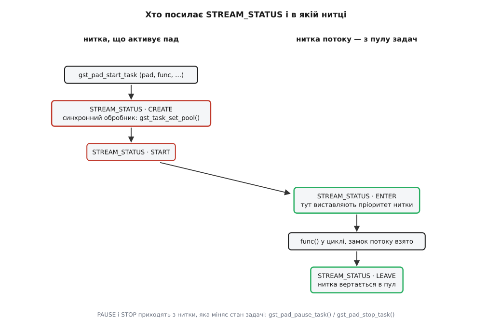

# 📋 Черги, задачі й пули ниток: усе, чим керують межею ниток

Довідка з того, чим у GStreamer задають і налаштовують межу між нитками: властивості й сигнали трьох елементів-черг (`queue`, `queue2`, `multiqueue`) з типовими значеннями, функції запуску й спину задачі на паді, `GstTask` і пули ниток, повідомлення `STREAM_STATUS`, яким застосунок дотягується до цих ниток іще до їхнього народження, макроси замка потоку та єдиний законний спосіб виконати щось поза ниткою потоку. Потрібна тоді, коли треба точно знати, як називається властивість, у яких одиницях її міряють, з якої версії вона є і з якої нитки прилетить ваш зворотний виклик. Числа й сигнатури взято із заголовків і коду елементів гілки 1.28 (випуск 1.28.0 — 27 січня 2026 року, поточний стабільний — 1.28.5); де щось з'явилося пізніше за 1.0, версію вказано окремо.

## Три черги поруч

Усі три — межа ниток, але зроблені під різне, і плутати їх дорого.

| | `queue` | `queue2` | `multiqueue` |
| --- | --- | --- | --- |
| Головне призначення | межа ниток | буферизація вхідного потоку | межа ниток одразу на кілька доріжок |
| Нитки | одна, на вихідному паді | одна, на вихідному паді | по одній на КОЖЕН вихідний пад |
| Типові межі | 200 буферів / 10 МіБ / 1 с | 100 буферів / 2 МіБ / 2 с | 5 буферів / 10 МіБ / 2 с — на кожну чергу |
| Свідома втрата (`leaky`) | є | немає | немає |
| Повідомлення `BUFFERING` | немає | за `use-buffering` | за `use-buffering` |
| Запас поза пам'яттю | немає | кільце в пам'яті або файл на диску | немає |
| Вихід нікуди не веде | нитка стає на паузу | нитка стає на паузу | терпить `unlinked-cache-time` |
| Пади | статичні `sink`/`src` | статичні `sink`/`src` | на запит: `sink_%u`, до нього сам `src_%u` |

## queue: властивості

Три межі працюють **водночас**, і вхід блокується, щойно спрацює будь-яка з них. Нуль вимикає межу; усі три нулі дають чергу без стелі.

| Властивість | Тип | Типове | Що робить |
| --- | --- | --- | --- |
| `max-size-buffers` | `guint` | 200 | стеля за кількістю буферів; 0 — не рахувати |
| `max-size-bytes` | `guint` | 10485760 (10 МіБ) | стеля за обсягом даних; 0 — не рахувати |
| `max-size-time` | `guint64` | 1000000000 (1 с) | стеля за тривалістю вмісту в наносекундах; 0 — не рахувати |
| `min-threshold-buffers` | `guint` | 0 | доки в черзі менше — вона вважається порожньою й **не віддає нічого вниз** |
| `min-threshold-bytes` | `guint` | 0 | те саме за обсягом |
| `min-threshold-time` | `guint64` | 0 | те саме за тривалістю |
| `leaky` | `GstQueueLeaky` | `no` (0) | що робити на переповненні замість блокування |
| `flush-on-eos` | `gboolean` | `FALSE` | на `EOS` викинути весь наявний вміст замість того, щоб дограти його (з 1.2) |
| `silent` | `gboolean` | `FALSE` | не сигналити зовсім — черга стає легшою |
| `notify-levels` | `gboolean` | `FALSE` | слати `notify::current-level-*` на кожній зміні рівня (з 1.26) |
| `current-level-buffers` | `guint` | — | скільки буферів лежить зараз (лише читання) |
| `current-level-bytes` | `guint` | — | скільки байтів лежить зараз (лише читання) |
| `current-level-time` | `guint64` | — | скільки наносекунд вмісту лежить зараз (лише читання) |

Пороги `min-threshold-*` — це передбуферизація в чистому вигляді: черга набирає задане, і лише тоді її нитка починає штовхати. Одиниці ті самі, що й у стель, і поводяться вони дзеркально — спрацьовує той поріг, який набереться останнім.

### leaky: хто саме гине

| Значення | Число | Що викидається |
| --- | --- | --- |
| `no` | 0 | нічого; вхід блокується до звільнення місця |
| `upstream` | 1 | **новоприбулий** буфер — той, що саме зайшов і не вмістився |
| `downstream` | 2 | **найстаріший** буфер із голови черги, доки не звільниться місце для новоприбулого |

Назва вказує на бік, у який черга протікає, а не на те, чий буфер шкода. `leaky=downstream` лишає споживачеві найсвіжіші дані — саме це потрібно живому джерелу; `leaky=upstream` лишає найстаріші, що має сенс хіба для потоку, у якому важливий початок.

### Виклик

```sh
# коротка черга без стель за обсягом і часом, із викиданням старого
gst-launch-1.0 videotestsrc ! queue max-size-buffers=3 max-size-bytes=0 \
    max-size-time=0 leaky=downstream ! autovideosink
```

```c
GstElement *q = gst_element_factory_make ("queue", "q0");

g_object_set (q,
    "max-size-buffers", (guint) 3,
    "max-size-bytes",   (guint) 0,
    "max-size-time",    (guint64) 0,          /* приведення ОБОВ'ЯЗКОВЕ */
    "leaky",            2,                    /* GST_QUEUE_LEAK_DOWNSTREAM */
    NULL);

guint level;
g_object_get (q, "current-level-buffers", &level, NULL);   /* безпечно з будь-якої нитки */
```

Приведення в `g_object_set()` — не косметика. Список змінної довжини не знає типів, і `guint64`-властивість, якій передали звичайний `0`, прочитає у своїх восьми байтах чотири ваші й чотири чужі. Помилка мовчазна й плаваюча, тож `max-size-time` і всі інші `guint64` пишуть із явним `(guint64)` або через `GST_SECOND`.

## queue: сигнали

| Сигнал | Коли | З якої нитки |
| --- | --- | --- |
| `overrun` | черга заповнилася | з нитки того, хто штовхає **згори** |
| `underrun` | черга спорожніла | з **власної** нитки черги |
| `running` | набралося `min-threshold-*`, робота відновилася | з тієї нитки, яка це виявила |
| `pushing` | черга знову має що віддавати вниз | з власної нитки черги |

Три речі, які варто знати про ці сигнали, перш ніж на них спиратися.

**Обробник виконується в нитці потоку.** Не в нитці застосунку й не в головному циклі. Усе, що там довше за кілька мікросекунд, — це затримка всього ланцюга; усе, що чіпає інтерфейс користувача, — падіння.

**Черга віддає свій внутрішній замок перед викликом обробника.** Тому з обробника можна міняти властивості тієї самої черги — зокрема підняти `max-size-buffers` просто на `overrun`. Ціна цієї свободи в тому, що між перевіркою й вашим викликом стан устигає змінитися: черга свідомо перевіряє умову ще раз після повернення з обробника.

**`silent=TRUE` вимикає всі чотири разом.** Це не «тихий режим журналу», а відмова від сповіщень заради дешевизни: на конвеєрі з десятками черг постійна емісія сигналів коштує помітно.

## queue2: буферизація, а не паралельність

`queue2` теж розділяє нитки, але зроблена не заради цього. Її задача — накопичити запас перед відтворенням і сказати застосункові, коли запасу досить.

| Властивість | Тип | Типове | Що робить |
| --- | --- | --- | --- |
| `max-size-buffers` | `guint` | 100 | стеля за кількістю буферів |
| `max-size-bytes` | `guint` | 2097152 (2 МіБ) | стеля за обсягом |
| `max-size-time` | `guint64` | 2000000000 (2 с) | стеля за тривалістю |
| `use-buffering` | `gboolean` | `FALSE` | постити `GST_MESSAGE_BUFFERING` з відсотком наповнення |
| `low-watermark` | `gdouble` | 0.01 | частка наповнення, нижче за яку буферизація починається знову |
| `high-watermark` | `gdouble` | 0.99 | частка наповнення, на якій буферизація вважається закінченою |
| `low-percent` / `high-percent` | `gint` | — | ті самі пороги в цілих відсотках; позначені застарілими на користь позначок води |
| `ring-buffer-max-size` | `guint64` | 0 | перетворити чергу на кільце заданого розміру в пам'яті; 0 — вимкнено |
| `temp-template` | `gchar *` | `NULL` | шаблон імені тимчасового файлу з `XXXXXX`; заданий — вмикає запас **на диску** |
| `temp-location` | `gchar *` | `NULL` | яке ім'я справді дісталося (лише читання) |
| `temp-remove` | `gboolean` | `TRUE` | прибрати файл при поверненні в `READY` |
| `use-rate-estimate` | `gboolean` | `TRUE` | оцінювати темп потоку, щоб рахувати рівень у часі |
| `use-bitrate-query` | `gboolean` | `TRUE` | питати бітову швидкість у сусіда знизу |
| `use-tags-bitrate` | `gboolean` | `FALSE` | брати бітову швидкість із міток згори |
| `bitrate` | `guint64` | — | чинний перерахунок «байти ↔ час» (лише читання) |
| `avg-in-rate` | `gint64` | — | середній вхідний темп (лише читання) |

Три режими зберігання виключають один одного й обираються самими властивостями:

| Режим | Умова | Наслідок |
| --- | --- | --- |
| у пам'яті | нічого не задано | звичайна черга зі стелями |
| кільце в пам'яті | `ring-buffer-max-size` > 0 | старе перезаписується новим, як у [кільцевому буфері](root:sf-algorithms/ring-buffer) — структурі, де кінець змикається з початком |
| файл на диску | задано `temp-template` | запас обмежений лише диском; звідси береться перемотування вже завантаженим |

Властивості `leaky` тут немає й бути не може: `queue2` стоїть там, де втрачати не можна, і на переповненні просто блокує вхід. Що робити з повідомленнями `BUFFERING` і чому «додав `queue2` — і затримка виросла на дві секунди» — у темі [затримка й буферизація](root:sys-media/latency-and-buffering), де розібрано, як запас перетворюється на затримку.

## multiqueue: набір черг зі спільним керуванням

| Властивість | Тип | Типове | Що робить |
| --- | --- | --- | --- |
| `max-size-buffers` | `guint` | 5 | стеля **кожної** черги за буферами |
| `max-size-bytes` | `guint` | 10485760 (10 МіБ) | стеля кожної черги за обсягом |
| `max-size-time` | `guint64` | 2000000000 (2 с) | стеля кожної черги за тривалістю |
| `extra-size-buffers` / `-bytes` / `-time` | — | 5 / 10 МіБ / 3 с | у коді позначені як **не реалізовані** — не спиратися |
| `unlinked-cache-time` | `guint64` | 250000000 (250 мс) | скільки приймати в гілку, чий вихід іще нікуди не веде |
| `sync-by-running-time` | `gboolean` | `FALSE` | вирівнювати гілки за часом перебігу, а не за розміром черг |
| `use-buffering` | `gboolean` | `FALSE` | постити `GST_MESSAGE_BUFFERING` |
| `low-watermark` / `high-watermark` | `gdouble` | 0.01 / 0.99 | пороги буферизації (з 1.10) |
| `use-interleave` | `gboolean` | `FALSE` | підганяти межі за виміряним перекосом доріжок у контейнері |
| `min-interleave-time` | `guint64` | 250000000 (250 мс) | нижня межа для цієї підгонки |
| `stats` | `GstStructure *` | — | зріз стану всіх черг одним викликом (з 1.18, лише читання) |

Сигнали — `overrun` (котрась черга наповнилася) і `underrun` (усі черги порожні).

Пади живуть парами: просите вхідний — вихідний з'являється сам із тим самим номером.

```c
GstPad *sink = gst_element_request_pad_simple (mq, "sink_%u");  /* з 1.20; давніше gst_element_get_request_pad() */
GstPad *src  = gst_element_get_static_pad (mq, "src_0");        /* парний до sink_0 */
```

У кожного такого пада є власні властивості:

| Властивість пада | Тип | Типове | Що робить |
| --- | --- | --- | --- |
| `group-id` | `guint` | 0 | до якої групи належить доріжка (з 1.10) |
| `current-level-buffers` | `guint` | — | рівень саме цієї черги (з 1.18) |
| `current-level-bytes` | `guint` | — | те саме в байтах (з 1.18) |
| `current-level-time` | `guint64` | — | те саме в наносекундах (з 1.18) |

Заради цих чотирьох рядків і варто знати про `GstMultiQueuePad`: у конвеєрі з п'ятьма доріжками одна спільна властивість елемента нічого не скаже про те, яка саме гілка голодує. Хто й навіщо будує такі конвеєри, — у темі [автодобір елементів](root:sys-media/autoplug-decodebin), де `multiqueue` з'являється як обов'язкова частина `decodebin`.

## Задача на паді

Чотири функції керують ниткою пада. Це те, чим користується автор елемента; застосунок їх зазвичай не кличе, але мусить розуміти, коли вони спрацьовують під ним.

| Сигнатура | Що робить |
| --- | --- |
| `gboolean gst_pad_start_task (GstPad *pad, GstTaskFunction func, gpointer user_data, GDestroyNotify notify)` | створює задачу (якщо її ще нема) і запускає нитку, яка безкінечно кличе `func` |
| `gboolean gst_pad_pause_task (GstPad *pad)` | ставить задачу на паузу; нитка з пулу не звільняється |
| `gboolean gst_pad_stop_task (GstPad *pad)` | спиняє задачу, чекає завершення нитки й повертає її пулу |
| `GstTaskState gst_pad_get_task_state (GstPad *pad)` | стан задачі; без задачі — `GST_TASK_STOPPED` (з 1.12) |

Тип функції циклу — `typedef void (*GstTaskFunction) (gpointer user_data)`. Жодного значення вона не повертає: спинити себе задача може лише викликом `gst_pad_pause_task()`.

Головна властивість цієї пари: **`gst_pad_start_task()` віддає задачі замок потоку пада**, і замок береться перед кожним викликом `func`. Тобто ваша функція циклу завжди виконується під замком потоку, і брати його вручну всередині не треба.

Звідси — правила про те, звідки що кликати:

| Виклик | З самої функції циклу | З іншої нитки |
| --- | --- | --- |
| `gst_pad_pause_task()` | можна; повертається одразу | чекає, доки поточний виклик `func` завершиться |
| `gst_pad_stop_task()` | ⛔ не можна: `gst_task_join()` виявляє спробу приєднати нитку до самої себе, друкує попередження й повертає `FALSE` | чекає й приєднує нитку |

Мінімальна робоча активація в режимі витягування:

```c
static void
my_loop (gpointer user_data)             /* виконується під замком потоку */
{
  GstPad *pad = user_data;
  MyElement *self = MY_ELEMENT (gst_pad_get_parent (pad));
  GstBuffer *buf = NULL;

  GstFlowReturn ret = gst_pad_pull_range (self->sinkpad, self->offset, 4096, &buf);
  if (ret != GST_FLOW_OK) {
    gst_pad_pause_task (pad);            /* спиняємо СЕБЕ саме так */
    goto done;
  }
  self->offset += gst_buffer_get_size (buf);

  if (gst_pad_push (pad, buf) != GST_FLOW_OK)
    gst_pad_pause_task (pad);

done:
  gst_object_unref (self);
}

static gboolean
my_activate_mode (GstPad *pad, GstObject *parent, GstPadMode mode, gboolean active)
{
  if (mode != GST_PAD_MODE_PULL)
    return FALSE;                        /* у режимі штовхання нитки тут не буде */

  return active ? gst_pad_start_task (pad, my_loop, pad, NULL)
                : gst_pad_stop_task (pad);
}
```

`GstPadMode` має рівно три значення: `GST_PAD_MODE_NONE` (пад не активний), `GST_PAD_MODE_PUSH` (дані приходять викликом згори) і `GST_PAD_MODE_PULL` (пад сам витягує їх знизу). Задачу заводять для того режиму, у якому пад мусить бути рушієм.

## GstTask: сам об'єкт нитки

| Сигнатура | Примітка |
| --- | --- |
| `GstTask *gst_task_new (GstTaskFunction func, gpointer user_data, GDestroyNotify notify)` | сам по собі не стартує |
| `void gst_task_set_lock (GstTask *task, GRecMutex *mutex)` | **обов'язково** до першого запуску |
| `void gst_task_set_pool (GstTask *task, GstTaskPool *pool)` | звідки брати нитку |
| `GstTaskPool *gst_task_get_pool (GstTask *task)` | посилання ваше — звільняти |
| `gboolean gst_task_set_state (GstTask *task, GstTaskState state)` | те саме, що три функції нижче |
| `gboolean gst_task_start (GstTask *task)` | `STOPPED`/`PAUSED` → `STARTED` |
| `gboolean gst_task_pause (GstTask *task)` | `STARTED` → `PAUSED`, нитка лишається |
| `gboolean gst_task_resume (GstTask *task)` | `PAUSED` → `STARTED` без повторного входу в нитку (з 1.18) |
| `gboolean gst_task_stop (GstTask *task)` | просить зупинитися; не чекає |
| `gboolean gst_task_join (GstTask *task)` | чекає, доки нитка справді вийде |
| `GstTaskState gst_task_get_state (GstTask *task)` | поточний стан |
| `void gst_task_set_enter_callback (GstTask *task, GstTaskThreadFunc f, gpointer d, GDestroyNotify n)` | викликається **всередині** нитки на вході |
| `void gst_task_set_leave_callback (GstTask *task, GstTaskThreadFunc f, gpointer d, GDestroyNotify n)` | те саме на виході |

Станів рівно три: `GST_TASK_STARTED` (0) — нитка крутить цикл, `GST_TASK_STOPPED` (1) — нитки нема, `GST_TASK_PAUSED` (2) — нитка є, але спить.

Замок із `gst_task_set_lock()` — не деталь реалізації, а частина контракту: без нього задача не стартує. Для задачі пада його ставить сам `gst_pad_start_task()`, і це саме замок потоку того пада.

## Пул задач

Задача не створює нитку — вона просить її в пулу. Типовий пул — обгортка над `GThreadPool` без обмеження кількості ниток: звільнена нитка не вмирає, а чекає наступної задачі, тож поставити чергу не означає щоразу платити за створення нитки. Загальна механіка такого повторного використання — у темі [пул потоків](root:sf-tasks/thread-pool).

| Сигнатура | Примітка |
| --- | --- |
| `GstTaskPool *gst_task_pool_new (void)` | типовий пул на `GThreadPool` |
| `void gst_task_pool_prepare (GstTaskPool *pool, GError **error)` | привести пул у готовність приймати задачі |
| `gpointer gst_task_pool_push (GstTaskPool *pool, GstTaskPoolFunction func, gpointer user_data, GError **error)` | пустити функцію в нитку; повертає ручку або `NULL` |
| `void gst_task_pool_join (GstTaskPool *pool, gpointer id)` | дочекатися нитки за ручкою |
| `void gst_task_pool_dispose_handle (GstTaskPool *pool, gpointer id)` | віддати ручку, якщо приєднуватися не збираєтеся (з 1.20) |
| `void gst_task_pool_cleanup (GstTaskPool *pool)` | дочекатися всіх; переважно для тестів |

Тип функції — `typedef void (*GstTaskPoolFunction) (void *user_data)`. Власний пул роблять підкласом, перекриваючи ці ж дії: саме так дають ниткам реальночасовий клас, прив'язують їх до ядер або рахують, скільки їх узагалі створено.

Готовий обмежений пул з'явився в 1.20:

| Сигнатура | Примітка |
| --- | --- |
| `GstTaskPool *gst_shared_task_pool_new (void)` | пул зі спільними нитками (з 1.20) |
| `void gst_shared_task_pool_set_max_threads (GstSharedTaskPool *pool, guint max_threads)` | стеля; 0 фактично заморожує пул |
| `guint gst_shared_task_pool_get_max_threads (GstSharedTaskPool *pool)` | чинна стеля |

Властивість `max-threads` типово дорівнює **одиниці**, і документація прямо застерігає не давати такому пулові взаємозалежні задачі — зокрема задачі падів. Причина механічна: задача черги чекає на задачу свого сусіда, а якщо обидві дістануться однієї нитки, чекання стає вічним. Пул із однією ниткою добре підходить для незалежної роботи (скажімо, для елемента, що періодично щось рахує збоку), і категорично не підходить для ланцюга.

## STREAM_STATUS: як дотягтися до нитки

Це єдиний штатний спосіб втрутитися в нитки конвеєра ззовні. Кожен елемент, що заводить нитку потоку, повідомляє про це на [шину](root:sys-media/bus-and-messages) — спільний канал, яким конвеєр говорить із застосунком.

| Тип | Число | Коли й де |
| --- | --- | --- |
| `GST_STREAM_STATUS_TYPE_CREATE` | 0 | нитку **зараз створять**; ще з нитки, що активує пад |
| `GST_STREAM_STATUS_TYPE_ENTER` | 1 | нитка **щойно ввійшла** у свій цикл — уже зсередини неї |
| `GST_STREAM_STATUS_TYPE_LEAVE` | 2 | нитка виходить із циклу — теж зсередини неї |
| `GST_STREAM_STATUS_TYPE_DESTROY` | 3 | нитку знищено |
| `GST_STREAM_STATUS_TYPE_START` | 8 | задачу запущено |
| `GST_STREAM_STATUS_TYPE_PAUSE` | 9 | задачу поставлено на паузу |
| `GST_STREAM_STATUS_TYPE_STOP` | 10 | задачу зупинено |

Числа не суцільні навмисно: 0–3 описують життя **нитки**, 8–10 — стан **задачі**, і одне з одним вони не збігаються (задача на паузі свою нитку не втрачає).

| Сигнатура | Хто кличе |
| --- | --- |
| `GstMessage *gst_message_new_stream_status (GstObject *src, GstStreamStatusType type, GstElement *owner)` | автор елемента |
| `void gst_message_set_stream_status_object (GstMessage *message, const GValue *object)` | автор елемента — кладе всередину саму задачу |
| `void gst_message_parse_stream_status (GstMessage *message, GstStreamStatusType *type, GstElement **owner)` | застосунок |
| `const GValue *gst_message_get_stream_status_object (GstMessage *message)` | застосунок — дістає задачу |



*До ENTER ви ще в старій нитці й можете підмінити пул; від ENTER ви вже в новій і можете міняти її властивості.*

> 🔧 **Навіщо це.** Обробник має бути **синхронним** — не звичайним стеженням за шиною, а функцією, яку кличуть просто в нитці, що постить повідомлення. Причина одна: `CREATE` означає «нитку зараз створять», і якщо на момент повернення з обробника пул не підмінено, задача візьме типовий. Асинхронна доставка через головний цикл приходить, коли нитка вже крутиться, і міняти пул пізно.

```c
static GstTaskPool *my_pool;              /* створений один раз при старті застосунку */

static GstBusSyncReply
sync_handler (GstBus *bus, GstMessage *msg, gpointer user_data)
{
  if (GST_MESSAGE_TYPE (msg) != GST_MESSAGE_STREAM_STATUS)
    return GST_BUS_PASS;

  GstStreamStatusType type;
  GstElement *owner;
  gst_message_parse_stream_status (msg, &type, &owner);

  const GValue *val = gst_message_get_stream_status_object (msg);

  switch (type) {
    case GST_STREAM_STATUS_TYPE_CREATE: {
      GstTask *task = GST_TASK (g_value_get_object (val));
      gst_task_set_pool (task, my_pool);      /* нитки ще нема — саме час */
      break;
    }
    case GST_STREAM_STATUS_TYPE_ENTER:
      /* ми ВСЕРЕДИНІ нової нитки: пріоритет виставляють тільки звідси */
      set_thread_priority_for_self ();
      break;
    default:
      break;
  }
  return GST_BUS_PASS;                        /* хай іде далі, у звичайне стеження */
}

GstBus *bus = gst_element_get_bus (pipeline);
gst_bus_set_sync_handler (bus, sync_handler, NULL, NULL);
gst_object_unref (bus);
```

Чому пріоритет ставлять саме на `ENTER`, а не на `CREATE`: політику планувальника задають для нитки, у якій перебувають, а на `CREATE` потрібної нитки ще не існує. Що саме означає підвищений клас і чим реальночасова політика відрізняється від просто меншого `nice`, — у темі [пріоритети, nice і реальночасові класи](root:sys-unix/priority-nice-realtime).

## Замок потоку

| Макрос | Розгортається в |
| --- | --- |
| `GST_PAD_GET_STREAM_LOCK(pad)` | `&(GST_PAD_CAST (pad)->stream_rec_lock)` — це `GRecMutex` |
| `GST_PAD_STREAM_LOCK(pad)` | `g_rec_mutex_lock (…)` |
| `GST_PAD_STREAM_TRYLOCK(pad)` | `g_rec_mutex_trylock (…)` |
| `GST_PAD_STREAM_UNLOCK(pad)` | `g_rec_mutex_unlock (…)` |

Замок **рекурсивний**: та сама нитка може взяти його повторно, і саме тому виклик пробою чи вкладений `gst_pad_push()` не заклинює сам на собі.

Що він серіалізує: усе, що йде падом як дані, і ті події, які позначені серіалізованими. Тобто буфер і серіалізована подія ніколи не проходять падом одночасно й ніколи не міняються місцями. Що таке [події й запити на падах](root:sys-media/events-and-queries) — сигнали, що йдуть тим самим шляхом, що й дані, або назустріч їм, — розібрано окремо; тут важлива лише одна їхня властивість.

| Подія | Напрям | Серіалізована? |
| --- | --- | --- |
| `STREAM_START`, `CAPS`, `SEGMENT`, `EOS` | униз | так (і липкі) |
| `FLUSH_START` | обидва | **ні** |
| `FLUSH_STOP` | обидва | так |
| `SEEK`, `QOS`, `RECONFIGURE` | угору | ні |

Один рядок цієї таблиці варто прочитати уважно. `FLUSH_START` **навмисно** не серіалізована — інакше вона стала б у чергу за замком потоку, який тримає нитка, що саме зараз спить у повній черзі, і скидання ніколи б не почалося. Не чекаючи на замок, ця подія проходить наскрізь, вмикає в чергах прапорець скидання й будить усіх, хто спить. `FLUSH_STOP`, навпаки, серіалізована: вона має прийти тоді, коли нитки вже вийшли з блокувань, і повернути їх до нормальної роботи. Уся послідовність — у темі [перемотування і скидання конвеєра](root:sys-media/seeking-and-flush).

Дві дрібні, але часто потрібні функції поруч:

| Сигнатура | Примітка |
| --- | --- |
| `gchar *gst_pad_get_stream_id (GstPad *pad)` | ідентифікатор потоку з липкої `STREAM_START`; звільняти `g_free()` (з 1.2) |
| `GstStream *gst_pad_get_stream (GstPad *pad)` | сам об'єкт потоку, якщо він є; звільняти `gst_object_unref()` (з 1.10) |

Обидві повертають `NULL`, доки липка подія не дійшла до пада, — тобто до першого буфера відповідь може бути порожньою, і це нормальний стан, а не збій.

## Виконати щось поза ниткою потоку

Зі зворотного виклику, що прилетів із конвеєра, не можна ні міняти стан конвеєра, ні чекати на нього: нитка чекатиме на саму себе. Для виходу з нитки потоку є окремий виклик, який за час свого життя встиг двічі змінити ім'я.

| Версія | Що кликати |
| --- | --- |
| 1.10 … 1.26 | `void gst_element_call_async (GstElement *element, GstElementCallAsyncFunc func, gpointer user_data, GDestroyNotify destroy_notify)` |
| 1.28 і далі | `void gst_object_call_async (GstObject *object, GstObjectCallAsyncFunc func, gpointer user_data)` — той самий сенс, ширший тип першого аргументу |
| 1.28 і далі | `void gst_call_async (GstCallAsyncFunc func, gpointer user_data)` — коли жоден об'єкт не потрібен |

Типи зворотних викликів відповідно: `void (*GstElementCallAsyncFunc) (GstElement *, gpointer)`, `void (*GstObjectCallAsyncFunc) (GstObject *, gpointer)`, `void (*GstCallAsyncFunc) (gpointer)`.

Стара форма з 1.28 позначена застарілою, але працює й далі — гілка 1.x зберігає сумісність. Помітна відмінність нових форм: у них немає `GDestroyNotify`, тож звільнення `user_data` тепер цілком на вашій совісті — робіть це наприкінці самого зворотного виклику.

## Версії одним поглядом

| Версія | Що з'явилося |
| --- | --- |
| 1.2 | `queue flush-on-eos`, `gst_pad_get_stream_id()` |
| 1.10 | `gst_element_call_async()`, `gst_pad_get_stream()`, позначки води й `group-id` у `multiqueue` |
| 1.12 | `gst_pad_get_task_state()` |
| 1.18 | `gst_task_resume()`, `current-level-*` на падах `multiqueue`, властивість `stats` |
| 1.20 | `GstSharedTaskPool`, `gst_task_pool_dispose_handle()`, `gst_element_request_pad_simple()` |
| 1.26 | `queue notify-levels` |
| 1.28 | `gst_object_call_async()`, `gst_call_async()`; `gst_element_call_async()` застаріла |
