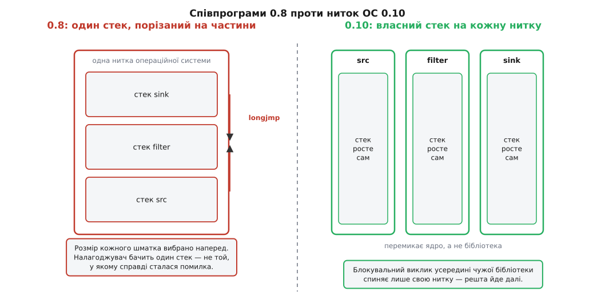

# 📜 Як GStreamer позбувся планувальника

Сьогодні в GStreamer немає жодного модуля з назвою «планувальник»: нитка з'являється там, де пад завів собі задачу, і більше ніде. Так було не завжди. У версіях 0.x до 0.10 планувальник був окремою підключною частиною ядра — його можна було **вибрати змінною середовища**, як вибирають драйвер, і кожен вибір давав конвеєрові іншу поведінку. Ця історія варта переказу, бо вона про рішення, яке рідко приймають свідомо: **не писати власне планування взагалі**.

## Сім планувальників на вибір

У 0.8 команда `gst-inspect-0.8` показувала серед плагінів не лише елементи, а й планувальники. Список, що фігурує в тогочасних повідомленнях користувачів і в архівах розсилки, виглядав приблизно так:

```
basicgthread   базовий, на співпрограмах gthread
basicomega     базовий, на співпрограмах omega
entrygthread   «вхідний», на співпрограмах gthread
fairgthread    «справедливий», на співпрограмах gthread
optgthread     «оптимальний», на співпрограмах gthread
optomega       «оптимальний», на співпрограмах omega
opt            «оптимальний», БЕЗ співпрограм
```

Вибір робився змінною `GST_SCHEDULER`. Тобто той самий конвеєр із тих самих елементів міг працювати, зависати або падати залежно від того, що написано в середовищі — при однаковому коді застосунку й однакових плагінах. *(Статус доказовості: перелік і сама змінна відтворені з виводу `gst-inspect-0.8` у користувацьких повідомленнях і з листування розсилки; це не парадний документ проєкту, а слід реальної експлуатації.)*

Уже сам вигляд цього списку багато каже. Коли в системи є «базовий», «справедливий» і два різні «оптимальні» планувальники, це означає не багатство вибору, а те, що **жоден із них не працює в усіх випадках**. Кожен новий підключний планувальник з'являвся тому, що попередній ламався на якомусь класі конвеєрів.

## Що таке співпрограма і чому вона спокушала

Щоб зрозуміти, звідки взявся такий зоопарк, треба знати, на чому все це стояло.

Задача планувальника в 0.8 була така: конвеєр — це елементи, які треба виконувати по черзі, і кожен з них хоче писати свій код у природному вигляді. Джерелові природно написати «читай файл, доки не скінчиться». Розбирачеві природно написати «прочитай заголовок, потім стільки байтів, скільки в ньому вказано». Обидва хочуть **власний цикл** і власну послідовність кроків — а отже, власний стек викликів, у якому ця послідовність живе між зупинками.

Найпряміше рішення — дати кожному окрему нитку операційної системи. Але на початку 2000-х нитки на Linux були дорогі й підозрілі: до появи NPTL кожна нитка була важким об'єктом із власним псевдопроцесом, створення коштувало помітно, а поведінка сигналів була, м'яко кажучи, своєрідна. Проєкт хотів дешевше — і взяв **співпрограми** (cothreads).

Ідея співпрограми проста до нахабства. Береться стек однієї-єдиної нитки й ділиться на шматки. Кожен шматок оголошується стеком окремої «нитки». Перемикання — це не системний виклик, а `longjmp` у чужий шматок: вказівник стека стрибає туди, звідки той шматок востаннє вийшов, і виконання продовжується з іншого місця, у чужому контексті. Ані ядро, ані планувальник ОС про це нічого не знають.



*Уся різниця — у тому, хто нарізає стек: бібліотека наперед і фіксовано чи ядро на вимогу.*

Плата в цій ідеї заплачена наперед. Це та сама конструкція, що й у [співпрограм](topic:sys-plang-cpp/coroutines) взагалі, тільки зроблена не мовою, а руками поверх [стека викликів](topic:sf-lang/stack-lifo) — і тому вона знає про програму рівно стільки, скільки автор бібліотеки встиг передбачити.

## Де вона ламалася

Слабких місць виявилося чотири, і всі вони — не дрібниці реалізації, а наслідки самої ідеї.

**Перше: розмір шматка вибирають наперед.** Стек звичайної нитки росте на вимогу, бо ядро віддає сторінки в міру потреби. Стек співпрограми — це виділений блок фіксованої довжини. Занадто малий — і глибока рекурсія в декодері тихо затирає сусідній шматок; занадто великий — і кожна співпрограма з'їдає пам'ять просто фактом свого існування. Класичне [переповнення стека](topic:sf-lang/stack-overflow) тут не дає ані сигналу, ані діагностики: воно псує чужі дані, а не наштовхується на сторожову сторінку.

**Друге: чужі бібліотеки нічого про це не знають.** Конвеєр майже цілком складається з коду, який GStreamer не писав, — кодеки, парсери, драйвери звуку. Такий код цілком законно тримає стан у пам'яті, прив'язаній до нитки, бере замки, викликає блокувальні системні виклики. Для нього «нитка» — це те, що каже `pthread_self()`, і воно не змінюється при стрибку між співпрограмами. Отже: замок, узятий в одній співпрограмі, з погляду бібліотеки вже взято «цією ниткою» — і друга співпрограма спокійно заходить у критичну секцію, яку мала б чекати. А блокувальний виклик усередині будь-якої співпрограми спиняє **всі** — бо нитка ОС насправді одна.

**Третє: налагоджувати неможливо.** Аварія в декодері друкує стек, у якому кадрів або немає, або вони чужі: [обхід стека](topic:sf-devices/stack-walking) спирається на цілісний ланцюг кадрів, а тут ланцюг щойно перескочив в інший блок пам'яті. Інструменти пам'яті звітують про звертання за межі, яких програміст не робив. Тогочасні повідомлення про помилки в базовому планувальнику — падіння прямо у функції створення співпрограми — саме такого ґатунку. *(Статус: підтверджено архівом розсилки gstreamer-devel за лютий 2004 року, тема «opt is broken».)*

**Четверте: переносність.** Нарізання стека й стрибки по ньому — це операція, яка залежить від того, куди росте стек, як влаштований `setjmp` у конкретній бібліотеці C, чи дозволяє система робити стеком довільну ділянку пам'яті. Портативної версії не було й не могло бути без переписування під кожну платформу; у тій самій розсилці обговорювали, що навіть через стандартний `makecontext` зробити це переносно важко.

Складіть чотири разом і отримаєте систему, у якій **кожна помилка виглядає як помилка планувальника, а не як помилка того, хто її зробив**. Саме тому планувальників стало сім: коли причину знайти неможливо, лишається переписати механізм і сподіватися, що на цьому конвеєрі поведе себе краще. Пізніший `opt` уже обходився без співпрограм — це був перший крок у той бік, куди зрештою пішли всі.

## 0.9: планувальник розчиняється в падах

Розв'язка настала в серії 0.9 — короткій нестабільній гілці, оголошеною метою якої було зробити GStreamer безпечним щодо ниток. Вона привела до 0.10, що вийшла в грудні 2005 року (перша, 0.10.0, під кодовою назвою «Maroilles»). Основну частину цієї переробки ядра зробив Вім Тейманс (Wim Taymans) — його ім'я стоїть у копірайті `gsttask.c` поруч із іменем Еріка Волтінсена (Erik Walthinsen), автора першого ядра 1999–2000 років. *(Статус: підтверджено заголовком файлу в дереві GStreamer і сторінками релізів.)*

Заміна виявилася не новим, кращим планувальником, а **відсутністю планувальника**.

Нова модель уміщається в один рядок: пади самі штовхають дані вниз або тягнуть згори, а нитка живе на паді — у вигляді задачі (`GstTask`), яка просто крутить у циклі одну функцію. Хто така задача, видно з її документації: «`GstTask` використовується `GstElement` і `GstPad`, щоб надати нитки для передавання даних у конвеєрі». Нитку вона бере зі звичайного пулу ниток ОС.

Зверніть увагу, чого тут **немає**. Немає центру, який вирішує, кого виконувати наступним. Ніхто не рахує пріоритетів, не будує черг готовності, не перемикає контексти. Питання «хто зараз виконується» більше не має відповіді на рівні GStreamer — воно повністю віддане [планувальникові операційної системи](topic:sf-os/scheduler), який його й так розв'язує для всієї машини.

Це і є суть переходу: **не робити краще те, що вже добре роблять під тобою**. Ядро вміє відбирати час у нитки, що крутиться марно; вміє тримати сплячу нитку без витрат; вміє розкидати нитки по ядрах, чого співпрограми не вміють у принципі — одна нитка ОС не може виконуватися на двох процесорах. З появою NPTL (документ Ульріха Дреппера та Інґо Молнара, лютий 2003; glibc 2.3.2, ядро 2.6) зникла й головна початкова причина боятися ниток: створення стало дешевим, а поведінка — передбачуваною. Аргумент «нитки надто дорогі» перестав бути правдою рівно тоді, коли GStreamer перестав на нього спиратися.

Розплата за це рішення теж є, і вона чесна: коли конвеєр хоче ще одну нитку, її треба **попросити явно**, поставивши `queue`. Планувальник більше не «здогадається». Але це та ціна, яку видно в описі конвеєра — а не та, що вилазить у чужому стеку через два тижні.

## Що зникло разом із планувальником

Прибрати центральний механізм означає прибрати все, що на нього спиралося. Три зникнення з документа порту 0.8 → 0.10 варті окремої згадки, бо кожне з них тепер здається самоочевидним, хоча жодне не є самостійним рішенням — усі три випливають з одного.

**Зник `gst_bin_iterate()`.** У 0.8 застосунок сам крутив конвеєр: викликав ітерацію, і всередині цього виклику планувальник просував дані на один крок. Порт формулює зникнення так: «Конвеєри крутитимуться у власній нитці, а застосунки можуть просто запускати `GMainLoop`». Тобто зникла найпомітніша для програміста річ — обов'язок особисто гнати дані вперед.

**Зник об'єкт `GstThread`.** Раніше нитка була **елементом**: щоб частина конвеєра йшла окремо, її клали в спеціальний контейнер. Порт: «Застосунки тепер можуть просто класти елементи в конвеєр, за потреби з кількома елементами `queue` між ними для буферизації, а GStreamer подбає про створення ниток усередині». Нитка перестала бути річчю, яку ставлять у граф, і стала наслідком того, як граф улаштований.

**Зміни стану стали асинхронними.** Формулювання порту точне: «Через нову цілком багатопотокову природу GStreamer-0.10 зміни стану не завжди миттєві, зокрема перехід зі стану `READY` у `PAUSED`». Причина пряма: у `PAUSED` конвеєр мусить запустити задачі й дочекатися перших даних, а це роблять інші нитки, і повернення з `gst_element_set_state()` не може означати, що вони вже впоралися. Звідси `GST_STATE_CHANGE_ASYNC` і вся звична сьогодні морока з очікуванням на шині — це не примха API, а прямий слід того самого рішення.

## Чи виявився вибір правильним

Найкращий доказ — те, що модель пережила ще один розрив сумісності. Перехід на 1.0 у вересні 2012 року переписав роботу з пам'яттю, домовленості про формати, поведінку елементів — але задача на паді, режими push і pull та `queue` як межа ниток лишилися такими, якими їх зробили в 0.9. Механізм, який ставили на місце семи планувальників, за двадцять років не довелося замінювати жодного разу.

І є ще один аргумент, тихіший. Кількість ниток у конвеєрі 0.10 і сьогоднішнього — не менша, а більша, ніж у 0.8: нитка на кожну чергу, внутрішні нитки декодерів, нитки драйверів. Виявилося, що дорогим був не той ресурс, який економили. Економили перемикання контексту — а платили розумінням того, що відбувається в програмі. Друге коштувало більше.
