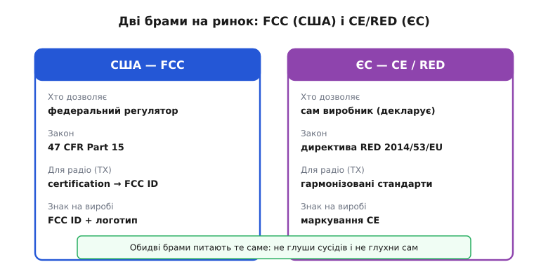
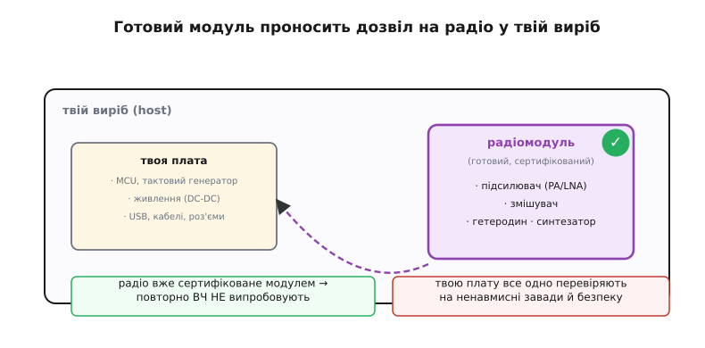
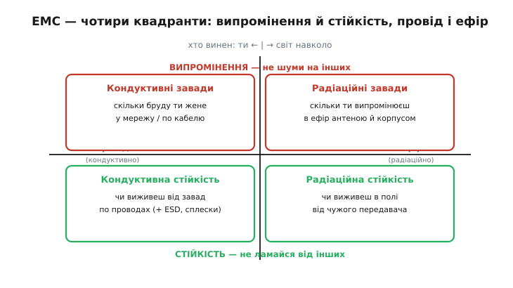
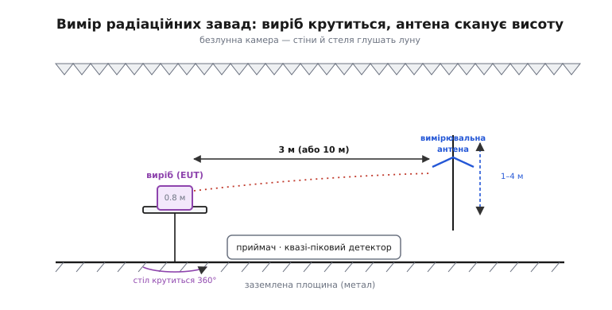

# Модульна сертифікація: FCC, CE та EMC-випроби

Ти спаяв радіопристрій, він працює на столі — і тут з'ясовується, що продати його не можна. Не тому, що він поганий, а тому, що будь-який виріб, який випромінює радіо (або просто має цифрову начинку, що мимоволі шумить в ефір), мусить спершу довести двом речам: **я не глушу сусідів** і **я сам не глухну від сусідів**. Це перепустка на ринок, і без неї митниця, магазин і закон тебе розвертають. Розберімо, звідки ця вимога, як влаштовані дві головні брами — американська **FCC** та європейська **CE/RED**, що саме роблять на **EMC-випробах**, і — найпрактичніше — чому готовий сертифікований радіомодуль економить тобі місяці й тисячі доларів.

### Чому взагалі хтось має дозволяти

Уяви місто, де кожен ставить радіопередавач на будь-якій частоті й будь-якій потужності. Дуже швидко ефір перетворюється на суцільний гвалт: твоя рація забиває сусідову, автомобільний ключ відмикає не ту машину, а поруч із медичним монітором він показує казна-що. Радіоспектр — **спільний ресурс**, як повітря чи дорога. Один егоїст псує його всім. Саме тому держава ставить правила руху в ефірі, а перед випуском виробу — перевіряє, що він цих правил не порушує. Це і є суть сертифікації: не бюрократія заради бюрократії, а захист спільного ефіру. Історія цього — від хаосу на американському радіо 1920-х до першого регулятора — така сама повчальна, як історія правил дорожнього руху; її винесено окремо, бо вона пояснює, [чому спектром узагалі почали керувати](root:sys-notary/emc-certification/hist-spectrum-order.md).

Із цієї спільної потреби виросли **дві головні системи** дозволів, з якими стикається майже кожен виробник електроніки: американська та європейська. Вони роблять те саме, але по-різному.


*Дві системи допуску. США: федеральний регулятор FCC за законом 47 CFR Part 15; для передавача — процедура certification із присвоєнням FCC ID, на виробі друкують цей ID. ЄС: виробник сам декларує відповідність за директивою RED 2014/53/EU, застосувавши гармонізовані стандарти, і ставить маркування CE. Питання в обох одне: не глуши сусідів і не глухни сам.*

### FCC: американська брама

У США радіочастотні пристрої регулює **FCC** (Federal Communications Commission — Федеральна комісія зв'язку), а головний документ — звід правил **47 CFR Part 15**. Він ділить усі пристрої на два роди, і ця межа для тебе принципова.

**Ненавмисний випромінювач** (*unintentional radiator*, Part 15 Subpart B) — пристрій, що радіо **не задумав**, але мимоволі шумить: будь-яка цифрова плата з тактовим генератором, DC-DC-перетворювачем, USB. Гострі фронти цифрових сигналів — це, по суті, слабенькі передавачі на купі частот. Такий пристрій не потребує повної сертифікації, але **мусить укластися в межі завад** (для більшості споживчої техніки — за декларацією виробника).

**Навмисний випромінювач** (*intentional radiator*, Part 15 Subpart C) — пристрій, що радіо **задумав**: Wi-Fi, Bluetooth, рація, радіокерування. Ось він проходить сувору процедуру **certification**: акредитована лабораторія міряє його випромінення, а FCC (через призначену установу) видає **FCC ID** — унікальний номер, який ти бачиш надрукованим на кожному телефоні й роутері. Цей номер каже: «цей передавач перевірено й дозволено».

> 🔧 **Навіщо це.** Практичний висновок для розробника: якщо твій виріб просто цифровий (сенсор із дротом, контролер без радіо) — тобі до Subpart B, і часто досить декларації. Щойно ти додав **будь-який передавач**, навіть куплений чіп Bluetooth — вмикається Subpart C з повною сертифікацією радіо. Ця межа визначає, скільки часу й грошей коштуватиме випуск, тож рахуй її **на етапі схеми**, а не наприкінці.

### CE та RED: європейська брама

У Європі логіка інша й для новачка несподівана. Маркування **CE** — це **не** штамп якогось державного органу. Це заява **самого виробника**: «я під власну відповідальність стверджую, що мій виріб відповідає всім чинним директивам ЄС». Ти сам проводиш (чи замовляєш) випроби, сам складаєш технічну документацію, сам підписуєш **Декларацію відповідності** (*Declaration of Conformity*, DoC) і сам ставиш значок CE. Держава не видає дозвіл наперед — вона карає постфактум, якщо ти збрехав.

Для радіо ключова директива — **RED** (*Radio Equipment Directive*, 2014/53/EU). Вона ставить кілька **суттєвих вимог** (*essential requirements*): виріб має бути безпечним (стаття 3.1a), електромагнітно сумісним (3.1b) та **ефективно й без шкоди користуватися спектром** (3.2); з серпня 2025 додалися вимоги кібербезпеки (3.3). Але як довести, що ти цим вимогам відповідаєш, коли директива написана загальними словами?

Тут працює найважливіший європейський механізм — **презумпція відповідності** (*presumption of conformity*). ЄС публікує список **гармонізованих стандартів** (*harmonised standards*) — конкретних технічних норм із точними числами й методами вимірів. Застосував такий стандарт і виконав його — **вважаєшся** таким, що виконав відповідну суттєву вимогу директиви, автоматично. Для радіо це, наприклад, стандарти серії ETSI: **EN 300 328** описує, як пристрій має користуватися діапазоном 2.4 ГГц (Wi-Fi, Bluetooth), а серія **EN 301 489** — електромагнітну сумісність радіотехніки. Виконав їх — можеш декларувати відповідність **самостійно**, без сторонньої установи.

А коли гармонізованих стандартів нема, або ти виконав їх не повністю, підключається **нотифікований орган** (*notified body*) — незалежна акредитована установа, яка проводить окрему експертизу типу й видає висновок. Тобто самодекларація — шлях за замовчуванням; сторонній орган — запасний, для нестандартних випадків.

### Головний виграш: готовий модуль

Тепер найцінніше для тебе як розробника прошивки й плат. Уся ця сертифікація радіо — довга, дорога й вимагає лабораторії з безлунною камерою. Але є спосіб її майже цілком **обійти**: узяти **готовий сертифікований модуль**.


*Сертифікований радіомодуль (наприклад, Wi-Fi/BLE) — це «чорна скринька», усередині якої вже сидить увесь ВЧ-тракт: підсилювачі, змішувач, гетеродин із синтезатором, узгоджена антена — і все це вже пройшло випроби й має свій FCC ID / CE. Вставивши його у свій виріб, ти НЕ переміряєш радіо повторно. Але твою власну плату — MCU, живлення, USB — усе одно перевіряють на ненавмисні завади й безпеку.*

Придивися, **що саме** ховається в такому модулі. Це весь передавально-приймальний ВЧ-тракт: [малошумний підсилювач і підсилювач потужності](root:hw-analog/rf-amplifiers), [змішувач](root:hw-analog/mixer), що переносить сигнал на потрібну частоту, [гетеродин](root:hw-analog/local-oscillator) із [синтезатором частоти](root:hw-analog/frequency-synthesizer), який задає точну робочу частоту, узгоджувальні ланки й антену. Саме ця начинка — найважча для сертифікації: її випромінення, чистота спектра, побічні гармоніки — усе те, що прискіпливо міряють. І виробник модуля вже все це **пройшов** та отримав свій **FCC ID** (у США) чи покриття гармонізованими стандартами (у ЄС).

Що це дає? Коли ти вставляєш такий модуль у свій виріб **як є** — та сама антена, та сама потужність, той самий діапазон, — радіочастину **повторно випробовувати не треба**. Сертифікат модуля переноситься на твій виріб (у США це називають *modular approval* — модульне схвалення). Замість повної сертифікації передавача за десятки тисяч доларів і місяці черг у лабораторії ти отримуєш готове радіо «під ключ».

Але — і це критично — **не все** проноситься безкоштовно. Модуль закрив **радіо**. А твоя власна плата навколо нього — процесор, тактові генератори, імпульсне живлення, USB-роз'єми, кабелі — це **ненавмисний випромінювач**, і за нього відповідаєш ти. Тому навіть із сертифікованим модулем виріб проходить **скорочені** випроби: перевірку ненавмисних завад від твоєї електроніки та безпеку. І є жорстка умова: **не чіпай радіо**. Поставив антену з більшим підсиленням, ніж записано в сертифікаті модуля, змінив узгодження чи потужність — і дозвіл модуля **злітає**; тоді потрібна доробка сертифіката (у FCC — так звана дозволена зміна класу II через власника сертифіката, або взагалі новий FCC ID).

> 🔧 **Навіщо це.** Це найважче практичне рішення проєкту. **Готовий модуль** — дорожчий за штуку, зате пускає виріб на ринок за тижні й без власної ВЧ-лабораторії; ідеальний для малих і середніх серій. **Власне радіо на чіпі** (свій PA, свій змішувач, своя антена на платі) — дешевше в масовому виробництві, але тягне повну сертифікацію передавача. Для більшості проєктів прошивки відповідь очевидна: **бери сертифікований модуль**, не перевинаходь ВЧ-тракт і, головне, **не зачіпай його антену й потужність**, бо цим ти власноруч анулюєш чужий дорогий сертифікат.

### Що таке EMC і що міряють на випробах

І в FCC, і в CE серцевина перевірки — **EMC** (*electromagnetic compatibility* — електромагнітна сумісність): здатність пристрою мирно жити в спільному електромагнітному середовищі. EMC складається з двох дзеркальних половин, і плутати їх не можна.


*EMC — це два дзеркальні питання, кожне у двох середовищах. Угорі — **випромінення** (emissions): скільки бруду пристрій сам жене в мережу по проводах (кондуктивні завади) та в ефір антеною й корпусом (радіаційні). Унизу — **несприйнятливість/стійкість** (immunity): чи виживе пристрій від завад, що приходять по проводах (плюс статичний розряд і сплески) та полем від чужого передавача.*

**Випромінення (emissions)** — скільки шуму пристрій **сам створює**. Тут два канали. **Кондуктивні завади** (*conducted*) — бруд, що йде **по проводах**: перешкоди, які твоє імпульсне живлення жене назад у мережу. Їх ловлять спеціальною розв'язкою **LISN** (*line impedance stabilization network* — мережа стабілізації опору лінії), що дає стандартний опір, у смузі приблизно 150 кГц – 30 МГц. **Радіаційні завади** (*radiated*) — те, що пристрій **випромінює в ефір** корпусом, доріжками, кабелями, від десятків мегагерц і вище.

**Несприйнятливість (immunity)**, вона ж стійкість — навпаки, чи **витримає** пристрій, коли завади б'ють по **ньому**: сильне радіополе поруч, статичний розряд від пальця (ESD), імпульсні сплески в мережі. Тут пристрій **обстрілюють** і дивляться, чи він не завис і не збрехав.

### Як це виглядає в лабораторії

Найвидовищніша частина — вимір **радіаційних** завад. Пристрій треба почути «начисто», без луни від стін і без сторонніх сигналів міста, тому його ставлять у **безлунну камеру** (*anechoic chamber*).


*Типовий стенд для радіаційних завад. Стіни й стелю вкрито поглинальними пірамідами, що гасять луну; підлога — заземлена металева площина. Виріб (EUT) стоїть на столі 0.8 м на поворотному столі й крутиться на 360°, підставляючи всі боки. Вимірювальна антена на відстані 3 м (або 10 м) їздить по висоті 1–4 м, шукаючи максимум випромінення. Приймач із квазі-піковим детектором фіксує рівень на кожній частоті й порівнює з межею.*

Логіка стенда прямо випливає з фізики. Пристрій випромінює **по-різному в різні боки** й на різній висоті — тому його **крутять** на 360°, а антену **водять** по висоті, щоб не проґавити напрямок найсильнішого «крику». Стіни глушать луну, щоб міряти пряме випромінення, а не відбите. Приймач вживає особливий **квазі-піковий детектор** (*quasi-peak*): він зважує завади так, як їх сприймає людське вухо в радіоприймачі — короткий рідкий тріск дратує менше, ніж рівний тон, і детектор це враховує. Результат — крива «рівень від частоти», яку накладають на дозволену межу: виліз бодай в одній точці — завал.

Ці межі не однакові для всіх. Стандарти (наприклад, **CISPR 32 / EN 55032** для мультимедійної техніки) ділять пристрої на **Клас B** — для житла, і **Клас A** — для промисловості. Клас B **суворіший** — приблизно на 10 дБ жорсткіші межі, бо вдома поруч стоять телевізор і радіо, які легко забити; на заводі вимоги м'якші. Що ближче твій виріб до людської оселі — то суворіше його міряють.

### Простий приклад: чому запас закладають наперед

Сертифікацію легко провалити на дрібниці — тактовий генератор дав гармоніку на забороненій частоті. Тому запас закладають ще у прошивці й схемі. Ось характерний хід думки, коли обираєш частоту тактування:

**Приклад (гармоніки тактового сигналу).** Плата тактується від 24 МГц. Прямокутний сигнал багатий на **непарні гармоніки**: 3-тя, 5-та, 7-ма. Порахуймо, куди вони падають, і чи не влучать у чутливі радіодіапазони.

:::tabs
```cpp
// оцінка гармонік тактового генератора
const long f_clk_MHz = 24;              // базова частота, МГц
for (int n = 1; n <= 9; n += 2) {       // лише непарні: 1,3,5,7,9
    long f = f_clk_MHz * n;             // частота n-ї гармоніки
    // 2400..2483 МГц — діапазон Wi-Fi/BLE, там і сертифікують модуль
    // тут гармоніки 24 МГц далеко, але на швидших шинах — вже небезпечно
}
```
```python
# оцінка гармонік тактового генератора
f_clk_MHz = 24                          # базова частота, МГц
for n in range(1, 10, 2):               # лише непарні: 1,3,5,7,9
    f = f_clk_MHz * n                    # частота n-ї гармоніки
    # 2400..2483 МГц — діапазон Wi-Fi/BLE, там і сертифікують модуль
    # тут гармоніки 24 МГц далеко, але на швидших шинах — вже небезпечно
```
:::

```
n=1  →  24 МГц
n=3  →  72 МГц
n=5  → 120 МГц
n=7  → 168 МГц   ← поруч FM-радіо (88–108) вже позаду, але ефір «жвавий»
n=9  → 216 МГц
```

Висновок простий: гармоніки повільного генератора ще не дістають до діапазону твого радіомодуля (2.4 ГГц), але на швидших шинах (сотні МГц) гармоніки легко долізуть саме туди — і **заглушать твоє ж радіо** або завалять межу випромінення. Тому тактові лінії ведуть коротко, з узгодженням і фільтрами, а швидкі фронти пригладжують — **щоб потім не переробляти плату після провалу в лабораторії**.

### Що з усього цього винести

Сертифікація — не перешкода, а правила спільного ефіру: доведи, що не глушиш інших (**emissions**) і не глухнеш сам (**immunity**). Дві головні брами роблять це по-різному: **FCC** у США дає дозвіл наперед і присвоює **FCC ID** передавачу; **CE/RED** у ЄС покладається на **самодекларацію** виробника, підперту **гармонізованими стандартами** й механізмом презумпції відповідності. А найкоротший шлях крізь обидві брами для розробника — **готовий сертифікований модуль**: він проносить у твій виріб уже пройдене радіо з усім ВЧ-трактом усередині, тож тобі лишається перевірити тільки власну цифрову начинку — і не чіпати модульну антену й потужність, щоб не спалити чужий дорогий сертифікат власними руками.

---
