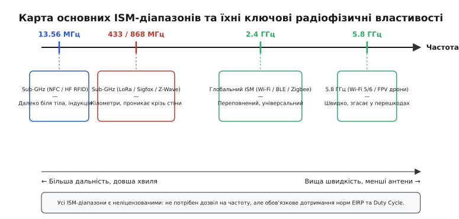
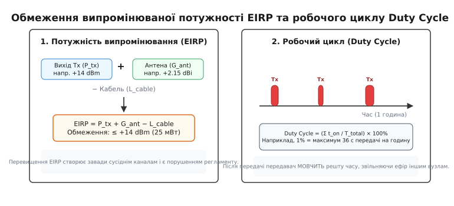
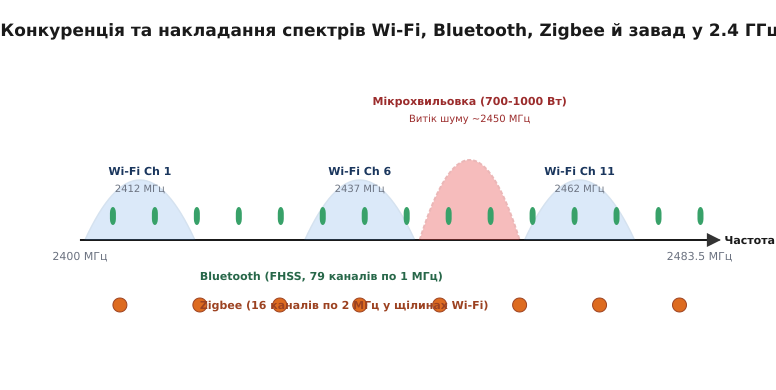

# ISM-діапазони

<preknowlist>
- [Діапазони частот](root:com-medium/frequency-bands) — як частота визначає дальність, проникність крізь стіни та розмір антени.
- [Бюджет радіолінії](root:com-medium/link-budget) — розрахунок потужності, підсилення антен та втрат у тракті.
- [Згасання у вільному просторі](root:com-medium/free-space-loss) — зв'язок відстані та геометричного розходження електромагнітної хвилі.
</preknowlist>

Уявіть, що для випуску бездротового датчика температури, смарт-годинника або безпровідної комп'ютерної миші компанія-виробник мусила б купувати у держави власну радіочастотну ліцензію — так само, як це роблять оператори мобільного зв'язку за мільйони доларів на державних аукціонах. За такої регуляторної моделі бездротова побутова електроніка не виникла б як масове доступне явище: вартість юридичного оформлення кожної кнопкової панелі, бездротової гарнітури чи дверного дзвінка була б абсолютна захмарною для споживача.

ISM-діапазони (англ. *Industrial, Scientific, Medical* — промислові, наукові та медичні частоти) розв'язують цю фундаментальну проблему, надаючи відкритий та безкоштовний простір для радіозв'язку. Це спеціально виділені регуляторами ділянки електромагнітного спектра, в яких будь-якому пристрою дозволено передавати радіосигнали без отримання персональної частотної ліцензії. Проте вільний доступ не означає безконтрольну анархію. За право мовити без ліцензії розробник підпорядковується жорсткому регуляторному компромісу «двох обов'язків»: пристрій зобов'язаний обмежувати свою випромінювану потужність і тривалість передачі, щоб не заважати іншим, а також повинен самостійно витримувати будь-які завади від сусідніх передавачів у спільному неліцензованому ефірі.

### Радіофізична карта ISM-діапазонів

Електромагнітний спектр не є однорідним: кожен ISM-діапазон має унікальний набір фізичних властивостей, що прямо випливають із довжини хвилі λ = c / f, де c — швидкість світла, а f — частота.

*Карта основних ISM-діапазонів: рух від Sub-GHz до міліметрових хвиль дає зростання смуги пропускання та зменшення антен, але зменшує дальність і погіршує проникнення крізь перешкоди.*

Зв'язок між частотою та фізикою поширення сигналу визначає чіткий розподіл технологій за частотними смугами:

#### 1. Низькочастотні Sub-GHz (13.56 МГц та 27 МГц)
* **13.56 МГц (довжина хвилі λ ≈ 22.1 м):** На цій частоті працюють технології NFC (англ. *Near Field Communication*) та HF RFID. Зв'язок виконується не за рахунок випромінювання електромагнітної хвилі у дальній зоні (Far-Field), а через реактивне магнітне ближнє поле (Near-Field Magnetic Induction). Дві котушки індуктивності (у зчитувачі та в пластиковій картці) утворюють повітряний трансформатор. Напруженість напрямленого магнітного поля спадає пропорційно кубу відстані (1 / r³), тому сигнал згасає практично миттєво поза межами кількох сантиметрів. Це забезпечує високу фізичну захищеність безконтактних платежів, перепусток та банківських карток від бездротового перехоплення з боку зловмисників.
* **27.12 МГц (λ ≈ 11.0 м):** Одразу після Другої світової війни стала першою масовою ISM-смугою для цивільного радіозв'язку (CB — *Citizens Band*), автомобільних рацій та іграшок на радіоуправлінні. Через довгу хвилю класична чвертьхвильова антена повинна мати довжину близько 2.75 метра. Для компактних пристроїв її доводиться згортати у спіраль або застосовувати подовжувальні котушки індуктивності, що суттєво знижує коефіцієнт корисної дії (ККД) антени до кількох відсотків і призводить до марного розсіювання енергії батареї у вигляді тепла.

#### 2. Субгігагерцові Sub-GHz (433 МГц, 868 МГц та 915 МГц)
* **433.05–434.79 МГц (λ ≈ 69 см):** Дозволена у Першому регіоні ITU (Європа, Африка, Близький Схід). Сумарна смуга становить лише 1.74 МГц. Довга хвиля чудово огинає перешкоди за рахунок [дифракції](root:com-medium/propagation-polarization) та глибоко проникає крізь цегляні й бетонні стіни із згасанням лише 2–4 дБ на капітальну стіну. На частоті 433 МГц масово працюють пульти гаражних воріт, автомобільні брелоки, побутові бездротові метеостанції та технологія LoRa для автономних давачів.
* **868 МГц (Європа / Україна) та 915 МГц (США / FCC) (λ ≈ 33–35 см):** Головний інженерний майданчик для розгортання енергоефективних мереж дальнього радіуса дії (LPWAN — *Low-Power Wide-Area Network*), таких як LoRaWAN, Sigfox, Z-Wave, Amazon Sidewalk та Wi-SUN. Чвертьхвильовий монополь має довжину близько 8.6 см, що дозволяє зручно розмістити штирьову чи компактну спіральну антену всередині невеликого пластикового корпусу датчика. Згасання сигналу 868 МГц у перешкодах на 6–10 дБ нижче, ніж у діапазоні 2.4 ГГц, що дозволяє сигналам LoRa пробивати кілька поверхів монолітного залізобетону чи дострілювати на 10–15 км у сільській місцевості.

> ⚠️ **Регіональний конфлікт частот:** Радіомодуль LoRaWAN або бездротова розробка на 915 МГц, завезена із США в Україну чи Європу, є юридично нелегальною та технічно небезпечною. Частота 915 МГц в Україні та країнах ЄС припадає на ліцензований смуговий діапазон стільникового зв'язку 3G/LTE (Band 8 / E-GSM). Передавач на 915 МГц у Європі створюватиме прямі потужні завади базовим станціям мобільних операторів, а приймач пристрою буде засліплений велетенською потужністю веж стільникового зв'язку.

#### 3. Глобальний діапазон 2.4 ГГц (2400–2483.5 МГц)
* **Довжина хвилі λ ≈ 12.5 см:** Це єдиний ISM-діапазон, повністю гармонізований регуляторними органами практично по всьому світу без регіональних розбіжностей. Пристрій на 2.4 ГГц можна вільно продавати і використовувати в США, Європі, Азії чи Австралії.
* **Розмір антени:** Чвертьхвильова антена становить лише ~3.1 см. Це дозволяє проектувати компактні антени прямо у вигляді вигнутого мідного треку (PCB Trace Antenna: Inverted-F або Meandered Monopole) безпосередньо на друкованій платі пристрою, що здешевлює масове виробництво компонента до нуля.
* **Застосування:** Головний осередок бездротових зв'язків: Wi-Fi (IEEE 802.11b/g/n/ax), Bluetooth, Bluetooth Low Energy (BLE), Zigbee (IEEE 802.15.4), Thread, Matter, а також мільйони пропрієтарних радіомишей та геймпадів (на популярних чіпах Nordic nRF24L01 чи Texas Instruments CC2500).
* **Фізичне обмеження:** Молекули води та жиру мають резонансні та релаксаційні явища в районі 2.45 ГГц. Тіло людини (яке складається з води на 60–70%) створює потужне додаткове затухання сигналу (від 10 до 20 дБ на людину), повністю перекриваючи пряму видимість. Суха цегляна стіна товщиною 15 см забирає 5–8 дБ потужності, а вологий залізобетон — від 12 до 20 дБ.

#### 4. Високочастотні 5.8 ГГц (5725–5875 МГц) та міліметрові хвилі
* **5.8 ГГц (λ ≈ 5.2 см):** Широка доступна смуга (150 МГц) дозволяє формувати надширокі канали (20, 40, 80 та 160 МГц) і передавати високі обсяги даних — швидкісні потоки Wi-Fi 5/6 (802.11ac/ax) та аналогове або цифрове HD-відео з нульовою затримкою для FPV-дронів. Проте сигнал на 5.8 ГГц практично не проникає крізь стіни (загасання 18–30 дБ на стіну) і зазнає високого [згасання у вільному просторі](root:com-medium/free-space-loss).
* **24 ГГц та 60 ГГц:** Використовуються для авторандарів безпеки, радарів вимірювання швидкості, датчиків присутності людини у приміщенні та надшвидкісних бездротових мостів (стандарт 802.11ad/ay WiGig на 60 ГГц зі швидкістю до 7 Гбіт/с).

### Регуляторна трансформація відкритих частот

Історично ISM-діапазони зовсім не призначалися для передачі інформації. У 1947 році на Міжнародній радіоконференції в Атлантик-Сіті Міжнародний союз електрозв'язку (ITU) виділив частоти 13.56 МГц, 27.12 МГц та 2.45 ГГц як «зони відчуження». Там дозволялося працювати потужним промисловим генераторам для зварювання пластмас, високочастотним печам сушіння деревини та медичним апаратам діатермії.

Зв'язківці вважали ці частоти непридатними для радіочерез суцільний шум від промислового обладнання. Проте у 1985 році Федеральна комісія зі зв'язку США (FCC) за ініціативою інженера Майкла Маркуса ухвалила революційні зміни до правил FCC Part 15. FCC дозволила використовувати ISM-частоти для передачі даних за умови застосування технологій розширення спектра (Spread Spectrum). Детальний перебіг цієї технічної революції описано в 📜 [Історія виникнення ISM-діапазонів: від промислової випічки до Wi-Fi](root:sys-notary/ism-bands/hist-ism-allocation.md).

### Три стовпи регулювання та співіснування в ефірі

Оскільки в неліцензованому ефірі відсутній єдиний координатор (як базова станція стільникового зв'язку), який призначає персональний часовий інтервал чи частотний канал кожному пристрою, співіснування тисяч автономних вузлів базується на трьох суворих обмеженнях.

*Регуляторний контроль у неліцензованому ефірі: обмеження випромінюваної потужності (EIRP) запобігає засліпленню сусідніх приймачів, а обмеження робочого циклу (Duty Cycle) гарантує паузи для мовлення інших вузлів.*

#### 1. Обмеження випромінюваної потужності (EIRP / ERP)
Регулятор обмежує не електричну потужність на виході мікросхеми передавача P_tx, а **еквівалентну ізотропно-випромінювану потужність (EIRP)**. Це підсумкова потужність радіохвилі з урахуванням підсилення антени G_ant та втрат у кабелі чи друкованому треку L_cable:

`	ext
EIRP [dBm]
= P_tx [dBm] + G_ant [dBi] - L_cable [dB]    [сума потужності передавача та підсилення антени мінус втрати в кабелі]
`

Якщо інженер встановлює направлену антену з підсиленням +6 dBi, він зобов'язаний зменшити потужність самого передавача на 6 dB, щоб сумарний EIRP не перевищив нормативну межу (наприклад, +14 dBm / 25 мВт для 868 МГц у Європі або +30 dBm / 1 Вт для 2.4 ГГц у США). Перевищення цієї межі не лише є прямим порушенням закону, але й призводить до засліплення приймачів сусідніх пристроїв на відстані сотень метрів. Виведення та числові приклади розрахунку випромінюваної потужності наведено у 🧮 [Розрахунок EIRP, робочого циклу та пропускної здатності неліцензованого каналу](root:sys-notary/ism-bands/math-duty-cycle.md).

#### 2. Обмеження робочого циклу (Duty Cycle)
У субгігагерцових діапазонах (433 МГц та 868 МГц) згідно зі стандартами ETSI (EN 300 220) та регламентом НКЕК в Україні діє жорстке обмеження часу мовлення — **Duty Cycle**. Воно визначається як відсоток часу передачі відносного фіксованого вікна у 1 годину (3600 секунд):

`	ext
Duty Cycle [%]
= (сумарний час передачі / 3600) * 100%       [відсоток часу мовлення відносно вікна в 1 годину]
`

Для більшості субдіапазонів 868 МГц встановлено ліміт **Duty Cycle = 1%** (що відповідає максимум 36 секундам мовлення на годину) або **0.1%** (3.6 секунди на годину). Якщо пакет LoRaWAN через низьку швидкість передачі перебуває в ефірі (Time-on-Air) 1.6 секунди, пристрій має право відправити не більше 22 пакетів на годину, після чого мікроконтролер зобов'язаний програмно заблокувати передавач на залишок часу. 

Математичний аналіз втрат ємності через колізії пакетів за моделлю Pure ALOHA детально виведено у 🧮 [Розрахунок EIRP, робочого циклу та пропускної здатності неліцензованого каналу](root:sys-notary/ism-bands/math-duty-cycle.md).

#### 3. Слухання ефіру (LBT — Listen Before Talk)
Замість суворого блокування за робочим циклом регулятори дозволяють безперервну передачу, якщо пристрій підтримує алгоритм LBT (англ. *Listen Before Talk*). Перед увімкненням підсилювача потужності приймач трансивера переходить у режим зчитування та вимірює рівень фонового сигналу (RSSI — *Received Signal Strength Indicator*) в обраному каналі протягом кількох мілісекунд (Clear Channel Assessment, CCA).

Якщо виміряний RSSI вищий за встановлений поріг (наприклад, -85 dBm), це свідчить про те, що канал зайнятий іншим передавачем. Пристрій скасовує спішну передачу та обирає випадкову паузу (Random Backoff), запобігаючи руйнівній колізії пакетів в ефірі. Реальний алгоритм перевірки LBT та обліку Duty Cycle на мовах C та C++ подано в ⚙️ [Алгоритм Listen-Before-Talk (LBT) та контроль Duty Cycle у радіомодулі](root:sys-notary/ism-bands/proj-lbt-simulator.md).

### Методи розширення спектра та протидія завадам (DSSS, FHSS, CSS)

Щоб виживати у спільному зашумленому середовищі, сучасні ISM-протоколи не передають узкосмуговий сигнал на єдиній частоті, а розмазують енергію сигналу по широкій смузі частот.

#### 1. Пряме розширення спектра (DSSS — Direct Sequence Spread Spectrum)
Використовується в класичному Wi-Fi (802.11b) та Zigbee (802.15.4). Кожен біт корисних даних перемножується на псевдовипадкову послідовність бітів високої швидкості (чипів — *chips*), наприклад, коди Баркера чи послідовності ПРН. В результаті енергія сигналу розподіляється у широкій смузі частот, і його спектральна щільність потужності опускається майже до рівня фонового шуму. На приймачі вихідний сигнал відновлюється за допомогою кореляційної обробки, а випадкові вузькосмугові завади при цьому пригнічуються на величину виграшу від обробки (Processing Gain).

#### 2. Стрибкоподібне перебудовування частоти (FHSS — Frequency Hopping Spread Spectrum)
Використовується у Bluetooth. Сигнал передається короткими пакунками, причому після кожного пакета передавач і приймач синхронно стрибають на інший частотний канал за псевдовипадковим алгоритмом. Якщо один із каналів виявився заблокованим потужною завадою від мікрохвильовки чи Wi-Fi роутера, втрачається лише один пакет, який миттєво перепосилається на наступній «чистій» частоті. Сучасний адаптивний режим AFH автоматично виключає зашумлені канали зі списку стрибків.

#### 3. Лінійна частотна модуляція (CSS — Chirp Spread Spectrum)
Застосовується у системі LoRa. Інформація кодується у вигляді «чирпів» — радіосигналів, частота яких безперервно та лінійно зростає або спадає у межах обраної смуги (наприклад, 125 кГц чи 500 кГц). Чирп-модуляція володіє надзвичайною стійкістю до завад, ефекту Доплера та багатопроменевого згасання. Завдяки високій часовій автокореляції приймач LoRa здатний демондувати та успішно декодувати сигнал, рівень потужності якого на 7.5–20 дБ нижчий за рівень теплового шуму в каналі (SNR < 0).

### Конкуренція у діапазоні 2.4 ГГц: Wi-Fi, Bluetooth, Zigbee та мікрохвильовки

Діапазон 2.4 ГГц є наиболее переповненим частотним середовищем на планеті. В одному й тому самому об'ємі простору (наприклад, у звичайній квартирі чи офісі) одночасно функціонують кілька різних бездротових технологій з різними принципами кодування та смугою каналів.

*Спектральна конкуренція в діапазоні 2.4 ГГц: широкі 20-мегагерцові канали Wi-Fi перекривають канали Zigbee, а Bluetooth нейтралізує завади за допомогою адаптивного перебудовування частоти (AFH).*

Взаємодія технологій у діапазоні 2.4 ГГц створює складну радіофізичну картину:

1. **Wi-Fi (IEEE 802.11b/g/n/ax):** Використовує широкі канали по 20 МГц (або 40 МГц у режимі HT40). У всьому діапазоні 2400–2483.5 МГц можна розмістити лише **три канали, які фізично не перекриваються між собою**: Канал 1 (2412 МГц), Канал 6 (2437 МГц) та Канал 11 (2462 МГц). Один активний роутер Wi-Fi, що транслює відеопотік, повністю засліплює 30% усього ISM-діапазону 2.4 ГГц у радіусі дії.
2. **Zigbee та Thread (IEEE 802.15.4):** Працюють у вузьких каналах шириною по 2 МГц з відстанню між центрами каналів 5 МГц (усього 16 каналів, від 11 до 26). Якщо призначити мережі Zigbee, наприклад, Канал 17 (2435 МГц) або Канал 18 (2440 МГц), ці канали потраплять у саму серцевину спектра Каналу 6 Wi-Fi, де сильний сигнал роутера повністю глушитиме слабкі пакети Zigbee-датчиків. Щоб уникнути колізій, координатор мережі зазвичай обирає статично або через динамічний вибір каналів (Dynamic Channel Selection / DCS) частоти у міжканальних проміжках Wi-Fi — наприклад, канали Zigbee 15, 20 або 25, якщо роутери налаштовані на стандартну сітку 1-6-11. Проте при виборі Каналу 15 (2425 МГц) слід враховувати активність Wi-Fi каналу 3 або 4, спектр яких може накривати цю частоту.
3. **Bluetooth (FHSS / AFH):** Драматично вирішує проблему завад за допомогою псевдовипадкового стрибкоподібного перебудовування частоти (FHSS — *Frequency Hopping Spread Spectrum*). Передавач Bluetooth перемикає частоту 1600 разів на секунду між 79 каналами шириною по 1 МГц. Сучасний стандарт Bluetooth застосовує адаптивну вибірку (AFH — *Adaptive Frequency Hopping*): пристрій постійно оцінює рівень помилок у каналах і виключає зі списку стрибків ті частоти, які наразі заблоковані потужним Wi-Fi роутером.
4. **Побутові мікрохвильові печі:** Потужний магнетрон випромінює 700–1000 Вт на частоті близько 2450 МГц для нагріву їжі. Металевий корпус печі та сітка на склі створюють захисний екран, але навіть витік 0.001% потужності становить від 7 до 10 мВт (7–10 dBm) випромінювання. Цей високочастотний шум накриває середню частину діапазону 2.4 ГГц (зокрема 8–10 канали Wi-Fi), створюючи непробивну стіну завад для чутливих приймачів Bluetooth та BLE у радіусі кількох метрів від печі.

### Матриця вибору ISM-діапазону для інженерних задач

Під час проектування нового бездротового пристрою вибір частотного діапазону є першим і найважливішим архітектурним рішенням. Він визначає дальність, автономність від батареї, розмір антени та сумісність.

| Параметр / Вимога | Sub-GHz (433 / 868 / 915 МГц) | 2.4 ГГц (Wi-Fi / BLE / Zigbee) | 5.8 ГГц (Wi-Fi 5/6 / FPV) |
| :--- | :--- | :--- | :--- |
| **Типова дальність (зв'язок)** | До 2–15 км (відкрита місцевість) | До 10–100 м | До 10–50 м (без перешкод) |
| **Проникнення крізь стіни** | Відмінне (дифракція довгих хвиль) | Помірне (сильне згасання у бетоні) | Слабке (лише пряма видимість) |
| **Швидкість передачі даних** | Вузька смуга (від 0.3 до 50 кбіт/с) | Середня/висока (від 125 кбіт/с до 600 Мбіт/с) | Ультрависока (до 1.3+ Гбіт/с) |
| **Розмір антени (λ/4)** | 8.5–17 см (значний розмір) | ~3.1 см (легко інтегрувати на плату) | ~1.3 см (ультракомпактна) |
| **Глобальна гармонізація** | Ні (різні частоти для EU/US/Asia) | **Так (універсальний у всьому світі)** | Часткова (потрібен вибір UNII каналів) |
| **Обмеження мовлення** | Duty Cycle (1%) або LBT | Технології розширення спектра | Динамічний вибір частот (DFS) |

> 🔧 **Навіщо це.**
> Для виходу пристрою на ринок він повинен пройти обов'язкову сертифікацію на відповідність нормам радіовипромінювання (CE у Європі, FCC у США, декларування в Україні). Сертифікована лабораторія вимірює спектральну щільність потужності, гармоніки та рівень позасмугового випромінювання у безлуновій камері.
> 
> Наймасовіший інженерний дефект початківців — спроба розробити власну випромінювальну антену чи радіочастотний тракт на друкованій платі без досвіду та векторного аналізатора кіл (VNA). Неузгодженість імпедансу (відхилення від 50 Ом) призводить до відбиття потужності назад у трансивер, виникнення паразитного випромінювання на подвійній частоті (2-га гармоніка) та провалу сертифікації. Щоб уникнути витрат у десятки тисяч доларів на повторні випробування, розробники масової електроніки застосовують готові сертифіковані радіомодулі (наприклад, ESP32, nRF52840, STM32WL) з вбудованими керамічними або планарними антенами.

Застосування динамічного вибору частоти (DFS — *Dynamic Frequency Selection*) та контролю потужності випромінювання (TPC — *Transmit Power Control*) є обов'язковим для 5-гігагерцових Wi-Fi пристроїв, які працюють у смугах UNII-2 (5.25–5.35 ГГц та 5.47–5.725 ГГц). Якщо радіомодуль виявляє роботу метеорологічного або військового радіолокатора (метеорадара C-діапазону), він зобов'язаний миттєво звільнити частотний канал і перейти на резервний.
