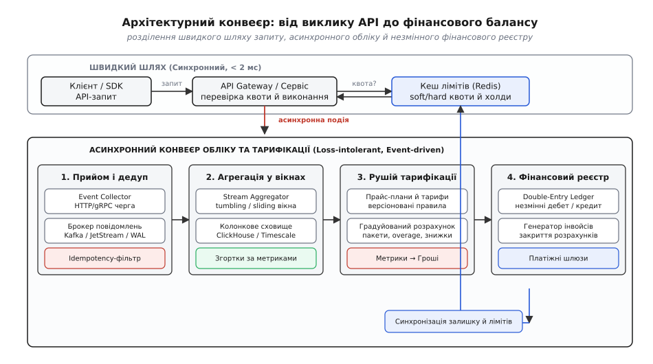
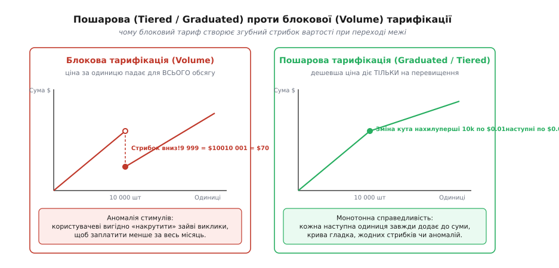
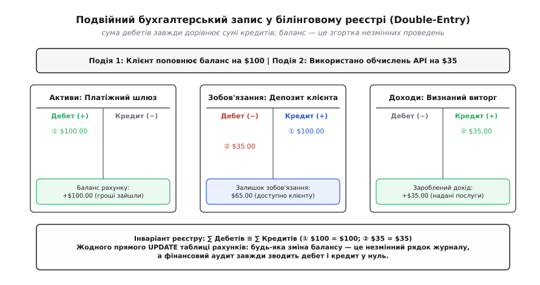

# Metering і billing як вузол

<preknowlist>
- [Ідемпотентність методів як частина контракту](topic:com-protocol/api-idempotency) — заголовок Idempotency-Key, дедуплікація повторів у мережі та захист від подвійного списання.
- [Event sourcing](topic:sf-apps/event-sourcing) — незмінний журнал подій як джерело правди та виведення стану через згортку.
- [Фіксована кома](topic:hw-arch/fixed-point) — точне цілочисельне представлення дробових сум без похибок двійкової плаваючої коми.
</preknowlist>

Уяви платформу генеративного штучного інтелекту або хмарної аналітики, що обслуговує 50 мільйонів запитів на місяць. Розробник реалізує білінг найпростішим шляхом: усередині HTTP-обробника `/v1/chat/completions`, одразу після отримання відповіді від нейромережі, бекенд виконує прямий SQL-запит: `UPDATE accounts SET balance_cents = balance_cents - $cost, tokens_used = tokens_used + $tokens WHERE id = $user_id`.

На локальній машині цей код працює бездоганно. Але щойно платформа виходить у промислову експлуатацію і корпоративний клієнт запускає 500 паралельних воркерів для пакетної обробки документів, система миттєво зазнає колапсу. П'ятсот конкурентних потоків одночасно намагаються заблокувати один і той самий рядок у таблиці бази даних (`SELECT ... FOR UPDATE` або неявне блокування рядка при `UPDATE`). Затримка відповіді API стрибає з 40 мілісекунд до 9 секунд, пул з'єднань СУБД вичерпується за лічені секунди, а сторонні клієнти починають масово отримувати помилки HTTP 504 Gateway Timeout.

Далі настає черга мережевих збоїв: клієнт, що не дочекався відповіді через таймаут шлюзу, автоматично повторює запит. Обробник списує кошти вдруге, хоча клієнт не отримав жодного результату. Наприкінці місяця компанія формує інвойс на $15 000, але через накопичення похибок двійкових чисел із плаваючою комою (`DOUBLE PRECISION`) сума в рахунку розходиться з сумою виконаних викликів на сотні доларів. Коли фінансовий директор клієнта вимагає детальної розшифровки, виявляється, що в базі є лише єдине мутоване число `tokens_used = 42918204` — без жодного журналу того, хто, коли і за яким тарифом витратив ці ресурси.

Ця криза неминуча, тому що **облік споживання (metering)** і **фінансова тарифікація (billing)** — це не допоміжний рядок коду в кінці контролера, а самостійний, висококритичний архітектурний вузол платформи.



*Розділення синхронного запиту й асинхронного фінансового конвеєра: шлюз перевіряє кеш квот за 2 мс, а потік сирих подій споживання паралельно проходить дедуплікацію, згортку у вікнах і фіксацію в незмінному реєстрі.*

## Анатомія розриву: чому облік і тарифікація не можуть жити в обробнику запиту

Причина, чому наївний білінг завжди зазнає краху під навантаженням, полягає у фундаментальному конфлікті інженерних вимог між двома різними площинами системи:

1. **Швидкий шлях виконання запиту (Fast Path / Data Plane):** вимагає мінімальної затримки (latency < 2 мс), екстремальної пропускної здатності (десятки тисяч запитів на секунду) та нульового дискового блокування. Тут критично важливо якомога швидше пропустити запит користувача, перевіривши лише базове право на доступ.
2. **Фінансовий облік (Control Plane / Billing & Ledger):** вимагає абсолютної відсутності втрат даних (zero data loss), непорушного аудиторського сліду, суворої фінансової точності (ACID), математичної узгодженості та складних розрахунків знижок, часових поясів і пошарових тарифів.

Спроба виконати обидва завдання в одному потоці створює неприпустиму зв'язаність: якщо платіжний провайдер (Stripe або банківський шлюз) тимчасово збільшує час відповіді або білінгова база виконує плановий бекап, ваш основний API повністю зупиняється.

Щоб розв'язати цей конфлікт, сучасний бекенд розділяє систему на **чотири ізольовані асинхронні етапи**:

```
[API / Воркери] ──(події)──► [1. Прийом і Дедуп] ──► [2. Агрегація] ──► [3. Тарифікація] ──► [4. Бухгалтерський реєстр]
       │                                                                                                  │
       ▲────────────────────── (асинхронна синхронізація балансу й квот) ─────────────────────────────────┘
```

Розглянемо кожен із цих етапів до найдрібніших інженерних деталей.

## Етап 1 — Прийом подій (Ingestion): дедуплікація, буферизація та at-least-once

Конвеєр обліку починається з моменту, коли обчислювальний вузол (API-сервер, бессерверна функція чи фоновий воркер) завершує роботу й породжує первинний факт — **подію споживання (metering event)**.

Подія споживання — це незмінний зліпок реальності, який фіксує п'ять обов'язкових атрибутів:

```
{
  "event_id": "evt_9981a2f4",
  "idempotency_key": "sha256(tenant_42:req_101:node_5)",
  "tenant_id": "tenant_42",
  "metric_name": "llm_completion_tokens",
  "quantity": 1420,
  "occurred_at": "2026-08-20T01:14:02.120Z",
  "properties": {
    "model": "gpt-4o",
    "region": "eu-central-1",
    "client_ip": "198.51.100.24"
  }
}
```

У цій структурі кожне поле несе конкретне навантаження:
- `occurred_at`: обов'язково передається як точний настінний час генерації події за стандартом UTC. Якщо використовувати час надходження на сервер прийому (`ingested_at`), затримки в чергах спотворять тарифний розрахунок (наприклад, нічний тариф буде помилково застосовано до денного виклику).
- `properties`: містить виміри (dimensions), які не впливають на сам факт виклику, але потрібні для тарифікації та аналітики. У реляційній СУБД це поле зберігається як `JSONB`, а в колонковому сховищі розгортається в окремі типізовані стовпці LowCardinality.

### Локальна безблокувальна буферизація та протитиск

Якщо кожен виклик API відправлятиме свою подію в чергу повідомлень або базу даних окремим мережевим сокетом, мережеві накладні витрати знищать продуктивність воркера.

Замість цього застосовується шаблон **кільцевого буфера в оперативній пам'яті (In-memory Ring Buffer)** або локального сайдкара (Vector / FluentBit). Воркер атомарно додає подію в локальний масив і негайно повертає відповідь клієнту. Окремий фоновий потік скидає накопичені події пакетами (batch flushing):
- або коли розмір пакета досягає порогу (наприклад, 500 подій);
- або за таймером максимальної затримки (наприклад, кожні 100 мілісекунд).

Тут виникає критичне питання: **що робити, якщо брокер повідомлень (Kafka або NATS) тимчасово недоступний, а локальний буфер заповнений на 100%?**

У звичайному логуванні застосовують стратегію `drop-oldest` (скидання старих логів). Проте в білінгу кожна втрачена подія — це прямий витік виручки компанії (revenue leakage). 

Тому конвеєр обліку застосовує дворівневий захист:
1. **Локальний аварійний журнал на диску (Local Spooling / WAL):** якщо мережевий брокер не відповідає, буфер скидає батчі у швидкий локальний файл (Embedded SQLite або RocksDB на NVMe-диску).
2. **Керований протитиск (Backpressure):** якщо дисковий спул вичерпується, сервіс починає сповільнювати швидкість прийому нових запитів на шлюзі, але в жодному разі не губить уже виконану роботу.

> 🔧 **Навіщо це.** Пакетне скидання подій зменшує кількість мережевих викликів і транзакцій бази даних у сотні разів. Замість 10 000 окремих запитів `INSERT` база даних отримує один пакетний `INSERT ... VALUES (...), (...)`, який записується у журнал випереджального запису (WAL) за один дисковий флаш.

### Гарантія At-Least-Once та неминучість дедуплікації

У розподіленій мережі неможливо забезпечити фізичну доставку повідомлення «рівно один раз» (exactly-once transport) без колосального падіння швидкості. Збої маршрутизаторів, перепідключення сокетів і перезапуски контейнерів гарантують, що частина пакетів загубиться, а частина — прийде двічі.

Тому промисловий транспорт подій завжди проектується на гарантію **«хоча б один раз» (at-least-once delivery)**: джерело відправляє подію і чекає на підтвердження (ACK); якщо підтвердження не надійшло за таймаутом, воно надсилає пакет повторно.

Оскільки дублікати гарантовано потрапляють у конвеєр, приймальний вузол (Event Ingestion Engine) зобов'язаний виконувати **дедуплікацію (deduplication)**. Робиться це через обчислення детермінованого відбитка `idempotency_key` (геш від ідентифікатора клієнта, унікального номера запиту та джерела) і перевірку на унікальному індексі. Якщо подія з таким ключем уже була зафіксована у вікні дедуплікації (зазвичай останні 24–72 години), вона негайно відкидається без нарахування плати.

## Етап 2 — Агрегація (Aggregation): вікна, мітки часу та колонкові сховища

Якщо система генерує 10 мільярдів сирих подій на місяць, пряма тарифікація кожної окремої події у фінансовому ядрі перевантажить систему розрахунків. Більшість тарифних планів не вимагають окремого бухгалтерського запису на кожен виклик із вартістю $0.000002 — їм потрібна **агрегована сума споживання за визначений проміжок часу**.

Етап агрегації згортає потік сирих мікроподій у структуровані часові вікна (Time Windows).

### Типи агрегаційних вікон

Залежно від фізичної природи ресурсу застосовуються три математичні моделі згортки:

1. **Тумблерні вікна (Tumbling Windows):** фіксовані, неперекривні часові інтервали однакової тривалості (наприклад, строго щогодини: 00:00–01:00, 01:00–02:00). Усі події, мітка `occurred_at` яких потрапляє в інтервал, сумуються (`SUM(quantity)`).
2. **Ковзні вікна (Sliding Windows):** неперервний інтервал фіксованої довжини, що рухається разом із часом. Застосовується для контролю пікового трафіку та рейт-лімітів (наприклад, "не більше 100 000 токенів за будь-які ковзні 60 секунд").
3. **Сесійні вікна (Session Windows):** об'єднують події одного безперервного сеансу роботи, що завершується після періоду бездіяльності (inactivity gap, наприклад, 15 хвилин мовчання користувача).

```
Тумблерні вікна:  [--- Вікно 1 (10:00-11:00) ---] [--- Вікно 2 (11:00-12:00) ---]
Події:            •   • •       •                  • •   •       •
Результат:        Сума = 4 події                  Сума = 4 події
```

### Вотермарки (Watermarks) та запізнілі події у потоці

У розподіленому потоці події майже ніколи не надходять у строгому хронологічному порядку. Подія з міткою часу `10:59:58` може надійти на сервер агрегації о `11:00:05` через затримку в мережі воркера.

Щоб вікно не закривалося передчасно, використовується механізм **вотермарків (Watermarks)** — спеціальних часових міток у потоці, які сигналізують: «із високою ймовірністю всі події до моменту `T_watermark` уже надійшли». 

Якщо подія надходить після закриття вотермарка (late-arriving event), рушій потокової обробки (Apache Flink або ClickHouse Materialized View) не викидає її, а породжує коригувальну дельта-подію, яка дописується до наступного розрахунку.

### Колонкові бази даних для обліку споживання

Зберігати та агрегувати мільярди сирих подій у класичних реляційних СУБД (PostgreSQL або MySQL) неефективно: рядкова організація пам'яті призводить до колосального роздування індексів B-Tree та повільного сканування дисків.

Для шару агрегації стандартом стали **колонкові бази даних (Column-oriented OLAP)**, такі як ClickHouse або TimescaleDB.

Колонкова архітектура дає три вирішальні переваги:
- **Колосальне стиснення (до 90%):** оскільки дані зберігаються стовпцями, однакові типи даних (місяці міток часу, цілі числа кількості токенів, повторювані ідентифікатори клієнтів) стискаються алгоритмами LZ4 або ZSTD майже без втрати процесорного часу.
- **Векторизовані обчислення (SIMD):** процесор виконує агрегацію `SUM` або `COUNT` безпосередньо над масивами пам'яті зі швидкістю десятків мільйонів рядків на мікросекунду.
- **Матеріалізовані представлення (Materialized Views):** база на льоту під час запису автоматично перераховує годинні та добові згортки (Rollups), завдяки чому запит "покажи баланс клієнта за місяць" читає лише сотні підсумкових рядків замість мільйонів сирих записів.
- **Ієрархія стиснення (Data Lifecycle / Compaction):** сирі посекундні події зберігаються на гарячих дисках 14 днів для детального дебагу, після чого автоматично компактуються у годинні зрізи й переміщуються у дешеве об'єктне сховище (S3).

## Етап 3 — Рушій тарифікації (Rating Engine): моделі цін та версіонування тарифів

Рушій тарифікації (rating engine, від лат. *rata* — розрахована частка) відповідає за перетворення очищених і агрегованих метрик у грошові суми згідно з контрактом клієнта.

Хоча здається, що це звичайне множення кількості на ціну, у реальному бізнесі діють складні кусково-лінійні тарифні плани.

### Пошарова (Graduated) проти блокової (Volume) тарифікації

Найпоширеніша помилка під час проектування тарифної сітки — плутанина між блоковим та пошаровим ціноутворенням:

- **Блокова тарифікація (Volume-based):** ставка за одиницю знижується для *всього обсягу споживання*, якщо досягнуто порогу.
- **Пошарова тарифікація (Graduated / Tiered):** знижена ставка застосовується *виключно до тієї частини обсягу, що перевищила поріг*.



*Блоковий тариф (ліворуч) створює розрив ціни, за якого клієнту вигідно накрутити зайві виклики; пошаровий тариф (праворуч) забезпечує строгу монотонність і неперервність цінової кривої.*

Як видно з графіка, блоковий тариф створює небезпечний від'ємний стрибок вартості (discontinuity): клієнту, який використав 9 999 запитів за ціною $0.010 (разом $99.99), вигідно навмисно надіслати два фіктивні запити, щоб перетнути поріг у 10 000 і заплатити за тарифом $0.007 лише $70.01 за весь обсяг.

Пошарова модель усуває цей дефект: кожна наступна одиниця завжди збільшує фінальний рахунок, а крива вартості є строго неперервною та монотонною.

Детальний математичний аналіз кусково-лінійних функцій, моделей 95-го процентиля для оцінки смуги пропускання та алгоритмів виснаження передплачених пакетів наведено у вставці [🧮 Математика тарифікації: східчасті моделі, передоплата та округлення](topic:sys-notary/metering-and-billing/math-rating-models.md).

### Багатовимірні тарифні матриці та мінімальні зобов'язання

У сучасних B2B-платформах вартість ресурсу залежить від багатьох вимірів одночасно:

```
Ціна = БазоваСтавка(Модель, Регіон) · Коефіцієнт_SLA · Знижка_Обсягу(Tenant)
```

Наприклад, обробка 1000 токенів у медичному контурі з підвищеними вимогами до безпеки (HIPAA / GDPR Isolated Region) має коефіцієнт `1.4x`, тоді як нічний пакетний запуск (Batch Queue) отримує знижку `0.5x`. Рушій тарифікації зіставляє атрибути кожної події з матрицею тарифу, проводячи розрахунок з точністю до нанодолара.

Поширеною є модель **мінімальних зобов'язань з овердрафтом (Minimum Commitment & Overage)**: клієнт підписує річний контракт із фіксованим щомісячним платежем $10 000, який включає 100 мільйонів токенів. Якщо клієнт використав лише 60 мільйонів, він сплачує повні $10 000 (невикористаний залишок "згорає"). Якщо ж споживання склало 140 мільйонів, система списує базові $10 000 плюс тарифікує додаткові 40 мільйонів за окремою ставкою овердрафту.

### Версіонування прайс-планів та детермінізм розрахунків

Ціни на ресурси не є статичними: компанія може знизити вартість токенів із 1 вересня або змінити порогові рівні тарифу.

Якщо зберігати ціну як одне поле в таблиці тарифів, повторний розрахунок старого інвойсу призведе до зміни історичних сум. Тому рушій тарифікації проектовано як **чисту детерміновану функцію (Pure Function)**:

```
Cost = Rate(Event, PricePlanVersion(Event.occurred_at))
```

Кожна зміна тарифу створює новий запис у версіонованій таблиці цін із часовим діапазоном дії (`valid_from`, `valid_to`). Подія, що сталася 15 серпня, завжди тарифікується за правилами, які діяли саме 15 серпня, навіть якщо сам розрахунок або повторний аудит запускається у грудні.

## Етап 4 — Бухгалтерський реєстр (Ledger) та інвойси: незмінність і подвійний запис

Останній і найбільш відповідальний етап конвеєра — фіксація розрахованої вартості у фінансовому реєстрі та виставлення рахунків клієнтам.

Головне правило фінансової архітектури звучить так: **баланс клієнта ніколи не є окремим стовпцем у таблиці бази даних**. 

Усі наївні спроби зберігати `balance` як числове поле і змінювати його через `UPDATE` розбиваються об неможливість аудиту: якщо баланс зменшився на $50, ви не маєте жодного способу довести, які саме тридцять транзакцій сформували цю зміну, і чи не виникла вона внаслідок програмного збою.

### Подвійний бухгалтерський запис (Double-Entry Bookkeeping)

У професійних білінгових системах баланс — це **лівий згорток (left fold)** незмінного журналу фінансових проводок, побудованого за принципом подвійного запису, що використовується в бухгалтерії вже понад п'ятсот років.

Кожна фінансова операція складається щонайменше з двох збалансованих записів:
- **Дебет (Debit):** куди пішли кошти або які зобов'язання зменшилися.
- **Кредит (Credit):** звідки прийшли кошти або який дохід визнано.



*Кожна операція споживання зменшує зобов'язання компанії перед клієнтом за його депозит і збільшує визнаний дохід платформи; сума дебетів завжди тотожно дорівнює сумі кредитів.*

Розглянемо рух коштів на реальному прикладі:
1. **Клієнт поповнює баланс на $100.00:**
   - Дебет рахунку `assets:stripe` (активи компанії зросли на $100.00).
   - Кредит рахунку `liabilities:customer_prepaid` (виникло зобов'язання надати послуг на $100.00).
2. **Клієнт використав API на суму $35.00:**
   - Дебет рахунку `liabilities:customer_prepaid` (зобов'язання компанії зменшилися на $35.00).
   - Кредит рахунку `revenue:api_compute` (компанія визнала зароблений дохід на $35.00).

Інваріант реєстру непорушний: **сума дебетів завжди строго дорівнює сумі кредитів (`∑ debits ≡ ∑ credits`)**. Будь-який розрив означає програмну помилку і блокується базою даних на рівні транзакції.

Для захисту від несанкціонованої модифікації кожен рядок реєстру пов'язується з попереднім криптографічним хешем (Merkle-ланцюг або журнал захищений підписами), що робить базу проводок стійкою до маніпуляцій навіть з боку системних адміністраторів.

Про те, як цей принцип еволюціонував від перфокарт і телефонних квитанцій середини XX століття до сучасних хмарних систем, розповідає вставка [📜 Від телефонних карток і телеком-білінгу до хмарного вимірювання ресурсів](topic:sys-notary/metering-and-billing/hist-telecom-cdr.md).

### Життєвий цикл інвойсу та заборона мутацій

Наприкінці розрахункового місяця система формує підсумковий фінансовий документ — **інвойс (invoice)**.

Інвойс проходить суворий автомат станів:

```
[Draft] ──(фіналізація)──► [Finalized / Open] ──(оплата)──► [Paid]
                                 │
                                 └──(неуспішна оплата)──► [Past Due] ──► [Void]
```

- **Чернетка (Draft):** відкритий рахунок поточного періоду, куди динамічно агрегуються транзакції.
- **Фіналізований (Finalized):** після настання розрахункової дати інвойс "запечатується". Він отримує унікальний фіскальний номер, дату, суму податків (ПДВ/VAT) і **стає абсолютно незмінним**.

> 🔧 **Навіщо це.** Фіналізований інвойс є юридичним документом, переданим податковим органам та банківським установам. Якщо після фіналізації виявиться, що клієнту помилково нарахували зайві $10, інвойс заборонено редагувати чи видаляти. Замість цього створюється новий документ — **коригувальна квитанція (Credit Note)**, яка вносить компенсаційну проводку до реєстру.

## Зворотний зв'язок: авторизація квот у реальному часі (Entitlements & Quotas)

Повний конвеєр білінгу є асинхронним: від моменту виклику API до запису в бухгалтерський реєстр минають секунди або хвилини. Проте API-шлюз (Gateway) повинен приймати рішення про допуск клієнта **в реальному часі за лічені мікросекунди**.

Як узгодити швидкий шлях авторизації з повільним конвеєром розрахунків?

Цю проблему вирішує підсистема контролю лімітів (Entitlements & Quotas), побудована на чотирьох взаємопов'язаних механізмах:

### 1. Кешування квот у пам'яті (Fast Quota Cache)

API-шлюз не звертається до головної бази даних або бухгалтерського реєстру. Він читає локальний розподілений кеш (Redis або вбудований кеш вузла), де зберігається простий агрегований стан:
- поточний залишок кредитів;
- статус підписки (`active`, `past_due`, `suspended`);
- список активованих функцій тарифного плану (Feature Flags).

Конвеєр білінгу після кожного циклу агрегації асинхронно скидає актуальний розрахований баланс у Redis, оновлюючи стан клієнта.

### 2. Компроміс овердрафту (The Overdraft Trade-off)

У розподіленій системі сувора синхронізація балансу перед кожним мікрозапитом (наприклад, блокування ключа в Redis на кожен виклик із вартістю $0.0001) створила б неприпустиме навантаження на мережу.

Тому промислові платформи застосовують **контрольований овердрафт**: шлюз дозволяє короткочасне перевищення балансу на невелику фіксовану суму (наприклад, до $1.00), доки асинхронний агрегатор не оновить кеш. Це виключає затримки на швидкому шляху, приймаючи мізерний бізнес-ризик як плату за масштабованість.

### 3. М'які та жорсткі ліміти (Soft vs Hard Limits)

- **М'який ліміт (Soft Limit):** коли клієнт використовує 80% або 100% включеного пакета, система не блокує трафік, а генерує попереджувальні події (сповіщення електронною поштою, вебхуки про наближення ліміту). Трафік продовжує обслуговуватися в режимі овердрафту (overage).
- **Жорсткий ліміт (Hard Limit):** спрацьовує при вичерпанні критичного кредитного балансу або за прямою забороною овердрафту в налаштуваннях клієнта. Шлюз миттєво повертає клієнту код `402 Payment Required` або `429 Too Many Requests`, захищаючи інфраструктуру від неоплаченого навантаження.

### 4. Автоматичні вимикачі та аварійні політики (Circuit Breaking & Failover)

Якщо інфраструктура кешу квот (кластер Redis) зазнає аварійного збою чи мережевої ізоляції, API-шлюз стикається з дилемою: заблокувати весь вхідний трафік клієнтів чи тимчасово дозволити виконання без перевірки лімітів. 

Архітектура передбачає гнучку політику за класами клієнтів:
- **Політика відкритої відмови (Fail-Open):** для платних корпоративних клієнтів із високим SLA шлюз тимчасово пропускає виклики, фіксуючи події споживання у локальний журнал, щоб не порушувати роботу бізнесу клієнта через внутрішню аварію білінгу.
- **Політика закритої відмови (Fail-Closed):** для безкоштовних або пробних облікових записів (Free Trial) шлюз блокує доступ, захищаючи дорогі обчислювальні потужності (наприклад, GPU-кластери) від неконтрольованого зловживання.

### 5. Шаблон резервування коштів (Credit Hold Pattern)

Для тривалих або непередбачуваних за вартістю операцій (генерація аудіо/відео, навчання моделей, аналітичні запити до сховищ) застосовується трифазний протокол резервування:
1. **Hold:** перед початком операції шлюз блокує в кеші максимальну оціночну вартість (`estimated_cost`).
2. **Execute:** воркер виконує роботу.
3. **Settle:** після завершення списується фактична вартість, а невикористана різниця резерву повертається на доступний баланс.

Повну практичну реалізацію конвеєра з прийомом подій, чергою ідемпотентності, шаблоном холду та незмінним реєстром подвійного запису на мовах C++ та TypeScript наведено у вставці [⚙️ Конвеєр обліку: від прийому події до фіксації в реєстрі](topic:sys-notary/metering-and-billing/proj-metering-pipeline.md).

## Підводні камені: дробові центи, запізнілі події та часові пояси

Навіть ідеально спроектована архітектура може зламатися на стику бізнес-логіки та системних крайових випадків. Розглянемо чотири головні підводні камені:

### Пастка чисел із плаваючою комою

Усі фінансові розрахунки в білінгу **категорично заборонено виконувати через типи `float` або `double`**.

У двійковій системі IEEE-754 число `0.1` не має точного представлення. Накопичуючи мікроплатежі у двійковому дробі, ви гарантовано отримаєте розбіжності вигляду `0.10000000000000005`.

**Правило:** Усі ціни, тарифи та баланси зберігаються й обчислюються виключно в **цілих числах фіксованої точності (Fixed-Point)** — у мікродоларах (`10⁻⁶` USD, де $1 = 1 000 000) або нанодоларах (`10⁻⁹` USD). Перетворення у валюту платежу (центи) здійснюється лише в момент формування інвойсу із застосуванням банківського заокруглення (Banker's Rounding / Round Half to Even).

### Запізнілі події (Late-Arriving Events)

Воркер на віддаленому сервері втратив інтернет-зв'язок на 12 годин. Відновивши підключення, він скинув у конвеєр 100 000 подій, мітки часу яких належать до вчорашнього дня, за який інвойс уже було фіналізовано.

Як вчинити?
- **Час події (`occurred_at`):** визначає, який тариф і знижки діяли на момент виконання операції.
- **Час фіксації (`created_at`):** визначає поточний момент запису в бухгалтерський реєстр.

Запізніла подія тарифікується за правилами свого історичного часу, але фінансове проведення записується в поточний відкритий розрахунковий період як коригування (Adjustment). Уже закритий інвойс залишається недоторканим.

### Межі часових поясів та перехід на літній час (DST)

Якщо розрахунковий період клієнта закінчується "опівночі 1 вересня", це означає різний момент часу для користувача в Києві (UTC+3), Лондоні (UTC+1) та Сан-Франциско (UTC-7).

Усі внутрішні мітки часу конвеєра, черг і баз даних зберігаються **виключно у форматі UTC (ISO-8601 з літерою Z)**. Прив'язка до локальної опівночі клієнта розраховується лише генератором інвойсів на основі географічного часового поясу облікового запису (IANA Timezone, наприклад, `Europe/Kyiv`), із коректним урахуванням переходів на літній і зимовий час.

### Щомісячна тристороння звірка (Three-Way Reconciliation)

Наприкінці кожного місяця фінансовий відділ проводить генеральну звірку трьох незалежних джерел правди:
1. **Виписка платіжного шлюзу (Stripe / Adyen Payouts):** реальні гроші, що надійшли на банківський рахунок.
2. **Бухгалтерський реєстр (General Ledger):** сума визнаних доходів та залишок зобов'язань за депозитами.
3. **Агреговані метрики споживання (OLAP Rollups):** фізичний обсяг наданих обчислювальних послуг.

Якщо в системі діє строгий подвійний запис і цілочисельна арифметика, різниця між усіма трьома джерелами строго дорівнює нулю.

---

Розділення швидкого шляху виконання запиту та асинхронного фінансового конвеєра, незмінні журнали подій з ідемпотентною дедуплікацією, пошарова тарифікація та реєстр подвійного запису утворюють фундамент, на якому масштабуються сучасні інфраструктурні платформи. Ця архітектура захищає веб-бекенд від взаємних блокувань бази даних під навантаженням і перетворює розрахунки з клієнтами на прозорий, математично точний та аудиторсько бездоганний процес.
