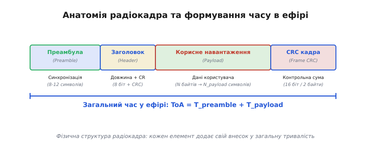
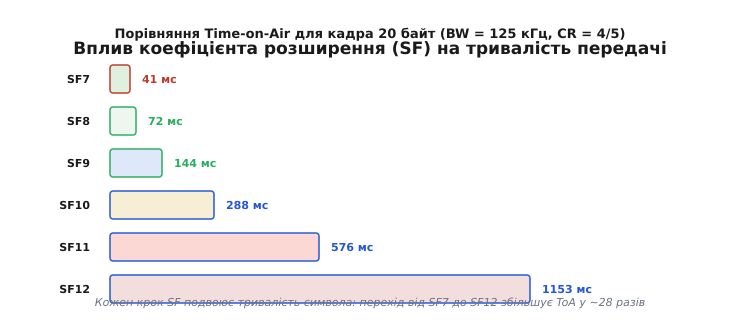
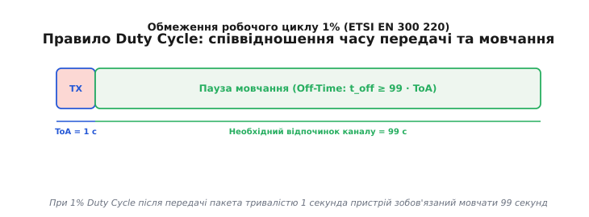
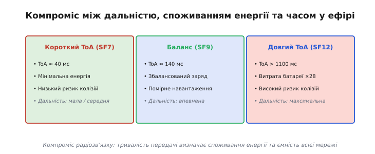

# Час у ефірі (Time-on-Air)

<preknowlist>
- [LoRa (чирп-модуляція)](topic:com-modulation/lora) — коефіцієнт розширення SF, ширина смуги BW та тривалість символа.
- [Бюджет лінії зв'язку](root:embedded/link-budget) — відношення сигналу до шуму, чутливість приймача та затухання.
- [Базові радіочастотні модулі](topic:sys-notary/rf-module) — структури кадру та робота SPI-трансиверів.
</preknowlist>

Коли радіопередавач надсилає цифрове повідомлення, електромагнітна хвиля долає відстань до приймача майже миттєво — зі швидкістю світла. Проте сам процес передачі даних не є миттєвим. Щоб накласти цифрові біти на високочастотну несучу хвилю, передавачу потрібно випромінювати радіочастотну енергію протягом цілком визначеного й математично обчислюваного інтервалу часу. Цей часовий проміжок від першого випроміненого коливання преамбули до останнього згасаючого біта контрольної суми називають **часом у ефірі** (англ. *Time-on-Air*, ToA або *packet duration*).

На перший погляд, тривалість передачі кадра здається вузькотехнічною величиною, цікавою хіба що розробникам радіочастотних мікросхем. Насправді саме ToA виступає головним вузлом, у якому перетинаються три фундаментальні обмеження радіоінженерії: ємність автономного джерела живлення пристрою, максимальна пропускна спроможність і ємність бездротової мережі, а також суворі юридичні регламенти використання радіочастотного спектра.

---

### Першопричина: чому радіосигналу потрібен час

У пропрієтарних чи відкритих цифрових протоколах зв'язку інформація не передається «уся одразу». Будь-який цифровий кадр на фізичному рівні (PHY) розгортається в часі як послідовність дискретних елементарних сигналів — **символів**.

Тривалість одного символа `T_s` визначається фізикою модуляції. Наприклад, у класичній частотній маніпуляції (FSK) символ — це короткий відрізок тону певної частоти, а його тривалість обернено пропорційна швидкості передачі бітів (бітрейту). У чирповій модуляції LoRa символ — це плавний перепад частоти (чирп), що проходить через усю ширину смуги, а його тривалість визначається шириною цієї смуги `BW` та коефіцієнтом розширення `SF`.

Яку б модуляцію ми не обрали, передача `N` байтів корисного навантаження вимагає передачі цілого комплексу апаратних полів. Радіоефір не має фізичних дротів із заземленням чи ліній вибору мікросхеми (Chip Select), тому приймач у момент старту передачі не знає ні про сам факт наявності сигналу, ні про точну частоту підстроювання гетеродина, ні про швидкість, з якою йому доведеться декодувати біти.

Отже, перш ніж надіслати бодай один байт корисних даних користувача, передавач зобов'язаний розігріти свій підсилювач потужності, випромінити сигнальну послідовність для захоплення частотно-часового синтезатора приймача та передати заголовок із вказівкою структури кадра. Усі ці кроки складаються в єдиний часовий конвеєр.

---

### Анатомія радіокадра: від преамбули до контрольної суми

Щоб зрозуміти, з чого складається підсумкове значення часу в ефірі, розберемо анатомічний устрій типового фізичного пакета радіозв'язку.


*Фізична структура радіокадра: кожен елемент додає свій внесок у загальну тривалість ToA.*

Загальний час перебування кадра в ефірі розділяють на дві основні часові складові: тривалість преамбули `T_preamble` та тривалість корисного навантаження `T_payload`.

```
ToA = T_preamble + T_payload
```

#### 1. Преамбула (Preamble)
Преамбула являє собою регулярну, заздалегідь відому послідовність символів (наприклад, меандр `0xAA` або `0x55` у FSK чи серію базових висхідних чирпів у LoRa). Її призначення — дати аналоговій передній частині приймача (RF Front-End) та автоматичному керуванню підсиленням (AGC) час на те, щоб виявити наявність енергії в каналі, підстроїти гетеродин і синхронізувати системний годинник декодера.

У кінці преамбули завжди розташовується **слово синхронізації** (англ. *Sync Word* або *Frame Synch*). Це унікальна комбінація бітів чи чирпів, яка чітко позначає межу: преамбула завершилася, з наступного символа починаються структуровані дані. Наприклад, у мережах LoRaWAN слово синхронізації дорівнює `0x34` (захищає публічну мережу від приватних посилок), тоді як у приватних P2P-мережах зазвичай використовують `0x12`.

#### 2. Фізичний заголовок (Physical Header)
Заголовок інформує приймач про геометрію та параметри декодування пакета. У модуляції LoRa явний заголовок (Explicit Header) містить:
* 8-бітне поле довжини корисного навантаження (убайта);
* 3-бітне поле коефіцієнта завадостійкого кодування (Coding Rate);
* 1-бітний прапорець наявності підсумкової контрольної суми CRC;
* 5-бітне поле контролю помилок самого заголовка (Header CRC).

Заголовок може передаватися в одному з двох режимів:
* **Явний (Explicit Header):** заголовок передається у складі радіокадра з підвищеним захистом від помилок (завжди із максимальним кодуванням CR 4/8). Це робить кадр гнучким, бо приймач може заздалегідь дізнатися довжину будь-якого довільного пакета. Ціною цієї гнучкості є додатковий час в ефірі.
* **Неявний (Implicit Header):** заголовок повністю вилучається з радіоефіру. Приймач і передавач заздалегідь запрограмовані на однакову фіксовану довжину пакета. Це заощаджує 20 бітів у структурі кадра, що критично важливо для коротких посилок телеметрії.

#### 3. Корисне навантаження (Payload)
Це безпосередньо байти даних користувача — покази датчиків, дамп структури чи команди управління. Перед випромінюванням у ефір корисне навантаження розбивається на блоки й кодується завадостійкими кодами (наприклад, кодом Хеммінга чи Ріда-Соломона).

#### 4. Контрольна сума кадра (Frame CRC)
Для перевірки цілісності прийнятих даних у кінець кадра додається 16-бітна або 32-бітна контрольна сума (CRC). Якщо під час прольоту крізь радіоефір хоча б один біт був викривлений завадою, підсумковий розрахунок CRC на приймачі не співпаде, і зіпсований пакет буде відкинуто.

---

### Механіка розрахунку для чирп-модуляції (LoRa)

У чирповій модуляції LoRa зв'язок між обсягом даних у байтах та часом в ефірі є нелінійним і залежить від комплексу конфігураційних параметрів.

Тривалість одного символа обчислюється як `T_s = 2ˢᶠ / BW`. Кожен крок коефіцієнта розширення `SF` (від SF7 до SF12) подвоює тривалість символа. Наприклад, при ширині смуги `BW = 125` кГц символ на `SF7` триває 1.024 мс, а на `SF12` — вже 32.768 мс.


*Порівняння ToA для кадра 20 байт при різних SF (BW = 125 кГц, CR = 4/5): перехід від SF7 до SF12 збільшує час у ефірі майже у 28 разів.*

Кількість символів корисного навантаження `N_payload` визначається складнішою математичною формулою з обов'язковим округленням у більший бік (`ceil`), оскільки дрібний за залишковим розміром блок даних усе одно мусить зайняти цілий символ.

Особливо критичним є параметр **оптимізації низької швидкості даних** (Low Data Rate Optimization, `LDRO`). Коли тривалість символа `T_s` перевищує 16 мілісекунд (що характерно для `SF11` та `SF12` при смузі 125 кГц), дрейф частоти внутрішнього кварцового резонатора за час тривалості одного чирпа може перевищити допустиму межу. Щоб запобігти втраті синхронізації, примусово вмикається режим `LDRO`: у кожному символі два молодші біти відкидаються, що зменшує корисну ємність символа з `SF` до `SF - 2` бітів. У результаті для передачі того самого обсягу байтів потрібно більше символів, і ToA додатково зростає.

Детальне крок за кроком виведення всіх рівнянь із числовими прикладами розібрано у вставці [Математичне виведення формул часу в ефірі](topic:sys-notary/time-on-air/math-toa-equations.md).

---

### Аналіз виграшу обробки (Processing Gain) проти часу в ефірі

Головне питання, яке виникає під час аналізу чирп-модуляції: навіщо свідомо продовжувати час у ефірі в десятки й сотні разів, розтягуючи символ?

Відповідь крокується в понятті **виграшу обробки** (англ. *Processing Gain*, `PG`). Оскільки чирп розмазує енергію по ширині смуги `BW`, приймач під час десполучення (множення на дзеркальний чирп) стискає корисний сигнал у гострий спектральний пік, тоді як широкий білий шум залишається розмазаним.

Виграш обробки прямо пропорційний коефіцієнту розширення `SF`:

```
PG = 10 · log10(2ˢᶠ) = SF · 10 · log10(2) ≈ 3.01 · SF  (в дБ)
```

| SF | Виграш обробки PG | Мінімально допустиме відношення сигнал/шум (SNR) |
| :--- | :--- | :--- |
| **SF7** | 21.07 дБ | −7.5 дБ |
| **SF8** | 24.08 дБ | −10.0 дБ |
| **SF9** | 27.09 дБ | −12.5 дБ |
| **SF10** | 30.10 дБ | −15.0 дБ |
| **SF11** | 33.11 дБ | −17.5 дБ |
| **SF12** | 36.12 дБ | −20.0 дБ (сигнал у 100 разів слабший за шум!) |

Перехід від SF7 до SF12 дає додаткові **15 дБ виграшу чутливості**. У радіофізиці 15 дБ означає збільшення чутливості приймача у **31.6 раза**, що у вільному просторі (згідно з формулою Фрііса) подвоює або потроює дальність зв'язку.

Ціна цього дивовижного виграшу чутливості — математично неминуча: ми купуємо чутливість і дальність за рахунок **часу в ефірі**. Для виграшу в 15 дБ ми змушені платити збільшенням ToA у 28 разів.

---

### Порівняння з класичними модуляціями (FSK / GFSK / IEEE 802.15.4)

Щоб оцінити справжні масштаби тривалості перебування сигналу в ефірі, порівняємо чирпову модуляцію LoRa із класичними системними протоколами, такими як FSK (у бездротових M-Bus чи пропрієтарних трансиверах) або O-QPSK у IEEE 802.15.4 (Zigbee / Thread).

У звичайній маніпуляції FSK бітрейт `R_b` є постійною величиною. Для передавача із частотною маніпуляцією на швидкості 50 кбіт/с кожен біт даних триває рівно 20 мікросекунд. Кадр розміром 20 байтів разом із преамбулою та службовими заголовками займає загалом близько 232 бітів, що дає час у ефірі всього **4.64 мілісекунди**.

У стандартах IEEE 802.15.4 на частоті 2.4 ГГц швидкість становить 250 кбіт/с, а пакет розміром 20 байтів відстрілюється в ефір за **менш ніж 1 мілісекунду**.

Тепер поставимо поряд LoRa на високому коефіцієнті розширення `SF12` на смузі 125 кГц: ті самі 20 байтів корисного навантаження вимагають **1318.91 мілісекунди** (понад 1.3 секунди!) суцільного випромінювання.

```
Час у ефірі (ToA) для пакета 20 байтів у різних технологіях:

IEEE 802.15.4 (2.4 ГГц, 250 кбіт/с)  : 0.96 мс   |█
FSK (868 МГц, 50 кбіт/с)             : 4.64 мс   |██
LoRa SF7 (868 МГц, BW 125 кГц)       : 56.58 мс  |████████
LoRa SF12 (868 МГц, BW 125 кГц)      : 1318.9 мс |████████████████████████████████████████
```

Ця різниця майже в 300 разів наочно показує компроміс радіозв'язку: LoRa SF12 дає фантастичну чутливість приймача (до −137 дБм) і дозволяє пробивати кілометри забудови на потужності кишенькового ліхтарика, але платою за це диво є надзвичайно довге розтягування пакета в часі.

---

### Нормативні обмеження: робочий цикл (Duty Cycle) у різних регіонах світлі

Оскільки радіочастотний спектр у безліцензійних ISM-діапазонах (433 МГц, 868 МГц, 2.4 ГГц, 915 МГц) є спільним ресурсом для мільйонів незалежних пристроїв, державні регулятори встановлюють жорсткі часові обмеження на використання ефіру.


*При 1% Duty Cycle після передачі пакета тривалістю 1 секунда пристрій зобов'язаний мовчати 99 секунд.*

Регуляторні правила суттєво відрізняються залежно від регіону світу:

#### 1. Європа та Україна (ETSI EN 300 220 / CEPT ERC 70-03 / НКЕК)
Застосовується модель **робочого циклу** (Duty Cycle, DC). Робочий цикл визначається як відсоток часу, протягом якого пристрій може активно випромінювати радіосигнал у межах плаваючого вікна тривалістю в 1 годину (3600 секунд).

* Sub-band 868.0 – 868.6 МГц: **Duty Cycle = 1%** (не більше 36 секунд мовлення на годину).
* Sub-band 868.7 – 869.2 МГц: **Duty Cycle = 0.1%** (не більше 3.6 секунд мовлення на годину, охоронні системи).
* Sub-band 869.4 – 869.65 МГц: **Duty Cycle = 10%** або використання LBT (Listen Before Talk).

Формула розрахунку обов'язкового часу мовчання (Off-Time, `T_off`) після надсилання пакета тривалістю `ToA` має вигляд:

```
T_off = ToA · (1/DC - 1)
```

При робочому циклі 1% (`DC = 0.01`):

```
T_off = ToA · (100 - 1) = 99 · ToA
```

Це означає фундаментальне правило: **після кожної передачі пристрій зобов'язаний витримати паузу мовчання, що в 99 разів перевищує тривалість щойно переданого пакета**.

Подивімося на практичний наслідок для LoRa SF12:
* Пакет триває `ToA = 1.319` секунди.
* Обов'язкова пауза мовчання становить `T_off = 99 · 1.319 ≈ 130.6` секунди (понад 2 хвилини!).
* За одну годину такий пристрій фізично й юридично має право надіслати **не більше 27 пакетів**.

#### 2. Північна Америка (FCC Part 15.247)
У США та Канаді регулятор FCC не використовує правило Duty Cycle. Замість цього діє обмеження на **максимальний час затримки на одній частоті** (англ. *Dwell Time*): тривалість безперервної передачі на одній частоті не повинна перевищувати **400 мілісекунд** у межах 20-секундного вікна.

Якщо пристрій використовує модуляцію з тривалістю пакета понад 400 мс (як LoRa SF11 або SF12), він зобов'язаний задіяти псевдовипадкову перебудову частоти (FHSS) щонайменше через 50 каналів.

#### 3. Японія (ARIB STD-T108)
Вимоги ARIB поєднують часові обмеження із обов'язковим попереднім прослуховуванням каналу (Listen Before Talk, LBT) протягом щонайменше 128 мікросекунд перед кожною передачею.

У публічних мережах (таких як The Things Network, TTN) діє ще суворіша добровольна політика справедливості (Fair Access Policy): кожному кінцевому вузлу виділяється бюджет часу в ефірі не більше **30 секунд на добу** для вихідних повідомлень (Uplink). На SF12 цей добовий ліміт вичерпується всього **22 пакетами на добу**.

Історію формування цих нормативних обмежень та розкол між підходами США і Європи описано у вставці [Історія нормативного регулювання спектра та Duty Cycle](topic:sys-notary/time-on-air/hist-duty-cycle.md).

---

### Енергетичний рахунок: батарея проти тривалості передачі

Для автономного датчика, що працює від неперезаряджаємого літієвого елемента живлення (наприклад, LiSOCl₂ 3.6 В ємністю 2400 мА·год), тривалість перебування в ефірі безпосередньо конвертується у строки автономної роботи.

Мікроконтролер у режимі глибокого сну споживає мізерний струм — близько 1–2 мікроампер. У режимі прийому (RX) радіочип споживає близько 5–10 міліампер. Але під час передачі (TX) на максимальній потужності (+14 dBm або +22 dBm) підсилювач потужності споживає від **40 до 120 міліампер**.

Енергія `E`, витрачена на передачу одного пакета, розраховується як добуток напруги живлення `V`, струму передавача `I_tx` та часу в ефірі `ToA`:

```
E = V · I_tx · ToA
```


*Компроміс радіозв'язку: тривалість передачі визначає споживання енергії та ємність всієї мережі.*

Зверніть увагу: піковий струм `I_tx` підсилювача одинаковий як на SF7, так і на SF12 (бо потужність випромінювання та сама). Проте на SF12 той самий струм протікає через кола живлення у 28 разів довше!

Порівняємо енергетичні витрати одного кадра 20 байт при живленні від 3.3 В і струмі TX 40 мА:
* **На SF7:** `E = 3.3 В · 0.040 А · 0.05658 с = 0.00747 Дж` (0.002 мА·год).
* **На SF12:** `E = 3.3 В · 0.040 А · 1.31891 с = 0.17410 Дж` (0.047 мА·год).

Один-єдиний пакет на SF12 випалює з батарейки стільки ж енергії, скільки **23 пакети на SF7**. Якщо датчик надсилатиме дані на SF12, його батарея сяде за пів року; переведення того самого датчика на SF7 розтягує термін служби тієї самої батареї на 10–12 років.

Крім того, тривалі імпульси струму великої амплітуди викличуть просідання напруги на внутрішньому опорі батарейки (явище пасивації LiSOCl₂), що може спричинити випадкове перезавантаження мікроконтролера через спрацювання захисту Brown-Out Reset (BOR).

---

### Ємність мережі, ймовірність колізій та ALOHA-моделі

Час у ефірі керує не лише долею одного пристрою, а й виживанням усієї радіомережі. Більшість бездротових мереж датчиків працюють за несинхронізованим протоколом штибу **Unslotted ALOHA**: вузли прокидаються довільно й відправляють пакет у ефір без попередньої домовленості зі шлюзом.

Якщо під час випромінювання кадра пристроєм `A` свій кадр на тій самій частоті починає передавати пристрій `B`, виникає **колізія**. Сигнали накладаються у просторі, і приймач базової станції не зможе декодувати один або обидва пакети.

Ймовірність колізії `P_collision` у моделі Unslotted ALOHA описується математичною функцією Пуассона:

```
P_collision = 1 - e⁻²ˢ
```

де `G` — сумарне навантаження на радіоканал. Навантаження обчислюється як добуток кількості активних пристроїв `N`, інтенсивності відправки пакетів `λ` (пакетів на секунду від одного вузла) та часу в ефірі одного пакета `ToA`:

```
G = N · λ · ToA
```

Звернувши увагу на цю формулу, бачимо: **якщо ToA зростає у 28 разів (при переході з SF7 на SF12), навантаження каналу `G` також зростає у 28 разів при тій самій кількості пристроїв!**

У мережі з коротким ToA (SF7) шлюз може впевнено обслуговувати тисячі сенсорів із колізійними втратами менше 1%. Якщо ж ті самі тисячі сенсорів перевести на SF12, ефір моментально перевантажується, ймовірність колізій наближається до 100%, і мережа переживає колапс (англ. *network collapse*), коли майже жоден пакет не доходить до базової станції.

---

### Складні компроміси та крайові випадки у розробці

Під час практичного проектування радіосистем виникають додаткові часові тонкощі, нехтування якими призводить до важкодіагностованих збоїв:

#### 1. Часові вікна прийому (RX1 / RX2 Windows)
У мережевих стеках (зокрема LoRaWAN Class A) після відправки вихідного кадра кінцевий пристрій відкриває два короткі вікна прийому зворотного кадра (RX1 через 1.0 секунду та RX2 через 2.0 секунди). Відлік 1.0 секунди починається **точно в момент завершення випромінювання кадра (`TxDone`)**.

Якщо мікроконтролер обчислив ToA із помилкою чи неточно відстежив апаратний сигнал переривання, він відкриє приймач зарано або запізно, пропустивши відповідь від базової станції.

#### 2. Дрейф часового кварцу (RTC Clock Drift)
Тривалі посилки на SF12 (понад 1.3 секунди) вимагають високої стабільності системного годинника. Якщо низькочастотний кварцовий резонатор 32.768 кГц має дрейф ±50 ppm, за час передачі пакета часова похибка накопичується до десятків мікросекунд, що може спричинити зсув вікна прийому на приймальному боці.

#### 3. Виявлення активності каналу (CAD — Channel Activity Detection)
Перш ніж надсилати кадр, пристрій може виконати процедуру CAD для перевірки, чи не зайнятий канал іншим чирпом. Тривалість процедури CAD становить `T_cad = (2ˢᶠ + 32) / BW`, що на SF12 вимагає близько 33 мілісекунд активної роботи приймача.

---

### Стратегії оптимізації Time-on-Air у реальних розробках

Розуміння механізмів ToA дає розробнику набір практичних інженерних важелів для кардинального підвищення автономності та надійності систем зв'язку.

#### 1. Адаптивна швидкість даних (Adaptive Data Rate, ADR)
Пристрій повинен постійно аналізувати якість зв'язку з базовою станцією (показники RSSI та SNR). Якщо пристрій розташований близько до шлюзу і має запас по рівню сигналу, мережевий стек зобов'язаний негайно знизити SF до мінімального (SF7). Високі SF (SF11, SF12) мають використовуватися виключно як крайній засіб для передкритичних віддалених вузлів.

#### 2. Агрегація та бінарне пакування даних
Передача текстових форматів (таких як JSON, XML чи CSV) по радіоканалу є неприпустимим марнотратством часу в ефірі. Рядок `{"temp":21.5}` займає 13 байтів. Прапорці, упаковані в бітові поля, та температура, помножена на 10 й збережена у вигляді 16-бітного цілого числа `int16_t` (2 байти), скорочують обсяг у 6 разів.

#### 3. Використання неявного заголовка (Implicit Header) та стиснення преамбули
Якщо пристрої працюють у точці-точці (Peer-to-Peer) з фіксованим форматом телеметрії, вимкнення явного заголовка заощаджує 20 бітів. Якщо приймач перебуває в режимі постійного сканування, довжину преамбули можна безпечно зменшити з 8 до 6 символів.

#### 4. Динамічне розширення смуги (BW)
У регіонах, де дозволено використання смуг 250 кГц чи 500 кГц, перехід на ширшу смугу пропорційно скорочує `T_s` і зменшує час у ефірі без зміни коефіцієнта розширення.

Готовий програмний алгоритм розрахунку часу в ефірі мовами C та C++ з урахуванням усіх параметрів кадра наведено у вставці [Калькулятор часу в ефірі на C та C++](topic:sys-notary/time-on-air/proj-toa-calculator.md), а специфікацію команд і регістрів радіочипів можна знайти у вставці [Довідник конфігурації кадра та ToA для трансиверів SX126x](topic:sys-notary/time-on-air/api-sx126x-toa.md).

---

### Підсумок

Час у ефірі — це центральний валютний еквівалент бездротової інженерії. Кожна мілісекунда випромінювання оплачується зарядом батареї, ємністю радіоканалу та юридичним лімітом робочого циклу. Проектуючи будь-яку систему радіозв'язку, інженер мусить прагнути найкоротшого ToA, залишаючи тривалі посилки лише для тих випадків, коли без них розривається бюджет радіолінії.
