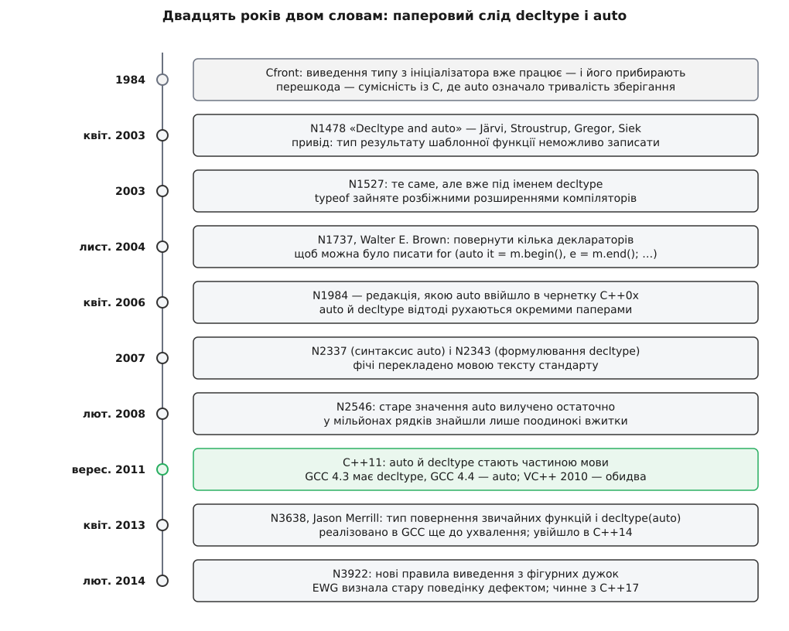

# 📜 Двадцять років двом словам: як народилися decltype і auto

Це історія про те, як `auto` з найнепотрібнішого слова C стало одним із найуживаніших слів C++ — і чому воно ввійшло в мову не саме, а в парі з `decltype`. Історія тут не прикраса: майже кожна дивина в поведінці цих двох конструкцій — прямий наслідок того, яку задачу вони мали розв'язати навесні 2003 року й у якому порядку комітет її розплутував.



*Двадцять років і десяток документів — від першої, знятої з розгляду спроби до правил, які чинні сьогодні.*

## Слово, яке всі мали і ніхто не писав

До C++11 `auto` було специфікатором класу зберігання, успадкованим від C: воно казало «ця змінна має автоматичну тривалість зберігання», тобто живе до кінця блоку й лежить у стеку. Проблема в тому, що локальна змінна й так автоматична — специфікатор не змінював нічого. Він існував заради симетрії з `static`, `register` і `extern`, а писати його не було жодної причини.

У C цей мертвий специфікатор мав ще одне, реальне вживання: до стандартизації 1989 року в C діяло правило неявного `int`, тож `auto i;` означало «локальна змінна типу `int`». Слово було потрібне тільки щоб рядок узагалі виглядав як оголошення, а не як вираз. Саме цей залишок і тримав `auto` заручником: доки хтось міг так писати, віддати слово під щось інше було не можна.

## 1984: перша спроба, знята через сумісність із C

Найраніший епізод цієї історії задокументований лише як свідчення самого Bjarne Stroustrup у його C++11 FAQ: виведення типу зі значення-ініціалізатора він реалізував у Cfront ще на початку 1984 року й був змушений прибрати саме через сумісність із C. Це спогад автора, а не збережений артефакт — вихідних текстів того прототипу з цією фічею публічно не наводять, тож статус твердження — свідчення першої особи, правдоподібне й не спростоване, але не перевірене документом.

Перешкода зникла тихо й з іншого боку. C++98 і C99 обидва скасували неявний `int` — відтоді кожна змінна й кожна функція мусять мати явно записаний тип. Разом із неявним `int` помер і єдиний сценарій, де `auto` щось важило. Слово лишилося в граматиці як порожня комірка, і років через п'ятнадцять комітет цю комірку зайняв.

## Квітень 2003: не «менше друкувати», а «неможливо записати»

Пропозиція, з якої все почалося, — **N1478 «Decltype and auto»**, датована 28 квітня 2003 року; автори — Jaakko Järvi, Bjarne Stroustrup, Douglas Gregor і Jeremy Siek. Важливо, з чого вона починається: автори констатують, що в C++ немає ані способу спитати тип виразу, ані способу оголосити змінну, не назвавши її тип. І далі — фраза, яка пояснює весь дальший розвиток: брак оператора `typeof` для авторів узагальнених бібліотек — «worse than an inconvenience», бо тип результату узагальненої функції часто просто **неможливо виразити** (N1478, розділ мотивації).

Ось задача в тому вигляді, у якому вона стояла перед авторами:

```cpp
template <class Func, class T>
??? trace(Func f, T t) {
    std::cout << "Calling f";
    return f(t);
}
```

Замість `???` треба записати тип, який залежить від того, що поверне `f(t)` для конкретних `Func` і `T`. Мовних засобів для цього не було взагалі. Обхідний шлях був — і саме він доводив, що щось не так: бібліотеки писали метафункції, які вручну табулювали результат для кожної комбінації типів. Boost.Lambda і подібні бібліотеки тягли за собою десятки таких таблиць, і кожен новий тип користувача в них не потрапляв.

Тобто пара народилася не з бажання менше друкувати. Скорочення `std::map<…>::const_iterator` до `auto` — приємний побічний ефект; причиною була [шаблонна функція](topic:sys-plang-cpp/templates-basics), тип результату якої не має імені, доки не підставлено аргументи. Ідея виведення типу за ініціалізатором сама собою була давно відома — [мови сімейства ML](topic:sf-lang/type-inference) виводили типи цілих програм ще з 1970-х, — але C++ потребував не глобального висновку, а точкового приладу: «скажи мені тип ось цього виразу, я вставлю його в оголошення».

Звідси й пара. Один прилад питає тип **виразу** (`decltype`), другий ставить виведений тип у **оголошення змінної** (`auto`). Вони й досі спираються на різні механізми: `auto` працює за правилами [виведення аргументів шаблону](topic:sys-plang-cpp/template-argument-deduction) — з відкиданням посилань і верхнього `const`, — а `decltype` повертає оголошений тип, нічого не відкидаючи. Ця розбіжність — не недогляд, а різні відповіді на різні питання, поставлені в одному папері.

## Чому не typeof

Очевидне ім'я для першого приладу було `typeof`. Його не взяли, і причина суто практична: слово вже було зайняте розширеннями компіляторів, і — головне — ці розширення поводилися **по-різному**. Частина реалізацій (зокрема EDG, Metrowerks, GCC) відкидала посилання в результаті, частина зберігала. Взяти назву `typeof` означало або зламати чийсь наявний код, або назавжди залишити двозначність у тому, що саме повертає оператор.

Розв'язок описано вже в другій редакції — **N1527 «Mechanisms for querying types of expressions: decltype and auto revisited»** (Järvi і Stroustrup, мейлінг другої половини 2003 року): нове ім'я `decltype`, від *declared type*. Ім'я обрано так, щоб воно саме проговорювало семантику: оператор повертає **оголошений** тип, а не «тип, який залишиться після звичних мовних усічень». Тому `decltype` зберігає і посилання, і `const`, і — за правилом, яке залишилося в остаточному тексті стандарту, — розрізняє `decltype(x)` та `decltype((x))`: у першому випадку питають про ім'я, у другому — про вираз, а вираз-lvalue дає тип `int&`.

Далі пішли третя й четверта редакції: **N1607** (17 лютого 2004) і **N1705** (12 вересня 2004), обидві ще з назвою «Decltype and auto». Авторський склад помітно змінюється: Gregor і Siek у пізніших редакціях не значаться, натомість у N1705 з'являється Gabriel Dos Reis. Це видно просто з титульних сторінок паперів у реєстрі WG21 — факт документований.

## Кома, яка ледь не зникла

Восени 2004 року стався епізод, який добре показує, наскільки дрібними бувають рішення, що потім формують щоденний стиль. У тодішній редакції пропозиції оголошення з `auto` дозволяло лише **один** декларатор. Причина зрозуміла: у звичайному оголошенні `int x, y;` тип записано один раз і він спільний, а при виведенні кожна змінна може дати свій тип — і незрозуміло, що тоді означає кома.

**N1737 «A Proposal to Restore Multi-declarator auto Declarations»** — Walter E. Brown, 2 листопада 2004 року — наполягав, що обмеження треба зняти. Аргумент був практичний: без коми не написати найзвичайнісінький цикл

```cpp
for (auto it = m.begin(), e = m.end(); it != e; ++it) { /* … */ }
```

а це саме той код, задля якого `auto` й хотіли бачити в мові.

У C++11 кому повернули з умовою, яка знімає двозначність: декларатори в одному оголошенні дозволені, але **всі мусять вивести один і той самий тип**. Тому цикл вище компілюється, а ось таке — ні:

```cpp
auto a = 1, b = 2;      // ок: обидва int
auto c = 1, d = 2.0;    // помилка: int і double в одному оголошенні
```

## Як пара розійшлася по різних паперах

Приблизно з кінця 2004 року дві половини перестають їхати в одному документі. `auto` дістає власну лінію паперів з назвою «Deducing the type of variable from its initializer expression» — N1721, далі редакції N1794, N1894 і, нарешті, **N1984** (Järvi, Stroustrup, Dos Reis, 6 квітня 2006), саме її Stroustrup цитує в C++11 FAQ як пропозицію, за якою `auto` ввійшло в мову. `decltype` іде своєю лінією: **N1978 «Decltype (revision 5)»** (24 квітня 2006) — зверніть увагу на назву, слова «and auto» в ній уже немає, — потім N2115 і остаточне формулювання **N2343 «Decltype (revision 7): proposed wording»** (18 липня 2007).

Лишалося прибрати за собою. **N2337 «The Syntax of auto Declarations»** (Daveed Vandevoorde, 1 серпня 2007) довів до ладу граматику: `auto` мусило стати нормальним елементом оголошення, а не окремою його формою. А **N2546 «Removal of auto as a storage-class specifier»** (Daveed Vandevoorde і Jens Maurer, 28 лютого 2008) формально забрав у слова старе значення. За розповіддю C++11 FAQ, перед цим кроком кілька членів комітету перечесали мільйони рядків наявного коду в пошуках старого `auto` — і знайшли лічені вжитки, здебільшого в тестових наборах компіляторів або схожі на помилки. Це переказ у FAQ, а не опублікований звіт із цифрами; але сам напрямок висновку підтверджується тим, що ламального переходу галузь не помітила.

## Коли це справді запрацювало

Папір і компілятор — різні дати, і розрив тут показовий. `decltype` з'явився в GCC ще у версії 4.3 (2008), `auto` — у GCC 4.4 (2009), тобто за два з половиною роки **до** публікації стандарту ISO/IEC 14882:2011 у вересні 2011-го. Visual C++ 2010 віз обидва разом із лямбдами й rvalue-посиланнями. Тож на момент, коли C++11 став офіційним, [підтримка в компіляторах](topic:sys-plang-cpp/compiler-support) уже була — і рахувати «вік `auto`» від 2011 року означає помилятися років на три.

## C++14: борг, який повернули

У C++11 виведення типу повернення дісталося лише лямбдам. Для звичайної функції довелося або писати тип уручну, або вживати кінцевий тип повернення з `decltype` — а це часто змушувало **повторювати весь вираз** із тіла функції в її заголовку. Пропозицію на цю тему (N2954) з C++11 викинули через брак часу.

Борг закрив **N3638 «Return type deduction for normal functions»** — Jason Merrill, 17 квітня 2013 року. Автор — супровідник фронтенду C++ у GCC, і в папері прямо сказано, що функційність уже реалізовано в GCC; тобто це той випадок, коли реалізація випередила ухвалу, а не навпаки. Реєстр підтримки GCC це підтверджує: попередня редакція (N3386) працює вже в GCC 4.8, а сам N3638 — у GCC 4.9.

Саме цей папір увів **`decltype(auto)`** — заповнювач, який виводить тип за правилами `decltype`, а не `auto`, і завдяки цьому не втрачає посилання й `const`. Показово, що ім'я нової конструкції — буквально склеєні імена двох слів із пропозиції 2003 року; десять років по тому пара, розділена на два папери, знову зійшлася в одному записі.

## 2014: фігурні дужки, визнані дефектом

Останній штрих торкнувся стику `auto` з [фігурними дужками ініціалізації](topic:sys-plang-cpp/initialization-forms). За правилами C++11 `auto x{3};` виводило `std::initializer_list<int>` — що майже завжди не те, чого хотів автор коду, і що особливо боляче било по «однаковому скрізь» стилю ініціалізації.

**N3922 «New Rules for auto deduction from braced-init-list»** — James Dennett, 13 лютого 2014 року — розділив два випадки: при копійній ініціалізації через `=` список і далі дає `initializer_list`, але лише якщо всі елементи однакового типу; при прямій ініціалізації дужками список з одного елемента дає тип цього елемента, а з кількох — помилку.

```cpp
auto x1 = { 1, 2 };     // std::initializer_list<int>
auto x2 = { 1, 2.0 };   // помилка: різні типи елементів
auto x3{ 1, 2 };        // помилка: пряма ініціалізація, елементів більше одного
auto x4{ 3 };           // int  (у C++11 було std::initializer_list<int>)
```

У самому папері зафіксовано вказівку робочої групи з еволюції мови вважати попередню поведінку **дефектом** C++14. Формально зміна пішла в C++17, але з таким статусом реалізації застосували її й до попередніх режимів: GCC зробив це у версії 5. Через це та сама програма, зібрана GCC 4.9 і GCC 5 з тим самим `-std=c++11`, може дати різні типи — рідкісний випадок, коли «стандарт не змінювався, а поведінка змінилася» є не помилкою компілятора, а свідомим виправленням.

## Кільце замкнулося

У 2022 році WG14 — комітет мови C — ухвалив пропозицію **N3007 «Type inference for object definitions»**, і в C23 `auto` теж стало засобом виведення типу. Формулювання показове: старе значення слова збережене, якщо `auto` вжито разом із типом, — C дозволив собі менше, ніж C++, і виведення там працює тільки для означень об'єктів, не для типів повернення чи параметрів функцій.

Тобто слово, яке C++ 1984 року не зміг забрати саме через сумісність із C, за тридцять вісім років повернулося в C — уже в новому значенні, запозиченому в C++. Дорогу йому проклала практика: обидва головні компілятори мали для C розширення `__auto_type` задовго до того, як комітет це узаконив.
