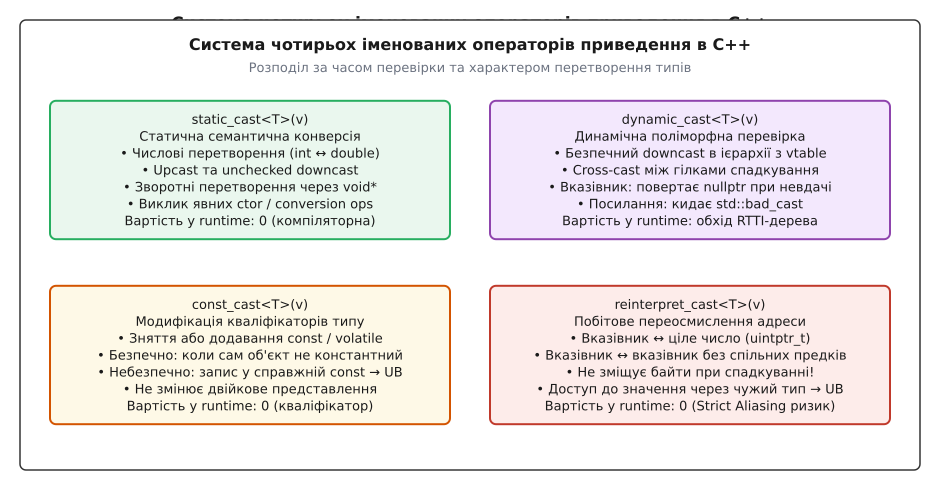
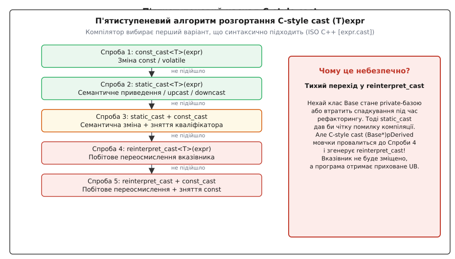
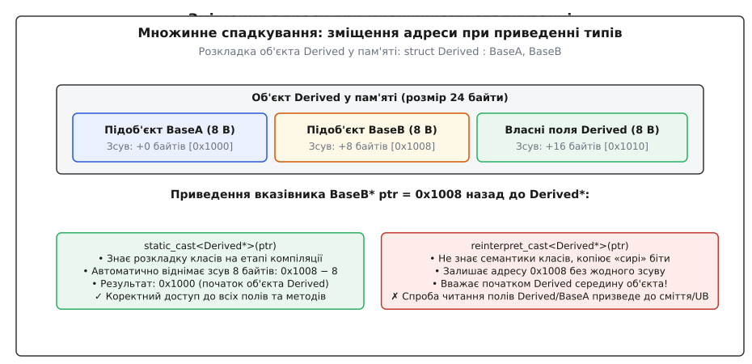
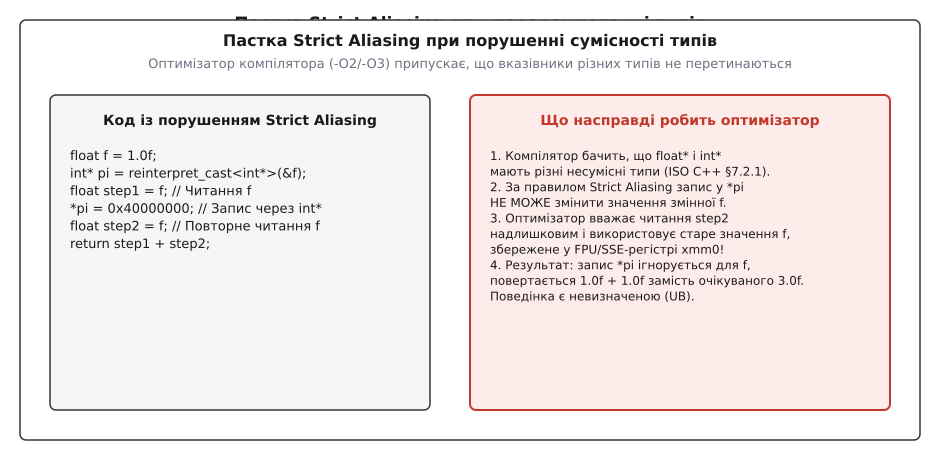
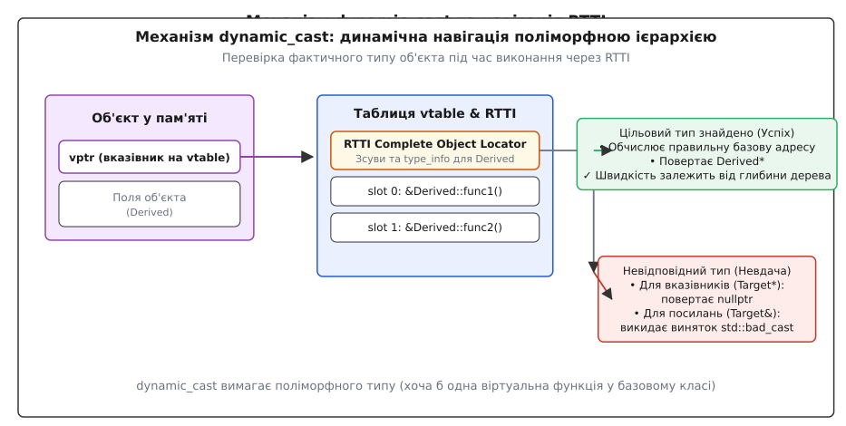

# Оператори приведення: static_cast, reinterpret_cast, const_cast

<preknowlist>
* [Адреси та вказівники у пам'яті](root:sf-lang/addresses-pointers)
* [Невизначена поведінка (Undefined Behavior)](root:sf-lang/undefined-behavior)
* [Константна коректність (const-correctness)](root:sys-plang-cpp/const-correctness)
* [RTTI та динамічне приведення типів](root:sys-plang-cpp/rtti-and-dynamic-cast)
* [Категорії значень (Value Categories)](root:sys-plang-cpp/value-categories)
* [Множинне та віртуальне спадкування](root:sys-plang-cpp/multiple-and-virtual-inheritance)
</preknowlist>

> 🔧 **Навіщо це.**
> У мові C існує лише один універсальний синтаксис явного приведення типу — `(Type)value`. Він намагається зробити все: від зміни формату числа та зняття константності до грубого побітового переосмислення вказівника. У C++ через наявність класів, множинного спадкування та поліморфізму такий монолітний підхід стає катастрофічно небезпечним: звичайний рефакторинг класу здатний мовчки перетворити безпечну зміну типу на пошкодження пам'яті. Система чотирьох іменованих операторів C++ (`static_cast`, `const_cast`, `reinterpret_cast`, `dynamic_cast`) розділяє ці операції за семантичним наміром, гарантуючи контроль компілятора та передбачуваність на рівні машинних інструкцій.

Уявімо типову ситуацію під час рефакторингу великого графічного рушія. Клас `Camera` успадковує інтерфейси `Transformable` та `Renderable`. У коді підсистеми рендерингу вказівник на `Renderable*` перетворюють назад на конкретну камеру за допомогою синтаксису мови C: `Camera* cam = (Camera*)pRenderable;`. Оскільки об'єкт `Renderable` розташований у пам'яті за зміщенням +8 байтів від початку `Camera`, компілятор генерує інструкцію, яка віднімає 8 байтів від адреси, і все працює бездоганно.

Через пів року архітектуру оновлюють: інтерфейс `Renderable` роблять приватним базовим класом (`private Renderable`) або замінюють спадкування на композицію. Що робить компілятор, натрапивши на старий вираз `(Camera*)pRenderable`? Замість того, щоб зупинити збірку з повідомленням про помилку доступу, він **мовчки перемикається в режим побітового переосмислення**. Зсув адреси перестає відніматися. Вказівник `cam` отримує адресу середини об'єкта, метод `cam->update()` перезаписує чужі поля, і програма падає в абсолютно несподіваному місці через пошкодження купи.


*Співвідношення чотирьох операторів за часом перевірки та характером перетворення типів.*

Щоб унеможливити такі катастрофічні збої, стандарт C++ розділив операцію приведення типів на чотири спеціалізовані інструменти з чітко окресленими зонами відповідальності. Повну історію дебатів у комітеті WG21 та витоки цього дизайну описано у статті [Історія появи чотирьох операторів](root:sys-plang-cpp/cast-operators/hist-named-casts.md).

---

## 1. Анатомія C-style cast: невидимий каскад небезпек

Синтаксис `(TargetType)expression` (або еквівалентна функціональна форма `TargetType(expression)`) у C++ не є окремою апаратною інструкцією чи простим перетворенням. Згідно з пунктом стандарту ISO C++ [expr.cast], компілятор зобов'язаний спробувати розгорнути цей вираз за суворим п'ятиступеневим каскадом (вибирається перший варіант, що проходить компіляцію):

1. `const_cast<TargetType>(expression)`
2. `static_cast<TargetType>(expression)`
3. `static_cast<TargetType>(expression)`, за яким слідує `const_cast<TargetType>`
4. `reinterpret_cast<TargetType>(expression)`
5. `reinterpret_cast<TargetType>(expression)`, за яким слідує `const_cast<TargetType>`


*П'ятиступенева послідовність спроб компілятора при розгортанні виразу (Type)val.*

Головна небезпека C-style cast полягає саме у неявному переході від спроби 2 (`static_cast`) до спроби 4 (`reinterpret_cast`). Якщо типи сумісні за ієрархією спадкування, компілятор вибирає крок 2 і генерує коректний зсув адреси. Але щойно зв'язок спадкування розривається або стає закритим, компілятор не зупиняється — він автоматично опускається на крок 4, генеруючи «сире» побітове переосмислення без будь-яких попереджень.

Крім того, крок 3 і крок 5 автоматично знімають кваліфікатор `const`. Якщо ви хотіли лише змінити числовий тип або тип покажчика, C-style cast може непомітно зняти захист від запису з константного об'єкта, відкриваючи шлях до аварійного завершення програми.

### Асемблерний аналіз: тихе виродження вказівника при рефакторингу

Порівняємо машинний код (GCC 14 x86-64 `-O2`), який компілятор генерує для одного й того самого рядка коду `Camera* cam = (Camera*)pRenderable;` до і після зміни спадкування:

#### Сценарій А: Публічне спадкування (`public Renderable`) — крок 2 (`static_cast`)
```nasm
; Вхідний аргумент pRenderable у регістрі rdi (адреса підоб'єкта: 0x1008)
cast_public_scenario:
    test    rdi, rdi
    je      .Lzero
    lea     rax, [rdi-8]        ; ВІДНІМАННЯ ЗСУВУ 8 БАЙТІВ -> rax = 0x1000
    ret
.Lzero:
    xor     eax, eax
    ret
```

#### Сценарій Б: Приватне спадкування (`private Renderable`) — крок 4 (`reinterpret_cast`)
```nasm
; Той самий C-style cast (Camera*)pRenderable у разі закритого базового класу
cast_private_scenario:
    mov     rax, rdi            ; СИРЕ КОПІЮВАННЯ БЕЗ ЗМІЩЕННЯ -> rax = 0x1008!
    ret
```

У сценарії Б виклик будь-якого віртуального методу камери `cam->render()` прочитає чужу віртуальну таблицю за адресою `0x1008`, що призведе до передачі некоректного вказівника `this` або стрибка на довільну адресу пам'яті (SIGSEGV / General Protection Fault). `static_cast<Camera*>(pRenderable)` у сценарії Б негайно зупинив би компіляцію з помилкою `error: 'Renderable' is a private base of 'Camera'`, захистивши проект від катастрофи.

---

## 2. `static_cast`: статична семантична конверсія

Оператор `static_cast<TargetType>(expression)` призначений для всіх перетворень, які є зворотними, мають чіткий семантичний зміст і можуть бути повністю перевірені та розраховані на етапі компіляції (compile-time). Він генерує інструкції процесора лише тоді, коли змінюється фізичне представлення даних (наприклад, формат числа або зміщення покажчика в об'єкті).

### Числові перетворення та зміна розрядності

При роботі з фундаментальними типами `static_cast` виконує стандартні числові перетворення (numeric conversions):

```cpp
double pi = 3.1415926535;
// Явне відкидання дробової частини (truncation): з double у 32-бітний int
int integer_pi = static_cast<int>(pi);

int count = 42;
// Розширення без знаку
auto unsigned_count = static_cast<unsigned int>(count);
```

Якщо перетворення призводить до втрати точності (звуження діапазону або втрата дробової частини), `static_cast` фіксує в коді явний намір програміста, пригнічуючи попередження компілятора (`-Wconversion`).

### Конструктори та оператори приведення

Вираз `static_cast<TargetType>(expr)` використовує правила прямої ініціалізації (`TargetType temp(expr);`). Це означає, що `static_cast` є єдиним законним способом викликати конструктори, оголошені з ключовим словом `explicit`, а також явні оператори перетворення типу (`explicit operator Type()`):

:::tabs
@tab C (Немає підтримки explicit)
```c
#include <stdint.h>

typedef struct {
    int32_t raw_value;
} HandleC;

HandleC make_handle_c(int32_t v) {
    HandleC h = { v };
    return h;
}
```
@tab C++ (Ідіоматичний static_cast)
```cpp
#include <cstdint>

class BufferHandle {
public:
    explicit BufferHandle(int32_t id) noexcept : id_(id) {}
    explicit operator bool() const noexcept { return id_ >= 0; }
    [[nodiscard]] int32_t get() const noexcept { return id_; }

private:
    int32_t id_;
};

void process() {
    int32_t raw_fd = 105;
    // Виклик explicit-конструктора
    BufferHandle handle = static_cast<BufferHandle>(raw_fd);

    // Виклик explicit-оператора operator bool()
    bool is_valid = static_cast<bool>(handle);
}
```
:::

### Перетворення типізованих переліків (Scoped Enums `enum class`)

У сучасному C++ переліки `enum class` не приводяться до цілих чисел неявно, що усуває випадкові помилки змішування прапорців. `static_cast` є єдиним безпечним способом конвертації між переліком та його базовим цілочисельним типом:

```cpp
#include <type_traits>
#include <cstdint>

enum class EngineState : uint8_t {
    kStopped = 0,
    kStarting = 1,
    kRunning = 2,
    kFault = 255
};

// Конвертація з цілого числа (наприклад, з двійкового протоколу):
uint8_t raw_byte = 2;
auto state = static_cast<EngineState>(raw_byte);

// Зворотна конвертація у базовий цілочисельний тип:
auto raw_val = static_cast<std::underlying_type_t<EngineState>>(state);
```

> [!NOTE]
> Якщо ціле число виходить за межі діапазону допустимих значень базового типу переліку, приведення має визначену стандартом поведінку для `enum class` з фіксованим базовим типом (значення обчислюється за правилами модульної арифметики або усікання).

### Умовно явні конструктори: `explicit(bool)` (C++20)

Стандарт C++20 ввів можливість оголошувати конструктори як умовно явні (`conditionally explicit`). Це дозволяє створювати узагальнені шаблонні обгортки (наприклад, `std::optional`, `std::pair`), які є неявними, якщо типи, що обгортаються, підтримують неявне перетворення, і стають `explicit`, якщо типи вимагають явного приведення:

```cpp
template <typename T>
struct SafeWrapper {
    T value;

    // Конструктор стає explicit, якщо T не можна неявно сконструювати з U
    template <typename U>
    explicit(!std::is_convertible_v<U, T>) constexpr SafeWrapper(U&& u)
        : value(std::forward<U>(u)) {}
};
```

Використання `static_cast<SafeWrapper<T>>(arg)` уніфікує роботу як з явними, так і з неявними ініціалізаціями.

---

### Навігація в ієрархіях класів: Upcast та Unchecked Downcast

В об'єктно-орієнтованих ієрархіях `static_cast` виконує два типи перетворень:
1. **Upcast (приведення вгору):** перетворення від похідного класу до базового (`Derived*` → `Base*`). Це приведення завжди безпечне і може виконуватися навіть неявно, проте `static_cast` дозволяє вказати його явно при усуненні неоднозначностей.
2. **Unchecked Downcast (статичне приведення вниз):** перетворення від базового класу до похідного (`Base*` → `Derived*`).


*Різниця в поведінці static_cast та reinterpret_cast при приведенні вказівника на підоб'єкт.*

При множинному спадкуванні об'єкт `Derived` містить підоб'єкт `BaseB` за певним зміщенням (наприклад, +8 байтів). Коли ми виконуємо downcast:

```cpp
struct BaseA { int a; };
struct BaseB { int b; };
struct Derived : BaseA, BaseB { int c; };

Derived obj;
BaseB* pBaseB = &obj; // Адреса зміщена на +8 байтів: 0x1008

// static_cast знає структуру класів і ВІДНІМАЄ 8 байтів!
// Результат: 0x1000 (початок об'єкта Derived)
Derived* pDerived = static_cast<Derived*>(pBaseB);
```

Компілятор генерує апаратну інструкцію `lea rax, [rdi-8]` або `sub rdi, 8`. Вказівник коригується автоматично.

> [!WARNING]
> `static_cast` не перевіряє реальний тип об'єкта під час виконання! Якщо за вказівником `BaseB*` насправді знаходиться інший клас `OtherDerived`, зміщення адреси буде виконано «наосліп», що призведе до невизначеної поведінки при першому зверненні до полів `Derived`. Для безпечної динамічної перевірки слід використовувати `dynamic_cast`.

### Категорії значень та механіка `std::move`

Фундаментальним застосуванням `static_cast` у сучасному C++ є зміна категорії значення (Value Category) виразу. Функція стандартної бібліотеки `std::move` реалізована виключно через `static_cast` до rvalue-посилання (`T&&`):

```cpp
template <typename T>
constexpr std::remove_reference_t<T>&& custom_move(T&& arg) noexcept {
    // Перетворення lvalue у xvalue (eXpiring value)
    return static_cast<std::remove_reference_t<T>&&>(arg);
}
```

Цей вираз не генерує жодних апаратних інструкцій під час виконання. Він лише змінює тип виразу для системи перевантаження функцій компілятора, дозволяючи викликати переміщувальний конструктор (`move constructor`) або переміщувальний оператор присвоєння замість копіювання.

### Приведення вказівників на члени класів (Pointer-to-Member)

`static_cast` підтримує інвертовану адресну арифметику для вказівників на члени класів:

```cpp
struct Base { int base_field; };
struct Derived : Base { int derived_field; };

int Base::* p_base = &Base::base_field;

// Дозволено: приведення від Base до Derived (інвертований напрямок)
int Derived::* p_derived = static_cast<int Derived::*>(p_base);
```

Оскільки об'єкт `Derived` гарантовано містить у своїй структурі всі поля класу `Base`, звернення `derived_obj.*p_derived` є безпечним. Зворотне перетворення (`Derived::*` → `Base::*`) заборонено на етапі компіляції, оскільки поле похідного класу відсутнє в базовому класі.

### Проблема зрізання об'єкта (Object Slicing)

При роботі зі `static_cast` в ієрархіях класів важливо чітко розрізняти приведення покажчиків/посилань та приведення за значенням (by-value).

Коли об'єкт похідного класу приводиться до типу базового класу за значенням:
```cpp
struct Base {
    int id{1};
    virtual void print() const { std::cout << "Base\n"; }
};

struct Derived : Base {
    int extra_payload{42};
    void print() const override { std::cout << "Derived\n"; }
};

Derived d;
// Небезпека: Object Slicing!
Base b = static_cast<Base>(d);
b.print(); // Виводить "Base", а не "Derived"!
```

У цьому випадку відбувається копіювання виключно полів класу `Base` у новий стек-фрейм змінної `b`. Усі додаткові поля класу `Derived` відкидаються (зрізаються), а покажчик на віртуальну таблицю `vptr` перезаписується адресою vtable класу `Base`. Поліморфізм повністю втрачається. `static_cast` повинен застосовуватися до посилань (`static_cast<Base&>(d)`) або покажчиків, щоб зберегти цілісність поліморфного об'єкта.

### Ромбоподібна ієрархія та віртуальне спадкування (Virtual Inheritance)

Особливе обмеження `static_cast` виникає в ромбоподібних ієрархіях із віртуальним спадкуванням:

```cpp
struct Node { virtual ~Node() = default; };
struct LeftBranch : virtual Node {};
struct RightBranch : virtual Node {};
struct DiamondNode : LeftBranch, RightBranch {};

void inspect_diamond(Node* node) {
    // ПОМИЛКА КОМПІЛЯЦІЇ: static_cast не може виконати downcast від віртуальної бази!
    // DiamondNode* d = static_cast<DiamondNode*>(node); // Error: cannot cast from virtual base

    // ЄДИНИЙ безпечний спосіб — dynamic_cast:
    DiamondNode* d = dynamic_cast<DiamondNode*>(node);
}
```

Чому `static_cast` безсилий при віртуальному спадкуванні?
При віртуальному спадкуванні зміщення базового підоб'єкта `Node` відносно `DiamondNode` не є фіксованою константою часу компіляції. Розташування `Node` визначається лише в момент створення кінцевого об'єкта і зберігається у таблиці зсувів віртуальних баз (`vbtable` / *virtual base table*). Оскільки `static_cast` не звертається до метаданих часу виконання, компілятор відмовляється генерувати статичний зсув і видає помилку. Лише `dynamic_cast` здатен прочитати зміщення з `vbtable` та обчислити правильну адресу.

### Безпечні зворотні перетворення через `void*`

`static_cast` є стандартним інструментом для відновлення типу вказівника після його збереження у `void*` (наприклад, у користувацьких контекстах C-бібліотек або функцій зворотного виклику callback):

```cpp
void callback_wrapper(void* user_data) {
    // Гарантовано безпечно, якщо user_data дійсно вказував на SessionContext
    auto* session = static_cast<SessionContext*>(user_data);
    session->on_event();
}
```

---

## 3. `const_cast`: модифікація кваліфікаторів типу

Оператор `const_cast<TargetType>(expression)` — єдиний оператор у C++, здатний додавати або знімати кваліфікатори константності `const` та мінливості `volatile` (cv-кваліфікатори, від англ. *const-volatile qualifiers*).

Він не змінює бітове представлення об'єкта і не генерує жодних інструкцій процесора. Його дія полягає виключно в модифікації типу у внутрішній таблиці символів компілятора.

### Легальне застосування: взаємодія з застарілими C API

Класичним сценарієм законного використання `const_cast` є виклик застарілих бібліотек мови C, які приймають параметри як неконстантні покажчики `char*`, але фактично не модифікують буфер (наприклад, старі реалізації синтаксичних аналізаторів):

:::tabs
@tab C (Legacy library interface)
```c
// Бібліотечна функція, яка приймає char*, але лише читає рядок
int legacy_c_calculate_hash(char* data, int len);
```
@tab C++ (Безпечне зняття const)
```cpp
#include <string_view>

int calculate_hash_bridge(std::string_view text) {
    // text.data() має тип const char*.
    // Оскільки ми знаємо, що функція лише читає пам'ять, const_cast є легальним:
    return legacy_c_calculate_hash(const_cast<char*>(text.data()), static_cast<int>(text.size()));
}
```
:::

Іншим класичним патерном є усунення дублювання коду в константних та неконстантних версіях методів доступу (патерн Скотта Мейєрса):

```cpp
class TextBuffer {
public:
    const char& operator[](size_t idx) const noexcept {
        // Складна логіка перевірки меж, блокування м'ютекса, логування
        return data_[idx];
    }

    char& operator[](size_t idx) noexcept {
        // Викликаємо const-версію та знімаємо const з поверненого посилання
        return const_cast<char&>(
            static_cast<const TextBuffer&>(*this)[idx]
        );
    }

private:
    char data_[1024]{};
};
```

### Модифікація `volatile` у вбудованих системах

Крім `const`, оператор `const_cast` може знімати або додавати кваліфікатор `volatile`. Це необхідно при взаємодії з апаратно-залежними драйверами, коли функція бібліотеки вимагає передачі звичайного покажчика, але дані розташовані у відображеній пам'яті (MMIO), або навпаки:

```cpp
void process_buffer(uint8_t* ptr, size_t size);

void handle_hardware_dma(volatile uint8_t* dma_buffer, size_t size) {
    // Зняття volatile вимагає гарантії, що DMA-передача завершена
    process_buffer(const_cast<uint8_t*>(dma_buffer), size);
}
```

### Фізична проти логічної константності: ключове слово `mutable`

Часто виникає спокуса використати `const_cast` для модифікації внутрішнього стану об'єкта (наприклад, лічильника звернень, кешу або м'ютекса) всередині константного методу. Це антипатерн.

Мова C++ надає спеціалізований інструмент — ключове слово `mutable` (від лат. *mutabilis* — змінний). Поля, позначені як `mutable`, можуть легально модифікуватися всередині `const`-методів без застосування `const_cast`:

```cpp
#include <mutex>

class ThreadSafeCache {
public:
    int get_value(int key) const {
        std::lock_guard<std::mutex> lock(mutex_); // mutex_ змінює стан, будучи mutable!
        return cached_value_;
    }

private:
    int cached_value_{0};
    mutable std::mutex mutex_; // Легальна зміна стану в const-контексті
};
```

### Безпечне додавання константності: `std::as_const` (C++17)

Для зворотного процесу — безпечного додавання кваліфікатора `const` для виклику константних перевантажень — стандарт C++17 запровадив утиліту `std::as_const` (заголовок `<utility>`):

```cpp
#include <utility>
#include <vector>

void process_vector(std::vector<int>& v);
void process_vector(const std::vector<int>& v);

void caller(std::vector<int>& my_vec) {
    // Явний виклик const-версії функції без небезпечного ручного касту:
    process_vector(std::as_const(my_vec));
}
```

### Невизначена поведінка: запис у справжній `const`

Фундаментальне правило стандарту ISO C++ [expr.const.cast]: **зняття `const` є законним, але модифікація об'єкта, який спочатку був створений як `const`, є невизначеною поведінкою (UB).**

```cpp
// Змінна розташована у секції пам'яті лише для читання (.rodata / ROM)
const int kGlobalLimit = 100;

void dangerous_mutation() {
    int* ptr = const_cast<int*>(&kGlobalLimit);
    *ptr = 200; // НЕВИЗНАЧЕНА ПОВЕДІНКА (UB)! Hard fault / SIGSEGV
}
```

Компілятор має право розмістити змінну `kGlobalLimit` на сторінці пам'яті з апаратним захистом від запису (Read-Only Page). Спроба запису через покажчик викличе апаратне виключення процесора (Page Access Violation). Навіть якщо змінна знаходиться на стеку, оптимізатор міг підставити значення `100` у всі місця використання як константу під час компіляції, тому зміна пам'яті не матиме жодного ефекту.

---

## 4. `reinterpret_cast`: побітове переосмислення пам'яті

Оператор `reinterpret_cast<TargetType>(expression)` здійснює низькорівневе, безпосереднє переосмислення бітових шаблонів без зміни числових адрес і без генерації коду конверсії.

Він підтримує три категорії перетворень:
1. Вказівник на об'єкт ↔ Вказівник на довільний інший об'єкт (`Foo*` ↔ `Bar*`).
2. Вказівник на об'єкт ↔ Ціле число достатнього розміру (`uintptr_t`).
3. Вказівник на функцію ↔ Вказівник на іншу функцію.

### Моделі даних пам'яті: LP64, LLP64, ILP32 та приведення до цілих чисел

При перетворенні покажчиків у цілі числа через `reinterpret_cast` критично використовувати типи фіксованої адресної розрядності з `<cstdint>`: `uintptr_t` або `intptr_t`.

Використання звичайного типу `long` або `int` призводить до фатальних помилок при кросплатформеній розробці через різницю моделей даних:

| Модель даних | `int` | `long` | `long long` | Вказівник (`void*`) | Платформи |
| :--- | :--- | :--- | :--- | :--- | :--- |
| **ILP32** | 32 біти | 32 біти | 64 біти | 32 біти | 32-бітні x86, ARM, RISC-V |
| **LLP64** | 32 біти | 32 біти | 64 біти | 64 біти | 64-бітний Microsoft Windows (x64 / ARM64) |
| **LP64** | 32 біти | 64 біти | 64 біти | 64 біти | 64-бітні Linux, macOS, Android, iOS |

Якщо на платформі Windows x64 виконати приведення `reinterpret_cast<long>(ptr)`, відбудеться усікання 64-бітної адреси до 32-бітного `long`, що призведе до катастрофічного пошкодження покажчика при зворотній конверсії. `reinterpret_cast<uintptr_t>(ptr)` гарантовано зберігає повну розрядність на будь-якій архітектурі.

### Втрата зсуву адреси при множинному спадкуванні

Найбільш підступна помилка використання `reinterpret_cast` — застосування його до споріднених класів замість `static_cast`:

```cpp
Derived obj;
BaseB* pBaseB = &obj; // 0x1008

// ПОМИЛКА: reinterpret_cast НЕ ЗМІЩУЄ АДРЕСУ!
// pDerived отримає 0x1008 замість правильної адреси 0x1000.
Derived* pDerived = reinterpret_cast<Derived*>(pBaseB);

// Спроба викликати метод Derived призведе до збою this-покажчика:
pDerived->execute(); // Падіння або пошкодження пам'яті!
```

`reinterpret_cast` копіює «сирі» біти покажчика. Він не звертається до графа класів і не виконує компіляторну адресну арифметику.

### Пастка Strict Aliasing Rule

У низькорівневому програмуванні часто намагаються прочитати байти числа з рухомою комою як ціле число (type punning) через розіменування приведенного покажчика:

```cpp
float f = 1.0f;
// Формальне порушення стандарту ISO C++ [basic.lval]
uint32_t* u_ptr = reinterpret_cast<uint32_t*>(&f);
uint32_t bits = *u_ptr; // НЕВИЗНАЧЕНА ПОВЕДІНКА!
```


*Порушення правил аліасингу призводить до використання застарілого значення з регістру FPU/SSE.*

Компілятор при увімкненій оптимізації (`-O2` / `-O3`) вважає, що покажчики різних типів `float*` та `uint32_t*` не перетинаються в пам'яті. У результаті він може змінити порядок операцій запису та читання або закешувати значення в регістрі процесора, проігнорувавши зміну пам'яті.

### Винятки з правила Strict Aliasing: `char`, `unsigned char` та `std::byte`

Стандарт ISO C++ [basic.lval] робить фундаментальний виняток для трьох байтових типів:
1. `char*`
2. `unsigned char*`
3. `std::byte*` (починаючи з C++17)

Вказівники на ці три типи мають право аліасувати (посилатися на) об'єкт **будь-якого іншого типу**. Це дозволяє створювати буфери серіалізації, рахувати контрольні суми та копіювати байти без порушення правил оптимізатора. Проте зворотне правило не діє: вказівник на `int*` або `float*` не може аліасувати буфер `char[]` без створення об'єкта.

### Приведення покажчиків на функції (Function Pointer Casting)

`reinterpret_cast` дозволяє конвертувати покажчик на функцію однієї сигнатури у покажчик на функцію іншої сигнатури:

```cpp
using GenericFunc = void (*)();
using SpecificFunc = int (*)(double, int);

SpecificFunc real_func = [](double d, int i) -> int { return static_cast<int>(d) + i; };

// Збереження покажчика у загальному реєстрі функцій:
GenericFunc stored = reinterpret_cast<GenericFunc>(real_func);

// НЕВИЗНАЧЕНА ПОВЕДІНКА: прямий виклик через неправильну сигнатуру!
// stored(); // UB: порушення конвенції виклику (Calling Convention Mismatch)

// Єдиний законний спосіб — приведення назад до точного вихідного типу:
auto restored = reinterpret_cast<SpecificFunc>(stored);
int result = restored(3.14, 10); // Валідно!
```

### Атомарні вказівники та приведення в багатопотоковому середовищі

При розробці неблокуючих структур даних (Lock-Free Data Structures) виникає потреба приводити типи вказівників, що зберігаються в атомарних змінних `std::atomic<T*>`.

Пряме приведення `reinterpret_cast<std::atomic<Derived*>*>(&atomic_base_ptr)` є **невизначеною поведінкою (UB)**, оскільки структури `std::atomic<Base*>` та `std::atomic<Derived*>` можуть мати різний внутрішній стан блокувань або вирівнювання на деяких мікроконтролерах.

Правильний підхід полягає в завантаженні значення з атоміка та подальшому застосуванні `static_cast` або `dynamic_cast`:

```cpp
#include <atomic>

struct NodeBase { virtual ~NodeBase() = default; };
struct WorkerNode : NodeBase { int worker_id{0}; };

std::atomic<NodeBase*> global_head{nullptr};

void process_worker() {
    // 1. Атомарне завантаження з бар'єром пам'яті acquire
    NodeBase* raw_ptr = global_head.load(std::memory_order_acquire);

    // 2. Безпечне приведення після атомарного читання
    if (auto* worker = dynamic_cast<WorkerNode*>(raw_ptr)) {
        // Робота з WorkerNode
    }
}
```

У C++20 для роботи з сирою пам'яттю без створення окремого об'єкта `std::atomic` використовується `std::atomic_ref<T>` (заголовок `<atomic>`), який гарантує коректні атомарні операції над вирівняними даними.

Детальний практичний розбір цієї проблеми, асемблерний аналіз та безпечні альтернативи представлено у статті [Практикум Type Punning та Strict Aliasing](root:sys-plang-cpp/cast-operators/proj-type-punning.md).

---

## 5. `dynamic_cast`: динамічна поліморфна навігація

Оператор `dynamic_cast<TargetType>(expression)` реалізує безпечну динамічну навігацію ієрархіями класів під час виконання програми (runtime). На відміну від перших трьох операторів, він вимагає наявності інформації про типи часу виконання (RTTI — *Run-Time Type Information*) та таблиці віртуальних методів (`vtable`).

Базовий клас зобов'язаний бути **поліморфним**, тобто містити щонайменше одну віртуальну функцію (наприклад, віртуальний деструктор `virtual ~Base() = default;`).


*Пошук цільового типу в метаданих RTTI та поведінка при невідповідності.*

### Отримання адреси початку повного об'єкта: `dynamic_cast<void*>`

Унікальною можливістю `dynamic_cast` є приведення поліморфного покажчика до `void*`. У цьому випадку він повертає точну адресу початку найбільш похідного об'єкта (Most Derived Object):

```cpp
struct InterfaceA { virtual ~InterfaceA() = default; };
struct InterfaceB { virtual ~InterfaceB() = default; };
struct Concrete : InterfaceA, InterfaceB { int data; };

Concrete obj;
InterfaceB* pB = &obj; // 0x1008

// dynamic_cast<void*> повертає 0x1000 — точний початок Concrete!
void* most_derived_ptr = dynamic_cast<void*>(pB);
```

Це єдиний стандартизований спосіб знайти фізичний початок виділеного блоку пам'яті для користувацьких алокаторів при роботі з множинним спадкуванням.

### Небезпека виклику `dynamic_cast` у конструкторах та деструкторах

Під час конструювання або знищення об'єкта покажчик на віртуальну таблицю `vptr` оновлюється на кожному рівні ієрархії:
1. Коли виконується конструктор `Base`, об'єкт вважається екземпляром `Base`.
2. Таблиця `vtable` вказує на `Base`, а RTTI-структури похідного класу ще не ініціалізовані.
3. Спроба викликати `dynamic_cast<Derived*>(this)` всередині конструктора або деструктора `Base` гарантовано повертає `nullptr` (або кидає `std::bad_cast` для посилань).

---

### Внутрішній устрій RTTI: Complete Object Locator та Itanium C++ ABI

Як саме `dynamic_cast` знаходить цільовий тип? У відповідності до стандарту Itanium C++ ABI (який використовується компіляторами GCC, Clang, Intel на Linux, macOS, iOS, Android), кожен поліморфний об'єкт має наступну структуру віртуальної таблиці в пам'яті:

```text
  [ vtable layout у пам'яті ]
  -16 байтів: offset_to_top        (зсув від адреси vptr до початку всього об'єкта)
   -8 байтів: type_info*           (вказівник на RTTI-дескриптор повного класу)
    0 байтів: &Derived::vfunc1()   <-- Сюди вказує vptr об'єкта
   +8 байтів: &Derived::vfunc2()
```

Кожен виклик `dynamic_cast` транслюється у виклик низькорівневої функції середовища виконання:

```cpp
extern "C" void* __dynamic_cast(
    const void* sub,                  // Покажчик на вихідний об'єкт
    const __class_type_info* src,     // type_info статичного вихідного типу
    const __class_type_info* dst,     // type_info цільового типу
    ptrdiff_t src2dst_offset          // Підказка зміщення (hint) або -1/-2/-3
);
```

Структура виконання під капотом `__dynamic_cast`:
1. **Зчитування RTTI префікса:** функція бере покажчик `vptr` вихідного об'єкта `sub` і зчитує за зміщенням `[-1]` адресу структури `type_info` найбільш похідного об'єкта.
2. **Отримання `offset_to_top`:** за зміщенням `[-2]` зчитується зсув у байтах до вершини об'єкта (Most Derived Object).
3. **Обхід орієнтованого графа класів:** якщо цільовий тип не знайдено за підказкою `src2dst_offset`, середовище виконання виконує обхід дерева спадкування (Directed Acyclic Graph — DAG).
4. **Перевірка прав доступу:** RTTI містить прапорці публічного/приватного спадкування. Якщо цільовий тип є закритим базовим класом (`private Base`), `__dynamic_cast` повертає `nullptr`, запобігаючи несанкціонованому доступу.

### Обробка помилок приведення: покажчики проти посилань

Стандарт C++ передбачає два різних механізми реакції на невідповідність динамічного типу:

:::tabs
@tab C++ (Вказівники — повернення nullptr)
```cpp
#include <iostream>

struct Shape { virtual ~Shape() = default; };
struct Circle : Shape { void draw_circle() {} };
struct Square : Shape { void draw_square() {} };

void render(Shape* shape) {
    // Якщо shape не є екземпляром Circle, dynamic_cast повертає nullptr
    if (auto* circle = dynamic_cast<Circle*>(shape)) {
        circle->draw_circle();
    } else {
        // Об'єкт належить до іншого підтипу
    }
}
```
@tab C++ (Посилання — виняток std::bad_cast)
```cpp
#include <typeinfo>
#include <iostream>

struct Shape { virtual ~Shape() = default; };
struct Circle : Shape { void draw_circle() {} };

void render_ref(Shape& shape) {
    try {
        // Оскільки «нульових посилань» не існує, невдача кидає виняток:
        Circle& circle = dynamic_cast<Circle&>(shape);
        circle.draw_circle();
    } catch (const std::bad_cast& e) {
        std::cerr << "Помилка приведення посилання: " << e.what() << '\n';
    }
}
```
:::

### Cross-cast: приведення між сусідніми гілками

Унікальною можливістю `dynamic_cast` є виконання **cross-cast (бічного приведення)** між незалежними інтерфейсними гілками множинного спадкування:

```cpp
struct ILogger { virtual void log() = 0; virtual ~ILogger() = default; };
struct ISerializable { virtual void serialize() = 0; virtual ~ISerializable() = default; };

class NetworkService : public ILogger, public ISerializable {
public:
    void log() override {}
    void serialize() override {}
};

void process_service(ILogger* logger) {
    // ILogger та ISerializable не пов'язані між собою спадкуванням.
    // dynamic_cast знаходить через vtable спільний Most Derived Object (NetworkService)
    // та обчислює точну адресу інтерфейсу ISerializable:
    if (auto* serializable = dynamic_cast<ISerializable*>(logger)) {
        serializable->serialize();
    }
}
```

Жоден інший оператор C++ (включаючи `static_cast`) не здатний виконати cross-cast, оскільки зміщення між незалежними інтерфейсами неможливо визначити статично без інформації про кінцевий похідний клас.

Повні сигнатури, таблиці вартості виконання та крайові випадки всіх чотирьох операторів зібрано у статті [Повний технічний довідник операторів](root:sys-plang-cpp/cast-operators/api-casts-reference.md).

---

## 6. Сучасні альтернативи: `std::bit_cast` (C++20) та `std::start_lifetime_as` (C++23)

Розвиток стандартів C++20 та C++23 остаточно закрив ніші, де розробники системного коду раніше були змушені вдаватися до небезпечного `reinterpret_cast`.

### `std::bit_cast` (C++20): легальне побітове копіювання в `constexpr`

Функція `std::bit_cast` (заголовковий файл `<bit>`) надає безпечний, стандарто-сумісний спосіб перенесення бітів між trivially copyable об'єктами однакового розміру:

```cpp
#include <bit>
#include <cstdint>

// Повністю стандарто-сумісно, zero-cost, обчислюється під час компіляції!
constexpr uint32_t float_to_raw_bits(float f) noexcept {
    return std::bit_cast<uint32_t>(f);
}

static_assert(float_to_raw_bits(1.0f) == 0x3F800000u);
```

Компілятор оптимізує `std::bit_cast` до однієї регістрової інструкції `movd` (x86) або `fmov` (ARM), гарантуючи відсутність порушень Strict Aliasing.

### `std::start_lifetime_as` (C++23): робота з сирою пам'яттю без копіювання

Для високопродуктивних задач прямого читання структур із DMA-буферів або пакетів сокетів стандарт C++23 ввів функцію `std::start_lifetime_as` (заголовок `<memory>`). Вона явно починає час життя об'єкта в існуючому сирому буфері пам'яті, створюючи легальну модель об'єктів для оптимізатора без виклику конструкторів і без побайтового копіювання.

### `std::forward_like` (C++23): ідеальне передавання стану доступу

При написанні шаблонів доступу до полів об'єктів (наприклад, у реалізації `std::tuple` або кастомних контейнерів) розробники раніше були змушені вручну комбінувати кілька викликів `static_cast` для врахування константності та категорії значень (lvalue/rvalue).

Стандарт C++23 запровадив утиліту `std::forward_like` (заголовок `<utility>`), яка копіює кваліфікатори константності та посилання від типу власника до його підоб'єкта:

```cpp
#include <utility>
#include <string>

struct UserSession {
    std::string token;

    template <typename Self>
    auto&& get_token(this Self&& self) noexcept {
        // Замість складного ланцюжка static_cast копіює const/rvalue кваліфікатори Self на поле token:
        return std::forward_like<Self>(self.token);
    }
};
```

Ця техніка усуває необхідність у чотирьох перевантаженнях методів (`&`, `const &`, `&&`, `const &&`), зводячи їх до єдиної шаблонної функції з явним параметром `this` (Deducing this, P0847).

---

## 7. Архітектурні правила та найкращі практики

Для забезпечення надійності кодової бази та запобігання дефектам пам'яті дотримуйтесь наступної ієрархії вибору інструментів:

1. **Неявні перетворення (Implicit Conversions):** використовуйте завжди, коли перетворення є безпечним за замовчуванням (`Derived*` → `Base*`, `int` → `double`).
2. **`static_cast`:** основний інструмент для зворотних перетворень, числових операцій, виклику явних конструкторів та приведення вгору/вниз в ієрархіях класів.
3. **`dynamic_cast`:** використовуйте виключно для поліморфних ієрархій, коли фактичний тип об'єкта невідомий заздалегідь або потрібен cross-cast.
4. **`std::bit_cast` (або `std::memcpy`):** єдиний легальний вибір для інтерпретації двійкового представлення даних (type punning).
5. **`const_cast`:** ізолюйте на межі інтеграції з legacy C API; ніколи не використовуйте для модифікації справжніх `const`-об'єктів.
6. **`reinterpret_cast`:** використовуйте лише для низькорівневих апаратних адрес (MMIO) та взаємодії з системними викликами ОС.
7. **C-style cast `(Type)val`:** категорично забороніть у правилах лінтера та CI/CD за допомогою прапорця компілятора `-Wold-style-cast`.

### Діагностичні прапорці компіляторів та статичний аналіз

Для автоматичного захисту кодової бази від небезпечних приведень налаштуйте вашу систему збірки (CMake / Meson) з наступними прапорцями:

| Прапорець компілятора (GCC / Clang) | Призначення | Дія при виявленні дефекту |
| :--- | :--- | :--- |
| `-Wold-style-cast` | Забороняє C-style касти `(Type)val` | Помилка компіляції (вимагає іменованих операторів) |
| `-Wcast-qual` | Відстежує неявне або некоректне зняття кваліфікаторів `const`/`volatile` | Попередження про втрату безпеки константності |
| `-Wcast-align` | Попереджає про приведення до типу з більшою вимогою вирівнювання | Захищає від апаратних BusFault на ARM/MIPS |
| `-Wstrict-aliasing=2` | Попереджає про можливі порушення Strict Aliasing при розіменуванні покажчиків | Виявляє небезпечний type punning |
| `-Wconversion` | Попереджає про неявні числові звуження (наприклад, `double` → `int`) | Змушує явно писати `static_cast` |
| `-fsanitize=undefined` | Вмикає runtime-детектор невалідних приведень та вирівнювання | Негайний краш при спробі некоректного доступу |

---

## 8. Продуктивність та альтернативи RTTI: техніка LLVM-style Casts

Хоча `dynamic_cast` гарантує 100% динамічну безпеку, у високонавантаженому коді (компілятори, ігрові рушії, фізичні симулятори) його використання на гарячих шляхах часто є неприпустимим через накладні витрати на обхід структур RTTI та блокування кешу інструкцій.

Проект LLVM розробив власну високоефективну ідіому поліморфного приведення (`llvm::isa`, `llvm::cast`, `llvm::dyn_cast`), яка працює зі швидкістю звичайного `static_cast`, не вимагаючи ввімкненого RTTI (`-fno-rtti`):

:::tabs
@tab C (Manual type tagging)
```c
#include <stdbool.h>

typedef enum {
    NODE_EXPR,
    NODE_STMT,
    NODE_DECL
} NodeKindC;

typedef struct {
    NodeKindC kind;
} ASTNodeC;

typedef struct {
    ASTNodeC base;
    int value;
} ExprNodeC;

bool is_expr_node_c(const ASTNodeC* node) {
    return node && node->kind == NODE_EXPR;
}

ExprNodeC* cast_to_expr_c(ASTNodeC* node) {
    return is_expr_node_c(node) ? (ExprNodeC*)node : 0;
}
```
@tab C++ (LLVM-style Custom RTTI)
```cpp
#include <concepts>
#include <memory>
#include <iostream>

class ASTNode {
public:
    enum class Kind {
        kExpr,
        kStmt,
        kDecl
    };

    explicit constexpr ASTNode(Kind k) noexcept : kind_(k) {}
    [[nodiscard]] constexpr Kind get_kind() const noexcept { return kind_; }
    virtual ~ASTNode() = default;

private:
    Kind kind_;
};

class ExprNode final : public ASTNode {
public:
    explicit constexpr ExprNode(int val) noexcept
        : ASTNode(Kind::kExpr), value_(val) {}

    // Метод перевірки типу для системи LLVM-style RTTI
    static bool classof(const ASTNode* node) noexcept {
        return node && node->get_kind() == Kind::kExpr;
    }

    [[nodiscard]] int get_value() const noexcept { return value_; }

private:
    int value_;
};

// Реалізація власного шаблону dyn_cast
template <typename Target, typename Source>
Target* fast_dyn_cast(Source* src) noexcept {
    if (Target::classof(src)) {
        // Оскільки перевірку тегу пройдено, static_cast є на 100% безпечним і безкоштовним!
        return static_cast<Target*>(src);
    }
    return nullptr;
}
```
:::

### Чому LLVM-style RTTI перевершує `dynamic_cast`?
1. **Швидкість однієї інструкції:** перевірка `node->get_kind() == Kind::kExpr` транслюється в одну інструкцію порівняння `cmp dword ptr [rdi], 0` та умовний перехід, тоді як `dynamic_cast` вимагає виклику важкої бібліотечної підпрограми `__dynamic_cast` з читанням ланцюжків покажчиків у пам'яті.
2. **Нульовий оверхед vtable для типів:** метадані типу зберігаються безпосередньо в полі класу або в його бітових прапорцях.
3. **Сумісність із `-fno-rtti`:** техніка дозволяє збирати критичні за розміром бінарники без увімкнення генерації RTTI у компіляторі.

### Статичний поліморфізм через CRTP (Curiously Recurring Template Pattern)

Якщо ієрархія класів відома на етапі компіляції і не вимагає динамічного завантаження плагінів, найкращою альтернативою `dynamic_cast` є шаблон CRTP (дивно повторюваний шаблонний патерн).

Він повністю замінює віртуальні таблиці та runtime-приведення на нуль-вартісний `static_cast`:

```cpp
template <typename Derived>
class ShapeCRTP {
public:
    void draw() const {
        // Статичний downcast без жодного оверхеду vtable та RTTI:
        static_cast<const Derived*>(this)->draw_impl();
    }
};

class CircleCRTP : public ShapeCRTP<CircleCRTP> {
public:
    void draw_impl() const {
        // Конкретна реалізація малювання кола
    }
};

template <typename T>
void render_shape(const ShapeCRTP<T>& shape) {
    shape.draw(); // Прямий виклик функції без vtable lookup (inlined!)
}
```

Компілятор інлайнить виклик `draw_impl()`, зводячи вартість поліморфного виклику до абсолютного нуля (Zero-Cost Abstraction).

### Сучасна альтернатива ієрархіям класів: `std::variant` та `std::visit` (C++17)

У сучасному проектуванні на C++ замість важких поліморфних ієрархій із спадкуванням та `dynamic_cast` дедалі частіше використовується тип `std::variant` (заголовок `<variant>`). Він реалізує типізоване безпечне об'єднання із зіставленням шаблонів через `std::visit`:

```cpp
#include <variant>
#include <string>
#include <iostream>

struct CircleShape { double radius; };
struct SquareShape { double side; };
struct TriangleShape { double base, height; };

using ShapeVariant = std::variant<CircleShape, SquareShape, TriangleShape>;

void render_variant(const ShapeVariant& shape) {
    // Безпечний патерн-матчинг без RTTI, vtable та жодних кастів:
    std::visit([](const auto& s) {
        using T = std::decay_t<decltype(s)>;
        if constexpr (std::is_same_v<T, CircleShape>) {
            std::cout << "Коло радіусом " << s.radius << '\n';
        } else if constexpr (std::is_same_v<T, SquareShape>) {
            std::cout << "Квадрат зі стороною " << s.side << '\n';
        } else if constexpr (std::is_same_v<T, TriangleShape>) {
            std::cout << "Трикутник\n";
        }
    }, shape);
}
```

#### Порівняння класичного поліморфізму та `std::variant`:
1. **Розміщення в пам'яті:** `std::variant` зберігає об'єкт безпосередньо у виділеному буфері за значенням, не потребуючи динамічного виділення пам'яті в купі (`heap allocation`) та вказівників.
2. **Швидкодія:** `std::visit` оптимізується компілятором у пряму таблицю переходів (`jump table`) за числовим дискримінатором типу, що усуває непрямі виклики через vtable та важкі перевірки RTTI.
3. **Повнота обробки:** компілятор перевіряє на етапі збірки, що всі можливі типи варіанту оброблені, запобігаючи помилкам пропущених гілок.

---

## 9. Повний контрольний список вибору оператора приведення

| Інженерне завдання | Рекомендований оператор | Можливі ризики та зауваження |
| :--- | :--- | :--- |
| Числові конверсії (int → float, double → int) | `static_cast<T>(val)` | Втрата точності, звуження діапазону (фіксується явно) |
| Виклик `explicit`-конструктора або `explicit operator` | `static_cast<T>(val)` | Безпечно за проектом типу |
| Upcast по ієрархії (`Derived*` → `Base*`) | Неявно або `static_cast<Base*>` | Повністю безпечно, компілятор вираховує зміщення |
| Downcast без поліморфізму (`Base*` → `Derived*`) | `static_cast<Derived*>` | **Unchecked:** UB, якщо реальний об'єкт має інший тип |
| Downcast у поліморфній ієрархії | `dynamic_cast<Derived*>` | Потребує RTTI; повертає `nullptr` або кидає `std::bad_cast` |
| Cross-cast між інтерфейсами множинного спадкування | `dynamic_cast<OtherInterface*>` | Працює лише через `dynamic_cast`; неможливо в `static_cast` |
| Передача `const`-даних у legacy C API | `const_cast<T*>` | Безпечно, лише якщо функція C не змінює пам'ять |
| Type Punning (читання бітів float як int) | `std::bit_cast` / `std::memcpy` | `reinterpret_cast` є UB через Strict Aliasing! |
| Реінтерпретація пам'яті DMA / сокетів (C++23) | `std::start_lifetime_as` | Створює легальну модель об'єктів без копіювання |
| Робота з апаратними регістрами MMIO | `reinterpret_cast<Regs*>` | Вимагає специфікатора `volatile` для полів |

Дотримання цієї системи гарантує збереження архітектурної цілісності проекту, позбавляє від підступних дефектів пам'яті та забезпечує максимальну швидкодію коду на сучасних процесорних архітектурах.

Головне правило сучасного C++: використовуйте систему типів як інструмент проектування, а не як перешкоду, яку потрібно обходити через `reinterpret_cast`. Чим чіткіше виражено намір перетворення у вихідному коді, тим більше можливостей має компілятор для оптимізації та генерації бездоганного машинного коду.

Використання іменованих операторів C++ робить усі точки явного перетворення типів повністю прозорими та помітними під час інженерного code review, унеможливлює випадкове зняття константності, захищає проект від неочікуваних дефектів пам'яті та гарантує передбачувану, високоефективну поведінку програми на будь-якій сучасній системній мікропроцесорній платформі.


