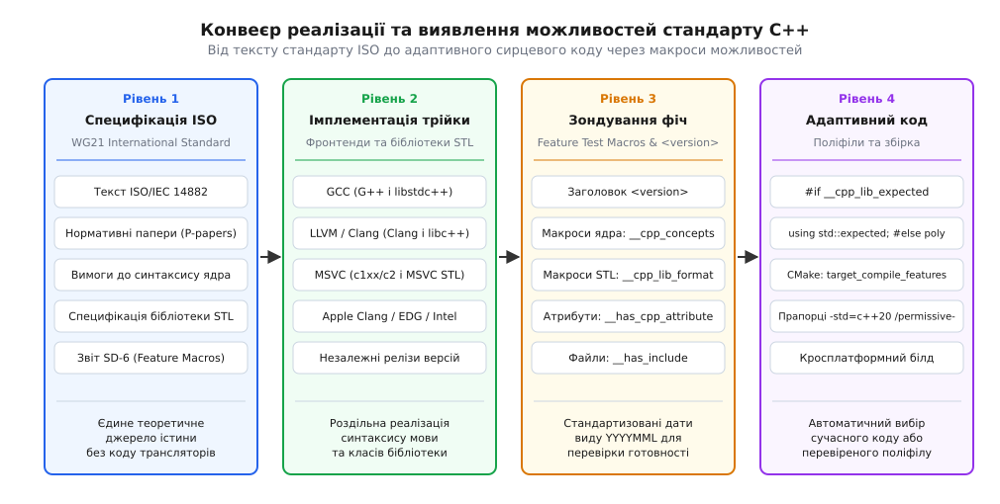
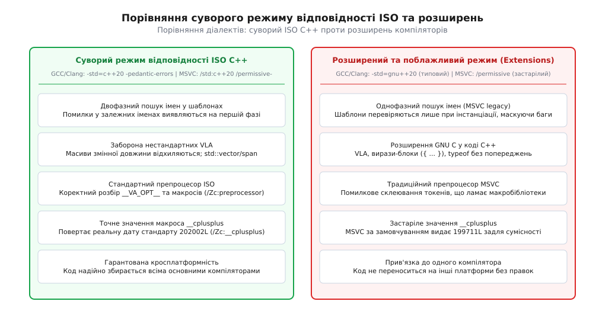

# Підтримка стандартів компіляторами й прапорці

<preknowlist>
- [Як робиться стандарт C++: комітет, папери, цикл](topic:sys-plang-cpp/standardization-process) — як робочі групи WG21 формулюють специфікацію та публікують офіційні релізи ISO.
- [Модулі C++20: трансляція, експорт, збірка](topic:sys-plang-cpp/cpp-modules) — як перехід від текстових заголовків до двійкових інтерфейсів вимагає окремих прапорців і підтримки сканування залежностей.
- [Стабільність ABI у C++ і що її ламає](topic:sys-plang-cpp/abi-stability-cpp) — чому прапорці стандартів та версії компіляторів впливають на макет типів і компонування бінарників.
- [Обчислення часу компіляції: constexpr та consteval](topic:sys-plang-cpp/constexpr-and-consteval) — як поетапна реалізація інтерпретатора виразів у фронтендах розширює можливості мови.
</preknowlist>

Коли інженерна команда переносить кодову базу C++ між різними операційними системами або оновлює інструментарій збірки, звичайна спроба скомпілювати сучасний синтаксичний вираз на зразок шаблонної лямбди `[]<typename T>(T x) { return x; }` чи виклику `std::format` стикається з несподіваними розбіжностями. На сервері під керуванням Linux компілятор GCC 11 успішно збирає код без жодних зауважень; на робочій станції під macOS компілятор Apple Clang 14 зупиняє трансляцію з фатальною помилкою відсутності заголовка `<format>`; а під Windows компілятор MSVC 19.32 у типовій конфігурації без додаткових прапорців видає попередження про використання застарілого стандарту C++14 або несподівано дозволяє приховані помилки у шаблонах через вимкнений двофазний пошук імен.

Міжнародний стандарт ISO/IEC 14882 — це нормативний документ англійською мовою обсягом у понад дві тисячі сторінок, але він не містить жодного рядка двійкового виконуваного коду. Реалізацією стандарту займаються незалежні команди розробників компіляторів: проєкт GNU (GCC), консорціум LLVM (Clang) та корпорація Microsoft (MSVC). Кожен виробник трансляторів самостійно розробляє синтаксичний аналізатор, дерево абстрактного синтаксису (AST), оптимізатор проміжного представлення та стандартну бібліотеку STL. Оскільки ці команди мають власні графіки релізів, різні пріоритети впровадження нововведень та велику спадщину застарілих фірмових розширень, реальна поведінка компілятора завжди визначається прапорцями командного рядка та наявними макросами стану.

Без точного розуміння того, як прапорці вибору діалекту активують відповідні правила граматики, як розширення GNU чи MSVC змінюють семантику типів і як за допомогою стандартизованих макросів виявлення можливостей ізолювати часткову підтримку стандарту, побудова надійної кросплатформної системи збірки стає неможливою.

## Анатомія стандарту в компіляторі: фронтенд і стандартна бібліотека

У будь-якому сучасному компіляторі мови C++ реалізація чергового стандарту ISO розділена на два повністю незалежні шари: синтаксичний фронтенд ядра мови (*Language Core Frontend*) та стандартна бібліотека (*Standard Template Library, STL*).



*Від нормативного тексту ISO до коду користувача: роздільна реалізація синтаксису ядра у фронтендах, бібліотек STL та зондування через стандартизовані макроси.*

### Шар ядра: парсер, AST та генератор коду

Фронтенд компілятора (наприклад, синтаксичний аналізатор `c1xx` у MSVC або модуль семантичного аналізу Clang AST) відповідає за розпізнавання синтаксису та семантичних правил ядра C++:
1. **Граматика та ключові слова:** розпізнавання слів `concept`, `requires`, `consteval`, `co_await`, `constinit`.
2. **Система типів та правила приведення:** підтримка семантики переміщення, категорій значень (*lvalue, prvalue, xvalue*), правил дедукції типів `auto` та структурованих зв'язувань (*Structured Bindings*).
3. **Обчислення часу компіляції:** інтерпретатор константних виразів `constexpr`, який перевіряє можливість виконання функцій, виділення динамічної пам'яті чи віртуальних викликів під час компіляції.
4. **Контроль видимості та пошук імен:** двофазний пошук імен у шаблонах (*Two-Phase Name Lookup*) та пошук, залежний від аргументів (*Argument-Dependent Lookup, ADL*).

Прапорці вибору стандарту (наприклад, `-std=c++20` або `/std:c++20`) перемикають внутрішній стан саме цього фронтенду. Якщо прапорець встановлено у `-std=c++17`, фронтенд вважатиме ключове слово `concept` звичайною синтаксичною помилкою (*syntax error: unknown type name*), навіть якщо сам виконуваний файл компілятора є найсвіжішої версії GCC 14.

### Шар стандартної бібліотеки: заголовки та бінарний рантайм

Стандартна бібліотека надає класи, алгоритми, ітератори та структури даних, описані в розділах бібліотеки ISO C++. Вона складається з двох частин:
- **Шаблонні заголовки:** класи на кшталт `std::vector`, `std::optional`, `std::expected`, `std::ranges::views::transform`, які повністю інстанціюються компілятором у процесі трансляції вашого коду.
- **Двійкова бібліотека середовища виконання:** скомпільовані системні функції розгортання стека винятків (*stack unwinding*), динамічної ідентифікації типів (*RTTI*), локалізації (*locales*), потоків введення-виведення (`std::iostream`) та багатопотоковості (`std::thread`, `std::jthread`).

У світі C++ існують три домінуючі реалізації STL:
- **GNU libstdc++:** стандартна бібліотека проєкту GCC, типова для більшості дистрибутивів Linux.
- **LLVM libc++:** бібліотека проєкту LLVM, оптимізована під модульність та високу швидкість збірки; типова для операційних систем macOS, iOS, Android NDK та FreeBSD.
- **MSVC STL:** бібліотека Microsoft, сирцевий код якої відкрито під ліцензією Apache 2.0; використовується компілятором `cl.exe` під Windows.

### Небезпека розриву між фронтендом та бібліотекою

Найпоширеніша ілюзія розробника-початківця полягає в тому, що встановлення нового компілятора Clang автоматично приносить із собою всі нові можливості C++.

У реальності на системі Linux транслятор Clang за замовчуванням підключає заголовки та бібліотеку `libstdc++`, яка встановлена в операційній системі. Якщо ви встановили Clang 16 у застарілому дистрибутиві Ubuntu 20.04 LTS (де системним компілятором є GCC 9), виникає парадоксальна ситуація:
- Прапорець `-std=c++20` успішно вмикає у Clang підтримку концептів, лямбд C++20 та тристороннього порівняння `<=>`.
- Проте директива `#include <format>` або `#include <expected>` зазнає аварійної зупинки, оскільки системний пакет `libstdc++` від GCC 9 фізично не знає про існування цих заголовків.

Для вирішення таких конфліктів Clang надає спеціальний прапорець вибору бібліотеки `-stdlib=libc++`, який перемикає транслятор на використання автономної бібліотеки LLVM libc++ замість системної GNU libstdc++.

Детальний перелік прапорців конфігурації стандартних бібліотек та діагностики зібрано в [довіднику прапорців компіляторів GCC, Clang та MSVC](topic:sys-plang-cpp/compiler-support/api-flags-reference.md).

## Прапорці вибору діалекту: суворі стандарти проти розширень (GNU та MSVC)

Коли ви передаєте компілятору прапорець вибору версії мови, ви обираєте не просто стандарт, а конкретний **діалект**. Кожен компілятор надає два взаємовиключні режими: суворий режим відповідності ISO C++ (*Strict ISO Conformance Mode*) та розширений режим постачальника (*Vendor Extensions Mode*).



*Суворий режим стандарту ISO вимагає точного двофазного пошуку імен і стандартного препроцесора, тоді як розширений режим дозволяє вендорні розширення ціною втрати переносимості.*

### Діалекти GCC та Clang: `-std=c++XX` проти `-std=gnu++XX`

У компіляторах GCC та Clang наявна фундаментальна пара перемикачів для кожної версії мови:
- `-std=c++11`, `-std=c++14`, `-std=c++17`, `-std=c++20`, `-std=c++23`, `-std=c++26` — активують чистий стандарт ISO C++.
- `-std=gnu++11`, `-std=gnu++14`, `-std=gnu++17`, `-std=gnu++20`, `-std=gnu++23`, `-std=gnu++26` — активують стандарт C++ із набором фірмових розширень GNU C/C++.

Головна пастка полягає в тому, що **GCC та Clang за замовчуванням завжди збирають код у режимі `gnu++`**, якщо користувач не вказав іншого прапорця або якщо система збірки не налаштована належним чином.

Розглянемо, що саме дозволяє режим розширень GNU і чому він є небезпечним для довгострокової якості проєкту:

1. **Масиви змінної довжини на стеку (VLA):**
   У режимі `gnu++` компілятор дозволяє написати наступний код:
   ```cpp
   void process_data(int n) {
       int buffer[n]; // GNU VLA: виділення масиву динамічного розміру на стеку
       // ...
   }
   ```
   Стандарт C++ ніколи не включав масиви змінної довжини VLA до нормативного тексту. У C++ динамічні масиви мають створюватися через `std::vector`, `std::unique_ptr<int[]>` або через неперервний перегляд `std::span`. Якщо функція отримає велике значення `n`, стек потоку вичерпається миттєво, що спричинить невиправне переповнення стека (*Stack Overflow*) без виклику деструкторів об'єктів. Більше того, цей код не скомпілюється на MSVC.
2. **Вирази-блоки (Statement Expressions):**
   Розширення GNU дозволяє об'єднувати складні блоки інструкцій усередині круглих дужок, повертаючи значення останнього рядка:
   ```cpp
   int result = ({ int a = get_first(); int b = get_second(); a + b; });
   ```
   Ця конструкція ламає стандартну граматику виразів C++ і не підтримується жодним іншим компілятором без спеціальних прапорців емуляції.
3. **Нестандартні ключові слова:**
   Режим GNU автоматично оголошує ідентифікатори `typeof`, `__alignof__`, `__volatile__` ключовими словами, що може призвести до конфліктів імен у кодових базах, які використовують ці назви як імена полів чи методів.

Для примусового вимкнення всіх розширень GNU та перетворення компілятора на суворий інструмент верифікації стандарту використовують комбінацію прапорців:
```bash
g++ -std=c++20 -pedantic-errors main.cpp
```
Прапорець `-pedantic-errors` перетворює будь-яку спробу використання розширення GNU на критичну помилку компіляції.

### Діалекти MSVC: `/std:c++XX` та історичний режим поблажливості

Компілятор Microsoft Visual C++ (`cl.exe`) історично розвивався в умовах надзвичайно консервативної екосистеми корпоративного програмного забезпечення Windows. Десятиліттями компілятор містив суттєві відхилення від стандарту ISO задля зворотної сумісності зі старими заголовками Windows SDK та бібліотеками MFC:
- Дозволялося неявне приведення рядкових літералів типу `const char[]` до неконстантного покажчика `char*`.
- Дозволялося зв'язування rvalue-значень (тимчасових об'єктів) із неконстантними lvalue-посиланнями `T&`.
- Ігнорувалися вимоги до обов'язкового використання ключових слів `typename` та `template` для розрізнення залежних типів і функцій у шаблонах.
- Використовувався однофазний пошук імен замість двофазного.

Сучасний MSVC підтримує прапорці стандарту:
- `/std:c++14` — базовий стандарт (типовий для Visual Studio 2015–2019).
- `/std:c++17` — стандарт C++17 (типовий для Visual Studio 2022 v17.0+).
- `/std:c++20` — повний стандарт C++20.
- `/std:c++23` — стандарт C++23 (починаючи з Visual Studio 2022 версії 17.6+).
- `/std:c++latest` — увімкнення всіх реалізованих можливостей майбутньої чернетки C++26 та експериментальних бібліотек.

### Критичні перемикачі конформантності MSVC: `/permissive-`, `/Zc:__cplusplus`, `/Zc:preprocessor`

Для перетворення MSVC на строго відповідний стандарту ISO компілятор інженер зобов'язаний розуміти три фундаментальні прапорці:

#### 1. Прапорець `/permissive-` (Сувора відповідність стандарту)
Вмикає повну відповідність стандарту ISO C++:
- **Двофазний пошук імен у шаблонах:** компілятор перевіряє коректність синтаксису шаблону та розв'язує незалежні імена на Фазі 1 (під час читання визначення шаблону), а не відкладає перевірку до Фази 2 (моменту інстанціації).
- **Суворі правила залежних типів:** вимагає явного написання `typename T::nested_type` та `object.template method<U>()`.
- **Альтернативні операторні токени:** вмикає підтримку стандартних ключових слів `and`, `or`, `not`, `xor` (які в старому MSVC вимагали обов'язкового включення заголовка `<ciso646>`).

Починаючи з прапорців `/std:c++20` та `/std:c++latest`, режим `/permissive-` увімкнено за замовчуванням. Проте при використанні `/std:c++14` або `/std:c++17` його необхідно додавати до конфігурації збірки явно.

#### 2. Прапорець `/Zc:__cplusplus` (Виправлення версії макроса стандарту)
З історичних причин, щоб не зламати старі скрипти та заголовки сторонніх бібліотек, які містили помилкові перевірки версій, компілятор MSVC за замовчуванням визначає стандартний макрос `__cplusplus` як `199711L` (значення стандарту C++98!), навіть коли ви збираєте проєкт із прапорцем `/std:c++20`.

Додавання прапорця `/Zc:__cplusplus` змушує компілятор повертати реальну дату стандарту: `201703L` для C++17 або `202002L` для C++20. Для розробників, які не можуть увімкнути цей прапорець глобально, MSVC надає власний макрос `_MSVC_LANG`, який завжди містить коректне значення дати стандарту.

#### 3. Прапорець `/Zc:preprocessor` (Стандартний препроцесор ISO)
Традиційний препроцесор MSVC мав дефект розгортання макросів зі змінною кількістю аргументів: при передачі списку `__VA_ARGS__` у вкладений макрос він розглядав увесь список як один неподільний строковий токен. Це ламало роботу багатьох метапрограмних бібліотек. Крім того, традиційний препроцесор не підтримував токен C++20 `__VA_OPT__`.

Прапорець `/Zc:preprocessor` активує новий, повністю переписаний синтаксичний аналізатор препроцесора, що на 100% відповідає стандарту ISO C99 / C++20.

## Глибокий розбір двофазного пошуку імен: чому старий код ламається

Щоб наочно зрозуміти, чому прапорець `/permissive-` у MSVC та прапорець `-pedantic-errors` у GCC є настільки важливими, простежимо поведінку компілятора на прикладі узагальненого шаблону класу:

```cpp
template <typename T>
struct DataHandler {
    void process() {
        // Незалежний виклик: не залежить від параметра типу T
        non_existent_function(42); 

        // Залежне ім'я типу: залежить від внутрішньої структури T
        typename T::iterator it; 
    }
};
```

У старій моделі MSVC (режим `/permissive` за замовчуванням у старих версіях) компілятор пропускав увесь вміст методу `process()` без жодного семантичного аналізу під час читання файлу. Якщо у файлі `main.cpp` клас `DataHandler` ніколи не інстанціювався (наприклад, не створювався об'єкт `DataHandler<int>`), програма успішно компілювалася і лінкувалася, попри те, що функція `non_existent_function` не існує в природі, а рядок містить грубу друкарську помилку!

У суворому режимі ISO C++ (активному в GCC, Clang та MSVC з прапорцем `/permissive-`) компілятор працює строго у дві фази:
- **Фаза 1 (Парсинг визначення шаблону):** компілятор аналізує AST-дерево методу. Оскільки вираз `non_existent_function(42)` не містить змінних типу `T`, компілятор негайно виконує пошук ідентифікатора в поточній області видимості. Не знайшовши оголошення функції, компілятор генерує фатальну помилку *'non_existent_function': identifier not found* одразу на першій фазі, запобігаючи потраплянню прихованих багів у реліз.
- **Фаза 2 (Інстанціація шаблону):** для виразу `T::iterator` компілятор чекає передачі конкретного типу (наприклад, `T = std::vector<int>`), після чого розв'язує ім'я ітератора та генерує спеціалізований машинний код.

## Двійкова сумісність середовища виконання та лінкування (ABI)

Прапорці компілятора керують не лише синтаксисом, а й двійковим макетом структур даних у пам'яті (Application Binary Interface, ABI). Неузгодженість прапорців між різними модулями проєкту викликає важковиправні помилки компонування або приховані збої пам'яті.

### Dual ABI у GNU libstdc++ (`_GLIBCXX_USE_CXX11_ABI`)

Стандарт C++11 заборонив використання техніки Copy-On-Write (COW) для рядка `std::string`, оскільки операція індексації `str[i]` у багатопотоковому середовищі створювала стан гонитви. Щоб реалізувати Small String Optimization (SSO), розробники GCC змінили макет пам'яті `std::string` та `std::list`.

Для запобігання падінню бінарників, скомпільованих старими версіями GCC, бібліотека `libstdc++` використовує вбудований простір імен `std::__cxx11::basic_string`. Якщо одна бібліотека скомпільована з `-D_GLIBCXX_USE_CXX11_ABI=0`, а інша — з `-D_GLIBCXX_USE_CXX11_ABI=1`, лінкер повідомить про помилку *undefined reference to std::__cxx11::basic_string...*, захищаючи програму від корупції пам'яті під час виконання.

### Невідповідність ітераторів у MSVC (`_ITERATOR_DEBUG_LEVEL`)

У компіляторі MSVC дебажні збірки містять розширені перевірки ітераторів (макрос `_ITERATOR_DEBUG_LEVEL=2`), що додає допоміжні поля покажчиків у кожен об'єкт `std::vector` чи `std::list`. У релізних збірках ці перевірки вимкнено (`_ITERATOR_DEBUG_LEVEL=0`).

Якщо ви спробуєте злінкувати об'єктний файл, зібраний у режимі Debug (`/MDd`), з релізною бібліотекою (`/MD`), лінкер MSVC зупинить процес критичною помилкою `LNK2038: mismatch detected for '_ITERATOR_DEBUG_LEVEL': value '2' doesn't match value '0'`, запобігаючи невідповідності зміщень полів у пам'яті.

## Діагностика, суворість і політика нульових попереджень

Компілятор C++ — це не просто транслятор сирцевого коду в машинний асемблер, а найпотужніший статичний аналізатор коду першої лінії захисту. Проте більшість критично важливих перевірок безпеки типів та виявлення потенційних багів за замовчуванням вимкнені, щоб зменшити шум під час збірки старого коду.

### Формування суворого набору діагностики у GCC та Clang

Професійні проєкти впроваджують політику «нульових попереджень» (*Zero-Warning Policy*), за якої будь-яке попередження компілятора прирівнюється до помилки збірки:

```bash
g++ -std=c++20 -Wall -Wextra -Wpedantic -Wshadow -Wnon-virtual-dtor -Wold-style-cast -Wconversion -Wsign-conversion -Wnull-dereference -Woverloaded-virtual -Wduplicated-cond -Wduplicated-branches -Wlogical-op -Wzero-as-null-pointer-constant -Werror main.cpp
```

Розглянемо найважливіші компоненти цього набору:
- `-Wall` та `-Wextra`: базовий фундамент. Виявляють неініціалізовані змінні, відсутність повернення значення з функції, пропущені секції `break` у `switch` та некоректний порядок ініціалізації полів у списку ініціалізації конструктора (поля завжди ініціалізуються в порядку їх оголошення в класі, а не в порядку запису в конструкторі!).
- `-Wshadow`: попереджає про затінювання імен. Якщо параметр конструктора або локальна змінна має таке саме ім'я, як і поле класу чи глобальна змінна, розробник ризикує помилково присвоїти значення параметру замість поля.
- `-Wnon-virtual-dtor`: ловить критичну помилку об'єктно-орієнтованого дизайну. Якщо клас містить хоча б одну віртуальну функцію, його деструктор обов'язково має бути віртуальним. Якщо видалити об'єкт похідного класу через покажчик на базовий клас без віртуального деструктора (`delete base_ptr;`), деструктори полів похідного класу ніколи не виконаються, що спричинить витік пам'яті та дескрипторів операційної системи.
- `-Wold-style-cast`: забороняє використання небезпечного С-подібного приведення типів `(int)val`. У C++ приведення має бути явним: `static_cast` для перетворень між сумісними типами, `reinterpret_cast` для низькорівневої реінтерпретації бітів пам'яті та `const_cast` для зняття константності.
- `-Wconversion` та `-Wsign-conversion`: захищають від втрати даних під час неявного звуження типів (наприклад, коли 64-бітне значення `size_t` неявно обрізається до 32-бітного `int` або від'ємне число перетворюється на величезне беззнакове число `unsigned int`).
- `-Wduplicated-cond` та `-Wduplicated-branches` (GCC): знаходять повторення однакових умов або однакових тіл у ланцюжках розгалужень `if/else`, виявляючи помилки копіювання коду (*copy-paste bugs*).
- `-Werror`: перетворює всі попередження на фатальні помилки компіляції.

### Налаштування діагностики у MSVC

Для компілятора Visual C++ аналогічний суворий набір налаштовується прапорцями:
```cmd
cl.exe /std:c++20 /permissive- /W4 /WX /Zc:__cplusplus /Zc:preprocessor /utf-8 /external:anglebrackets /external:W0 main.cpp
```

- `/W4`: встановлює рівень 4 — максимальний рекомендований рівень діагностики для сучасного коду.
- `/WX`: перетворює всі попередження на помилки (аналог `-Werror`).
- `/external:anglebrackets /external:W0`: надзвичайно важливий інструмент для ізоляції шуму. Цей прапорець наказує компілятору вважати всі заголовочні файли, підключені через кутові дужки `#include <...>` (системні заголовки Windows SDK, заголовки STL та зовнішні сторонні бібліотеки), зовнішнім кодом і повністю вимкнути для них діагностику попереджень (`/external:W0`), застосовуючи жорсткий рівень `/W4 /WX` виключно до власних сирцевих файлів проєкту.

### Локальне пригнічення попереджень для стороннього коду

У реальних проєктах розробники часто змушені інтегрувати застарілі сторонні бібліотеки, які не проходять суворі перевірки `-Wall -Werror`. Замість глобального послаблення прапорців проєкту застосовують локальні прагми збереження та відновлення стану діагностики:

:::tabs
```cpp
// GCC та Clang: локальне пригнічення попереджень
#pragma GCC diagnostic push
#pragma GCC diagnostic ignored "-Wold-style-cast"
#pragma GCC diagnostic ignored "-Wconversion"

#include <legacy_c_header.h>

#pragma GCC diagnostic pop
```
```cpp
// MSVC: локальне пригнічення попереджень
#pragma warning(push)
#pragma warning(disable: 4244) // неявне перетворення типів з можливими втратами даних
#pragma warning(disable: 4100) // невикористаний формальний параметр

#include <legacy_windows_header.h>

#pragma warning(pop)
```
:::

## Механізм перевірки можливостей: Feature Test Macros та заголовок `<version>`

Коли проєкт розвивається і використовує нововведення свіжих стандартів, перед розробниками постає проблема: як написати код, який використовує переваги нового стандарту (наприклад, `std::expected` або концепти), але зберігає здатність успішно компілюватися старішими компіляторами через адаптивні поліфіли?

### Чому макроси версій компіляторів є глухим кутом

У минулому розробники писали масивні ланцюжки препроцесора:
```cpp
#if defined(_MSC_VER) && _MSC_VER >= 1930
    // код для Visual Studio 2022
#elif defined(__GNUC__) && __GNUC__ >= 11
    // код для GCC 11+
#endif
```

Цей підхід є принципово хибним через три причини:
1. **Поелементна імплементація:** компілятори реалізують стандарт не одномоментно. GCC 11 може вже підтримувати корутини, але ще не мати повної підтримки `std::format`.
2. **Розбіжність сторонніх вендорів:** компілятор Apple Clang використовує власні номери версій (Apple Clang 14 не дорівнює LLVM Clang 14).
3. **Розрив з STL:** версія компілятора нічого не говорить про те, яка саме стандартна бібліотека змонтована в системі.

### Рішення комітету WG21: рекомендація SD-6 та заголовок `<version>`

Для подолання цієї кризи робоча група ISO WG21 розробила документ SD-6 (*Feature-Testing Recommendations for C++*), який, починаючи з C++20, став обов'язковою нормативною частиною стандарту.

Кожна нова можливість ядра мови та кожен новий компонент стандартної бібліотеки отримують власний макрос препроцесора. Значення макроса — це ціле число у форматі `YYYYMML`, яке відповідає даті (року й місяцю) прийняття офіційного нормативного документу комітетом ISO.

| Категорія | Макрос можливості | Значення дати | Опис стандартизованої можливості |
| :--- | :--- | :--- | :--- |
| **Ядро мови** | `__cpp_concepts` | `201907L` | Підтримка концептів та клаузули `requires` (C++20) |
| **Ядро мови** | `__cpp_constexpr` | `201907L` (C++20), `202110L` (C++23) | Розширення обчислень часу компіляції (динамічна пам'ять, цикли) |
| **Ядро мови** | `__cpp_modules` | `201907L` | Модулі C++20 (`import`, `export module`) |
| **Ядро мови** | `__cpp_coroutines` | `201902L` | Безстекові корутини (`co_await`, `co_yield`, `co_return`) |
| **Ядро мови** | `__cpp_multidimensional_subscript` | `202110L` | Багатовимірний оператор індексації `matrix[r, c]` (C++23) |
| **Ядро мови** | `__cpp_explicit_this_parameter` | `202110L` | Явний параметр `this` (Deducing this, C++23) |
| **Бібліотека STL** | `__cpp_lib_format` | `201907L` (C++20), `202110L` (C++23) | Типобезпечне форматування тексту `std::format` |
| **Бібліотека STL** | `__cpp_lib_expected` | `202202L` | Тип повернення помилок без винятків `std::expected` (C++23) |
| **Бібліотека STL** | `__cpp_lib_span` | `202002L` | Неневолодіючий перегляд неперервної пам'яті `std::span` (C++20) |
| **Бібліотека STL** | `__cpp_lib_ranges` | `201911L` (C++20), `202207L` (C++23) | Діапазони та конвеєри операцій `std::ranges` |
| **Бібліотека STL** | `__cpp_lib_print` | `202207L` | Прямий швидкий друк `std::print` та `std::println` (C++23) |

Для макросів ядра (`__cpp_*`) компілятор визначає їх автоматично на основі активного прапорця стандарту.

Для макросів бібліотеки (`__cpp_lib_*`) стандарт C++20 запровадив легкий заголовок `<version>`. Він містить виключно макроси конфігурації без оголошення важких типів:

```cpp
#if defined(__has_include)
    #if __has_include(<version>)
        #include <version>
    #endif
#endif

// Чиста перевірка наявності std::expected
#if defined(__cpp_lib_expected) && (__cpp_lib_expected >= 202202L)
    #include <expected>
    template <typename T, typename E>
    using Result = std::expected<T, E>;
#else
    #include "compat/expected_polyfill.hpp"
    template <typename T, typename E>
    using Result = compat::expected<T, E>;
#endif
```

### Перевірка атрибутів та включень

Окрім макросів можливостей, стандарт надає два вбудовані оператори препроцесора:
- `__has_include(<header>)`: повертає `1`, якщо заголовочний файл існує в шляхах пошуку інклудів, та `0`, якщо файл відсутній.
- `__has_cpp_attribute(attribute_name)`: повертає дату прийняття або ненульове значення, якщо компілятор підтримує даний атрибут (наприклад, `__has_cpp_attribute(nodiscard)` або `__has_cpp_attribute(no_unique_address)`).

Практичну реалізацію цілісної системи перевірки можливостей та створення переносних поліфілів розібрано в [практикумі з кросплатформної перевірки можливостей і поліфілів](topic:sys-plang-cpp/compiler-support/proj-feature-detection.md).

## Матриці підтримки та виявлення розбіжностей компіляторів

Оскільки розробка стандартів триває безперервно, розробники використовують відкриті бази даних відповідності компіляторів. Найвідомішим джерелом істини для індустрії є **матриця підтримки компіляторів на ресурсі cppreference.com** (*C++ compiler support matrix*).

У матриці для кожного нормативного паперу WG21 вказано точний номер версії компілятора (GCC, Clang, MSVC, Apple Clang, EDG, Intel oneAPI), починаючи з якої дана можливість підтримується у повному обсязі.

### Типові пастки розбіжностей між компіляторами

Навіть у режимі суворого стандарту між провідними компіляторами існують крайові розбіжності в інтерпретації складних правил мови:

1. **Часткове впорядкування та поглинання концептів (Constraint Subsumption):**
   Коли компілятор обирає найбільш спеціалізоване перевантаження функції між двома концептами, Clang та GCC іноді по-різному оцінюють відношення нормалізації логічних виразів `&&` та `||` у клаузулах `requires`. Це може призводити до того, що код успішно компілюється на GCC, але Clang повідомляє про неоднозначність виклику (*ambiguous overload*).
2. **Атрибут `[[no_unique_address]]` у MSVC:**
   У C++20 атрибут `[[no_unique_address]]` дозволяє оптимізувати розміщення порожніх полів класу в пам'яті. У GCC та Clang він працює відповідно до стандарту, зменшуючи розмір структури. Проте в MSVC його реалізація зламала б бінарну сумісність (ABI) існуючих типів Windows. Тому MSVC ігнорує стандартний атрибут, а для реальної оптимізації вимагає використання вендорного розширення `[[msvc::no_unique_address]]`.
3. **Реалізація модулів C++20:**
   Хоча синтаксис `export module` стандартизовано, двійковий формат скомпільованих інтерфейсів модулів (BMI/IFC) є абсолютно несумісним між GCC (`.gcm`), Clang (`.pcm`) та MSVC (`.ifc`). Більше того, робота з модулями вимагає підтримки інструментів сканування залежностей у системі збірки (CMake 3.28+ та Ninja 1.11+).

### Інструменти санітайзерів для контролю стандарту під час виконання

Навіть якщо сирцевий код ідеально компілюється без жодного попередження, він може містити приховану невизначену поведінку (Undefined Behavior), таку як порушення суворого аліасингу (*Strict Aliasing Violation*), переповнення знакових цілих чисел або доступ за межі виділеної пам'яті.

Сучасні компілятори інтегрують інструменти динамічної інструментації коду — санітайзери:
- **AddressSanitizer (ASan):** прапорець `-fsanitize=address` у GCC/Clang та `/fsanitize=address` у MSVC додає перевірки виділення пам'яті, виявляючи звернення до звільненої пам'яті (*Use-After-Free*) та вихід за межі масивів на купі, стеку чи у глобальній пам'яті.
- **UndefinedBehaviorSanitizer (UBSan):** прапорець `-fsanitize=undefined` у GCC/Clang відстежує розіменування нульових покажчиків, зсуви бітів на від'ємну величину та інші порушення інваріантів мови C++.

## Інтеграція в сучасні системи збірки (CMake target_compile_features)

Пряме прописування прапорців на зразок `-std=c++20` чи `/std:c++20` у файлах конфігурації компіляції є застарілою практикою, яка руйнує переносимість проєкту. Сучасний CMake надає механізм абстрактних властивостей та мета-можливостей.

### Керування стандартом через властивості цілей (Target Properties)

```cmake
# Створення бібліотечної цілі
add_library(core_engine STATIC
    src/engine.cpp
    src/renderer.cpp
)

# Встановлення версії стандарту для конкретної цілі
set_target_properties(core_engine PROPERTIES
    CXX_STANDARD 20
    CXX_STANDARD_REQUIRED ON
    CXX_EXTENSIONS OFF
)
```

Що означають ці три властивості:
- `CXX_STANDARD 20`: вказує CMake, що ціль вимагає стандарту C++20. CMake автоматично підставить `-std=c++20` для GCC/Clang та `/std:c++20` для MSVC.
- `CXX_STANDARD_REQUIRED ON`: забороняє «відкат» (*decay*) до старішого стандарту. Якщо встановлений компілятор не підтримує C++20, CMake зупинить генерацію з помилкою конфігурації замість того, щоб тихо скомпілювати код під C++17 чи C++14.
- `CXX_EXTENSIONS OFF`: вимикає вендорні розширення. Це ключова властивість: для GCC/Clang вона замінює `-std=gnu++20` на суворий `-std=c++20`, а для MSVC гарантує активацію режиму `/permissive-`.

### Використання гранулярних можливостей `target_compile_features`

Замість фіксації загального номера стандарту бібліотека може декларувати конкретні синтаксичні вимоги до компілятора:

```cmake
# Вимагаємо, щоб компілятор обов'язково підтримував концепти C++20
target_compile_features(core_engine PUBLIC cxx_std_20)
```

Завдяки транзитивній моделі CMake будь-який виконуваний файл чи інша бібліотека, яка підключає `core_engine` через `target_link_libraries(app PRIVATE core_engine)`, автоматично успадкує вимогу компіляції в режимі стандарту C++20.

## Синтез і практичні інваріанти надійного проєкту

Підтримка стандартів компіляторами — це динамічний інженерний процес взаємодії між нормативною специфікацією ISO, розробниками компіляторних рушіїв та кінцевим сирцевим кодом.

Для побудови надійної, переносної та довговічної кодової бази C++ інженерна практика спирається на п'ять непорушних інваріантів:

1. **Завжди вимикайте вендорні розширення:** використовуйте `CXX_EXTENSIONS OFF` у CMake або прапорці `-std=c++XX -pedantic-errors` (GCC/Clang) та `/std:c++XX /permissive-` (MSVC). Код, написаний на розширеннях одного компілятора, неминуче стає технічним боргом при зміні платформи.
2. **Увімкніть суворий препроцесор та версію `__cplusplus` у MSVC:** обов'язково додавайте `/Zc:__cplusplus` та `/Zc:preprocessor` у конфігурації збірки під Windows.
3. **Застосовуйте політику «нульових попереджень»:** збирайте проєкт із прапорцями `-Wall -Wextra -Wpedantic -Werror` та `/W4 /WX`, ізолюючи сторонні заголовки через системні прапорці на зразок `/external:anglebrackets`.
4. **Зондуйте можливості через `<version>` та `__cpp_*`, а не через версії компіляторів:** перевіряйте функціональність за стандартизованими макросами SD-6, створюючи чисті поліфіли у спеціалізованих просторах імен сумісності.
5. **Тестуйте на різнорідній матриці CI:** регулярна збірка проєкту трьома незалежними інструментаріями (GCC на Linux, Clang на macOS, MSVC на Windows) є єдиною реальною гарантією того, що ваш сирцевий код відповідає міжнародному стандарту ISO/IEC 14882.
