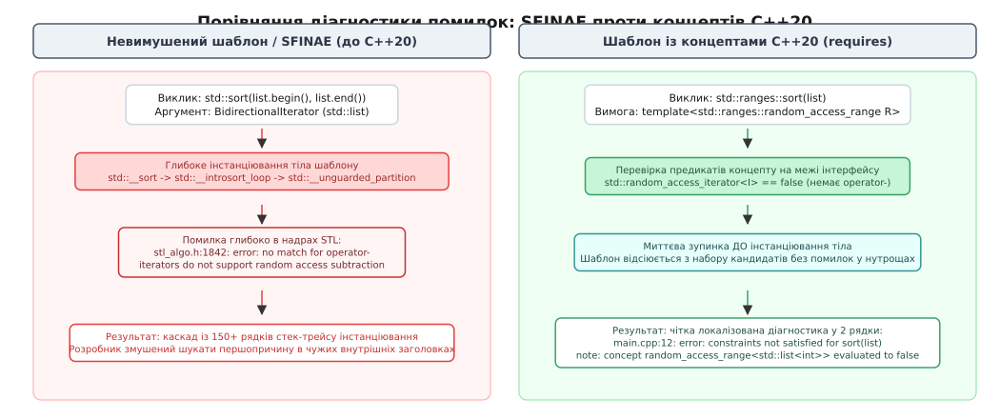
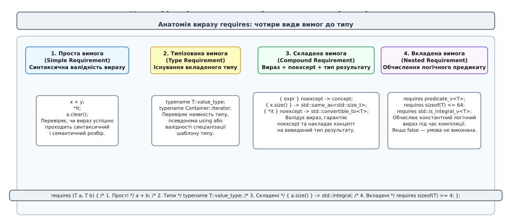
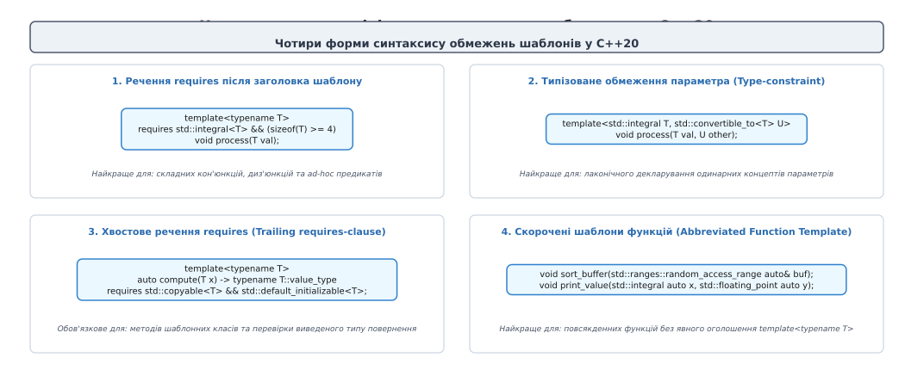
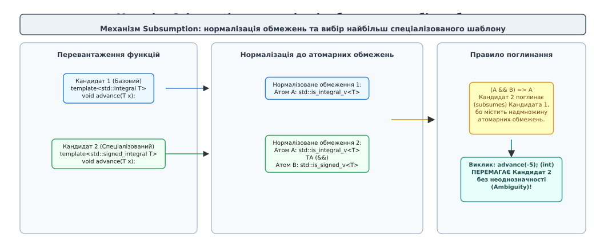

# Модель концептів та обмежень у C++20

<preknowlist>
- [Шаблони: параметризація типом](root:sys-plang-cpp/templates-basics) — параметри-типи, механіка компіляційного інстанціювання та синтаксис шаблонів.
- [SFINAE й enable_if](root:sys-plang-cpp/sfinae-and-enable-if) — правило Substitution Failure Is Not An Error, техніка вибіркового вилучення перевантажень та робота метафункції `std::enable_if`.
- [Риси типів (type traits)](root:sys-plang-cpp/type-traits) — предикати властивостей типів `std::is_integral`, `std::is_same` та обчислення типів під час збірки.
- [Розв'язання перевантажень](root:sys-plang-cpp/overload-resolution) — алгоритм формування списку кандидатів, відбору придатних функцій та вибору найкращого перевантаження.
</preknowlist>

Спроба передати двозв'язний список `std::list<int>` у класичний алгоритм швидкого сортування `std::sort(list.begin(), list.end())` у коді стандарту C++98 чи C++11 призводить до аварійної зупинки компілятора. Проте повідомлення про помилку з'являється не в рядку виклику `std::sort`, а на п'ятнадцятому рівні глибини вкладених заголовних файлів стандартної бібліотеки — у внутрішній функції `__unguarded_partition` файлу `stl_algo.h`. Компілятор скаржиться на відсутність бінарного оператора віднімання `it2 - it1`, генеруючи понад сотню рядків нечитабельного стек-трейсу інстанціювання шаблонів.

Ця проблема виникає через фундаментальну властивість класичних шаблонів C++: заголовки `template<typename T>` або `template<typename Iter>` оголошують абсолютно відкриті інтерфейси. Для компілятора параметр `T` позначає будь-який можливий тип у системі — від вбудованого `int` до складного мережевого сокета. Компілятор не перевіряє придатність типу в момент передачі аргументів, а сліпо розпочинає підстановку типу в тіло шаблону та всі його дочірні функції. Якщо на якійсь глибині виявляється відсутність потрібного методу, оператора або конструктора, компілятор вибухає каскадною діагностикою.

Стандарт C++20 докорінно змінив цю парадигму, запровадивши мовну модель **концептів** (від лат. *conceptus* — схоплення, поняття) та **обмежень** (англ. *constraints*, від лат. *constringere* — зв'язувати, стягувати). Відтепер вимоги до параметрів шаблону стали явними декларативними контрактами рівня компілятора, які перевіряються безпосередньо в точці виклику ще до початку генерації внутрішнього машинного коду.

---

## 1. Проблема відкритого інтерфейсу та еволюція від SFINAE до предикатів мови

Щоб зрозуміти необхідність концептів, потрібно простежити, як мова C++ намагалася вирішити проблему обмеження типів у попередніх стандартах C++11, C++14 та C++17.

Узагальнене програмування в C++ від моменту появи STL Олександра Степанова спиралося на неявні контракти. Документація вимагала від типу бути `ForwardIterator` або `LessThanComparable`, але мова не мала синтаксичних засобів для вираження цих категорій. Компілятор бачив лише нетипізований параметр шаблону.

До стандарту C++20 єдиним інструментом вибіркового застосування шаблонів було правило **SFINAE** (Substitution Failure Is Not An Error — невдала підстановка не є помилкою) у поєднанні з метафункцією `std::enable_if_t`.

```cpp
// Підхід C++14/C++17: обмеження через SFINAE у списку параметрів за замовчуванням
template<typename T, 
         typename = std::enable_if_t<std::is_integral_v<T>>>
void process_value(T value) {
    // Реалізація для цілих чисел
}

template<typename T, 
         typename = std::enable_if_t<std::is_floating_point_v<T>>,
         typename = void> // Штучний параметр для уникнення однакових сигнатур шаблону
void process_value(T value) {
    // Реалізація для чисел із плаваючою комою
}
```

Конвеєр обробки такого коду компілятором складався з багатьох трудомістких кроків. Під час розв'язання перевантаження для кожного кандидата компілятор підставляв тип аргументу у вираз `std::enable_if_t`. Якщо предикат дорівнював `false`, у структурі `enable_if` було відсутнє поле `type`, що створювало помилку підстановки в сигнатурі. Компілятор відкидав цього кандидата без зупинки компіляції.

Підхід на базі SFINAE мав чотири критичні архітектурні вади:

1. **Забруднення сигнатури функцій**: службові параметри `std::enable_if_t` спотворювали інтерфейс функцій у документації та автодоповненні IDE, змушуючи розробника писати масивний шаблонний шум замість чистої сигнатури.
2. **Відсутність взаємного впорядкування (Subsumption)**: компілятор не знав, що множина «знакові цілі числа» є строгою підмножиною «всі цілі числа». Якщо розробник оголошував перевантаження для `std::is_integral_v<T>` та `std::is_signed_v<T>`, для типу `int` виникала помилка неоднозначності виклику (ambiguous call). Розробник мусив вручну писати штучні заперечення `std::is_integral_v<T> && !std::is_signed_v<T>`, що експоненційно ускладнювало код при зростанні кількості перевантажень.
3. **Катастрофічне зростання часу компіляції**: для кожної перевірки SFINAE компілятор змушений створювати в пам'яті десятки проміжних AST-вузлів типів, інстанціювати вкладені структури `std::integral_constant` та виконувати повний цикл пошуку імен.
4. **Непрозора діагностика помилок**: коли жодне перевантаження SFINAE не підходило, компілятор видавав загальне повідомлення `no matching function for call`, не пояснюючи, яка саме з десяти логічних умов у довгому ланцюжку метафункцій дала збій.


*Зліва: невимушений шаблон заглиблюється в інстанціювання тіла й генерує каскадну помилку в надрах STL. Справа: концепт зупиняє розгляд кандидата на межі інтерфейсу й видає локалізовану дворядкову діагностику.*

У C++20 концепт є першокласною мовною сутністю. Перевірка обмежень виконується фронтендом компілятора як пряме обчислення булевих константних виразів. Якщо аргумент не задовольняє концепт, компілятор миттєво відкидає цю функцію зі списку кандидатів перевантаження, а у разі повної відсутності кандидатів видає точну причину відхилення: назву концепту та рядок, де предикат обчислився в `false`.

Детальний двадцятип'ятирічний шлях розвитку цієї технології — від початкових ідей Олександра Степанова та перших експериментів у ConceptGCC до скасування у Франкфурті 2009 року та тріумфального повернення — викладено в історичному нарисі 📜 [Еволюція концептів у C++: від ConceptGCC до C++20](root:sys-plang-cpp/concepts-constraints/hist-concepts-evolution.md).

---

## 2. Ключове слово concept: оголошення іменованих предикатів

Концепт у C++20 — це іменований предикат часу компіляції, що накладає обмеження на параметри шаблону. Концепт визначається за допомогою ключового слова `concept` і завжди повертає значення типу `bool`.

```cpp
template<typename T>
concept SignedInteger = std::is_integral_v<T> && std::is_signed_v<T>;
```

### Синтаксичні інваріанти концептів

Оголошення концептів підпорядковується суворим правилам стандарту:
- Концепт завжди параметризується списком шаблону `template<...>`. Він може приймати типи, значення (`non-type template parameters`) та шаблонні шаблони (`template template parameters`).
- Концепт не може бути рекурсивним (не може посилатися сам на себе у власному визначенні, прямо чи опосередковано).
- Концепт не може бути явно спеціалізований користувачем (`template<> concept MyConcept<int>` є забороненим синтаксисом). Це гарантує, що семантика концепту є абсолютно незмінною для всіх типів у програмі.
- Концепт не є типом даних. Його не можна використовувати як аргумент `sizeof`, передавати як значення у змінні чи створювати покажчики на концепти.

### Відмінність концепту від `constexpr bool` змінної-шаблону

Виникає природне запитання: чим концепт `concept C = expr;` відрізняється від звичайної константної змінної-шаблону `template<typename T> constexpr bool is_c_v = expr;`?

Між ними існують три фундаментальні відмінності в архітектурі компілятора:

1. **Участь у нормалізації та поглинанні (Subsumption)**: компілятор розглядає концепт як атомарний блок логічної формули. Змінна-шаблон `constexpr bool` для компілятора є непрозорим цілісним значенням. Якщо два перевантаження використовують змінні-шаблони `is_a_v<T>` та `is_a_v<T> && is_b_v<T>`, компілятор не зможе виконати часткове впорядкування, оскільки не знає внутрішньої структури цих змінних без їх інстанціювання. Концепт же зберігає свою синтаксичну структуру у внутрішньому представленні компілятора.
2. **Кешування результатів оцінки**: компілятор кешує результат обчислення концепту для кожної конкретної комбінації аргументів типів у внутрішній таблиці задоволення обмежень (Constraint Satisfaction Table). Якщо концепт `std::copyable<T>` перевіряється для `std::string` у ста різних функціях проєкту, повний розбір операцій копіювання виконується рівно один раз, що кардинально прискорює компіляцію великих модулів.
3. **Захист від неявних приведень типів**: вираз праворуч від знака `=` у визначенні концепту повинен мати строгий тип `bool`. Неявні приведення чисел, покажчиків чи класів до `bool` у заголовку концепту призводять до помилки компіляції, запобігаючи прихованим помилкам типізації.

---

## 3. Вираз requires: синтаксичний блок валідації типів

Для формулювання вимог до типів C++20 вводить спеціальний оператор — **вираз `requires`** (англ. *requires expression*).

Вираз `requires` приймає необов'язковий список фіктивних параметрів і тіло у фігурних дужках, що містить послідовність вимог. Результатом обчислення виразу `requires` є константа `true`, якщо всі вимоги всередині блоку є синтаксично та семантично валідними для переданих типів, або `false`, якщо хоча б одна вимога зазнає збою під час компіляції.

```cpp
template<typename T>
concept Printable = requires(const T& obj) {
    std::cout << obj; // Вимога: вираз виводу в потік повинен бути коректним
};
```

Слід розрізняти два поняття: **вираз `requires`** (requires expression) — це оператор, що перевіряє валідність операцій і повертає `bool`, а **речення `requires`** (requires clause) — це синтаксична конструкція після заголовка шаблону, яка застосовує булевий предикат як обмеження.

Стандарт виділяє чотири окремі категорії вимог усередині блоку `requires`.


*Чотири види вимог у блоці requires: проста (синтаксис), типізована (наявність типу), складена (вираз, noexcept та концепт результату) і вкладена (обчислення предикату).*

### 1. Прості вимоги (Simple Requirements)

Проста вимога — це довільний C++ вираз, який компілятор намагається проаналізувати на коректність у неоцінюваному контексті (unevaluated operand context, подібному до `decltype`) без виконання самого коду під час роботи програми.

```cpp
template<typename T>
concept Addable = requires(T a, T b) {
    a + b;  // Перевіряє наявність бінарного оператора додавання
    a += b; // Перевіряє наявність оператора додавання з присвоєнням
    ++a;    // Перевіряє префіксний інкремент
};
```

Якщо для типу `T` оператор `+` не визначений або є приватним членом класу, вимога відхиляється, і вираз `requires` повертає `false`. Важливо розуміти, що вираз усередині простої вимоги ніколи не генерує інструкцій у машинному коді: компілятор лише перевіряє таблицю символів, правила видимості та перевантаження операторів.

### 2. Типізовані вимоги (Type Requirements)

Типізована вимога починається з ключового слова `typename` і перевіряє факт існування вкладеного типу, псевдоніма типу (`using`) або коректність спеціалізації шаблону для заданого типу.

```cpp
template<typename C>
concept Container = requires {
    typename C::value_type;      // Наявність вкладеного типу елемента
    typename C::iterator;        // Наявність типу ітератора
    typename C::difference_type; // Наявність типу різниці адрес
};
```

Якщо клас `C` не містить псевдоніма `using value_type = ...;`, уся типізована вимога повертає `false`. Також цей синтаксис дозволяє перевіряти коректність зовнішніх спеціалізацій: `typename std::hash<C>;` перевірить, чи існує дійсний шаблон хеш-функції для типу `C`.

Типізовані вимоги також використовуються для перевірки залежних властивостей розподільників пам'яті:
```cpp
template<typename Alloc>
concept AllocatorTraitsAware = requires {
    typename std::allocator_traits<Alloc>::pointer;
    typename std::allocator_traits<Alloc>::size_type;
};
```

### 3. Складені вимоги (Compound Requirements)

Складена вимога бере вираз у фігурні дужки `{ expr }` і дозволяє одночасно перевірити три незалежні характеристики операції:
1. Синтаксичну валідність виразу `expr`.
2. Гарантію відсутності винятків за допомогою специфікатора `noexcept` (опціонально).
3. Відповідність типу поверненого значення певному концепту за допомогою стрілки `-> Concept` (опціонально).

```cpp
template<typename T>
concept SmartHandle = requires(T handle) {
    // 1. Метод close() існує, не викидає винятків і повертає void
    { handle.close() } noexcept -> std::same_as<void>;

    // 2. Метод size() існує і повертає тип, що задовольняє std::integral
    { handle.size() } -> std::integral;

    // 3. Розіменування повертає посилання, що конвертується в const char*
    { *handle } -> std::convertible_to<const char*>;
};
```

Складена вимога `-> Concept` працює за особливим правилом підстановки: компілятор бере тип результату виразу `decltype((expr))` і передає його як **перший** аргумент концепту праворуч від стрілки. Запис `{ x.size() } -> std::convertible_to<std::size_t>` розгортається компілятором у перевірку `std::convertible_to<decltype((x.size())), std::size_t>`.

Подвійні дужки у `decltype((expr))` мають вирішальне значення: якщо вираз повертає lvalue-посилання, тип результату зберігає посилання `T&`, що дозволяє точно контролювати семантику доступу.

### 4. Вкладені вимоги (Nested Requirements)

Вкладена вимога починається з ключового слова `requires` усередині блоку вимог: `requires boolean_expression;`. Вона змушує компілятор обчислити значення константного виразу і вимагає, щоб результат дорівнював `true`.

Цей вид вимог є джерелом найпоширенішої помилки серед розробників-початківців. Розглянемо різницю між двома записами:

```cpp
// ПОМИЛКА: проста вимога замість вкладеної!
template<typename T>
concept BadLimit = requires {
    sizeof(T) <= 8; // ПРОСТА ВИМОГА: перевіряє лише валідність оператора <=.
                    // Вираз sizeof(T) <= 8 завжди валідний синтаксично,
                    // тому концепт завжди поверне true навіть для структури в 1024 байти!
};

// ПРАВИЛЬНО: вкладена вимога
template<typename T>
concept CorrectLimit = requires {
    requires sizeof(T) <= 8; // ВКЛАДЕНА ВИМОГА: компілятор обчислює значення
                             // і вимагає істинності (true).
};
```

Вкладені вимоги необхідні тоді, коли всередині концепту потрібно перевірити складні константні умови над типами або властивостями, які вже були виведені на попередніх рядках блоку `requires`. Наприклад, перевірка збігу типу результату зі спеціалізацією іншого шаблону:

```cpp
template<typename T>
concept VectorLike = requires(T v) {
    typename T::value_type;
    { v.size() } -> std::integral;
    requires std::same_as<T, std::vector<typename T::value_type>>;
};
```

### М'яка відмова проти жорсткої помилки компіляції

Принциповою перевагою виразу `requires` є концепція м'якої відмови (soft failure). Якщо будь-яка операція всередині тіла `requires { ... }` є невалідною для заданого типу (наприклад, викликається неіснуючий метод або відсутній вкладений тип), компілятор не генерує фатальну помилку, а просто обчислює вираз як `false`.

Проте якщо помилка підстановки стається **поза** тілом `requires` — наприклад, при спробі інстанціювати залежний шаблон класу з некоректними аргументами у списку параметрів функції — компілятор зупинить збірку з жорсткою помилкою (hard error). Тому всі потенційно небезпечні операції інспектування типу необхідно загортати безпосередньо у блок вимог.

---

## 4. Чотири форми вираження обмежень у синтаксисі мови

Мова C++20 надає розробнику чотири альтернативні синтаксичні форми для застосування концептів до шаблонів функцій, класів, змінних та псевдонімів типів. Кожна форма оптимізована під свій сценарій використання: від повних багаторядкових умов до ультралаконічних скорочених сигнатур.


*Синтаксичні форми вираження обмежень: речення requires після заголовка, типізоване обмеження параметра, хвостове речення після сигнатури та скорочений шаблон функції.*

### 1. Речення requires після заголовка шаблону (Requires Clause)

У цій формі ключове слово `requires` розміщується безпосередньо після списку параметрів шаблону `template<...>`:

```cpp
template<typename T>
requires std::integral<T> && (sizeof(T) >= 4)
void process_buffer(T value) {
    // Реалізація
}
```

Ця форма є найбільш виразною і рекомендована для застосування, коли обмеження складається з декількох концептів, об'єднаних логічними операторами `&&` чи `||`, або містить складні константні предикати.

Речення `requires` можна застосовувати також до шаблонів класів:
```cpp
template<typename T>
requires std::movable<T>
class ThreadSafeQueue {
    // Реалізація черги
};
```

### 2. Типізоване обмеження параметра (Type-Constraint)

Замість ключового слова `typename` або `class` у списку параметрів шаблону вказується ім'я концепту:

```cpp
template<std::integral T, std::convertible_to<T> U>
T calculate_sum(T base, U delta) {
    return base + static_cast<T>(delta);
}
```

Якщо концепт приймає кілька параметрів (як `std::convertible_to<From, To>`), параметр шаблону автоматично підставляється першим аргументом, а додаткові аргументи вказуються у кутових дужках `<...>`. Запис `std::convertible_to<T> U` означає `std::convertible_to<U, T>`.

### 3. Хвостове речення requires (Trailing Requires Clause)

Речення `requires` розміщується наприкінці сигнатури функції після типу повернення та кваліфікаторів `const` / `noexcept` / `&`:

```cpp
template<typename T>
auto fetch_element(T& container, std::size_t index) 
    -> typename T::value_type
    requires std::ranges::random_access_range<T> && std::default_initializable<typename T::value_type>
{
    return container[index];
}
```

Хвостове речення є незамінним у двох випадках:
- Коли обмеження накладається на тип повернення, який залежить від `decltype(...)` або складних вкладених типів.
- Для методів шаблонних класів: заголовок `template<typename T>` належить усьому класу, а окремий метод можна обмежити додатковим хвостовим реченням `requires`.

```cpp
template<typename T>
class DynamicArray {
public:
    // Цей метод доступний лише тоді, коли тип T підтримує копіювання
    void push_back(const T& item) requires std::copyable<T> {
        // Копіювання елемента в масив
    }

    // Цей метод доступний для будь-якого переміщуваного типу
    void push_back(T&& item) requires std::movable<T> {
        // Переміщення елемента в масив
    }
};
```

Такий підхід дозволяє створювати екземпляри `DynamicArray<std::unique_ptr<int>>`: клас успішно інстанціюється, метод копіювання просто ігнорується компілятором, а метод переміщення залишається доступним.

### 4. Скорочені шаблони функцій (Abbreviated Function Templates)

Скорочений синтаксис використовує специфікатор типу `auto`, перед яким вказується ім'я концепту безпосередньо у списку аргументів функції:

```cpp
// Скорочений шаблон функції: генерує template<typename T1, typename T2>
void transfer_data(std::integral auto count, std::ranges::contiguous_range auto& buffer) {
    // Тіло функції
}
```

Кожен параметр `MyConcept auto` генерує власний незалежний анонімний параметр-тип у списку шаблону. Запис `void foo(std::integral auto a, std::integral auto b)` еквівалентний `template<std::integral T1, std::integral T2> void foo(T1 a, T2 b)`. Якщо ж алгоритм вимагає, щоб обидва аргументи належали до одного й того самого типу, необхідно використовувати явний список параметрів `template<std::integral T> void foo(T a, T b)`.

Скорочений синтаксис підтримує також пакети параметрів (parameter packs):
```cpp
void print_all(std::integral auto... values) {
    ((std::cout << values << ' '), ...);
}
```

При роботі з варіативними шаблонами розрізняють дві форми обмежень:
1. **Однорідне обмеження для кожного типу в пакеті**: `template<std::integral... Ts> void func(Ts... args);` — компілятор перевіряє концепт `std::integral` окремо для кожного переданого типу `T` у пакеті `Ts...`.
2. **Згортка концептів у реченні `requires`**: `template<typename... Ts> requires (std::integral<Ts> && ...) void func(Ts... args);` — вираз згортки (fold expression) C++17 комбінує результати перевірки всіх типів через кон'юнкцію.

Ці дві форми є еквівалентними за результатом, проте форма `template<MyConcept... Ts>` є значно лаконічнішою та підтримує часткове впорядкування через Subsumption.

### Обмежений auto у змінних, лямбдах та явних списках параметрів

Концепти можна використовувати всюди, де допустимий специфікатор `auto`:
- У локальних змінних: `std::floating_point auto pi = 3.14159265;` (гарантує, що тип виразу праворуч є дійсним числом).
- У типах повернення: `std::integral auto compute_id();` (компілятор перевіряє, що виведений тип повернення є цілим числом).
- У лямбда-виразах з явним списком шаблону C++20:
```cpp
auto merge_sorted = []<std::totally_ordered T>(std::span<const T> a, std::span<const T> b) {
    // Універсальне злиття для впорядкованих типів з гарантією однакового типу T
};
```

---

## 5. Механізм поглинання концептів та часткове впорядкування (Subsumption)

Одним із найпотужніших нововведень моделі концептів C++20 є автоматичне часткове впорядкування перевантажень на основі **поглинання обмежень** (англ. *subsumption*, від лат. *subsumere* — підпорядковувати, включати під ширше поняття).

У класичному C++ для перевантаження шаблонів комбінація умов SFINAE призводила до неоднозначностей. У C++20 компілятор виконує логічний аналіз структури обмежень і автоматично вибирає найбільш обмежену (спеціалізовану) функцію без будь-яких ручних маніпуляцій.


*Нормалізація складних виразів до атомарних предикатів: надмножина обмежень (A && B) поглинає базовий атом A, дозволяючи компілятору однозначно вибрати більш спеціалізоване перевантаження.*

### Алгоритм нормалізації обмежень

Коли компілятор бачить два перевантажені шаблонні кандидати, він виконує процедуру **нормалізації** (англ. *constraint normalization*):

1. Усі визначення концептів рекурсивно розгортаються у вихідні логічні вирази, доки не залишаться лише **атомарні обмеження** (англ. *atomic constraints*) — вирази `requires`, константні предикати або риси типів, з'єднані логічними операторами `&&` та `||`.
2. Логічні вирази приводяться до кон'юнктивної нормальної форми (КНФ) або диз'юнктивної нормальної форми (ДНФ).
3. Два обмеження вважаються **еквівалентними атомами**, якщо вони є синтаксично ідентичними виразами в одній і тій самій точці програми після підстановки аргументів шаблону.

### Математичне правило поглинання

Нехай `P` та `Q` — два нормалізовані обмеження для двох кандидатів перевантаження.
Обмеження `P` **поглинає** (subsumes) обмеження `Q` тоді й тільки тоді, коли з істинності `P` математично слідує істинність `Q` (`P => Q`).

Якщо `P` поглинає `Q`, а `Q` не поглинає `P`, то кандидат з обмеженням `P` є **більш спеціалізованим** за кандидата з `Q`. Компілятор будує напрямлений ациклічний граф (DAG) часткового порядку і віддає перевагу кандидату `P` під час розв'язання перевантажень без генерації помилки неоднозначності.

Розглянемо практичний приклад:

```cpp
// Концепт 1: базове ціле число
template<typename T>
concept Integral = std::is_integral_v<T>; // Атом A

// Концепт 2: знакове ціле число
template<typename T>
concept SignedIntegral = Integral<T> && std::is_signed_v<T>; // Атоми A && B

// Кандидат 1
template<Integral T>
void advance_cursor(T step) {
    std::cout << "Загальний цілочисловий крок\n";
}

// Кандидат 2
template<SignedIntegral T>
void advance_cursor(T step) {
    std::cout << "Оптимізований знаковий крок\n";
}

int main() {
    advance_cursor(-5); // int задовольняє обидва концепти.
                        // Оскільки SignedIntegral нормалізується в (A && B),
                        // воно поглинає Integral (A).
                        // Викликається Кандидат 2 без жодної неоднозначності!
}
```

### Пастка синтаксичної ідентичності атомів

Для успішного спрацювання subsumption атомарні обмеження повинні збігатися на рівні синтаксичного дерева вихідного коду (Same Identity Rule). Якщо два розробники напишуть однакові перевірки, але в різних концептах без прямого повторного використання, поглинання зламається:

```cpp
// Концепт автора бібліотеки A
template<typename T>
concept FastTypeA = sizeof(T) <= 8;

// Концепт автора бібліотеки B
template<typename T>
concept FastTypeB = sizeof(T) <= 8;

template<typename T>
concept SuperFast = FastTypeB<T> && std::is_trivial_v<T>;

template<FastTypeA T>
void run(T obj); // Нормалізовано: Атом 1 (визначений у FastTypeA)

template<SuperFast T>
void run(T obj); // Нормалізовано: Атом 2 (визначений у FastTypeB) && Атом 3

// ПОМИЛКА: хоча тіла FastTypeA та FastTypeB ідентичні за текстом,
// компілятор розглядає їх як різні атоми AST.
// run(10) призведе до ambiguous call!
```

Щоб subsumption працював бездоганно, спеціалізовані концепти завжди повинні будуватися шляхом явного посилання на базові концепти (`concept B = A<T> && extra;`), а не копіюванням їхнього тексту.

### Чому круглі дужки можуть зламати Subsumption

Ще одна неочевидна тонкість нормалізації полягає у використанні дужок довкола логічних виразів:

```cpp
// Випадок 1: нормалізується у два атоми A && B
template<typename T>
requires std::is_integral_v<T> && std::is_signed_v<T>
void process_num(T x);

// Випадок 2: через дужки компілятор розглядає весь вираз як ОДИН непрозорий атом C!
template<typename T>
requires (std::is_integral_v<T> && std::is_signed_v<T>)
void process_num(T x);
```

У другому випадку компілятор не розбиває вираз на кон'юнкцію атомів, що блокує механізм поглинання з функцією `template<typename T> requires std::is_integral_v<T>`. Тому в реченнях `requires` слід уникати зайвих зовнішніх дужок навколо логічних операторів `&&` та `||`.

---

## 6. Бібліотека стандартних концептів `<concepts>`

Стандарт C++20 увів велику бібліотеку готових концептів у заголовному файлі `<concepts>`, які охоплюють усі аспекти мови та формують основу нової бібліотеки діапазонів (`<ranges>`).

Усі стандартні концепти згруповані у п'ять фундаментальних категорій:

```cpp
#include <concepts>
```

### 1. Базові мовні концепти
- `std::same_as<T, U>` — вимагає абсолютної тотожності типів `T` та `U` з урахуванням кваліфікаторів (реалізовано як симетрична кон'юнкція `is_same_v<T, U> && is_same_v<U, T>`).
- `std::derived_from<Derived, Base>` — перевіряє публічне та однозначне спадкування (перевіряє `is_base_of_v` та неявне приведення вказівників).
- `std::convertible_to<From, To>` — перевіряє можливість неявного та явного (`static_cast`) перетворення.
- `std::common_reference_with<T, U>` — перевіряє наявність спільного типу посилань (критично для проксі-ітераторів).
- `std::common_with<T, U>` — перевіряє наявність спільного типу значень `std::common_type_t<T, U>`.
- `std::assignable_from<LHS, RHS>` — перевіряє можливість присвоєння виразу `RHS` у lvalue-посилання `LHS`.
- `std::swappable<T>` — перевіряє підтримку операції обміну через ADL `swap` або `std::swap`.

### 2. Арифметичні концепти
- `std::integral<T>` — цілочислові типи (включно з `char`, `bool`, `int`, `uint64_t`).
- `std::signed_integral<T>` — знакові цілі числа.
- `std::unsigned_integral<T>` — беззнакові цілі числа.
- `std::floating_point<T>` — дійсні числа (`float`, `double`, `long double`).

### 3. Об'єктні концепти та семантика значень
Об'єктні концепти формують сувору ієрархію семантичних можливостей типів даних:
- `std::destructible<T>` — об'єкт гарантовано знищується без викидання винятків (`nothrow`).
- `std::constructible_from<T, Args...>` — об'єкт можна створити з аргументами `Args...`.
- `std::default_initializable<T>` — об'єкт підтримує ініціалізацію за замовчуванням, значенням та placement new.
- `std::move_constructible<T>` — тип можна перемістити конструктором.
- `std::copy_constructible<T>` — тип можна скопіювати конструктором копіювання.
- `std::movable<T>` — об'єкт можна повноцінно переміщувати (конструктор та оператор присвоєння) та обмінювати (`swappable`).
- `std::copyable<T>` — розширює `std::movable`, додаючи можливість глибокого копіювання (конструктор копіювання та оператор копіювального присвоєння).
- `std::semiregular<T>` — додає до `std::copyable` ініціалізацію за замовчуванням (`std::default_initializable`).
- `std::regular<T>` — вершина ієрархії: напіврегулярний тип, для якого визначено оператор рівності `==` (`std::equality_comparable`). Типи `std::regular` поводяться у програмі так само передбачувано та надійно, як звичайний `int`.

### 4. Концепти порівнянь
- `std::equality_comparable<T>` — перевіряє оператори `==` та `!=`.
- `std::equality_comparable_with<T, U>` — перехресна перевірка рівності двох різних типів.
- `std::totally_ordered<T>` — перевіряє строгий лінійний порядок (`<`, `<=`, `>`, `>=`).
- `std::three_way_comparable<T, Cat>` — перевіряє підтримку оператора космічного корабля `<=>` з певною категорією результату.

### 5. Концепти функціональних об'єктів та виклику
- `std::invocable<F, Args...>` — об'єкт `F` можна викликати з аргументами `Args...` через `std::invoke`.
- `std::regular_invocable<F, Args...>` — детермінована функція без побічних ефектів над станом аргументів.
- `std::predicate<F, Args...>` — функція повертає значення, конвертоване у `bool`.
- `std::relation<R, T, U>` — бінарне відношення між типами `T` та `U`.
- `std::equivalence_relation<R, T, U>` — відношення еквівалентності (рефлексивне, симетричне, транзитивне).
- `std::strict_weak_order<R, T, U>` — бінарне відношення строгого слабкого порядку (необхідне для сортування).

Повний довідник сигнатур усіх стандартних концептів мови, таблиці кваліфікаторів та внутрішню реалізацію предикатів наведено у матеріалі 📋 [Стандартні концепти бібліотеки &lt;concepts&gt;](root:sys-plang-cpp/concepts-constraints/api-concepts-reference.md).

### Інтеграція з бібліотекою Ranges

Бібліотека Ranges (`<ranges>`) повністю побудована на стандартних концептах C++20:
- `std::ranges::range<R>` — тип має початок та кінець (`ranges::begin`, `ranges::end`).
- `std::ranges::sized_range<R>` — розмір діапазону відомий за константний час `O(1)` (`ranges::size`).
- `std::ranges::contiguous_range<R>` — елементи розташовані в пам'яті фізично неперервно (як масив `T[]` чи `std::vector<T>`).
- `std::ranges::view<R>` — діапазон копіюється та переміщується за час `O(1)` без володіння даними.

Завдяки цьому всі алгоритми `std::ranges::` отримали строгі обмеження, що унеможливлює помилки на кшталт передачі `std::list` у `std::ranges::sort`.

---

## 7. Інженерна практика та підводні камені під час проєктування концептів

При активному використанні концептів у реальних кодових базах інженери стикаються з низкою неочевидних нюансів мови C++20. Розглянемо ключові пастки та правила їх уникнення.

### Пастка 1: Подвійний синтаксис `requires requires`

Іноді в кодовому репозиторії можна зустріти незвичну конструкцію з подвоєним ключовим словом:

```cpp
template<typename T>
requires requires(T a) { a.clear(); }
void cleanup(T& container) {
    container.clear();
}
```

Перше `requires` — це **речення обмеження шаблону** (Requires Clause), яке очікує після себе булевий вираз. Друге `requires` — це **вираз вимог** (Requires Expression), який перевіряє наявність методу `.clear()` і повертає `bool`.

Хоча такий одноразовий (ad-hoc) синтаксис є повністю валідним з точки зору компілятора, у промисловому коді він вважається антипатерном: він ускладнює читання коду та не бере участі в механізмі поглинання (Subsumption). Рекомендованою практикою є винесення умов в окремий іменований концепт:

```cpp
template<typename T>
concept Clearable = requires(T a) { a.clear(); };

template<Clearable T>
void cleanup(T& container) {
    container.clear();
}
```

### Пастка 2: Логічні оператори всередині `requires`-виразу

Розглянемо вираз, який повинен перевіряти, чи підтримує тип операцію `a + b` та операцію `a - b`:

```cpp
// ПОМИЛКА: некоректне розуміння блоку requires
template<typename T>
concept BrokenLogic = requires(T a, T b) {
    (a + b) && (a - b); // Це ПРОСТА вимога синтаксису оператора && між результатами!
                         // Якщо a + b повертає void, вираз викличе помилку,
                         // навіть якщо оператор + існує!
};

// ПРАВИЛЬНО: роздільні вимоги або логічний оператор між концептами
template<typename T>
concept CorrectLogic = requires(T a, T b) {
    a + b;
    a - b;
};
```

Кожен рядок у блоці `requires` є незалежною вимогою. Логічні оператори `&&` та `||` повинні об'єднувати окремі концепти або блоки `requires` зовні, а не всередині фігурних дужок.

### Пастка 3: Робота з посиланнями та кваліфікаторами `const`

Коли шаблон приймає універсальне посилання `template<typename T> void process(T&& arg)`, тип `T` при передачі lvalue виводиться як тип посилання (`int&` або `const std::string&`).

Якщо концепт перевіряє внутрішні типи:
```cpp
template<typename T>
concept HasValueType = requires {
    typename T::value_type;
};
```
Виклик `process(my_vector)` передасть у концепт тип `std::vector<int>&`. Оскільки посилання `T&` не є класом, воно не містить поля `value_type`, і концепт обчислиться в `false`!

Щоб уникнути цієї пастки, під час розробки концептів для універсальних шаблонів необхідно використовувати зняття посилань та константності:

```cpp
template<typename T>
concept ContainerRefSafe = requires {
    typename std::remove_cvref_t<T>::value_type;
};
```

### Пастка 4: Пошук імен за аргументами (ADL) у концептах

Якщо концепт перевіряє наявність вільної функції, наприклад `swap(a, b)` або `serialize(s, a)`, простий виклик `swap(a, b)` у блоці `requires` шукатиме функцію в глобальному просторі імен та через ADL. Якщо стандартна функція `std::swap` не включена у видимість через `using std::swap;`, концепт поверне `false` для типів, що не мають власної функції в асоційованому просторі імен.

У C++20 для розв'язання цієї проблеми застосовують об'єкти точок кастомізації (CPO — Customization Point Objects), такі як `std::ranges::swap`. CPO інкапсулює правильний алгоритм пошуку всередині функціонального об'єкта, тому в концептах перевіряють саме `ranges::swap(a, b)`.

### Пастка 5: Вибір між `requires`, `static_assert` та `if constexpr`

Розробники часто вагаються, який механізм обрати для контролю типів усередині функції. Архітектурне правило є наступним:
1. **Речення `requires`**: використовується на межі API, коли функція має перевантаження або коли шаблон не повинен брати участь у наборі кандидатів (інспекція через SFINAE/концепти).
2. **`static_assert`**: використовується всередині тіла єдиної безальтернативної функції, коли порушення контракту є гарантованою логічною помилкою програміста, і необхідно видати кастомне текстове повідомлення російською або українською мовою.
3. **`if constexpr`**: використовується для розгалуження алгоритму всередині єдиної функції залежно від властивостей типу (`if constexpr (std::integral<T>) ... else ...`).

Повну виробничу реалізацію високошвидкісного бінарного серіалізатора, який використовує власну систему концептів для диспетчеризації між блоковим `memcpy`, рядками, ітераторами та користувацькими методами, детально розібрано у практичному матеріалі ⚙️ [Розробка типізованого конвеєра серіалізації на концептах C++20](root:sys-plang-cpp/concepts-constraints/proj-custom-concepts.md).

---

## 8. Висновки: архітектурна трансформація узагальненого C++

Поява моделі концептів та обмежень у стандарті C++20 завершила тривалу еволюцію узагальненого програмування, започатковану ще в середині 1990-х років. 

Концепти принесли мові C++ три фундаментальні переваги:

1. **Інтерфейсні контракти як частина системи типів**: шаблони перестали бути синтаксичними генераторами коду, отримавши строгу декларативну систему обмежень параметрів. Замість неявного качиного типізування програміст явно декларує алгебраїчні вимоги до типу.
2. **Локалізована діагностика за константний час `O(1)` рівнів вкладеності**: помилки невідповідності типів виявляються на вході в шаблон, виключаючи каскадні помилки з глибин внутрішніх файлів бібліотек. Повідомлення компілятора вказує точну причину відхилення кандидата.
3. **Декларативна диспетчеризація без SFINAE**: механізм Subsumption замінив заплутані трюки метапрограмування прозорим частковим впорядкуванням на базі математичної логіки предикатів. Спеціалізовані перевантаження обираються автоматично на основі відношення логічного слідування між концептами.
