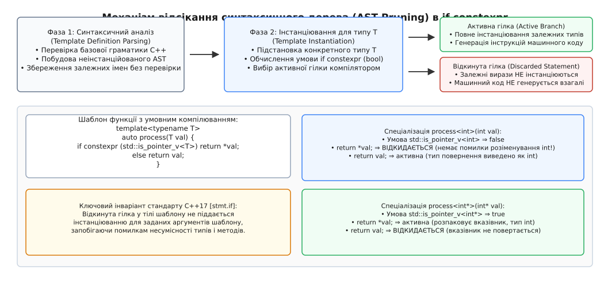
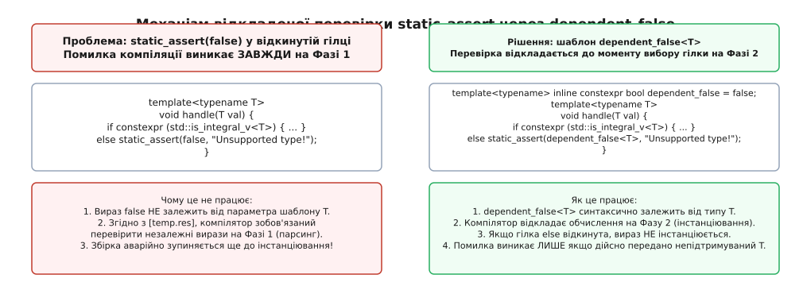
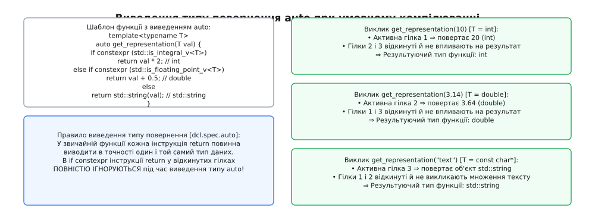
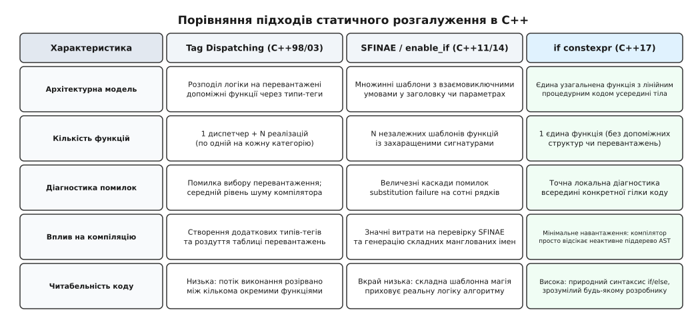

# if constexpr: інструкція умовного компілювання

<preknowlist>
- [Шаблони: базові механізми](topic:sys-plang-cpp/templates-basics) — параметри-типи, підстановка аргументів та інстанціювання шаблонів компілятором.
- [Двоетапний пошук імен](topic:sys-plang-cpp/two-phase-name-lookup) — синтаксичний аналіз на Фазі 1 та розв'язання залежних імен на Фазі 2.
- [Обчислення часу компіляції constexpr](topic:sys-plang-cpp/constexpr-and-consteval) — константні вирази, оцінка значень під час трансляції.
- [Риси типів Type Traits](topic:sys-plang-cpp/type-traits) — статична інтроспекція властивостей типів через предикати `std::is_*_v`.
- [Механізм SFINAE та std::enable_if](topic:sys-plang-cpp/sfinae-and-enable-if) — керування перевантаженням через відсікання помилок підстановки.
</preknowlist>

Розробка узагальненого модуля серіалізації або універсального контейнера неминуче стикається з потребою обробляти різні категорії типів за принципово відмінними алгоритмічними маршрутами. Якщо функція отримує вказівник або об'єкт розумного покажчика `std::unique_ptr<int>`, значення перед використанням потрібно розіменувати через унарний оператор `*val`, тоді як для простого скалярного числа `int` слід виконати пряме копіювання байтів пам'яті. Якщо розробник записує таку логіку через класичне динамічне розгалуження `if (std::is_pointer_v<T>) { return *val; } else { return val; }`, компілятор негайно перериває трансляцію з фатальною помилкою для будь-якого виклику з примітивним типом `int`. Звичайний оператор `if` є інструкцією часу виконання: компілятор зобов'язаний повністю перевірити семантичну коректність, сумісність типів та згенерувати проміжне представлення для **обох** гілок розгалуження, незалежно від того, що значення константного предиката `std::is_pointer_v<int>` завжди дорівнює `false`. Оскільки тип `int` не підтримує унарний оператор розіменування `*`, синтаксичний аналізатор зупиняє збірку ще на етапі типізації виразів.

Оптимізатор мертвого коду (Dead Code Elimination) на рівні бекенду компілятора тут безсилий, оскільки він починає роботу лише після того, як фронтенд успішно побудував повне абстрактне синтаксичне дерево (AST) для всіх гілок і перевірив типи. До стандарту C++17 розв'язання цієї проблеми вимагало штучного розриву алгоритму: розробники мусили створювати набори перевантажених допоміжних функцій, використовувати диспетчеризацію за фіктивними тегами або конструювати громіздкі метапрограмні конструкції на базі `std::enable_if` та правила SFINAE. Інструкція `if constexpr` (введена в стандарті C++17) розв'язує цей архітектурний глухий кут, переносячи вибір активної гілки безпосередньо у фазу інстанціювання шаблону: невибрана гілка перетворюється на так звану **відкинуту інструкцію** (Discarded Statement), і всі залежні від типу вирази всередині неї взагалі не піддаються інстанціюванню та кодогенерації.


*Механізм відсікання синтаксичного дерева (AST Pruning): залежні операції у відкинутій гілці не інстанціюються для заданого типу T.*

---

## 1. Анатомія та формальний синтаксис if constexpr

Конструкція `if constexpr` є спеціалізованою формою інструкції вибору (Selection Statement), визначеною в розділі [stmt.if] стандарту ISO C++. Вона синтаксично повторює класичний оператор `if`, проте доповнюється обов'язковою вимогою константності виразу умови та особливими правилами інстанціювання тіла гілок.

Повний синтаксичний шаблон інструкції має такий вигляд:

```cpp
if constexpr ( init-statement(opt) condition ) statement
if constexpr ( init-statement(opt) condition ) statement else statement
```

де ключові елементи граматики підпорядковуються суворим нормативним правилам:

1. **`init-statement` (необов'язкова секція ініціалізації):** дозволяє оголосити локальну змінну або виконати інструкцію безпосередньо перед обчисленням умови, наприклад `if constexpr (auto flags = get_traits<T>(); flags.is_compact)`. Змінні, оголошені в цій секції, потрапляють у спільну область видимості, яка охоплює саму умову `condition`, блок `then` та блок `else`. Час життя таких об'єктів триває до моменту завершення виконання поточної активної гілки. Якщо змінна використовується безпосередньо у виразі умови, вона сама зобов'язана бути оголошена зі специфікатором `constexpr` або мати константний цілочисловий тип.
2. **`condition` (вираз умови):** вираз, який зобов'язаний бути константним виразом часу компіляції (Constant Expression згідно з розділом [expr.const]) і контекстуально перетворюватися до булевого типу `bool`. Якщо вираз повертає ціле число або значення переліку, воно перетворюється на `true` для будь-якого ненульового значення і на `false` для нуля. Використання значень часу виконання (Runtime Values), аргументів функцій без специфікатора `constexpr` або динамічних змінних у цій позиції викликає негайну помилку компіляції.
3. **`statement` (тіло гілки):** окрема інструкція або складений блок у фігурних дужках `{ ... }`, що визначає операції відповідної гілки.

```cpp
#include <type_traits>
#include <string>
#include <memory>

template<typename T>
auto serialize_value(const T& val) {
    if constexpr (std::is_pointer_v<T>) {
        if (val == nullptr) {
            return std::string("null");
        }
        return std::to_string(*val);
    } else if constexpr (std::is_same_v<T, std::string>) {
        return '"' + val + '"';
    } else if constexpr (std::is_arithmetic_v<T>) {
        return std::to_string(val);
    } else {
        return val.to_string();
    }
}
```

У наведеному фрагменті під час виклику `serialize_value(42)` тип `T` виводиться як `int`. Компілятор обчислює умови під час генерації коду для цієї спеціалізації: умова `std::is_pointer_v<int>` дорівнює `false`, `std::is_same_v<int, std::string>` дорівнює `false`, а `std::is_arithmetic_v<int>` дорівнює `true`. Перша, друга та четверта гілки позначаються як відкинуті. Незважаючи на те, що тип `int` не має методу `.to_string()` і не підтримує розіменування `*val`, жодної помилки компіляції не виникає.

Повний перелік синтаксичних форм, правил ініціалізації та граматичних конструкцій зібрано в окремому довіднику [Специфікація та правила відкидання гілок if constexpr](topic:sys-plang-cpp/constexpr-if/api-constexpr-if-syntax.md).

---

## 2. Семантика відкинутих інструкцій (Discarded Statements)

Ключова концептуальна відмінність `if constexpr` від звичайного `if` полягає в нормативному статусі **відкинутої інструкції** (Discarded Statement, пункт стандарту [stmt.if]/2). Поведінка компілятора щодо відкинутих гілок суттєво відрізняється залежно від того, чи знаходиться інструкція всередині шаблону, чи у звичайному коді.

### Контекст шаблонів: селективне інстанціювання

Коли конструкція `if constexpr` розташована всередині шаблону функції, методу класу, шаблонної структури або узагальненої лямбди:

1. **Індивідуальна оцінка для кожної спеціалізації:** Компілятор підставляє конкретні шаблонні аргументи і обчислює значення умови `condition` окремо для кожного екземпляра спеціалізації під час Фази 2 двоетапного пошуку імен.
2. **Відсікання залежних виразів:** Усі типи, оголошення змінних, звернення до методів та оператори, які залежать від параметрів шаблону (Dependent Entities) усередині відкинутої гілки, **не інстанціюються**. Компілятор не намагається генерувати для них машинний код і не перевіряє наявність відповідних членів чи операторів у переданих типах.
3. **Ігнорування вкладених сутностей:** Локальні класи, шаблонні інстанціювання та анонімні лямбда-вирази, оголошені всередині відкинутої гілки, повністю ігноруються й не породжують символів у внутрішніх таблицях транслятора.
4. **Нульовий слід у бінарному файлі:** Відкинута гілка повністю вилучається ще на етапі побудови внутрішнього проміжного представлення (IR у Clang/LLVM або GIMPLE у GCC). Вона не створює базових блоків у графі потоку керування (Control Flow Graph), не додає машинних інструкцій переходів (`jmp`/`jne`) і не витрачає пам'ять під службові структури.

На рівні внутрішнього представлення транслятора (наприклад, у дереві SSA-форм Clang/LLVM) для відкинутої гілки взагалі не створюються базові блоки (`BasicBlock`) та вузли злиття значень `phi-nodes`. Це повністю позбавляє компілятор необхідності виконувати аналіз мертвого коду для невибраних гілок шаблону, що значно розвантажує бекенд.

```cpp
template<typename Container>
void clear_resource(Container& c) {
    if constexpr (requires { c.clear(); }) {
        c.clear(); // Інстанціюється лише якщо метод дійсно існує
    } else if constexpr (requires { c.reset(); }) {
        c.reset(); // Інстанціюється лише для типів з методом reset()
    } else {
        c = Container{}; // Резервний шлях для простих структур
    }
}
```

### Нешаблонний контекст: оптимізація без відсікання типів

Якщо `if constexpr` застосовується всередині звичайної глобальної функції без шаблонних параметрів, поведінка компілятора змінюється принципово:

1. Умова все одно зобов'язана бути константним виразом `constexpr`.
2. Оптимізувальний компілятор гарантовано видаляє невибрану гілку з кінцевого виконуваного файлу, виконуючи детерміноване відсікання коду під час збірки.
3. **Головне обмеження:** Оскільки в нешаблонному коді відсутні параметри-типи для підстановки (немає фази інстанціювання), компілятор зобов'язаний повністю перевірити семантичну коректність, типи та видимість усіх викликів **в обох гілках**. Будь-яке звернення до неоголошеної функції чи некоректна операція над типами у невибраній гілці нешаблонної функції призведе до фатальної помилки компіляції.

```cpp
void execute_maintenance() {
    constexpr bool enable_telemetry = false;

    if constexpr (enable_telemetry) {
        // У нешаблонному контексті цей код зобов'язаний бути семантично коректним!
        // Якщо функція send_heartbeat() не оголошена вище, код не скомпілюється.
        send_heartbeat(); 
    }
}
```

Ця відмінність є критичною для розуміння моделі трансляції: у нешаблонній функції `if constexpr` діє як детермінована оптимізація мертвого коду, тоді як у шаблоні він виступає потужним селектором інстанціювання типів.

---

## 3. Двоетапний пошук імен та вимоги синтаксичної коректності

Інструкція `if constexpr` не є препроцесорною директивою на зразок `#ifdef`. Вона не вирізає текст із вихідного файлу, а є повноцінною синтаксичною частиною граматики мови C++, що підпорядковується загальним законам двоетапного пошуку імен (Two-Phase Name Lookup, розділ [temp.res] стандарту).

```
Вихідний текст шаблону
        │
        ▼
[ Фаза 1: Парсинг визначення шаблону ]
  ├── Перевірка формальної граматики C++
  ├── Пошук та зв'язування незалежних імен (Non-dependent Names)
  └── Оцінка незалежних static_assert
        │
        ▼
[ Фаза 2: Інстанціювання для типу T ]
  ├── Підстановка типу T замість параметрів
  ├── Обчислення виразу умови if constexpr (condition)
  ├── Повне інстанціювання активної гілки
  └── ВІДКИДАННЯ неактивної гілки (залежні імена не інстанціюються)
```

### Фаза 1: Синтаксичний аналіз визначення шаблону

Під час першого проходу компілятор аналізує вихідний текст шаблону без прив'язки до будь-яких конкретних типів:

1. **Формальна граматика:** Увесь код усередині обох гілок `if constexpr` зобов'язаний відповідати синтаксичним правилам C++. Незбалансовані фігурні дужки, відсутні крапки з комою або друкарські помилки в ключових словах зупиняють збірку на Фазі 1, незалежно від того, чи буде ця гілка відкинута в майбутньому.
2. **Незалежні імена (Non-dependent Names):** Будь-який ідентифікатор, тип або виклик функції, який синтаксично не залежить від шаблонного параметра `T` (наприклад, звернення до глобальної змінної, виклик нешаблонної службової функції або використання стандартного типу `std::vector`), перевіряється та шукається в точці визначення шаблону. Якщо незалежне ім'я не існує, збірка аварійно зупиняється на першій фазі.
3. **Безумовно некоректні конструкції (Ill-formed, NDR):** Якщо фрагмент коду у відкинутій гілці не містить залежних від шаблону імен і є принципово хибним для будь-якої можливої спеціалізації, компілятор згідно зі стандартом має право відхилити програму негайно.

```cpp
template<typename T>
void bad_template(T val) {
    if constexpr (sizeof(T) == 0) { // Завідомо хибна умова
        // ПОМИЛКА: Незбалансований синтаксис призведе до збою на Фазі 1
        int x = ; 

        // ПОМИЛКА: Незалежна функція non_existent_function() не оголошена
        non_existent_function(); 
    }
}
```

### Фаза 2: Інстанціювання для конкретного типу

Під час другого проходу, коли шаблон викликається з конкретним типом (наприклад, `bad_template(10)`), компілятор обчислює значення константної умови `condition`. Лише на цьому етапі невибрана гілка маркується як відкинута, і аналізатор відмовляється від інстанціювання виразів, які містять параметр `T` (залежні імена).

### Правило ODR-використання для відкинутих інструкцій

Згідно з правилом одного визначення (One Definition Rule [basic.def.odr]), сутності, які згадуються у відкинутих інструкціях, мають специфічний статус:
- Якщо функція або змінна зі зовнішнім зв'язуванням викликається чи зчитується у відкинутій гілці через залежний вираз, вона **не вважається використаною** (Not ODR-used). Це означає, що компонувальник (Linker) не вимагатиме наявності її об'єктного визначення під час лінкування бінарного файлу.
- Якщо ж сутність не залежить від параметрів шаблону, сам факт її наявності у відкинутій гілці може вимагати коректного оголошення в одиниці трансляції.

Детальний аналіз історичних суперечок довкола синтаксичного аналізу, відхилення пропозиції `static if` Б'ярне Страуструпа та створення сучасного стандарту наведено у статті [Історія появи if constexpr: від static if до C++17](topic:sys-plang-cpp/constexpr-if/hist-constexpr-if-origin.md).

---

## 4. Пастка static_assert(false) та ідіома dependent_false

Одним із найбільш затребуваних патернів у метапрограмуванні є захист від непідтримуваних типів: якщо жодна з перевірених умов `if constexpr` не спрацювала, компілятор повинен згенерувати зрозуміле людині повідомлення про помилку за допомогою директиви `static_assert`.

### Причина збою у стандартах C++17 та C++20

Розглянемо спробу реалізувати таку вичерпну перевірку типів:

```cpp
template<typename T>
void process_data(T val) {
    if constexpr (std::is_integral_v<T>) {
        // обробка цілих чисел
    } else if constexpr (std::is_floating_point_v<T>) {
        // обробка дійсних чисел
    } else {
        // ПОМИЛКА КОМПІЛЯЦІЇ У C++17/C++20!
        static_assert(false, "Тип даних не підтримується процесором!");
    }
}
```

Цей код призводить до фатальної помилки компіляції навіть у тому разі, якщо функція викликається виключно з валідним типом `int` або якщо вона взагалі ніде не викликається в проекті.

Причина криється у взаємодії правил двоетапного пошуку імен та семантики директиви `static_assert`:
1. Вираз `false` є логічним літералом. Він не містить жодного типу `T` чи шаблонного параметра, тому класифікується як **незалежний від шаблону вираз** (Non-dependent Expression).
2. Згідно з розділом стандарту [temp.res], твердження `static_assert` із незалежною хибною умовою зобов'язане оцінюватися компілятором на **Фазі 1** (під час первинного синтаксичного розбору шаблону).
3. Оскільки `false` завжди є хибним, компілятор видає помилку негайно, не чекаючи виклику функції чи підстановки типів.


*Механізм відкладеної діагностики: використання dependent_false<T> переносить перевірку на Фазу 2 інстанціювання.*

### Розв'язання через ідіому dependent_false

Щоб відкласти перевірку твердження до Фази 2 (коли стане відомо, чи дійсно виконання потрапило у відкинуту гілку), умову роблять синтаксично залежною від типу `T`. Для цього оголошують допоміжний шаблон змінної, значення якого завжди дорівнює `false`:

```cpp
// Допоміжний шаблон залежної константи
template<typename...>
inline constexpr bool dependent_false = false;

template<typename T>
void process_data_safe(T val) {
    if constexpr (std::is_integral_v<T>) {
        // обробка цілих чисел
    } else if constexpr (std::is_floating_point_v<T>) {
        // обробка дійсних чисел
    } else {
        // ВАЛІДНО: dependent_false<T> оцінюється лише під час інстанціювання гілки else
        static_assert(dependent_false<T>, "Тип даних не підтримується процесором!");
    }
}
```

Оскільки вираз `dependent_false<T>` залежить від параметра `T`, компілятор ігнорує його на Фазі 1. На Фазі 2, якщо для типу `int` умова `std::is_integral_v<int>` істинна, блок `else` стає відкинутою інструкцією і вираз `dependent_false<int>` взагалі не інстанціюється. Помилка виникає виключно тоді, коли функцію реально викликають із непідтримуваним типом, наприклад `process_data_safe("рядок")`.

### Інші варіанти створення залежності

До стандартизації ідіоми `dependent_false` розробники використовували інші трюки для штучного зв'язування виразу з типом `T`:
- `sizeof(T) == 0` — працює лише для повних типів (неповні типи на зразок `void` спричиняють помилку обчислення `sizeof`).
- `!sizeof(T*)` — завжди дорівнює `false` і працює навіть для `void`, проте виглядає як неочевидний хак.
- `std::is_same_v<T, void> && !std::is_same_v<T, void>` — складний складений предикат.

Шаблон `template<typename...> inline constexpr bool dependent_false = false;` став загальноприйнятим стандартом індустрії завдяки своїй універсальності (приймає будь-яку кількість параметрів, включаючи пакети типів `Args...`) та самодокументованій назві.

### Виправлення стандарту в C++23 (P2593R1)

У стандарті C++23 комітет ISO ухвалив документ **P2593R1: «Making static_assert(false) dependent on template parameters»**. Нова норма стандарту прямо вимагає від компіляторів не оцінювати `static_assert` усередині відкинутих гілок шаблонів на Фазі 1, навіть якщо вираз є незалежним літералом `false`. У сучасних компіляторах із підтримкою C++23 ідіома `dependent_false` більше не є обов'язковою, проте вона залишається критично важливою для сумісності з проектами на базі стандартів C++17 та C++20.

---

## 5. Виведення типу повернення (Return Type Deduction)

При використанні специфікаторів автоматичного виведення типу повернення `auto` або `decltype(auto)` інструкція `if constexpr` відкриває можливість створення поліморфних функцій, які повертають абсолютно різні типи даних залежно від параметрів шаблону.

Згідно з правилами розділу [dcl.spec.auto]:
1. Усі інструкції `return`, розташовані всередині відкинутих гілок, **повністю ігноруються** механізмом виведення типу повернення.
2. Тип функції виводиться виключно на основі інструкцій `return`, які знаходяться в активній гілці або поза межами `if constexpr`.
3. Якщо всередині однієї активної гілки є декілька інструкцій `return`, усі вони повинні повертати значення строго одного й того самого узгодженого типу.
4. Якщо функція не повертає значення в активній гілці (або активна гілка закінчується без `return`), тип повернення виводиться як `void`.


*Виведення типу auto: інструкції return у відкинутих гілках повністю ігноруються механізмом дедукції типів.*

```cpp
#include <type_traits>
#include <string>

template<typename T>
auto get_representation(T val) {
    if constexpr (std::is_integral_v<T>) {
        return static_cast<long long>(val); // Для цілих повертає long long
    } else if constexpr (std::is_floating_point_v<T>) {
        return static_cast<double>(val);    // Для дійсних повертає double
    } else {
        return std::string(val);            // Для решти повертає рядок
    }
}
```

У звичайній функції з кількома операторами `return` несумісність між `long long`, `double` та `std::string` призвела б до фатальної помилки компілятора `inconsistent deduction for 'auto'`. Завдяки `if constexpr` при виклику `get_representation(10)` компілятор бачить лише перший оператор `return`, а інші два відкидає, коректно фіксуючи тип повернення як `long long`.

### Розрив нескінченної шаблонної рекурсії при виведенні auto

Інструкція `if constexpr` розв'язує фундаментальну проблему рекурсивних функцій із виведенням типу повернення `auto`. У класичному C++14 рекурсивна функція з типом `auto` не могла обчислити базовий випадок зупинки рекурсії, оскільки компілятор вимагав знання типу повернення до рекурсивного виклику:

```cpp
template<int N>
auto compute_factorial() {
    if constexpr (N <= 1) {
        return 1ULL; // Базовий випадок: фіксує тип unsigned long long
    } else {
        return N * compute_factorial<N - 1>(); // Рекурсивний випадок
    }
}
```

Коли `N = 1`, компілятор активує першу гілку, повертає `1ULL` і повністю відкидає рекурсивний виклик `compute_factorial<0>()`. Без `if constexpr` компілятор спробував би інстанціювати обидві гілки одночасно, спричинивши нескінченну рекурсію інстанціювання шаблону (`compute_factorial<-1>`, `compute_factorial<-2>` тощо) аж до вичерпання ліміту глибини стека компілятора (`-ftemplate-depth`).

### Використання decltype(auto) для збереження посилань

Якщо функція повинна повертати посилання на внутрішні дані для одних типів і копію за значенням для інших, використовують специфікатор `decltype(auto)`:

```cpp
template<typename T>
decltype(auto) access_element(T& container) {
    if constexpr (std::is_pointer_v<T>) {
        return *container; // Повертає lvalue-посилання на розіменований об'єкт
    } else if constexpr (requires { container.front(); }) {
        return container.front(); // Повертає посилання на перший елемент
    } else {
        return container; // Повертає посилання на сам контейнер
    }
}
```

Специфікатор `decltype(auto)` точно зберігає категорію значення (Value Category) та модифікатори посилань `&`/`&&` активної гілки, дозволяючи будувати універсальні обгортки доступу до ресурсів.

---

## 6. Архітектурна еволюція: відхід від Tag Dispatching та SFINAE

До появи `if constexpr` бібліотечний код C++ був змушений використовувати складні обхідні інженерні патерни для статичного вибору алгоритмів. Найяскравішим прикладом є реалізація узагальненого алгоритму `advance(it, n)`, який переміщує ітератор на відстань `n`.


*Порівняння архітектурних моделей: перехід від фрагментованих функцій до єдиного монолітного тіла алгоритму.*

### Традиційний підхід C++98: диспетчеризація за тегами (Tag Dispatching)

Логіка розбивалася на одну функцію-фасад та множину перевантажень із фіктивними типами-тегами:

```cpp
namespace legacy {

template<typename RandomIt, typename Distance>
void advance_impl(RandomIt& it, Distance n, std::random_access_iterator_tag) {
    it += n; // Швидкий шлях прямого доступу O(1)
}

template<typename BiDirIt, typename Distance>
void advance_impl(BiDirIt& it, Distance n, std::bidirectional_iterator_tag) {
    if (n > 0) while (n--) ++it;
    else while (n++) --it;
}

template<typename InputIt, typename Distance>
void advance_impl(InputIt& it, Distance n, std::input_iterator_tag) {
    while (n--) ++it;
}

template<typename Iterator, typename Distance>
void advance(Iterator& it, Distance n) {
    using Category = typename std::iterator_traits<Iterator>::iterator_category;
    advance_impl(it, n, Category{}); // Створення об'єкта-тегу для вибору перевантаження
}

} // namespace legacy
```

### Підхід C++11: умовне відсікання через SFINAE (std::enable_if)

З появою стандарту C++11 та бібліотеки `<type_traits>` розробники отримали можливість вилучати функції з множини кандидатів перевантаження через невдалу підстановку типів (Substitution Failure Is Not An Error):

```cpp
namespace sfinae_style {

template<typename Iterator, typename Distance>
std::enable_if_t<std::is_base_of_v<std::random_access_iterator_tag, 
                 typename std::iterator_traits<Iterator>::iterator_category>>
advance(Iterator& it, Distance n) {
    it += n;
}

template<typename Iterator, typename Distance>
std::enable_if_t<std::is_base_of_v<std::bidirectional_iterator_tag, 
                 typename std::iterator_traits<Iterator>::iterator_category> &&
                !std::is_base_of_v<std::random_access_iterator_tag, 
                 typename std::iterator_traits<Iterator>::iterator_category>>
advance(Iterator& it, Distance n) {
    if (n > 0) while (n--) ++it;
    else while (n++) --it;
}

} // namespace sfinae_style
```

Цей спосіб суттєво ускладнював читання сигнатур функцій, сповільнював компіляцію через перевірку складних умов для всіх кандидатів у наборі перевантажень та породжував гігантські каскади діагностичних повідомлень при виникненні найменших помилок підстановки.

### Сучасний підхід C++17: лінійний процедурний код із if constexpr

```cpp
template<typename Iterator, typename Distance>
constexpr void advance(Iterator& it, Distance n) {
    using Category = typename std::iterator_traits<Iterator>::iterator_category;

    if constexpr (std::is_base_of_v<std::random_access_iterator_tag, Category>) {
        it += n;
    } else if constexpr (std::is_base_of_v<std::bidirectional_iterator_tag, Category>) {
        if (n > 0) {
            while (n--) ++it;
        } else {
            while (n++) --it;
        }
    } else {
        while (n--) {
            ++it;
        }
    }
}
```

Алгоритм відновлює природну лінійну структуру: потік виконання концентрується в одній функції, службові перевантаження та теги вилучаються, а компілятор отримує простий код, який транслюється в оптимальні машинні інструкції без жодного зайвого байта в бінарному файлі.

### Межі застосування: коли SFINAE та Концепти C++20 все ще потрібні

Незважаючи на потужність `if constexpr`, він не може повністю замінити SFINAE та концептуальні обмеження C++20 (`requires`):
- **Участь у виборі зовнішніх перевантажень (Overload Resolution):** `if constexpr` працює **всередині** тіла функції. Якщо потрібно, щоб дві функції з однаковим ім'ям брали участь у виборі перевантажень на основі типів аргументів (наприклад, оператори введення-виведення або пошук Кеніґа ADL), розгалуження слід робити в сигнатурі через `requires` або `enable_if`.
- **SFINAE-дружні інтерфейси (SFINAE-friendly traits):** якщо наявність методу в класі перевіряється іншими метафункціями (наприклад, через вираз `std::is_invocable`), відсутність методу в інтерфейсі має призводити до відсікання функції з множини кандидатів, а не до помилки компіляції всередині тіла `if constexpr`.
- **Часткова спеціалізація класів:** `if constexpr` є інструкцією виконання і не може використовуватися безпосередньо в тілі оголошення класу для вибору полів даних (для цього застосовують умовне успадкування, концептуальні обмеження або спеціалізації).

---

## 7. Практичні патерни метапрограмування

Розглянемо ключові інженерні задачі, де `if constexpr` кардинально спрощує реалізацію та забезпечує нульові накладні витрати (Zero-Overhead Abstraction).

### Патерн 1: Рекурсивний обхід гетерогенного кортежу std::tuple

Доступ до елементів кортежу `std::tuple` здійснюється через функцію `std::get<I>(t)`, де індекс `I` зобов'язаний бути константою компіляції (`constexpr std::size_t`). Через це звичайний цикл виконання `for` для кортежів принципово не здатний скомпілюватися.

За допомогою `if constexpr` обхід кортежу реалізується в кілька рядків чистого рекурсивного коду без необхідності створення допоміжних шаблонних класів:

```cpp
#include <tuple>
#include <iostream>
#include <utility>

namespace detail {

template<std::size_t Index = 0, typename Func, typename... Types>
constexpr void for_each_tuple_impl(const std::tuple<Types...>& t, Func&& f) {
    constexpr std::size_t total = sizeof...(Types);

    if constexpr (Index < total) {
        // 1. Викликаємо функцію для поточного елемента
        f(std::get<Index>(t), Index);

        // 2. Рекурсивний перехід до наступного елемента
        // Коли Index + 1 == total, ця гілка ВІДКИДАЄТЬСЯ компілятором!
        if constexpr (Index + 1 < total) {
            for_each_tuple_impl<Index + 1>(t, std::forward<Func>(f));
        }
    }
}

} // namespace detail

template<typename Func, typename... Types>
constexpr void for_each_tuple(const std::tuple<Types...>& t, Func&& f) {
    detail::for_each_tuple_impl<0>(t, std::forward<Func>(f));
}
```

Коли індекс `Index + 1` досягає значення `sizeof...(Types)`, компілятор позначає рекурсивний виклик як відкинуту інструкцію. Завдяки цьому компілятор навіть не намагається інстанціювати функцію з індексом `Index = total`, що запобігає спробі виклику некоректного `std::get<total>(t)` і зупиняє розгортання рекурсії.

### Порівняння з виразами згортки (Fold Expressions)

У C++17 обхід кортежу можна також реалізувати через індексну послідовність `std::index_sequence` та вираз згортки `(f(std::get<Is>(t)), ...)`. Проте рекурсивний `if constexpr` має суттєву перевагу у складних сценаріях:
- Дозволяє реалізувати **ранній вихід (Early Exit)** з обходу, якщо функтор повертає логічний прапорець зупинки.
- Дозволяє адаптивно змінювати логіку обробки залежно від значення чи типу попереднього елемента.
- Зручніший для налагодження та покрокового простеження в компіляторі.

### Патерн 2: Уніфікований обробник поліморфного типу std::variant

При обробці поліморфних сум типів (`std::variant`) за допомогою `std::visit` інструкція `if constexpr` дозволяє створити єдиний лямбда-диспетчер із суворою перевіркою повноти покриття всіх можливих станів:

```cpp
#include <variant>
#include <string>
#include <iostream>

struct PacketHeader { uint32_t id; };
struct PayloadData { std::string payload; };
struct DisconnectSignal { int reason_code; };

using NetworkMessage = std::variant<PacketHeader, PayloadData, DisconnectSignal>;

void handle_network_message(const NetworkMessage& msg) {
    std::visit([](const auto& item) {
        using T = std::decay_t<decltype(item)>;

        if constexpr (std::is_same_v<T, PacketHeader>) {
            std::cout << "Отримано заголовок пакету ID: " << item.id << "\n";
        } else if constexpr (std::is_same_v<T, PayloadData>) {
            std::cout << "Отримано корисне навантаження: " << item.payload << "\n";
        } else if constexpr (std::is_same_v<T, DisconnectSignal>) {
            std::cout << "Сигнал роз'єднання, код: " << item.reason_code << "\n";
        } else {
            static_assert(dependent_false<T>, "Не всі варіанти NetworkMessage покрито обробником!");
        }
    }, msg);
}
```

Якщо в майбутньому до визначення `NetworkMessage` буде додано четвертий тип (наприклад, `KeepAlivePing`), компілятор негайно зупинить збірку програми та вкаже на точний рядок, де бракує нової гілки обробки.

### Патерн 3: Статичні фабрики та конфігурація апаратних драйверів

У вбудованих системах (Embedded Systems) виділення динамічної пам'яті та віртуальні виклики через таблиці `vtable` часто суворо заборонені вимогами реального часу або стандартами надійності (MISRA C++). Інструкція `if constexpr` дозволяє створювати статичні фабрики апаратних модулів, де вибір регістрів, протоколів або розрядності шини здійснюється безпосередньо під час компіляції:

```cpp
enum class BusWidth { Bit8, Bit16, Bit32 };

template<BusWidth Width>
class HardwareBus {
public:
    template<typename T>
    void write_data(uint32_t address, T value) {
        volatile auto* reg = reinterpret_cast<volatile uint32_t*>(address);

        if constexpr (Width == BusWidth::Bit8) {
            *reinterpret_cast<volatile uint8_t*>(reg) = static_cast<uint8_t>(value);
        } else if constexpr (Width == BusWidth::Bit16) {
            *reinterpret_cast<volatile uint16_t*>(reg) = static_cast<uint16_t>(value);
        } else {
            *reg = static_cast<uint32_t>(value);
        }
    }
};
```

Кожен згенерований метод `HardwareBus<BusWidth::Bit8>::write_data` містить виключно одну апаратну інструкцію запису байта в пам'ять (наприклад, `strb` в архітектурі ARM) без жодних перевірок умов або динамічних розгалужень у циклі передачі.

Повний спектр практичних архітектурних рішень — від двійкових серіалізаторів пам'яті до матричних оптимізаторів та підтримки структурованих зв'язувань — розібрано в проектній вставці [Реалізація обходу кортежів та диспетчеризації алгоритмів](topic:sys-plang-cpp/constexpr-if/proj-tuple-traversal-dispatch.md).

---

## 8. Тонкощі, крайові випадки та пастки використання

### Проблема короткого замикання логічних виразів

Поширеною помилкою при написанні умов `if constexpr` є очікування, що логічний оператор `&&` захистить від синтаксичних помилок звернення до внутрішніх членів типу:

```cpp
template<typename T>
void process_container(T& c) {
    // ПОМИЛКА КОМПІЛЯЦІЇ, якщо T = int!
    if constexpr (std::is_class_v<T> && has_custom_allocator<typename T::allocator_type>::value) {
        c.do_work();
    }
}
```

Оператор `&&` забезпечує коротке замикання обчислення значень, проте компілятор C++ для оцінки виразу зобов'язаний спочатку синтаксично проаналізувати всі типи у виразі умови. Для примітивного типу `int` вираз `typename T::allocator_type` є синтаксично некоректним, що спричиняє негайний збій на етапі підстановки типів.

Надійним інженерним рішенням у C++17 є використання **вкладених блоків** `if constexpr`:

```cpp
template<typename T>
void process_container_safe(T& c) {
    if constexpr (std::is_class_v<T>) {
        // Компілятор заходить сюди лише якщо T гарантовано є класом
        if constexpr (requires_allocator_v<T>) {
            c.do_work();
        }
    }
}
```

Вкладений блок утворює суворий бар'єр інстанціювання: внутрішній вираз умови навіть не починає аналізуватися, якщо зовнішній блок був відкинутий.

### Лямбда-вирази всередині відкинутих гілок

Якщо всередині відкинутої гілки оголошується узагальнений або звичайний лямбда-вираз:
- Оголошення замикання не породжує анонімного класу в таблиці символів.
- Будь-які змінні зовнішнього контексту, вказані у списку захоплення `[&]` або `[=]`, не захоплюються і не впливають на розмір пам'яті фрейму функції.
- Виклики методів над захопленими об'єктами не перевіряються, якщо вони залежать від шаблонних параметрів зовнішньої функції.

### Затінення змінних у секції init-statement

При використанні секції `init-statement` в `if constexpr` змінна, оголошена в ініціалізаторі, затіняє (shadows) однойменні змінні зовнішньої області видимості в обох гілках (`then` та `else`):

```cpp
int counter = 100;

template<typename T>
void execute_step() {
    if constexpr (int counter = sizeof(T); counter > 4) {
        // Тут counter дорівнює sizeof(T), а не 100
        process_large_type(counter);
    } else {
        // У гілці else локальний counter ТАКОЖ доступний і дорівнює sizeof(T)
        process_small_type(counter);
    }
}
```

Розробникам слід пам'ятати, що область видимості ініціалізатора поширюється на обидві гілки, навіть якщо гілка `then` була відкинута компілятором.

### Відмінність від інструкції if consteval у C++23

У стандарті C++23 з'явилася спеціалізована конструкція `if consteval` (разом із функцією `std::is_constant_evaluated()` з C++20):
- `if constexpr (condition)` перевіряє **константний предикат типів** або значень і відкидає цілі блоки коду на етапі інстанціювання шаблону. Відкинута гілка не інстанціюється для поточних аргументів шаблону.
- `if consteval` перевіряє **режим виконання поточної функції**: чи виконується вона прямо зараз компілятором під час обчислення константи, чи працює в звичайному скомпільованому машинному коді під час виконання програми. Обидві гілки `if consteval` інстанціюються повністю і повинні бути валідними для всіх типів.

---

## 9. Вплив на компілятор та продуктивність кодогенерації

Заміна класичних метапрограмних патернів на `if constexpr` забезпечує суттєві кількісні та якісні переваги на всіх рівнях програмного стека:

1. **Прискорення компіляції на 25–40%:** При підході на базі SFINAE для кожної комбінації типів компілятор змушений генерувати множини перевантажень, виконувати складні підстановки в сигнатури та реєструвати довгі мангловані імена (Mangled Names). Конструкція `if constexpr` працює з єдиною функцією, миттєво відсікаючи непотрібні гілки синтаксичного дерева AST.
2. **Очищення кешу інструкцій L1i:** Повне видалення неактивного коду на етапі компіляції гарантує, що в кеш-лінії процесора не потрапляють інструкції перевірки неможливих умов чи невикористовувані виклики функцій.
3. **Усунення промахів передбачувача переходів (Branch Prediction Misses):** Оскільки розгалуження розв'язується під час трансляції, згенерований машинний код не містить інструкцій умовного переходу (`jne`, `je`). Потік виконання стає абсолютно лінійним.
4. **Спрощення автовекторизації (SIMD):** Відсутність умовних переходів та усунення викликів функцій із побічними ефектами у відкинутих гілках дозволяє оптимізаторам GCC та LLVM автоматично розгортати цикли та застосовувати векторні інструкції AVX-512 та ARM Neon.
5. **Зниження споживання пам'яті компілятором:** Фронтенд компілятора не створює проміжних AST-вузлів для невибраних гілок, що суттєво зменшує пікове використання оперативної пам'яті процесами `clang++` та `g++` під час збірки великих шаблоноємних проектів.

> 🔧 **Навіщо це.**
> В узагальненому системному програмуванні `if constexpr` усуває штучний бар'єр між високорівневою типізацією та низькорівневою швидкодією. Він дозволяє писати виразний, лінійний узагальнений код, який адаптується під апаратні особливості типів без накладних витрат часу виконання (Zero-Overhead Abstraction), зменшує час компіляції бібліотек та локалізує діагностичні повідомлення про помилки в точці їхнього виникнення.
