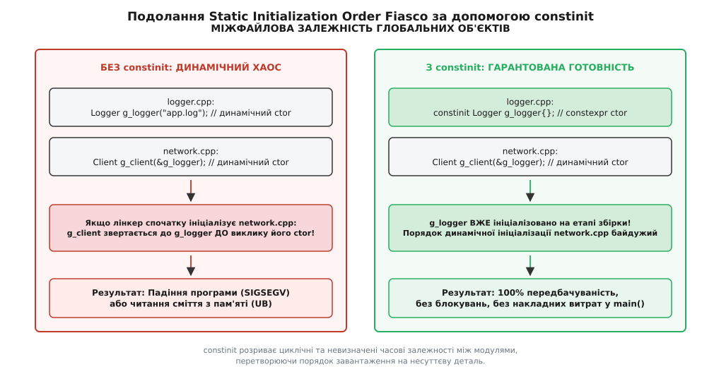
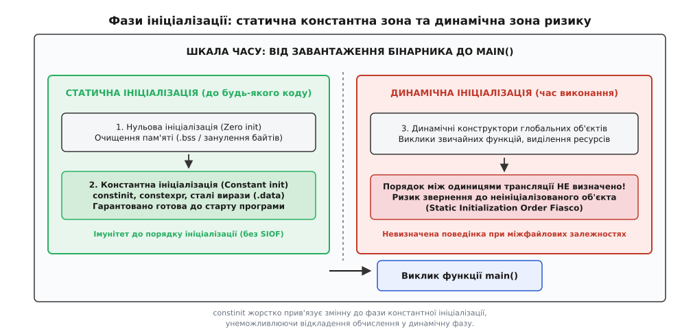
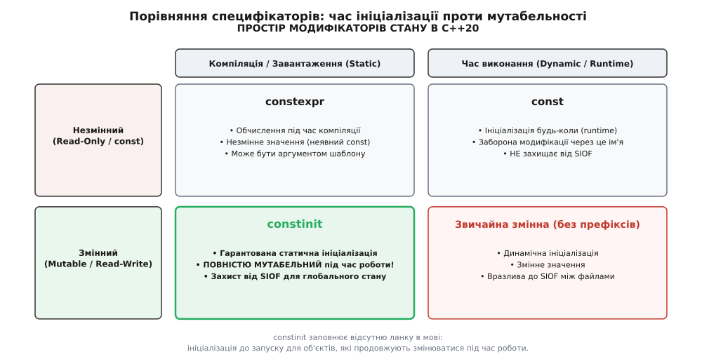
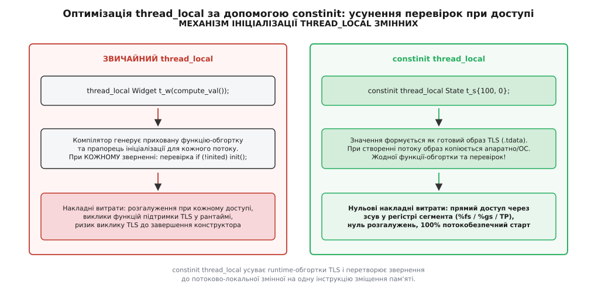

# constinit: ініціалізація до запуску без обіцянки незмінності

<preknowlist>
- [constexpr і consteval: обчислення під час компіляції](root:sys-plang-cpp/constexpr-and-consteval) — правила сталого обчислювача та вимоги до виразів часу компіляції.
- [Коректність за const](root:sys-plang-cpp/const-correctness) — модифікатор `const` гарантує незмінність через ім'я, але не фіксує фазу ініціалізації.
- [Час життя та тривалість зберігання об'єктів](root:sys-plang-cpp/object-lifetime) — статична, потокова та автоматична тривалості зберігання даних у пам'яті.
- [Правило одного визначення та зв'язування](root:sys-plang-cpp/odr-and-linkage) — роздільна компіляція, одиниці трансляції та поведінка глобальних символів.
- [Форми ініціалізації в C++](root:sys-plang-cpp/initialization-forms) — статична, константна та динамічна ініціалізація змінних.
</preknowlist>

## Небезпека між файлами: коли порядок вирішує все

Уявімо типову архітектуру програми на C++, розбиту на дві незалежні одиниці трансляції. Перший файл, `logger.cpp`, визначає глобальний об'єкт журналювання, який відкриває файл на диску у своєму конструкторі. Другий файл, `network.cpp`, визначає глобальний клієнт мережі, конструктор якого під час запуску записує вітальне повідомлення в журнал:

```cpp
// logger.cpp
Logger g_logger("app.log"); // Відкриває файл, виділяє буфер

// network.cpp
extern Logger g_logger;
NetworkClient g_client(&g_logger); // У конструкторі викликає g_logger.log("Network starting...")
```

Обидва об'єкти мають статичну тривалість зберігання (англ. *static storage duration*). Стандарт C++ гарантує, що всередині одного вихідного файлу змінні ініціалізуються точно в порядку їхнього оголошення. Проте для об'єктів, розташованих у різних одиницях трансляції, стандарт оголошує порядок ініціалізації невизначеним (англ. *unspecified*).

Порядок запуску їхніх конструкторів визначається системним компонувальником і динамічним завантажувачем операційної системи. Якщо компонувальник першим передасть керування коду ініціалізації `network.o`, конструктор `NetworkClient` звернеться до покажчика `g_logger` до того, як для `g_logger` буде виконано його власний конструктор. У цей момент внутрішні поля `g_logger` містять або нулі, або неініціалізоване сміття.

Результат такого виклику — катастрофічний: спроба розіменування нульового покажчика або звернення за некоректною адресою пам'яті призводить до аварійного завершення програми через помилку сегментації (`SIGSEGV`) ще до того, як процесор виконає перший рядок функції `main()`.


*Динамічна ініціалізація створює залежність від випадкового порядку компонування, тоді як константна ініціалізація гарантує повну готовність пам'яті ще до старту програми.*

Ця класична проблема отримала назву катастрофи порядку статичної ініціалізації (англ. *Static Initialization Order Fiasco*, SIOF). Вона десятиліттями залишалася однією з найпідступніших пасток мови C++, оскільки помилка могла не проявлятися роками на машині розробника і раптово виникати після зміни версії компілятора, зміни порядку переліку вихідних файлів у `CMakeLists.txt` або переносу програми на іншу операційну систему.

Історичний шлях розвитку цієї проблеми, невдалі спроби її обходу через синглтони Мейєрса та вендорні атрибути компіляторів детально описані у вставці [Як народився constinit: боротьба з катастрофою порядку ініціалізації](root:sys-plang-cpp/constinit/hist-constinit-origin.md).

## Механізм компонування: чому динамічний порядок неможливо передбачити

Щоб зрозуміти неминучість цієї катастрофи у традиційному C++, розглянемо, як системний компонувальник формує виконуваний файл формату ELF (на Linux), Mach-O (на macOS) або PE/COFF (на Windows).

Коли компілятор обробляє одиницю трансляції з глобальним об'єктом, що вимагає динамічного конструктора, він генерує дві сутності:

1. Неявну функцію-ініціалізатор (наприклад, `__cxx_global_var_init`), яка містить виклик конструктора відповідного об'єкта.
2. Вказівник на цю функцію-ініціалізатор, який розміщується у спеціальній таблиці покажчиків бінарного файлу — секції `.init_array` в ELF або секції `.CRT$XCU` у PE/COFF.

Коли завантажувач операційної системи передає керування точці входу середовища виконання C++ (функції `_start` або `mainCRTStartup`), середовище виконання послідовно проходить по масиву `.init_array` і викликає кожну функцію-ініціалізатор по черзі.

Компонувальник формує масив `.init_array`, просто об'єднуючи секції `.init_array` з усіх об'єктних файлів у тому порядку, в якому вони були передані в командному рядку компонування. Стандарт C++ свідомо не накладає вимог щодо топологічного сортування цих викликів на основі графа міжмодульних залежностей. Якщо між двома файлами виникає взаємна або складна циклічна залежність, побудувати коректний лінійний порядок динамічної ініціалізації взагалі математично неможливо.

Єдиним способом розірвати це замкнене коло є повне винесення ініціалізації за межі динамічного масиву `.init_array` у попередню, статичну фазу завантаження пам'яті.

## Дві фази старту: чому мові потрібна залізна межа

Стандарт C++ у розділах `[basic.start.static]` та `[basic.start.dynamic]` чітко розділяє старт програми на дві принципово різні послідовні фази: **статичну ініціалізацію** та **динамічну ініціалізацію**.

```
[Завантаження бінарника операційною системою]
        │
        ▼
1. Нульова ініціалізація (Zero-initialization: занулення .bss)
        │
        ▼
2. Константна ініціалізація (Constant initialization: секція .data)  <── БЕЗПЕЧНА СТАТИЧНА ЗОНА (constinit)
        │
════════╪═════════════════════════════════════════════════════════════════════════
        │
        ▼
3. Динамічна ініціалізація (Dynamic initialization: масив .init_array) <── ЗОНА РИЗИКУ (SIOF)
        │
        ▼
   [Виклик функції main()]
```

### 1. Фаза статичної ініціалізації (Static Initialization)

Статична ініціалізація відбувається завжди першою. Вона гарантовано завершується до початку виконання будь-якої інструкції динамічного коду і складається з двох послідовних кроків:

- **Нульова ініціалізація (Zero-initialization):** Пам'ять для всіх змінних зі статичною або потоковою тривалістю зберігання заповнюється нулями. Операційна система виконує це безпосередньо при відображенні сторінок пам'яті сегмента неініціалізованих даних (`.bss`).
- **Константна ініціалізація (Constant initialization):** Якщо об'єкт зі статичною тривалістю ініціалізується константним виразом (англ. *constant expression*), компілятор обчислює початковий стан під час збірки і записує його двійковий образ безпосередньо в секцію даних бінарного файлу (`.data` або `.rodata`). Коли операційна система завантажує програму, ці змінні вже мають правильні початкові значення.

Об'єкти, що пройшли константну ініціалізацію, володіють **абсолютним імунітетом до SIOF**: вони готові до використання в момент завантаження програми, до старту будь-якого коду.

### 2. Фаза динамічної ініціалізації (Dynamic Initialization)

Після завершення статичної фази середовище виконання C++ починає послідовно викликати динамічні конструктори тих глобальних змінних, які не вдалося проініціалізувати константними виразами (наприклад, об'єкти, що виділяють пам'ять у купі, відкривають сокети або викликають сторонні функції).

Саме на цьому етапі виникає ризик SIOF: якщо динамічний конструктор об'єкта `A` звертається до об'єкта `B`, який також вимагає динамічної ініціалізації, а конструктор `B` ще не був викликаний завантажувачем, виникає невизначена поведінка.


*Статична фаза завершується до будь-яких динамічних конструкторів, що робить константну ініціалізацію єдиною безпечною гаванню для глобального стану.*

Звідси випливає фундаментальний інженерний висновок: **якщо ми можемо гарантувати, що об'єкт проходить константну ініціалізацію, він стає на 100% безпечним для використання з будь-якого іншого модуля програми**.

## Специфікатор на змінній: залізна вимога без побічних ефектів

До стандарту C++20 у мові не існувало засобу, який дозволяв би вимагати константної ініціалізації для мутабельних змінних.

Розглянемо, чому наявні ключові слова мови не могли розв'язати цю задачу:

### Чому не підходить const?

Специфікатор `const` вимагає лише незмінності значення через дане ім'я. Проте `const` нічого не гарантує щодо моменту ініціалізації:

```cpp
int get_runtime_seed();

const int g_seed = get_runtime_seed(); // Динамічна ініціалізація в рантаймі!
```

Компілятор не бачить тут жодної помилки: `g_seed` отримує значення під час виконання і після цього не може змінюватися. Проте ця змінна проходить динамічну ініціалізацію, а отже, вразлива до SIOF.

### Чому не підходить constexpr?

Ключове слово `constexpr` на змінній дійсно вимагає константної ініціалізації: якщо вираз неможливо обчислити під час компіляції, компілятор зупиняє збірку.

Проте `constexpr` на змінній **автоматично накладає модифікатор const**:

```cpp
constexpr int g_limit = 100;
// g_limit = 200; // ПОМИЛКА: змінна є константою (read-only)
```

Якщо нам потрібен глобальний лічильник запитів, атомарний прапорець, спінлок, м'ютекс із `constexpr`-конструктором або голова зв'язного списку, яку планується модифікувати під час роботи програми, оголосити їх як `constexpr` неможливо.

### Призначення constinit у C++20

Специфікатор `constinit` усуває цю прогалину в дизайні мови. Він висуває до змінної рівно одну вимогу: **змінна зобов'язана пройти константну ініціалізацію під час компіляції**. При цьому він **не накладає константності** на саму змінну під час виконання:

```cpp
struct AtomicStats {
    long long request_count{0};
    long long error_count{0};
    constexpr AtomicStats() noexcept = default;
};

// Гарантована ініціалізація до запуску + повна можливість модифікації в процесі роботи:
constinit AtomicStats g_stats{};

void handle_request(bool ok) {
    g_stats.request_count++; // ПОВНІСТЮ ДОЗВОЛЕНО!
    if (!ok) g_stats.error_count++;
}
```


*constinit заповнює четвертий квадрант простору станів C++20: статична ініціалізація для змінних даних.*

Формальні правила синтаксису, контексти застосування та повна матриця взаємодії зі специфікаторами наведені у вставці [Правила та синтаксис constinit: формальний довідник](root:sys-plang-cpp/constinit/api-constinit-rules.md).

## Де живе constinit: статична та потокова тривалість зберігання

Стандарт C++20 дозволяє застосовувати `constinit` виключно до сутностей із двома типами тривалості зберігання:

1. **Статична тривалість зберігання (`static storage duration`):**
   - Глобальні змінні на рівні файлу або всередині просторів імен.
   - Статичні змінні-члени класів (`static data members`).
   - Локальні статичні змінні всередині функцій.
2. **Потокова тривалість зберігання (`thread storage duration`):**
   - Змінні, оголошені зі специфікатором `thread_local`.

Якщо спробувати застосувати `constinit` до автоматичної локальної змінної на стеку, компілятор відмовиться компілювати код:

```cpp
void process() {
    // ПОМИЛКА: автоматичні змінні живуть на стеку і не мають статичної тривалості!
    constinit int local_val = 10; 
}
```

Автоматичні змінні створюються під час входу в блок функції і знищуються при виході з нього. Їхнє розміщення в пам'яті є динамічним (зсув у кадрі стека процесора), тому концепція статичної константної ініціалізації в бінарному файлі до них не застосовна.

### Локальні статичні змінні без прихованих блокувань

Особливий інтерес становить застосування `constinit` до статичних змінних усередині функцій:

```cpp
struct LookupTable {
    int values[256];
    constexpr LookupTable() : values{} {
        for (int i = 0; i < 256; ++i) values[i] = i * i;
    }
};

LookupTable& get_table() {
    // Без constinit: компілятор генерує приховану перевірку прапорця при кожному виклику
    // З constinit: пам'ять сформована на етапі компіляції, жодних прапорців і блокувань!
    constinit static LookupTable table{};
    return table;
}
```

За замовчуванням стандарт C++11 вимагає, щоб локальні статичні змінні ініціалізувалися потокобезпечно при першому виклику функції. Для цього компілятори додають навколо змінної прихований атомарний прапорець (`guard variable`) та системні виклики блокування (`__cxa_guard_acquire` / `__cxa_guard_release`).

Додавання `constinit` змінює правила гри: компілятор гарантує, що `table` заповнена ще до старту програми. У результаті компілятор повністю викидає код перевірки прапорця, а виклик функції `get_table()` перетворюється на повернення прямої адреси пам'яті в секції `.data`.

### Заголовкові файли та inline constinit

У сучасних бібліотеках більшість коду поширюється у вигляді заголовкових файлів (.hpp). Для оголошення глобальних об'єктів у заголовках `constinit` об'єднують із ключовим словом `inline`:

```cpp
// telemetry.hpp
#pragma once

struct TelemetryConfig {
    uint32_t sample_rate_ms;
    bool enable_network_dump;
    constexpr TelemetryConfig(uint32_t rate, bool dump) 
        : sample_rate_ms(rate), enable_network_dump(dump) {}
};

// Єдиний екземпляр на всю програму з константною ініціалізацією:
inline constinit TelemetryConfig g_telemetry_config{100, true};
```

Специфікатор `inline` повідомляє компонувальнику, що визначення може дублюватися в декількох одиницях трансляції, і вимагає об'єднати всі копії в один екземпляр (дотримання правила ODR). Специфікатор `constinit` гарантує, що цей об'єднаний екземпляр не матиме коду динамічної ініціалізації.

## Швидкісні змінні потоку: оптимізація thread_local

Один із найпотужніших ефектів застосування `constinit` демонструє у поєднанні зі специфікатором `thread_local`.

Звичайна змінна `thread_local` із динамічним ініціалізатором накладає значні приховані витрати під час виконання. Для кожної такої змінної компілятор генерує функцію підтримки TLS (наприклад, `__tls_init`) та прапорець готовності для кожного потоку. При кожному доступі до змінної процесор змушений перевіряти цей прапорець:

```cpp
// Звичайний thread_local: прихований виклик функції та перевірка прапорця при кожному читанні
thread_local int t_thread_id = get_current_os_tid();
```

Застосування `constinit thread_local` повністю оптимізує генерацію машинного коду:

```cpp
struct ThreadLocalContext {
    uint64_t operations_count{0};
    uint32_t session_id{0};
    constexpr ThreadLocalContext() noexcept = default;
};

// Оптимізована змінна потоку:
constinit thread_local ThreadLocalContext t_context{};
```


*constinit thread_local формує образ даних у секції .tdata, дозволяючи звертатися до пам'яті через зсув сегментного регістра без перевірок у рантаймі.*

Компілятор розміщує початковий двійковий образ змінної `t_context` безпосередньо в секції `.tdata` бінарника. Коли операційна система створює новий потік виконання:

1. Виділяється блок локальної пам'яті потоку (TLS).
2. Готовий двійковий образ із секції `.tdata` копіюється в пам'ять потоку за одну операцію копіювання байтів.
3. Доступ до `t_context` у згенерованому коді виконується однією машинною інструкцією через зсув сегментного регістра (наприклад, `movq %fs:offset, %rax` на x86-64 Linux або через регістр `%gs` на Windows).
4. Усуваються будь-які накладні витрати на виклики функцій середовища виконання та перевірки прапорців.

Це дозволяє використовувати `constinit thread_local` у критичних шляхах виконання обробників мережевих пакетів або систем рендерингу кадрів без побоювання втратити продуктивність через повільні виклики TLS ABI.

## Взаємодія з моделями TLS на рівні компілятора та ОС

Для розуміння глибини оптимізації `thread_local` варто розглянути чотири моделі доступу до TLS, визначені в стандартному ABI:

1. **General Dynamic (GD):** Найбільш загальна і найповільніша модель. Застосовується для змінних у динамічно завантажуваних бібліотеках (.so / .dll). Кожне звернення вимагає виклику системної функції `__tls_get_addr`, передачі дескриптора модуля та зсуву, що призводить до накладних витрат на виклик функції та збереження регістрів процесора.
2. **Local Dynamic (LD):** Оптимізація для випадку, коли кілька TLS-змінних визначено в одній бібліотеці. Функція `__tls_get_addr` викликається один раз для отримання базової адреси блоку модуля, після чого змінні адресуються через зсуви.
3. **Initial Exec (IE):** Модель для змінних у бібліотеках, завантажених під час старту процесу. Зсув у статичному блоці TLS обчислюється під час компонування або завантаження і зберігається в глобальній таблиці зсувів (GOT). Доступ вимагає непрямого читання через GOT.
4. **Local Exec (LE):** Найшвидша модель. Застосовується, коли змінна визначена в головному виконуваному файлі. Зсув відносно регістра сегмента потоку (`%fs` або `%gs`) є абсолютною константою часу компонування. Доступ виконується однією інструкцією: `movq %fs:0x10, %rax`.

Коли змінна оголошена як `constinit thread_local`, компілятор точно знає, що вона не потребує викликів коду ініціалізації. Це дозволяє оптимізатору агресивно застосовувати моделі `Initial Exec` та `Local Exec`, повністю усуваючи функції `__tls_init` та виклики `__tls_get_addr`.

## Агрегатна ініціалізація та designated initializers

У C++20 з'явилася підтримка іменованих ініціалізаторів (англ. *designated initializers*). Поєднання `constinit` з агрегатною ініціалізацією дозволяє лаконічно конструювати складні таблиці налаштувань без створення конструкторів узагалі:

```cpp
struct ChannelOptions {
    uint32_t buffer_size{4096};
    uint32_t timeout_ms{500};
    bool enable_compression{false};
    bool enable_encryption{true};
};

// Зручна, самодокументована константна ініціалізація агрегату:
inline constinit ChannelOptions g_primary_channel{
    .buffer_size = 8192,
    .timeout_ms = 1000,
    .enable_compression = true
};
```

Оскільки `ChannelOptions` є агрегатним типом, компілятор безпосередньо заповнює поля структури під час збірки. Якщо будь-яке поле не вказане в ініціалізаторі (наприклад, `.enable_encryption`), воно автоматично отримує значення за замовчуванням із тіла структури, що гарантує 100% передбачуваність стану.

## Вирівнювання пам'яті та специфікатор alignas

Об'єкти з `constinit` повністю підтримують специфікатор вирівнювання `alignas`. Це критично важливо для високопродуктивних структур даних, які обробляються SIMD-інструкціями процесора (AVX-512, NEON) або повинні займати окрему кеш-лінію процесора для запобігання помилковому спільному використанню (англ. *false sharing*):

```cpp
struct alignas(64) CacheAlignedCounter {
    std::atomic<uint64_t> value{0};
    constexpr CacheAlignedCounter() noexcept = default;
};

// Змінна розміщується за адресою, кратною 64 байтам, безпосередньо в секції .data:
inline constinit CacheAlignedCounter g_aligned_counter{};
```

Компілятор та компонувальник гарантують правильне вирівнювання адреси символу в бінарному файлі, виключаючи будь-які накладні витрати на динамічне вирівнювання під час виконання.

## Шаблони та статичні змінні-члени

Специфікатор `constinit` повністю сумісний із шаблонними класами та шаблонними змінними (англ. *variable templates*).

У шаблонних структурах кожен екземпляр типу отримує власну статичну змінну:

```cpp
template <typename T>
struct TypeMetrics {
    inline static constinit uint64_t allocation_count{0};
    inline static constinit uint64_t deallocation_count{0};
};
```

Коли програма інстанціює `TypeMetrics<int>` та `TypeMetrics<double>`, компілятор генерує два незалежні набори лічильників. Специфікатор `constinit` гарантує, що для кожного згенерованого типу пам'ять буде ініціалізована в секції `.data` до запуску програми.

Аналогічно, `constinit` підтримується для шаблонних змінних C++14:

```cpp
template <typename T>
inline constinit T default_cache_capacity{1024};
```

Якщо для певного типу потрібна спеціалізація, вона також повинна задовольняти вимогам константної ініціалізації:

```cpp
template <>
inline constinit const char* default_cache_capacity<const char*>{"UNLIMITED"};
```

## Посилання та constinit

Специфікатор `constinit` можна застосовувати до оголошень посилань (`reference`). Оголошення `constinit T& ref = target;` висуває вимогу, щоб саме зв'язування посилання (англ. *reference binding*) було обчислене на етапі компіляції.

Для цього цільовий об'єкт `target` зобов'язаний мати статичну тривалість зберігання, а його адреса повинна бути відома на етапі компонування (англ. *core constant expression address*):

```cpp
static int g_primary_buffer[1024];

// Посилання зв'язується з адресою статичного масиву на етапі компіляції:
constinit int (&g_buffer_ref)[1024] = g_primary_buffer;
```

Якщо спробувати зв'язати `constinit`-посилання з об'єктом, адреса якого визначається динамічно (наприклад, повернутим із динамічної функції або розміщеним на стеку), компілятор видасть помилку.

## Сумісність зі стандартною бібліотекою та примітивами багатопотоковості

При роботі з паралельними програмами критично важливо знати, які саме типи стандартної бібліотеки можна ініціалізувати через `constinit`:

### 1. std::atomic та std::atomic_flag

Починаючи з C++20, тип `std::atomic_flag` має `constexpr default constructor`, що гарантує стан `clear` за замовчуванням. Також конструктор `std::atomic<T>` для тривіальних типів є `constexpr`.

Це дозволяє створювати глобальні примітиви синхронізації без динамічного старту:

```cpp
#include <atomic>

inline constinit std::atomic_flag g_spin_lock = ATOMIC_FLAG_INIT;
inline constinit std::atomic<uint64_t> g_global_transaction_id{1000};
```

### 2. Чому std::mutex не підтримує constinit у більшості ABI?

Розробники часто запитують: чи можна написати `constinit std::mutex g_mutex;`?

У стандартній бібліотеці C++ (зокрема в реалізаціях `libstdc++` для GCC та `libc++` для Clang під POSIX-системами) тип `std::mutex` є тонкою обгорткою над типом операційної системи `pthread_mutex_t`. У багатьох версіях стандарту POSIX коректна ініціалізація м'ютекса вимагає виклику системної функції `pthread_mutex_init`, що унеможливлює `constexpr`-конструктор для `std::mutex`.

З цієї причини для високоефективних глобальних блокувань у C++20 використовують власні спінлоки на базі `std::atomic_flag`, які мають `constexpr`-конструктор і повністю сумісні з `constinit`.

## Деструктори: критична відмінність від constexpr

Ще одна фундаментальна перевага `constinit` над `constexpr` полягає у поводженні з деструкторами об'єктів.

Згідно зі стандартом C++, змінна, оголошена як `constexpr` зі статичною тривалістю зберігання, зобов'язана мати **тривіальний деструктор** (англ. *trivial destructor*). Тобто її деструктор не повинен виконувати жодних дій при виході з програми:

```cpp
struct FileBuffer {
    char data[1024];
    constexpr FileBuffer() : data{} {}
    ~FileBuffer() {
        // Нетривіальний деструктор: наприклад, скидання даних у файл
    }
};

// ПОМИЛКА КОМПІЛЯЦІЇ: constexpr об'єкт статичної тривалості не може мати нетривіальний деструктор!
// constexpr FileBuffer g_bad_buf{};
```

Причина цієї вимоги для `constexpr` очевидна: якщо об'єкт є константою часу компіляції, сенс його існування полягає у використанні як константного виразу. Виконання нетривіального динамічного коду при завершенні програми суперечить цій ідеї.

Натомість `constinit` контролює **виключно фазу ініціалізації**. Об'єкт із `constinit` може мати повноцінний користувацький нетривіальний деструктор:

```cpp
struct SafeRegistryGuard {
    bool active;
    constexpr SafeRegistryGuard() : active(true) {}
    
    ~SafeRegistryGuard() {
        // Нетривіальний деструктор коректно виконається при завершенні процесу!
        if (active) {
            flush_system_logs();
        }
    }
};

// ПОВНІСТЮ КОРЕКТНО: константний старт + коректне динамічне завершення
constinit SafeRegistryGuard g_guard{};
```

При старті програми пам'ять `g_guard` ініціалізується статично під час компіляції. Коли програма завершує свою роботу (після виходу з `main()` або при виклику `std::exit()`), середовище виконання C++ послідовно викликає деструктор `~SafeRegistryGuard()`, зареєстрований через системну таблицю `__cxa_atexit`.

Це робить `constinit` ідеальним інструментом для побудови RAII-вартових (guards), глобальних пулів з'єднань та структур керування ресурсами, які вимагають коректного звільнення пам'яті або закриття дескрипторів операційної системи перед завершенням процесу.

## Порядок деструкції статичних об'єктів

Стандарт C++ чітко визначає черговість виклику деструкторів при завершенні процесу:

1. Деструктори глобальних та статичних об'єктів, що пройшли динамічну ініціалізацію, викликаються у порядку, строго зворотному до завершення їхнього конструювання.
2. Для об'єктів, що пройшли константну або нульову ініціалізацію (включаючи `constinit`), реєстрація деструкторів відбувається до виконання динамічних конструкторів.
3. Відповідно, деструктори `constinit`-об'єктів будуть викликані **після** деструкторів усіх об'єктів, що ініціалізувалися динамічно.

Це надає важливу архітектурну перевагу: базові системні ресурси (наприклад, глобальний логер або реестр пам'яті з `constinit`) залишаються живими і доступними під час виконання деструкторів усіх високорівневих динамічних сервісів програми.

## Коли компілятор б'є на сполох: діагностика помилок

Головна цінність `constinit` для інженера полягає в перетворенні прихованих динамічних збоїв на явні помилки компіляції.

Якщо розробник припускається помилки в ініціалізаторі `constinit`-змінної, компілятор відмовляється збирати код і генерує чітке пояснення. Розглянемо чотири основні класи помилок, які ловить `constinit`:

### 1. Виклик звичайної функції замість constexpr

```cpp
int generate_node_id() { return 101; }

constinit int g_node_id = generate_node_id();
```

*Діагностика компілятора:*
Компілятор зупиняє збірку з повідомленням про те, що функція `generate_node_id()` не позначена як `constexpr`, а отже, її виклик не є константним виразом.

### 2. Читання змінної з динамічним значенням

```cpp
int g_runtime_config_port = 8080;

constinit int g_server_port = g_runtime_config_port;
```

*Діагностика компілятора:*
Оскільки `g_runtime_config_port` не є `const` чи `constexpr`, її значення може змінитися в будь-який момент. Компілятор сигналізує про неможливість прочитати значення неконстантної змінної в константному виразі.

### 3. Незвільнена пам'ять із динамічної купи

Стандарт C++20 дозволяє використовувати оператор `new` у `constexpr`-контексті, але вимагає, щоб уся виділена пам'ять була звільнена оператором `delete` до завершення обчислення. Якщо конструктор залишає живий динамічний покажчик у статичному об'єкті:

```cpp
struct DynamicVector {
    int* ptr;
    constexpr DynamicVector() {
        ptr = new int[4]{1, 2, 3, 4}; // Пам'ять не звільнено!
    }
};

constinit DynamicVector g_vec{};
```

*Діагностика компілятора:*
Компілятор перериває трансляцію: динамічна пам'ять із купи не може пережити межу збірки бінарного файлу і потрапити у статичну пам'ять образу.

### 4. Невизначена поведінка (UB) під час ініціалізації

Будь-яка некоректна операція (вихід за межі масиву, ділення на нуль, знакове переповнення цілого числа) всередині інтерпретатора сталих виразів компілятора перетворюється на жорстку помилку збірки:

```cpp
constexpr int compute_ratio(int divisor) {
    return 1000 / divisor; // Якщо divisor == 0, виникає UB
}

constinit int g_ratio = compute_ratio(0);
```

*Діагностика компілятора:*
Компілятор вказує на точний рядок із діленням на нуль усередині `compute_ratio(0)` і відмовляється створювати бінарний файл.

## Взаємодія з модулями C++20 (Modules)

При використанні модульної системи C++20 (`import` / `export`) специфікатор `constinit` розв'язує проблему ініціалізації стану експортованих компонентів:

```cpp
// telemetry_system.ixx
export module telemetry_system;

import <string_view>;
import <atomic>;

export struct MetricCounter {
    std::string_view name;
    std::atomic<uint64_t> count{0};

    constexpr MetricCounter(std::string_view n) noexcept : name(n), count(0) {}
};

// Експортований глобальний лічильник із константною ініціалізацією:
export constinit MetricCounter g_active_connections{"network.active_connections"};
```

Коли клієнтський модуль пише `import telemetry_system;`, компілятор не перераховує ініціалізацію наново. Значення `g_active_connections` розміщується безпосередньо в секції даних об'єктного файлу модуля, гарантуючи повну готовність лічильника до виконання коду в клієнтському модулі.

## Практичне застосування: безпечні реєстри та атомарні структури

У реальних виробничих системах `constinit` є незамінним для побудови трьох класів системних компонентів:

1. **Глобальні атомарні лічильники та прапорці:** `std::atomic<T>` у C++20 має `constexpr`-конструктор. Оголошення `constinit std::atomic<uint64_t> g_global_seq{0};` гарантує, що лічильник готовий до атомарних операцій з першої мікросекунди завантаження процесу.
2. **Низькорівневі примітиви синхронізації:** Спінлоки та м'ютекси, розроблені з `constexpr`-конструктором, можуть оголошуватися як `constinit`, усуваючи будь-яку потребу в неявних блокуваннях на кшталт `std::call_once` для власної ініціалізації.
3. **Інтрузивні реєстри модулів та плагінів:** Децентралізовані реєстри, в яких кожен модуль підключає себе до глобального списку через статичні дескриптори.

> 🔧 **Навіщо це в реальній розробці.**
> У високопродуктивних рушіях баз даних та ігрових серверах використання `constinit` для глобальних структур конфігурації, пулів пам'яті та журналів аудиту дозволяє повністю ліквідувати міжмодульні залежності при старті. Ви можете безпечно використовувати журнал логування у конструкторах драйверів мережі, сокетів чи дискових контролерів без найменшого остраху викликати падіння програми через невизначений порядок завантаження модулів.

Повний покроковий проект створення децентралізованого безблокувального реєстру підсистем з використанням `constinit`, інтрузивних списків та `thread_local` буферів розібрано у вставці [Побудова безконфліктного реєстру підсистем на constinit](root:sys-plang-cpp/constinit/proj-safe-registry.md).

## Вплив на час холодного старту програми (Cold-Start Latency)

У хмарних мікросервісах (AWS Lambda, Google Cloud Functions) та вбудованих пристроях час холодного старту процесу є критичною метрикою. Кожна функція динамічної ініціалізації в секції `.init_array` призводить до додаткових операцій читання коду з диска, завантаження сторінок пам'яті (page faults) та виконання інструкцій CPU до переходу до корисної бізнес-логіки.

Переведення глобальних структур даних на `constinit` дозволяє повністю очистити таблицю `.init_array`. Двійковий образ програми завантажується операційною системою безпосередньо в пам'ять як єдиний плоский блок даних, що скорочує час до першого запиту до абсолютного теоретичного мінімуму.

Крім того, застосування `constinit` значно спрощує динамічний аналіз коду в інструментах AddressSanitizer (ASan) та MemorySanitizer (MSan), усуваючи помилкові спрацьовування щодо неініціалізованої пам'яті при складному міжмодульному старті. У режимі компіляції з суворими прапорцями відповідності стандарту (наприклад, `-Wall -Wextra -pedantic` у GCC/Clang або `/permissive- /std:c++20` у MSVC) специфікатор `constinit` гарантує абсолютну чистоту ініціалізації без прихованих попереджень компілятора.

## Рефакторинг застарілого коду: перехід на constinit

При модернізації існуючих кодових баз C++11/14/17 до стандарту C++20 рекомендується системно замінювати застарілі патерни на `constinit`:

### 1. Заміна синглтонів Мейєрса для плоских структур

Якщо функція-синглтон повертає посилання на структуру, що має `constexpr`-конструктор, замініть функцію на глобальну змінну з `inline constinit`:

```cpp
// Було (C++11): синглтон Мейєрса з накладними витратами перевірки прапорця
Config& get_config() {
    static Config cfg{/* константні параметри */};
    return cfg;
}

// Стало (C++20): пряма адресація без перевірок
inline constinit Config g_config{/* константні параметри */};
```

### 2. Заміна вендорних атрибутів Clang/GCC

Якщо у вашому проекті використовувалися нестандартні атрибути для перевірки статичної ініціалізації:

```cpp
// Було: вендорні макроси
#if defined(__clang__)
#define REQUIRE_CONST_INIT [[clang::require_constant_initialization]]
#elif defined(__GNUC__)
#define REQUIRE_CONST_INIT __attribute__((require_constant_initialization))
#else
#define REQUIRE_CONST_INIT
#endif

REQUIRE_CONST_INIT static Mutex g_mutex;

// Стало: чистий стандартизований C++20
constinit static Mutex g_mutex;
```

Такий перехід повністю позбавляє код від захаращення препроцесорними макросами та гарантує однакову поведінку на всіх підтримуваних платформах та компіляторах (GCC, Clang, MSVC, Apple Clang).

## Синтез: простір специфікаторів C++20

Введення специфікатора `constinit` у C++20 остаточно впорядкувало систему контролю часу життя та незмінності даних у мові. Кожен із чотирьох специфікаторів розв'язує своє чітко окреслене коло інженерних задач:

- Якщо значення відоме під час компіляції і ніколи не змінюється: використовуйте `constexpr`.
- Якщо функція зобов'язана виконуватися виключно компілятором: використовуйте `consteval`.
- Якщо значення обчислюється під час виконання і захищене від запису: використовуйте `const`.
- Якщо об'єкт зі статичною або потоковою тривалістю зобов'язаний бути готовим до запуску програми, але залишається відкритим для запису під час виконання: використовуйте `constinit`.

Специфікатор `constinit` перетворює небезпечну властивість невизначеного порядку динамічної ініціалізації на надійну, математично верифіковану гарантію часу компіляції, забезпечуючи максимальну надійність та найвищу швидкодію сучасного системного коду.
