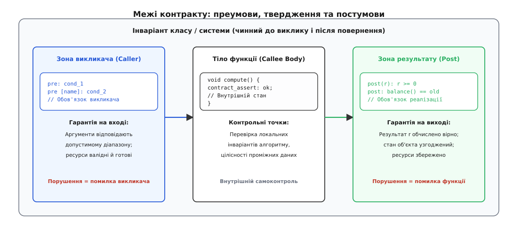
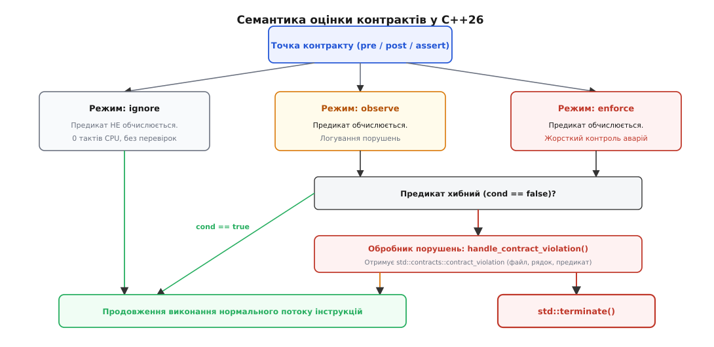
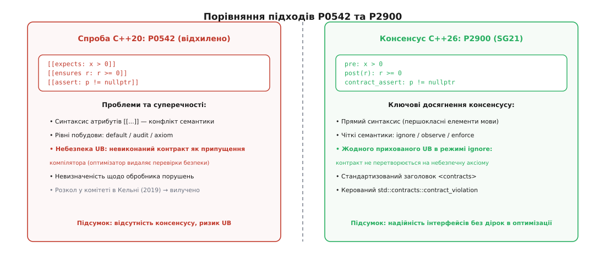

# Контракти в C++: преумови, постумови та інваріанти

<preknowlist>
- [Механізм винятків](topic:sys-plang-cpp/exceptions-mechanism) — кидання, розкрутка стека та ціна винятків під час виконання.
- [Гарантії безпеки винятків](topic:sys-plang-cpp/exception-safety-guarantees) — базова, сильна та nothrow гарантії для стану об'єкта.
- [noexcept](topic:sys-plang-cpp/noexcept) — специфікація винятків та безумовна зупинка програми через `std::terminate`.
- [Коректність за const](topic:sys-plang-cpp/const-correctness) — константність методів і доступ до внутрішнього стану об'єкта.
- [Невизначена поведінка](topic:sf-lang/undefined-behavior) — що дозволено оптимізатору при порушенні фундаментальних правил мови.
- [Твердження та аварійне завершення](topic:sf-apps/assert-panic) — макрос `assert()` і стратегія швидкої відмови при дефектах.
</preknowlist>

Функція обробки цифрового звукового сигналу приймає вказівник на масив семплів `float* samples`, кількість елементів `std::size_t count` та коефіцієнт підсилення `float gain`. Якщо викликач помилково передає нульовий вказівник `nullptr` або від'ємний коефіцієнт підсилення `gain = -1.0f`, алгоритм лінійного масштабування у вкладеному циклі миттєво інвертує фазу сигналу, розповсюджує нечислові значення `NaN` по всьому цифровому тракту або спричиняє апаратне переривання процесора через спробу читання пам'яті за адресою `0x0`.

У класичному коді C++ розробник опиняється перед трьома взаємовиключними та однаково неприйнятними альтернативами. Перевірка через макрос `assert(samples != nullptr)` розміщується всередині тіла функції в файлі `.cpp`, залишаючись абсолютно невидимою для користувача бібліотеки через файл заголовка `.hpp`, а під час релізного збирання з прапорцем `-DNDEBUG` компілятор безслідно видаляє цей макрос. Викидання винятку `throw std::invalid_argument` створює накладні витрати на таблиці розкрутки стека, руйнує детермінізм часу виконання та ламає часові обмеження систем жорсткого реального часу. А текстовий коментар у стилі `// Precondition: samples must not be null` не перевіряється ані компілятором, ані статичними аналізаторами коду.

Контракти усувають цю фундаментальну прірву, перетворюючи неформальні домовленості між компонентами програми на машинозчитувані правила мови безпосередньо в сигнатурах функцій.

---

## Дизайн за контрактом: розподіл відповідальності

Концепція дизайну за контрактом (англ. *Design by Contract*, DbC) розглядає взаємодію між будь-якими двома програмними компонентами як юридично зобов'язувальний договір між клієнтом (викликачем) та постачальником послуги (функцією або методом).

У математичній логіці Чарльза Ентоні Річарда Гоара коректність обчислювального блоку записується трійкою Гоара:
```
{P} C {Q}
```
де `P` — це передумова, що має виконуватися перед початком дії, `C` — безпосередньо виконувана команда або тіло алгоритму, а `Q` — гарантована постумова після завершення дії.

Будь-яка надійна контрактна система в програмуванні спирається на три взаємопов'язані поняття:

1. **Преумова (Precondition):** зобов'язання, яке викликач гарантує виконати перед передачею керування у функцію. Якщо вхідні аргументи або стан глобальної системи не відповідають преумові, вина за збій однозначно лежить на боці викликача.
2. **Постумова (Postcondition):** зобов'язання, яке функція гарантує виконати перед поверненням результату, за умови, що клієнт сумлінно дотримався всіх преумов. Якщо постумова виявляється хибною, дефект криється у внутрішній логіці самої функції.
3. **Інваріант (Invariant):** твердження про цілісність внутрішньої структури даних, яке залишається істинним у будь-якому стабільному спостережуваному стані об'єкта. Інваріант зобов'язаний виконуватися до початку будь-якої відкритої операції класу та після її успішного завершення.



*Контракт встановлює сувору межу відповідальності: преумови перевіряють вхідні дані викликача, постумови гарантують результат функції, а інваріанти охороняють стабільний стан об'єкта.*

Головна архітектурна перевага контрактів полягає в точній локалізації дефектів. Коли програма зазнає аварії або сигналізує про помилку в середовищі з контрактами, система миттєво вказує, яка саме сторона порушила домовленості. Це усуває ситуації, коли невалідний аргумент проходить крізь десятки проміжних шарів абстракції та руйнує пам'ять у випадковому модулі через кілька хвилин після фактичного виникнення бага.

Тривалий і драматичний шлях стандартизації цієї концепції в робочій групі ISO C++ детально розбирає [історія боротьби за контракти від C++20 до C++26](topic:sys-plang-cpp/contracts/hist-contracts-evolution.md).

---

## Чому наявних механізмів мови C++ було недостатньо

До появи контрактів C++ надавав розробникам широкий спектр інструментів перевірки, проте жоден із них не розв'язував задачу специфікації динамічних інтерфейсних меж:

- **Статичні твердження (`static_assert`):** обчислюються виключно на етапі компіляції. Вони ідеально підходять для перевірки розмірів типів або параметрів шаблонів (`sizeof(T) == 8`), але принципово безсилі перед значеннями аргументів, які надходять під час роботи програми від користувача або мережі.
- **Концепти (`concepts` та вирази `requires`):** верифікують синтаксичні властивості типів (чи має тип метод `.size()`, чи є він копійованим). Концепти відповідають за коректність типів під час інстанціювання шаблонів, але не здатні перевірити, чи є значення `.size() > 0` для конкретного екземпляра під час виконання.
- **Макрос `assert()`:** розміщується в середині тіла функції. Він не є частиною сигнатури, не експортується в модулях C++20, не має доступу до повертаного значення функції та повністю вимикається прапорцем `-DNDEBUG`, що робить його марним для захисту релізних збірок.
- **Винятки (`throw`):** призначені для обробки непередбачуваних зовнішніх збоїв середовища (відсутній файл, переповнений диск, розрив мережевого з'єднання). Використання винятків для ловлі програмних помилок розробника (bug catching) є антипаттерном: воно створює важкі накладні витрати на таблиці розгортання стека та змушує клієнта писати зайві блоки `catch` для ситуацій, які взагалі не повинні виникати в коректній програмі.
- **Атрибути оптимізації (`[[nodiscard]]`, `[[assume]]`):** мають вузьку спеціалізацію і не надають комплексного механізму перевірки передумов, результатів та інваріантів з керованою реакцією на збої.

Контракти заповнюють цю прогалину, надаючи стандартизовану мову опису семантичних меж для функцій та класів.

---

## Синтаксис контрактів у C++26: стандарт P2900

У стандарті C++26 (на базі консенсусного документа P2900 «Contracts for C++») контракти стали повноправними конструкціями ядра мови, відмовившись від перевантаженого синтаксису атрибутів із подвійними квадратними дужками `[[...]]`.

У граматику мови введено три контрактні специфікатори:
- `pre` — преумова функції;
- `post` — постумова функції;
- `contract_assert` — внутрішнє твердження в тілі блоку інструкцій.

### Оголошення преумов (`pre`)

Преумови записуються безпосередньо в сигнатурі функції після списку параметрів, усіх кваліфікаторів (`const`, `volatile`, посилань `&`/`&&`) та специфікатора винятків `noexcept`:

```cpp
void set_playback_volume(float volume) noexcept
    pre: volume >= 0.0f && volume <= 1.0f;
```

Якщо функція має складний набір обмежень, дозволено вказувати кілька преумов послідовно. Кожній преумові можна надати символічну мітку або коментар у квадратних дужках `[name]`:

```cpp
float calculate_audio_power(const float* buffer, std::size_t size) noexcept
    pre [valid_pointer]: buffer != nullptr
    pre [non_empty_range]: size > 0;
```

Коли функція має кілька специфікаторів `pre`, компілятор обчислює їх строго зліва направо в порядку оголошення. Перша ж умова, яка дає логічний результат `false`, зупиняє подальші перевірки та активує механізм порушення. Це забезпечує безпеку так званого короткого замикання (short-circuit evaluation): у наведеному вище прикладі перевірка `size > 0` не буде виконуватися, якщо перша умова виявила нульовий вказівник `buffer`.

---

### Оголошення постумов (`post`) та доступ до результату

Постумова описує стан системи та значення, яке повертає функція в разі успішного завершення. Для перевірки обчисленого результату використовується спеціальний синтаксис зв'язування ідентифікатора в круглих дужках `post(identifier)`:

```cpp
int integer_square_root(int n) noexcept
    pre [positive_input]: n >= 0
    post(result): result >= 0 && (result * result <= n) && ((result + 1) * (result + 1) > n)
{
    int r = 0;
    while ((r + 1) * (r + 1) <= n) {
        ++r;
    }
    return r;
}
```

У цьому прикладі ідентифікатор `result` у виразі постумови автоматично зв'язується з константним посиланням на значення, яке функція повертає через інструкцію `return`.

Правила роботи з постумовами мають строгі обмеження:
1. **Функції типу `void`:** якщо функція нічого не повертає, круглі дужки з ідентифікатором результату не вказуються — використовується форма `post: condition`.
2. **Винятки та аварійні виходи:** якщо функція завершує своє виконання генерацією винятку (stack unwinding), звичайні постумови `post` **не обчислюються**, оскільки функція не змогла успішно сформувати кінцевий результат.
3. **Обчислення видозмінених аргументів:** якщо параметр функції було передано за значенням і модифіковано всередині тіла функції (наприклад, лічильник зменшено в циклі `n--`), вираз постумови бачить цей аргумент у його **фінальному стані** на момент виходу з функції. Якщо розробнику потрібно порівняти результат із початковим значенням аргументу, його зберігають у локальну константу на початку тіла або використовують майбутні контрактні розширення захоплення старих значень (`old`).

---

### Внутрішні твердження коду (`contract_assert`)

Специфікатор `contract_assert` призначений для перевірки локальних інваріантів алгоритму безпосередньо у внутрішніх точках тіла функції. Він є повноправною інструкцією (statement) мови C++26:

```cpp
void binary_search_step(std::span<const int> sorted_data, int target) {
    std::size_t low = 0;
    std::size_t high = sorted_data.size();

    while (low < high) {
        std::size_t mid = low + (high - low) / 2;

        contract_assert [valid_midpoint]: mid >= low && mid < high;

        if (sorted_data[mid] < target) {
            low = mid + 1;
        } else {
            high = mid;
        }
    }
}
```

На відміну від застарілого макроса `assert()`, `contract_assert` підпорядковується правилам областей видимості та просторів імен, бере участь у шаблонах та інтегрується зі стандартизованим середовищем виконання обробки порушень.

Повний перелік типів, сигнатур та структур службового заголовного файлу наведено у вставці [інтерфейс підтримки контрактів та заголовка `<contracts>`](topic:sys-plang-cpp/contracts/api-contracts.md).

---

## Інваріанти класів та захист стану об'єкта

Інваріант класу — це фундаментальна характеристика об'єктно-орієнтованого проектування, яка визначає сукупність усіх допустимих внутрішніх станів об'єкта.

Хоча стандарт C++26 фокусується на контрактах функцій (`pre` та `post`), інваріанти класів природно реалізуються через комбінацію преумов та постумов у кожному відкритому методі.

Розглянемо клас банківського рахунку:
- **Інваріант:** баланс рахунку ніколи не може бути від'ємним (`balance_ >= 0`), а унікальний ідентифікатор рахунку завжди більший за нуль (`id_ > 0`).

```cpp
class BankAccount {
private:
    int id_{0};
    int balance_{0};

    [[nodiscard]] bool check_class_invariant() const noexcept {
        return id_ > 0 && balance_ >= 0;
    }

public:
    explicit BankAccount(int id, int initial_deposit) noexcept
        pre [valid_id]: id > 0
        pre [valid_deposit]: initial_deposit >= 0
        post: check_class_invariant()
        : id_(id), balance_(initial_deposit) {}

    void deposit(int amount) noexcept
        pre: check_class_invariant()
        pre [positive_amount]: amount > 0
        post: check_class_invariant()
    {
        balance_ += amount;
    }

    void withdraw(int amount) noexcept
        pre: check_class_invariant()
        pre [sufficient_funds]: amount > 0 && amount <= balance_
        post: check_class_invariant()
    {
        balance_ -= amount;
    }

    [[nodiscard]] int balance() const noexcept
        pre: check_class_invariant()
        post(b): b == balance_ && check_class_invariant()
    {
        return balance_;
    }
};
```

У такій моделі:
- Конструктор приймає на себе зобов'язання перетворити сиру пам'ять на об'єкт, що задовольняє інваріант (`post: check_class_invariant()`).
- Кожен відкритий метод-мутатор перевіряє інваріант на вході та гарантує його відновлення на виході.
- Закриті службові методи (`private helper methods`) не зобов'язані містити такі контракти, оскільки вони можуть тимчасово переводити об'єкт у транзитний незбалансований стан під час складних внутрішніх перетворень.

---

## Покрокова модель виконання та життєвий цикл виклику функції з контрактами

Щоб чітко уявити, як контракти взаємодіють із машинним кодом, розглянемо повний життєвий цикл одного виклику функції `process(arg)` у середовищі з увімкненими контрактами:

1. **Обчислення аргументів викликачем:** Викликач обчислює вирази фактичних аргументів на своєму боці стека.
2. **Пролог преумов (Precondition Evaluation):** Перед виконанням першої інструкції тіла функції середовище обчислює вирази `pre`. Якщо перевірка не проходить, керування негайно передається в `handle_contract_violation`. Тіло функції навіть не починає виконуватися.
3. **Виконання тіла алгоритму:** Виконуються інструкції тіла функції. Якщо потік виконання натрапляє на `contract_assert`, умова обчислюється локально.
4. **Формування повертаного значення:** Коли функція досягає інструкції `return expr;`, вираз `expr` обчислюється і тимчасово матеріалізується в регістрі або на верхівці стека.
5. **Епілог постумов (Postcondition Evaluation):** Виконується обчислення виразів `post`. Якщо постумова використовує зв'язування `post(r)`, ідентифікатор `r` посилається на щойно сформоване повертане значення. Якщо перевірка падає, викликається обробник порушень.
6. **Повернення керування:** Якщо всі постумови успішні, значення остаточно передається викликачеві, а локальний фрейм стека знищується.

Якщо на етапі 3 виникає необроблений виняток C++, потік переривається: епілог постумов (етап 5) повністю пропускається, і активується стандартний механізм розкрутки стека.

---

## Чистота контрактних предикатів та заборона побічних ефектів

Фундаментальним інженерним правилом контрактного програмування є **чистота предикатів** (referential transparency). Предикат контракту зобов'язаний бути математичним спостереженням, а не дією.

### Чому побічні ефекти в контрактах руйнують програму:
Припустимо, розробник написав преумову з побічним ефектом (модифікацією змінної):
```cpp
// НЕБЕЗПЕЧНИЙ АНТИПАТТЕРН: предикат змінює глобальний стан
void send_packet(Packet* p)
    pre: ++g_packet_counter < 1000 && p != nullptr;
```

Що станеться при зміні конфігурації компілятора:
- У тестовій збірці з режимом `enforce` або `observe` предикат обчислюється, і лічильник `g_packet_counter` збільшується на одиницю при кожному виклику.
- У релізній збірці з режимом `ignore` компілятор повністю вимикає генерацію коду преумови. Лічильник `g_packet_counter` **перестає інкрементуватися взагалі**.
- Програма починає поводитися по-різному залежно від прапорців компіляції. Виникає класичний «гейзенбаг» (Heisenbug) — помилка, яка зникає під час спроби її налагодження.

### Правила написання безпечних предикатів:
1. Викликати в контрактах виключно константні методи (`const noexcept`).
2. Не модифікувати глобальні змінні, локальні статичні об'єкти та поля класу.
3. Не виконувати операцій введення-виведення (I/O, читання файлів, мережеві сокети).
4. Використовувати чисті допоміжні функції з атрибутом `[[nodiscard]]`.

---

## Групи контрактів та обчислювальна складність: Default проти Audit

Контрактні перевірки мають різну обчислювальну складність:
- **Легкі перевірки `O(1)`:** перевірка покажчика на `nullptr`, діапазону індексу масиву, прапорця стану. Вони вимагають кількох машинних інструкцій і практично непомітні у профілювальнику.
- **Важкі перевірки `O(N)` або `O(N log N)`:** перевірка відсортованості великого вектора, перевірка збалансованості червоно-чорного дерева чи відсутності циклів у графі. Якщо виконувати таку перевірку на кожному виклику методу, продуктивність алгоритму деградує на порядки.

Для вирішення цієї проблеми інструменти компіляції C++26 підтримують поділ контрактів на семантичні групи:
- **Стандартна група (Default):** швидкі перевірки `O(1)`, які залишаються активними навіть у проміжних збірках.
- **Група аудиту (Audit):** важкі діагностичні перевірки, які вмикаються виключно в спеціальних конфігураціях нічного тестування:

```cpp
template <typename T>
void insert_into_sorted_vector(std::vector<T>& vec, const T& val)
    pre [audit_is_sorted]: std::is_sorted(vec.begin(), vec.end())
    post [audit_still_sorted]: std::is_sorted(vec.begin(), vec.end());
```

---

## Двійковий інтерфейс (ABI) та динамічні бібліотеки

Стандарт C++26 гарантує повну сумісність двійкового інтерфейсу (ABI) між модулями, скомпільованими з різними семантиками контрактів:

1. **Стабільність манглування імен:** Наявність або відсутність контрактних предикатів не змінює сигнатуру функції в таблиці символів (`mangled name`). Бібліотека, скомпільована з режимом `enforce`, лінкується з виконуваним файлом у режимі `ignore` без конфліктів символів.
2. **Пролог на боці сервера (Callee-side check):** Для функцій із зовнішнім зв'язуванням код перевірки преумов розміщується всередині тіла самої функції в динамічній бібліотеці (`.so` / `.dll`). Якщо сторонній клієнт викликає функцію бібліотеки з порушенням преумови, бібліотека самостійно перехопить помилку через свій внутрішній пролог, незалежно від того, як було скомпільовано клієнтську програму.

---

## Віртуальні функції, успадкування та принцип Лісков

Під час використання контрактів у поліморфних класах із віртуальними методами вступають у дію фундаментальні правила принципу підстановки Лісков (Liskov Substitution Principle, LSP):

1. **Контраваріантність преумов (послаблення вимог):** похідний клас не має права вимагати від клієнта більше, ніж базовий клас. Якщо базовий клас дозволяє викликати функцію з будь-яким `x > 0`, нащадок не може посилити преумову до `x > 10`. Нащадок може лише послабити вимогу (наприклад, дозволити `x >= 0`).
2. **Коваріантність постумов (посилення гарантій):** похідний клас не має права гарантувати клієнтові менше, ніж обіцяв базовий клас. Якщо базовий клас гарантує `r != nullptr`, нащадок не може повернути `nullptr`. Нащадок може лише надати додаткові, більш суворі гарантії.

У C++26, якщо віртуальна функція перевизначається в похідному класі за допомогою специфікатора `override` без явного дублювання контрактів, вона автоматично успадковує преумови та постумови свого базового методу. Це запобігає випадковому розходженню контрактних зобов'язань у глибоких ієрархіях успадкування.

---

## Семантика оцінки контрактів (Evaluation Semantics)

Головна інженерна проблема будь-якої системи перевірки правильності коду — це ціна перевірок у виробничому середовищі (production). Перевірка складних інваріантів або обхід дерева пошуку на кожному кроці може сповільнити критичний цикл у десятки разів.

Стандарт C++26 розв'язує цю задачу через суворий поділ між **декларацією контракту** у вихідному коді та **семантикою його оцінки** (англ. *evaluation semantics*) під час компіляції.



*Три режими оцінки контракту визначають долю програми: нульова вартість в ignore, збір телеметрії без падінь в observe та миттєва зупинка через std::terminate в enforce.*

Стандарт визначає три фундаментальні режими оцінки:

### 1. Режим `ignore` (ігнорування)
У цьому режимі контрактні специфікатори не генерують жодної машинної інструкції у скомпільованому бінарному файлі.
- Накладні витрати на виконання процесором: **строго 0 тактів**.
- Збільшення розміру коду: **0 байтів**.
- Застосування: високонавантажені релізні білди, модулі ядра ОС, критичні затримки обробки сигналів.

### 2. Режим `observe` (спостереження)
У цьому режимі компілятор генерує код для обчислення виразу предиката.
- Якщо умова повертає `true`, програма продовжує виконання в нормальному темпі.
- Якщо умова повертає `false` або породжує виняток, середовище виконання викликає встановлений користувачем обробник порушень `handle_contract_violation`.
- **Після завершення обробника потік керування повертається в програму, і виконання продовжується далі.**
- Застосування: інтеграційне тестування, стрес-тести на стабільність, канареечні релізи (canary deployments) та збір телеметрії на живих серверах.

### 3. Режим `enforce` (примусове дотримання)
У цьому режимі компілятор генерує код повної перевірки умов.
- Якщо умова повертає `false` або породжує виняток, середовище виконання викликає обробник порушень `handle_contract_violation`.
- **Після повернення з обробника система виконання негайно викликає `std::terminate()`.**
- Програма миттєво аварійно зупиняється без розкрутки стека (stack unwinding), унеможливлюючи подальше пошкодження файлів чи пам'яті.
- Застосування: тестові збірки (debug/sanitizer builds), медичне обладнання, авіоніка, фінансові транзакції.

---

## Контракти в асинхронних корутинах та лямбда-виразах

Контрактна модель C++26 повністю інтегрована з функціональними та асинхронними можливостями мови.

### Контракти в лямбда-виразах
Анонімні замикання підтримують преумови та постумови безпосередньо у своєму деклараторі:
```cpp
auto clamp_gain = [](float g) noexcept
    pre [gain_range]: g >= 0.0f && g <= 10.0f
    post(res): res >= 0.0f && res <= 1.0f
{
    return std::min(g, 1.0f);
};
```
У контрактах лямбди доступні як формальні параметри замикання, так і всі явно або неявно захоплені змінні із зовнішнього контексту.

### Контракти в корутинах C++20/26 (`co_await`, `co_yield`, `co_return`)
Для функцій-корутин стандарт встановлює суворий регламент послідовності обчислень:
- **Преумови (`pre`):** перевіряються в момент первинного виклику корутини **до** виділення динамічної пам'яті під фрейм корутини (coroutine frame allocation) та конструювання об'єкта обіцянки (`promise_type`). Якщо преумова порушена, операція виділення пам'яті на купі скасовується, запобігаючи витоку системних ресурсів.
- **Постумови (`post`):** обчислюються під час остаточного завершення корутини через інструкцію `co_return`. Проміжні призупинення потоку через `co_yield` або точки очікування `co_await` не активують перевірку фінальних постумов, оскільки корутина зберігає проміжний стан.

### Контракти в шаблонах та узагальненому коді
У шаблонних функціях предикати контрактів інстанціюються разом із тілом шаблону. Якщо вираз предиката є невалідним для конкретного типу `T`, компілятор генерує помилку заміщення (substitution failure). Поєднання контрактів із концептами C++20 дозволяє будувати надійні узагальнені структури даних із формально доведеними гарантіями коректності.

---

## Обробник порушень та клас `std::contracts::contract_violation`

Коли контракт порушується в режимах `observe` або `enforce`, система виконання створює об'єкт метаданих `std::contracts::contract_violation` і передає його до глобальної функції-обробника:

```cpp
void handle_contract_violation(const std::contracts::contract_violation& violation) noexcept;
```

Клас `contract_violation` надає вичерпну інформацію про природу та місце виникнення дефекту через методи-аксесори:

```cpp
#include <contracts>
#include <cstdio>

void handle_contract_violation(const std::contracts::contract_violation& v) noexcept {
    const char* kind_name = "невідомий";
    switch (v.kind()) {
        case std::contracts::contract_kind::pre:    kind_name = "ПРЕУМОВА"; break;
        case std::contracts::contract_kind::post:   kind_name = "ПОСТУМОВА"; break;
        case std::contracts::contract_kind::assert: kind_name = "ТВЕРДЖЕННЯ"; break;
    }

    std::fprintf(stderr,
        "[АВАРІЯ КОНТРАКТУ]\n"
        "  Файл:      %s (рядок %u)\n"
        "  Функція:   %s\n"
        "  Категорія: %s\n"
        "  Мітка:     %s\n"
        "  Предикат:  %s\n",
        v.file_name(),
        static_cast<unsigned int>(v.line_number()),
        v.function_name(),
        kind_name,
        v.comment()[0] != '\0' ? v.comment() : "<немає>",
        v.predicate()
    );
}
```

### Залізні обмеження безпеки обробника
1. **Заборона викидання винятків:** обробник порушень зобов'язаний мати специфікатор `noexcept`. Спроба викинути виняток призводить до негайної активації `std::terminate()`. Контрактне порушення — це дефект у коді, а не виняткова ситуація, яку можна нейтралізувати блоком `catch`.
2. **Захист від рекурсивного зациклення:** якщо сам код обробника порушить контракт або викличе функцію з порушеною преумовою, система виконання розпізнає повторний вхід і миттєво завершить процес без повторного виклику `handle_contract_violation`.

---

## Контракти, оптимізації компілятора та недопущення UB

Найбільш суперечливим питанням в історії контрактів C++ було питання: **чи має право компілятор використовувати умови контрактів як аксіоми для оптимізації коду?**

Припустимо, функція має преумову:
```cpp
void write_data(int* ptr, int value)
    pre: ptr != nullptr
{
    if (ptr == nullptr) {
        log_security_alert("Виявлено спробу атаки з нульовим покажчиком");
        return;
    }
    *ptr = value;
}
```

Якщо компілятор скомпільовано в режимі `ignore` (перевірка преумови на вході відсутня), але оптимізатору дозволено вважати, що преумова `ptr != nullptr` завжди істинна:
1. Оптимізатор бачить умову `if (ptr == nullptr)`.
2. Знаючи, що `ptr` "за контрактом не може бути null", оптимізатор доходить висновку, що ця гілка є мертвою і недосяжною.
3. Компілятор **повністю видаляє** перевірку безпеки та виклик `log_security_alert` із машинних інструкцій.
4. Якщо викликач передасть `nullptr`, програма виконає прямий запис у нульову адресу, спричинивши крах або відкривши вразливість для виконання довільного коду.

Такий підхід перетворював будь-який відключений контракт на приховану невизначену поведінку (Undefined Behavior, UB).



*C++20 дозволяв оптимізатору створювати UB з відключених контрактів, тоді як C++26 гарантує ізоляцію перевірок від спекулятивного видалення захисного коду.*

### Рішення C++26: суворий захист від небезпечного UB
Стандарт C++26 у документі P2900 встановив чітке правило:
**У режимі `ignore` невиконаний контракт НЕ вважається невизначеною поведінкою (UB) для оптимізатора.**

Компілятору заборонено спекулятивно видаляти подальші перевірки або припускати, що хибний предикат є істинним. Контракти в C++26 є інструментом захисту цілісності, перевірки та діагностики програм, а не небезпечним важелем для ризикованих асемблерних оптимізацій.

> 🔧 **Навіщо це.** У великих промислових кодових базах із мільйонами рядків коду неможливо гарантувати відсутність жодної логічної помилки. Якщо відключення контрактів у релізі створює нові дірки через агресивну оптимізацію, інженери просто перестають писати контракти. Гарантія відсутності прихованого UB повертає довіру до контрактного програмування.

Практичну побудову захищеного контейнера розбирає [приклад побудови надійного кільцевого буфера](topic:sys-plang-cpp/contracts/proj-bounded-buffer.md).

---

## Контракти в константних виразах (`constexpr`)

Контракти C++26 діють не лише під час роботи скомпільованого бінарного коду в пам'яті, але й під час обчислення константних виразів на етапі компіляції (`constexpr` та `consteval` контексти).

Якщо функція з контрактом виконується компілятором під час трансляції:
1. Преумови та постумови обчислюються як обов'язкова частина інтерпретації константного виразу.
2. Якщо умова контракту виявляється хибною, компілятор трактує це як неможливість обчислення константного значення і **зупиняє збирання з помилкою компіляції**.
3. Компілятор генерує зрозуміле діагностичне повідомлення, де вказує точні значення константних параметрів, які призвели до порушення.

```cpp
constexpr int compute_factorial(int n) noexcept
    pre [non_negative]: n >= 0
    pre [no_overflow]: n <= 12
    post(r): r >= 1
{
    int result = 1;
    for (int i = 2; i <= n; ++i) {
        result *= i;
    }
    return result;
}

// Успішна компіляція: преумови виконані
constexpr int f5 = compute_factorial(5);

// Помилка компіляції: порушення преумови pre [no_overflow] для n = 15
// static_assert вимагає успішного завершення константного виразу
constexpr int f15 = compute_factorial(15);
```

Завдяки цьому контракти стають універсальним засобом верифікації коду, що працює з однаковою логікою як під час складання програми, так і під час її запуску на кінцевому обладнанні.

---

## Статичний аналіз, формальна верифікація та фазинг-тестування

Машинозчитувані контракти в C++26 стають ключовим інтерфейсом для автоматизованих інструментів верифікації коду:

1. **Символьне виконання (Symbolic Execution):** Статичні аналізатори (Clang Static Analyzer, Coverity, GCC `-fanalyzer`) використовують преумови `pre` як вхідні аксіоми для побудови символьного графа шляхів виконання. Аналізатор здатний математично довести відсутність порушень у клієнтському коді без запуску самої програми.
2. **Фазинг-тестування (Fuzzing Oracles):** Під час автоматизованого фазингу (LLVM libFuzzer, AFL++) обробник `handle_contract_violation` слугує ідеальним оракулом дефектів. Фазер негайно фіксує вхідний мутований вектор даних, який призвів до порушення постумови або інваріанта, знаходячи приховані вразливості на порядки швидше, ніж при звичайному очікуванні краху процесора (Segmentation Fault).
3. **Зв'язок зі статичною рефлексією (C++26 Reflection):** Нові можливості метапрограмування C++26 дозволяють інспектувати контракти на етапі компіляції, що відкриває шлях до автоматичної генерації контрактних фасадів, фазинг-драйверів та клієнтських API-валідаторів без ручного дублювання коду.

---

## Стратегія впровадження контрактів у великих проєктах

Перехід на контрактне програмування в існуючих масштабних кодових базах рекомендується здійснювати поступово за трирівневою моделлю:

1. **Етап 1: Контракти в критичних фундаментальних бібліотеках.**
   Покриття преумовами базових математичних контейнерів, драйверів пам'яті та низькорівневих утиліт. Використання режиму `enforce` у модульних тестах для негайного виявлення некоректних викликів.
2. **Етап 2: Інтеграційний аудит у режимі `observe`.**
   Увімкнення семантики `observe` на нічних збірках та стендах автоматизованого тестування. Збір телеметрії дозволяє виявити приховані порушення контрактів у застарілому коді без аварійного зриву тестових сценаріїв.
3. **Етап 3: Фінальна релізна конфігурація `ignore`.**
   Для бінарних релізів із жорсткими вимогами до тактової частоти вмикається режим `ignore`, що гарантує максимальну продуктивність і нульовий розмір накладного коду.

Контракти C++26 об'єднують строгість формальної логіки, безпеку сучасного інженерного проектування та легендарну ефективність мови C++ в єдину гармонійну систему.
