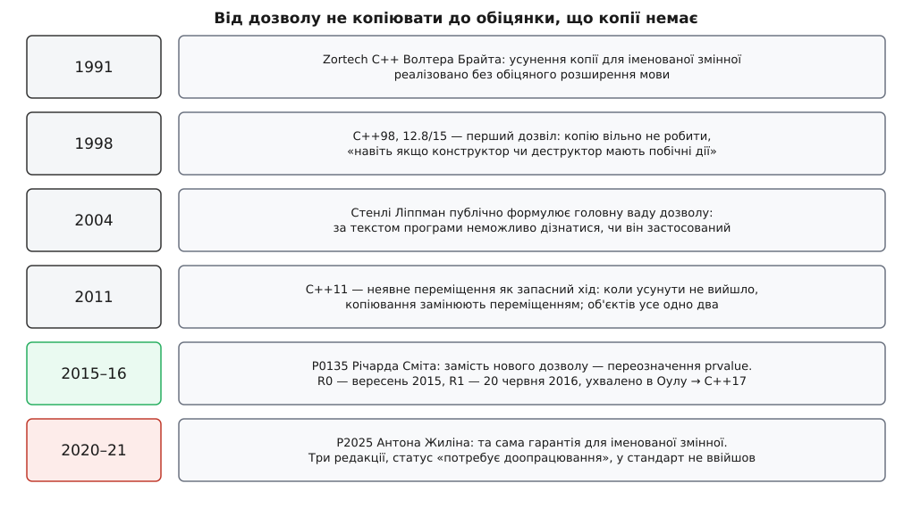

# 📜 Як дозвіл не копіювати став обіцянкою, що копії немає

Майже двадцять років C++ казав компіляторові «ти **можеш** не робити цю копію» — і рівно стільки ж це залишалося єдиною в мові дірою, крізь яку спостережувана поведінка програми законно залежала від того, який компілятор її зібрав. Історія того, як цю діру врешті затулили, цікава не датами, а методом: правильна відповідь знайшлася не там, де її двадцять років шукали, і не в тому вигляді, в якому її просили.


*Хронологія однієї ідеї. Перші чотири щаблі — спроби пом'якшити наслідки того, що усунення копії лишається дозволом; п'ятий прибрав саму потребу усувати; шостий намагався повторити цей успіх для іменованої змінної й досі не завершений.*

### Розширення мови, якого не сталося

Ще до першого стандарту неможливість дешево повернути об'єкт класу з функції вважали слабким місцем C++. Причина суто механічна: функція будує локальний об'єкт у своєму кадрі, а віддати мусить туди, де його чекає той, хто викликав, — тож наприкінці неминуче стоїть виклик конструктора копіювання, який нікому не потрібен.

Майкл Тімен запропонував розв'язати це прямо в мові: дати програмістові синтаксис, щоб **назвати** об'єкт результату. Замість оголошувати локальну змінну й повертати її, ви оголошуєте ім'я самого поверненого значення — і компілятор просто будує все в чужій пам'яті. У GNU C++ це розширення прожило до 2004 року й виглядало так:

```cpp
// розширення GNU C++, вилучене в GCC 3.4
Matrix operator+(const Matrix& a, const Matrix& b) return result;
{
    // немає ні «Matrix result;», ні «return result;»
    // усе, що ви пишете в тіло, іде просто в комірку виклику
}
```

Тімен обґрунтовував потребу в новому синтаксисі сильним твердженням: без такої синтаксичної позначки компілятор нібито не зможе робити цю оптимізацію послідовно. Спільнота не погодилася — суперечку зафіксовано в коментарях до розділу 12 «Анотованого довідкового посібника» Строуструпа й Елліс, — і заперечення довели ділом. За свідченням Стенлі Ліппмана, який сам працював над `cfront`, першим таку оптимізацію для **іменованої** змінної реалізував Волтер Брайт у своєму компіляторі Zortech C++ близько 1991 року, без жодного розширення; згодом те саме зробила Ненсі Вілкінсон у наступному випуску `cfront`. Дві незалежні реалізації — і питання про розширення мови зняли з порядку денного.

Тут і сталася підміна, наслідки якої розгрібали наступні чверть століття. Довели одне: **синтаксична позначка не потрібна, щоб оптимізація була можлива**. А зробили висновок ширший: позначка не потрібна взагалі. Тим часом друга функція тієї позначки — дати програмістові спосіб **дізнатися й вимагати**, що оптимізацію застосовано, — просто зникла разом із нею.

### Дозвіл 1998 року і чому він мусив бути винятком

Коли C++ ставав стандартом, оптимізація вже жила в компіляторах, і її треба було легалізувати. Формально вона незаконна: конструктор копіювання — звичайна функція користувача, вона вільна друкувати, лічити, реєструватися в списках, а [правило «ніби»](topic:sf-lang/as-if-rule) дозволяє переписувати програму лише доти, доки спостережувана поведінка та сама. Викинути виклик такої функції правило не дає.

Тому в C++98 з'явився окремий дозвіл — розділ 12.8 [class.copy], абзац 15. Його суть у трьох рухах, і кожен важливий:

```
1. реалізації ВІЛЬНО не створювати об'єкт із джерела того самого типу —
   навіть якщо конструктор чи деструктор мають побічні дії;
2. джерело й ціль тоді вважаються двома іменами ОДНОГО об'єкта;
3. знищення відбувається в пізнішу з двох точок, де знищилися б обидва.
```

Це єдине місце в мові, де стандарт прямо дозволяє змінити те, що видно ззовні. Формулювання свідомо обережне: воно не каже «копії немає» — воно каже «копію дозволено не виконувати», а решту семантики зберігає недоторканою. Зокрема, конструктор мусить бути **дібраний, доступний і не видалений** — просто його не викличуть.

Ця остання деталь коштувала мові цілого класу API. Фабрика для типу, який не вміє ні копіюватися, ні переміщуватися — м'ютекса, атомарної змінної, обгортки над ресурсом операційної системи, — не компілювалася. Не тому, що там була б копія: її гарантовано не було б. Тому, що дозвіл не виконувати виклик не скасовував вимоги, щоб виклик був можливий.

Другу ваду дозволу найточніше сформулював Ліппман у 2004 році, коли з нього почали питати, чи вміє Visual C++ таку оптимізацію. Його відповідь звучала приблизно так: комітет припустився помилки, бо **за текстом програми неможливо встановити, чи оптимізація застосована**. Наслідок він показав на однорядковому вимірі: у типі, де конструктор копіювання й деструктор перемовляються між собою — лічильник живих об'єктів, реєстрація в списку, — баланс між ними залежить від збірки, а не від коду. Debug і release дають різну кількість викликів, і жоден із результатів не є помилкою компілятора.

### Що змінив C++11 і чого не змінив

Коли в мову прийшло [переміщення](topic:sys-plang-cpp/move-semantics), напрошувалося пом'якшення: якщо усунути копію не вийшло, нехай локальний об'єкт, що ось-ось загине, розберуть на запчастини, а не копіюють. Так і вчинили — правило неявного переміщення додали в C++11 разом із самою семантикою переміщення.

Але подивімося, які саме з трьох болячок це вилікувало.

**Ціна невдачі** — так, впала. Замість побайтового перенесення мільйона чисел лишалося перекидання трьох покажчиків.

**Неможливість фабрики** — ні. Тип, який не рухається, не рухається й переміщенням: `std::mutex` як не повертався за значенням, так і не почав.

**Різниця між збірками** — ні, і навіть погіршилася. Тепер кількість викликів залежала вже не від однієї обставини, а від двох: чи спрацювало усунення, і чи знайшовся конструктор переміщення.

Переміщення зробило невдачу дешевшою — але не зробило її неможливою. А обидві принципові проблеми — неможливість повернути нерухомий тип і залежність спостережуваної поведінки від компілятора — жили далі, бо трималися не на ціні копії, а на самому слові «дозволено».

### Чому не можна було просто написати «тут копія обов'язково усувається»

Найочевидніший хід — замінити в тому абзаці «вільно» на «мусить». Саме він і не працює, і причина не в редакторській лінощі, а в тому, що дозвіл 1998 року **навмисно нічого більше не чіпав**. Він описував один рух — не викликати конструктор — усередині світу, де тимчасовий об'єкт існує. Зробивши цей рух обов'язковим, ви отримуєте обов'язковий пропуск виклику, і ні на йоту не змінюєте всього, що тримається на існуванні того об'єкта.

Довелося б окремо, поіменно, скасовувати кожен наслідок:

- **Вимога дібраного й доступного конструктора.** Вона записана не в правилі про усунення, а в правилах ініціалізації: щоб ініціалізувати об'єкт із виразу того самого типу, компілятор добирає конструктор і перевіряє доступ. «Копія обов'язково усувається» цих правил не торкається — фабрика для `std::mutex` як не компілювалася, так і не почала б.
- **Тотожність об'єктів.** Абзац 15 не каже, що об'єкт один, — він каже, що два об'єкти «вважаються двома іменами одного». Це працює як милиця в простих випадках і розсипається, щойно об'єкт має адресу, яку хтось узяв, зберіг чи порівняв.
- **Момент знищення.** Із тієї самої причини правило мусило окремо диктувати, у котрій із двох точок кличеться деструктор, — інакше з двох «імен» вийшло б два знищення одного об'єкта.
- **Усе, що дотягується до тимчасового ззовні.** Прив'язка посилання до тимчасового з продовженням його життя, масив, який стоїть за `std::initializer_list`, обчислення в сталому виразі — усе це побудоване на припущенні, що тимчасовий об'єкт **є**. Слідів цього припущення в тексті стандарту було стільки, що вони роками спливали як окремі дефекти ядра: CWG 1565 і 1599 (усунення копії й час життя масиву за `initializer_list`), CWG 1590 (обхід конструктора, який не є копіювальним), CWG 1697 (продовження життя й усунення копії), CWG 2022 (усунення копії в сталих виразах).

Ось у чому пастка. Кожен пункт окремо латається — але це п'ять різних правок у п'яти різних місцях, і кожна створює власні крайні випадки. Латання виходило дорожчим за проблему, і мова щоразу поверталася до status quo.

### P0135: прибрати не копію, а об'єкт

Річард Сміт зайшов з іншого боку. У папері P0135R0 від 27 вересня 2015 року він не пропонує жодного нового дозволу — він пропонує **переозначити категорії значень** так, щоб копії просто не було звідки взятися. Формулювання нових означень коротке до зухвалості: glvalue — вираз, обчислення якого дає розташування об'єкта; [prvalue](topic:sys-plang-cpp/value-categories) — вираз, обчислення якого **ініціалізує** об'єкт. Або, як сказано в самому папері: prvalue виконують ініціалізацію, glvalue дають розташування.

З цього все випливає само. Якщо prvalue не позначає об'єкта, а описує ініціалізацію, то `T(args)` не створює тимчасового — воно чекає, доки хтось скаже, **який саме** об'єкт ним ініціалізувати; цей об'єкт паперу знадобилося назвати окремим терміном — *результатний об'єкт* prvalue. Справжній об'єкт з'являється лише там, де prvalue таки потрібне як щось із адресою: коли на нього прив'язують посилання, коли беруть його член, коли перетворюють до базового класу. Це і є матеріалізація тимчасового — і тепер вона перелічена вичерпним списком контекстів, а не мається на увазі всюди.

Ініціалізація змінної тим самим типом до цього списку не входить. Тому в `T x = T(args);` тимчасовий не матеріалізується взагалі: результатним об'єктом prvalue стає `x`. Усувати нема чого — і всі п'ять пунктів попереднього розділу відпадають без жодної окремої правки. Конструктор не добирається, бо ініціалізації з іншого об'єкта немає. Питання про тотожність не виникає, бо об'єкт один. Питання про момент знищення не виникає з тієї самої причини. А дефекти ядра, що роками висіли навколо тимчасових, паперові вдалося закрити заразом — саме тому в його списку стоять і 1565, і 1590, і 1599, і 1697, і частково 2022.

Мотивацію Сміт перелічив чотирма пунктами, і жоден із них не про красу означень. Мова вимагає від типу конструктора копіювання чи переміщення навіть тоді, коли і програміст, і компілятор згодні, що його ніколи не викличуть, — тож фабрику для нерухомого типу доводиться підміняти динамічним виділенням. Різниця між усуненням і переміщенням не завжди мізерна, надто для великих об'єктів, а переносний код не може розраховувати, що усунення станеться, — і люди повертаються до вихідних параметрів. Стиль «майже завжди `auto`» ламається на нерухомих типах. І останнє, найзагальніше: коли семантика виконання віддана на розсуд реалізації, це шкодить переносності й здатності міркувати про код — той самий докір, який Ліппман висловив за одинадцять років до того.

Нормативне формулювання вийшло в P0135R1 20 червня 2016 року — за кілька днів до літньої зустрічі комітету в Оулу, де його й ухвалили до C++17. Герб Саттер підсумував результат у звіті з зустрічі одним реченням: у багатьох випадках мова тепер каже, що ви копіюєте один раз, тобто компіляторові **заборонено** робити зайву копію, — і усунення копій із оптимізації стало гарантованою можливістю мови.

Технічна назва прижилася невдало. «Гарантоване усунення копій» описує наслідок для програміста, але не механізм: жодного усунення там не відбувається, бо усувати нема чого.

> 🔧 **Навіщо це.** Ця історія має практичне продовження в діагностиці. Якщо ваш компілятор скаржиться на недоступний або видалений конструктор копіювання там, де ви впевнені, що копії немає, — ви дивитеся на реліктову вимогу правил ініціалізації, і майже завжди винен режим `-std=` нижчий за C++17. Гарантія C++17 не має прапорця й не залежить від рівня оптимізації, але вона цілком залежить від версії стандарту.

### Чому іменовану змінну лишили без обіцянки

Сміт виніс NRVO за дужки одразу — у P0135R0 сказано прямо: надійне усунення копії для іменованого об'єкта команда вважає важливою можливістю для міркувань про швидкодію, але випадки, коли воно взагалі можливе, надто тонкі, і **просту гарантію дати важко**.

Причина цієї асиметрії — не в тому, що комітет менше цінує іменовані змінні. Вона в самому методі. P0135 виграв тим, що prvalue не має адреси, поки не матеріалізується, — тому його вільно переозначити, нічого не зламавши. Локальна змінна має адресу з першого рядка: її можна взяти, зберегти в глобальному списку, порівняти з чужим покажчиком, віддати в іншу функцію. Обіцяти, що ця адреса збігається з коміркою результату, означає обіцяти конкретну **розкладку пам'яті**, тобто брати зобов'язання перед [домовленістю про виклик](topic:sf-lang/abi-calling-convention), а не перед семантикою мови.

Спроба все-таки це зробити була, і серйозна. Антон Жилін подав P2025R0 8 січня 2020 року з формулюванням-ядром: якщо усунення копії для поверненої змінної дозволене й **усі** невідкинуті `return` у її потенційній області повертають саме цю змінну — усунення гарантується. Ціль була та сама, що й у Сміта: дозволити взірець «створити, довести до ладу, повернути» для типів, які не копіюються й не переміщуються. Після зустрічі в Празі папір переписали від початку — R1 змінив навіть термін, з «іменованого поверненого об'єкта» на «повернену змінну», і полагодив випадки з `return` у вкладених лямбдах; R2 вийшов 14 березня 2021 року й дописав розділи про явне позначення та про конфлікт із аналізом утечі.

Перешкоди, які довелося визнати в самому папері, і показують, чому цей шлях важчий за попередній:

- **Сталі вирази.** Гарантія міняє поведінку обчислень на етапі компіляції, які спираються на побічні дії саме тієї ініціалізації й того знищення, які пропонується прибрати, — тобто ламає код, що сьогодні компілюється.
- **Тривіально копійовні типи й ABI.** Реалізації сьогодні вільно створити копію при поверненні тривіально копійовного об'єкта, і на цьому побудовані чинні домовленості про виклик. Якщо такий об'єкт зберігає покажчик на самого себе, після повернення покажчик виявиться битим. Заборонити це означало б зламати ABI, тож папір цю щілину свідомо лишає відкритою.
- **Нелокальні міркування.** Розширити гарантію на ширше коло випадків не вийде: щоб дозволити змінній зайняти комірку результату, компілятор мусив би довести, що знищення сусідніх об'єктів можна переставити, — а це аналіз, який виходить за межі однієї функції.

У списку комітету папір позначено як такий, що **потребує доопрацювання**. Три опубліковані редакції, доказова реалізація в компіляторі Circle, робота над четвертою — і жодної версії стандарту з цією гарантією.

Тож поділ, який діє сьогодні, — не про важливість двох випадків, а про те, що з одним із них спрацював трюк із переозначенням, а з другим доводиться писати правило. Безіменне перестало бути оптимізацією тоді, коли перестало бути об'єктом. Іменоване лишилося оптимізацією, бо об'єктом воно є від першого рядка.
