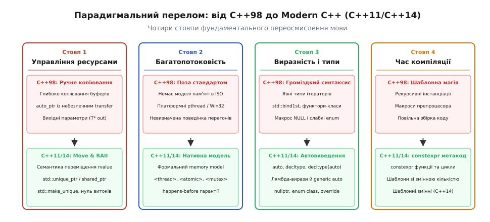
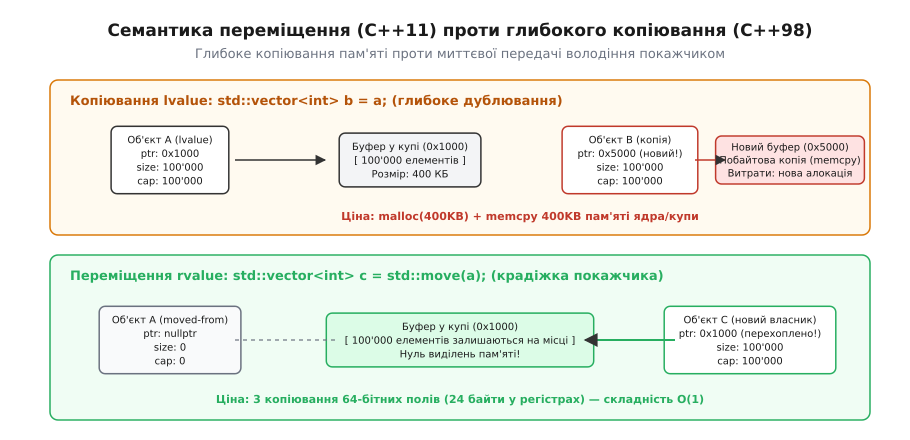
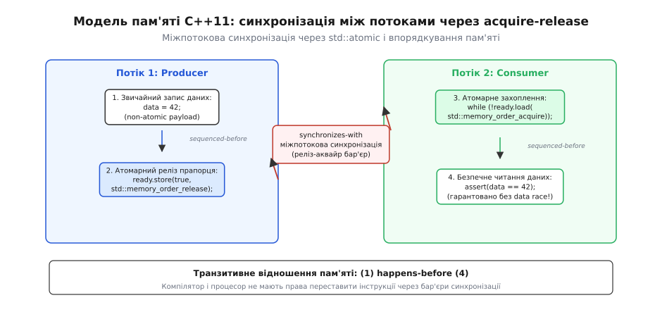
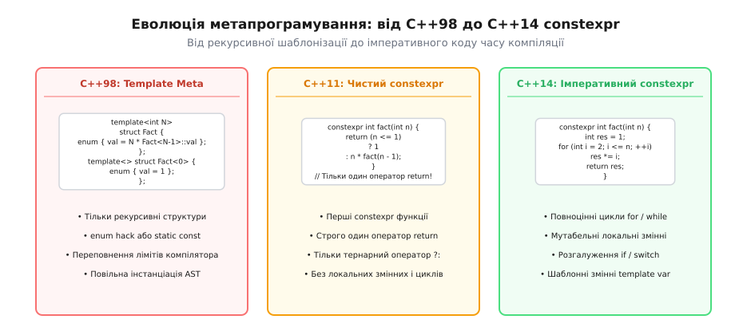

# C++11 і C++14: перелом

<preknowlist>
- [Як робиться стандарт C++: комітет, папери, цикл](topic:sys-plang-cpp/standardization-process) — трирічна модель потягів WG21 та еволюція від C++0x.
- [Категорії значень: lvalue, prvalue, xvalue](topic:sys-plang-cpp/value-categories) — фундаментальний поділ виразів мови на ідентифіковані та тимчасові ресурси.
- [Семантика переміщення і rvalue-посилання](topic:sys-plang-cpp/move-semantics) — механіка передачі володіння ресурсами без виділення пам'яті.
- [Розумний вказівник std::unique_ptr](topic:sys-plang-cpp/unique-ptr) — монопольне володіння динамічними ресурсами на основі RAII.
- [Модель пам'яті C++: атомарність та упорядкування](topic:cpp-standards/memory-model) — концепція data race, бар'єри пам'яті та міжпотокова синхронізація.
</preknowlist>

У кодовій базі стандарту C++98 повернення динамічного масиву розміром у 100 мегабайтів із фабричної функції змушувало інженера обирати між двома неприйнятними компромісами: або передавати об'єкт через вихідний неініціалізований покажчик `void create_data(std::vector<int>* out)`, руйнуючи природний композиційний синтаксис виразів, або отримувати приховане глибоке копіювання пам'яті (виділення нового блоку в купі через `malloc` та побайтове перенесення 100 МБ даних), якщо компілятор не зміг застосувати нестандартизовану оптимізацію RVO (Return Value Optimization). Додавання елементів у стандартний контейнер вимагало створення тимчасових об'єктів із подальшим копіюванням, багатопотокові програми не мали жодних гарантій узгодженості пам'яті на рівні мови, а керування динамічними ресурсами спиралося на небезпечний клас `std::auto_ptr`, копіювання якого непомітно руйнувало вихідний об'єкт.

Публікація стандарту ISO/IEC 14882:2011 (**C++11**) та його наступне доопрацювання в ISO/IEC 14882:2014 (**C++14**) здійснили найрадикальніший перелом у всій історії мови C++, розділивши її еволюцію на «класичну» еру та еру **сучасного C++ (Modern C++)**. Зміни торкнулися не просто розширення стандартної бібліотеки: було повністю перебудовано фундамент ядра мови — систему типів, категорії значень, модель пам'яті та механізми обчислень під час компіляції.



*Чотири стовпи революції Modern C++: від ручного копіювання та відсутності моделі пам'яті до нативного керування ресурсами через переміщення, RAII, потоки та метапрограмування.*

Глибокі передумови тринадцятирічної кризи між релізами, наукові передумови моделі пам'яті та драматичний перехід комітету WG21 від нескінченного очікування до фіксованої моделі потягів висвітлено в нарисі [Історія перелому: як народжувався Modern C++](topic:sys-plang-cpp/cpp11-cpp14/hist-cxx11-cxx14-revolution.md).

## Стовп 1: Семантика переміщення та rvalue-посилання

Головним бар'єром продуктивності C++98 була надлишкова вартість копіювання тимчасових об'єктів. Коли функція повертає складну структуру даних або коли вираз створює проміжний результат, компілятор створює тимчасовий безіменний об'єкт. У C++98 такий об'єкт прив'язувався виключно до константного посилання `const T&`. Оскільки посилання було константним, конструктор копіювання приймача не мав права модифікувати джерело і був зобов'язаний виділити нову пам'ять у купі та продублювати кожен байт.

C++11 запровадив новий примітив системи типів — **rvalue-посилання** (англ. *rvalue reference*), що позначається подвійним амперсандом `T&&`. Воно зв'язується виключно з тимчасовими об'єктами або значеннями, ресурс яких можна безповоротно відчужити (вкрасти).

### Таксономія категорій значень: lvalue, prvalue, xvalue

Щоб строго формалізувати правила переміщення, комітет WG21 переписав таксономію виразів мови, розділивши їх на дві фундаментальні ортогональні властивості:
1. **Наявність ідентичності (identity):** чи має об'єкт фіксовану адресу в оперативній пам'яті, за якою його можна відрізнити від інших об'єктів під час виконання програми.
2. **Можливість переміщення (movability):** чи дозволено перехопити ресурси цього об'єкта, оскільки його життєвий цикл добігає кінця або його значення більше не потрібне програмісту.

На перетині цих властивостей виникли три базові категорії виразів:
- **lvalue (locator value):** має ідентичність і не може бути автоматично переміщений (іменовані змінні, поля класів, розіменовані покажчики, виклики функцій, що повертають `T&`).
- **prvalue (pure rvalue):** не має ідентичності та підлягає переміщенню (літерали на кшталт `42`, тимчасові об'єкти, що створюються при обчисленні виразів `a + b`, виклики функцій, що повертають `T` за значенням).
- **xvalue (expiring value):** має ідентичність, але його ресурси дозволено перемістити (результат приведення до rvalue-посилання `static_cast<T&&>(v)` або виклику `std::move(v)`).

Об'єднання категорій утворює дві практичні групи: **glvalue (generalized lvalue)** = `lvalue` ∪ `xvalue` (все, що має фізичну адресу в пам'яті) та **rvalue** = `prvalue` ∪ `xvalue` (все, з чого дозволено переміщати ресурси).

### Механіка конструктора й оператора переміщення

Завдяки rvalue-посиланням класи отримали дві нові спеціальні функції-члени, які доповнили класичне правило трьох (Rule of Three) до сучасного **Правила п'яти (Rule of Five)**:
- Конструктор переміщення: `MyClass(MyClass&& other) noexcept;`
- Оператор присвоєння з переміщенням: `MyClass& operator=(MyClass&& other) noexcept;`

Замість виділення блоку пам'яті в купі та копіювання корисного навантаження конструктор переміщення копіює лише адресні покажчики та числові поля розміру (24 байти для `std::vector` на 64-бітній платформі), після чого обнуляє покажчик у джерелі (`other.m_data = nullptr`). Складність операції зменшується з лінійної `O(N)` до миттєвої `O(1)`.



*Фізична відмінність у пам'яті: копіювання lvalue змушене виділяти новий блок у купі та дублювати байти, тоді як переміщення rvalue перехоплює покажчик за три регістрові операції O(1).*

```cpp
#include <iostream>
#include <vector>
#include <utility>

class HeavyBuffer {
private:
    size_t m_size;
    int*   m_data;

public:
    // Звичайний конструктор виділення
    explicit HeavyBuffer(size_t size) 
        : m_size(size), m_data(new int[size]) {}

    // Деструктор RAII
    ~HeavyBuffer() {
        delete[] m_data;
    }

    // 1. Конструктор копіювання: глибоке виділення O(N)
    HeavyBuffer(const HeavyBuffer& other) 
        : m_size(other.m_size), m_data(new int[other.m_size]) {
        for (size_t i = 0; i < m_size; ++i) {
            m_data[i] = other.m_data[i];
        }
    }

    // 2. Конструктор переміщення: відчуження ресурсу O(1)
    HeavyBuffer(HeavyBuffer&& other) noexcept 
        : m_size(other.m_size), m_data(other.m_data) {
        // Обнулення вихідного об'єкта: перехід у стан moved-from
        other.m_size = 0;
        other.m_data = nullptr;
    }

    // 3. Оператор присвоєння переміщенням
    HeavyBuffer& operator=(HeavyBuffer&& other) noexcept {
        if (this != &other) {
            delete[] m_data; // Звільнення власного старого ресурсу
            m_size = other.m_size;
            m_data = other.m_data;
            other.m_size = 0;
            other.m_data = nullptr;
        }
        return *this;
    }
};
```

> 🔧 **Навіщо це.** Специфікатор `noexcept` у конструкторах переміщення є критично важливим: стандартні контейнери на кшталт `std::vector` під час перевиділення внутрішнього буфера переміщують елементи лише за умови, що їхній конструктор переміщення гарантує відсутність винятків (`std::is_nothrow_move_constructible`). Якщо `noexcept` пропущено, `std::vector` заради збереження суворої гарантії безпеки винятків (Strong Exception Safety) повернеться до повільного копіювання за допомогою утиліти `std::move_if_noexcept`.

Окрему увагу слід звернути на взаємодію переміщення з оптимізацією малих рядків (Small String Optimization, SSO). Якщо об'єкт `std::string` зберігає короткий рядок (зазвичай до 15 або 22 символів залежно від реалізації стандартної бібліотеки), символи розташовуються безпосередньо всередині буфера на стеку, а не в купі. У такому випадку переміщення рядка фактично виконує побайтове копіювання стекового буфера, що займає ті самі 24 байти, але не виконує звернень до системного алокатора пам'яті.

Правило генерації спеціальних функцій-членів у C++11 стало строгішим: якщо клас оголошує явний користувацький деструктор, конструктор копіювання чи оператор присвоєння, компілятор більше не генерує автоматичні операції переміщення. Розробник повинен явно зазначити їх за допомогою директиви `= default`. На противагу цьому, концепція **Правила нуля (Rule of Zero)** рекомендує проєктувати класи таким чином, щоб вони взагалі не вимагали ручного керування ресурсами, делегуючи володіння готовим типам RAII (`std::unique_ptr`, `std::vector`, `std::string`), завдяки чому всі п'ять спеціальних функцій генеруються компілятором автоматично й коректно.

Крім того, семантика переміщення уможливила появу методів створення елементів на місці — `emplace`, `emplace_back`, `emplace_hint` у всіх послідовних та асоціативних контейнерах STL. Ці методи приймають аргументи конструктора елемента через універсальні посилання і конструюють об'єкт безпосередньо у виділеному слоті пам'яті контейнера через розміщувальний оператор `placement new`, повністю усуваючи необхідність створення та переміщення тимчасових об'єктів.

### Функції `std::move` та `std::forward`

Функція `std::move` насправді нічого не переміщує під час виконання програми. Це суто компіляторне безумовне приведення типу до rvalue-посилання:

```cpp
template<typename T>
constexpr std::remove_reference_t<T>&& move(T&& t) noexcept {
    return static_cast<std::remove_reference_t<T>&&>(t);
}
```

Коли розробник пише `std::move(x)`, він повідомляє компілятору: «Я гарантую, що поточне значення іменованої змінної `x` мені більше не потрібне, її можна розглядати як `xvalue` і перехопити її ресурси».

Функція `std::forward` розв'язує задачу **ідеального прямого передавання** (англ. *perfect forwarding*). Універсальне посилання (англ. *forwarding reference*) виду `T&&` у шаблонах виводить тип як lvalue-посилання `T&`, якщо аргумент був lvalue, і як чистий тип `T`, якщо аргумент був rvalue. За правилами згортання посилань (англ. *reference collapsing*):
- `&` + `&` → `&`
- `&` + `&&` → `&`
- `&&` + `&` → `&`
- `&&` + `&&` → `&&`

Функція `std::forward<T>(arg)` відновлює вихідну категорію значення, дозволяючи фабричним функціям і методам `emplace_back` передавати аргументи конструкторам без зайвих копіювань.

## Стовп 2: Розумні вказівники та нова модель володіння пам'яттю

У C++98 єдиним стандартним розумним покажчиком був `std::auto_ptr`. Його фатальний архітектурний дефект полягав у тому, що за відсутності rvalue-посилань операція копіювання неявно виконувала перенесення володіння. Передача `std::auto_ptr` у функцію за значенням або спроба покласти його у `std::vector` обнуляла вихідний вказівник, що спричиняло аварійні завершення програми під час виконання алгоритмів сортування або копіювання контейнерів.

C++11 остаточно засудив `std::auto_ptr` і ввів строгу ієрархію розумних вказівників із чіткою семантикою володіння (англ. *ownership semantics*):

### Монопольне володіння: `std::unique_ptr`

Клас `std::unique_ptr<T>` реалізує концепцію суворого виключного володіння ресурсом. Конструктор і оператор копіювання в ньому видалені (`= delete`), що гарантує: у системі існує рівно один екземпляр вказівника на конкретний об'єкт.

Вказівник `std::unique_ptr` не має жодних накладних витрат за пам'яттю чи швидкістю: у пам'яті він займає рівно один машинний покажчик (8 байтів на 64-бітній системі), а його деструктор викликає `delete` безпосередньо. Підтримуються користувацькі деструктори (англ. *custom deleters*), що дає змогу загортати системні дескриптори POSIX (`close`), сокети чи покажчики `FILE*` (`fclose`). Завдяки оптимізації порожньої бази (Empty Base Optimization, EBO) безстанні деструктори не збільшують розмір `std::unique_ptr`.

У C++14 з'явилася фабрична функція `std::make_unique<T>(args...)`, яка усунула останню синтаксичну небезпеку виклику оператора `new` та захистила код від витоків пам'яті під час виникнення винятків у аргументах складних функцій.

```cpp
#include <memory>
#include <iostream>

struct Connection {
    int socket_fd;
    Connection(int fd) : socket_fd(fd) { std::cout << "Підключено fd=" << fd << "\n"; }
    ~Connection() { std::cout << "Закрито fd=" << socket_fd << "\n"; }
};

void process_request(std::unique_ptr<Connection> conn) {
    // Володіння передано всередину функції; при виході з'єднання закриється автоматично
}

void demo_unique() {
    // Безпечне створення без явного new (C++14)
    auto conn = std::make_unique<Connection>(42);

    // Помилка компіляції: копіювання заборонено!
    // auto copy_conn = conn; 

    // Явна передача прав володіння через переміщення
    process_request(std::move(conn));

    // Тут conn == nullptr, ресурси вже звільнено
}
```

### Розділене володіння: `std::shared_ptr` та `std::weak_ptr`

Коли час життя об'єкта визначається кількома незалежними підсистемами, використовується `std::shared_ptr<T>`. Він складається з двох покажчиків: покажчика на сам об'єкт `T` та покажчика на спеціальний блок управління (англ. *control block*), який зберігає два атомарних лічильники:
1. **Strong reference count:** кількість активних екземплярів `std::shared_ptr`. Коли цей лічильник досягає нуля, викликається деструктор керованого об'єкта `T` і звільняється пам'ять під корисне навантаження.
2. **Weak reference count:** кількість асоційованих спостерігачів `std::weak_ptr`. Контрольний блок видаляється з пам'яті лише тоді, коли обидва лічильники падають до нуля.

Вказівник `std::weak_ptr<T>` розв'язує проблему циклічних посилань (коли об'єкт А посилається на В, а В — на А, через що лічильники ніколи не досягали нуля і пам'ять витікала). Перед доступом до об'єкта `std::weak_ptr` вимагає виклику методу `.lock()`, який атомарно перевіряє факт існування ресурсу і повертає валідний `std::shared_ptr`.

Цікавою можливістю `std::shared_ptr` є так званий аліасинговий конструктор (Aliasing Constructor) виду `std::shared_ptr<U>(const std::shared_ptr<T>& r, U* ptr)`. Він дозволяє розумному вказівнику керувати життєвим циклом великої структури `T`, але при розіменуванні повертати покажчик на її внутрішнє поле `U*`.

Фабрична функція `std::make_shared<T>` виділяє пам'ять під контрольний блок та сам об'єкт `T` в одному нерозривному блоці пам'яті через один системний виклик алокатора замість двох, що радикально підвищує локальність кешу процесора.

## Стовп 3: Нативна модель пам'яті та багатопотоковість

До C++11 стандарт мови описував поведінку виключно абстрактної однопотокової машини. Якщо два потоки одночасно зверталися до однієї комірки пам'яті і хоча б один із них виконував запис, поведінка з точки зору стандарту взагалі не була визначена, оскільки саме поняття потоку перебувало за межами мови.

Компілятори мали право виконувати агресивні оптимізації (виносити читання змінної з циклу в регістр, переставляти незалежні операції запису місцями, генерувати спекулятивні записи), які ламали міжпотокову взаємодію, навіть якщо розробник використовував платформні функції блокування `pthread_mutex_lock`.

### Формалізація станів перегонів (Data Race)

C++11 вперше ввів строгу математичну **модель пам'яті (Memory Model)**, яка базується на понятті графу відношень виконання:
- **Sequenced-before:** відношення строгого порядку обчислення виразів у межах одного потоку виконання.
- **Synchronizes-with:** міжпотокове відношення узгодження, яке виникає, коли операція релізу (`release` або `unlock`) в одному потоці стає спостережуваною операцією захоплення (`acquire` або `lock`) в іншому потоці.
- **Happens-before:** транзитивне відношення причинно-наслідкового зв'язку. Якщо операція A *happens-before* операції B, то всі модифікації пам'яті, зроблені в А, гарантовано видимі для В.

Стандарт C++11 дав точне визначення: **стан перегонів (Data Race)** виникає тоді, коли два звернення до однієї ділянки пам'яті в різних потоках не зв'язані відношенням *happens-before*, хоча б одне з них є записом, і жодне з них не є атомарним. Будь-який data race є **невизначеною поведінкою (Undefined Behavior)**.



*Міжпотокова синхронізація у моделі пам'яті C++11: атомарні операції утворюють реліз-аквайр бар'єр, який гарантує відсутність перегонів даних без використання важких м'ютексів.*

### Заголовки `<thread>`, `<atomic>` та синхронізація

Стандартна бібліотека C++11 отримала повний набір високорівневих і низькорівневих примітивів паралелізму:
- `<thread>`: представник системного потоку `std::thread`. Обов'язкова вимога завершення життєвого циклу — виклик `.join()` або `.detach()` до знищення об'єкта (інакше деструктор викликає аварійне завершення `std::terminate`).
- `<mutex>`: примітиви взаємного виключення (`std::mutex`, `std::recursive_mutex`) та RAII-обгортки захоплення (`std::lock_guard` для простого блоку і `std::unique_lock` для відкладеного керування). Для запобігання взаємним блокуванням (Deadlocks) при одночасному захопленні кількох м'ютексів додано функцію `std::lock(m1, m2, ...)`, яка використовує алгоритм уникнення циклічних очікувань.
- `<condition_variable>`: механізм умовного блокування потоків із захистом від хибних пробуджень (англ. *spurious wakeups*) через предикатні лямбди.
- `<future>`: абстракції асинхронних результатів `std::future`, `std::promise`, `std::packaged_task` та високорівневий запуск `std::async`.
- `<atomic>`: безблокувальні атомарні типи (`std::atomic<int>`, `std::atomic<bool>`) із можливістю точного вибору порядку доступу до кеш-ліній процесора: `memory_order_relaxed`, `memory_order_acquire`, `memory_order_release`, `memory_order_acq_rel`, `memory_order_seq_cst`.

У C++14 бібліотеку паралелізму було доповнено заголовком `<shared_mutex>`, що надав примітив `std::shared_timed_mutex` для реалізації патерну Reader-Writer Lock (багато паралельних читачів через `std::shared_lock`, один монопольний письменник через `std::unique_lock`).

## Стовп 4: Автоматичне виведення типів, лямбди та функціональний дизайн

Громіздкість синтаксису C++98 змушувала розробників дублювати інформацію про типи. Оголошення комплексних ітераторів або сигнатур покажчиків на методи займало більше місця, ніж сама бізнес-логіка програми.

### Автовиведення типів: `auto`, `decltype` та C++14 `decltype(auto)`

Ключове слово `auto` у C++11 було повністю переосмислено (в C++98 воно позначало застарілий автоматичний клас пам'яті на стеку). Тепер `auto` вказує компілятору вивести тип змінної з типу виразу ініціалізації:
- Правила виведення `auto` повністю збігаються з правилами виведення параметрів шаблонів: воно відкидає посилання `&` та верхній рівень константності `const`.
- Якщо потрібне збереження константності або посилання, розробник вказує їх явно: `const auto& ref = get_data();`.

Ключове слово `decltype(expr)` повертає точний тип виразу без його обчислення під час виконання, повністю зберігаючи всі посилання та специфікатори `const`/`volatile`.

У C++14 механізм автовиведення отримав суттєве поглиблення:
1. **Автоматичне виведення типу повернення звичайних функцій:** функція може бути оголошена як `auto calculate() { return 42; }` без громіздкого trailing return type синтаксису `-> int`.
2. **Специфікатор `decltype(auto)`:** поєднує зручність `auto` з точністю `decltype`. Він виводить тип за правилами `decltype`, що є незамінним під час написання універсальних функцій-обгорток (проксі), які повертають посилання на елементи внутрішніх контейнерів:

```cpp
template<typename Container>
decltype(auto) get_first_element(Container& c) {
    return c.at(0); // Зберігає точний тип повернення at(): посилання T& або const T&
}
```

Слід пам'ятати про важливу відмінність: `decltype(x)` для іменованої змінної `int x` повертає `int`, тоді як `decltype((x))` для виразу в дужках повертає `int&`, оскільки `(x)` є виразом категорії lvalue. Специфікатор `decltype(auto)` точно слідує цим правилам.

### Лямбда-вирази: анонімні функціональні об'єкти

Лямбда-вирази у C++11 надали можливість створювати безіменні замикання безпосередньо в місці їхнього виклику. Синтаксис лямбди складається з чотирьох основних частин:
`[captures](parameters) mutable noexcept -> return_type { body }`

Компілятор транслює кожен лямбда-вираз в унікальну анонімну структуру-функтор із перевантаженим `operator()`. Захоплення змінних (список `[captures]`) визначає поля цієї структури:
- `[=]`: захоплення всіх використовуваних локальних змінних за значенням (створення копій у замиканні).
- `[&]`: захоплення всіх використовуваних локальних змінних за посиланням.
- `[this]`: захоплення покажчика на поточний екземпляр класу.
- `[x, &y]`: вибіркове захоплення змінної `x` за значенням, а `y` — за посиланням.

За замовчуванням `operator()` у згенерованій структурі є константним (`const`). Специфікатор `mutable` дозволяє модифікувати змінні, захоплені за значенням, зберігаючи змінений стан між послідовними викликами того самого екземпляра замикання.

### C++14: Узагальнені лямбди та захоплення з ініціалізацією

Стандарт C++14 усунув два найважливіших обмеження лямбд C++11:

1. **Узагальнені (поліморфні) лямбди (Generic Lambdas):** параметри лямбди можуть бути оголошені як `auto`. Компілятор генерує структуру з шаблонним `operator()`:

```cpp
// C++14 узагальнена лямбда
auto print_pair = [](const auto& first, const auto& second) {
    std::cout << first << " : " << second << "\n";
};

// Еквівалентний клас, згенерований компілятором:
struct __CompilerGeneratedLambda {
    template<typename T1, typename T2>
    auto operator()(const T1& first, const T2& second) const {
        std::cout << first << " : " << second << "\n";
    }
};
```

2. **Захоплення з ініціалізацією (Generalized Lambda Capture / Init-Capture):** дозволяє створювати нові змінні у замиканні та ініціалізувати їх за допомогою виразів переміщення. Це уможливило передачу move-only об'єктів (наприклад, `std::unique_ptr` або сокетів) усередину лямбд:

```cpp
auto task = [ptr = std::make_unique<int>(100)]() {
    std::cout << "Значення: " << *ptr << "\n";
};
```

## Стовп 5: Метапрограмування часу компіляції: `constexpr` та Variadic Templates

До появи C++11 метапрограмування шаблонів (Template Metaprogramming, TMP) базувалося на складних хаках: рекурсивній інстанціації структурних шаблонів, зловживанні неіменованими переліками (`enum { value = ... }`) та макросах препроцесора. Написання найпростішого обчислення факторіала вимагало спеціалізації шаблону для базового випадку, сильно уповільнювало компіляцію та переповнювало ліміти глибини вкладеності AST компілятора.

### Еволюція `constexpr`: від C++11 до C++14

Специфікатор `constexpr` (константний вираз) оголошує функцію або змінну придатною для обчислення безпосередньо під час компіляції програми.

У C++11 на функції `constexpr` діяли суворі обмеження:
- Тіло функції могло містити лише оператори `typedef`, `using`, `static_assert` і **рівно один оператор `return`**.
- Будь-яке розгалуження мало виражатися через тернарний оператор `?:`.
- Цикли були повністю заборонені — обчислення організовувалися виключно через чисту рекурсію.

Стандарт C++14 здійснив революцію, дозволивши повноцінне імперативне програмування всередині `constexpr`:
- Дозволено мутабельні локальні змінні.
- Дозволено стандартні цикли `for`, `while`, `do-while`.
- Дозволено розгалуження `if` та `switch`.
- Функції-члени класів із специфікатором `constexpr` більше не вважаються неявно `const`, що дозволило мутувати стан об'єкта під час обчислень на етапі компіляції.



*Еволюція обчислень часу компіляції: від рекурсивного розгортання типів у C++98 до природного імперативного синтаксису циклів та локальних змінних у C++14.*

```cpp
// C++11 стиль: жорстке обмеження одним return та рекурсією
constexpr int fact_c11(int n) {
    return (n <= 1) ? 1 : n * fact_c11(n - 1);
}

// C++14 стиль: нормальний цикл та локальна змінна
constexpr int fact_c14(int n) {
    int result = 1;
    for (int i = 2; i <= n; ++i) {
        result *= i;
    }
    return result;
}

// Перевірка значення на етапі компіляції (zero runtime cost)
static_assert(fact_c14(5) == 120, "Fact(5) must be 120");
```

### Шаблони змінної кількості аргументів (Variadic Templates)

У C++98 написання функцій із довільною кількістю аргументів вимагало або використання небезпечних макросів C (`va_list` із повною втратою перевірки типів), або генерації десятків перевантажень шаблонів на 1, 2, 3... 10 аргументів.

C++11 запровадив **пакети параметрів шаблону** (англ. *template parameter packs*), що позначаються трьома крапками:
- Пакет типів: `template<typename... Args>`
- Пакет параметрів функції: `void print(Args... args)`
- Оператор розміру пакета: `sizeof...(Args)` (повертає кількість переданих типів під час компіляції).

Розгортання пакетів у C++11 виконувалося через патерн рекурсивного розбиття на «голову» (head) та «хвіст» (tail):

```cpp
#include <iostream>

// Базовий випадок зупинки рекурсії розгортання
void log_all() {
    std::cout << "\n";
}

// Рекурсивний крок: перший аргумент відокремлюється, решта розгортається
template<typename First, typename... Rest>
void log_all(const First& first, const Rest&... rest) {
    std::cout << first << " ";
    log_all(rest...); // Рекурсивний виклик для залишку пакета
}
```

Пакети параметрів можуть розгортатися не лише у викликах функцій, але й у списках ініціалізації масивів, списках базових класів (що дає змогу створювати патерн мульти-успадкування для об'єднання функторів) та у списках аргументів шаблонів.

### Шаблонні змінні C++14 (Variable Templates)

Стандарт C++14 розширив дію шаблонів на змінні. Раніше для параметризації константи розробники мусили загортати її у статичне поле структури `template<typename T> struct Constants { static constexpr T pi = ...; };`. Шаблонні змінні дозволили оголошувати такі константи напряму:

```cpp
template<typename T>
constexpr T pi = T(3.1415926535897932385L);

// Використання з різною точністю
float  pi_f = pi<float>;
double pi_d = pi<double>;
```

## Стовп 6: Чистота синтаксису, безпека та полірування мови

Окрім фундаментальних архітектурних систем, C++11 та C++14 усунули десятки дрібних, але хронічних вад класичного синтаксису C++:

### Уніфікована ініціалізація та захист від звуження типів

C++98 мав щонайменше чотири несумісні форми ініціалізації: круглі дужки `int a(5);`, знак рівності `int b = 5;`, фігурні дужки для C-структур `Point p = {1, 2};` та виклики конструктора базових класів. Крім того, круглі дужки породжували сумнозвісну синтаксичну колізію **Most Vexing Parse**, коли компілятор інтерпретував створення об'єкта `Timer t(Clock());` як оголошення функції `t`, яка приймає вказівник на функцію і повертає `Timer`.

C++11 уніфікував ініціалізацію за допомогою **фігурних дужок `{}`**:
1. **Запобігання звуженню типів (narrowing conversions):** вираз `int x{3.14};` спричиняє помилку компіляції, тоді як класичний `int x = 3.14;` мовчки відкидав дробову частину.
2. **Однозначність створення об'єктів:** запис `Timer t{Clock{}};` гарантовано створює об'єкт і ніколи не парситься як функція.
3. **Клас `std::initializer_list<T>`:** контейнери отримали здатність приймати довільні списки елементів: `std::vector<int> v{1, 2, 3, 4, 5};`.

Слід враховувати важливий крайовий випадок розв'язання перевантажень: якщо клас має конструктор, що приймає `std::initializer_list`, компілятор віддає йому абсолютний пріоритет під час ініціалізації фігурними дужками. Це пояснює різницю між `std::vector<int> v(10, 2)` (створення вектора з 10 елементів зі значенням 2) та `std::vector<int> v{10, 2}` (створення вектора з 2 елементів зі значеннями 10 та 2).

### Літерал `nullptr` та строго типізований нульовий покажчик

У C++98 макрос `NULL` був звичайним цілим числом `0` або виразом `(void*)0`. Це призводило до небезпечних помилок під час розв'язання перевантажень функцій:

```cpp
void handle(int code);
void handle(void* ptr);

handle(NULL);    // У C++98 викликає handle(int)! Помилка проектування.
handle(nullptr); // У C++11 строго викликає handle(void*). Тип std::nullptr_t.
```

### Переліки з областю видимості (`enum class`)

Класичні `enum` у C++ експортували свої імена в зовнішній простір імен і неявно приводилися до цілих чисел `int`. C++11 ввів строгі переліки `enum class`:
- Імена елементів локалізовані: доступ лише через `Color::Red`.
- Відсутнє неявне приведення до `int` (потрібен явний `static_cast`).
- Можливість явного зазначення розміру базового типу: `enum class Flags : uint8_t { ... };`.

### Контекстні ключові слова `override` та `final`

Помилка в сигнатурі віртуальної функції (наприклад, пропущений специфікатор `const` або інший тип аргументу) у C++98 призводила до того, що похідний клас замість заміщення методу створював нову незалежну функцію, а компілятор не видавав жодного попередження.

Специфікатор `override` гарантує: якщо в базовому класі немає ідентичної віртуальної функції, компілятор видасть фатальну помилку. Специфікатор `final` забороняє подальше перевизначення методу або успадкування від класу.

```cpp
class Base {
public:
    virtual void render(int width, int height) const;
};

class Derived : public Base {
public:
    // Помилка компіляції, якщо випадково пропущено const або змінено тип
    void render(int width, int height) const override;
};
```

### Керування генерацією функцій-членів: `= default` та `= delete`

У C++98 для заборони копіювання класу конструктор копіювання оголошували в секції `private` і не писали його реалізацію. Помилка виявлялася лише на етапі лінкування. 

У C++11 конструкції `= default` та `= delete` дають прямий і точний контроль:
- `MyClass(const MyClass&) = delete;` — миттєва та зрозуміла помилка компіляції при спробі копіювання.
- `MyClass() = default;` — вказівка компілятору згенерувати стандартний конструктор за замовчуванням (який не генерується автоматично, якщо додано інший конструктор).

### Керування вирівнюванням пам'яті: `alignas` та `alignof`

Для низькорівневої оптимізації багатопотокових структур даних стандарт C++11 ввів ключові слова `alignas` (задання вирівнювання) та `alignof` (отримання вимог до вирівнювання типу). Це дозволило ефективно боротися з деградацією продуктивності через явище фальшивого спільного використання кеш-ліній (False Sharing), коли два незалежні атомарні лічильники потрапляли в одну 64-байтову кеш-лінію процесора.

### Двійкові літерали, роздільники розрядів і літерали C++14

C++14 додав зручні інструменти для системного та низькорівневого програмування:
- **Двійкові літерали:** префікс `0b` або `0B` (наприклад, `auto mask = 0b1111'0000;`).
- **Роздільник розрядів:** одинарний апостроф `'` у числових константах для покращення читабельності великих чисел: `uint64_t bytes = 1'000'000'000;`, `double val = 3.14159'26535;`.
- **Користувацькі та стандартні літерали (User-Defined Literals):** суфікси стандартної бібліотеки для часу та рядків: `using namespace std::chrono_literals; auto timeout = 250ms; auto str = "hello"s;`.

Вичерпний технічний перелік усіх змінених інтерфейсів, макросів можливостей та депрекацій наведено у документі [Довідник нововведень C++11 та C++14: ядро, STL, макроси та депрекації](topic:sys-plang-cpp/cpp11-cpp14/api-cxx11-cxx14-reference.md).

Практичний приклад комплексної рефакторизації застарілого компонента C++98 у сучасну багатопотокову чергу із нульовим копіюванням розібрано у посібнику [Практика модернізації: переписування підсистеми з C++98 на ідіоматичний C++11/C++14](topic:sys-plang-cpp/cpp11-cpp14/proj-modernizing-cpp98-codebase.md).

## Архітектурний підсумок

Революція C++11 та C++14 врятувала мову C++ від неминучого занепаду під тиском керованих платформ. Об'єднавши строгу типову безпеку, автоматичне виведення типів, виразність функціональних лямбд та нативну багатопотоковість із безкомпромісною продуктивністю семантики переміщення, стандарти C++11/14 заклали непохитний фундамент, на якому розгортається вся подальша еволюція сучасного системного програмування.
