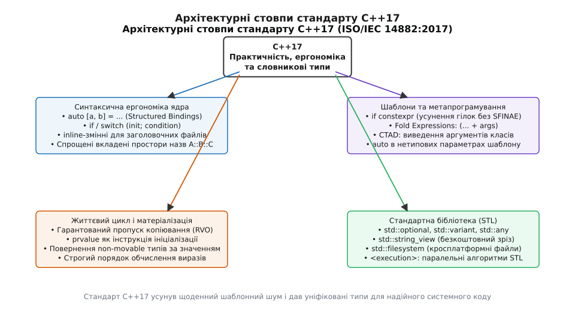
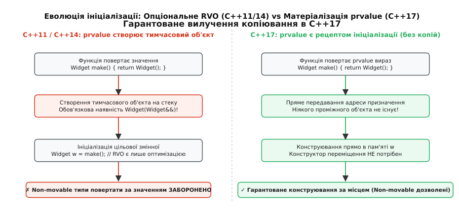
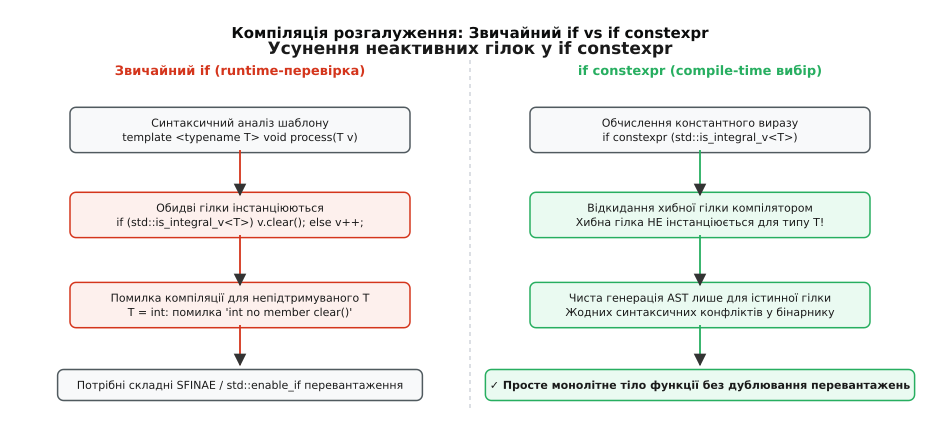
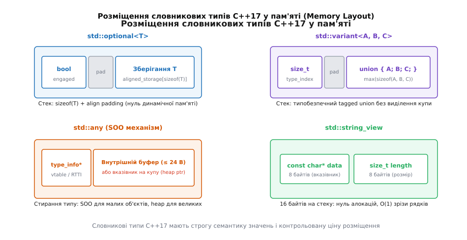

# Що приніс C++17: від шаблонного шаманства до природної ергономіки

<preknowlist>
- [Категорії значень: lvalue, prvalue, xvalue](topic:sys-plang-cpp/value-categories) — що таке prvalue, glvalue та як вирази перетворюються у тимчасові об'єкти.
- [Вилучення копіювання (RVO та NRVO)](topic:sys-plang-cpp/copy-elision) — механізм оптимізації повернення значень із функцій та різниця між опціональним і обов'язковим RVO.
- [Структуровані прив'язки](topic:sys-plang-cpp/structured-bindings) — як працює розпакування пар, кортежів та агрегатних структур у синтаксисі `auto [a, b]`.
- [constexpr і consteval](topic:sys-plang-cpp/constexpr-and-consteval) — обчислення константних виразів під час трансляції та правила умовного компілювання.
- [Варіативні шаблони та згортки](topic:sys-plang-cpp/variadic-and-folds) — робота з пакетами параметрів `Args...` без рекурсивного інстанціювання шаблонів.
- [optional: значення, якого може не бути](topic:sys-plang-cpp/optional) — семантика безпечного значення без динамічної пам'яті та магічних констант помилки.
- [variant і visit: одне з кількох](topic:sys-plang-cpp/variant-and-visit) — типобезпечне розмічене об'єднання та шаблонний відвідувач без небезпечних `union`.
- [string і string_view](topic:sys-plang-cpp/string-and-string-view) — різниця між володінням буфером символів та невласницьким зрізом `O(1)`.
- [filesystem: шляхи й дії з файлами переносно](topic:sys-plang-cpp/std-filesystem) — кросплатформна робота з шляхами, каталогами та правами доступу.
- [Паралельні алгоритми STL](topic:sys-plang-cpp/parallel-algorithms) — політики виконання `std::execution` та паралельне масштабування алгоритмів на багатоядерних процесорах.
</preknowlist>

Коли розробник у C++14 викликав метод вставки в асоціативний контейнер `auto res = users_map.insert({id, user});`, отриманий результат повертався як громіздка пара `std::pair<iterator, bool>`. Щоб перевірити успішність вставки й прочитати дані, доводилося або писати незграбне `if (!res.second) use(res.first->second);`, або заздалегідь створювати неініціалізовані змінні під штучний виклик `std::tie(it, ok) = users_map.insert(...);`. Спроба повернути з фабричної функції важкий системний ресурс, у якого заборонено копіювання та переміщення (наприклад, `std::mutex` або апаратний дескриптор), викликала жорстку помилку компілятора, оскільки оптимізація повернення значення (RVO) була лише необов'язковою підказкою компілятору, а не гарантією мови. Написання узагальненого коду для обробки різних типів вимагало десятків рядків метапрограмістського коду на базі SFINAE та `std::enable_if_t`, що роздувало час компіляції та перетворювало діагностику помилок на нечитабельні простирадла тексту.

Стандарт C++17 (ISO/IEC 14882:2017) усунув ці системні розриви. Він не став руйнівною революцією, як C++11, а виконав масштабну інженерну консолідацію: перетворив оптимізацію копіювання на строге мовне правило матеріалізації виразів, надав ядру природну синтаксичну ергономіку розпакування й розгалуження та інтегрував у стандартну бібліотеку STL зрілі словникові типи даних, файлову систему й паралельні алгоритми.



*Архітектурні напрями стандарту C++17: вилучення копій та матеріалізація prvalue, спрощення щоденного синтаксису, розвантаження метапрограмування та стандартизація словникових типів STL.*

Детальний аналіз засідань робочої групи WG21 в Оулу, дебатів довкола перенесення концептів і модулів та утвердження трирічної моделі випусків викладено у вставці [📜 Історія стандартизації C++17: прагматичний компроміс після революцій](topic:sys-plang-cpp/cpp17-features/hist-cpp17-standardization.md).

## Гарантоване вилучення копіювання: матеріалізація prvalue

Найглибша теоретична зміна ядра мови в C++17 відбулася в моделі обчислення виразів і категорій значень. До C++17 категорія `prvalue` (чисте rvalue) означала тимчасовий об'єкт, який створювався в оперативній пам'яті або на стеку процесора. Коли функція повертала об'єкт за значенням:

```cpp
Widget make_widget() {
    return Widget(42, "payload");
}

Widget w = make_widget();
```

Компілятор формально мусив виконати три логічні кроки: створити тимчасовий безіменний об'єкт `Widget` усередині функції, викликати конструктор переміщення для передачі значення у точку виклику, а потім викликати ще один конструктор переміщення для ініціалізації змінної `w`. Хоча оптимізатор майже завжди застосовував RVO (Return Value Optimization) і конструював об'єкт одразу в пам'яті `w`, семантичний аналізатор стандарту C++11/14 **вимагав**, щоб клас `Widget` обов'язково мав доступний і незаборонений конструктор копіювання або переміщення (`Widget(Widget&&)`). Якщо тип моделював неподільний ресурс (наприклад, потік виконання, атомарний лічильник чи графічний контекст) і мав `Widget(Widget&&) = delete;`, код не компілювався взагалі.

У C++17 визначення `prvalue` було повністю змінено: **prvalue більше не є об'єктом**. prvalue є суто обчислювальним виразом або *рецептом ініціалізації*.



*Механіка ініціалізації в C++17: відсутність проміжного об'єкта усуває перевірку конструкторів копіювання/переміщення та гарантує пряму побудову за цільовою адресою.*

Фізичний об'єкт виникає лише тоді, коли вираз вимагає розміщення в пам'яті — цей процес називається **матеріалізацією тимчасового об'єкта** (англ. *Temporary Materialization Conversion*). Коли prvalue передається як ініціалізатор для змінної `Widget w = make_widget();`, цільова адреса пам'яті під змінну `w` передається безпосередньо у конструктор `Widget(42, "payload")`. Проміжного об'єкта не існує в природі, тому компілятор не викликає і навіть не перевіряє наявність конструкторів копіювання чи переміщення.

```cpp
struct MutexLockGuard {
    explicit MutexLockGuard(std::mutex& mtx) : m_mtx(mtx) { m_mtx.lock(); }
    ~MutexLockGuard() { m_mtx.unlock(); }

    MutexLockGuard(const MutexLockGuard&) = delete;
    MutexLockGuard(MutexLockGuard&&) = delete;

private:
    std::mutex& m_mtx;
};

MutexLockGuard create_guard(std::mutex& mtx) {
    return MutexLockGuard(mtx); // Повністю легально в C++17! У C++14 — помилка компіляції.
}

std::mutex g_mtx;
MutexLockGuard lock = create_guard(g_mtx); // Пряме створення замка за місцем
```

### Взаємодія з бінарним інтерфейсом (ABI) та системні угоди про виклики

На рівні асемблерного коду та системного ABI (System V AMD64 ABI для Linux/macOS та Microsoft x64 ABI для Windows) повернення важких об'єктів реалізується через механізм прихованого покажчика (hidden return pointer):

1. **Виділення пам'яті викликачем:** функція, що викликає `create_guard()`, заздалегідь резервує місце на своєму стековому кадрі під змінну `lock`.
2. **Передача адреси вхідним регістром:** адреса виділеної пам'яті передається у функцію `create_guard()` як неявний перший аргумент (наприклад, через регістр `RDI` у Linux або `RCX` у Windows).
3. **Пряме конструювання:** інструкції конструктора записують поля об'єкта безпосередньо за отриманою адресою без проміжних копій.

У C++11/14 компілятор мав право згенерувати цей ефективний код лише після того, як семантичний аналізатор переконався у наявності конструктора копіювання/переміщення. У C++17 ця поведінка стала законом мови, усунувши будь-які обмеження на проектування неподільних ресурсів.

### Обов'язкове RVO для prvalue проти іменованого NRVO для lvalue

Слід чітко розрізняти гарантоване вилучення копіювання для prvalue та оптимізацію іменованих змінних (NRVO — Named Return Value Optimization):

1. **Гарантоване вилучення (prvalue):** коли функція повертає безіменний вираз `return Widget(x);`, об'єкт конструюється безпосередньо у пам'яті викликача за стандартом мови. Це не оптимізація, а обов'язкова поведінка компілятора.
2. **Іменоване вилучення (NRVO для lvalue):** коли функція створює локальну змінну `Widget res; ... return res;`, компілятор може спробувати розмістити `res` за адресою повернення викликача. Проте NRVO залишається необов'язковою оптимізацією. Для коду з NRVO наявність конструктора переміщення або копіювання залишається обов'язковою, оскільки у разі неможливості оптимізації (наприклад, за наявності кількох різних точок повернення `return a;` та `return b;`) компілятор зобов'язаний виконати переміщення.

> 🔧 **Навіщо це.** Гарантоване вилучення копіювання дозволило проєктувати високоефективні фабричні функції для непереміщуваних системних ресурсів без необхідності примусового динамічного виділення пам'яті в купі через `std::unique_ptr`.

## Синтаксична ергономіка: структуровані прив'язки та ініціалізатори

### Структуровані прив'язки (Structured Bindings)

До C++17 декомпозиція складених структур вимагала багатослівних конструкцій. Розробники або зверталися до невдалих імен кортежів `std::get<0>(t)`, або використовували `std::tie`, який не міг самостійно оголошувати нові змінні.

Синтаксис `auto [a, b, ...] = expr;` ввів нативне розпакування на рівні мови. Механізм працює не як набір незалежних змінних, а через прихований проміжний об'єкт. Компілятор створює анонімну змінну `e`, що зберігає результат ініціалізатора, а оголошені ідентифікатори стають псевдонімами (посиланнями) на її поля або елементи:

```cpp
std::unordered_map<std::string, int> word_counts;

// Розпакування пари ітератора та булевого прапорця
if (auto [it, inserted] = word_counts.try_emplace("packet", 1); inserted) {
    std::cout << "Вставлено нове слово з лічильником: " << it->second << "\n";
}

// Ітерація по асоціативному контейнеру
for (const auto& [word, count] : word_counts) {
    std::cout << word << ": " << count << "\n";
}
```

Компілятор розпізнає три окремі протоколи декомпозиції:
1. **Масиви у стилі C:** якщо об'єкт є фіксованим масивом, змінні зв'язуються з індексами `e[0], e[1], ...`.
2. **Tuple-подібний протокол:** якщо для типу реалізовано спеціалізації `std::tuple_size<T>`, `std::tuple_element<I, T>` та функцію `get<I>(e)`, компілятор транслює імена у виклики `get<0>(e), get<1>(e)...`. Це дозволяє додавати підтримку прив'язок до власних класів із приватною інкапсуляцією.
3. **Агрегатні структури:** якщо тип є структурою, де всі нестатичні поля даних відкриті (`public`), компілятор прив'язує імена до відповідних полів у порядку їхнього фізичного розташування в пам'яті.

Кваліфікатори `const`, `&`, `&&` відносяться до прихованого об'єкта цілком. Наприклад, у виразі `auto& [x, y] = my_struct;` модифікація `x` змінює оригінальний стан `my_struct`, тоді як `auto [x, y]` створює незалежну локальну копію об'єкта.

#### Крайові обмеження структурованих прив'язок

Незважаючи на зручність, синтаксис прив'язок має чіткі мовні обмеження:
* **Неможливість роздільних кваліфікаторів:** не можна оголосити одну змінну константною, а іншу — змінною в межах одного розпакування (наприклад, `auto [const x, y]` є синтаксичною помилкою).
* **Бітові поля:** структура з бітовими полями (`unsigned int flag : 1;`) не може бути розпакована за посиланням `auto& [f]`, оскільки в архітектурі комп'ютерів не існує адреси окремого біта пам'яті. Для бітових полів дозволено виключно розпакування за значенням `auto [f]`.
* **Заборона кількох базових класів із полями:** агрегатне розпакування заборонено для класів, які успадковують нестатичні поля даних від кількох різних базових класів одночасно, оскільки стандарт вимагає однозначного плоского порядку розташування полів.

### Ініціалізація всередині інструкцій if та switch

Класичний патерн захоплення ресурсів або пошуку в контейнерах до C++17 страждав від «витоку області видимості» (англ. *Scope Pollution*):

```cpp
// До C++17: ітератор або замок лишався видимим у зовнішній області функції
auto it = cache.find(key);
if (it != cache.end()) {
    process(it->second);
}
// it продовжує жити тут і засмічує простір імен
```

У C++17 інструкції `if` та `switch` отримали опціональну секцію ініціалізації: `if (init; condition)`. Змінна, оголошена в секції `init`, існує виключно всередині блоків `if` та `else`, а її деструктор викликається негайно після виходу з розгалуження:

```cpp
// Ініціалізація замка м'ютекса безпосередньо в умові:
if (std::lock_guard lock(queue_mutex); !task_queue.empty()) {
    auto task = task_queue.front();
    task_queue.pop();
    execute(task);
} // lock гарантовано звільняє м'ютекс тут, ще до виконання наступних дій

switch (std::error_code ec = process_device(); ec.value()) {
    case 0:  log_ok(); break;
    default: handle_error(ec); break;
}
```

> 🔧 **Навіщо це.** Локалізація області видимості RAII-замків та тимчасових змінних усуває типові помилки конкурентності, коли замок випадково утримувався довше, ніж потрібно, блокуючи паралельні потоки виконання.

## Метапрограмування нового покоління

### if constexpr: усунення гілок на етапі трансляції

До появи C++17 умовна генерація коду в шаблонах базувалася на перевантаженні функцій за допомогою SFINAE (`std::enable_if_t`) або диспетчеризації тегів (англ. *tag dispatching*). Якщо розробник намагався використати звичайний `if (std::is_pointer_v<T>)`, компілятор інстанціював обидві гілки коду для кожного типу `T`. Якщо в одній із гілок виконувалося розіменування `*val`, а як параметр передавалося число `int`, компіляція аварійно зупинялася з помилкою «неможливо розіменувати int».

Інструкція `if constexpr` розв'язує цю проблему принципово: компілятор оцінює умову під час розбору шаблону і **повністю відкидає неактивну гілку з інстанціювання**.



*Трансляція шаблону з `if constexpr`: компілятор оцінює константну умову та повністю вилучає неактивну гілку з інстанціювання, запобігаючи синтаксичним помилкам для несумісних типів.*

```cpp
template <typename T>
void serialize(Serializer& s, const T& value) {
    if constexpr (std::is_arithmetic_v<T>) {
        s.write_raw_bytes(&value, sizeof(T));
    } else if constexpr (std::is_same_v<T, std::string>) {
        s.write_uint32(value.size());
        s.write_raw_bytes(value.data(), value.size());
    } else {
        value.custom_serialize(s); // Інстанціюється лише для користувацьких класів!
    }
}
```

Для типів `int` та `std::string` виклик `value.custom_serialize(s)` навіть не перевіряється на наявність у тілі класу, оскільки ця гілка фізично вилучається з абстрактного синтаксичного дерева (AST).

#### Порівняння зі SFINAE: вплив на час компіляції та бінарний файл

Використання `if constexpr` радикально покращує характеристики збирання проєкту:
1. **Зменшення таблиці символів:** класичний SFINAE генерував окреме перевантаження функції для кожної гілки умов, створюючи десятки службових символів у кожному об'єктному файлі (`.o`). Лінкер витрачав час на їхнє зіставлення та вилучення дублікатів. З `if constexpr` генерується рівно одне тіло функції.
2. **Швидкість аналізу:** компілятору більше не потрібно виконувати невдалі підстановки типів (Substitution Failures) для десятків кандидатів перевантаження, що прискорює компіляцію заголовочних файлів у кілька разів.

### Виведення аргументів шаблонів класів (CTAD)

У C++11/14 шаблони функцій уміли самостійно виводити типи з переданих аргументів (`std::make_pair(1, 2.0)`), але створення об'єктів класів вимагало обов'язкового явного зазначення параметрів: `std::pair<int, double> p(1, 2.0);`. Через це стандартна бібліотека була переповнена допоміжними функціями-фабриками: `std::make_pair`, `std::make_tuple`, `std::make_unique`.

CTAD (Class Template Argument Deduction) дозволив компілятору виводити параметри шаблону класу безпосередньо з типів аргументів конструктора:

```cpp
std::pair p(10, "constant");         // Автоматично: std::pair<int, const char*>
std::vector numbers = {1, 2, 3, 4};  // Автоматично: std::vector<int>
std::lock_guard guard(mtx);          // Автоматично: std::lock_guard<std::mutex>
```

Розробники можуть створювати власні правила виведення (англ. *Deduction Guides*), що інструктують компілятор, як транслювати нетривіальні аргументи (наприклад, пари ітераторів):

```cpp
template <typename Iter>
RingBuffer(Iter, Iter) -> RingBuffer<typename std::iterator_traits<Iter>::value_type>;
```

У C++17 CTAD працював виключно для класів із явними конструкторами, тоді як підтримка виведення для агрегатних типів без конструкторів була стандартизована пізніше у C++20.

### Вирази згортки (Fold Expressions)

Обробка змінної кількості аргументів (варіативні шаблони, `variadic templates`) у C++11 вимагала рекурсивного розгортання: писалася шаблонна функція з базовим випадком зупинки для одного аргументу та загальна перевантажена функція для голови й хвоста списку. Це створювало сотні проміжних інстанцій функцій у кодогенераторі.

Вирази згортки дозволяють згорнути пакет параметрів `args...` за допомогою будь-якого з 32 бінарних операторів C++ в один рядок:

```cpp
// 1. Обчислення суми аргументів за допомогою унарної згортки:
template <typename... Args>
auto sum_all(Args... args) {
    return (... + args); // Розгортається компілятором у: (arg1 + (arg2 + ... + argN))
}

// 2. Друк довільної кількості параметрів у потік:
template <typename... Args>
void print_all(const Args&... args) {
    (std::cout << ... << args) << "\n";
}

// 3. Виклик функції валідації для кожного аргументу:
template <typename... Args>
bool validate_all(const Args&... args) {
    return (args.is_valid() && ...); // Логічне І з коротким замиканням
}
```

Унарні згортки без початкового значення вимагають непорожнього пакету аргументів (за винятком операторів `&&`, `||` та `,`). Для операторів додавання чи множення за наявності порожніх пакетів використовують бінарну форму з явним початковим значенням: `(0 + ... + args)`.

## Inline-змінні та вирішення проблеми ODR

Одним із хронічних недоліків C++ була неможливість визначити глобальну або статичну змінну всередині заголовочного файлу (`.hpp`). Якщо заголовок включався у дві або більше одиниць трансляції (`.cpp`), компілятор створював екземпляр змінної в кожному об'єктному файлі, і на етапі лінкування виникала помилка порушення правила одного визначення (англ. *One Definition Rule, ODR*): `multiple definition of 'config_param'`.

Розробники заголовочних бібліотек (header-only libraries) були змушені застосовувати незграбні обхідні шляхи: огортати змінні у статичні функції або використовувати шаблони класів.

Стандарт C++17 розширив специфікатор `inline` на змінні:

```cpp
// У заголовочному файлі engine_config.hpp:
inline constexpr std::string_view kEngineVersion = "4.17.0";
inline std::atomic<uint64_t> gGlobalFrameCounter{0};

struct Database {
    static inline const std::string default_url = "tcp://127.0.0.1:5432";
};
```

Специфікатор `inline` інструктує компілятор та лінкер об'єднати всі однакові визначення змінної з різних одиниць трансляції в один спільний екземпляр у пам'яті програми (через механізм слабких символів або COMDAT-секцій). Усі статичні константи класу, оголошені як `constexpr`, у C++17 неявно стають `inline`.

Додатково C++17 дозволив компактний синтаксис оголошення вкладених просторів назв `namespace A::B::C { ... }` замість багатоповерхових закриваючих дужок `namespace A { namespace B { ... } }`.

## Словникові типи (Vocabulary Types) стандартної бібліотеки

До стандартизації C++17 системні інтерфейси часто використовували ненадійні угоди: повернення спеціальних числових кодів (`-1`, `0`), сирих покажчиків `nullptr`, небезпечних розмічених об'єднань `union` або передачу вихідних параметрів за неконстантними посиланнями. C++17 ввів чотири стандартизовані типи зі строгою семантикою значень, які стали спільною мовою (словниковим запасом) розробників.



*Пам'ять словникових типів C++17: локальне стекове розміщення `std::optional` та `std::variant`, адаптивний буфер `std::any` (SOO) та компактна пара «вказівник + розмір» у `std::string_view`.*

### std::optional: значення, яке може бути відсутнім

Тип `std::optional<T>` виражає стан, коли об'єкт або містить валідне значення типу `T`, або є порожнім (`std::nullopt`). На відміну від покажчиків, `std::optional` зберігає значення безпосередньо у власному блоці пам'яті на стеку (розмір складає `sizeof(T) + sizeof(bool)` плюс вирівнювання), не звертаючись до динамічної купи:

```cpp
#include <optional>

std::optional<int> parse_port(std::string_view str) {
    if (str.empty()) return std::nullopt;
    int port = std::atoi(str.data());
    if (port <= 0 || port > 65535) return std::nullopt;
    return port;
}

auto port = parse_port("8080");
// Безпечне отримання значення зі значенням за замовчуванням:
int active_port = port.value_or(80);
```

Слід враховувати вирівнювання: для типу `std::optional<double>` розмір об'єкта становить не 9 байтів (8 байтів `double` + 1 байт `bool`), а 16 байтів через вимогу вирівнювання числа з плаваючою крапкою по 8-байтовій межі. Для складних типів, що не мають конструкторів копіювання, передбачено конструювання за місцем через `std::in_place`: `std::optional<HeavyResource> opt(std::in_place, "config.json", 1024);`.

### std::variant: типобезпечне розмічене об'єднання

Клас `std::variant<Types...>` замінив класичні C-об'єднання `union`. Він зберігає рівно один екземпляр із фіксованого списку дозволених типів, пам'ятає активний тип у числовому дискримінаторі (індексі) та гарантує коректний виклик деструкторів під час зміни стану.

Робота зі значенням варіанта виконується через типобезпечний патерн відвідувача `std::visit`:

```cpp
#include <variant>

struct KeyPress { int key_code; };
struct MouseClick { int x, y; };
struct WindowResize { int width, height; };

using Event = std::variant<KeyPress, MouseClick, WindowResize>;

void dispatch_event(const Event& event) {
    std::visit([](const auto& e) {
        using T = std::decay_t<decltype(e)>;
        if constexpr (std::is_same_v<T, KeyPress>) {
            std::cout << "Натиснуто клавішу: " << e.key_code << "\n";
        } else if constexpr (std::is_same_v<T, MouseClick>) {
            std::cout << "Клік миші: " << e.x << ", " << e.y << "\n";
        } else if constexpr (std::is_same_v<T, WindowResize>) {
            std::cout << "Зміна розміру: " << e.width << "x" << e.height << "\n";
        }
    }, event);
}
```

Під капотом `std::visit` компілятор будує оптимізовану таблицю переходів (англ. *Jump Table / Function Pointer Table*). Для одного варіанта з `N` типами таблиця містить `N` адрес функцій-обробників, забезпечуючи виклик за константний час `O(1)` без використання віртуальних функцій та динамічного приведення типів `dynamic_cast`.

Варіант гарантує безпеку винятків: якщо під час конструювання нового типу виникає виняток, варіант переходить у стан `valueless_by_exception()`.

### std::any: стирання типу зі збереженням безпеки

На відміну від `std::variant`, який обмежує типи фіксованим списком, `std::any` може зберігати об'єкт будь-якого копійованого типу. Тип стирається під час присвоєння, а вилучення значення виконується через шаблонну функцію `std::any_cast<T>()`, яка перевіряє RTTI-інформацію типу і кидає виняток `std::bad_any_cast` у разі невідповідності. Для об'єктів невеликого розміру (до 16–24 байтів) `std::any` використовує оптимізацію малого буфера (Small Object Optimization), виключаючи алокації в купі.

### std::string_view: невласницький зріз рядка

Традиційна передача рядкових параметрів через `const std::string&` вимагала примусового створення тимчасового об'єкта `std::string` та виділення пам'яті в купі кожного разу, коли у функцію передавався звичайний рядковий літерал `const char*` або підрядок.

`std::string_view` складається лише з двох полів: вказівника на початок послідовності символів `const char*` та її довжини `size_t` (загальний розмір — 16 байтів на 64-бітній системі). Операція отримання підрядка `.substr(start, count)` виконується за константний час `O(1)` шляхом простого зсуву вказівника та зменшення довжини.

#### Пастки життєвого циклу std::string_view

Оскільки `std::string_view` не володіє буфером символів, він створює ризик виникнення «висячих посилань» (dangling references):
1. **Конкатенація тимчасових рядків:** вираз `std::string_view sv = str1 + str2;` прив'язується до тимчасового об'єкта `std::string`, який знищується наприкінці повного виразу. Звернення до `sv` на наступному рядку є невизначеною поведінкою (UB).
2. **Відсутність кінцевого нуля:** `std::string_view` не гарантує наявність символу `\0` наприкінці діапазону. Передача `sv.data()` у функції C API (`fopen`, `printf("%s")`) без урахування `sv.size()` призводить до читання чужої пам'яті.

> 🔧 **Навіщо це.** Заміна `const std::string&` на `std::string_view` у парсерах мережевих протоколів (HTTP, JSON, Protobuf) усуває мільйони непотрібних операцій динамічного виділення пам'яті `malloc`, прискорюючи обробку текстових потоків у кілька разів.

## Файлова система: std::filesystem

До стандартизації C++17 будь-яка взаємодія з файловою системою вимагала або виклику специфічних для платформи системних функцій POSIX (`stat`, `mkdir`, `opendir`) та Win32 API (`CreateDirectory`, `FindFirstFile`), або підключення масивної сторонньої бібліотеки `boost::filesystem`.

Бібліотека `std::filesystem` (заголовок `<filesystem>`) уніфікувала маніпуляцію шляхами, обхід каталогів та управління метаданими файлів:

```cpp
#include <filesystem>
namespace fs = std::filesystem;

void clean_logs(const fs::path& log_dir) {
    if (!fs::exists(log_dir) || !fs::is_directory(log_dir)) return;

    // Кросплатформна рекурсивна ітерація по каталогу
    for (const auto& entry : fs::recursive_directory_iterator(log_dir)) {
        if (entry.is_regular_file() && entry.path().extension() == ".tmp") {
            std::error_code ec;
            fs::remove(entry.path(), ec); // Видалення без викидання винятків
            if (ec) {
                std::cerr << "Помилка видалення: " << ec.message() << "\n";
            }
        }
    }
}
```

Клас `fs::path` самостійно транслює роздільники шляхів (`/` на Linux/macOS та `\` на Windows), виконує лексичну нормалізацію та підтримує оператор конкатенації шляхів `p /= "subfolder"`. Для кожної файлової операції бібліотека надає дві версії: з викиданням винятку `std::filesystem_error` та з поверненням коду помилки `std::error_code` для високонавантажених циклів.

Ітератори каталогів `directory_iterator` оптимізовано для мінімізації системних викликів: об'єкт `directory_entry` кешує базові атрибути файлу під час первинного читання блоку каталогу (через системний виклик `getdents64` у Linux), що запобігає повторним зверненням до ядра через `stat()` при перевірці розміру чи типу файлу.

## Високопродуктивна конвертація чисел: `<charconv>`

До C++17 розробники для перетворення чисел на рядки використовували функції `sprintf`, `std::to_string` або потік `std::stringstream`. Усі ці засоби мають суттєві накладні витрати:
* Вони звертаються до глобальної локалі процесу (`std::setlocale`), що вимагає блокування м'ютексів синхронізації в багатопотоковому середовищі.
* Вони здійснюють динамічне виділення пам'яті в купі для результуючого рядка.
* Вони не дозволяють безпосередньо вказати межі цільового буфера.

Заголовок `<charconv>` надав низькорівневі функції `std::to_chars` та `std::from_chars`. Вони не мають жодних залежностей від локалей, не виділяють пам'ять і працюють безпосередньо з вказівниками на пам'ять:

```cpp
#include <charconv>
#include <array>

std::array<char, 32> buffer;
double measurement = 123.456789;

// Швидке перетворення дійсного числа в рядок за алгоритмом Ryu:
auto [ptr, ec] = std::to_chars(
    buffer.data(),
    buffer.data() + buffer.size(),
    measurement,
    std::chars_format::fixed,
    3 // 3 знаки після коми
);

if (ec == std::errc()) {
    std::string_view formatted(buffer.data(), ptr - buffer.data()); // "123.457"
}
```

У синтетичних та промислових тестах `std::to_chars` демонструє прискорення у 5–10 разів порівняно з `snprintf` та у 20–30 разів порівняно з `std::stringstream`, ставши стандартом для серіалізаторів JSON та телеметричних баз даних.

## Паралельні алгоритми STL

Із розвитком багатоядерних процесорів обчислювальні алгоритми стандартної бібліотеки STL (`std::sort`, `std::transform`, `std::find`) залишалися виключно однопотоковими.

Стандарт C++17 додав до заголовка `<execution>` концепцію **політик виконання** (англ. *Execution Policies*). Понад 60 класичних алгоритмів отримали перевантажені версії, де першим аргументом передається бажаний режим розпаралелювання:

```cpp
#include <algorithm>
#include <execution>
#include <vector>

std::vector<int> large_dataset(10'000'000);

// 1. Послідовне виконання (класичне):
std::sort(std::execution::seq, large_dataset.begin(), large_dataset.end());

// 2. Паралельне виконання на пулі потоків процесора:
std::sort(std::execution::par, large_dataset.begin(), large_dataset.end());

// 3. Паралельне та векторизоване виконання (SIMD):
std::sort(std::execution::par_unseq, large_dataset.begin(), large_dataset.end());
```

Режим `std::execution::par_unseq` дозволяє компілятору не лише розділяти масив між потоками операційної системи, а й застосовувати векторизацію (векторні регістри SSE/AVX). Для запобігання дедлокам всередині одного потоку у функторах політики `par_unseq` суворо заборонено використовувати блокуючі примітиви синхронізації (м'ютекси або атомарне очікування).

### Нові паралельні числові операції

Класичний алгоритм `std::accumulate` строго зафіксований на послідовному обчисленні зліва направо: `(((a + b) + c) + d)`. Це унеможливлює паралельне розбиття масиву на незалежні частини. C++17 ввів нові математичні алгоритми в заголовок `<numeric>`:
* `std::reduce` — паралельне підсумовування (операція повинна бути асоціативною та комутативною, оскільки порядок групування обирається планувальником потоків довільно);
* `std::transform_reduce` — паралельний патерн MapReduce (одночасне перетворення елементів і агрегація результату без проміжних буферів пам'яті);
* `std::exclusive_scan` та `std::inclusive_scan` — паралельне обчислення префіксних сум для задач обчислювальної геометрії та графіки.

## Багатопотоковість, пам'ять та контейнери

### Deadlock-free синхронізація через std::scoped_lock

Захоплення кількох м'ютексів у C++11 вимагало окремого виклику алгоритму `std::lock(m1, m2)` та наступного створення двох незалежних обгорток `std::lock_guard` із тегом `std::adopt_lock`. Помилка в порядку або пропуск тегу гарантовано призводили до взаємного блокування або подвійного захоплення замка.

У C++17 клас `std::scoped_lock` об'єднав довільну кількість м'ютексів у єдиний RAII-замок. Він автоматично застосовує алгоритм запобігання дедлокам і вивільняє всі ресурси у зворотному порядку в деструкторі:

```cpp
#include <mutex>

std::mutex account_a_mtx;
std::mutex account_b_mtx;

void transfer_money() {
    // Атомарне і безпечне захоплення обох м'ютексів без ризику дедлоку:
    std::scoped_lock lock(account_a_mtx, account_b_mtx);
    // Безпечна транзакція
}
```

### Тип std::byte для представлення сирої пам'яті

До C++17 сиру пам'ять представляли типами `char`, `unsigned char` або `uint8_t`. Це створювало плутанину: `char` часто сприймався компілятором і програмістом як текстовий символ, а `uint8_t` — як число, до якого помилково застосовували арифметику `+` чи `-`.

Тип `std::byte` (`enum class byte : unsigned char {};`) забороняє будь-які арифметичні операції, дозволяючи лише побітові маски (`&`, `|`, `^`, `~`, `<<`, `>>`). Покажчик на `std::byte` має право псевдонімізувати (alias) будь-який об'єкт у пам'яті без порушення правил строгого псевдонімізування (Strict Aliasing Rule), ставши стандартом для мережевих пакетів і бінарних буферів.

### Поліморфні ресурси пам'яті (PMR)

Стандарт C++17 вирішив давню архітектурну ваду класичних алокаторів STL. У C++98/11 тип алокатора був частиною типу самого контейнера: `std::vector<int, CustomAlloc>` та `std::vector<int, std::allocator<int>>` були двома абсолютно різними, несумісними типами, що унеможливлювало передачу їх у єдину функцію без шаблонізації.

Підсистема PMR (`std::pmr`, заголовок `<memory_resource>`) ввела поліморфний алокатор `std::pmr::polymorphic_allocator<T>`, який делегує реальне виділення пам'яті віртуальному інтерфейсу `std::pmr::memory_resource`:

```cpp
#include <memory_resource>
#include <vector>
#include <array>

// Використання статичного буфера на стеку без викликів глобального malloc:
std::array<std::byte, 1024> stack_buffer;
std::pmr::monotonic_buffer_resource arena(stack_buffer.data(), stack_buffer.size());

// Тип std::pmr::vector<int> єдиний для будь-яких стратегій виділення пам'яті:
std::pmr::vector<int> numbers(&arena);
numbers.push_back(10);
numbers.push_back(20);
```

В асоціативних контейнерах `std::map` та `std::unordered_map` з'явилися методи `.try_emplace()` (який не створює значення, якщо ключ уже присутній) та механізм вилучення вузлів `.extract()`, що дозволяє переміщувати елементи між словниками або змінювати ключ елемента без переалокації пам'яті в купі.

## Безпека, атрибути та очищення спадщини

Стандарт C++17 ввів офіційні атрибути мови для підвищення якості статичного аналізу коду:
* `[[nodiscard]]` — змушує компілятор видавати попередження, якщо значення, повернуте функцією (наприклад, код помилки `std::error_code`), було проігноровано викликачем;
* `[[maybe_unused]]` — пригнічує попередження про невикористані змінні, параметри функцій або класи;
* `[[fallthrough]]` — позначає навмисний перехід до наступної мітки `case` всередині `switch` без оператора `break`.

Для перелічень зі строгою типізацією (`enum class`) стандарт дозволив пряму ініціалізацію списком цілих чисел: `enum class Flags : uint8_t { None, Read }; Flags f{1};` без необхідності ручного `static_cast`.

Водночас C++17 здійснив рішуче очищення від застарілих елементів C++98:
1. **Повне вилучення `std::auto_ptr`** на користь `std::unique_ptr`.
2. **Вилучення `std::random_shuffle`** на користь `std::shuffle` із сучасними генераторами псевдовипадкових чисел `<random>`.
3. **Вилучення триграфів** (послідовностей на кшталт `??=`, що симулювали відсутні символи клавіатур 1980-х років).
4. **Вилучення ключового слова `register`** та динамічних специфікацій винятків `throw(X)`.

Повний довідковий перелік усіх нових бібліотечних функцій, змін у заголовках, макросів тестування можливостей `__cpp_*` та таблиць сумісності наведено у вставці [📋 Довідник нововведень стандарту C++17: мова, бібліотека та макроси](topic:sys-plang-cpp/cpp17-features/api-cpp17-features.md).

## Підсумковий синтез: практичний профіль C++17

Стандарт C++17 став поворотним моментом у практичному використанні C++ у промислових масштабах. Завдяки відсутності поспішних сирих концепцій він був практично миттєво і повністю підтриманий усіма основними компіляторами (GCC, Clang, MSVC).

Усунувши необхідність у рутинному метапрограмістському шаманстві через `if constexpr` та вирази згортки, надавши нативне розпакування кортежів у структурованих прив'язках і закріпивши єдині словникові типи `std::optional`, `std::variant`, `std::string_view` та `std::filesystem`, C++17 перетворився на надійний промисловий фундамент для сучасної високопродуктивної розробки.
