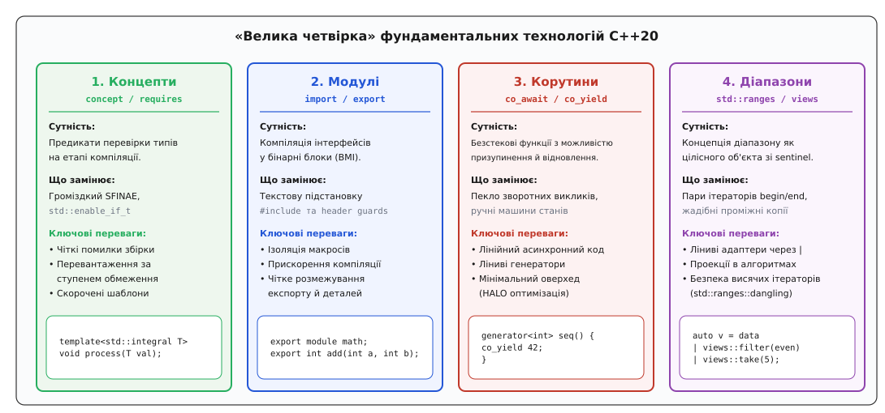
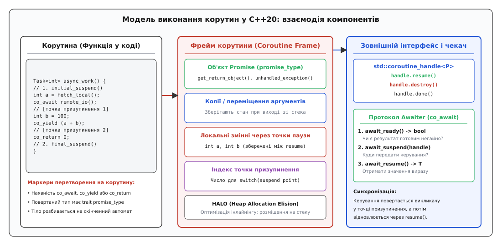
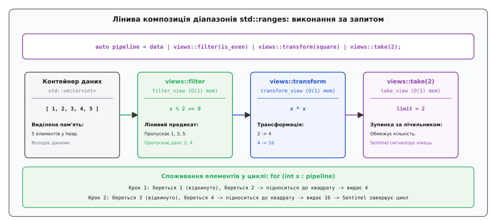
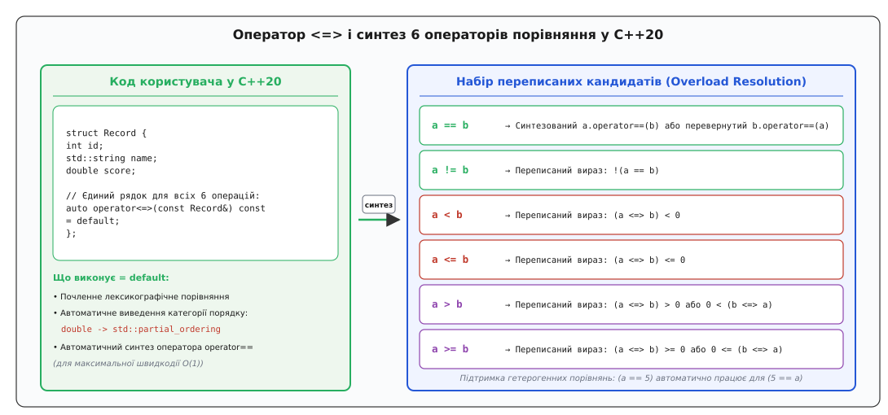

# Що приніс C++20

<preknowlist>
- [Як робиться стандарт C++](root:sys-plang-cpp/standardization-process) — робочі групи WG21, технічні специфікації та цикл релізів.
- [Що приніс C++17](root:sys-plang-cpp/cpp17-features) — structured bindings, constexpr if, std::optional, std::variant та паралельні алгоритми.
- [Концепти й обмеження шаблонів](root:sys-plang-cpp/concepts-constraints) — предикати часу компіляції замість SFINAE.
- [Модулі в C++](root:sys-plang-cpp/cpp-modules) — компіляція інтерфейсів замість текстової підстановки заголовків.
- [Корутини](root:sys-plang-cpp/coroutines) — механіка безстекового призупинення та відновлення функцій.
- [Ranges: конвеєри та види](root:sys-plang-cpp/ranges-pipelines) — лінива обробка послідовностей через оператор конвеєра.
- [Тричленне порівняння](root:sys-plang-cpp/three-way-comparison) — оператор spaceship і переписані кандидати.
- [thread і jthread](root:sys-plang-cpp/std-thread-jthread) — керування потоками виконання та кооперативне скасування.
</preknowlist>

У 2020 році мова C++ підійшла до точки, коли накопичені за чотири десятиліття компроміси почали стримувати розвиток великих програмних систем. Текстове включення заголовків через директиву препроцесора `#include` змушувало компілятори парсити гігабайти одного й того самого коду в кожній одиниці трансляції; шаблони загального призначення генерували багатосторінкові незрозумілі помилки за відсутності формальних контрактів; асинхронні операції вимагали розриву логіки на ланцюжки зворотних викликів або важких потоків операційної системи, а алгоритми стандартної бібліотеки вимагали громіздких пар ітераторів без можливості елегантної композиції. Стандарт ISO/IEC 14882:2020 (C++20) здійснив найглибшу архітектурну реформу мови з часів C++11, запровадивши чотири фундаментальні стовпи: концепти, модулі, корутини та діапазони, а також суттєво розширивши можливості компілятора та стандартної бібліотеки.


*«Велика четвірка» ключових технологій C++20 та їхній систематичний вплив на трансляцію і виконання програм*

Історичний процес формування цього стандарту, його шлях крізь технічні специфікації та досягнення консенсусу в Празі висвітлено в нарисі [історія підготовки C++20](root:sys-plang-cpp/cpp20-features/hist-cpp20-evolution.md).

---

## 1. Концепти та обмеження (concept і requires)

До стандарту C++20 шаблони функціонували за принципом качиної типізації під час інстанціювання: якщо тип містив необхідний метод або операцію, код успішно компілювався; якщо ні — компілятор викидав каскадну помилку глибоко з надр реалізації шаблону. Для відбору перевантажень розробники змушені були вдаватися до механізму SFINAE (Substitution Failure Is Not An Error) через допоміжний клас `std::enable_if_t`. Це перетворювало сигнатури функцій на непроглядний метапрограмний код і сповільнювало компіляцію через генерацію сотень фальшивих гілок підстановки:

```cpp
// Традиційний підхід C++14/17 через SFINAE
template<typename T,
         typename std::enable_if_t<std::is_integral_v<T> && !std::is_same_v<T, bool>, int> = 0>
T compute_hash(T value) {
    return value ^ 0x9e3779b9;
}
```

C++20 зробив обмеження шаблонів першокласним елементом мови, ввівши ключові слова `concept` та `requires`. **Концепт** (лат. *conceptus* — уявлення, поняття) — це іменований предикат часу компіляції, що перевіряє властивості типів, наявність вкладених типів, викликів методів та типів їхніх результатів:

```cpp
#include <concepts>

template<typename T>
concept HashableScalar = std::integral<T> && !std::same_as<T, bool>;

// Застосування концепту в заголовку шаблону
template<HashableScalar T>
T compute_hash(T value) {
    return value ^ 0x9e3779b9;
}
```

Вираз `requires` дозволяє безпосередньо перевіряти синтаксичну коректність складних виразів, наявність вкладених типів і відповідність типів результатів іншим концептам. Вираз `requires` може містити чотири типи вимог:
1. **Прості вимоги (Simple Requirements):** довільний вираз, який повинен бути синтаксично валідним для заданого типу (наприклад, `container.clear();`).
2. **Типові вимоги (Type Requirements):** перевірка наявності вкладеного типу або псевдоніма за допомогою ключового слова `typename` (наприклад, `typename T::value_type;`).
3. **Складені вимоги (Compound Requirements):** вираз у фігурних дужках із можливістю перевірки специфікатора `noexcept` та суворого обмеження типу результату за допомогою концепту-стрілки `-> Concept` (наприклад, `{ container.size() } noexcept -> std::convertible_to<std::size_t>;`).
4. **Вкладені вимоги (Nested Requirements):** додаткові предикати часу компіляції, введені через `requires Predicate<T>;`.

```cpp
template<typename T>
concept PrintableContainer = requires(T container) {
    // 1. Проста вимога
    container.clear();

    // 2. Типова вимога
    typename T::value_type;

    // 3. Складена вимога
    { container.size() } noexcept -> std::convertible_to<std::size_t>;
    { container.begin() } -> std::input_or_output_iterator;
    { container.end() }   -> std::sentinel_for<decltype(container.begin())>;

    // 4. Вкладена вимога
    requires sizeof(typename T::value_type) <= 64;
};
```

### Правила поглинання та впорядкування перевантажень

Концепти кардинально спрощують розв'язання перевантажень. Компілятор аналізує логічну структуру обмежень за допомогою правил поглинання (Subsumption Rules). Компілятор нормалізує предикати у кон'юнктивну нормальну форму (CNF), розбиваючи вирази на атомарні булеві обмеження.

Якщо концепт `B` логічно вимагає виконання всіх атомарних обмежень концепту `A` плюс додаткові умови (`concept B = A<T> && requires(...)`), функція, обмежена концептом `B`, автоматично вважається більш обмеженою (more constrained):

```cpp
template<std::input_iterator I>
void advance_cursor(I& it, std::size_t n) {
    // Лінійне переміщення O(N) для звичайного ітератора
    while (n--) ++it;
}

template<std::random_access_iterator I>
void advance_cursor(I& it, std::size_t n) {
    // Миттєвий перехід O(1) для ітератора довільного доступу
    it += n;
}
```

При виклику `advance_cursor` для `std::vector<int>::iterator` компілятор автоматично обирає другу версію без жодних конфліктів неоднозначності, оскільки концепт `std::random_access_iterator` поглинає `std::input_iterator`.

### Скорочені шаблони функцій (Abbreviated Function Templates)

C++20 дозволив використовувати концепт або ключове слово `auto` безпосередньо у списку параметрів звичайної функції, що синтезує анонімний шаблон:

```cpp
// Еквівалентно template<std::floating_point T> void log_metric(T val);
void log_metric(std::floating_point auto val) {
    // Тіло функції
}
```

> 🔧 **Навіщо це.** Концепти ліквідують головну проблему узагальненого програмування C++: замість криптичних помилок інстанціювання компілятор у першому ж рядку повідомляє, яка саме вимога контракту не виконана переданим типом, а час компіляції скорочується завдяки швидкій відмові на рівні перевірки предикатів без розгортання непотрібних AST-дерев.

---

## 2. Модулі (import і export)

Модель роздільної компіляції C++, успадкована від мови C 1970-х років, спиралася на препроцесорну підстановку файлів `#include`. Якщо заголовок `header.h` підключався у ста одиницях трансляції, компілятор сто разів повністю розбирав його синтаксис, виділяв пам'ять під AST-дерева і повторно проводив семантичний аналіз. Крім того, будь-який макрос `#define`, оголошений в одному файлі, міг випадково спотворити код у наступних підключених бібліотеках.

C++20 ввів **модулі** — герметичні бінарні одиниці інтерфейсу (Binary Module Interface, BMI):

```cpp
// Файл: math_matrix.ixx (або .cppm)
export module math.matrix;

import <vector>;
import <stdexcept>;

export namespace math {
    template<typename T>
    class Matrix {
    public:
        Matrix(std::size_t r, std::size_t c) : rows_(r), cols_(c), data_(r * c) {}

        T& at(std::size_t r, std::size_t c) {
            if (r >= rows_ || c >= cols_) throw std::out_of_range("Matrix bounds");
            return data_[r * cols_ + c];
        }

    private:
        std::size_t rows_, cols_;
        std::vector<T> data_;
    };

    export template<typename T>
    Matrix<T> identity(std::size_t n);
}
```

Використання модуля в іншому файлі здійснюється через директиву `import`:

```cpp
// Файл: main.cpp
import math.matrix;
import <iostream>;

int main() {
    math::Matrix<double> mat(3, 3);
    mat.at(0, 0) = 1.0;
    return 0;
}
```

### Ключові властивості та архітектура модульної системи

1. **Ізоляція макросів:** Макроси не експортуються з іменованих модулів. Навіть якщо модуль визначає `#define BUFFER_SIZE 4096`, цей символ ніколи не проникне у файл, який викликає `import`. Це усуває цілий клас важковловимих помилок компіляції.
2. **Одноразовий парсинг та BMI:** Компілятор транслює інтерфейс модуля в оптимізований бінарний формат (BMI, наприклад `.ifc` у MSVC або `.pcm` у Clang). Усі файли, що імпортують модуль, читають уже готове скомпільоване представлення типів і символів, що прискорює збірку великих проєктів у 3–10 разів.
3. **Глобальний фрагмент модуля (Global Module Fragment):** Дозволяє включати старі немодульні заголовки C до оголошення модуля:
   ```cpp
   module;
   #include <sys/socket.h> // Макроси залишаються локальними для цього файлу
   export module network.socket;
   ```
4. **Приватний фрагмент модуля (Private Module Fragment):** Дозволяє розмістити реалізацію в тому самому файлі без провокування повторної компіляції клієнтських файлів при зміні деталей. Це повністю витісняє громіздку ідіому PIMPL (Pointer to Implementation), оскільки приватний фрагмент забезпечує ізоляцію складання без виділення динамічної пам'яті під покажчик непрозорої структури:
   ```cpp
   export module engine.audio;
   export void play_sound(int id);

   module :private;
   void play_sound(int id) {
       // Реалізація, прихована від BMI
   }
   ```
5. **Модульне зв'язування (Module Linkage):** Новий тип компонування символів. Сутності, оголошені в модулі без ключового слова `export`, доступні в усіх одиницях трансляції того самого модуля (розділах модуля), але повністю невидимі для зовнішнього коду.
6. **Заголовочні модулі (Header Units):** Директива `import <vector>;` компілює традиційний заголовок як бінарний модуль, що забезпечує швидку та безпечну поступову міграцію старих кодових баз.

> 🔧 **Навіщо це.** Модулі ліквідують повільну текстову обробку заголовків, усувають взаємні конфлікти макросів, гарантують дотримання правила єдиного визначення (ODR) на рівні інтерфейсів та забезпечують надійний захист внутрішньої архітектури бібліотек на рівні системи збірки.

---

## 3. Корутини (co_await, co_yield, co_return)

Традиційна функція в C++ є підпрограмою: вона отримує стек виклику, виконує обчислення і безповоротно повертає значення через `return`, руйнуючи всі локальні змінні. Якщо задача потребувала призупинення виконання в очікуванні відповіді від сокета чи диска, розробник мусив або блокувати потік ОС (що масштабується лише до кількох тисяч потоків), або розбивати логіку на спагеті-код зі зворотних викликів (Callbacks) та ручних автоматів станів.

C++20 надав мові підтримку **безстекових корутин** (Stackless Coroutines). Корутина (англ. *coroutine* від *cooperative routine*) — це функція, яка може призупиняти своє виконання (Suspend), повертаючи керування викликачу, і згодом відновлювати роботу (Resume) з тієї самої точки зі збереженням стану локальних змінних.


*Архітектура безстекової корутини C++20: взаємодія коду, фрейму в купі та дескриптора керування*

Функція стає корутиною автоматично, якщо її тіло містить хоча б одне з ключових слів:
- `co_await <expr>` — призупиняє корутину до завершення асинхронної операції;
- `co_yield <expr>` — генерує значення послідовності та призупиняє корутину;
- `co_return <expr>` — повертає фінальний результат і завершує виконання корутини.

### Тріада механіки корутини: Promise, Coroutine Handle, Awaiter

Компілятор C++20 не прив'язаний до конкретної бібліотеки виконання (Runtime) і реалізує корутини як чистий механізм перетворення коду. Уся семантика керується трьома сутностями:

1. **Об'єкт Promise (`promise_type`):** Внутрішній стан корутини, через який вона передає результати, обробляє винятки та визначає поведінку при запуску (`initial_suspend`) і завершенні (`final_suspend`).
2. **Дескриптор корутини (`std::coroutine_handle<P>`):** Неволодіючий покажчик на виділений фрейм корутини (Coroutine Frame), що дозволяє відновлювати (`handle.resume()`) або знищувати (`handle.destroy()`) її ззовні.
3. **Протокол Awaiter:** Інтерфейс об'єкта, що передається в `co_await`, який визначає готовність результату (`await_ready`), дію при призупиненні (`await_suspend`) та значення після відновлення (`await_resume`):

```cpp
#include <coroutine>
#include <iostream>

struct SimpleTask {
    struct promise_type {
        SimpleTask get_return_object() {
            return SimpleTask{std::coroutine_handle<promise_type>::from_promise(*this)};
        }
        std::suspend_never initial_suspend() noexcept { return {}; }
        std::suspend_always final_suspend() noexcept { return {}; }
        void return_void() noexcept {}
        void unhandled_exception() { std::terminate(); }
    };

    std::coroutine_handle<promise_type> handle;
    ~SimpleTask() { if (handle) handle.destroy(); }
};

SimpleTask async_counter() {
    std::cout << "Крок 1: початок обчислення\n";
    co_await std::suspend_always{}; // Точка призупинення
    std::cout << "Крок 2: продовження після відновлення\n";
}
```

### Симетрична передача керування (Symmetric Transfer)

У C++20 метод `await_suspend` може повертати інший `std::coroutine_handle<>`. Це активує симетричну передачу керування: замість повернення керування у викликач та повторного входу через диспетчер, компілятор виконує прямий перехід на фрейм наступної корутини. Це усуває накопичення стекових кадрів і дозволяє корутинам передавати повідомлення одна одній нескінченно без ризику переповнення стека (Tail-Call Optimization).

### Оптимізація виділення пам'яті (HALO)

За замовчуванням фрейм корутини розміщується в динамічній пам'яті (`new`). Проте компілятори C++20 оснащені оптимізацією **HALO** (Heap Allocation Elision Optimization). Якщо час життя корутини вкладений у час життя зухвалого коду, компілятор інлайнить стан корутини безпосередньо у стек викликача, зводячи вартість виклику до звичайної функції без єдиної алокації пам'яті.

> 🔧 **Навіщо це.** Корутини дозволяють писати високоефективний асинхронний мережевий та генераторний код у прямому, лінійному стилі без блокування потоків ОС і без втрати читабельності.

---

## 4. Діапазони та конвеєри (std::ranges)

Алгоритми стандартної бібліотеки C++98–C++17 спиралися на пару ітераторів `std::sort(vec.begin(), vec.end())`. Це створювало численні незручності: передача несумісних ітераторів від різних контейнерів призводила до невизначеної поведінки, а трансформація послідовностей (наприклад, фільтрація з подальшим перетворенням) вимагала створення проміжних тимчасових векторів із виділенням динамічної пам'яті.

Бібліотека `std::ranges` у C++20 переосмислила обробку даних:

1. **Концепція Range:** Діапазон — це єдиний об'єкт, який надає ітератор початку `begin()` та обмежувач **sentinel** `end()`. Тип sentinel може відрізнятися від типу ітератора (наприклад, нуль-термінатор для C-рядка або стан `done()` для генератора), що дозволяє оперувати нескінченними та лінивими послідовностями.
2. **Точки кастомізації (CPO — Customization Point Objects):** Об'єкти на зразок `std::ranges::begin`, `std::ranges::end`, `std::ranges::size` гарантують захист від неконтрольованого пошуку імен через аргументи (ADL Hijacking), уніфікуючи доступ до масивів C, стандартних контейнерів та користувацьких типів.
3. **Ліниві види (`std::views`):** Легковажні невласницькі обгортки над діапазонами з часом створення та копіювання `O(1)`. Вони не модифікують оригінальний контейнер і виконують обчислення лише тоді, коли черговий елемент запитується ітератором.
4. **Оператор конвеєра (`|`):** Дозволяє об'єднувати адаптери діапазонів у зрозумілі функціональні ланцюжки:


*Поетапне проходження елементів через лінивий конвеєр views без проміжних виділень динамічної пам'яті*

```cpp
#include <iostream>
#include <vector>
#include <ranges>

int main() {
    std::vector<int> numbers = {1, 2, 3, 4, 5, 6, 7, 8, 9, 10};

    // Конвеєр: відібрати парні, піднести до квадрата, взяти перші три
    auto pipeline = numbers
                  | std::views::filter([](int n) { return n % 2 == 0; })
                  | std::views::transform([](int n) { return n * n; })
                  | std::views::take(3);

    for (int value : pipeline) {
        std::cout << value << " "; // Виведе: 4 16 36
    }
    return 0;
}
```

### Проекції в алгоритмах ranges

Алгоритми простору `std::ranges` підтримують механізм **проекцій** (Projections) — функціональний аргумент, який застосовується до кожного елемента перед виконанням операції порівняння чи обробки. Це усуває потребу у написанні громіздких лямбда-компараторів:

```cpp
struct User {
    std::string name;
    int age;
};

std::vector<User> users = {{"Оксана", 28}, {"Богдан", 22}, {"Андрій", 35}};

// Сортування за полем age без написання кастомної лямбди-компаратора
std::ranges::sort(users, {}, &User::age);
```

### Захист від висячих ітераторів (std::ranges::dangling)

Якщо алгоритм викликається над тимчасовим об'єктом (rvalue container), повернення ітератора на його внутрішні елементи призвело б до використання звільненої пам'яті (Use-After-Free). Алгоритми `std::ranges` статично детектують такі випадки та повертають маркерний тип `std::ranges::dangling`, що генерує помилку компіляції при спробі розіменування:

```cpp
auto get_temp_vector() { return std::vector<int>{1, 2, 3, 4}; }

// Помилка компіляції: ітератор не може пережити знищення тимчасового вектора!
// auto it = std::ranges::max_element(get_temp_vector());
// *it; // Compilation Error: std::ranges::dangling cannot be dereferenced
```

> 🔧 **Навіщо це.** `std::ranges` перетворює C++ на сучасну мову функціональної обробки потоків даних із нульовими накладними витратами (Zero Cost Abstraction) та апаратною безпекою ітерації.

---

## 5. Оператор тристороннього порівняння (<=>)

До C++20 створення повноцінного класу значень вимагало ручного перевантаження шести операторів порівняння: `==`, `!=`, `<`, `<=`, `>`, `>=`. При додаванні гетерогенних порівнянь кількість необхідних функцій зростала в геометричній прогресії.

C++20 запровадив оператор **тристороннього порівняння** `operator<=>` (Spaceship Operator) та систему синтезованих переписаних кандидатів:


*Синтез повного набору з шести операторів порівняння на основі єдиного оголошення operator<=> = default*

```cpp
#include <compare>
#include <string>

struct Employee {
    int id;
    std::string surname;
    double salary;

    // Компілятор почленно порівнює поля у порядку їхнього оголошення
    auto operator<=>(const Employee&) const = default;
};
```

Оголошення `= default` автоматично генерує не лише `operator<=>`, але й високошвидкісний `operator==`. Якщо у коді викликається вираз `emp1 < emp2`, компілятор переписує його у `(emp1 <=> emp2) < 0`. Для виразів `emp1 != emp2` використовується переписаний вираз `!(emp1 == emp2)`.

### Категорії порядку в заголовку `<compare>`

Оператор `<=>` повертає не числове значення `int`, а спеціалізований тип категорії порівняння:
1. `std::strong_ordering` — сильний порядок (якщо `a == b`, то `f(a) == f(b)` для будь-якої спостережної функції; характерно для цілих чисел і рядків). Значення: `less`, `equal`, `greater`.
2. `std::weak_ordering` — слабкий порядок (об'єкти еквівалентні за критерієм порядку, але не ідентичні; наприклад, регістронезалежні рядки `"test"` та `"TEST"`). Значення: `less`, `equivalent`, `greater`.
3. `std::partial_ordering` — частковий порядок (деякі значення не можна порівняти між собою; типово для чисел з плаваючою комою через наявність нечислового значення `NaN`). Значення: `less`, `equivalent`, `greater`, `unordered`.

Для чисел із плаваючою комою `double` строгий порядок є неможливим через особливості стандарту IEEE 754: значення `+0.0` та `-0.0` рівні за значенням, але мають різне бітове представлення, а порівняння з `NaN` повертає статус `unordered`.

---

## 6. Обчислення часу компіляції: consteval, constinit та розширення constexpr

Метапрограмування C++20 остаточно витіснило складні шаблони обчислень на етапі компіляції на користь імперативного коду `constexpr`.

### Негайні функції: consteval

Специфікатор `constexpr` гарантує лише *можливість* виконання функції під час компіляції, але за наявності неконстантних аргументів компілятор мовчки генерує виклик у рантаймі. Ключове слово `consteval` оголошує **негайну функцію** (Immediate Function), яка **зобов'язана** обчислюватися виключно під час компіляції. Будь-яка спроба виконати її в рантаймі викликає жорстку помилку збірки:

```cpp
consteval int compile_time_hash(std::string_view str) {
    int hash = 5381;
    for (char c : str) {
        hash = ((hash << 5) + hash) + static_cast<int>(c);
    }
    return hash;
}

constexpr int h1 = compile_time_hash("api_v1"); // Успішно обчислено компілятором
int x = 42;
// int h2 = compile_time_hash(std::to_string(x)); // Помилка компіляції!
```

### Захист від порядку статичної ініціалізації: constinit

Специфікатор `constinit` вирішує проблему Static Initialization Order Fiasco. Він гарантує, що змінна зі статичним або thread-local часом життя ініціалізується під час компіляції константним виразом, але при цьому сама змінна **не є константою** і може вільно модифікуватися в рантаймі:

```cpp
constinit int global_event_counter = compile_time_hash("init_seed");

void on_event() {
    ++global_event_counter; // Дозволено: змінна мутабельна
}
```

### Динамічна пам'ять та віртуальні функції в constexpr

C++20 зняв фундаментальні обмеження на обчислення всередині `constexpr`:
- **Перехідна динамічна пам'ять (Transient Allocation):** Дозволено використання операторів `new` і `delete`, а також стандартних контейнерів `std::vector` та `std::string` у `constexpr`-функціях за умови, що вся виділена пам'ять звільняється до завершення обчислення константного виразу.
- **Віртуальні функції та поліморфізм:** Дозволено динамічний поліморфізм і виклики віртуальних методів у контексті `constexpr`. Компілятор відстежує реальний динамічний тип об'єкта у своєму інтерпретаторі константних виразів.
- **Конструкції try-catch:** Дозволено синтаксис обробки винятків (хоча генерація винятку, що не перехоплюється, перериває константне обчислення помилкою збірки).

---

## 7. Розширення ядра мови та лямбда-виразів

### Шаблонні параметри не-типи (NTTP) розширеного класу

До C++20 як NTTP (Non-Type Template Parameters) дозволялися лише цілі числа, переліки та покажчики. C++20 дозволив параметризувати шаблони числами з плаваючою комою та користувацькими класами-літералами зі структурним типом (усі поля та базові класи є публічними та не мутабельними):

```cpp
template<double Scale>
double apply_gain(double val) {
    return val * Scale;
}

template<std::size_t N>
struct FixedString {
    char buf[N];
    constexpr FixedString(const char (&str)[N]) {
        std::copy_n(str, N, buf);
    }
};

template<FixedString Tag>
void log_tagged(std::string_view msg) {
    std::cout << "[" << Tag.buf << "] " << msg << "\n";
}

// Виклик шаблону з рядковим літералом як NTTP
log_tagged<"NETWORK">("Packet received");
```

### Лямбда-вирази нового покоління

1. **Явний синтаксис шаблонів у лямбдах:**
   ```cpp
   auto push_all = []<typename T>(std::vector<T>& vec, const T& item) {
       vec.push_back(item);
   };
   ```
2. **Розпакування пакетів параметрів у захопленні (Pack Expansion in Init-Capture):**
   ```cpp
   template<typename... Args>
   auto make_delayed_call(Args&&... args) {
       return [...args = std::forward<Args>(args)]() {
           consume_args(args...);
       };
   }
   ```
3. **Лямбди в невизначених типах:** Лямбда-вирази без захоплення тепер дозволено використовувати в операторах `decltype` та як компаратори за замовчуванням у шаблонах:
   ```cpp
   auto cmp = [](int a, int b) { return a > b; };
   std::set<int, decltype(cmp)> ordered_set; // Валідно в C++20 без передачі об'єкта в конструктор
   ```

### Іменовані ініціалізатори (Designated Initializers)

C++20 запозичив із стандарту C99 іменовані ініціалізатори для агрегатних типів, що підвищує самодокументованість коду. На відміну від C, стандарт C++ вимагає суворого дотримання порядку оголошення полів, унеможливлюючи приховані помилки невідповідності зміщень:

```cpp
struct ServerConfig {
    std::string host = "localhost";
    int port = 8080;
    int max_clients = 1000;
    bool enable_tls = false;
};

ServerConfig cfg{
    .port = 443,
    .max_clients = 5000,
    .enable_tls = true
}; // Поля мають слідувати у порядку їхнього оголошення в структурі
```

---

## 8. Розширення стандартної бібліотеки

### Типобезпечне форматування: std::format

Функція `std::format` із заголовка `<format>` (заснована на бібліотеці `{fmt}` Віктора Зубєхіна) замінила небезпечний `sprintf` та повільний `std::ostringstream`. Вона поєднує високу швидкодію позиційних специфікаторів на зразок Python з повною перевіркою типів під час компіляції:

```cpp
#include <format>
#include <iostream>

std::string report = std::format("Користувач ID: {:08d} | Рейтинг: {:.2f} | Стан: {}",
                                 42, 98.456, "АКТИВНИЙ");
```

Бібліотека легко розширюється для користувацьких типів через спеціалізацію шаблону `std::formatter`. Функція `std::format_to` дозволяє виконувати прямий запис у вихідні ітератори (наприклад, у сокет або статичний буфер) без додаткових проміжних алокацій пам'яті.

### Суцільні представлення пам'яті: std::span

Клас `std::span<T>` із заголовка `<span>` є невласницьким видом на неперервну послідовність об'єктів у пам'яті (`покажчик + довжина`). Він дозволяє уніфікувати інтерфейси функцій, які приймають сирі масиви C, `std::vector` або `std::array`, без копіювання даних:

```cpp
#include <span>
#include <vector>
#include <array>

void process_buffer(std::span<const uint8_t> buffer) {
    for (uint8_t byte : buffer) {
        // Обробка байтів
    }
}

uint8_t raw[128];
std::vector<uint8_t> vec(64);
std::array<uint8_t, 32> arr;

process_buffer(raw); // Працює з C-масивом
process_buffer(vec); // Працює з std::vector
process_buffer(arr); // Працює з std::array
```

### Багатопотоковість і синхронізація

C++20 кардинально покращив багатопотоковий арсенал стандарту:

1. **`std::jthread` (Joining Thread):** Новий клас потоку із заголовка `<jthread>`, який автоматично викликає `join()` у своєму деструкторі, запобігаючи аварійному виклику `std::terminate` при виході з області видимості.
2. **Кооперативне переривання (`std::stop_token`):** Вбудований механізм надсилання та перевірки сигналу скасування між потоками з підтримкою зворотних викликів `std::stop_callback`.
3. **Примітиви синхронізації низького оверхеду:**
   - `std::latch` — одноразовий зворотний лічильник для координації старту/фінішу групи потоків;
   - `std::barrier` — багаторазовий фазовий бар'єр із можливістю запуску функції завершення кроку;
   - `std::counting_semaphore` та `std::binary_semaphore` — легковажні семафори, побудовані безпосередньо над системними футексами (Futex).

```cpp
#include <thread>
#include <chrono>
#include <iostream>

void worker_routine(std::stop_token stoken, int id) {
    while (!stoken.stop_requested()) {
        std::this_thread::sleep_for(std::chrono::milliseconds(50));
    }
    std::cout << "Потік " << id << " коректно зупинився.\n";
}

int main() {
    std::jthread worker(worker_routine, 1);
    std::this_thread::sleep_for(std::chrono::milliseconds(120));
    // Деструктор worker автоматично викличе request_stop() та join()
    return 0;
}
```

### Низькорівневі маніпуляції бітами: `<bit>`

Заголовок `<bit>` надав переносні інтринсіки для роботи з двійковими розрядами, які транслюються в одиночні інструкції процесора:

```cpp
#include <bit>
#include <cstdint>

uint32_t val = 0b0000'1111'0000'0000;
int ones = std::popcount(val);           // Апаратний POPCNT -> 4
int leading_zeros = std::countl_zero(val);// Апаратний LZCNT -> 4
bool is_pow2 = std::has_single_bit(16u);  // true

// Безпечне приведення типів без порушення Strict Aliasing
float f = 1.0f;
uint32_t raw_bits = std::bit_cast<uint32_t>(f); // mov замість memcpy
```

### Календар і часові зони: розширення `<chrono>`

Бібліотека часу отримала класи представлення цивільного календаря (рік, місяць, день, день тижня) та підтримку міжнародної бази часових поясів IANA (Time Zone Database):

```cpp
#include <chrono>
#include <iostream>

using namespace std::chrono;

// Зручні літерали дат
auto date = 2026y / August / 19d;
bool valid = date.ok();

// Арифметика дат
auto next_month = date + months(1);

// Робота з часовими поясами
zoned_time kyiv_time{"Europe/Kyiv", system_clock::now()};
```

Повний структурований довідник макросів SD-6, заголовків та інтерфейсів доступний у вставці [довідкова матриця нововведень C++20](root:sys-plang-cpp/cpp20-features/api-cpp20-features-matrix.md).

Практичне об'єднання концептів, корутин, конвеєрів ranges та `std::jthread` у закінчений проект реалізовано у вставці [наскрізний асинхронний конвеєр на C++20](root:sys-plang-cpp/cpp20-features/proj-cpp20-pipeline.md).

---

## 9. Архітектурний підсумок стандарту

Стандарт C++20 змінив парадигму розробки систем на C++. Від розрізнених ідіом, препроцесорних хаків та важкого для супроводу SFINAE мова перейшла до архітектури виразних контрактів:
- Модулі перетворили побудову програмних пакетів на швидкий, структурований процес з чіткими бінарними межами.
- Концепти надали узагальненому коду самодокументованість та математичну строгість відбору перевантажень.
- Корутини відкрили шлях до побудови масштабованих асинхронних архітектур із нульовими витратами пам'яті.
- Діапазони уніфікували алгоритмічну обробку даних у прозорі композиційні конвеєри.

C++20 закріпив за мовою статус головного інструменту для створення надшвидких, безпечних за типами та масштабованих інженерних систем наступного десятиліття.
