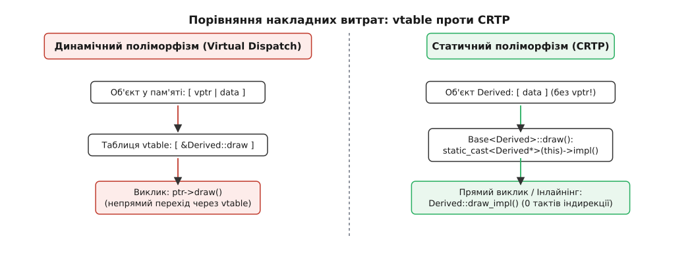
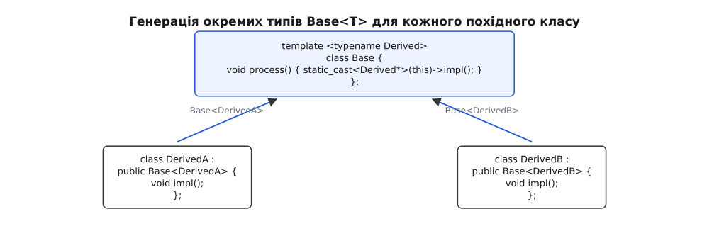
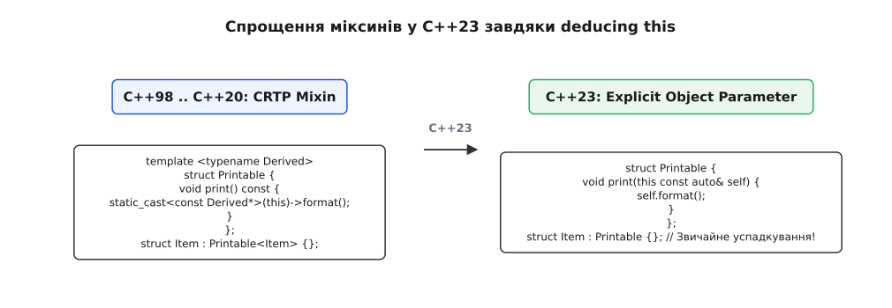

# CRTP: статичний поліморфізм

<preknowlist>
- [Шаблони: параметризація типом](root:sys-plang-cpp/templates-basics) — параметри-типи, інстанціювання класів і методів компілятором.
- [Віртуальний деструктор і поліморфне видалення](root:sys-plang-cpp/virtual-destructor) — як влаштований vptr, vtable та чому індирекція виклику коштує процесорних тактів.
- [Оператори приведення типів](root:sys-plang-cpp/cast-operators) — статичне приведення `static_cast` та відмінності від `dynamic_cast`.
- [Оптимізація порожньої бази](root:sys-plang-cpp/empty-base-optimization) — як компілятор виключає зайвий розмір для базових класів без полів даних.
</preknowlist>

Розробка високопродуктивної мережевої системи обробки фінансових повідомлень або графіка реального часу вимагає обробки мільйонів об'єктів на секунду. Коли кожен об'єкт класу геометрії чи мережевого пакета містить віртуальні функції, кожна операція над ним змушена проходити крізь індирекцію таблиці віртуальних функцій (`vtable`). Для кожного виклику процесор зчитує вказівник `vptr` з об'єкта, знаходить потрібну адресу у `vtable`, робить непрямий перехід за цією адресою й скидає конвеєр інструкцій у разі промаху передбачувача переходів. У додаток до цього, віртуальний виклик створює нездоланний бар'єр для оптимізатора компілятора: компілятор не може виконати інлайнінг (вбудовування) тіла функції, оскільки точний тип об'єкта стає відомим лише під час виконання програми.

Якщо точний тип похідного об'єкта відомий на етапі компіляції, платити ціну віртуального виклику недоцільно. Шаблон **CRTP** (англ. *Curiously Recurring Template Pattern* — дивовижно повторюваний шаблонний візерунок) розв'язує цю проблему, переносячи вибір реалізації з етапу виконання (динамічний поліморфізм) на етап компіляції (статичний поліморфізм).


*Порівняння накладних витрат: непрямий виклик через vtable проти прямого виклику й інлайнінгу в CRTP.*

---

## 1. Проблема ціни гнучкості: індирекція та vtable

У класичному об'єктно-орієнтованому програмуванні на C++ динамічний поліморфізм забезпечує високу гнучкість розширення систем. Базовий клас оголошує віртуальні функції, а похідні класи перевизначають їхню поведінку. Зовнішній код працює з об'єктами через вказівник або посилання на базовий тип, нічого не знаючи про конкретні похідні класи. Ця концепція пізнього зв'язування (late binding) лежить в основі багатьох класичних паттернів програмування.

Проте за цю гнучкість система сплачує сувору ціну на рівні мікроархітектури сучасних процесорів:

1. **Накладні витрати пам'яті та локальність кешу**: До кожного об'єкта з віртуальними функціями компілятор неявно додає приховане поле-вказівник `vptr` (8 байтів на 64-бітних архітектурах). У разі обробки мільйонів дрібних об'єктів (наприклад, вершин у тривимірній сітці, елементів у контейнері чи вузлів у дереві) це спричиняє значний розхід оперативної пам'яті. Що ще важливіше, це погіршує щільність пакування даних у кеш-лініях процесора. Кеш-лінія x86_64 має розмір 64 байти, і наявність 8-байтного `vptr` зменшує корисний обсяг даних, який вміщується в один кеш-рядок L1 Data Cache.
2. **Накладні витрати індирекції та затримка оперативної пам'яті**: Для виконання віртуального виклику процесор має зчитати значення `vptr` з об'єкта, перейти за вказаною адресою в таблицю `vtable`, зчитати адресу потрібного методу й лише після цього виконати інструкцію `call`. Це додає дві послідовні операції зчитування з пам'яті. Якщо таблиця `vtable` вимита з кешу L1/L2, затримка зчитування з оперативної пам'яті (DRAM latency) може досягати 200–300 тактів процесора на кожному виклику.
3. **Руйнування передбачувача переходів (BTB Misses)**: Якщо у циклі обробляються об'єкти різних похідних класів, передбачувач переходів процесора (Branch Target Buffer) не може вгадати адресу наступного виклику. Промахи передбачувача призводять до вимушеного скидання процесорного конвеєра (pipeline flush) та затримки на 15–20 тактів для повторного декодування інструкцій.
4. **Блокування міжпроцедурних оптимізацій та інлайнінгу**: Компілятор позбавлений можливості вбудувати код віртуальної функції безпосередньо у місце виклику, оскільки точна адреса методу невідома під час збірки. Втрата інлайнінгу б'є по продуктивності сильніше за саму індирекцію: вона унеможливлює подальші оптимізації — векторизацію (SIMD), усунення спільних підвиразів, оптимізацію розгортання циклів та агресивний аналіз аліасингу вказівників.

При вимірюванні метрик виконання систем на апаратному рівні (за допомогою лічильників `perf stat`) заміна динамічного поліморфізму на CRTP демонструє скорочення кількості машинних інструкцій у кілька разів та практично повне зникнення промахів кешу даних L1.

Коли структура програмованої системи гарантує, що конкретний тип об'єкта відомий під час збірки, динамічний зв'язувальний механізм є надмірним. Саме у таких завданнях застосовується статичний поліморфізм на основі CRTP.

---

## 2. Механіка статичного поліморфізму та двофазний пошук

Синтаксично CRTP виглядає як успадкування класу від шаблону, де сам похідний клас передається як параметр типу цього ж шаблону:

```cpp
template <typename Derived>
class Base {
public:
    void interface() {
        // Приведення вказівника this до типу Derived* і виклик реалізації
        static_cast<Derived*>(this)->implementation();
    }
};

class Derived : public Base<Derived> {
public:
    void implementation() {
        // Конкретна реалізація у похідному класі
    }
};
```

На перший погляд такий запис виглядає парадоксально: клас `Derived` успадковується від `Base<Derived>` у той момент, коли сам `Derived` ще не є повністю оголошеним типом (англ. *incomplete type*). Проте згідно з правилами C++ це абсолютно законно завдяки двофазній механіці обробки шаблонів компілятором.

### Легітимність неповного типу у CRTP

Коли компілятор бачить першу строчку оголошення `class Derived : public Base<Derived>`, відбувається така послідовність кроків:
1. Клас `Derived` розпізнається як ім'я нового типу. У цей момент він дійсно є неповним типом для компілятора.
2. Для ініціалізації базового класу компілятору потрібно знати розмір `Base<Derived>`. Оскільки сам клас `Base<Derived>` не містить полів даних типу `Derived` (він оперує лише вказівником `this`), розмір `Base<Derived>` повністю відомий і дорівнює 1 байту (порожній клас) або розміру власних полів `Base`.
3. **Ключова деталь**: Тіла методів шаблонного класу `Base<Derived>` (зокрема метод `interface()`) не інстанціюються в момент оголошення `Derived`. Вони інстанціюються лише тоді, коли ці методи явно викликаються у коді.
4. До моменту першого виклику `derived_obj.interface()` клас `Derived` вже повністю зчитаний компілятором і є повним типом (англ. *complete type*).

Тому всередині тіла метода `Base<Derived>::interface()` компілятор точно знає повний розклад пам'яті класу `Derived`, що робить операцію `static_cast<Derived*>(this)` безпечною та абсолютно коректною.


*Успадкування в CRTP створює унікальний тип базового шаблону для кожного похідного класу.*

### Точка інстанціювання (Point of Instantiation) та порядок аналізу

Формально в стандарті C++ процес розбору CRTP розбивається між точкою оголошення класу та точкою першого використання його методів. Точка інстанціювання (Point of Instantiation, POI) для шаблонної функції `Base<Derived>::interface()` розташовується безпосередньо після одиниці трансляції або після функції, яка здійснює перший виклик цього методу.

До цього моменту компілятор вже повністю завершив побудову таблиці символів класу `Derived`, розрахував розмір усіх його членів, вирівнювання полів та зміщення у структурі даних.

Це дозволяє операції `static_cast<Derived*>(this)` працювати з нульовими накладними витратами під час виконання програми. Компілятор перетворює цей каст на просту зміну типу вказівника у своєму внутрішньому статичному представленні (Abstract Syntax Tree, AST) без додавання жодної машинної інструкції зміщення адреси, якщо базовий клас є першим у списку успадкування або не містить власних полів даних.

### Двофазний пошук імен та залежні імена

Оскільки `Base<Derived>` є шаблонним базовим класом, виклик методів або доступ до полів базового класу з похідного підпорядковується правилам двофазного пошуку імен (Two-Phase Name Lookup).

Під час першої фази розбору шаблону компілятор аналізує незалежні імена (імена, які не залежать від параметрів шаблону `Derived`). На цій фазі базовий клас `Base<Derived>` ще не розгорнуто, і компілятор не знає, які саме члени у ньому існують (оскільки для деяких спеціалізацій базовий шаблон може бути частково або повністю спеціалізований у майбутньому).

Через це, якщо похідний клас звертається до методу базового шаблону без кваліфікації, компілятор видає помилку збірки під час фази 1, бо ім'я не знайдено у зовнішньому контексті.

Для перенесення пошуку імені на другу фазу (фазу інстанціювання шаблону) розробник зобов'язаний явно зробити ім'я залежним від параметра шаблону. Це робиться за допомогою припрефіксу `this->` або явного зазначення кваліфікованого імені базового класу `BaseClass<Derived>::`:

```cpp
template <typename Derived>
class BaseProcessor {
public:
    void reset_state() {
        // Логіка скидання стану
    }
};

template <typename Derived>
class AdvancedProcessor : public BaseProcessor<Derived> {
public:
    void process() {
        // reset_state(); // ПОМИЛКА: ім'я не знайдене під час фази 1!
        this->reset_state(); // OK: тепер це залежне ім'я, пошук відкладено до фази 2
    }
};
```

Використання синтаксису `this->reset_state()` вказує компілятору, що тип `this` залежить від параметра `Derived`. Це гарантує, що пошук методу відбудеться під час другої фази інстанціювання, коли повна структура базового класу `BaseProcessor<Derived>` буде гарантовано доступна компілятору.

### Перевірка контрактів похідних класів за допомогою SFINAE та Концептів C++20

У класичному C++98/C++11, якщо похідний клас не реалізує очікуваний метод `implementation()`, помилка компіляції виникає глибоко всередині тіла базового шаблону. Це породжує довгі й складні для зчитування повідомлення про помилку під час збірки (template instantiations trace).

Завдяки впровадженню концептів у C++20 розробники отримали можливість явного оголошення вимог до похідного класу безпосередньо у базовому шаблоні:

```cpp
#include <concepts>

template <typename T>
concept CanProcess = requires(T t) {
    { t.process_impl() } -> std::same_as<void>;
};

template <typename Derived>
class ValidatedCRTP {
public:
    void process() {
        static_assert(CanProcess<Derived>,
            "Похідний клас зобов'язаний надати метод 'void process_impl()'");
        static_cast<Derived*>(this)->process_impl();
    }
};
```

Використання `static_assert` разом із концептами усуває незрозумілі списки помилок і дає розробникові точне й лаконічне повідомлення про порушення контракту під час компіляції.

[Історія виникнення CRTP та трюк Бартона-Некмана](root:sys-plang-cpp/crtp/hist-crtp-origin.md) детально показує, як ця механіка народилася з досліджень Джозефа Бартона та Лі Некмана у 1994 році та була узагальнена Джимом Коплієн.

---

## 3. Збереження константності (Const-Correctness) у CRTP

При реалізації CRTP необхідно правильно враховувати кваліфікатори константності. Якщо метод базового класу оголошений як `const`, спроба викликати неконстантне приведення `static_cast<Derived*>(this)` призведе до помилки компіляції, бо компілятор забороняє знімати `const` за допомогою `static_cast`.

Правильна реалізація передбачає дзеркальне розділення методів або використання шаблонного перевантаження:

```cpp
template <typename Derived>
class Readable {
public:
    void read() const {
        // Константне приведення для const-методів
        static_cast<const Derived*>(this)->read_impl();
    }

    void write() {
        // Неконстантне приведення для модифікуючих методів
        static_cast<Derived*>(this)->write_impl();
    }
};

class FileStream : public Readable<FileStream> {
public:
    void read_impl() const {
        // Читання даних без зміни стану
    }

    void write_impl() {
        // Модифікація стану файлу
    }
};
```

Якщо метод має повертати посилання на самого себе (наприклад, для реалізації ланцюжка викликів), кваліфікатор `const` так само розповсюджується на тип повернення:

```cpp
template <typename Derived>
class Builder {
public:
    Derived& reset() {
        Derived& self = *static_cast<Derived*>(this);
        self.clear_state();
        return self;
    }

    const Derived& inspect() const {
        const Derived& self = *static_cast<const Derived*>(this);
        self.print_debug();
        return self;
    }
};
```

У сучасній практиці C++20 для забезпечення ідеального збереження категорій значень (lvalue/rvalue) та константності у CRTP-базах застосовують універсальні посилання та шаблонні методи-помічники, що усуває дублювання const і non-const кодів.

---

## 4. Практичні паттерни й застосування CRTP

Паттерн CRTP слугує фундаментом для цілої низки ідіом у розробці на C++. Розглянемо п'ять найважливіших сфер його застосування.

### А. Статичний інтерфейс (Static Interface / Template Method)

На відміну від класичного паттерну «Шаблонний метод» (англ. *Template Method*), де базовий клас визначає алгоритм із викликом віртуальних методів, CRTP реалізує той самий алгоритм повністю під час компіляції. Базовий клас конструює високорівневий сценарій обробки, викликаючи точкові кроки з похідного класу:

```cpp
template <typename Derived>
class DataParser {
public:
    // Головний шаблонний алгоритм
    void parse_pack() {
        auto& self = *static_cast<Derived*>(this);
        self.read_header();
        self.read_body();
        self.verify_checksum();
    }
};

class JsonParser : public DataParser<JsonParser> {
public:
    void read_header() { /* Читання JSON заголовка */ }
    void read_body() { /* Розбір JSON тіла */ }
    void verify_checksum() { /* Перевірка суми */ }
};
```

У результаті виклик `json_parser.parse_pack()` інлайнить тіла усіх трьох методів безпосередньо в місце виклику. Процесор не здійснює жодного переходжу за адресою, виконуючи послідовні інструкції з максимальною швидкістю.

### Б. Додавання функціональності (Mixins / Mixin Composition)

Міксини дозволяють повторно використовувати код, «підмішуючи» готову функціональність у різні класи. Наприклад, ми можемо створити міксин для підрахунку кількості створених об'єктів конкретного типу:

```cpp
template <typename Derived>
class InstanceCounter {
public:
    InstanceCounter() { ++live_count_; }
    InstanceCounter(const InstanceCounter&) { ++live_count_; }
    ~InstanceCounter() { --live_count_; }

    static size_t get_live_count() { return live_count_; }

private:
    inline static size_t live_count_{0};
};

class Texture : public InstanceCounter<Texture> {};
class Sound : public InstanceCounter<Sound> {};
```

Завдяки тому, що `InstanceCounter<Texture>` та `InstanceCounter<Sound>` є **двома різними типами**, створеними компілятором із шаблону, кожен клас отримує свій власний незалежний статичний лічильник `live_count_`.

### В. Плавні інтерфейси (Fluent Interfaces / Method Chaining)

У класичному спадкуванні реалізація плавного інтерфейсу через повернення `Base&` ламає ланцюжок викликів, коли метод базового класу викликається на похідному об'єкті:

```cpp
// Проблема класичного спадкування:
class Window {
public:
    Window& set_width(int w) { width = w; return *this; }
    int width{0};
};

class FancyWindow : public Window {
public:
    FancyWindow& set_color(uint32_t c) { color = c; return *this; }
    uint32_t color{0};
};

// FancyWindow win;
// win.set_width(800).set_color(0xFF0000); // ПОМИЛКА: set_width повертає Window&!
```

Завдяки CRTP тип повернення завжди точний, бо базовий клас знає точний тип похідного:

```cpp
template <typename Derived>
class WindowCRTP {
public:
    Derived& set_width(int w) {
        Derived& self = *static_cast<Derived*>(this);
        self.width = w;
        return self;
    }
    int width{0};
};

class FancyWindow : public WindowCRTP<FancyWindow> {
public:
    FancyWindow& set_color(uint32_t c) {
        color = c;
        return *this;
    }
    uint32_t color{0};
};
```

### Г. Автоматична генерація операторів (Barton-Nackman / Boost.Operators)

Якщо тип визначає оператор менше `<` та оператор рівності `==`, решту операторів порівняння (`!=`, `>`, `<=`, `>=`) можна згенерувати автоматично через CRTP-міксин. Дружні функції оголошуються безпосередньо всередині базового шаблону:

```cpp
template <typename Derived>
struct Relational {
    friend bool operator!=(const Derived& lhs, const Derived& rhs) {
        return !(lhs == rhs);
    }
    friend bool operator>(const Derived& lhs, const Derived& rhs) {
        return rhs < lhs;
    }
    friend bool operator<=(const Derived& lhs, const Derived& rhs) {
        return !(rhs < lhs);
    }
    friend bool operator>=(const Derived& lhs, const Derived& rhs) {
        return !(lhs < rhs);
    }
};

class Distance : public Relational<Distance> {
public:
    explicit Distance(double meters) : meters_(meters) {}

    friend bool operator==(const Distance& lhs, const Distance& rhs) {
        return lhs.meters_ == rhs.meters_;
    }
    friend bool operator<(const Distance& lhs, const Distance& rhs) {
        return lhs.meters_ < rhs.meters_;
    }

private:
    double meters_{0.0};
};
```

### Д. Статичне клонування (Static Clone Factory)

У графічних та ігрових рушіях часто виникає потреба копіювати об'єкти без використання віртуальних функцій. CRTP дозволяє реалізувати паттерн «Клонування» (Clone) зі збереженням точного типу повернення через розумні вказівники:

```cpp
#include <memory>

template <typename Derived>
class Cloneable {
public:
    std::unique_ptr<Derived> clone() const {
        const auto& self = *static_cast<const Derived*>(this);
        return std::make_unique<Derived>(self);
    }
};

class GameEntity : public Cloneable<GameEntity> {
public:
    int health{100};
    int mana{50};
};
```

Виклик `entity.clone()` повертає `std::unique_ptr<GameEntity>`, усуваючи потребу у ручному зведенні типів `dynamic_cast` або `static_cast` з боку користувача.

### Е. Скінченний автомат на CRTP (Static State Machine)

Ще однією важливою сферою є побудова скінченних автоматів. У традиційній реалізації кожен стан є об'єктом із віртуальним методом `handle_event()`. За допомогою CRTP переходи між станами реалізуються як повернення нових типів під час компіляції:

```cpp
template <typename DerivedState>
class MachineState {
public:
    template <typename Event, typename Context>
    void process(const Event& event, Context& ctx) {
        static_cast<DerivedState*>(this)->on_event(event, ctx);
    }
};
```

Завдяки відсутності динамічної пам'яті такі автомати працюють із нульовими накладними витратами і застосовуються у драйверах пристроїв та мережевих протоколах низької затримки.

### Ж. Статична відсутність віртуальних таблиць у серіалізаторах і метасистемах

У системах метапрограмування та автоматичної серіалізації даних CRTP дає можливість описувати схеми структури даних прямо у визначенні класу. Базовий клас CRTP збирає метадані полів через вирази `constexpr` під час компіляції.

Завдяки цьому генератор бінарних потоків (наприклад, для протоколів Protobuf, SBE або FlatBuffers) будує незмінну бінарну маску серіалізації без жодного виклику функції під час виконання.

### З. Шаблони виразів (Expression Templates у векторизації та матричній алгебрі)

Особливою категорією використання CRTP є шаблони виразів (Expression Templates), застосовувані в математичних бібліотеках обчислювальної лінійної алгебри (таких як Eigen або Armadillo).

У звичайному обчисленні математичних матричних виразів типу `A = B + C + D` стандартне перевантаження операторів створить проміжні тимчасові об'єкти матриць для кожного додавання `+`, що спричинить виділення пам'яті у купі (heap allocation) та багаторазовий прохід по масивах.

Завдяки CRTP оператор `+` повертає не готовий результат, а легковаговий проміжний тип узла дерева обчислень `PlusExpr<LHS, RHS>`, параметризований через CRTP. Сам процес обчислення значення виразу утримується до моменту оператора присвоєння `=`. Компілятор повністю усуває тимчасові матриці та об'єднує всі операції сумування в єдиний SIMD-векторизований цикл!

Це фундаментально відрізняє C++ від інших мов програмування, даючи можливість писати математичні формули природним синтаксисом із нульовою втратою продуктивності.

### И. Безбезпечна реалізація `std::enable_shared_from_this`

У стандартній бібліотеці C++ клас `std::enable_shared_from_this<T>` є класичним прикладом CRTP. Коли клас успадковує `std::enable_shared_from_this<T>`, його конструктор реєструє внутрішнє weak-посилання на керований блок розумного вказівника.

Метод `shared_from_this()` виконує безпечну елевацію типу й повертає новий `std::shared_ptr<T>`, який володіє цим самим об'єктом. Відсутність віртуальних функцій гарантує, що `enable_shared_from_this` не додає `vptr` до розміру об'єкта.

[Довідник паттернів CRTP та їх модернізація у C++23](root:sys-plang-cpp/crtp/api-crtp-patterns.md) містить повний перелік стандартних шаблонів та порівняльну таблицю їхньої специфікації.

> 🔧 **Навіщо це.** CRTP є основним інструментом для розробки високонавантажених бібліотек (таких як Eigen для лінійної алгебри, Boost.Asio або `std::ranges`), де будь-яка індирекція у внутрішньому циклі обробки масивів призводить до падіння швидкодії на 300–500%. CRTP дозволяє будувати багаторівневі абстракції без виплати накладних витрат у згенерованому двійковому коді.

---

## 5. Пастки, крайові випадки й інженерний захист

Попри високу продуктивність, неправильне використання CRTP може стати джерелом прикрих помилок під час компіляції та невизначеної поведінки під час виконання.

### А. Друкарська описка у типі (The Typo Bug)

Найпоширеніша помилка при написанні CRTP — передача чужого класу у якості параметра шаблону:

```cpp
class DerivedA : public Base<DerivedA> {};

// ПОМИЛКА: Передано DerivedA замість DerivedB!
class DerivedB : public Base<DerivedA> {};
```

У цьому випадку компілятор успішно створить клас `DerivedB`. Проте при першому виклику метода `Base<DerivedA>::interface()` відбудеться каст `static_cast<DerivedA*>(this)` над об'єктом типу `DerivedB`. Оскільки `DerivedB` не є об'єктом типу `DerivedA`, це призведе до виклику методів не того класу, пошкодження пам'яті та невизначеної поведінки (UB).

**Захист 1: Приватний конструктор базового класу (C++98/C++11)**

Захистити базовий шаблон від випадкового некоректного успадкування можна, зробивши конструктор базового класу приватним і оголосивши `Derived` як `friend`:

```cpp
template <typename Derived>
class SafeBase {
private:
    SafeBase() = default;
    friend Derived; // Лише справжній Derived може викликати конструктор!

public:
    void interface() {
        static_cast<Derived*>(this)->impl();
    }
};

class Correct : public SafeBase<Correct> {}; // OK
```

**Захист 2: Концепти C++20 (Concepts)**

У C++20 перевірку можна зробити ще простішою й виразнішою за допомогою концепту `std::derived_from`:

```cpp
#include <concepts>

template <typename Derived>
class ConceptBase {
public:
    void interface() {
        static_assert(std::derived_from<Derived, ConceptBase<Derived>>,
                      "Template argument must be derived from ConceptBase<Derived>");
        static_cast<Derived*>(this)->impl();
    }
};
```

### Б. Безпека деструкторів і поліморфне видалення

Найбільш небезпечним крайовим випадком у CRTP є спроба видалити об'єкт похідного класу через вказівник на його CRTP-базу:

```cpp
Base<DerivedA>* ptr = new DerivedA();
delete ptr; // НЕВИЗНАЧЕНА ПОВЕДІНКА (UB)!
```

Оскільки базовий клас `Base<Derived>` **не містить віртуального деструктора**, інструкція `delete ptr` викличе лише деструктор `Base`, але не викличе деструктор `DerivedA`. Це спричиняє витік ресурсів і пошкодження стеку.

Додавання віртуального деструктора у `Base` позбавлене сенсу, оскільки це зведе нанівець головну перевагу CRTP — відсутність таблиці віртуальних функцій `vtable`!

**Інженерне рішення**: Деструктор базового CRTP-класу роблять **захищеним (protected) і невіртуальним**:

```cpp
template <typename Derived>
class BaseDestructor {
protected:
    ~BaseDestructor() = default; // Забороняє delete через BaseDestructor*
};
```

Завдяки цьому спроба написати `delete ptr` спричинить помилку компіляції («destructor is protected»), повністю захищаючи проєкт від випадкового невизначеного виклику.

### В. Приватні реалізації та friend-оголошення

Якщо похідний клас ховає методи реалізації (`impl()`) у секцію `private` або `protected` задля інкапсуляції, базовий шаблон не матиме до них доступу під час виклику:

```cpp
template <typename Derived>
class Base {
public:
    void run() {
        static_cast<Derived*>(this)->secret_impl(); // Помилка доступу!
    }
};

class Worker : public Base<Worker> {
private:
    // Потрібно надати доступ базовому шаблону:
    friend class Base<Worker>;

    void secret_impl() {
        // Приватна реалізація
    }
};
```

Оголошення `friend class Base<Worker>` відновлює доступ базового шаблону до приватної секції похідного класу, зберігаючи зачиненим публічний інтерфейс для зовнішніх споживачів.

### Г. Неоднозначність множинного успадкування (Multiple CRTP Inheritance)

Коли клас успадковується від кількох CRTP-міксинів, які містять однакові за назвою методи або внутрішні типи, виникає колізія імен (Name Ambiguity):

```cpp
template <typename Derived> struct Alpha { void ping() {} };
template <typename Derived> struct Beta  { void ping() {} };

class MultiNode : public Alpha<MultiNode>, public Beta<MultiNode> {};

// MultiNode node;
// node.ping(); // ПОМИЛКА: Неоднозначність між Alpha::ping та Beta::ping!
```

Для вирішення цієї проблеми у похідному класі застосовують явні оператори `using`:

```cpp
class MultiNode : public Alpha<MultiNode>, public Beta<MultiNode> {
public:
    using Alpha<MultiNode>::ping; // Явний вибір конкретного методу
};
```

### Д. Роздуття двійкового коду (Template Code Bloat)

Оскільки `Base<DerivedA>` та `Base<DerivedB>` є двома повністю незалежними типами, компілятор дублює весь невбудований (non-inlined) код методів `Base` для кожного похідного класу.

Якщо базовий шаблон містить великі методи, що не залежать від `Derived`, їх слід виносити у нешаблонний базовий клас (англ. *Thin Template Pattern*):

```cpp
// Загальна частина, що не залежить від шаблону (один примірник у бінарнику)
class NonTemplateBase {
protected:
    void log_internal(const char* msg);
    void allocate_buffer(size_t sz);
};

// CRTP-шаблон містить лише тонкі виклики з static_cast
template <typename Derived>
class CRTPBase : private NonTemplateBase {
public:
    void process() {
        log_internal("Starting process");
        static_cast<Derived*>(this)->process_impl();
    }
};
```

### Е. Відсутність гетерогенних контейнерів

Ключове обмеження CRTP полягає в тому, що об'єкти `Base<DerivedA>` та `Base<DerivedB>` **не мають спільного базового типу**. Тому ви не можете створити масив або вектор для збереження різних CRTP-об'єктів:

```cpp
// std::vector<Base*> v; // ПОМИЛКА: Який саме Base? Base<A> чи Base<B>?
```

Якщо програма вимагає збереження різних типів в одного роду колекції, CRTP необхідно комбінувати з нешаблонним інтерфейсом або використовувати `std::variant` / стирання типів (англ. *type erasure*).

---

## 6. Продуктивність і асемблерний вихлоп

Щоб наочно побачити різницю між динамічним поліморфізмом та CRTP, розглянемо виклики методів у згенерованому асемблерному коді (компілятор GCC 13, прапор `-O2`).

[Практична побудова високопродуктивної системи міксинів і бенчмарк](root:sys-plang-cpp/crtp/proj-crtp-mixin.md) проводить вимірювання часу виконання реального конвеєра й доводить 5-кратне прискорення обробки даних у порівнянні з `vtable`.

Зіставляючи згенеровані інструкції для виклику через `vtable` та виклику через CRTP, отримуємо таку картину:

```
Віртуальний виклик (Dynamic Dispatch):
    mov   rax, QWORD PTR [rdi]        ; Завантаження vptr з об'єкта
    mov   rax, QWORD PTR [rax + 8]    ; Зміщення у vtable для знаходження адреси
    call  rax                         ; Непрямий виклик (неможливо інлайнити)

CRTP виклик (Static Dispatch):
    ; Тіло функції повністю вбудоване (inlined)!
    mov   eax, DWORD PTR [rdi + 4]    ; Пряма робота з полями об'єкта
    add   eax, 42                     ; Жодного виклику чи переходу не виконується
```

У CRTP-версії інструкція `call` повністю зникає. Процесор виконує обчислення прямо на регістрах, усуваючи будь-які затримки доступу до пам'яті.

### Вплив на оптимізацію конвеєра суперскалярного процесора

Сучасні суперскалярні процесори (мікроархітектури Intel Raptor Lake, AMD Zen 4, Apple M-series) розраховують на так зване позачергове виконання інструкцій (Out-of-Order Execution). Процесор здатний одночасно завантажувати й аналізувати десятки наступних інструкцій.

Коли процесор бачить непрямий виклик `call rax` у разі віртуального поліморфізму, цей виклик зупиняє розгортання конвеєра до тих пір, поки адреса функції не буде зчитана з пам'яті та верифікована.

При використанні CRTP відсутність непрямих переходів дає змогу векторному оптимізатору компілятора розгортати цикли, об'єднувати суміжні операції зчитання з пам'яті в SIMD-інструкції (AVX2 / AVX-512) та виконувати міжпроцедурну оптимізацію регістрів (Interprocedural Register Allocation).

Окрім того, відсутність індирекції усуває так звані промахи передбачувача гілок у BTB-кеші (Branch Target Buffer miss), що запобігає вимушеному скиданню конвеєра (pipeline flush) під час обробки масивів об'єктів.

### Вплив Link-Time Optimization (LTO) та міжмодульного інлайнінгу

При використанні роздільної компіляції (поділу проєкту на множину одиниць трансляції .cpp) класичний віртуальний поліморфізм вимагає ввімкнення режиму Link-Time Optimization (LTO) для спроби девіртуалізації викликів.

Натомість шаблони CRTP реалізуються у заголовкових файлах (.hpp), завдяки чому компілятор виконує 100% підставлення коду на рівні звичайної компіляції одиниці трансляції без потреби чекати фази компоновки бінарного файла.

---

## 7. Еволюція в C++23: від CRTP до Deducing This

Упродовж багатьох років CRTP залишався єдиним способом реалізації статичних міксинів у C++. Проте у стандарті C++23 з'явилася фіча **Explicit Object Parameter** (Явний параметр об'єкта, пропозиція P0847R7), відома також як `deducing this`.


*Еволюція від шаблонного успадкування CRTP до явного параметра об'єкта в C++23.*

`deducing this` дозволяє функції-члену класу явно оголошувати параметр `this` у своєму списку аргументів. Це дає можливість базовому класу дізнатися точний тип похідного об'єкта **без успадкування від шаблону**:

:::tabs
```cpp
// Класичний CRTP (C++98–C++20)
template <typename Derived>
struct LoggerCRTP {
    void print_name() const {
        const auto& self = *static_cast<const Derived*>(this);
        std::cout << self.get_name() << "\n";
    }
};

class User : public LoggerCRTP<User> {
public:
    std::string get_name() const { return "UserObject"; }
};
```
```cpp
// Сучасний підхід C++23 (Deducing This)
struct Logger23 {
    // Перший параметр "this auto&& self" виводить точний тип викликача!
    void print_name(this const auto& self) {
        std::cout << self.get_name() << "\n";
    }
};

// Звичайне, нешаблонне успадкування!
class User : public Logger23 {
public:
    std::string get_name() const { return "UserObject"; }
};
```
:::

### Порівняльний аналіз CRTP та Deducing This

1. **Відсутність шаблонного успадкування**: У C++23 базовий клас `Logger23` більше не є шаблоном. Це усуває потребу писати `class User : public Logger23<User>` і спрощує читання коду.
2. **Відсутність `static_cast`**: Параметр `self` вже має точний тип похідного класу (`const User&`), тому небезпечні касти більше не потрібні.
3. **Обробка `const` і `non-const`**: Один метод із `this auto&& self` автоматично обробляє константні, неконстантні, rvalue та lvalue виклики без дублювання коду.
4. **Збереження продуктивності**: `deducing this` має абсолютно ідентичну продуктивність під час виконання (0-cost inlining), як і CRTP.

Попри переваги `deducing this`, класичний CRTP залишається актуальним у завданнях, де базовому класу потрібно зберігати статичні дані для кожного типу (як у `InstanceCounter<T>`), а також у мільйонах рядків існуючих бібліотек C++11–C++20.

---

## 8. Підсумковий синтез

Шаблон CRTP є однією з найважливіших архітектурних ідіом мови C++. Переносячи вибір методів із фази виконання на фазу компіляції, він дозволяє поєднати переваги повторно використовуваного коду й поліморфних інтерфейсів із максимально можливою швидкодією машинного коду.

Аналізуючи вибір архітектурного підходу під час проєктування високопродуктивних компонентів, слід враховувати характеристики системи:
- Якщо типи об'єктів визначаються динамічно під час виконання конвеєра (наприклад, через введення від користувача чи завантаження плагінів у системі) — обирають класичне динамічне успадкування на `vtable`.
- Якщо всі комбінації типів відомі під час компіляції, а продуктивність обробки у циклі є критичною для продукту в C++11–C++20 — використовують **класичний CRTP**.
- У сучасних проєктах на C++23 перевагу надають **явній параметризації об'єкта (`deducing this`)**, яка зберігає 100% швидкодії CRTP, усуваючи його складний синтаксис.

Завдяки гнучкості мови C++, CRTP залишається надійним інструментом побудови систем із високими вимогами до затримки, відсутністю виділення пам'яті у купі та передбачуваною поведінкою бінарного коду. Правильне поєднання CRTP із концептами C++20 дає змогу будувати виразні, безпечні та максимально оптимізовані абстракції.

При виборі між поліморфізмом на `vtable`, CRTP та `deducing this` слід керуватися простим правилом:
- Потрібно зберігати об'єкти різних типів у єдиному контейнері й міняти їх під час виконання → **Динамічний поліморфізм (`virtual`)**.
- Потрібна максимальна швидкість, інлайнінг і збірка типів під час компіляції в C++98–C++20 → **Класичний CRTP**.
- Пишеться новий код на C++23 для міксинів чи методів доступу → **Явний параметр об'єкта (`deducing this`)**.
