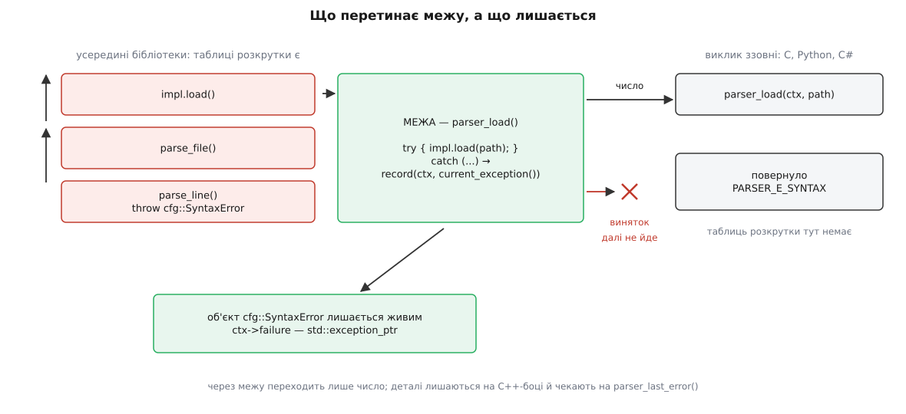
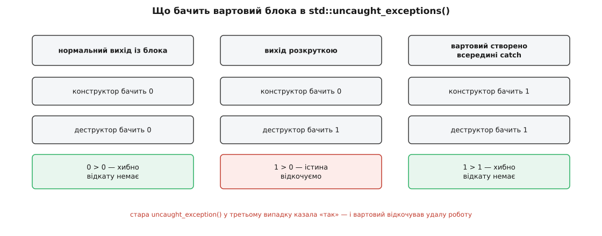

# ⚙️ Межа винятків: як загорнути C++-код у C-інтерфейс

Тут ми зберемо робочу обгортку, за якою C++-бібліотека виглядає назовні як звичайний C-модуль: неповний тип замість класу, коди повернення замість винятків і жодного шансу для винятка перетнути межу. Робити це доводиться щоразу, коли бібліотеку викликають не з C++ — із Python, C#, Go, Rust або просто з C, — а також щоразу, коли її вантажать як плагін у чужий процес: там, за межею, немає ні таблиць розкрутки, ні того, хто зловить.

Складність цієї задачі не в тому, щоб написати `catch (...)`. Вона в тому, що після `catch (...)` у вас на руках лишається повний опис відмови — тип, повідомлення, номер рядка, — а віддати назовні ви можете одне число. Уся інженерія межі — це рішення про те, що з опису виживе, що збережеться на C++-боці про запас і хто має право це запитати.

## Чому межа мусить бути

Кидок не стрибає в обробник — рантайм спершу йде вгору по кадрах і питає кожен, чи є в ньому підхожий `catch`. Питає він не сам кадр, а таблиці, які компілятор згенерував для функції-власника цього кадру. Звідси й проблема: у кадрі, що прийшов не з C++, таких таблиць нема.

Що станеться далі, залежить від того, що саме там лежить, і жоден із варіантів не є «помилкою, яку викличник обробить». Якщо між точкою кидка й дном стека стоїть кадр без даних розкрутки, рантайм не може йти далі й кличе `std::terminate`. Якщо кадри належать чужому рантайму — інтерпретаторові Python, віртуальній машині .NET, ґорутині Go, — розкрутка або не знайде для них нічого, або пройде крізь них, зруйнувавши інваріанти, які той рантайм тримає сам (карти стека для збирача сміття, свої списки очищення). Якщо ж бібліотеку завантажено через `dlopen` у процес із іншою копією стандартної бібліотеки, то виняток летить машинерією, якої хазяїн процесу не поділяє.

Спільне в усіх трьох випадках одне: **викличник не має жодного способу це обробити**. Тому не пускати виняток за межу — не питання ввічливості, а зобов'язання бібліотеки. Механіка того, як C++-функція взагалі стає видимою для C, — окрема тема: [`extern "C"` і сумісність із C-інтерфейсами](topic:sys-plang-cpp/extern-c-interop) розповідає про мовне зв'язування, спотворення імен і про те, чому `extern "C"` стосується імені та угоди про виклик, але нічогісінько не обіцяє щодо винятків. А навіщо взагалі городити C-шар, коли викличник теж міг би бути на C++, пояснює [виклик рідного коду з іншої мови](topic:sf-lang/foreign-function-interface): C-ABI — єдиний словник, який розуміють геть усі середовища, тож саме він і стає спільною мовою.



*Виняток піднімається кадрами всередині бібліотеки й зупиняється на межі; назовні виходить число, а сам об'єкт відмови лишається жити в контексті, утримуваний `std::exception_ptr`.*

## Форма межі

Заголовок мусить читатися компілятором C, тож у ньому не може бути жодного C++-типу. Звідси три рішення, кожне вимушене.

**Неповний тип замість класу.** Назовні видно `parser_ctx*` і більш нічого: ні розміру, ні розкладки, ні деструктора. Це не з міркувань краси — C-код фізично не вміє знищити C++-об'єкт, тож знищення теж мусить бути функцією нашої бібліотеки. Той самий прийом усередині C++ зветься [PIMPL](topic:sys-plang-cpp/pimpl) — сховати реалізацію за вказівником, щоб заголовок не тягнув за собою внутрішні типи; тут він доведений до краю: назовні від типу лишилося саме ім'я.

**Результат — через вихідний параметр, а повернення — під статус.** Канал повернення один, і його ми віддаємо під код помилки цілком. Особливо гостро це на створенні: конструктор не має що повертати — саме через це винятки й потрібні, — а на межі ми змушені вивернути це назад у `parser_create(parser_ctx** out)`.

**`noexcept` у C++-погляді на заголовок.** З C++17 `noexcept` — частина типу функції, тож оголошення й означення мусять збігатися; для компілятора C слово просто зникає.

```c
#ifndef PARSER_H
#define PARSER_H

/* Експорт. Решта бібліотеки збирається з -fvisibility=hidden. */
#if defined(_WIN32)
#  ifdef PARSER_BUILDING
#    define PARSER_API __declspec(dllexport)
#  else
#    define PARSER_API __declspec(dllimport)
#  endif
#else
#  define PARSER_API __attribute__((visibility("default")))
#endif

#ifdef __cplusplus
#  define PARSER_NOEXCEPT noexcept   /* з C++17 — частина типу функції */
#else
#  define PARSER_NOEXCEPT
#endif

#ifdef __cplusplus
extern "C" {
#endif

typedef enum parser_status {
    PARSER_OK          = 0,
    PARSER_E_ARG       = 1,   /* викличник передав дурницю */
    PARSER_E_SYNTAX    = 2,   /* зіпсовані вхідні дані */
    PARSER_E_IO        = 3,   /* не дочиталися */
    PARSER_E_NO_MEMORY = 4,   /* пам'ять скінчилася */
    PARSER_E_INTERNAL  = 5    /* усе інше — це наша провина */
} parser_status;

/* Неповний тип: назовні є вказівник, розміру й розкладки немає. */
typedef struct parser_ctx parser_ctx;

PARSER_API parser_status parser_create (parser_ctx** out)                 PARSER_NOEXCEPT;
PARSER_API parser_status parser_close  (parser_ctx* ctx)                  PARSER_NOEXCEPT;
PARSER_API void          parser_destroy(parser_ctx* ctx)                  PARSER_NOEXCEPT;

PARSER_API parser_status parser_load   (parser_ctx* ctx, const char* path) PARSER_NOEXCEPT;
PARSER_API parser_status parser_get_int(parser_ctx* ctx, const char* key,
                                        long* out)                        PARSER_NOEXCEPT;

/* Опис останнього збою. Ніколи не NULL; чинний до наступного виклику з цим ctx. */
PARSER_API const char*   parser_last_error(const parser_ctx* ctx)          PARSER_NOEXCEPT;

#ifdef __cplusplus
}
#endif
#endif /* PARSER_H */
```

> 🔧 **Навіщо це.** Найпоширеніша помилка проєктування такого заголовка — дзеркалити в переліку всю ієрархію винятків бібліотеки: сорок кодів на сорок типів. Але код повернення потрібен не для опису світу, а для **розгалуження**: викличник має вирішити, чи повторювати спробу, чи питати користувача, чи здаватися. Розгалужень у нього три-чотири, тож і кодів має бути стільки ж, а весь багатий опис іде окремим каналом — рядком у журнал і збереженим об'єктом для точного запиту. Перелік проєктують від того, **що викличник може зробити**, а не від того, що бібліотека вміє кинути.

## Одна обгортка на всі експортовані функції

Тепер саме перетворення. Кортить написати повний ланцюг `catch` просто в шаблонній обгортці — і це буде помилка, яку видно не одразу.

Шаблон інстанціюється **один раз на кожну експортовану функцію**. Ланцюг із шести гілок `catch` — це шість записів у таблиці типів, шість посилань на `typeinfo` і код гілок; помножте на сорок експортів — і ви заплатили розміром бінарника за те саме сорок разів. Тому тіло шаблона тримаємо крихітним, а всю класифікацію виносимо в **звичайну функцію**, яка існує в одному примірнику. Про те, чому кожне інстанціювання коштує окремо і як цю ціну міряти, — [ціна інстанціювання](topic:sys-plang-cpp/instantiation-cost).

```cpp
#define PARSER_BUILDING
#include "parser.h"

#include <cstdio>
#include <exception>
#include <new>
#include <stdexcept>
#include <system_error>
#include <utility>

#include "cfg/parser.hpp"   // справжня реалізація: кидає так, як їй зручно

// Неповний тип із заголовка стає повним рівно тут — і далі нікуди не витікає.
struct parser_ctx {
    cfg::Parser        impl;
    std::exception_ptr failure;              // сам об'єкт відмови, а не переказ
    char               message[256] = "ok";  // масив, а не std::string: повідомити
};                                           // про вичерпану пам'ять теж треба

namespace {

// snprintf нічого не виділяє й нічого не кидає — саме тому не рядок.
void set_message(parser_ctx* ctx, const char* text) noexcept {
    std::snprintf(ctx->message, sizeof ctx->message, "%s", text ? text : "");
}

// НЕ шаблон: ланцюг catch потрапляє в бінарник рівно один раз.
// Порядок гілок — від похідних до базових: перемагає перша підхожа.
parser_status record(parser_ctx* ctx, std::exception_ptr e) noexcept {
    ctx->failure = e;                       // присвоєння exception_ptr — noexcept
    try {
        std::rethrow_exception(e);
    }
    catch (const cfg::SyntaxError& ex)      { set_message(ctx, ex.what());
                                              return PARSER_E_SYNTAX; }
    catch (const std::bad_alloc&)           { set_message(ctx, "out of memory");
                                              return PARSER_E_NO_MEMORY; }
    catch (const std::system_error& ex)     { set_message(ctx, ex.what());
                                              return PARSER_E_IO; }
    catch (const std::invalid_argument& ex) { set_message(ctx, ex.what());
                                              return PARSER_E_ARG; }
    catch (const std::exception& ex)        { set_message(ctx, ex.what());
                                              return PARSER_E_INTERNAL; }
    catch (...)                             { set_message(ctx, "unknown exception");
                                              return PARSER_E_INTERNAL; }
}

// Обгортка межі. Тіло навмисно крихітне — усе, що можна винести з шаблона,
// винесено в record().
template <class Fn>
parser_status boundary(parser_ctx* ctx, Fn&& fn) noexcept {
    if (!ctx) return PARSER_E_ARG;
    try {
        set_message(ctx, "ok");
        ctx->failure = nullptr;
        std::forward<Fn>(fn)();
        return PARSER_OK;
    } catch (...) {
        return record(ctx, std::current_exception());
    }
}

} // namespace
```

Далі експортовані функції стають однорядковими, і в кожній видно рівно її змістовну частину:

```cpp
parser_status parser_create(parser_ctx** out) noexcept {
    if (!out) return PARSER_E_ARG;
    *out = nullptr;
    try {
        *out = new parser_ctx{};    // кине конструктор cfg::Parser — рантайм
        return PARSER_OK;           // сам поверне щойно виділену пам'ять
    }
    catch (const std::bad_alloc&) { return PARSER_E_NO_MEMORY; }
    catch (...)                   { return PARSER_E_INTERNAL; }
}

parser_status parser_load(parser_ctx* ctx, const char* path) noexcept {
    return boundary(ctx, [&] {
        if (!path) throw std::invalid_argument("path == nullptr");
        ctx->impl.load(path);
    });
}

parser_status parser_get_int(parser_ctx* ctx, const char* key, long* out) noexcept {
    return boundary(ctx, [&] {
        if (!key || !out) throw std::invalid_argument("null argument");
        *out = ctx->impl.get_int(key);
    });
}

const char* parser_last_error(const parser_ctx* ctx) noexcept {
    return ctx ? ctx->message : "null context";
}
```

Зверніть увагу на `parser_create`: це єдина функція, у якій деталі відмови справді втрачаються — контексту, куди їх покласти, ще не існує. Тому перелік кодів мусить бути самодостатнім бодай для цього одного випадку.

## Деталі, які лишилися на C++-боці

Рядок `message` — це переказ. Він годиться для журналу й нікуди більше: за ним не можна спитати номер рядка, не можна відрізнити тимчасову мережеву відмову від остаточної. Тому поруч ми зберегли `failure` — `std::exception_ptr`, розділюваного власника **того самого** об'єкта винятка. Він утримує об'єкт живим після виходу з `catch`, тож пізніше можна поставити точне запитання:

```cpp
// Другий поверх діагностики: номер рядка, якщо збій був саме синтаксичний.
parser_status parser_error_line(const parser_ctx* ctx, int* out) noexcept {
    if (!ctx || !out || !ctx->failure) return PARSER_E_ARG;
    try {
        std::rethrow_exception(ctx->failure);   // єдиний спосіб спитати про тип
    }
    catch (const cfg::SyntaxError& ex) { *out = ex.line(); return PARSER_OK; }
    catch (...)                        { return PARSER_E_INTERNAL; }
}
```

Формулювання «єдиний спосіб» тут буквальне: до C++26 у мові не було способу спитати `exception_ptr`, що в ньому лежить, окрім як кинути його ще раз і спіймати. Тобто кожен діагностичний запит оплачується повним кидком. У C++26 ухвалено папір P2927R3, і з ним з'явилася `std::exception_ptr_cast<E>(p)`: вона повертає `const E*`, якщо обробник `const E&` підійшов би цьому об'єктові, і `nullptr` інакше — без жодного кидка. Наявність перевіряють макросом `__cpp_lib_exception_ptr_cast` зі значенням `202506`; станом на середину 2026-го цю функцію мають GCC 16 і Clang 22, MSVC — ще ні.

```cpp
// та сама відповідь, але без повторного кидка — тіло parser_error_line на C++26
#if defined(__cpp_lib_exception_ptr_cast) && __cpp_lib_exception_ptr_cast >= 202506L
    if (const auto* ex = std::exception_ptr_cast<cfg::SyntaxError>(ctx->failure)) {
        *out = ex->line();
        return PARSER_OK;
    }
    return PARSER_E_INTERNAL;
#endif
```

## Вартовий блока: відрізнити нормальний вихід від розкрутки

`parser_load` у наведеному вигляді має ваду. Якщо `impl.load` кинув на середині, контекст лишається напівзаповненим: частина ключів нових, частина старих. Викличник отримав `PARSER_E_SYNTAX`, вирішив спробувати інший файл — і працює з мішаниною.

Полагодити це означає **відкотити зміни, але тільки при відмові**. Просте `catch` тут не годиться: обробник довелося б писати в кожній функції, а відкат мусить статися до того, як керування вийде з блока. Потрібен об'єкт, який у своєму деструкторі сам розуміє, як саме з блока виходять.

Наївне рішення — прапорець `committed`, який треба не забути виставити наприкінці вдалого шляху. Забудете — відкотиться вдала робота. Надійніше спитати не себе, а рантайм: `std::uncaught_exceptions()` повертає **кількість** винятків, що зараз летять. Запам'ятали це число в конструкторі, порівняли в деструкторі — і різниця точно каже, чи додався виняток саме за час життя вартового.

```cpp
// Вартовий блока: виконує дію лише тоді, коли з блока виходять розкруткою.
template <class F>
class on_unwind {
public:
    explicit on_unwind(F f) : undo_(std::move(f)), depth_(std::uncaught_exceptions()) {}
    on_unwind(const on_unwind&)            = delete;
    on_unwind& operator=(const on_unwind&) = delete;

    ~on_unwind() {
        if (std::uncaught_exceptions() > depth_) {
            try { undo_(); } catch (...) {}   // з деструктора не кидають
        }
    }
private:
    F   undo_;
    int depth_;
};
template <class F> on_unwind(F) -> on_unwind<F>;   // виведення типу з C++17
```

Уживається він так — і `parser_load` нарешті обіцяє викличникові щось певне:

```cpp
parser_status parser_load(parser_ctx* ctx, const char* path) noexcept {
    return boundary(ctx, [&] {
        if (!path) throw std::invalid_argument("path == nullptr");
        auto snapshot = ctx->impl.snapshot();
        on_unwind rollback{[&] { ctx->impl.restore(std::move(snapshot)); }};
        ctx->impl.load(path);      // кинуло — відкат; ні — вартовий мовчить
    });
}
```

Тепер після `PARSER_E_SYNTAX` контекст такий самий, яким був до виклику. Обіцянка, яку ми щойно дали, має усталену назву — **сильна гарантія**, і сама собою вона не з'являється: її будують навмисно, знімком і відкотом. Коли така гарантія варта своєї ціни, а коли досить базової, розбирають [гарантії безпеки винятків](topic:sys-plang-cpp/exception-safety-guarantees).

Чому саме `uncaught_exceptions()` у множині, а не стара `uncaught_exception()` в однині — видно на третьому випадку.



*Вартовий порівнює лічильник у конструкторі й у деструкторі; саме різниця, а не сам факт «зараз щось летить», дає правильну відповідь у всіх трьох випадках.*

Вартовий, створений **усередині** обробника, бачить у конструкторі одиницю: виняток уже спійманий, але ще активний. У деструкторі він побачить ту саму одиницю — різниці немає, відкату немає, і це правильно. Стара булева функція в цьому місці казала «так» і відкочувала вдалу роботу; саме через цю пастку її оголосили застарілою в C++17 і прибрали в C++20.

## Скільки це коштує

```
успішний виклик через межу
  перевірка вказівника, лямбда вбудовується      одиниці наносекунд
  вхід у try                                     0 інструкцій (таблична схема)

один збій
  throw + дві фази розкрутки до межі             ~1 мкс
  current_exception() — лічильник посилань       десятки наносекунд
  record(): rethrow_exception + добір гілки      ще ~1 мкс
  разом на одну відмову                          одиниці мікросекунд

розмір бінарника
  один ланцюг catch на всю бібліотеку            замість N ланцюгів,
                                                 по одному на кожен експорт
```

Головне число тут — **другий кидок** усередині `record`. Ми свідомо платимо повторною розкруткою за те, щоб ланцюг `catch` існував в одному примірнику. Це правильний розмін, доки межу переходять одиниці відмов на секунду; у гарячому циклі так робити не можна — там межа має повертати значення, а не кидати.

## Пастки

**Потік усередині бібліотеки — це друга межа.** Виняток, що покидає стартову функцію потоку, викликає `std::terminate` без жодного шансу на перехоплення: у викличника `std::thread` немає стека, куди цей виняток міг би прилетіти ([`thread` і `jthread`](topic:sys-plang-cpp/std-thread-jthread) — про це та про те, чому `jthread` приєднується сам). Тож тіло кожного робітника загортається так само:

```cpp
void worker_main(parser_ctx* ctx, job_queue& q, std::stop_token stop) noexcept {
    while (auto job = q.pop(stop)) {
        try {
            (*job)();
        } catch (...) {
            std::lock_guard lk{ctx->async_mtx};      // слот спільний між потоками
            ctx->failure = std::current_exception();
            set_message(ctx, "async failure");
        }
    }
}
```

Копіювати сам `std::exception_ptr` між потоками безпечно — на те він і розділюваний власник, — а от **слот**, у який ми пишемо, спільний, і його треба захищати. Якщо ж робота ставиться поштучно й на кожну є хто чекає, усю цю ручну роботу робить за вас `std::packaged_task`: він ловить виняток сам і кладе його у `future` через `set_exception`, і це той самий `exception_ptr` під капотом ([`future` й `promise`](topic:sys-plang-cpp/future-promise)).

**`noexcept` на межі — сітка, а не ліки.** Позначка `noexcept` не заважає винятку вилетіти; вона перетворює виліт на негайний `std::terminate`. Це краще за розкрутку в чужий кадр — падіння детерміноване, стек цілий, аварійний дамп читається, — але це аварія, а не оброблена помилка. Ставити `noexcept` варто саме як останній рубіж **позаду** `catch (...)`, а не замість нього. Окремо запам'ятайте: `extern "C"` не означає `noexcept` — мовне зв'язування каже про ім'я й угоду про виклик, а про винятки не каже нічого. Що ще змінює ця обіцянка — вибір швидшого шляху в контейнерах, відсутність таблиць — розібрано в темі [`noexcept`: обіцянка й наслідки](topic:sys-plang-cpp/noexcept). У MSVC є ще й свій нюанс: типова модель `/EHsc` містить літеру `c`, яка означає «вважати, що функції з C-зв'язуванням не кидають», — на цьому припущенні компілятор прибирає код очищення, і порушення обіцянки коштує дорожче, ніж здається.

**Зрізання перетворюється на неправильний код помилки.** Спокуса зберегти деталі найпростішим способом виглядає так:

```cpp
catch (const std::exception& e) { ctx->saved = e; }   // ← копія в std::exception
```

Тут від `cfg::SyntaxError` лишається базовий підоб'єкт: тип, номер рядка й справжній текст зникають. Те саме робить проміжний шар, який пише `catch (const X& e) { log(e); throw e; }` — після нього до межі долітає вже голий базовий тип. Підступність у тому, що **нічого не падає**: `record` просто не впізнає типу, гілка `cfg::SyntaxError` не спрацьовує, і назовні йде `PARSER_E_INTERNAL` замість `PARSER_E_SYNTAX`. Помилка виявляється не аварією, а тихо неправильним кодом повернення. Ліки — `std::exception_ptr` для збереження й порожній `throw;` для продовження.

**Видимість символів типів між динамічними бібліотеками.** Збігання типу в `catch` перевіряється в час виконання за `std::type_info`, а не за структурою класу. Якщо бібліотеку зібрано з `-fvisibility=hidden` (а так і треба: назовні мають стирчати лише експортовані C-функції), то `typeinfo` внутрішніх класів локальний для кожного об'єктного модуля. Коли тип кидають в одній динамічній бібліотеці, а ловлять в іншій, збігання може мовчки не відбутися — і виняток провалиться в `catch (...)`. Проявляється це так само тихо, як зрізання: правильний код, неправильна гілка.

Тут варто побачити приємне: **наша межа від цієї біди захищена за побудовою**. Тип кидають і класифікують усередині однієї й тієї самої динамічної бібліотеки — `record` живе поруч із `cfg::SyntaxError`, — а назовні йде число, яке жодних символів не потребує. Пастка лишається для протилежного напрямку: коли плагін кидає C++-тип у хазяїна процесу. Якщо такий обмін таки потрібен, тип винятка позначають явною видимістю — `__attribute__((visibility("default")))` — і дають йому **ключову функцію**: віртуальний деструктор, означений поза класом, в одному-єдиному `.cpp`. Тоді таблиця віртуальних функцій і `typeinfo` народжуються рівно в одній одиниці трансляції, а не в кожній, що бачила заголовок. Ця залежність від рантайму й компонування — з родини проблем, зібраних у темі [стабільність ABI у C++](topic:sys-plang-cpp/abi-stability-cpp), а самі правила пошуку символів у час завантаження описує [динамічне лінкування](topic:sf-lang/dynamic-linking).

**`catch (...)` ловить не лише C++-винятки.** У glibc скасування потоку й `pthread_exit` реалізовані **примусовою розкруткою** — тією самою машинерією, лише з особливим псевдовинятком (libstdc++ зве його `__cxxabiv1::__forced_unwind`). Ваш `catch (...)` спіймає і його теж, а якщо не кине далі — потік, який мав завершитися, продовжить роботу зі зруйнованим стеком, і бібліотека аварійно зупинить процес зі скаргою, що виняток не перекинули далі. Це властивість реалізації (glibc і NPTL), а не мови; сама libstdc++ у своїх обгортках навколо чужого коду цей тип ловить окремо й одразу перекидає. Практичний висновок простіший, ніж лікування симптому: `pthread_cancel` у C++-коді не вживають узагалі, а скасування роблять кооперативним — [`stop_token`](topic:sys-plang-cpp/stop-token) саме про цей спосіб. На Windows є дзеркальна пастка: під `/EHa` `catch (...)` починає ловити ще й структурні винятки операційної системи, зокрема звернення за нульовою адресою, — і межа, яка «обробила» пошкодження пам'яті й повернула код помилки, набагато гірша за чесне падіння.

**Функція, яка не має чим відмовити.** `parser_destroy` повертає `void` — інакше й бути не може, бо викличник на C викликає її в дорозі до виходу й нічого перевіряти не стане. Але деструктор `cfg::Parser` неявно `noexcept`, тож усе, що вміє відмовити — дописати буфер на диск, коректно закрити сокет, — не сміє бути в деструкторі. Звідси правило межі: **розділяйте «доробити роботу» і «звільнити пам'ять»**. Перше — окрема функція `parser_close`, що повертає статус і яку викличник може перевірити; друге — `parser_destroy`, яка лише звільняє й не має права на невдачу. Заголовок вище саме тому має обидві.
