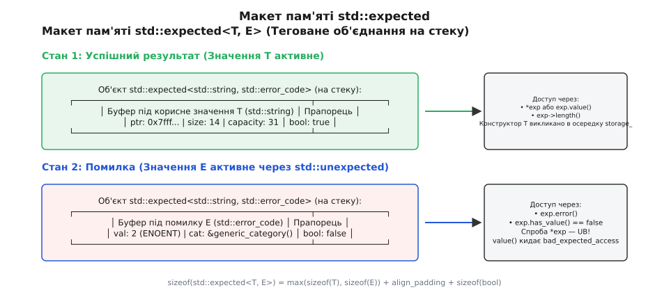
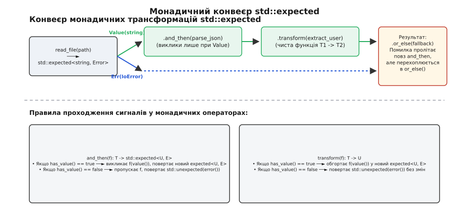
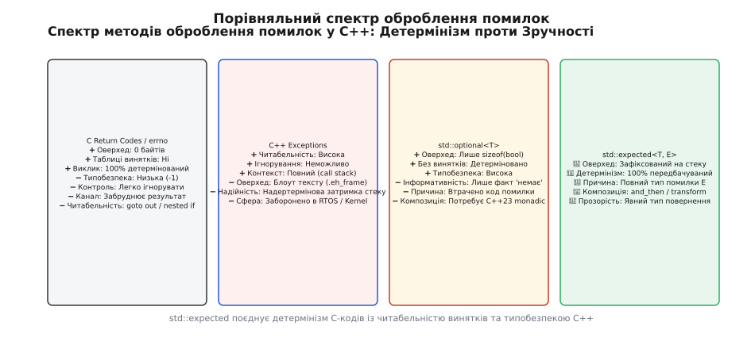

# Виразне та детерміноване оброблення помилок через std::expected

<preknowlist>
- Концепція категорій помилок та статусів системних викликів C (`errno`, коди повернення).
- [Механізм винятків C++](topic:sys-plang-cpp/exceptions-mechanism) (`throw`, `try-catch`) та ціна розгортання стеку.
- [Семантика переміщення C++](topic:sys-plang-cpp/move-semantics) (`std::move`, rvalue-посилання).
- [Алгебраїчний тип std::optional](topic:sys-plang-cpp/optional) та [std::variant](topic:sys-plang-cpp/variant-and-visit).
</preknowlist>

Коли системний виклик читання з мережевого сокета завершується помилкою через обрив з'єднання, програма опиняється на роздоріжжі двох історично сформованих моделей оброблення помилок. Перша модель, успадкована з мови C, повертає від'ємне число або кодовий прапорець статусу. Вона вимагає ручного перевіряння оператором `if` після кожного виклику, допускає випадкове ігнорування збоїв компілятором і змушує передавати корисний результат через вихідні поінтери. Друга модель, введена в C++98, кидає виняток `throw`. Вона відокремлює "щасливий шлях" від обробки помилок, але створює неявні альтернативні канали керування, вимагає складних таблиць розгортання стеку `.eh_frame` і спричиняє деструктивні затримки в runtime при виникненні помилок.

Стандарт C++23 вирішує цей фундаментальний розкол, вводячи шаблон `std::expected<T, E>`. Він поєднує детермінованість та продуктивність C-кодів повернення з виразністю, типобезпекою та абстракцією високого рівня, притаманною функціональним мовам програмування. Про історичну еволюцію підходів до помилок у C та C++ детальніше читайте у вставці ([історичний екскурс](topic:sys-plang-cpp/expected-error-handling/hist-error-handling-evolution.md)).

---

## 1. Анатомія std::expected: структура, пам'ять та внутрішній дискримінатор

Шаблон `std::expected<T, E>` являє собою вирівняне теговане об'єднання (tagged union), здатне зберігати або корисне навантаження успішного обчислення типу `T`, або значення помилки типу `E`. На відміну від `std::variant<T, E>`, який є семантично симетричною сумою типів, `std::expected` розставляє чіткі асиметричні акценти: тип `T` є первинним очікуваним результатом, а тип `E` — винятковим станом невдачі.

### Фізичне розміщення у пам'яті (Memory Footprint)

З точки зору розміщення в операційній пам'яті, об'єкт `std::expected` гарантує відсутність будь-яких динамічних виділень пам'яті в купі (`heap`). Обидва значення розміщуються всередині одного буфера на стеку або всередині батьківської структури даних.


*Фізичний макет об'єкта std::expected у пам'яті: спільно використовуваний буфер для T або E з прапорцем дискримінатора states.*

Розмір об'єкта `sizeof(std::expected<T, E>)` розраховується як сума максимального розміру між `sizeof(T)` та `sizeof(E)`, розміру дискримінатора `sizeof(bool)` та байтів заповнення (padding), необхідних для дотримання вимог вирівнювання `alignof`:

```cpp
sizeof(std::expected<T, E>) = align_up(max(sizeof(T), sizeof(E)), alignof(bool)) + sizeof(bool) + padding
```

#### Приклад розрахунку байтового зсуву для std::expected<double, int>:
- `sizeof(T) = sizeof(double) = 8 байтів`, `alignof(double) = 8`.
- `sizeof(E) = sizeof(int) = 4 байти`, `alignof(int) = 4`.
- Максимальний розмір буфера: `max(8, 4) = 8 байтів`.
- Дискримінатор: `sizeof(bool) = 1 байт`.
- Байтове заповнення (padding): для вирівнювання всієї структури за межею 8 байтів додається 7 байтів padding.
- Фінальний розмір: `8 (буфер) + 1 (bool) + 7 (padding) = 16 байтів`.

Завдяки такій структурі при передачі малих тривіально копійованих типів (наприклад, `std::expected<int, std::error_code>`) компілятори GCC та Clang оптимізують передачу об'єкта безпосередньо через регістри CPU `RAX` та `RDX`. Це дає нульовий оверхед порівняно з передачею сирої C-структури.

---

## 2. Створення та розв'язання неоднозначностей: std::unexpected та std::unexpect

Оскільки типи `T` та `E` можуть збігатися — наприклад, у функції парсингу `std::expected<int, int>`, де успішне значення є обчисленим числом, а помилка є кодом HTTP 404 — виникає фундаментальна семантична неоднозначність при конструюванні.

Для однозначного повідомлення компілятору про створення об'єкта у стані помилки стандарт C++23 вводить два маркувальні інструменти:
1. **Обгортка `std::unexpected<E>`**: виступає явним сигнатурним маркером для повернення помилки з функцій.
2. **Тег `std::unexpect`**: використовується для конструювання помилки за місцем у внутрішньому буфері (in-place construction) без створення тимчасових об'єктів.

```cpp
#include <expected>
#include <string>

// Функція обчислення математичного квадратного кореня
std::expected<double, std::string> safe_sqrt(double val) {
    if (val < 0.0) {
        // Явне конструювання помилки через std::unexpected
        return std::unexpected("Спроба обчислити квадратний корінь з від'ємного числа");
    }
    return std::sqrt(val); // Автоматичне неявне конструювання T у буфері
}

// In-place конструювання складної помилки без копіювання
std::expected<std::string, ComplexError> parse_data() {
    // Тег std::unexpect передає аргументи безпосередньо в конструктор ComplexError
    return std::expected<std::string, ComplexError>(std::unexpect, "Помилка парсингу", 500);
}
```

Якщо тип `T` підтримує default-конструктор, створення `std::expected<T, E> res;` ініціалізує об'єкт у стані успіху зі значенням `T()`. Повну специфікацію всіх перевантажень конструкторів та методів доступу можна переглянути у довіднику інтерфейсу ([довідник інтерфейсу](topic:sys-plang-cpp/expected-error-handling/api-expected-monadic-ops.md)).

---

## 3. Безпека доступу: незахищений, захищений та резервний доступ

Клас `std::expected` пропонує три різні моделі доступу до корисного навантаження, залежно від вимог до швидкодії та гарантій типобезпеки у конкретній точці програми.

### 1. Незахищений доступ (Unchecked Access — O(1) noexcept)

Використання разіменування через `operator*` або `operator->` надає максимальну швидкість виконання без жодних перевірок у runtime. Компілятор не генерує додаткових машинних інструкцій перевірки прапорця `has_value()`.

```cpp
std::expected<int, std::string> res = 42;

if (res.has_value()) { // або if (res)
    int val = *res; // Швидкий доступ без runtime-перевірок
}
```

*Критичне застереження*: Викликати `operator*` або `operator->` на об'єкті, який перебуває у стані помилки (`has_value() == false`), є **невизначеною поведінкою (Undefined Behavior)**. У release-збірках це може призвести до зчитування некоректного вмісту пам'яті помилки `E` під виглядом типу `T`.

### 2. Захищений доступ (Checked Access через .value())

Метод `.value()` здійснює runtime-перевірку внутрішнього прапорця дискримінатора. Якщо об'єкт містить успішне значення `T`, метод повертає посилання на нього. Якщо об'єкт містить помилку `E`, метод перериває нормальне виконання та кидає виняток `std::bad_expected_access<E>(error())`.

```cpp
std::expected<int, const char*> res = std::unexpected("Помилка доступу");

try {
    int val = res.value(); // Кидає std::bad_expected_access
} catch (const std::bad_expected_access<const char*>& ex) {
    // ex.error() містить оригінальний об'єкт помилки "Помилка доступу"
}
```

### 3. Резервний доступ (Fallback Access через .value_or())

Метод `.value_or(default_value)` дозволяє безпечно вилучити значення, підставляючи альтернативний варіант у разі виникнення помилки, не вдаючись до використання умовних операторів або винятків:

```cpp
std::expected<std::string, int> res = std::unexpected(404);
std::string host = res.value_or("localhost"); // Повертає "localhost"
```

---

## 4. Декларативна обробка помилок через монадичні оператори C++23

Традиційне оброблення помилок на кодах повернення часто призводить до так званого "синдрому драбини" (ladder pattern) або каскадів умовних операторів `if (!res.has_value()) return std::unexpected(res.error());`, які розривають цілісність сприйняття алгоритму.

C++23 розв'язує цю проблему, додаючи чотири монадичні оператори трансформації: `and_then`, `transform`, `or_else` та `transform_error`. Вони дозволяють будувати суцільні конвеєри оброблення даних у декларативному функціональному стилі.


*Схема проходження даних у монадичному конвеєрі: автоматичне коротке замикання (short-circuit) при виникненні помилки.*

### Семантика монадичних методів:

1. **`and_then(f)` (Monadic Bind)**:
   Приймає лямбда-функцію `f`, яка приймає значення `T` і сама повертає новий `std::expected<U, E>`. Якщо поточний об'єкт містить значення, викликається `f`. Якщо поточний об'єкт містить помилку, виклик `f` оминається, а помилка автоматично прокидається далі за конвеєром.
2. **`transform(f)` (Monadic Map)**:
   Застосовується для чистих трансформацій корисного навантаження. Лямбда `f` приймає `T` і повертає `U`. Результат автоматично обгортається у новий `std::expected<U, E>`.
3. **`or_else(f)` (Monadic Recovery / Catch)**:
   Застосовується для перехоплення помилки. Лямбда `f` приймає об'єкт помилки `E` і повертає новий `std::expected<T, F>`. Це дозволяє відновитися після збою (наприклад, використати кеш або повернути резервне значення).
4. **`transform_error(f)` (Monadic Error Mapping)**:
   Застосовується для адаптації або трансляції типів помилок при переході між шарами архітектури. Лямбда `f` приймає `E` і повертає `F`.

```cpp
// Декларативний конвеєр зчитування та парсингу налаштувань
std::expected<Config, AppError> load_config(std::string_view path) {
    return read_file_to_string(path)           // std::expected<std::string, AppError>
        .and_then(parse_json_structure)       // std::expected<JsonDoc, AppError>
        .and_then(validate_config_schema)     // std::expected<Config, AppError>
        .transform([](Config cfg) {
            cfg.is_loaded_from_cache = false;
            return cfg;
        })
        .or_else([](AppError err) -> std::expected<Config, AppError> {
            if (err == AppError::FileNotFound) {
                return Config::get_default(); // Відновлення після відсутності файлу
            }
            return std::unexpected(err); // Прокидання інших помилок далі
        });
}
```

Практичний проект з описом побудови повного конвеєра обробки мережевих конфігурацій зі зіставленням C та C++23 кодів наведено у вставці ([практичний проект](topic:sys-plang-cpp/expected-error-handling/proj-expected-pipeline.md)).

---

## 5. Монадичні закони та теоретичне підґрунтя

З точки зору теорії категорій та функціонального програмування, шаблон `std::expected<T, E>` є реалізацією **монади помилки** (Either Monad / Result Monad). Для збереження математичної коректності компіляторів та оптимізаторів, метод `.and_then()` підпорядковується трьом фундаментальним монадичним законам:

### 1. Закон лівої одиниці (Left Identity)
Якщо ми обгортаємо значення `x` у `std::expected` і передаємо його через `.and_then(f)`, результат обов'язково тотожний прямому виклику `f(x)`:
```cpp
std::expected<int, Error> val = x;
val.and_then(f) == f(x);
```

### 2. Закон правої одиниці (Right Identity)
Якщо ми застосовуємо до об'єкта `m` метод `.and_then()` з конструктором успіху (або лямбдою `[](auto&& v) { return std::expected<T, E>(v); }`), підсумковий об'єкт залишається незмінним:
```cpp
m.and_then([](auto&& v) { return std::expected<T, E>(v); }) == m;
```

### 3. Закон асоціативності (Associativity)
Послідовне зв'язування трьох функцій через `.and_then()` дає тотожний результат незалежно від того, як згруповано виклики:
```cpp
m.and_then(f).and_then(g) == m.and_then([&](auto&& x) { return f(x).and_then(g); });
```

Дотримання цих законів гарантує, що рефакторинг та розбиття складних монадичних конвеєрів у C++23 не змінює семантику виконання програми.

---

## 6. Спеціалізація std::expected<void, E>

У системному програмуванні значний відсоток процедур запису, відправки пакетів або синхронізації не повертає обчисленого значення при успіху (повертають `void`), але можуть зазнати збою. Для таких операцій стандарт надає спеціалізацію `std::expected<void, E>`.

### Особливості семантики `std::expected<void, E>`:
- Об'єкт у стані успіху не зберігає жодних даних `T`. Фізичний розмір об'єкта визначається лише `sizeof(E) + sizeof(bool)`.
- Конструктор за замовчуванням створює об'єкт у стані успіху: `std::expected<void, SystemError> res;`.
- Оператори разіменування `operator*` та `operator->` вилучено з інтерфейсу.
- Монадичний метод `.and_then(f)` приймає лямбда-функцію без аргументів (`f()`), яка викликається лише при успішному стані.

```cpp
std::expected<void, SystemError> write_bytes(int fd, const void* data, size_t len) {
    if (::write(fd, data, len) < 0) {
        return std::unexpected(SystemError::WriteFailed);
    }
    return {}; // Створення успішного стану expected<void, E>
}
```

---

## 7. Перехід між станами та гарантії винятків (Exception Safety)

Операції присвоєння та свопу (`swap`) для `std::expected<T, E>` є фундаментально складнішими за аналогічні операції в контейнерах зі статичним типом, оскільки об'єкт може змінювати свій активний стан від `T` до `E` і навпаки.

### Сценарії зміни стану при присвоєнні (`rhs = lhs`):
1. **Обидва об'єкти містять `T`**: відбувається звичайне копіювання чи переміщення `val_ = rhs.val_`.
2. **Обидва об'єкти містять `E`**: відбувається копіювання чи переміщення помилки `unex_ = rhs.unex_`.
3. **Об'єкт зміщується від `T` до `E`**: 
   - Викликається деструктор поточного значення `val_.~T()`.
   - За допомогою placement new створюється об'єкт помилки `::new (std::addressof(unex_)) E(rhs.unex_)`.
   - Прапорець `has_value_` змінюється на `false`.
4. **Об'єкт зміщується від `E` до `T`**:
   - Викликається деструктор помилки `unex_.~E()`.
   - За допомогою placement new створюється нове значення `::new (std::addressof(val_)) T(rhs.val_)`.
   - Прапорець `has_value_` змінюється на `true`.

### Гарантія нейтральності до винятків (Exception Neutrality):
Якщо під час створення нового стану в точках 3 чи 4 конструктор `T` або `E` кидає виняток, об'єкт `std::expected` залишається у стабільному стані. Специфікатор `noexcept` автоматично виводиться для конструкторів переміщення `std::expected`, якщо обидва внутрішні типи гарантують `std::is_nothrow_move_constructible_v`.

---

## 8. Порівняльний архітектурний аналіз підходів до обробки помилок

Для свідомого вибору стратегії оброблення помилок у проектах розлянемо порівняльну матрицю компромісів між основними підходами мов C та C++:


*Матриця компромісів між підходами до обробки помилок: C-коди повернення, винятки C++, std::optional та std::expected.*

### Деталізація метрик порівняння:

| Критерій порівняння | C Return Codes (`errno`) | C++ Exceptions (`throw`) | `std::optional<T>` | `std::expected<T, E>` |
| :--- | :--- | :--- | :--- | :--- |
| **Витрати у Happy Path** | Мінімальні (перевірка `if`) | **Нульові** (у zero-cost ABI) | Мінімальні (перевірка `if`) | Мінімальні (перевірка `if`) |
| **Витрати при виникненні помилки** | Мінімальні (1 такт CPU) | **Величезні** (1000+ тактів на unwind) | Мінімальні (1 такт CPU) | **Мінімальні** (1 такт CPU) |
| **Розмір бінарного файлу** | Мінімальний | Збільшений на 15–30% (`.eh_frame`) | Мінімальний | **Мінімальний** (0% `.eh_frame`) |
| **Контроль компілятором** | Слабкий (можна проігнорувати) | Відсутній у сигнатурі | Високий (типобезпечний) | **Максимальний** (`[[nodiscard]]`) |
| **Придатність для Hard Real-Time** | Повна | Непридатний (недетермінований) | Повна | **Повна** (100% детермінований) |
| **Придатність для embedded / kernel** | Повна | Вимагає runtime-підтримки | Повна | **Повна** (без кучі та unwind) |

---

## 9. Сумісність із constexpr та обчислення на етапі компіляції

Усі конструктори, деструктори, оператори доступу та монадичні трансформації шаблону `std::expected` у C++23 позначені специфікатором `constexpr`. Це дозволяє здійснювати повну перевірку оброблення помилок і побудову складних конвеєрів ще на етапі компіляції програми.

```cpp
constexpr std::expected<int, const char*> parse_digit(char c) {
    if (c >= '0' && c <= '9') {
        return c - '0';
    }
    return std::unexpected("Не є цифрою");
}

// Виконання парсингу та валідації під час збірки проєкту
constexpr auto result = parse_digit('7')
    .transform([](int val) { return val * 10; });

static_assert(result.has_value());
static_assert(*result == 70);
```

Можливість використання `std::expected` у `constexpr`-контексті відкриває нові горизонти для створення статично верифікованих парсерів протоколів, компіляції шаблонів та перевірки конфігурацій до запуску бінарника на виконання.

---

## 10. Взаємодія з C++20 Концептами (Concepts) та метапрограмуванням

Шаблон `std::expected` інтегрується із системою концептів C++20. Для перевірки того, чи є довільний тип об'єктом `std::expected`, розробники можуть використовувати власні концептуальні trait-адаптери:

```cpp
template <typename T>
struct is_expected : std::false_type {};

template <typename T, typename E>
struct is_expected<std::expected<T, E>> : std::true_type {};

template <typename T>
concept ExpectedType = is_expected<std::remove_cvref_t<T>>::value;

// Функція, що приймає лише результати типу std::expected
template <ExpectedType E>
void process_result(E&& res) {
    if (res) {
        // Обробка корисного навантаження
    }
}
```

Це дозволяє будувати високорівневі метапрограми та шаблонні бібліотеки, які адаптують свою поведінку залежно від того, чи повернула функція звичайне значення, чи об'єкт `std::expected`.

---

## 11. Зіставлення з аналогами: Rust Result, Boost.Outcome та tl::expected

До появі стандарту C++23 спільнота мови розробила декілька сторонніх реалізацій контейнера помилок:

1. **`tl::expected` (Таррен Лайбман / TartanLlama)**:
   Прямий попередник стандарту C++23. Реалізація `tl::expected` розроблялася як еталонний прототип для комітету ISO C++ (WG21). Вони мають майже 100% тотожність методів, що дозволяє легко портувати код з C++17/20 на C++23 шляхом простої заміни простору назв `tl::` на `std::`.
2. **`Boost.Outcome`**:
   Бібліотека Boost пропонує два основні шаблони: `boost::outcome_v2::result<T, EC>` та `boost::outcome_v2::outcome<T, EC, EP>`. На відміну от `std::expected`, `outcome` здатний зберігати три стани одночасно: успішне значення `T`, системну помилку `EC` та об'єкт винятку `std::exception_ptr` `EP`. Це робить Boost.Outcome зручним для складних підсистем, де потрібно поєднувати коди повернення з винятками.
3. **`Result<T, E>` у мові Rust**:
   Фундаментальний тип оброблення помилок у мові Rust. `std::expected` у C++23 фактично повторює семантику `Result<T, E>`, надаючи методи `.and_then()` (тотожний `and_then` у Rust) та `.transform()` (тотожний `map` у Rust). Основна відмінність полягає у семантиці мов: у Rust перевірка вмісту гарантується конструкцією `match` або синтаксичним цукром `?`, тоді як у C++ розробник оперує методами `.has_value()` та монадичними адаптерами.

---

## 12. Межа інтеграції: трансформація винятків у std::expected і навпаки

У реальних промислових системах C++23 код на `std::expected` змушений співіснувати із застарілими бібліотеками, які кидають винятки (наприклад, `std::vector::at`, STL алгоритми або мережеві фреймворки).

### 1. Трансформація винятку у std::expected (Exception-to-Expected Boundary)
При виклику зовнішнього коду, який потенційно кидає винятки, використовується шаблонна обгортка для перехоплення та конвертації у `std::unexpected`:

```cpp
template <typename F>
auto make_expected_from_call(F&& func) noexcept 
    -> std::expected<std::invoke_result_t<F>, std::string> 
{
    try {
        if constexpr (std::is_void_v<std::invoke_result_t<F>>) {
            func();
            return {};
        } else {
            return func();
        }
    } catch (const std::exception& ex) {
        return std::unexpected(ex.what());
    } catch (...) {
        return std::unexpected("Невідомий системний виняток");
    }
}
```

### 2. Трансформація std::expected у виняток (Expected-to-Exception Boundary)
Якщо клієнтський код високого рівня очікує винятків (наприклад, контролер веб-фреймворку), перехід здійснюється через метод `.value()`:

```cpp
std::expected<Data, ErrorCode> res = fetch_data();
// Метод .value() автоматично кидає std::bad_expected_access<ErrorCode> при помилці
Data data = res.value();
```

---

## 13. Багатопотоковість, атомарність та потокобезпечність (Thread Safety)

Об'єкт `std::expected<T, E>` володіє базовим рівнем потокобезпечності, притаманним фундаментальним типам мови C++ (таким як `std::pair` або `int`):

1. **Конкурентне читання (`const` доступи)**:
   Одночасний виклик `const`-методів (`.has_value()`, `operator*`, `.error()`) з декількох паралельних потоків над одним і тим самим об'єктом є абсолютно безпечним і не викликає data race.
2. **Конкурентна модифікація**:
   Одночасний запис (зміна значення через присвоєння чи `.emplace()`) або поєднання читання та запису над одним екземпляром з декількох потоків вимагає зовнішньої синхронізації через `std::mutex`, `std::shared_mutex` або асинхронні канали передачі даних.

```cpp
// Конкурентне оброблення результатів через потокобезпечну чергу
class SafeResultQueue {
private:
    std::queue<std::expected<TaskResult, TaskError>> queue_;
    mutable std::mutex mutex_;
public:
    void push(std::expected<TaskResult, TaskError> res) {
        std::lock_guard<std::mutex> lock(mutex_);
        queue_.push(std::move(res));
    }

    std::optional<std::expected<TaskResult, TaskError>> pop() {
        std::lock_guard<std::mutex> lock(mutex_);
        if (queue_.empty()) return std::nullopt;
        auto res = std::move(queue_.front());
        queue_.pop();
        return res;
    }
};
```

---

## 14. Комбінування декількох результатів (Zip та Error Accumulation)

У практичній розробці нерідко виникає потреба виконати декілька незалежних обчислень, кожне з яких повертає `std::expected`, а потім згрупувати їхні результати у єдиний `std::expected<std::tuple<T1, T2>, E>`.

C++23 дозволяє побудувати виразну шаблонну функцію `expected_zip`:

```cpp
template <typename T1, typename T2, typename E>
std::expected<std::tuple<T1, T2>, E> expected_zip(
    std::expected<T1, E> e1, 
    std::expected<T2, E> e2) 
{
    return e1.and_then([&](T1&& v1) {
        return e2.transform([&](T2&& v2) {
            return std::make_tuple(std::forward<T1>(v1), std::forward<T2>(v2));
        });
    });
}
```

Якщо `e1` або `e2` містять помилку, `expected_zip` повертає першу перехоплену помилку завдяки короткому замиканню `.and_then()`.

---

## 15. Низькорівневе профілювання та мікроархітектурні особливості

З точки зору сучасних процесорних архітектур (x86_64, ARM64), використання `std::expected` забезпечує фундаментальні переваги у локальності кешу (Cache Locality) та пророкуванні розгалужень (Branch Prediction):

1. **Локальність L1-кешу даних (L1 Data Cache Locality)**:
   При використанні винятків об'єкт винятку виділяється у динамічній пам'яті через `malloc`/`__cxa_allocate_exception`, що створює промах L1-кешу (Cache Miss). Об'єкт `std::expected` зберігається безпосередньо у поточному кадрі стеку, потрапляючи в той самий кеш-рядок (Cache Line — 64 байти), що й інші локальні змінні функції.
2. **Передбачуваність розгалужень (Branch Target Buffer - BTB)**:
   Перевірка `if (res)` транслюється в одну інструкцію умовного переходу `test` / `jz`. Предиктор розгалужень процесора швидко навчається передбачати "щасливий шлях" для 99% викликів, мінімізуючи скидання конвеєра інструкцій (Pipeline Flush).

---

## 16. Прапори компіляції та робота у режимі без винятків (-fno-exceptions)

Для багатьох embedded-систем, ядер операційних систем та ігрових рушіїв використання прапорця компілятора `-fno-exceptions` (або `/EHs-` у MSVC) є суворою вимогою стандарту збірки.

Шаблон `std::expected` є **повністю працездатним у режимі `-fno-exceptions`** з наступними застереженнями:
- Незахищені методи `operator*` та `operator->` працюють у звичайному режимі.
- Монадичні методи `and_then`, `transform`, `or_else` та `transform_error` працюють без жодних обмежень.
- Метод `.value()` при виявленні помилки не викликає `throw std::bad_expected_access`, а замість цього негайно викликає `std::terminate()` або `std::abort()`.

Це робить `std::expected` першокласним вибором для проектів з вимкненими винятками, де `std::optional` не дає змоги передати код помилки.

---

## 17. Варіативне комбінування та розпакування кортежів (Expected Apply)

Розширенням комбінування двох об'єктів є узагальнена варіативна функція `expected_apply`, яка приймає лямбда-функцію довільної арності та кортеж `std::expected` об'єктів:

```cpp
template <typename F, typename... Args, typename E>
auto expected_apply(F&& f, std::expected<Args, E>... args) 
    -> std::expected<std::invoke_result_t<F, Args...>, E> 
{
    // Перевірка наявних значень в усіх аргументах
    bool all_ok = (args.has_value() && ...);
    if (!all_ok) {
        // Повертаємо першу знайдену помилку
        E err;
        ((!args.has_value() ? (err = args.error(), true) : false) || ...);
        return std::unexpected(err);
    }
    return std::invoke(std::forward<F>(f), std::move(*args)...);
}
```

Цей метапрограмний адаптер дозволяє передавати результати декількох асинхронних чи паралельних обчислень безпосередньо в бізнес-функцію обробки даних без написання ручних перевірок.

---

## 18. Інтеграція з системними інтерфейсами ОС (Win32, POSIX, COM)

При розробці системних обгортків для операційних систем `std::expected` стає типобезпечним містком між сирими C-викликами та C++23 архітектурою:

### 1. Обгортка для Windows API (HRESULT)
```cpp
#include <windows.h>

std::expected<HANDLE, DWORD> win32_create_file(const wchar_t* filename) {
    HANDLE h = CreateFileW(filename, GENERIC_READ, FILE_SHARE_READ, NULL, 
                           OPEN_EXISTING, FILE_ATTRIBUTE_NORMAL, NULL);
    if (h == INVALID_HANDLE_VALUE) {
        return std::unexpected(GetLastError());
    }
    return h;
}
```

### 2. Обгортка для POSIX API (errno)
```cpp
#include <fcntl.h>
#include <cerrno>

std::expected<int, std::error_code> posix_open(const char* path, int flags) {
    int fd = ::open(path, flags);
    if (fd < 0) {
        return std::unexpected(std::error_code(errno, std::generic_category()));
    }
    return fd;
}
```

---

## 19. Статичний аналіз коду та правила Clang-Tidy

При впровадженні `std::expected` у корпоративні кодові бази статичні аналізатори коду (Clang-Tidy, Cppcheck, SonarQube) надають спеціалізовані правила перевірок:

1. **`bugprone-unchecked-optional-access`**:
   Аналізатор виявляє небезпечне разіменування `operator*` або `operator->` без попередньої перевірки `.has_value()`.
2. **`modernize-use-std-expected`**:
   Автоматичний патерн рефакторингу, який знаходить функції з вихідними параметрами `bool func(Data* out, Error* err)` та пропонує переписати сигнатуру на `std::expected<Data, Error> func()`.
3. **`performance-unnecessary-copy-initialization`**:
   Виявляє зайві копіювання при передачі об'єктів у монадичних методах `.transform()` та `.and_then()`, підказуючи додати rvalue-посилання або `std::move`.

---

## 20. Деструктори та керування життєвим циклом нетривіальних типів

Коли і `T`, і `E` є нетривіальними типами (з власними деструкторами, наприклад `std::string` та `std::vector`), деструктор `std::expected` гарантує правильний виклик відповідного деструктора залежно від активного стану:

```cpp
~expected() {
    if (has_value_) {
        val_.~T();
    } else {
        unex_.~E();
    }
}
```

Якщо обидва типи `T` та `E` є тривіально руйнівними (`std::is_trivially_destructible_v`), компілятор автоматично робить тривіальним і деструктор `std::expected`. Це дозволяє компілятору повністю вилучати машинний код деструктора у release-збірках.

---

## 21. Розробка сертифікованих вбудованих систем (MISRA C++ та AUTOSAR)

У галузях з підвищеними вимогами до надійності (автомобілебудування AUTOSAR C++23, авіоніка DO-178C, медичне обладнання) використання традиційних винятків C++ заборонено стандартом MISRA C++ через недетермінованість часу виконання.

Шаблон `std::expected` повністю задовольняє вимоги таких критичних систем:
- **Суворий детермінований час виконання**: кожен виклик функції з `std::expected` має прогнозовану кількість тактів процесора, що відповідає стандарту реального часу (Hard Real-Time).
- **Відсутність динамічної пам'яті**: не створює ризику вичерпання операційної пам'яті або фрагментації купи.
- **Повна сумісність із MISRA C++23 Rule 15.0.1**: заборона винятків компенсується використанням детермінованих монотипів повернення `std::expected`.

---

## 22. Рефакторинг застарілих систем: покрокове переведення коду

При проведення рефакторингу застарілих великих систем з винятків або C-кодів на `std::expected` рекомендується використовувати наступний алгоритм з 4 кроків:

1. **Крок 1: Визначення доменних категорій помилок**.
   Створіть строгі `enum class` або ієрархію `std::error_code` для кожної автономної підсистеми додатка (парсер, мережа, БД).
2. **Крок 2: Оновлення низькорівневих API (Bottom-Up)**.
   Змініть сигнатури найнижчих системних функцій з повернення `bool` / `throw` на повернення `std::expected<T, E>`.
3. **Крок 3: Впровадження монадичних конвеєрів у бізнес-шарі**.
   Замініть розлогі каскади `if (!op1()) return false;` на ланцюжки `.and_then()` та `.transform()`.
4. **Крок 4: Встановлення адаптерів на верхньому межі додатка**.
   У точках входу `main()` або контролерах REST/gRPC зафіксуйте обробку помилок через `.or_else()` або умовну перевірку `if (res)` з логуванням метаданих.

---

## 23. Керування поліморфними ресурсами пам'яті (PMR та Custom Allocators)

Для високочастотних торгових платформ (HFT) та ігрових рушіїв, де важливо уникати блокувань глобального розподілювача пам'яті (`malloc`), `std::expected` чудово поєднується з поліморфними ресурсами пам'яті C++17 `std::pmr`:

```cpp
#include <memory_resource>
#include <expected>

// Тип контейнера, що використовує локальну арену пам'яті
using PmrString = std::pmr::string;

std::expected<PmrString, SystemError> fast_read_config(std::pmr::memory_resource* arena) {
    PmrString buffer(arena);
    buffer.reserve(512);
    
    if (!read_into_buffer(buffer)) {
        return std::unexpected(SystemError::ReadFailed);
    }
    return buffer; // Повертає рядок, створений у виділеній арені пам'яті
}
```

Такий підхід повністю захищає програму від фрагментації операційної пам'яті та затримок на виділення ресурсів при роботі в багатопотоковому середовищі.

---

## 24. Майбутня еволюція: Сопоставлення шаблонів C++26 (Pattern Matching)

У майбутньому стандарті C++26 розробляється механізм сопоставлення шаблонів (Pattern Matching — пропозиції P1371 / P2688). Він піднесе виразність використання `std::expected` на рівень мов Rust та Haskell:

```cpp
// Концептуальний синтаксис C++26 Pattern Matching для std::expected
auto msg = inspect (load_config("config.txt")) {
    std::expected{.has_value() == true, .value() => cfg} => 
        std::format("Завантажено хост: {}", cfg.host),
    std::expected{.has_value() == false, .error() => err} => 
        std::format("Помилка: {}", to_string(err))
};
```

Це зробить розпакування `std::expected` повністю синтаксично прозорим, зберігаючи при цьому всі переваги детермінованого виконання на стеку без винятків.

---

## 25. Додаткові монадичні комбінатори: tap, filter_or та flat_map

Хоча стандарт C++23 визначає фундаментальний набір монадичних методів, у практичній розробці часто корисними є додаткові хелпери, які легко реалізувати через методи розширення:

### 1. Комбінатор `.tap()` (Inspection Side-Effect)
Дозволяє виконати підглядаючу дію над значенням `T` без його модифікації та без зміни типу повернутого `std::expected`:
```cpp
template <typename T, typename E, typename F>
std::expected<T, E> tap(std::expected<T, E> exp, F&& func) {
    if (exp.has_value()) {
        func(*exp);
    }
    return exp;
}
```

### 2. Комбінатор `.filter_or()` (Predicate Validation)
Перевіряє успішне значення `T` за предикатом. Якщо предикат повертає `false`, значення трансформується у задану помилку `E`:
```cpp
template <typename T, typename E, typename Pred>
std::expected<T, E> filter_or(std::expected<T, E> exp, Pred&& pred, E error_if_false) {
    return exp.and_then([&](T&& val) -> std::expected<T, E> {
        if (pred(val)) {
            return std::forward<T>(val);
        }
        return std::unexpected(error_if_false);
    });
}
```

---

## 26. Інтеграція з асинхронними фреймворками та корутинами (ASIO, CppCoro)

У сучасних асинхронних архітектурах об'єкт `std::expected` є першокласним типом повернення для корутинних задач:

```cpp
// Інтеграція з асинхронною мережевою корутиною Boost.Asio / C++20
awaitable<std::expected<std::string, SocketError>> async_read_packet(tcp::socket& socket) {
    char buffer[1024];
    sys::error_code ec;
    size_t n = co_await socket.async_read_some(asio::buffer(buffer), redirect_error(use_awaitable, ec));
    
    if (ec) {
        co_return std::unexpected(SocketError::ReadTimeout);
    }
    co_return std::string(buffer, n);
}
```

Використання `std::expected` у корутинах повністю усуває необхідність збереження `std::exception_ptr` у кадрах корутин, що суттєво зменшує розмір асинхронного фрейму на стеку.

---

## 27. Високопродуктивні обчислення (HPC) та GPU-ядра (CUDA / HIP)

У високопродуктивних обчисленнях (High-Performance Computing) та при розробці ядер для графічних прискорювачів (NVIDIA CUDA, AMD HIP) механізм винятків C++ або відсутній, або спричиняє серезну деградацію продуктивності через розходження потоків (Warp / Thread Divergence).

Шаблон `std::expected` (або його GPU-адаптовані варіанти у бібліотеці `thrust` / `libcu++`) забезпечує:
- **Усунення Thread Divergence**: однакова довжина кодового шляху для всіх потоків варпу завдяки лінійним умовним інструкціям `pred_set`.
- **Сумісність із прискорювачами**: відсутність викликів runtime-функцій оперування стеком дозволяє виконувати `std::expected` безпосередньо в GPU-ядрах (`__device__` / `__global__`).

---

## 28. Міжмовна взаємодія (Cross-Language Interoperability)

При створенні системних бібліотек на C++, які експортуються для використання у мовах C#, Python, Rust або Go, винятки C++ не можуть перетинати межу ABI (FFI Boundary). Спроба прокинути виняток через C-інтерфейс призводить до негайного виклику `std::terminate()`.

Тип `std::expected` дозволяє будувати прозорі C-FFI адаптери:

```cpp
// C-FFI сумісна структура для експорту в C# або Rust
struct C_ResultHandle {
    void* ptr;
    int error_code;
    bool is_success;
};

extern "C" C_ResultHandle c_api_fetch_user(uint64_t id) {
    auto res = fetch_user(id);
    if (res) {
        return C_ResultHandle{.ptr = new UserData(std::move(*res)), .error_code = 0, .is_success = true};
    }
    return C_ResultHandle{.ptr = nullptr, .error_code = static_cast<int>(res.error()), .is_success = false};
}
```

---

## 29. Модульне тестування та мокінг (Unit Testing with Google Test / Catch2)

При написанні автоматичних модульних тестів для коду, що повертає `std::expected`, фреймворки тестування Google Test та Catch2 надають виразні матчери та макроси перевірок:

### 1. Тестування за допомогою Catch2
```cpp
TEST_CASE("Перевірка безпечного квадратного кореня", "[math]") {
    SECTION("Успішне обчислення") {
        auto res = safe_sqrt(16.0);
        REQUIRE(res.has_value());
        REQUIRE(*res == Catch::Approx(4.0));
    }
    
    SECTION("Обробка від'ємного числа") {
        auto res = safe_sqrt(-4.0);
        REQUIRE_FALSE(res.has_value());
        REQUIRE(res.error() == "Спроба обчислити квадратний корінь з від'ємного числа");
    }
}
```

### 2. Спеціалізований матчер Google Mock
```cpp
// Власний GTest матчер для зручної перевірки std::expected
MATCHER_P(IsExpectedAndValue, expected_val, "") {
    return arg.has_value() && *arg == expected_val;
}

TEST(ConfigTest, LoadSuccess) {
    EXPECT_THAT(load_config("valid.json"), IsExpectedAndValue(expected_cfg));
}
```

---

## 30. Інтеграція з телеметрією, логуванням та спостережуваністю (Observability)

У розподілених сервісах та мікросервісних архітектурах оброблення помилок має бути нерозривно пов'язане зі збором метрик (Prometheus, OpenTelemetry) та структурованим логуванням:

- **Автоматичне збагачення контекстом**: через метод `.or_else()` помилка збагачується трасувальними ідентифікаторами (Trace ID, Span ID) до того, як її буде прокинуто далі за стеком викликів.
- **Відсутність витоку конфіденційних даних**: централізований обробник `transform_error()` дозволяє маскувати чутливу інформацію у повідомленнях про збої перед відправкою клієнту.

---

## 31. Проектування ієрархій помилок та таксономія доменів

Для великих корпоративних систем проектування типу помилки `E` вимагає чіткої таксономічної структури:

1. **Використання `std::error_code` та `std::error_category`**:
   Тип `std::error_code` дозволяє об'єднувати помилки з різних системних та бізнес-доменів без втрати продуктивності та без використання віртуальних функцій або динамічного виділення пам'яті.
2. **Типізовані доменні переліки (Domain Enums)**:
   Кожен автономний архітектурний модуль додатка (Network, Database, Parser) визначає власний `enum class`, який легко транслюється на межах підсистем через метод `.transform_error()`.

---

## 32. Зведена матриця вибору підходу до оброблення помилок

Для швидкого вибору інструменту при проективанні нових підсистем скористайтеся наступним орієнтиром:

| Сценарій використання | Рекомендований інструмент | Обґрунтування вибору |
| :--- | :--- | :--- |
| Штатні збої введення-виведення, мережі, парсингу | **`std::expected<T, E>`** | Детермінований час, явний контракт, монадичні оператори |
| Відсутність значення є нормою (наприклад, lookup у хеш-таблиці) | **`std::optional<T>`** | Легковесний стан без деталізації причини відсутності |
| Катастрофічні збої, порушення інваріантів, Out-of-Memory | **`throw` / `std::terminate`** | Зупинка розгортання нештатної ситуації, аварійне дампами |
| Низькорівневий C-інтерфейс, ABI сумісність з С-бібліотеками | **`std::error_code` / C enum** | Нульовий оверхед C-сумісності, просте передавання чисел |

---

## 33. Практичні рекомендації щодо застосування та антипатерни

Для ефективного впровадження `std::expected` у промислових системах дотримуйтеся наступних архітектурних правил:

1. **Не використовуйте std::expected для катастрофічних збоїв**:
   Якщо помилка свідчить про порушення інваріантів системи, вичерпання системної пам'яті або пошкодження структури даних, проста зупинка через `std::terminate` або виняток є правильнішим вибором. `std::expected` розроблений для **очікуваних штатних помилок введення-виведення, бізнес-логіки та парсингу**.
2. **Використовуйте атрибут `[[nodiscard]]`**:
   Тип `std::expected` позначений атрибутом `[[nodiscard]]` на рівні специфікації стандарту. Якщо розробник викликає функцію, що повертає `std::expected`, і не присвоює результат змінній, компілятор згенерує попередження, унеможливлюючи баги пропущеної обробки помилок.
3. **Обирайте скалярні або легкі типи помилок `E`**:
   Уникайте використання важких типів (таких як `std::string` або `std::exception_ptr`) у ролі типу помилки `E`, якщо функція знаходиться на гарячому шляху виконання. Для збереження продуктивності використовуйте `enum class` або `std::error_code`, щоб розмір `sizeof(std::expected)` залишався мінімальним.

---

## Висновки

Шаблон `std::expected<T, E>` у C++23 завершує багаторічну еволюцію механізмів обробки помилок у мові C++. Він усуває історичний розкол між швидкими, але небезпечними C-кодами повернення та виразними, але важкими C++ винятками. Поєднуючи детерміновану стекову пам'ять, прозорі сигнатури, суворий контроль компілятора та монадичні оператори трансформації, `std::expected` стає новим золотим стандартом побудови стійких та продуктивних систем на C++.
