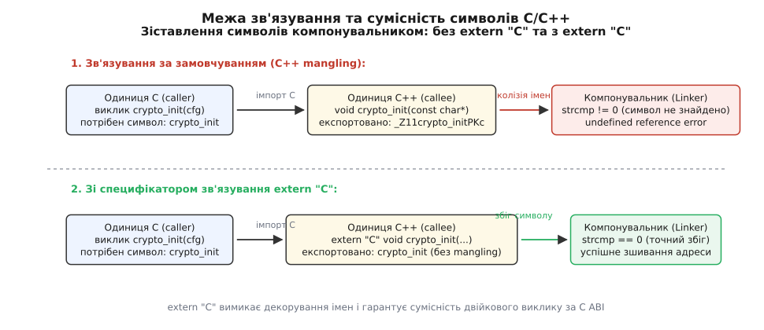
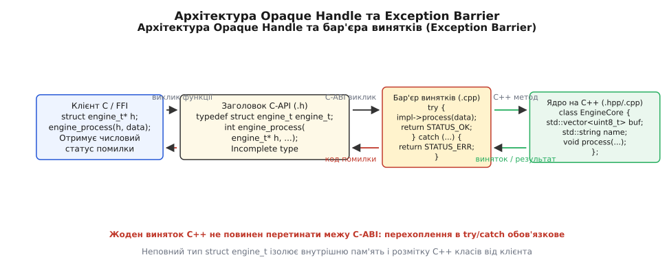
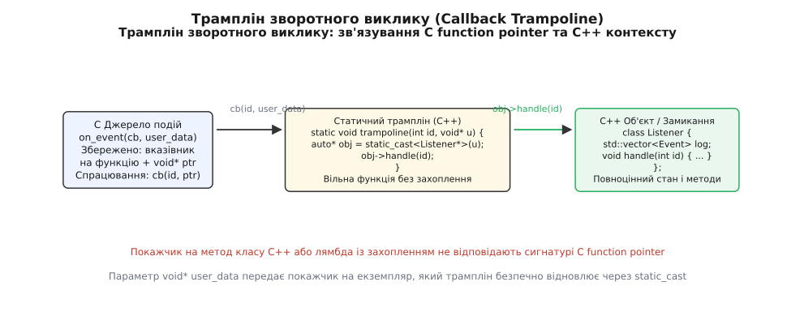

# extern "C" і сумісність із C-інтерфейсами

<preknowlist>
- [Спотворення імен: як символ несе сигнатуру](root:sys-plang-cpp/name-mangling) — як компілятор кодує типи параметрів та простори імен у текстовий рядок символу.
- [Зв'язування та правило одного визначення (ODR)](root:sys-plang-cpp/odr-and-linkage) — як компонувальник зіставляє зовнішні ідентифікатори між одиницями трансляції.
- [Механізм винятків: таблиці розгортання стека](root:sys-plang-cpp/exceptions-mechanism) — як працює пошук обробників і розкрутка стека за таблицями DWARF / SEH.
- [Семантика володіння та життєвий цикл ресурсів](root:sys-plang-cpp/ownership-semantics) — як принципи RAII керують часом життя пам'яті через деструктори.
- [Стабільність ABI у C++ і що її ламає](root:sys-plang-cpp/abi-stability-cpp) — чому двійковий інтерфейс C++ не має стабільного стандарту між версіями компіляторів.
</preknowlist>

У промисловому сервісі обробки даних ядро криптографічного шифрування, аудіопроцесингу або нейромережевого виведення реалізоване сучасною мовою C++20 з використанням класів, динамічних контейнерів, RAII та винятків. Цю бібліотеку необхідно скомпілювати як динамічний спільний модуль (`.so` або `.dll`) і підключити до системного демона, написаного на чистому C, завантажити як плагін у Python через модуль `ctypes`, викликати з сервісу на мові Rust або зв'язати з ядром операційної системи реального часу (RTOS). Коли C-компілятор транслює виклик функції `crypto_init()`, створення об'єктного файлу завершується без зауважень, проте системний компонувальник негайно перериває процес із помилкою `undefined reference to crypto_init`. Компілятор C++ згенерував у таблиці символів ідентифікатор `_Z11crypto_initPKc` (за стандартом Itanium ABI) або `?crypto_init@@YAXPEBD@Z` (за стандартом MSVC ABI).

Навіть якщо проблему імен вирішено ручним зазначенням декорованого імені, спроба передати C++ об'єкт за значенням крізь межу виклику, зміна розмітки полів структури між компіляторами або вихід необробленого винятку `std::runtime_error` у стек C-викликів спричиняють мовчазне пошкодження пам'яті, аварійну зупинку процесу `std::terminate()` або невизначену поведінку (Undefined Behavior).

Причина полягає у відсутності єдиного стандарту ABI (Application Binary Interface) для мови C++. Кожен виробник компілятора та кожна версія стандартної бібліотеки самостійно визначають розмітку таблиць віртуальних методів (`vtable`), правила передачі параметрів, внутрішнє влаштування контейнерів (`std::string`, `std::vector`) та механізми розгортання стека. Єдиним двійковим стандартом взаємодії в індустрії програмного забезпечення є двійковий інтерфейс мови C (C ABI).

Для побудови надійного моста між C++ та будь-якою іншою мовою програмування використовується Foreign Function Interface (FFI, англ. *зовнішній функціональний інтерфейс*) на основі специфікації зв'язування `extern "C"`, патерна непрозорих дескрипторів (Opaque Handle) та суворого бар'єра винятків.

## Специфікація мовного зв'язування: що насправді робить extern "C"

У граматиці мови C++ ключове слово `extern` виконує дві принципово різні функції: воно може визначати клас пам'яті (Storage Class Specifier), вказуючи на зовнішнє зв'язування змінної, або входити до складу **специфікації мовного зв'язування** (Language Linkage Specification, латин. *ligare* — зв'язувати).

Конструкція `extern "C"` дає компілятору C++ дві обов'язкові інструкції:
1. **Повне відключення спотворення імен (Name Mangling).** Компілятор експортує та імпортує функцію під її точним, чистим ASCII-іменем без додавання кодів типів аргументів, префіксів просторів імен чи кваліфікаторів константності.
2. **Застосування системної конвенції викликів мови C (C Calling Convention).** Компілятор генерує машинний код входу та виходу з функції згідно з правилами цільової апаратної платформи (розподіл регістрів, вирівнювання стека, збереження регістрів викликачем чи викликаною функцією).



*Компонувальник зіставляє символи за прямим збігом рядків: без специфікатора extern "C" компонувальник не може зіставити плоске C-ім'я зі спотвореним C++ символом.*

### Апаратні конвенції викликів на рівні регістрів процесора

Щоб зрозуміти, чому мовне зв'язування вимагає більше, ніж просто незмінне ім'я символу, розглянемо правила виклику функцій (Calling Conventions) на 64-бітній архітектурі x86_64:

- **System V AMD64 ABI (Linux, macOS, FreeBSD, Android):**
  - Перші 6 цілочисельних аргументів та покажчиків передаються виключно через регістри процесора у фіксованому порядку: `%rdi`, `%rsi`, `%rdx`, `%rcx`, `%r8`, `%r9`.
  - Аргументи з плаваючою комою передаються через векторні регістри `%xmm0`–`%xmm7`.
  - Решта аргументів передається через стек у порядку справа наліво.
  - Стек зобов'язаний бути вирівняний за межею 16 байтів безпосередньо перед виконанням інструкції `call`.
  - Значення, що повертається, записується в регістр `%rax` (або `%rax` + `%rdx` для 128-бітних величин).
- **Microsoft x64 Calling Convention (Windows):**
  - Перші 4 цілочисельні аргументи передаються через регістри `%rcx`, `%rdx`, `%r8`, `%r9`.
  - Викликач (Caller) зобов'язаний виділити в стеку 32 байти тіньового простору (Shadow Space / Home Space) безпосередньо над адресою повернення, навіть якщо функція приймає менше чотирьох аргументів.
  - Регістри `%rdi` та `%rsi` у Windows вважаються незмінними (Non-Volatile / Callee-Saved): функція, яка їх використовує, зобов'язана зберегти їхній стан у пролозі та відновити в епілозі.

Якщо викликати функцію з порушенням конвенції (наприклад, коли викликач передає аргументи за схемою Windows, а викликана функція очікує їх за схемою System V або зі спеціальною C++ конвенцією `__vectorcall`), значення параметрів будуть прочитані з неправильних регістрів процесора, а стек виявиться незбалансованим. Специфікація `extern "C"` гарантує, що скомпільована функція суворо дотримується офіційного C ABI поточної операційної системи.

### Синтаксис специфікації зв'язування

Стандарт мови C++ визначає дві форми синтаксису: одиничне оголошення та блокову директиву зв'язування.

```cpp
// Одиничне оголошення функції з C-зв'язуванням
extern "C" int crypto_calculate_hash(const char* data, size_t len);

// Одиничне оголошення глобальної змінної
extern "C" int g_crypto_active_sessions;

// Блокова специфікація зв'язування
extern "C" {
    int  crypto_engine_init(const char* config_json);
    int  crypto_engine_process(const uint8_t* in, uint8_t* out, size_t len);
    void crypto_engine_shutdown(void);
}
```

Всередині блоку `extern "C" { ... }` діють фундаментальні семантичні правила:

1. **C++ код усередині тіла функції дозволено.** Специфікація `extern "C"` визначає виключно зовнішній інтерфейс і двійковий символ. Усередині тіла функції розробник має повний доступ до всіх можливостей мови C++: створення об'єктів класів, використання шаблонів, динамічне виділення пам'яті через `std::make_unique`, використання контейнерів `std::vector` та блоків `try/catch`.
2. **Заборона перевантаження імен (No Function Overloading).** Оскільки таблиця символів мови C зберігає виключно плоскі неспотворені рядки, оголошення двох однойменних функцій із різними параметрами в межах блоку `extern "C"` заборонене стандартом і викликає негайну помилку компіляції:

```cpp
extern "C" {
    void transform_data(int val);
    void transform_data(double val); // ПОМИЛКА КОМПІЛЯЦІЇ: конфлікт символу transform_data
}
```

Компілятор не може створити два однакових символи `transform_data` в одній одиниці трансляції, оскільки це порушує [правило одного визначення (ODR)](root:sys-plang-cpp/odr-and-linkage).

3. **Розмежування класу пам'яті та мовного зв'язування.** Специфікатор `extern "C"` не завжди означає зовнішню видимість (External Linkage). Мова C++ дозволяє оголошувати внутрішні локальні допоміжні функції з конвенцією мови C:

```cpp
extern "C" static void internal_c_callback_handler(int code) {
    // Внутрішня функція з внутрішнім зв'язуванням (internal linkage),
    // доступна лише в поточному .cpp файлі, але з C calling convention
}
```

Ця функція не експортується в таблицю символів об'єктного файлу, проте має двійкову конвенцію виклику мови C, що дозволяє безпечно передавати її покажчик як callback у сторонні C-бібліотеки.

4. **Взаємодія з просторами імен (Namespaces).** Оголошення функції `extern "C"` всередині простору імен не змінює її експортованого імені:

```cpp
namespace drivers::crypto {
    extern "C" void init_hardware(int port);
}
```

У C++ коді до цієї функції звертаються як `drivers::crypto::init_hardware(8080)`, проте в об'єктному файлі експортується плоский символ `init_hardware`. Оголошення іншої функції `extern "C" void init_hardware(int)` у глобальному або будь-якому іншому просторі імен спричинить конфлікт компонування.

5. **Мовне зв'язування покажчиків на функції в системі типів.** Стандарт C++ формально розглядає мовне зв'язування як складову частину типу функції:
```cpp
extern "C" typedef void (*c_signal_handler_t)(int);
typedef void (*cpp_signal_handler_t)(int);
```
Типи `c_signal_handler_t` та `cpp_signal_handler_t` є різними типами в системі типів C++. Стандартні функції C-бібліотеки (як-от `std::qsort` або `signal`) приймають саме покажчики з мовним зв'язуванням C. Сучасні компілятори на x86_64 дозволяють неявне приведення, оскільки базові конвенції збігаються, проте в суворому стандартному режимі передача C++ покажчика у функцію, що очікує C-покажчик, вважається несумісністю типів.

Детальніше про те, як розробники перших трансляторів Cfront долали кризу компонування C++ із системними бібліотеками Unix, розповідає [історія специфікації зв'язування](root:sys-plang-cpp/extern-c-interop/hist-linkage-specification.md).

## Ідіома двомовних заголовків: макрос __cplusplus

Щоб один і той самий файл заголовка міг без модифікацій включатися як у вихідний код мовою C, так і в код на C++, застосовується канонічна ідіома перевірки стандартного макроса препроцесора `__cplusplus`.

Компілятор C++ завжди визначає макрос `__cplusplus`, тоді як компілятор чистого C цього макроса не має. Оскільки компілятор C не підтримує ключове слово `extern "C"` і зупиниться з синтаксичною помилкою, специфікація обов'язково ізолюється директивами умовної компіляції:

```cpp
#ifndef ENGINE_API_H
#define ENGINE_API_H

#include <stddef.h>
#include <stdint.h>

#ifdef __cplusplus
extern "C" {
#endif

/* Оголошення C-сумісних типів та сигнатур функцій */
typedef struct engine_t engine_t;

int  engine_init(engine_t** out_engine, const char* config);
void engine_release(engine_t* engine);

#ifdef __cplusplus
}
#endif

#endif /* ENGINE_API_H */
```

### Препроцесорна поведінка для двох компіляторів

Розглянемо, як цей заголовок інтерпретується різними компіляторами:
- **Під час обробки компілятором C (`gcc -x c` або `clang -x c`):**
  - Макрос `__cplusplus` не визначений.
  - Препроцесор повністю видаляє рядки `extern "C" {` та `}`.
  - Компілятор C бачить звичайні, стандартні C-оголошення неповного типу структури та функцій.
- **Під час обробки компілятором C++ (`g++` або `clang++`):**
  - Макрос `__cplusplus` визначений.
  - Препроцесор підставляє блок `extern "C" { ... }`.
  - Компілятор C++ реєструє оголошені функції з вимкненим манглінгом та C-конвенцією викликів.

### Правила гігієни спільних заголовків

Під час проектування подвійних заголовків критично важливо дотримуватися дисципліни включення файлів:

1. **Заборона включення C++ заголовків усередині `extern "C"`.** Якщо помістити директиву `#include <vector>` або `#include <string>` всередину блоку `extern "C" { ... }`, усі шаблони та перевантажені оператори стандартної бібліотеки C++ отримають C-linkage. Компілятор спробує вимкнути манглінг для шаблонів і зупинить збирання сотнями помилок про неможливість перевантаження функцій.
2. **Розміщення стандартних C-заголовків.** Усі стандартні заголовки (`<stddef.h>`, `<stdint.h>`, `<stdbool.h>`) повинні включатися **до** відкриття блоку `extern "C"`, або перебувати за межами умовних охоронних блоків.
3. **Зручні C++ обгортки всередині двомовного заголовка.** Якщо заголовок використовується розробниками на C++, у ньому можна надати додаткові inline-обгортки на основі шаблонів або RAII, сховані під `#ifdef __cplusplus`:
```cpp
#ifdef __cplusplus
// Допоміжна inline C++ функція, невидима для C-компілятора
inline std::unique_ptr<engine_t, void(*)(engine_t*)> make_scoped_engine(const char* cfg) {
    engine_t* ptr = nullptr;
    if (engine_init(&ptr, cfg) == 0 && ptr) {
        return { ptr, engine_release };
    }
    return { nullptr, engine_release };
}
#endif
```

## Проектування C-API для бібліотек на C++: патерн Opaque Handle

При проектуванні C-інтерфейсу для C++ бібліотеки виникає ключова інженерна проблема: як надати клієнту доступ до складного об'єкта C++ (із приватними полями, динамічною пам'яттю, віртуальними таблицями та деструкторами), не розкриваючи його розмітку і не прив'язуючи клієнта до розміру об'єкта в байтах.

Якщо експортувати структуру C++ із відкритими полями у публічний C-заголовок:
- Будь-яка зміна внутрішнього поля (додавання лічильника, заміна `int` на `int64_t`) змінить розмір структури (`sizeof`) та зміщення полів (`offsetof`), що вимагатиме повної перекомпіляції всіх клієнтських програм.
- Клієнтський код на чистому C зможе випадково модифікувати внутрішній стан об'єкта в обхід методів C++, порушивши внутрішні інваріанти класу.

Для повної двійкової ізоляції застосовується патерн **непрозорого дескриптора** (англ. *Opaque Handle / Opaque Pointer Pattern*, неповний тип структури).



*Архітектура непрозорого дескриптора: клієнт оперує виключно покажчиком на неповний тип struct engine_t, а повна реалізація C++ класу інкапсульована у файлі реалізації.*

### Структура патерна Opaque Handle

Патерн реалізується у три чіткі кроки:

1. **Оголошення неповного типу в C-заголовочному файлі:**
   Клієнтський код отримує виключно ім'я структури без визначення її полів. Мова C дозволяє створювати покажчики на неповні типи (`incomplete types`):
```cpp
/* Публічний заголовок: клієнт не знає розміру та полів структури */
typedef struct engine_t engine_t;
```

2. **Експорт функцій життєвого циклу:**
   Клієнт не може виділити об'єкт на стеку (`engine_t obj;` — помилка компіляції через невідомий розмір), тому створення та руйнування виконуються функціями бібліотеки:
```cpp
int  engine_create(engine_t** out_engine, const char* name);
int  engine_process(engine_t* engine, const uint8_t* in, size_t len);
void engine_destroy(engine_t* engine);
```

3. **Повне визначення структури у C++ файлі реалізації:**
   У закритому файлі `.cpp` структура визначається повністю. Вона містить екземпляр реального C++ класу, загорнутий у розумний покажчик:
```cpp
/* Файл реалізації engine.cpp */
#include "engine_api.h"
#include <memory>
#include <vector>
#include <string>

class EngineCore {
public:
    explicit EngineCore(std::string name) : name_(std::move(name)) {
        buffer_.reserve(4096);
    }
    void process(const uint8_t* data, size_t len) {
        // Складна внутрішня C++ логіка
    }
private:
    std::string name_;
    std::vector<uint8_t> buffer_;
};

// Повне визначення структури дескриптора
struct engine_t {
    std::unique_ptr<EngineCore> core;
};
```

### Захист від змішування алокаторів пам'яті

Найнебезпечнішою пасткою при використанні непрозорих дескрипторів є порушення симетрії виділення пам'яті (CRT Allocator Mismatch):

:::tabs
```c
/* Помилковий C-код: прямий виклик free() ламає C++ heap */
engine_t* handle = NULL;
engine_create(&handle, "AES");
/* ... робота ... */
free(handle); /* Фатальна помилка: не викликаються деструктори C++ */
```
```cpp
// Коректний C++ код: автоматичне керування через RAII-делетер
struct EngineDeleter {
    void operator()(engine_t* ptr) const noexcept {
        engine_destroy(ptr);
    }
};

using ScopedEngine = std::unique_ptr<engine_t, EngineDeleter>;

void run() {
    engine_t* raw = nullptr;
    engine_create(&raw, "AES");
    ScopedEngine handle(raw);
    // engine_destroy викличеться автоматично наприкінці області видимості
}
```
:::

Якщо пам'ять для екземпляра була виділена всередині бібліотеки через C++ оператор `new` (або `std::make_unique`), а клієнтський додаток викликає функцію `free()` з системної бібліотеки `libc`, виникають фатальні наслідки:
- Не викликаються деструктори внутрішніх полів (`std::string`, `std::vector`, файлові дескриптори, мережеві сокети).
- У разі динамічного завантаження бібліотек у середовищі Windows (при статичному лінкуванні C Runtime) бібліотека та виконуваний файл мають абсолютно незалежні куратори купи (Heap Managers). Спроба повернути блок однієї купи в іншу миттєво руйнує структури вільної пам'яті й аварійно завершує процес.

Звільнення дескриптора зобов'язане відбуватися виключно через фабричну функцію `engine_destroy`:

```cpp
extern "C" void engine_destroy(engine_t* engine) {
    if (!engine) return;
    try {
        // Відновлюємо володіння через unique_ptr:
        // оператор delete викличе деструктори EngineCore та його полів
        std::unique_ptr<engine_t> cleaner(engine);
    } catch (...) {
        // Захист межі C-ABI
    }
}
```

## Бар'єр винятків (Exception Barrier)

У мові C++ основним інструментом сигналізації про нештатні ситуації є винятки (Exceptions), тоді як мова C оперує кодами повернення (Status Codes) та глобальними індикаторами (як-от `errno`).

Коли всередині методу C++ виконується оператор `throw std::runtime_error("disk error")`, середовище виконання запускає процес **розгортання стека** (Stack Unwinding). Спеціальна підсистема сканує стекові кадри процесора знизу вгору, використовуючи метадані таблиць DWARF `.eh_frame` (у Linux) або структурованих таблиць SEH (у Windows), щоб викликати деструктори локальних об'єктів для кожного пройденого кадру.

Коли процес розгортання стека натрапляє на стековий кадр функції мови C, виникає непереборний конфлікт: C-код здебільшого компілюється без генерації метаданих винятків (без прапорця `-fexceptions`). Підсистема розгортання стека не може визначити межі кадру мови C, фіксує порушення цілісності середовища виконання і негайно викликає `std::terminate()`. За стандартом C++17/C++20 вихід винятку C++ за межі функції зі специфікацією `extern "C"` вважається **невизначеною поведінкою** (Undefined Behavior).

### Патерн Exception Barrier

Кожна публічна функція C-API зобов'язана встановлювати абсолютний **бар'єр винятків** (англ. *Exception Barrier*). Жоден виняток C++ не повинен покинути межі функції: усі винятки перехоплюються за допомогою суцільного блоку `try { ... } catch (...)` та транслюються у стандартизовані коди повернення:

```cpp
extern "C" int engine_process(engine_t* engine, const uint8_t* in, size_t len) noexcept {
    if (!engine || !engine->core || !in) {
        set_thread_local_error("Недійсний нульовий покажчик аргументу");
        return -1; // INVALID_ARGUMENT
    }

    try {
        engine->core->process(in, len);
        return 0; // SUCCESS
    } catch (const std::invalid_argument& e) {
        set_thread_local_error(e.what());
        return -1; // INVALID_ARGUMENT
    } catch (const std::bad_alloc& e) {
        set_thread_local_error(e.what());
        return -2; // OUT_OF_MEMORY
    } catch (const std::exception& e) {
        set_thread_local_error(e.what());
        return -3; // RUNTIME_ERROR
    } catch (...) {
        set_thread_local_error("Невідомий критичний системний виняток C++");
        return -4; // UNKNOWN_ERROR
    }
}
```

### Потокобезпечна передача діагностики (Thread-Local Error Reporting)

Щоб клієнт не втрачав детального текстового опису проблеми (`e.what()`), бібліотека організовує потоколокальне сховище повідомлень за аналогією з функцією `GetLastError` у Win32 API або `strerror` у POSIX:

```cpp
/* Потоколокальний буфер останньої помилки */
thread_local std::string g_last_error_buffer;

static void set_thread_local_error(const std::string& msg) noexcept {
    g_last_error_buffer = msg;
}

extern "C" const char* engine_get_last_error(void) {
    return g_last_error_buffer.c_str();
}
```

Оскільки змінна оголошена зі специфікатором `thread_local`, кожен потік операційної системи має власний ізольований буфер. Якщо один потік отримує помилку `OUT_OF_MEMORY`, а інший паралельно виконує успішні запити, їхні діагностичні повідомлення ніколи не перетинаються і не потребують синхронізації через м'ютекси.

## Сумісність структур даних: Standard Layout, POD та вирівнювання

Коли C-інтерфейс вимагає обміну складеними структурами даних за значенням або за покажчиком на відкриті поля, виникає питання повної відповідності двійкової розмітки пам'яті (Binary Layout).

В історичному стандарті C++98 такі типи називалися **POD** (Plain Old Data, прості неструктуровані дані). Починаючи з C++11, комітет стандартизації замінив монолітне поняття POD на точніші характеристики типів (Type Traits):
- `std::is_standard_layout<T>` — визначає структуру, сумісну за розміщенням полів із мовою C.
- `std::is_trivial<T>` — визначає тип, конструктори та деструктори якого є тривіальними (еквівалентними порожній операції).
- `std::is_trivially_copyable<T>` — визначає тип, який можна безпечно копіювати через побайтовий `memcpy`.

Для безпечної передачі через двійкову межу C-ABI структура зобов'язана мати **стандартне розміщення** (`std::is_standard_layout_v<T> == true`).

```cpp
#include <type_traits>
#include <cstdint>

struct TelemetryPacket {
    uint32_t device_id;
    float    voltage;
    float    current;
    uint64_t timestamp_us;
};

static_assert(std::is_standard_layout_v<TelemetryPacket>, 
              "TelemetryPacket повинен мати Standard Layout для сумісності з C!");
```

### Формальні вимоги до Standard Layout типів:
1. **Єдиний контроль доступу.** Усі нестатичні члени мають однаковий специфікатор доступу (виключно `public` для структур C-API).
2. **Відсутність віртуальних функцій і віртуального наслідування.** У структурі гарантовано відсутній прихований покажчик на таблицю віртуальних методів (`vptr`).
3. **Відсутність нестатичних членів у кількох рівнях ієрархії.** Або всі базові класи не мають нестатичних полів, або найбільш похідний клас не має власних полів і наслідує один базовий клас із полями.
4. **Рекурсивна відповідність.** Усі поля структури та її базові класи також мають Standard Layout.

### Арифметика вирівнювання (Alignment) та заповнення (Padding)

Компілятори C та C++ вирівнюють поля структури в пам'яті відповідно до вимог цільового процесора (латин. *lineare* — вирівнювати за лінією). На 64-бітних архітектурах x86_64 та ARM64 доступ до невідповідно вирівняної пам'яті або сповільнює роботу процесора в кілька разів, або призводить до апаратного винятку шини (Alignment Fault на старих ядрах ARM/SPARC).

Формула обчислення зміщення поля з урахуванням вирівнювання:
```text
offset = (current_offset + align - 1) & ~(align - 1)
```

Розглянемо приклад неефективної структури:

```cpp
struct UnalignedPayload {
    uint8_t  flag;       // 1 байт (offset 0)
    /* 3 байти заповнення (Padding), щоб вирівняти uint32_t за адресою, кратною 4 */
    uint32_t packet_id;  // 4 байти (offset 4)
    uint8_t  status;     // 1 байт (offset 8)
    /* 7 байтів заповнення, щоб вирівняти uint64_t за адресою, кратною 8 */
    uint64_t timestamp;  // 8 байтів (offset 16)
}; // Загальний розмір sizeof = 24 байти (хоча корисних даних лише 14 байтів)
```

Якщо C-компілятор клієнта та C++ компілятор бібліотеки зібрані з різними прапорцями пакування (наприклад, клієнт використав директиву `#pragma pack(1)`, а бібліотека компілювалася зі стандартним вирівнюванням `#pragma pack(8)`), зсуви полів (`offsetof`) розійдуться. Коли клієнт запише `timestamp` за зміщенням 10 (1+4+1), бібліотека прочитає `timestamp` за зміщенням 16, отримавши випадкове сміття з оперативної пам'яті.

Щоб запобігти двійковим розбіжностям, спільні структури захищають статичними перевірками:

```cpp
static_assert(sizeof(TelemetryPacket) == 24, "Розмір TelemetryPacket змінився!");
static_assert(offsetof(TelemetryPacket, device_id) == 0, "Неправильний зсув device_id");
static_assert(offsetof(TelemetryPacket, timestamp_us) == 16, "Неправильний зсув timestamp_us");
```

### Небезпека бітових полів (Bitfields) у C-API

Поля структури, задані бітовою шириною (`uint32_t is_active : 1; uint32_t mode : 3;`), не мають стандартизованого двійкового розміщення. Стандарти C та C++ залишають порядок розміщення бітів (від молодшого до старшого чи навпаки) та правила перетину меж машинних слів на розсуд конкретного компілятора. Компілятори MSVC та GCC на одній і тій самій платформі x86_64 можуть розмістити сусідні бітові поля у протилежному порядку. Для забезпечення надійної двійкової сумісності в C-API бітові поля категорично заборонені: їх замінюють явними числовими полями з бітовими масками (`FLAGS_ACTIVE = 1u << 0`).

## Зворотні виклики (Callbacks) і контекстні дані: void* user_data та Trampoline

Багато системних бібліотек (мережеві рушії, віконні системи, звукові сервери) взаємодіють із клієнтом через механізм зворотних викликів (Callbacks) — наприклад, сповіщення про надходження мережевого пакету, завершення операції введення-виведення або спрацювання таймера.

У мові C зворотний виклик описується звичайним покажчиком на вільну функцію:
```cpp
typedef void (*stream_callback_t)(const uint8_t* chunk, size_t size, void* user_data);
```

Проте в сучасному C++ обробником події зазвичай є:
- Метод конкретного екземпляра класу: `void AudioPlayer::on_data_ready(const uint8_t* chunk, size_t size)`.
- Лямбда-функція із захопленням контексту: `[&stats, this](const uint8_t* chunk, size_t size) { ... }`.
- Функціональний об'єкт `std::function<void(const uint8_t*, size_t)>`.

### Чому покажчик на метод класу не сумісний із C-покажчиком

Спроба безпосередньо привести покажчик на метод класу C++ до типу C-покажчика на функцію є принципово хибною з двох апаратних причин:
1. **Різний двійковий розмір.** Покажчик на вільну функцію у 64-бітній системі займає **8 байтів**. Покажчик на метод класу (`Member Function Pointer`) у Itanium ABI займає **16 байтів** (містить адресу функції у віртуальній таблиці або машинного коду та числовий зсув `this-adjustment` для коректної роботи з множинним наслідуванням).
2. **Конвенція передачі `this`.** Метод класу C++ очікує отримати неявний перший аргумент — покажчик `this` — у спеціальному регістрі процесора (`%rdi` або `%rcx`), тоді як звичайна функція мови C передає в цьому регістрі перший явний аргумент сигнатури.

Пряме приведення типу `(stream_callback_t)&AudioPlayer::on_data_ready` заборонене стандартом C++ і призводить до помилки компіляції, а використання насильного `reinterpret_cast` — до фатального краху під час виконання.

### Патерн Trampoline (Статичний перехідник)

Для зв'язування об'єктів C++ із C-інтерфейсом зворотних викликів застосовується ідіома **трампліна** (англ. *Callback Trampoline*):
1. У C-інтерфейс передається статична функція (трамплін), яка відповідає C-сигнатурі.
2. Покажчик на екземпляр C++ об'єкта передається через нетипізований параметр `void* user_data`.
3. Усередині трампліна покажчик `user_data` відновлюється через `static_cast<MyClass*>(user_data)` і викликає цільовий метод екземпляра.



*Трамплін зворотного виклику: статична функція перетворює покажчик void* user_data на покажчик на конкретний C++ об'єкт і викликає цільовий метод без накладних витрат.*

Нижче наведено порівняння реалізації реєстрації зворотного виклику з боку клієнта на чистому C та з боку ідіоматичного C++:

:::tabs
```c
#include <stdio.h>
#include <stdlib.h>
#include <stdint.h>

/* Оголошення C-API */
typedef void (*data_ready_cb)(const uint8_t* data, size_t len, void* user_data);
void stream_register_handler(data_ready_cb cb, void* user_data);

/* Структура користувацького контексту в C-коді */
typedef struct ConsumerContext {
    size_t total_received;
    FILE*  log_file;
} ConsumerContext;

/* Звичайна C-функція зворотного виклику */
static void on_data_chunk(const uint8_t* data, size_t len, void* user_data) {
    ConsumerContext* ctx = (ConsumerContext*)user_data;
    if (ctx && data) {
        ctx->total_received += len;
        fprintf(ctx->log_file, "Отримано %zu байтів (разом: %zu)\n", len, ctx->total_received);
    }
}

int main(void) {
    ConsumerContext app_state;
    app_state.total_received = 0;
    app_state.log_file = stdout;

    /* Реєструємо функцію та покажчик на стан */
    stream_register_handler(on_data_chunk, &app_state);
    return 0;
}
```
```cpp
#include <iostream>
#include <vector>
#include <span>
#include <memory>
#include <cstdint>

/* Оголошення зовнішнього C-API */
extern "C" {
    typedef void (*data_ready_cb)(const uint8_t* data, size_t len, void* user_data);
    void stream_register_handler(data_ready_cb cb, void* user_data);
}

// C++ клас-обробник подій
class NetworkReceiver {
public:
    void handle_chunk(std::span<const uint8_t> buffer) {
        bytes_accumulated_ += buffer.size();
        std::cout << "[C++ Handler] Отримано чанк: " << buffer.size() 
                  << " байтів (сумарно: " << bytes_accumulated_ << ")\n";
    }

    void subscribe_to_stream() {
        // Статичний трамплін: C calling convention, без захоплення стану
        auto trampoline = [](const uint8_t* data, size_t len, void* user_data) noexcept {
            auto* self = static_cast<NetworkReceiver*>(user_data);
            if (self && data) {
                self->handle_chunk(std::span<const uint8_t>(data, len));
            }
        };

        // Реєстрація: передаємо статичну функцію-трамплін та покажчик this
        stream_register_handler(trampoline, this);
    }

private:
    size_t bytes_accumulated_{0};
};

int main() {
    NetworkReceiver receiver;
    receiver.subscribe_to_stream();
    return 0;
}
```
:::

Повний наскрізний приклад проектування промислового C-API для C++ бібліотеки (із власними делетерами `std::unique_ptr`, конфігурацією збирання CMake та багатомовними біндінгами для Rust і Python) наведено у [практичній реалізації стабільного C-API](root:sys-plang-cpp/extern-c-interop/proj-c-wrapper.md).

## Типові пастки інтероперабельності C та C++

Під час проектування й супроводу C-сумісних двійкових інтерфейсів найчастіше виникають п'ять критичних дефектів:

1. **Передача складних C++ типів за значенням у C-заголовках.** Передача `std::string`, `std::vector` або `std::string_view` у C-заголовках є неможливою. Інтерфейс C-API повинен оперувати виключно базовими скалярними типами (`int`, `uint32_t`, `double`), парами «покажчик + довжина» (`const uint8_t* data, size_t size`) або непрозорими дескрипторами `struct handle*`.
2. **Невідповідність платформних розмірів цілочисельних типів.** Використання типів `long` або `unsigned long` у кросплатформних заголовках. Тип `long` має розмір 4 байти у 64-бітному Windows (модель даних LLP64) і 8 байтів у 64-бітному Linux (модель даних LP64). Для надійної двійкової сумісності необхідно використовувати стандартизовані типи фіксованої ширини `<stdint.h>`: `int32_t`, `uint64_t`, `int64_t`.
3. **Забутий бар'єр винятків або відсутність специфікатора noexcept.** Якщо експортована функція `extern "C"` не огорнута в суцільний блок `try/catch`, випадковий виняток C++ призведе до раптової аварійної зупинки всієї програми `std::terminate()` без можливості перехоплення в клієнтському коді.
4. **Асинхронний виклик зворотного виклику з висячим покажчиком `user_data`.** Якщо бібліотека виконує обчислення в асинхронному фоновому потоці, передача покажчика на локальну стекову змінну C-клієнта у `user_data` спричиняє звернення до мертвого стекового кадру (Dangling Pointer). Усі асинхронні інтерфейси зобов'язані підтримувати функцію звільнення контексту (`typedef void (*cleanup_fn)(void* user_data)`).
5. **Приховування та експорт двійкових символів (Symbol Visibility).** Якщо бібліотека компілюється з видимістю за замовчуванням (`-fvisibility=default`), усі внутрішні класи та методи C++ ядра потрапляють до таблиці динамічних символів `.dynsym`. Це сповільнює завантаження модуля і створює ризик небезпечних колізій однакових імен у пам'яті. Необхідно збирати бібліотеку з прапорцем `-fvisibility=hidden` та явно позначати публічні функції атрибутом `__attribute__((visibility("default")))`.

> 🔧 **Навіщо це.**
> Специфікатор зв'язування `extern "C"` та правила проектування C-ABI — це універсальний двійковий фундамент, який дозволяє об'єднати світ високорівневого швидкого C++ з глобальною екосистемою програмного забезпечення.
> 
> Саме на цьому стандарті будуються всі сучасні технологічні мости:
> - **Бібліотеки розширення для Python:** Пакети NumPy, PyTorch, TensorFlow та OpenCV скомпільовані на C++, але експортують плоский C-інтерфейс для взаємодії з інтерпретатором CPython через `ctypes` або C-API розширення.
> - **Інтероперабельність із Rust та Go:** Екосистеми Rust (через утиліту `bindgen`) та Go (через підсистему `cgo`) безшовно викликають існуючі C++ бібліотеки виключно через C-сумісні дескриптори.
> - **Плагінні архітектури операційних систем:** Аудіоплагіни (VST3, CLAP), графічні рушії (Vulkan, OpenGL), модулі високопродуктивних вебсерверів (Nginx, Envoy) та розширення баз даних завантажуються в адресний простір через `dlopen` / `LoadLibrary` виключно за чистими C-символами.
> - **Вбудовані системи та RTOS:** Прошивки мікроконтролерів використовують операційні системи реального часу на чистому C (FreeRTOS, Zephyr), викликаючи складні алгоритми фільтрації та обробки сигналів на C++ через безпечні C-обгортки без накладних витрат.
