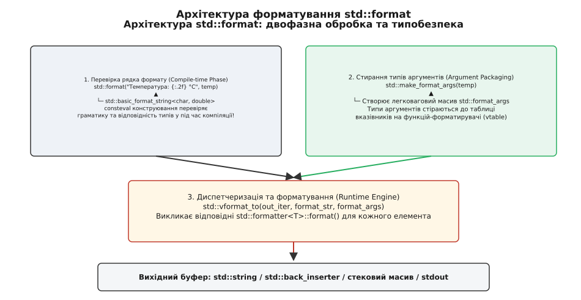
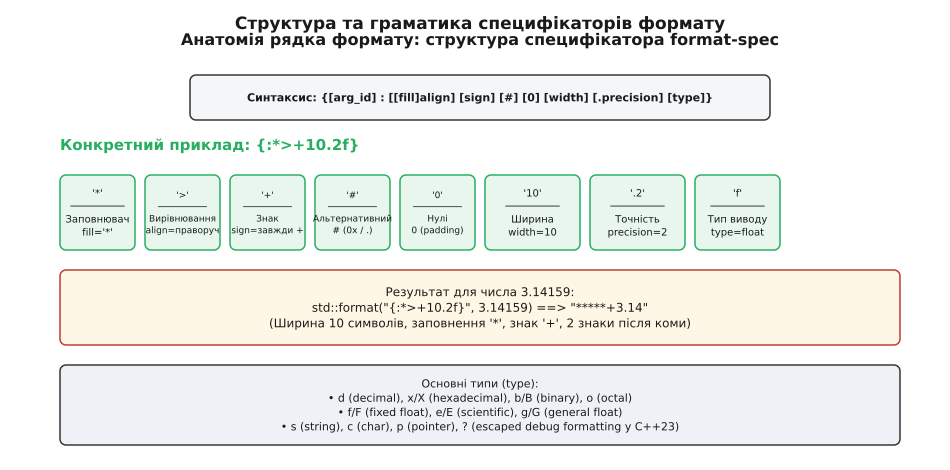
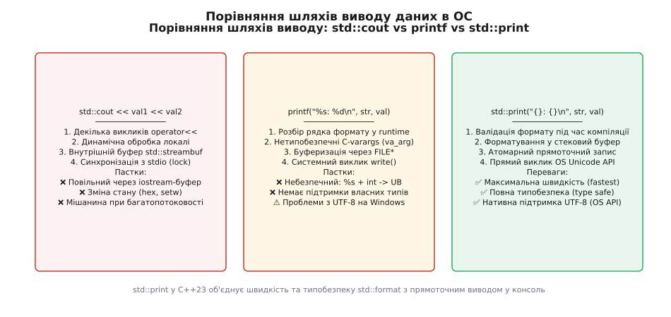

# std::format та std::print: типобезпечне й високопродуктивне форматування

<preknowlist>
- [constexpr і consteval: обчислення під час компіляції](topic:sys-plang-cpp/constexpr-and-consteval) — розбір виразів під час компіляції та обмеження на константне виконання.
- [string і string_view: володіти чи дивитися](topic:sys-plang-cpp/string-and-string-view) — відмінності між володінням динамічним буфером та безволодісним поглядом на послідовність символів.
- [Шаблони змінної арності й вирази згортки](topic:sys-plang-cpp/variadic-and-folds) — упакування довільної кількості аргументів та їх розгортання в шаблонному коді.
- [span: невласницький вид на суцільні дані](topic:sys-plang-cpp/span-contiguous) — модель неперервного масиву об'єктів у пам'яті.
</preknowlist>

Форматування тексту у системному програмуванні завжди знаходилося на перетині трьох фундаментальних вимог, які протягом десятиліть вважалися практично несумісними: **абсолютна типобезпека під час компіляції**, **зручний і гнучкий синтаксис рядків форматування** та **максимальна швидкодія обчислень без зайвих алокацій у купі**. 

У високонавантажених сервісах обробки даних, мережевих демонах, торгових платформах, ігрових серверах та графічних рушіях операція перетворення числових, часових і бінарних даних на текстовий вигляд проводиться мільйони разів на секунду. Найменша неефективність у підсистемі виводу — наприклад, непотрібні виклики системного алокатора пам'яті `malloc`, створення тимчасових об'єктів у купі чи періодичні блокування м'ютексів синхронізації — здатна перетворитися на головне вузьке місце всієї обчислювальної системи.

Стандарти **C++20** та **C++23** повністю переосмислили підхід до текстового форматування та консольного виводу, представивши заголовочні файли `<format>` та `<print>`. Нова підсистема поєднала перевірку рядка форматування під час компіляції за допомогою `consteval`, стирання типів для запобігання мономорфізаційному вибуху бінарного коду та прямоточний вивід у вихідні ітератори й системні консолі без проміжних буферів чи змінення стану локалей.

## Фундаментальний конфлікт класичних підходів: C-varargs проти iostream

Щоб зрозуміти архітектурну цінність та передумови появі `std::format`, слід проаналізувати класичні інструменти виводу, які використовувалися в екосистемах C та C++ протягом кількох десятиліть. Детальний огляд еволюційного шляху від функції `printf` через `iostream` і бібліотеку `fmtlib` до стандартизації C++20 зібрано ув вставці [📜 Історія форматування у C++](topic:sys-plang-cpp/format-and-print/hist-format-evolution.md).

Исторично розробники на C++ мали вибір між двома протилежними підходами, кожен з яких володів критичними недоліками:

### 1. Нетипобезпечний та небезпечний підхід мови C (`printf`, `sprintf`, `snprintf`)

Функції C-stdio пропонували розробникам зручний рядок формату та відносно високу швидкість обробки за рахунок побайтового запису символів. Однак ці функції працювали через нетипобезпечний механізм C-varargs (`va_list`). Компілятор C не мав змоги перевірити, чи відповідає специфікатор `%s` переданому цілому числу `int` або покажчику `float*`.

Наслідком найменшої друкарської помилки у рядку формату ставали фатальні аварії через аварійне завершення процесів (Segmentation Fault), витоки системної пам'яті або невизначена поведінка (Undefined Behavior). Виклики `sprintf` додатково створювали ризик руйнування стека через переповнення буфера (Buffer Overflow). Крім того, C-функції форматування не мали жодної системи розширення для типів користувача: вивести власну структуру або клас без ручного розпакування кожного поля у місці виклику було неможливо.

### 2. Важкий та становий підхід C++98 (`std::cout`, `std::ostringstream`)

Впроваджені у першому стандарті C++98, потоки розв'язали проблему типобезпеки за допомогою перевантаження операторів `operator<<`. Компілятор точно знав тип кожного аргументу й викликав відповідну функцію виводу. Проте за це довелося заплатити складною становою моделлю маніпуляторів (`std::hex`, `std::setw`, `std::setfill`), яка забруднювала глобальний стан потоку: якщо розробник переключав потік у шістнадцятковий режим у глибині функції й забував відновити `std::dec`, усі подальші числа у програмі виводилися у hex-форматі.

Потоковий вивід додатково демонстрував суттєве падіння швидкодії через використання віртуальних функцій у `std::streambuf`, внутрішню синхронізацію з C-stdio, обробку локалей при кожному виклику та регулярні алокації у купі при створенні тимчасових об'єктів `std::string` чи `std::ostringstream`. Також потоки робили неможливою інтернаціоналізацію (i18n), оскільки жорстко зафіксовували порядок слів і змінних у коді програми.

Нижче наведено порівняльний приклад розв'язання одного й того самого завдання: форматування мережевого логу з адресою та портом за допомогою C-style `snprintf` та сучасного C++20 `std::format`.

:::tabs
```c
/* Традиційний підхід мовою C: snprintf із фіксованим буфером */
#include <stdio.h>
#include <stddef.h>

void format_address_c(char* buf, size_t buf_size, const char* host, int port) {
    /* Потенційна небезпека: якщо host буде некоректним вказівником або специфікатор %s 
       отримає int, компілятор C не виявить помилку на етапі збірки.
       При перевищенні buf_size рядок буде обрізано без попередження. */
    snprintf(buf, buf_size, "Server %s listening on port %d", host, port);
}
```
```cpp
// Сучасний ідіоматичний C++20 підхід: std::format та std::format_to
#include <format>
#include <string>
#include <string_view>
#include <span>

std::string format_address_cpp(std::string_view host, int port) {
    // Повна типобезпека: рядок формату перевіряється під час компіляції через consteval
    return std::format("Server {} listening on port {}", host, port);
}

void format_address_cpp_no_alloc(std::span<char> buf, std::string_view host, int port) {
    // Безалокаційний запис у наявний масив пам'яті із суворим контролем межі
    std::format_to_n(buf.data(), buf.size() - 1, "Server {} listening on port {}", host, port);
}
```
:::

Як видно з порівняння, C++20 поєднує візуальну цілісність та компактність рядка форматування C із повною типобезпекою та безалокаційним виводом безпосередньо у надані масиви пам'яті.

## Двофазна модель виконання std::format: перевірка під час компіляції та стирання типів

Головне інноваційне досягнення підсистеми `std::format` полягає у **двофазній архітектурі обробки даних**. Процес форматування чітко розділено на компіляційну стадію перевірки (Compile-time Phase) та стадію виконання й генерації символів (Runtime Phase).


*Архітектура std::format: розділення перевірки рядка формату, пакування аргументів та запису у вихідний ітератор.*

### 1. Перевірка рядка формату під час компіляції (Compile-time Validation)

У сигнатурі функції `std::format` перший параметр приймає об'єкт типу `std::basic_format_string<CharT, Args...>`:

```cpp
namespace std {
    template <typename... Args>
    using format_string = basic_format_string<char, type_identity_t<Args>...>;

    template <typename... Args>
    string format(format_string<Args...> fmt, Args&&... args);
}
```

Зверніть увагу на використання `std::type_identity_t<Args>...`. Це спеціальний шаблонний бар'єр, який забороняє компілятору виконувати виведення типів `Args...` з першого параметра `fmt`. Компілятор виводить `Args...` виключно з переданих аргументів `args...`, після чого підставляє їх у тип `format_string<Args...>`.

Конструктор `std::basic_format_string` оголошено з модифікатором `consteval`. Це означає, що при передачі строкового літералу у виклик `std::format("Value: {:d}", 3.14)` компілятор **примусово виконує розбір та перевірку рядка форматування під час збірки проєкту**.

Під час компіляційного парсингу компілятор проводить наступні суворі перевірки:
- Аналізує синтаксичну коректність усіх фігурних дужок `{}` та баланс екранування `{{` / `}}`.
- Зіставляє кількість замінників `{}` у рядку формату з кількістю фактично переданих аргументів у пакеті `Args...`.
- Викликає метод `constexpr parse()` форматирувальника `std::formatter<T>` для кожного типу в пакеті `Args...`. Якщо специфікатор цілого числа `:d` передано для типу `double` або `std::string`, метод `parse()` кидає виняток `std::format_error` у константнаму контексті, що призводить до негайної зупинки компіляції з описовою помилкою.

Розберемо покроково трасування виконання компілятора при розборі виразу:
1. Компілятор зустрічає виклик `std::format("Value: {:d}", 42)`.
2. Виводить `Args...` як `[int]`.
3. Конструює `std::basic_format_string<char, int>("Value: {:d}")`.
4. Викликає `consteval`-конструктор, який ініціалізує `std::basic_format_parse_context`.
5. Парсер перевіряє текстову частину `"Value: "`, зустрічає замінник `{:d}`.
6. Створює екземпляр `std::formatter<int>` і викликає його `constexpr parse(ctx)`.
7. `formatter<int>::parse()` зчитує символ `'d'`, підтверджує його валідність для цілого числа і повертає ітератор на `}`.
8. Парсер досягає кінця рядка і підтверджує, що всі 1 аргументи успішно перевірено.

Якщо ж написати `std::format("Value: {:d}", "hello")`, на кроці 6 розробник отримує `std::formatter<const char*>`. Його метод `parse()` при зустрічі специфікатора `'d'` кидає виняток `std::format_error("invalid format specifier for string")`. Оскільки виклик відбувається у `consteval`-контексті, компілятор трактує виняток як аварійну зупинку компіляції і друкує точне місце помилки у коді.

Якщо рядок формату формується динамічно під час виконання (наприклад, зчитується з зовнішнього файлу конфігурації чи баз даних), виклик `std::format` із константним підтвердженням не застосовується. Для таких ситуацій стандарт надає функцію `std::vformat`, яка проводить розбір у runtime та кидає виняток `std::format_error` при виявленні некоректних специфікацій.

### 2. Стирання типів аргументів (Type Erasure) для запобігання мономорфізаційному вибуху

Узагальнений шаблон із варіативною кількістю параметрів `template <typename... Args>` при кожній новій комбінації типів генерує новий екземпляр машинного коду (процес мономорфізації шаблонів). Якби увесь внутрішній рушій форматування, аналізу специфікацій та генерації символів був повністю шаблонізованим за `Args...`, бінарний файл програми розрісся б до гігантських розмірів через сотні дубльованих інстанцій функцій форматування.

Щоб повністю усунути цю проблему, `std::format` застосовує витончену техніку **стирання типів (Type Erasure)**:

1. Зовнішня шаблонована inline-обгортка `std::format(fmt, args...)` викликає допоміжний функтор `std::make_format_args(args...)`.
2. `std::make_format_args` упаковує посилання на довільні аргументи у легковаговий масив об'єктів `std::basic_format_arg<FormatContext>`. Усередині `format_arg` містить дискриміноване об'єднання (`union`) для базових типів (цілі числа, числа з плаваючою крапкою, погляди рядків) та таблицю вказівників на функції форматування (vtable) для складних і користувацьких типів.
3. Усі стерті аргументи передаються в єдину нешаблонну функцію `std::vformat(fmt.str(), format_args)`, яка містить основний відкомпільований рушій генерації тексту і існує в бінарному файлі у єдиному екземплярі.

Такий підхід дозволяє поєднати компіляційну перевірку типів на вході із суттєвою оптимізацією розміру підсумкового виконуваного файлу.

## Граматика та синтаксис специфікаторів формату

Синтаксис замінників у `std::format` спирається на розширену граматику мови Python (PEP 3101) і має наступну структуру:

```
{[arg_id] : [[fill]align] [sign] [#] [0] [width] [.precision] [type]}
```


*Анатомія рядка формату: структура та порядок полів у граматиці специфікацій.*

Повний довідник усіх специфікаторів, прапорців та їх комбінацій для різних типів даних наведено у вставці [📋 Довідник специфікаторів формату та API std::formatter](topic:sys-plang-cpp/format-and-print/api-format-specifiers.md).

### Позиційні аргументи та інтернаціоналізація (i18n)

Замінники можуть містити явні індекси аргументів `{0}`, `{1}`, `{2}`. Це дозволяє дублювати аргументи або змінювати порядок їх виводу у заформатованому рядку без зміни порядків параметрів у виклику функції:

```cpp
#include <format>
#include <string>
#include <iostream>

int main() {
    std::string name = "Олександр";
    int count = 5;

    // Автоматична нумерація аргументів (по порядку передачі)
    std::string s1 = std::format("{} придбав {} товарів", name, count);

    // Явна позиційна нумерація (ідеально для локалізації та перекладів)
    // Німецький варіант вимоги іншого порядку слів: "5 товарів було куплено Олександром"
    std::string s2 = std::format("{1} items bought by {0}", name, count);

    std::cout << s1 << "\n" << s2 << "\n";
}
```

Зверніть увагу на важливе правило стандарту: в одному рядку форматування не можна змішувати автоматичну нумерацію `{}` та явну позиційну нумерацію `{0}`. Компілятор виявить таке змішування ще під час збірки й згенерує помилку.

Можливість вільно міняти місцями позиційні параметри у рядку формату вирішує історичну проблему `iostream`, роблячи `std::format` зручним інструментом для побудови базі знань та систем локалізації застосунків на різні мови.

### Динамічне керування шириною та точністю

Ширина поля `width` та точність `precision` можуть бути не лише жорстко зафіксованими числами у рядку форматування, а й обчислюватися динамічно під час виконання програми:

```cpp
#include <format>
#include <string>

std::string format_table_row(std::string_view label, double val, int width, int prec) {
    // Вкладені дужки {} означають, що ширина та точність беруться з наступних аргументів
    return std::format("{:<{}} : {:>{}.{}f}", label, width, val, width, prec);
}

// Виклик format_table_row("CPU", 45.6789, 12, 2)
// Поверне рядок: "CPU          :        45.68"
```

### Форматування контейнерів та діапазонів у C++23 (Ranges Formatting)

Стандарт **C++23** значно розширив можливості `<format>`, додавши вбудовані форматирувальники для контейнерів STL (`std::vector`, `std::array`, `std::map`, `std::set`, `std::span` тощо), кортежів `std::tuple` та пар `std::pair`.

Тепер для виводу вмісту масиву не потрібно писати ручні цикли:

```cpp
#include <format>
#include <vector>
#include <map>
#include <string>
#include <iostream>

int main() {
    std::vector<int> numbers = {10, 20, 30, 40};
    
    // Стандартний вивід вектора
    std::cout << std::format("{}", numbers) << "\n"; // "[10, 20, 30, 40]"

    // Внутрішній специфікатор форматування елементів (Hex з префіксом)
    std::cout << std::format("{::#x}", numbers) << "\n"; // "[0xa, 0x14, 0x1e, 0x28]"

    // Специфікатор 'n' відключає зовнішні квадратні дужки (no brackets)
    std::cout << std::format("{:n}", numbers) << "\n"; // "10, 20, 30, 40"

    // Форматування словника map
    std::map<std::string, int> items = {{"apple", 5}, {"banana", 12}};
    std::cout << std::format("{}", items) << "\n"; // "{\"apple\": 5, \"banana\": 12}"
}
```

Це суттєво спрощує налагодження та логування складних структур даних у сучасних C++23 проєктах.

## Механіка виводу: std::format_to, std::format_to_n та безалокаційні буфери

Функція `std::format` зручна у повсякденній розробці, але вона завжди виділяє пам'ять у купі для створення нового об'єкта `std::string`. У високопродуктивних системних модулях створення тимчасових рядків є неприпустимим марнотратством ресурсів.

Для прямоточного виводу стандарт C++20 надає варіації функцій, що працюють із **вихідними ітераторами (Output Iterators)**.

### 1. Запис у довільні ітератори через std::format_to

Функція `std::format_to` приймає вихідний ітератор `out` першим аргументом і записує заформатовані символи безпосередньо у наданий контейнер або буфер пам'яті:

```cpp
#include <format>
#include <vector>
#include <iterator>
#include <iostream>

int main() {
    std::vector<char> buffer;
    
    // Запис символів безпосередньо у кінець вектора через back_inserter
    std::format_to(std::back_inserter(buffer), "X: {}, Y: {}", 100, 200);

    // Буфер тепер містить символи без додаткових тимчасових std::string у купі
    std::cout << std::string_view(buffer.data(), buffer.size()) << "\n";
}
```

### 2. Безалокаційне логування у стековий масив через std::format_to_n

Для запобігання переповненню буферів фіксованого розміру використовується функція `std::format_to_n`. Вона приймає вказівник на вихідний масив, максимальну кількість символів `N` та повертає структуру `std::format_to_n_result`:

```cpp
namespace std {
    template <typename Out, typename... Args>
    struct format_to_n_result {
        Out out;
        iter_difference_t<Out> size;
    };
}
```

Поле `out` показує підсумкову позицію вказівника за останнім записаним символом, а `size` містить загальну кількість символів, які мав би згенерувати розгортка (навіть якщо вони не помістилися у фіксовану межу `N`).

```cpp
#include <format>
#include <array>
#include <string_view>
#include <iostream>

void safe_stack_log(int id, double temperature) {
    // Фіксований буфер на стеку — 0 алокацій у купі!
    std::array<char, 64> stack_buf;

    // Залишаємо 1 байт під нульовий термінатор
    auto res = std::format_to_n(stack_buf.data(), stack_buf.size() - 1, 
                                "Sensor #{}: temp = {:.2f} C", id, temperature);

    // Завершуємо рядок
    *res.out = '\0';

    std::cout << "Logged: " << stack_buf.data() << " (Total chars: " << res.size << ")\n";
}
```

> 🔧 **Навіщо це.**
> Застосування `std::format_to_n` разом із стековими масивами `std::array<char, N>` або локальними буферами є стандартом де-факто при побудові систем високочастотного трейдингу (HFT), ігрових рушіїв та ядер операційних систем. Це повністю виключає паузи алокатора пам'яті, гарантує захист від атаки переповнення буфера (Buffer Overflow) і робить обчислення детермінованими за часом виконання.

## C++23 std::print та std::println: подолання бар'єра iostream та Юнікоду

Незважаючи на потужність `std::format`, у C++20 вивід заформатованого рядка в консоль все одно вимагав написання коду вида: `std::cout << std::format("Hello {}\n", name);`.

Це призводило до створення тимчасового рядка у купі, подальшого копіювання його вмісту в внутрішній буфер `iostream` та повільного виводу в операційну систему. Крім того, на операційній системі Windows вивід UTF-8 рядків через `printf` чи `std::cout` регулярно призводив до спотворення національних символів ("кракозябри") через конфлікти між системною кодовою сторінкою консолі (OEM CP) та UTF-8.

Для остаточного розв'язання цієї проблеми стандарт **C++23** додав заголовочний файл `<print>` із функціями `std::print` та `std::println`.


*Порівняння шляхів виводу: std::print оминає iostream-буфери та використовує прямі виклики OS з підтримкою Unicode.*

```cpp
#include <print>
#include <string_view>

int main() {
    std::string_view user = "Олексій";
    int score = 2500;

    // C++23 std::print: прямоточний вивід без створення std::string
    std::print("Вітаємо, {}! Ваш результат: {} балів.\n", user, score);

    // std::println автоматично додає символ нового рядка '\n' у кінці
    std::println("Гра завершена успішно.");
}
```

### Механіка прямоточного виводу та нативна підтримка UTF-8

`std::print` працює за наступним принципом:
1. Вона приймає рядок формату `std::format_string<Args...>` і перевіряє його під час компіляції.
2. Форматує аргументи безпосередньо у внутрішній невеликий стековий буфер, оминаючи створення об'єкта `std::string`.
3. Записує заформатовану послідовність байтів атомарно за один системний виклик у стандартний потік виводу (`stdout` або `stderr`).
4. **Нативна підтримка Unicode на Windows:** Функція `std::print` перевіряє, чи спрямований потік виводу в реальну системну консоль. Якщо так, на операційній системі Windows вона перекодовує UTF-8 послідовність у UTF-16 і викликає нативну системну функцію Win32 API `WriteConsoleW`. Це гарантує ідеальне відображення кирилиці та символів Unicode без необхідності ручного налаштування `SetConsoleOutputCP(CP_UTF8)`.

## Розширення для власних типів через std::formatter<T>

Система форматування C++20 є повністю відкритою для розширення. Щоб надати власному класу чи структурі підтримку `std::format` та `std::print`, розробнику достатньо оголосити явну спеціалізацію шаблону `std::formatter<T>` у просторі імен `std`.

Детальний практичний проєкт побудови форматирувальника для структур даних із підтримкою режимів JSON та короткими виводами розібрано ув вставці [⚙️ Практика: власні форматирувальники та безалокаційний формат](topic:sys-plang-cpp/format-and-print/proj-custom-formatter.md).

Конструкція спеціалізації вимагає реалізації двох методів:

```cpp
#include <format>
#include <string_view>

// Власний тип даних
struct Vector2D {
    double x;
    double y;
};

// Спеціалізація std::formatter у просторі імен std
template <>
struct std::formatter<Vector2D> {
    bool is_hex = false;

    // 1. Метод parse аналізує специфікатор формату в constexpr-контексті
    constexpr auto parse(std::format_parse_context& ctx) {
        auto it = ctx.begin();
        auto end = ctx.end();

        if (it != end && *it == 'x') {
            is_hex = true;
            ++it;
        }

        if (it != end && *it != '}') {
            throw std::format_error("Invalid format specifier for Vector2D");
        }
        return it;
    }

    // 2. Метод format виконує безпосередній запис заформатованих даних у буфер
    template <typename FormatContext>
    auto format(const Vector2D& vec, FormatContext& ctx) const {
        if (is_hex) {
            return std::format_to(ctx.out(), "({:a}, {:a})", vec.x, vec.y);
        }
        return std::format_to(ctx.out(), "({:.2f}, {:.2f})", vec.x, vec.y);
    }
};
```

Після оголошення цієї спеціалізації тип `Vector2D` стає повноправним громадянином підсистеми форматування:

```cpp
Vector2D v{3.14159, 2.71828};

std::string s1 = std::format("Pos: {}", v);   // "Pos: (3.14, 2.72)"
std::string s2 = std::format("Hex: {:x}", v); // "Hex: (0x1.921fb54442d18p+1, 0x1.5bf0a8b145769p+1)"
```

### Делегування форматування за допомогою успадкування (Inheritance Idiom)

Якщо власний тип легко перетворюється на об'єкт, який вже має форматирувальник у стандартній бібліотеці (наприклад, на `std::string_view` чи `int`), писати дубльований метод `parse()` не потрібно. Розробник може успадкувати форматирувальник від розширеного базового типу:

```cpp
#include <format>
#include <string_view>

enum class UserRole { Admin, Moderator, User, Guest };

// Перетворення enum у string_view
constexpr std::string_view to_string(UserRole role) noexcept {
    switch (role) {
        case UserRole::Admin:     return "Admin";
        case UserRole::Moderator: return "Moderator";
        case UserRole::User:      return "User";
        case UserRole::Guest:     return "Guest";
    }
    return "Unknown";
}

// Успадкування форматування від std::formatter<std::string_view>
template <>
struct std::formatter<UserRole> : std::formatter<std::string_view> {
    template <typename FormatContext>
    auto format(UserRole role, FormatContext& ctx) const {
        // Передаємо заформатований string_view у базовий клас
        return std::formatter<std::string_view>::format(to_string(role), ctx);
    }
};
```

При такому підході тип `UserRole` автоматично успадковує всі специфікатори форматування рядків (ширину, вирівнювання, заповнювачі): виклик `std::format("{:*^12}", UserRole::Admin)` згенерує `"***Admin****"`.

## Обробка помилок та винятки під час виконання

Підсистема форматування C++20 використовує чітко розграничену модель обробки помилкових ситуацій:

1. **Компіляційні помилки (Compile-time Errors).** Виникають при використанні `std::format` із константними строковими літералами. Якщо специфікатор некоректний, розбір у `consteval`-конструкторі `std::basic_format_string` перериває збірку проєкту.
2. **Динамічні винятки під час виконання (Runtime Exceptions).** Виникають у випадках використання `std::vformat` з неконстантними рядками форматування або при передачі некоректних динамічних параметрів ширини. У таких випадках підсистема кидає виняток `std::format_error` (який успадковано від `std::runtime_error`).

```cpp
#include <format>
#include <iostream>

void dynamic_format_demo(const std::string& user_fmt_str) {
    try {
        // Динамічний розбір у runtime через vformat
        std::string res = std::vformat(user_fmt_str, std::make_format_args(42));
        std::cout << "Result: " << res << "\n";
    } catch (const std::format_error& e) {
        std::cerr << "Format error caught: " << e.what() << "\n";
    }
}
```

Підсистема надає сильну гарантію безпеки винятків (Strong Exception Guarantee): якщо під час форматування аргументів у `std::format_to` один із форматирувачів кидає виняток, стан вихідного буфера лишається цілісним, а виділені внутрішні ресурси коректно звільняються.

## Обробка локалей та алгоритми перетворення чисел

На відміну від застарілого `iostream`, за замовчуванням `std::format` є повністю **незалежним від системних локалей (Locale-independent)**. Це означає, що число `1234.56` завжди буде заформатоване з розделителем-крапкою `.`, незалежно від того, яка локаль встановлена на сервері (наприклад, німецька або українська з комою `,`).

Такий підхід гарантує детермінованість та відтворюваність при серіалізації даних у JSON, XML чи мережеві протоколи.

Якщо ж розробнику дійсно необхідний вивід з урахуванням локалі користувача, граматика пропонує модифікатор `L`:

```cpp
#include <format>
#include <locale>
#include <iostream>

int main() {
    double num = 1234567.89;

    // Незалежно від локалі (завжди POSIX): "1234567.89"
    std::string default_fmt = std::format("{}", num);

    // З урахуванням потокової локалі L (наприклад, "1 234 567,89" або "1,234,567.89")
    std::string loc_fmt = std::format(std::locale("uk_UA.UTF-8"), "{:L}", num);
}
```

### Низькорівневий алгоритм Dragonbox для чисел із плаваючою крапкою

Вражаюча швидкодія `std::format` при конвертації чисел з плаваючою крапкою (`float`, `double`) у текст досягається завдяки використанню алгоритму **Dragonbox** (розробленого Чон Хіном (Juhn Hyo)).

Традиційні алгоритми (такі як `dtoa` чи `printf`) використовували цілочисельну арифметику довільної точності з багаторазовими викликами виділення пам'яті у купі та системними локами локалей. На противагу їм, Dragonbox обчислює найкоротше точне десяткове представлення 64-бітного числа `double` за допомогою прямой 128-бітної цілочисельної арифметики з фіксованими таблицями степенів десятки. Це дозволило прискорити перетворення дрібних чисел у 3-5 разів порівняно з `sprintf`.

## Сумісність та макроси перевірки можливостей (Feature Test Macros)

При написанні кросплатформового коду, який збирається на компіляторах різних версій (GCC, Clang, MSVC), розробники використовують макроси перевірки можливостей (Feature Test Macros):

- `__cpp_lib_format` (заголовок `<format>`) — вказує на наявність підтримки базового `std::format` (C++20).
- `__cpp_lib_print` (заголовок `<print>`) — підтверджує наявність `std::print` та `std::println` (C++23).
- `__cpp_lib_format_ranges` — свідчить про підтримку форматування контейнерів та діапазонів (C++23).

```cpp
#include <version>

#if defined(__cpp_lib_print)
    #include <print>
    #define LOG_PRINT(...) std::print(__VA_ARGS__)
#elif defined(__cpp_lib_format)
    #include <format>
    #include <iostream>
    #define LOG_PRINT(...) std::cout << std::format(__VA_ARGS__)
#else
    // Фолбек для старіших компіляторів
    #include <fmt/core.h>
    #define LOG_PRINT(...) fmt::print(__VA_ARGS__)
#endif
```

Завдяки сумісності граматики `std::format` із бібліотекою `fmtlib`, проєкти можуть легко мігрувати на стандартні засоби C++20/C++23 у міру оновлення системних компіляторів.

## Продуктивність та порівняльний аналіз (Benchmark & Trade-offs)

Для оцінки реальної ефективності різних підходів форматування наведено узагальнені результати бенчмарків виводу 1 000 000 заформатованих рядків вида `std::format("ID: {}, Val: {:.4f}", id, val)` у порівнянні з традиційними альтернативами:

| Метод форматування | Час виконання (мс) | Виділення пам'яті (алокації) | Перевірка типів | Підтримка власних типів |
| :--- | :--- | :--- | :--- | :--- |
| `std::ostringstream` (C++98) | ~450 ms | 2 000 000 (купа) | Так (Compile-time) | Так (`operator<<`) |
| `snprintf` (C-stdio) | ~180 ms | 0 (у наданий буфер) | Ні (C-varargs, UB) | Ні |
| `std::format` (C++20) | ~95 ms | 1 000 000 (для string) | Так (Compile-time) | Так (`std::formatter`) |
| `std::format_to_n` (стек) | ~62 ms | **0 (Zero-alloc)** | Так (Compile-time) | Так (`std::formatter`) |
| `std::print` (C++23 stdout)| ~75 ms | **0 (Zero-alloc)** | Так (Compile-time) | Так (`std::formatter`) |

Завдяки оптимізованим алгоритмам конвертації чисел у текст (Dragonbox/Grisu) та відсутності проміжних віртуальних викликів `std::format_to` перевершує за швидкістю навіть класичний `snprintf`, зберігаючи при цьому повну компиляційну типобезпеку мови C++.
