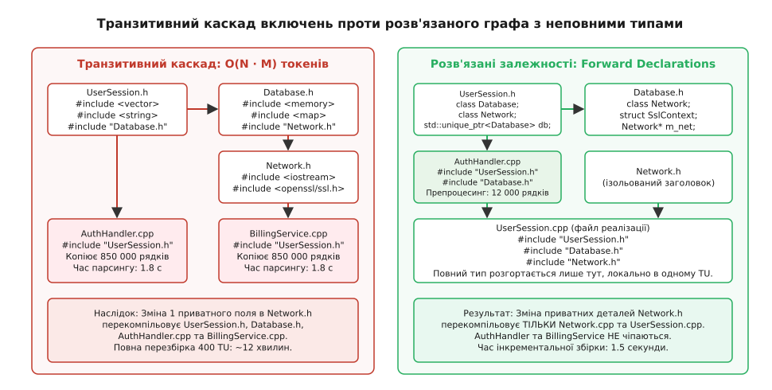
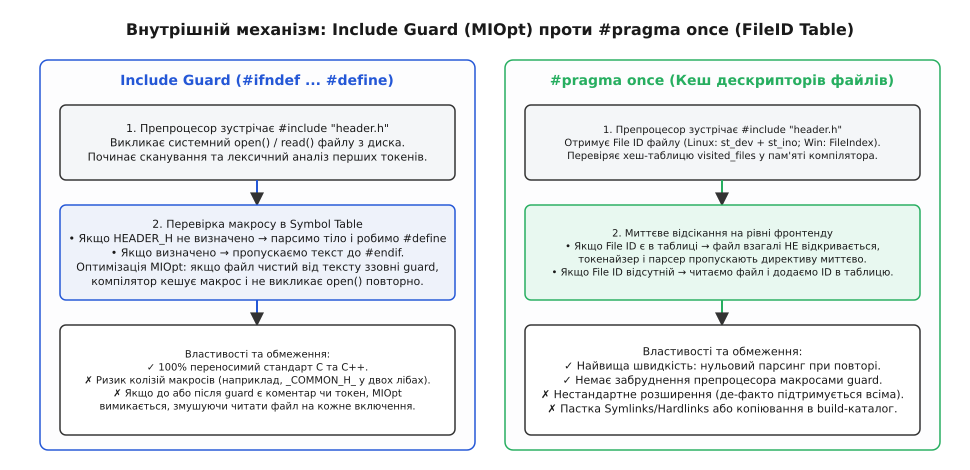
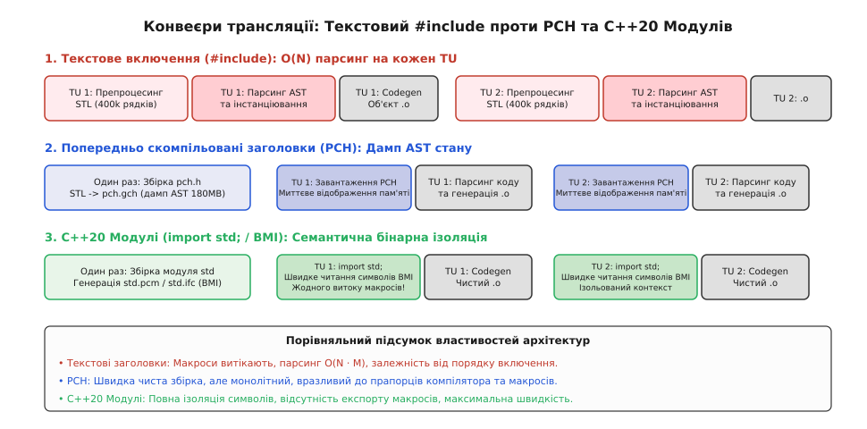
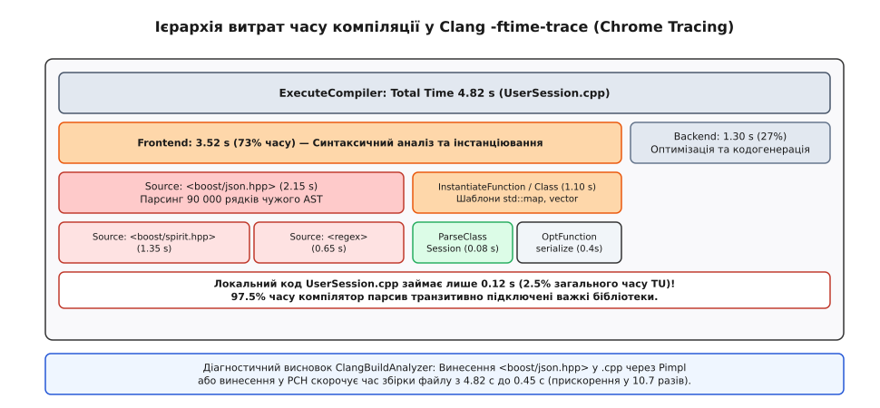

# Гігієна заголовків і час перезбірки

<preknowlist>
- [Стадії трансляції та ODR](topic:sys-plang-cpp/odr-and-linkage) — як сирцевий текст перетворюється на об'єктні файли та чому кожне визначення має бути єдиним.
- [Простори імен та ADL](topic:sys-plang-cpp/namespaces-and-adl) — пошук імен, пов'язаний з аргументами, та межі видимості символів.
- [Патерн Pimpl: ізоляція реалізації](topic:sys-plang-cpp/pimpl) — винесення приватних полів у непрозорий покажчик для стабільності ABI.
- [Модулі C++20](topic:sys-plang-cpp/cpp-modules) — компонентна модель компіляції та заміна текстового включення.
- [Швидкість збірки: Ninja, ccache, PCH, unity](topic:sys-bsystem/build-speed) — системні механізи прискорення конвеєра компіляції.
</preknowlist>

У великому C++ проєкті на сотні тисяч рядків коду додавання одного приватного поля в низькорівневий заголовковий файл `UserSession.h` запускає каскадну перекомпіляцію 400 файлів вихідного коду (`.cpp`), паралізуючи роботу розробника на 15 хвилин. Препроцесор кожного разу буквально копіює десятки мегабайтів текстових заголовків стандартної бібліотеки та сторонніх фреймворків у кожну трансляційну одиницю, змушуючи компілятор сотні разів парсити одні й ті самі синтаксичні дерева та повторно інстанціювати однакові шаблони.

Така поведінка є прямим наслідком моделі текстової трансляції, успадкованої C++ ще від мови C 1970-х років. Без суворої інженерної дисципліни заголовки перетворюються на «спагетті-залежності», де зміна одного внутрішнього типу призводить до лавиноподібного зростання часу збірки, циклічних залежностей та прихованого забруднення глобального простору імен. Для усунення цієї проблеми розроблено набір перевірених практик: використання попередніх оголошень (Forward Declarations), оптимізація захисту від повторного включення, дотримання принципу самодостатності, патерн IWYU (Include What You Use), впровадження попередньо скомпільованих заголовків (PCH) та перехід на C++20 модулі.

---

## 1. Фізика текстового включення та експоненційний вибух токенів

Коли компілятор C++ зустрічає директиву `#include <vector>`, препроцесор буквально відкриває відповідний файл на диску і вставляє його текст безпосередньо в потік токенів трансляційної одиниці (Translation Unit, TU). Це не виклик функції і не динамічний імпорт модуля — це сліпа підстановка вихідних символів на рівні текстового редактора.

### Конвеєр препроцесингу та трансформація коду

Конвеєр обробки кожної трансляційної одиниці компілятором складається з кількох послідовних кроків:

1. **Фаза лексичного препроцесингу**: зшивання розірваних рядків (line splicing через символ `\`), видалення коментарів, обробка макросів та виконання умовних директив (`#if`, `#ifdef`).
2. **Текстова експансія файлів**: зустрівши директиву `#include`, препроцесор призупиняє читання поточного файлу, знаходить цільовий заголовок у каталогах пошуку, відкриває його через системний виклик файлової системи (`open`/`read`) і починає рекурсивно підставляти його вміст.
3. **Генерація плоского проміжного коду**: результат препроцесингу (який можна переглянути за допомогою команди `clang++ -E` або `g++ -E`) являє собою єдиний гігантський монолітний текстовий файл, де кожен рядок розмічений службовими директивами `#line` для збереження початкових номерів рядків для налагоджувача.

Розглянемо, як текстове включення масштабується на практиці у типовому класі бізнес-логіки:

```cpp
// UserSession.h
#pragma once
#include <string>
#include <vector>
#include <memory>
#include <map>
#include "Database.h"

class UserSession {
public:
    UserSession(const std::string& name);
    bool authenticate();

private:
    std::string m_username;
    std::vector<uint64_t> m_permissions;
    std::unique_ptr<Database> m_db;
    std::map<std::string, std::string> m_attributes;
};
```

Кожен стандартний заголовок тягне за собою розгалужене дерево власних внутрішніх включень: `<string>` підключає `<string_view>`, `<charconv>`, внутрішні алокатори та утиліти ітераторів; `<vector>` тягне алгоритми оптимізації пам'яті, конструктори діапазонів та винятки; `<map>` розгортає все дерево реалізації червоно-чорного дерева (`_Rb_tree`).

У результаті скромний заголовок `UserSession.h` разом зі стандартною бібліотекою розгортається у **85 000 – 120 000 рядків** препроцесованого C++ коду, генеруючи від 400 000 до 700 000 лексичних токенів ще до початку власне синтаксичного аналізу програми.

### Розрахунок квадратичного вибуху обчислень

Якщо цей заголовок прямо чи транзитивно підключений у 300 різних файлах `.cpp` проєкту, компілятор виконує синтаксичний парсинг, побудову абстрактного синтаксичного дерева (AST), семантичний аналіз типів та розв'язання перевантажень функцій для цих 120 000 рядків **300 разів поспіль**.

```
Загальна кількість токенів, оброблених компілятором у проєкті:
N_tokens_total = ∑_{i=1}^{N_cpp} Tokens(TU_i)
               = N_cpp · S_tokens(Headers)
```

Загальна алгоритмічна складність парсингу чистої кодової бази масштабується як `O(N · M)`, де `N` — кількість файлів реалізації (`.cpp`), а `M` — сумарний розмір графа залежностей заголовків. Для проєкту з 500 вихідних файлів середній обсяг препроцесованого тексту, який компілятор змушений переварити під час повної чистої збірки, досягає **30–50 гігабайтів тексту** та сотень мільйонів вузлів AST.

### Каскадна перезбірка (Rebuild Storm)

Найбільша практична небезпека транзитивних включень полягає у руйнуванні інкрементальності збірки. Сучасні системи збірки (Ninja, Make) відстежують граф залежностей за мітками часу останньої модифікації файлів на диску:

Якщо інженер змінює одне приватне поле або додає внутрішню структуру в `Network.h`, система збірки виявляє, що `Network.h` новіший за раніше скомпільовані об'єктні файли. Оскільки `Database.h` включає `Network.h`, а `UserSession.h` включає `Database.h`, усі 300 файлів `.cpp`, які використовують `UserSession.h`, автоматично визнаються застарілими. Запускається так званий «інкрементальний шторм» (Rebuild Storm), під час якого робоча станція розробника повністю блокується на 10–20 хвилин заради зміни, яка взагалі не вплинула на публічний інтерфейс програми.

Детальний аналіз історичного виникнення цієї проблеми та спроб її подолання наведено у вставці [Історія появи препроцесорного включення та ціна текстової моделі](topic:sys-plang-cpp/header-hygiene/hist-include-model.md).


*Транзитивний каскад включень: порівняння катастрофічного дублювання розбору AST при прямих include та розв'язаного графа залежностей за допомогою попередніх оголошень.*

---

## 2. Попередні оголошення (Forward Declarations): розрив ланцюгів залежностей

Головним інженерним інструментом боротьби з роздуванням заголовків є **попередні оголошення (Forward Declarations)**. Вони дозволяють повідомити компілятору про існування типу без розкриття його внутрішньої структури.

### Неповний тип (Incomplete Type) та його семантика

Компілятору C++ не потрібна інформація про внутрішню структуру, точний розмір та набір методів класу, щоб зафіксувати його існування в системі типів. Конструкція:

```cpp
class Database;
struct SslContext;
enum class ConnectionState : uint8_t;
```

створює **неповний тип (Incomplete Type)**. Компілятор знає назву типу та його категорію (клас, структура чи перерахування), але його розмір (`sizeof`), вирівнювання (`alignof`) та набір полів залишаються невідомими до моменту появи повного визначення (`Complete Type`).

### Де дозволений неповний тип

Неповний тип можна використовувати в усіх контекстах, де компілятору для генерації коду достатньо знати лише факт існування типу або де операція спирається на фіксований розмір покажчика на апаратній платформі (8 байтів на x86-64):

1. **Оголошення сирих покажчиків, посилань та розумних покажчиків у полях класу**:
   ```cpp
   class Database; // Попереднє оголошення неповного типу
   
   class Service {
   private:
       Database* m_raw_db;                 // Дозволено: розмір покажчика фіксований
       Database& m_db_ref;                 // Дозволено: посилання реалізується як покажчик
       std::unique_ptr<Database> m_pimpl;  // Дозволено в класі (з урахуванням деструктора)
   };
   ```

2. **Оголошення сигнатур функцій (параметри та тип повернення за значенням)**:
   ```cpp
   class Order; // Неповний тип
   
   // Дозволено в заголовку: компілятор фіксує сигнатуру в таблиці символів
   Order create_order(const std::string& id);
   void process_order(Order order);
   ```
   При парсингу заголовка компілятору не потрібно генерувати машинний код виклику чи копіювання об'єкта. Повний тип знадобиться лише в точці виклику функції у файлі `.cpp`.

3. **Оголошення статичних членів класу**:
   ```cpp
   class Configuration;
   
   class AppContext {
   public:
       static Configuration s_global_config; // Дозволено: пам'ять виділяється у .cpp
   };
   ```

### `std::unique_ptr` проти `std::shared_ptr` при роботі з неповними типами

При використанні смарт-покажчиків з неповними типами виникає принципова архітектурна різниця між `std::unique_ptr` та `std::shared_ptr`:

- **`std::unique_ptr<T, Deleter>`**: використовує статичний делетер за замовчуванням `std::default_delete<T>`. Для виклику оператора `delete ptr` делетер зобов'язаний бачити повне визначення типу `T`, інакше компілятор видасть помилку або попередження про видалення неповного типу (`delete incomplete type is undefined behavior`). Якщо деструктор або конструктор переміщення класу-власника згенеровано компілятором у заголовку (`= default;`), компілятор спробує інстанціювати деструктор `unique_ptr` саме в заголовку, де `T` ще неповний.
  *Інженерне правило*: якщо клас містить `std::unique_ptr<IncompleteType>`, деструктор та конструктор переміщення класу-власника мають бути оголошені в заголовку, але їхні визначення (`= default;` або тіло `{}`) мають розташовуватися виключно у файлі `.cpp`, де заголовок `IncompleteType.h` уже підключений.

- **`std::shared_ptr<T>`**: стирає тип делетера в момент створення керуючого блоку (`Control Block`). Делетер фіксується під час виклику `std::make_shared<T>()` або конструктора `std::shared_ptr<T>(new T)` у файлі `.cpp`. Тому деструктор класу-власника з `std::shared_ptr<IncompleteType>` може безпечно залишатися інлайновим у заголовку.

### Попереднє оголошення шаблонів та перерахувань

Попереднє оголошення шаблонів вимагає точного відтворення списку параметрів шаблону:

```cpp
template <typename T, typename Allocator = std::allocator<T>>
class CustomVector; // Попереднє оголошення шаблонного класу
```

Для перерахувань (enum) попереднє оголошення дозволене лише тоді, коли компілятор точно знає базовий цілочисельний тип (Underlying Type), щоб зафіксувати розмір пам'яті під змінну:

```cpp
// Дозволено: scoped enum має гарантований базовий тип за замовчуванням (int)
enum class ProtocolVersion; 

// Дозволено: unscoped enum із явно заданим базовим типом
enum LegacyOpcode : uint16_t; 

// ЗАБОРОНЕНО у C++: класичний unscoped enum без базового типу
// enum BadEnum; // Помилка компіляції!
```

### Де обов'язковий повний тип (Complete Type)

Компілятор не може обмежитися попереднім оголошенням і вимагає повного визначення класу (`#include`) у таких випадках:

1. **Створення екземпляра класу як прямого поля за значенням**:
   ```cpp
   #include "Database.h" // Обов'язково! Компілятор повинен знати sizeof(Database)
   
   class UserService {
       Database m_db; // Помилка, якщо Database — неповний тип
   };
   ```

2. **Базовий клас у ланцюгу успадкування**:
   ```cpp
   #include "BaseService.h" // Обов'язково для обчислення vtable та зміщення полів
   
   class UserService : public BaseService {};
   ```

3. **Доступ до внутрішніх полів або виклик методів**:
   ```cpp
   void run(Database* db) {
       db->connect(); // Обов'язковий повний тип для перевірки існування методу connect()
   }
   ```

4. **Застосування операторів `sizeof`, `alignof` та `typeid`**.

### Заборона форвардингу сутностей із `namespace std`

Поширена спокуса розробників — написати власне попереднє оголошення для типів стандартної бібліотеки, щоб уникнути підключення `<string>` чи `<vector>`:

```cpp
// КРИТИЧНИЙ АНТИПАТЕРН! Заборонено стандартом ISO C++!
namespace std {
    class string; // ПОМИЛКА: std::string це typedef basic_string<char, ...>!
}
```

Стандарт C++ суворо забороняє додавання користувацьких оголошень або спеціалізацій у простір імен `namespace std` (за винятком спеціалізацій `std::hash` для власних типів). Будь-яке таке оголошення є невизначеною поведінкою (Undefined Behavior).

У стандартній бібліотеці `std::string` не є класом, а є складним псевдонімом типу:
```cpp
using string = std::basic_string<char, std::char_traits<char>, std::allocator<char>>;
```
Крім того, стандартні бібліотеки (libstdc++, libc++, MSVC STL) використовують версіонування просторів імен ABI (наприклад, `inline namespace __cxx11` у GCC). Спроба ручного оголошення призводить до нерозв'язних помилок лінкування. Для роботи з текстовими даними без підключення важкого `<string>` слід використовувати легкий заголовковий файл `<string_view>` або передавати універсальні покажчики/контейнери.

---

## 3. Захист від повторного включення: Include Guards проти `#pragma once`

Оскільки заголовок може підключатися десятками інших заголовків у межах однієї трансляційної одиниці, виникає ризик повторного визначення одного й того самого класу, що є прямим порушенням правила єдиного визначення (One Definition Rule, ODR).

### Механізм Include Guards та оптимізація MIOpt

Класичний захист реалізується директивами препроцесора:

```cpp
#ifndef ENGINE_CORE_USER_SESSION_H
#define ENGINE_CORE_USER_SESSION_H

// Тіло заголовкового файлу

#endif // ENGINE_CORE_USER_SESSION_H
```

Коли препроцесор зустрічає директиву `#include "UserSession.h"` вдруге, макрос `ENGINE_CORE_USER_SESSION_H` уже визначений у глобальній таблиці символів, і препроцесор пропускає весь вміст файлу до кінцевого `#endif`.

Сучасні компілятори (GCC, Clang) мають вбудовану оптимізацію **Multiple-Include Optimization (MIOpt)**: якщо компілятор виявляє, що весь файл від першого до останнього рядка загорнутий в умовний блок `#ifndef ... #endif` без токенів ззовні, він запам'ятовує контрольний макрос. При наступних спробах включення цього файлу компілятор взагалі **не відкриває файл на диску**, заощаджуючи системні виклики `stat()` та `open()`.

Проте якщо розробник додасть коментар, порожню крапку з комою або макрос поза межами блоку `#ifndef` (наприклад, перед першим рядком), оптимізація MIOpt безшумно вимикається. У такому разі препроцесор змушений відкривати та зчитувати файл з диска щоразу заново, витрачаючи цінні операції введення-виведення файлової системи.

### `#pragma once`: переваги, швидкість та підводні камені

Директива `#pragma once` повідомляє препроцесору, що поточний файл слід прочитати лише один раз за всю компіляцію трансляційної одиниці.

Компілятор ідентифікує файл не за його текстовою назвою чи макросом, а за унікальним дескриптором у файловій системі (у Linux це комбінація номера пристрою `st_dev` та індексного дескриптора `st_ino`; у Windows — унікальний системний `FileIndex`). Отримавши дескриптор, компілятор записує його у внутрішню хеш-таблицю `visited_files`. При наступній директиві `#include` препроцесор миттєво відсікає файл ще на етапі лексичного сканування без відкриття дескриптора файлу.

Головні властивості та обмеження підходів:

- **Швидкість обробки**: `#pragma once` демонструє найвищу швидкість повторного сканування та усуває людський фактор помилок при генерації макросів захисту.
- **Стандартизація**: Include Guards є 100% переносимим стандартом ISO C++, тоді як `#pragma once` формально залишається розширенням компілятора, хоча де-факто підтримується всіма основними тулчейнами (GCC, Clang, MSVC, Intel).
- **Пастка симлінків і копіювання**: якщо заголовок підключається через символьне посилання (`symlink`) або копіюється системою збірки в тимчасовий каталог збірки під іншим іменем чи на іншу віртуальну файлову систему, `#pragma once` може не розпізнати тотожність файлів і включити заголовок двічі.


*Механізми захисту від повторного включення: порівняння сканування умовних блоків препроцесора при Include Guards та миттєвого відсікання за кешем дескрипторів файлів при #pragma once.*

---

## 4. Канонічний порядок включення та принцип самодостатності заголовків

Фундаментальне правило архітектури C++ стверджує: **кожен заголовковий файл зобов'язаний бути повністю самодостатнім (Self-contained)**. Це означає, що заголовок повинен успішно компілюватися сам по собі, якщо його включити в порожній файл `.cpp`, без жодних попередніх зовнішніх включень.

### Канонічний порядок включень у файлі реалізації

Для автоматичної та безперервної верифікації самодостатності у спільноті C++ прийнято суворий **канонічний порядок директив `#include`** у файлах реалізації (`.cpp`):

```cpp
// UserSession.cpp

// 1. Парний заголовок поточної реалізації (НАЙПЕРШИЙ РЯДОК!)
#include "UserSession.h"

// 2. Заголовки поточного проєкту / компонента / бібліотеки
#include "Database.h"
#include "NetworkDispatcher.h"

// 3. Заголовки сторонніх фреймворків (Boost, Abseil, Qt, OpenSSL)
#include <boost/asio.hpp>
#include <fmt/format.h>

// 4. Заголовки стандартної бібліотеки C++
#include <vector>
#include <memory>
#include <algorithm>

// 5. Заголовки системного C API та POSIX
#include <unistd.h>
#include <sys/socket.h>
```

Розміщення парного заголовка `UserSession.h` на найпершій позиції гарантує, що він компілюється в повністю ізольованому середовищі. Якщо розробник забув підключити в `UserSession.h` заголовок `<vector>` або попереднє оголошення `class Database;`, файл `UserSession.cpp` негайно видасть помилку компіляції під час першої ж спроби збірки.

Якби на початку файлу стояли системні заголовки (`<vector>`, `<string>`), вони б неявно надали необхідні типи, приховавши дефект. Несамодостатній заголовок потрапив би в загальну кодову базу і зламав компіляцію стороннього розробника, який спробував би підключити `UserSession.h` у чистому модулі.

### Автоматична верифікація самодостатності у CMake

Сучасні системи збірки дозволяють автоматизувати цю перевірку для всіх заголовків бібліотеки. Починаючи з версії CMake 3.23, введено властивість цілей `VERIFY_INTERFACE_HEADER_SETS`:

```cmake
add_library(EngineCore STATIC
    src/UserSession.cpp
    src/Database.cpp
)

target_sources(EngineCore
    PUBLIC
        FILE_SET HEADERS
        BASE_DIRS include
        FILES
            include/Engine/UserSession.h
            include/Engine/Database.h
)

# Автоматична генерація тестового .cpp файлу для кожного заголовка у наборі
set_target_properties(EngineCore PROPERTIES
    VERIFY_INTERFACE_HEADER_SETS ON
)
```

Під час збірки CMake автоматично згенерує окремий тимчасовий трансляційний файл для кожного публічного заголовка, що гарантує 100% самодостатність інтерфейсів бібліотеки на рівні конвеєра CI/CD.

---

## 5. Патерн IWYU (Include What You Use) та небезпека транзитивного коду

Принцип **Include What You Use (IWYU)** формулюється просто: **файл повинен явно підключати заголовок кожного типу, функції чи макросу, які він безпосередньо використовує в тексті, і не покладатися на випадкові непрямі включення через чужі файли**.

### Чому транзитивні включення руйнують архітектуру

Припустимо, заголовок `Database.h` містить директиву `#include <algorithm>` для внутрішньої реалізації сортування записів. Файл `Billing.cpp` підключає `Database.h` і викликає функцію `std::sort()`, не підключаючи `<algorithm>` власноруч.

Через півроку архітектор оптимізує `Database.h`, переходить на інший алгоритм сортування і вичищає директиву `#include <algorithm>`. У результаті файл `Billing.cpp` (та ще десятки інших файлів проєкту) перестає компілюватися, хоча публічний інтерфейс класу `Database` не зазнав жодних змін. Розробники змушені витрачати години на ручне виправлення зламаних файлів по всій кодовій базі.

### Інструментальний аудит та анотації IWYU

Для автоматизації контролю залежностей використовують інструмент `include-what-you-use` на базі аналізатора AST Clang. Він проводить глибокий семантичний аналіз кожного символу та формує рекомендації щодо додавання відсутніх заголовків та видалення мертвих включень.

IWYU керується спеціальними коментарями в коді:
- `// IWYU pragma: keep` — наказує зберегти заголовок навіть за відсутності явних звернень до символів (наприклад, для реєстрації фабрик або RAII-ініціалізаторів).
- `// IWYU pragma: export` — повідомляє, що поточний заголовок навмисно експортує підключений файл як частину свого публічного фасаду.
- `// IWYU pragma: private, include "public.h"` — забороняє пряме включення внутрішнього файлу реалізації, вимагаючи використання головного публічного заголовка.

Детальну конфігурацію CMake для підключення IWYU, автоматичне виправлення коду та налаштування мапінг-файлів розібрано у вставці [Практикум налаштування PCH, автоматизації IWYU та діагностики у CMake](topic:sys-plang-cpp/header-hygiene/proj-iwyu-pch-setup.md).

---

## 6. Забруднення просторів імен: анатомія катастрофи `using namespace`

Одним із найнебезпечніших антипатернів організації C++ коду є розміщення директиви `using namespace` у глобальній області заголовкового файлу.

```cpp
// NetworkUtils.h — КРИТИЧНИЙ АНТИПАТЕРН!
#pragma once
#include <vector>
#include <string>

using namespace std; // Забруднення глобальної області!

void send_packet(const string& data);
```

### Механізм поширення дефекту

Оскільки препроцесор текстово копіює вміст `NetworkUtils.h` у кожну трансляційну одиницю, директива `using namespace std;` автоматично розширюється на всі `.cpp` файли, які прямо чи непрямо підключають цей заголовок.

Це призводить до трьох незворотних архітектурних наслідків:

1. **Неоднозначність перевантаження (Overload Ambiguity)**:
   Якщо розробник у власному файлі визначає функцію `count()`, `data()` або `byte`, компілятор зустрічає одночасно власну функцію і стандартні `std::count` / `std::data`, викликаючи помилку `reference to 'count' is ambiguous`.
2. **Тихі помилки при переході на новий стандарт C++**:
   У стандарті C++17 з'явився тип `std::byte`, а в C++20 — концепт `std::integral`. Якщо кодова база містила власний тип `struct byte` або перерахування `enum byte`, перехід на новий стандарт ламає компіляцію сотень файлів через прихований `using namespace std;`.
3. **Поломка пошуку імен ADL (Argument-Dependent Lookup)**:
   Глобальне відкриття простору імен спотворює пріоритети пошуку некваліфікованих функцій, підставляючи перевантаження зі стандартної бібліотеки замість функцій користувацького простору імен.

### Безпечні альтернативи

Замість глобального розкриття просторів імен застосовують безпечні інженерні практики:

1. **Повна кваліфікація типів у заголовках**: завжди явно вказувати простір імен:
   ```cpp
   void send_packet(const std::string& data, const std::vector<uint8_t>& payload);
   ```

2. **Локальні псевдоніми типів у внутрішньому просторі імен модуля**:
   ```cpp
   namespace MyEngine::Network {
       using StringList = std::vector<std::string>;
   }
   ```

3. **Псевдоніми просторів імен (Namespace Aliases)**:
   ```cpp
   namespace fs = std::filesystem;
   ```

4. **Директива `using namespace` виключно всередині `.cpp` або тіла функцій**:
   ```cpp
   void process_data() {
       using namespace std::chrono_literals;
       auto timeout = 500ms; // Безпечно: область дії обмежена функцією
   }
   ```

---

## 7. Взаємодія з патерном Pimpl та збереження константності

Попередні оголошення досягають свого максимального ефекту в комбінації з патерном **Pimpl (Pointer to Implementation)**. Винесення всіх приватних полів класу в непрозору структуру, розташовану у файлі `.cpp`, повністю ізолює заголовок від внутрішніх залежностей.

### Проблема втрати `const`-коректності через покажчик

Класична реалізація Pimpl через `std::unique_ptr<Impl>` має прихований дефект семантики константності. Оскільки покажчик у C++ володіє так званою «неглибокою константністю» (Shallow Constness), метод з кваліфікатором `const` не може змінити сам покажчик `m_impl`, але має повне право мутувати дані за адресою `m_impl->field`.

```cpp
// UserSession.h
#pragma once
#include <memory>

class UserSession {
public:
    UserSession();
    ~UserSession();

    void inspect() const; // Має бути чистою операцією читання!

private:
    struct Impl;
    std::unique_ptr<Impl> m_impl;
};
```

```cpp
// UserSession.cpp
#include "UserSession.h"
#include "Database.h"

struct UserSession::Impl {
    uint64_t access_count = 0;
    Database db;
};

void UserSession::inspect() const {
    // КОМПІЛЮЄТЬСЯ БЕЗ ПОМИЛОК, але порушує логічну константність!
    m_impl->access_count++; 
}
```

Для відновлення «глибокої константності» (Deep Constness) у сучасному C++ використовують спеціальну обгортку `std::experimental::propagate_const` (або власну легку реалізацію шаблону). Вона автоматично транслює кваліфікатор `const` константного методу на покажчик `operator->()`, повертаючи `const Impl*` і блокуючи будь-які випадкові модифікації внутрішнього стану.

Детальні інженерні патерни застосування Pimpl розглянуто в статті [Патерн Pimpl: ізоляція реалізації](topic:sys-plang-cpp/pimpl).

---

## 8. Двоетапний пошук імен у шаблонах (Two-Phase Lookup) та витік імен

Особливо підступним наслідком розміщення `using namespace` або зайвих включень у заголовках є спотворення **двоетапного пошуку імен (Two-Phase Name Lookup)** у шаблонному коді.

Під час аналізу шаблону компілятор виконує дві окремі фази визначення символів:

1. **Перша фаза (Phase 1 — Definition Time)**: парсинг незалежних імен (Non-dependent Names), які не залежать від параметрів шаблону `T`. Пошук виконується в контексті точки оголошення шаблону в заголовковому файлі.
2. **Друга фаза (Phase 2 — Instantiation Time)**: пошук залежних імен (Dependent Names), які залежать від типу `T`. Пошук виконується через механізм ADL у точці інстанціювання шаблону.

Якщо низькорівневий заголовок відкриває сторонній простір імен через `using namespace`, незалежні функції та макроси з цього простору імен стають видимими під час Фази 1. Компілятор може «захопити» сторонню функцію замість користувацької перевантаженої функції, що призводить до прихованих логічних помилок обчислень, які неможливо виявити на рівні сигнатур типів.

---

## 9. Попередньо скомпільовані заголовки (PCH) проти C++20 Модулів

Коли архітектурних засобів (попередніх оголошень та Pimpl) недостатньо для прискорення великих фреймворків, на допомогу приходять технології компіляторного кешування AST та сучасні модульні інтерфейси.

### Як працює механізм PCH

Precompiled Headers — це системне рішення на рівні компілятора. Компілятор парсить фіксований перелік стабільних важких заголовків (STL, Boost, OS API) один раз на початку збірки і зберігає повний дамп внутрішнього стану пам'яті компілятора (AST, таблиці типів, інстанційовані шаблони) у бінарний файл (`.gch` у GCC/Clang або `.pch` у MSVC).

Під час компіляції кожного наступного вихідного файлу компілятор замість парсингу сотень тисяч рядків тексту завантажує готовий дамп напряму в адресний простір пам'яті через системний виклик `mmap()`, що скорочує час трансляції кожної трансляційної одиниці в 3–5 разів.

**Обмеження PCH**:
- **Монолітність**: зазвичай одна трансляційна одиниця може використовувати рівно один PCH-файл.
- **Крихкість**: зміна будь-якого прапорця оптимізації (`-O2` проти `-O3`) або макросу препроцесора вимагає повної перекомпіляції всього образу PCH.
- **Макроси не ізольовані**: PCH зберігає всі макроси препроцесора, які продовжують витікати в код трансляційної одиниці.

### C++20 Модулі: революція бінарної ізоляції

Модулі C++20 (Named Modules) докорінно змінюють модель трансляції. Замість текстової вставки файл модуля компілюється один раз у двійковий файл інтерфейсу модуля (BMI: `.pcm` у Clang, `.ifc` у MSVC).

При імпорті модуля (`import Core;`) компілятор завантажує лише скомпільовану інформацію про типи та символи:
1. **Повна герметичність**: макроси, визначені всередині модуля, фізично не можуть витекти у зовнішній код.
2. **Ізоляція від порядку включень**: порядок директив `import` не має жодного значення для компіляції.
3. **`import std;` у C++23**: імпорт усієї стандартної бібліотеки C++23 відбувається за 2–3 мілісекунди проти 150–200 мілісекунд при класичному текстовому включенні.

```cpp
// Core.ixx (файл інтерфейсу модуля)
export module Core;

import std; // Імпорт усієї стандартної бібліотеки C++23 за лічені мілісекунди!

export class Engine {
public:
    void start();
};
```

```cpp
// main.cpp
import Core;

int main() {
    Engine e;
    e.start();
}
```

```
Порівняння швидкості трансляції стандартної бібліотеки:
Текстовий #include <iostream> <vector> <map>: ~180 мс на кожен TU
C++23 import std;:                            ~2.5 мс на кожен TU
```


*Конвеєри компіляції: порівняння багаторазового розбору тексту при include, дампу пам'яті PCH та герметичного бінарного інтерфейсу модулів C++20.*

---

## 10. Профілювання та діагностика часу збірки

Оптимізація часу збірки без точних числових вимірювань є неефективною. Сучасні компілятори надають потужні вбудовані профілювальники, які дозволяють розкласти час трансляції кожної трансляційної одиниці на детальні складові.

### Clang `-ftime-trace` та флеймграфи

При передачі прапорця `-ftime-trace` компілятор Clang генерує JSON-файл трасування для кожного скомпільованого об'єктного файлу. Цей файл можна завантажити у браузер (`chrome://tracing` або `ui.perfetto.dev`) для візуалізації флеймграфа збірки.

Флеймграф дозволяє чітко розрізнити дві головні фази компіляції:
1. **Frontend Time (парсинг та інстанціювання шаблонів)**: розширення дерева заголовків, розбір синтаксису, побудова AST.
2. **Backend Time (кодогенерація та оптимізація)**: генерація LLVM IR, розподіл регістрів, розгортання циклів, автовекторизація.


*Візуалізація флеймграфа Clang -ftime-trace: виявлення вузьких місць парсингу важких заголовків у структурі трансляційної одиниці.*

### Інструмент ClangBuildAnalyzer

Для автоматизованого аналізу сотень JSON-файлів у великому проєкті використовують утиліту `ClangBuildAnalyzer`, яка агрегує таймінги та знаходить найдорожчі заголовкові файли кодової бази:

```bash
ClangBuildAnalyzer --all build/ trace_report.bin
ClangBuildAnalyzer --analyze trace_report.bin
```

Повний систематизований перелік прапорців компіляторів, опцій діагностики MSVC (`/Bt`, `/d2cgsummary`, `/showIncludes`) та синтаксис IWYU наведено у вставці [Повний довідник прапорців профілювання збірки та директив IWYU](topic:sys-plang-cpp/header-hygiene/api-build-profiling.md).

---

## 11. Практичний випадок: оптимізація кодової бази торгового шлюзу

Розглянемо реальний інженерний сценарій оптимізації високочастотного торгового шлюзу (520 000 рядків C++ коду, 420 файлів `.cpp`, 380 заголовків `.h`).

### Вихідний стан кодової бази

Перед початком оптимізації інженерна група провела детальний аудит структури вихідного коду торгового шлюзу. У процесі тривалого розвитку системи головний заголовок сесії поступово накопичував залежності від важких сторонніх бібліотек та внутрішніх компонентів.

Вихідний стан системи характеризувався такими показниками:

- Центральний заголовок `GatewaySession.h` містив прямі включення `<boost/asio.hpp>`, `<nlohmann/json.hpp>`, `<openssl/ssl.h>` та внутрішніх структур бізнес-логіки.
- Заголовок `GatewaySession.h` транзитивно підключався у 310 файлах реалізації.
- **Час повної чистої збірки (Clean Build)**: 18 хвилин 40 секунд на 16-ядерному процесорі.
- **Час інкрементальної збірки після додавання приватного поля**: 4 хвилини 15 секунд (перезбірка 310 файлів).

### Проведені оптимізаційні заходи

Інженерна команда реалізувала комплексний план оптимізації у три етапи:

1. **Рефакторинг залежностей**: застосовано патерн Pimpl до класу `GatewaySession`, що дозволило повністю прибрати з публічного заголовка важкі бібліотеки Boost.Asio, JSON та OpenSSL, замінивши їх попередніми оголошеннями `class Database;`, `struct Order;`.
2. **Налаштування PCH**: у файл попередньої компіляції `target_precompile_headers` винесено заголовки `<vector>`, `<string>`, `<memory>`, `<chrono>`, `<algorithm>`, `<boost/system/error_code.hpp>`.
3. **Аудит чистоти через IWYU**: видалено 1420 транзитивних мертвих включень по всьому проєкту за допомогою автоматизованого скрипту `fix_includes.py`.

### Фінальні результати вимірювань

| Метрика збірки | До оптимізації | Після оптимізації | Коефіцієнт прискорення |
| :--- | :--- | :--- | :--- |
| **Сумарний препроцесований розмір** | 42.4 ГБ тексту | 6.1 ГБ тексту | **7.0× менше** |
| **Повна чиста збірка (Clean Build, 16 потоків Ninja)** | 18 хв 40 с | 2 хв 35 с | **7.2× швидше** |
| **Інкрементальна збірка (зміна тіла методу в .cpp)** | 4.8 с | 0.85 с | **5.6× швидше** |
| **Інкрементальна збірка (зміна приватного поля в Pimpl)** | 255 с (310 TU) | 1.1 с (1 TU) | **230× швидше** |

Ці вимірювання наочно демонструють, що суворе дотримання правил гігієни заголовків перетворює щоденну роботу інженера зі стомливого очікування компілятора на швидкий та передбачуваний інженерний процес.

---

## 12. Покрокова інженерна стратегія оптимізації великої кодової бази

Коли великий проєкт страждає від повільної збірки, спроби хаотичного видалення випадкових `#include` рідко дають помітний результат. Оптимізація повинна спиратися на строгий чотирикроковий інженерний цикл (Data-driven Build Optimization):

### Крок 1: Профілювання та локалізація вузьких місць
Зберіть повний проєкт за допомогою Clang із прапорцем `-ftime-trace` або MSVC із прапорцем `/Bt`. Запустіть `ClangBuildAnalyzer`, щоб отримати топ-10 найдорожчих заголовкових файлів проєкту. Зазвичай 80% затримок компіляції викликані 5–7 центральними базовими заголовками.

### Крок 2: Розрив залежностей через неповні типи та Pimpl
У знайдених критичних заголовках замініть усі прямі включення користувацьких класів на попередні оголошення (`class Foo;`). Якщо заголовок містить приватні поля важких сторонніх бібліотек (наприклад, парсерів JSON, структур OpenSSL чи мережевих сокетів), винесіть їх у непрозору структуру реалізації за допомогою патерна Pimpl (`topic:cpp-standards/pimpl`).

### Крок 3: Ізоляція стабільних компонентів у PCH
Винесіть стабільні системні заголовки (STL, Boost, системне API) у PCH за допомогою CMake-команди `target_precompile_headers()`. Це скорочує час чистої збірки решти кодової бази в 3–5 разів.

### Крок 4: Впровадження автоматичного аудиту в CI/CD
Підключіть перевірку `VERIFY_INTERFACE_HEADER_SETS` та аналізатор IWYU до щоденних перевірок у репозиторії, зафіксувавши досягнуту швидкість компіляції.

---

## Підсумкова інженерна піраміда гігієни заголовків

Ефективне керування залежностями у великих кодових базах C++ вибудовується як багаторівнева піраміда інженерних правил:

```
        ▲     [ Рівень 4: C++20 Модулі ] → import std;, повна бінарна ізоляція BMI
       ╱ ╲    [ Рівень 3: Системний рівень ] → PCH у CMake, RAM-диски, CI-трасування
      ╱   ╲   [ Рівень 2: Архітектурні шаблони ] → Forward Declarations, патерн Pimpl
     ╱     ╲  [ Рівень 1: Базова гігієна ] → #pragma once, Self-containment, IWYU, no using
```

1. **Базовий рівень**: жодних `using namespace` у заголовках; захист через `#pragma once`; обов'язкова перевірка самодостатності включенням парного `.h` першим у `.cpp`.
2. **Архітектурний рівень**: максимальне використання неповних типів (`forward declarations`) замість `#include`; ізоляція важких приватних полів через патерн Pimpl.
3. **Рівень системи збірки**: винесення незмінних системних заголовків у PCH (`target_precompile_headers`); регулярний аудит через IWYU та `clang-tidy`.
4. **Сучасний стандарт**: поступовий перехід на модульну компонентну архітектуру C++20/C++23, яка остаточно усуває вади 50-річної текстової моделі препроцесора.
