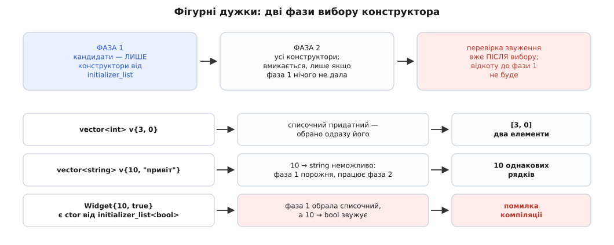
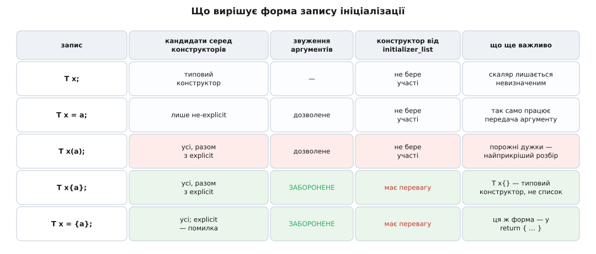
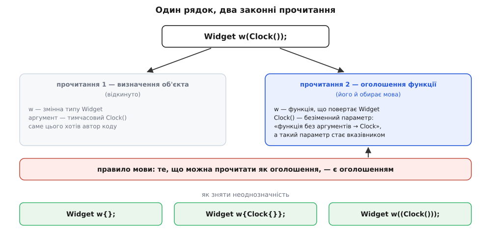

# Форми ініціалізації та найприкріший розбір

<preknowlist>
- [Конструктор і деструктор](root:sf-lang/constructors-destructors) — що робить конструктор, коли його викликають і чим типовий конструктор (без аргументів) відрізняється від решти.
- [Розв'язання перевантаження](root:sys-plang-cpp/overload-resolution) — як компілятор із кількох однойменних функцій обирає одну: список кандидатів, придатність, найкраще збігання.
- [Стадії компілятора](root:sf-lang/compiler-stages) — що таке розбір тексту за граматикою і чому форма запису вирішує сенс рядка ще до будь-якого аналізу типів.
</preknowlist>

Два рядки, які відрізняються лише формою дужок, дають різні об'єкти:

```cpp
std::vector<int> a(3, 0);   // [0, 0, 0]  — три нулі
std::vector<int> b{3, 0};   // [3, 0]     — два елементи
```

А ці два — гірше: другий не створює об'єкта взагалі, хоч і компілюється.

```cpp
std::lock_guard<std::mutex> guard(m);   // м'ютекс захоплено
std::lock_guard<std::mutex> guard();    // не захоплено нічого
```

Обидві пари виглядають як «створити змінну й дати їй початкове значення». Насправді в C++ немає однієї операції «ініціалізувати». Є кілька різних процедур із різними правилами, і те, **як записано** — круглі дужки, фігурні, знак `=` чи взагалі нічого, — визначає, яка з них піде в діло. Форма запису — не оформлення, а вибір семантики.

## Звідки взялося кілька форм

C знала два способи дати змінній початкове значення. Скалярам — знак рівності: `int x = 5;`. Складеним даним — перелік у фігурних дужках: `int a[] = {1, 2, 3};` або `struct Point p = {10, 20};`. Обидва прості, бо в C ініціалізація — це буквально «покласти в пам'ять ці байти»: жодного коду при цьому не виконується.

C++ додала конструктори — і разом із ними потребу **передати аргументи**. Запис `T x = 5` для цього не годився: у нього один аргумент і жодного місця для другого. Тому з'явилася форма з круглими дужками, `T x(arg1, arg2)`, яка виглядає як виклик функції, бо конструктор і є функцією.

Так до C++03 склалася межа, яку доводилося тримати в голові. Фігурні дужки працювали лише для агрегатів — простих структур і масивів без конструкторів. Круглі — лише для класів із конструкторами (`int x(5)` теж дозволено, але масиву так не заповниш). Знак рівності працював в обох випадках, але з власними обмеженнями. Форма залежала від типу, а тип у шаблонному коді якраз і невідомий: узагальнена функція, що хоче створити `T` з набором аргументів, не могла написати рядок, слушний і для `int`, і для `std::vector`, і для структури `Point`.

Саме це й узялися лагодити в C++11: фігурні дужки поширили на **всі** типи. Задум звався однорідною ініціалізацією (uniform initialization) — одна форма запису, хоч який тип. [Як це задумували й чому вийшло не зовсім однорідно](root:sys-plang-cpp/initialization-forms/hist-uniform-init.md) — окрема історія: пропозиції Б'ярне Страуструпа й Ґабріеля Дос Реїса тягнулися від 2003 року, і остаточний механізм комітет узяв з іншого папера, ніж початковий задум.

Наслідок для нас практичний: фігурні дужки не витіснили решту форм, а стали ще однією — п'ятою — з власним набором правил. Ось усі п'ять:

```cpp
T x;          // типова ініціалізація      (default-initialization)
T x = a;      // копіювальна               (copy-initialization)
T x(a);       // пряма                     (direct-initialization)
T x{a};       // пряма списком             (direct-list-initialization)
T x = {a};    // копіювальна списком       (copy-list-initialization)
```

Різниця між ними зводиться до двох питань, і відповідь на кожне залежить від форми: **які конструктори взагалі потрапляють у список кандидатів** і **що дозволено робити з аргументами дорогою**. Розберімо обидва.

## Знак «=» вирізає explicit-конструктори

Почнімо з пари, що відрізняється одним символом: `T x(a)` проти `T x = a`.

При прямій ініціалізації кандидатами стають **усі** конструктори типу. При копіювальній — лише ті, що не позначені як `explicit` (від латин. *explicitus* — «розгорнутий», тут: «названий явно»). Позначка `explicit` каже: цим конструктором вільно користуватися, коли його викликають на ім'я, але мовчки, сам собою, він спрацьовувати не має права.

```cpp
struct Meters {
    explicit Meters(double v) : value(v) {}
    double value;
};

void fly(Meters altitude);

Meters a(100.0);      // ok:     пряма — розглядають усі конструктори
Meters b = 100.0;     // ПОМИЛКА: копіювальна — explicit не потрапив у кандидати
fly(100.0);           // ПОМИЛКА: з тієї ж причини
fly(Meters(100.0));   // ok:     конструктор названо явно
```

Третій рядок — ключ до того, навіщо все це. Передавання аргументу у функцію, повернення значення з функції та кидання винятку — це теж ініціалізація, і саме **копіювальна**: параметр `altitude` ініціалізують виразом `100.0`. Тому позначка `explicit` на конструкторі не просто забороняє один рядок оголошення змінної — вона закриває цілий клас неявних перетворень по всій програмі. Тип `Meters` перестає виникати з голого числа сам собою: висоту в метрах більше не сплутати з висотою у футах, бо кожен перехід від числа до типу треба написати руками.

> 🔧 **Навіщо це.** Коли інтерфейс приймає типізовану обгортку — `Meters`, `UserId`, `Timeout` — саме `explicit` робить обгортку захистом, а не декорацією. Без нього виклик `fly(100.0)` компілюється, і компілятор не має жодної підстави спитати, у яких одиницях це число. Правило просте: конструктор від **одного** аргументу роби `explicit` за умовчанням і знімай позначку лише тоді, коли перетворення справді безпечне й бажане (як `std::string` з рядкового літерала).

У ланцюжку перетворень мова дозволяє **щонайбільше одне** визначене користувачем. Тому `void greet(const std::string&); greet("Аліна");` працює (одне перетворення: `const char*` → `std::string`), а якби `greet` приймала якийсь свій `Name`, збудований зі `std::string`, то виклик `greet("Аліна")` уже не скомпілювався б: перетворень треба два. Це обмеження — теж запобіжник: інакше компілятор шукав би довільно довгі ланцюги й знаходив би такі, про які ніхто не думав.

Форма `T x = {a}` — копіювальна списком — поводиться посередині. Кандидатами стають **усі** конструктори, зокрема `explicit`; але якщо переможе саме `explicit`-конструктор, програма неправильна. Різниця з `T x = a` тонка, зате діагностика краща: замість «немає придатного перетворення» компілятор скаже «обрано explicit-конструктор у копіювальному контексті». Практичний наслідок: `return {a, b};` у функції, що повертає тип із `explicit`-конструктором, не скомпілюється — бо `return` теж копіювальний контекст.

## Що робить порожнеча: типова ініціалізація й ініціалізація значенням

Тепер найпростіші на вигляд форми: `T x;` і `T x{};`. Для класу з написаним конструктором вони роблять те саме. Для решти типів — різне, і різниця коштує ночей налагодження.

```cpp
int i;      // невизначене значення — те, що лежало в цій пам'яті
int j{};    // 0
```

`T x;` — **типова ініціалізація**: для класу викликають конструктор без аргументів; для скаляра (число, вказівник) не роблять **нічого**. Пам'ять під `i` виділено, а вміст її — байти, що там лишилися від попереднього мешканця стека. Читати таке значення — [невизначена поведінка](root:sf-lang/undefined-behavior), і не «прочитаєш сміття», а саме невизначена: оптимізатор має право припустити, що цього не стається, і викинути гілки коду навколо. Виняток — змінні зі статичним часом життя (глобальні, `static`): їх обнуляє завантажувач ще до старту програми, тому глобальний `int` завжди нуль.

`T x{}` — **ініціалізація значенням** (value-initialization): для скаляра це нуль, для класу — виклик типового конструктора. Але між цими двома випадками є третій, найцікавіший, і він регулярно збиває з ніг:

```cpp
struct A { int x; };                    // конструктора немає взагалі
struct B { B() {} int x; };             // порожній конструктор написано руками
struct C { C() = default; int x; };     // конструктор оголошено типовим

A a{};   // a.x == 0
B b{};   // b.x — НЕВИЗНАЧЕНЕ
C c{};   // c.x == 0
```

Логіка тут така. Якщо типовий конструктор **написав користувач** (тіло є в тексті, хай і порожнє), мова вважає: людина сама вирішує долю кожного члена, і втручатися не можна — виконують рівно те, що написано, а написано нічого. Якщо ж конструктора користувач не писав (`A`) або лише оголосив його типовим одразу при оголошенні (`C`), то втручатися нема в що: перед викликом згенерованого конструктора пам'ять під увесь об'єкт **обнуляють**. Слово `= default` при першому оголошенні означає «згенеруй сам», а не «я написав порожній», — і саме тому `C` поводиться як `A`, а не як `B`.

Звідси проста дисципліна: `T x{}` замість `T x;` завжди, коли ти не тримаєш у голові точну відповідь на питання «а цей тип обнулиться сам?». Ціна — два символи; вигода — відсутність цілого класу плаваючих помилок.

Ще один запис того самого: `T x = T();` — теж ініціалізація значенням, через тимчасовий об'єкт праворуч. Починаючи з C++17 копії тут не буде за гарантією мови: тимчасовий об'єкт не створюється й не переміщується, а `x` ініціалізують безпосередньо ([усунення копій](root:sys-plang-cpp/copy-elision)). Форма старша й довша, зустрічається в коді до C++11 — але робить те саме, що `T x{}`.

## Агрегати: коли конструктора немає взагалі

Окремий світ — типи, у яких конструктора немає й ініціалізувати треба члени напряму. Такий тип звуть **агрегатом** (від латин. *aggregare* — «збирати докупи»): масив або клас, у якого немає оголошених користувачем конструкторів, немає закритих чи захищених нестатичних полів, немає віртуальних функцій і віртуальних або невідкритих базових класів. Умова «немає конструкторів» тут головна: якщо конструктор є, ініціалізацією командує він, а не перелік у дужках.

```cpp
struct Config {
    int  port      = 8080;
    int  backlog   = 128;
    bool reuseAddr = false;
};

Config c1{};                                    // 8080, 128, false
Config c2{9000};                                // 9000, 128, false
Config c3{9000, 512, true};                     // усе задано
Config c4{.port = 9000, .reuseAddr = true};     // C++20: за іменами
```

Правило заповнення: значення з дужок роздають членам **за порядком оголошення**. Члени, яким значення не дісталося, ініціалізують так, ніби для них написано порожні дужки — тобто беруть усталене значення з оголошення (`= 8080`), а якщо його немає, застосовують ініціалізацію значенням, тобто нуль для чисел. Зайвих значень бути не може: більше, ніж членів, — помилка компіляції.

Форма `c4` з іменами полів — призначені ініціалізатори (designated initializers), C++20. Вони рятують читабельність там, де полів багато й половина з них однакового типу: рядок `Config{9000, 512, true}` вимагає пам'ятати порядок, `Config{.port = 9000}` — ні. Обмеження суворіші, ніж у C: імена мають іти **в тому самому порядку**, що й оголошення полів (можна пропускати, не можна вертатися назад), і мішати іменовані значення з позиційними не дозволено.

Одна деталь у визначенні агрегату дрейфувала від стандарту до стандарту, і це та рідкісна тема, де питання «а в якій ви версії?» доречне буквально. У C++11 агрегат не міг мати ані базових класів, ані усталених значень членів; C++14 дозволив усталені значення; C++17 дозволив відкриті невіртуальні бази; C++20 посилив вимогу — тепер дискваліфікує **будь-який** оголошений користувачем конструктор, навіть `= delete` чи `= default`. Тому та сама структура може бути агрегатом в одному режимі компіляції й не бути в іншому, а разом із цим змінюється й сенс `T x{…}`. Що саме принесли ці випуски — у [C++17](root:sys-plang-cpp/cpp17-features) і [C++20](root:sys-plang-cpp/cpp20-features).

І ще одна асиметрія, яку C++20 прибрала. До неї агрегат приймав лише фігурні дужки: `Config c(9000)` не компілювався, бо конструктора з `int` не існує. Дрібниця — поки не згадаєш, що `std::make_unique<Config>(9000)` і `vec.emplace_back(9000)` усередині створюють об'єкт саме круглими дужками. Через це агрегати не працювали з половиною стандартної бібліотеки. Папір P0960, прийнятий у C++20, дозволив ініціалізувати агрегат і круглим переліком теж — але **за правилами круглих дужок**: звуження дозволене, імен полів немає, тимчасовий об'єкт, прив'язаний до посилального члена, не подовжує життя. Тобто `Config c(9000)` і `Config c{9000}` тепер обидва працюють, і це різні операції.

## Звуження: за що фігурні дужки варті клопоту

Тепер друге з двох питань — що дозволено робити з аргументами. Тут між формами прірва.

```cpp
double d = 3.99;

int a(d);   // 3 — мовчки
int b{d};   // ПОМИЛКА компіляції: звуження
```

**Звуження** (narrowing) — перетворення, яке в принципі може втратити дані: з дробового в ціле, з ширшого цілого у вужче, зі знакового в беззнакове й навпаки, з `double` у `float`. Усередині фігурних дужок мова забороняє його **завжди**, незалежно від того, чи справді щось загубиться. Виняток один і розумний: якщо значення — константний вираз і воно точно вміщається в цільовий тип, звуження не рахують.

```cpp
char c{65};     // ok: константа, у char влазить
char e{300};    // ПОМИЛКА: константа, але в char не влазить
int  f = 70000;
char g{f};      // ПОМИЛКА: не константа — перевірити неможливо, отже заборонено
```

**Умова.** Датчик віддає напругу у вольтах як `double`, а протокол вимагає ціле число мілівольтів.

```
виміряно:            v  = 3.29999999 В
перерахунок:         mv = v * 1000.0 = 3299.99999
int x(mv);           →  3299     дробову частину відкинуто мовчки
int x = mv;          →  3299     те саме
int x{mv};           →  помилка компіляції: звуження double → int
int x{std::lround(mv)};   →  ПОМИЛКА: long → int теж звуження
int x = static_cast<int>(std::lround(mv));   →  3300
```

Похибка на один мілівольт нікого не вб'є; звичка мовчки відкидати дробову частину — цілком може, коли той самий код перерахує кути чи координати. Фігурні дужки не роблять перетворення правильним — вони змушують **написати намір**: округлюємо ми чи відкидаємо, і чи усвідомлюємо втрату. Це найсильніший практичний аргумент за те, щоб брати фігурні дужки формою за умовчанням.

## Жадібність initializer_list

Найбільша несподіванка фігурних дужок ховається не в правилах перетворення, а у виборі самого конструктора — і саме вона пояснює приклад із `vector`, з якого все почалося.

Коли компілятор бачить перелік у фігурних дужках, він може зібрати з нього об'єкт `std::initializer_list<T>` — легкий незмінний вид (пара «вказівник + довжина») на тимчасовий масив, який компілятор створює на місці. Клас, що має конструктор від `std::initializer_list`, приймає таким чином скільки завгодно однотипних значень: саме так `std::vector<int> v{1, 2, 3, 4}` наповнюється чотирма елементами.

Але щоб цей механізм працював передбачувано, знадобилося жорстке правило пріоритету. Ось воно: **якщо ініціалізація йде фігурними дужками і в класу є хоч один конструктор від `initializer_list`, спершу розглядають лише такі конструктори**. Решту беруть до уваги тільки тоді, коли жоден зі списочних не придатний узагалі — тобто коли з наявних значень не збудувати список потрібного типу.



*Фігурні дужки спершу пробують лише конструктори від initializer_list; решта конструкторів отримує шанс, тільки якщо жоден списочний не придатний. Перевірка звуження йде вже після вибору й відкотити його не може.*

Звідси все й випливає:

```cpp
std::vector<int> a(3, 0);   // (кількість, значення) → [0, 0, 0]
std::vector<int> b{3, 0};   // initializer_list<int>{3, 0} → [3, 0]
```

Обидва конструктори придатні, але фігурні дужки навіть не дивляться на `(size_t, const int&)`: списочний придатний, отже виграв. А тепер той самий запис для рядків:

```cpp
std::vector<std::string> c{10, "привіт"};   // 10 однакових рядків!
```

Тут `initializer_list<std::string>` **не** придатний: число `10` у `std::string` не перетворюється жодним чином. Перша фаза не дала нічого, вмикається друга — і виграє конструктор «кількість + значення». Той самий синтаксис, той самий контейнер, протилежний результат: змінився лише тип елемента.

Найнеприємніший наслідок правила — те, що вибір роблять **до** перевірки звуження й назад не відкочують:

```cpp
struct Widget {
    Widget(int n, bool flag);
    Widget(std::initializer_list<bool> bits);
};

Widget w1(10, true);   // (int, bool)
Widget w2{10, true};   // обрано initializer_list<bool> → ПОМИЛКА: 10 → bool звужує
```

Здавалося б, компілятор міг би побачити помилку й тихо взяти `(int, bool)`. Він цього не робить — і слушно. Вибір перевантаження й перевірка звуження — дві різні стадії, і якби друга мала право переграти першу, то сенс рядка залежав би від конкретних значень: `Widget{1, true}` викликав би один конструктор, а `Widget{300, true}` — інший. Краще чесна помилка, ніж код, що міняє поведінку від зміни константи.

Порожні дужки — окреме правило, і воно те, якого хочеться: `Widget w{}` викликає **типовий** конструктор, а не списочний із порожнім списком. Щоб дістати саме порожній список, треба написати дужки в дужках — `Widget w({})` або `Widget w{{}}`.

> 🔧 **Навіщо це.** Правило важливе не тоді, коли ти пишеш `vector`, а тоді, коли пишеш **свій** клас. Додати до готового класу конструктор від `initializer_list` — зміна, що мовчки перехоплює виклики, які раніше йшли на інші конструктори: увесь код, що ініціалізував об'єкт фігурними дужками, після перезбирання поводитиметься інакше. Тому конструктор від `initializer_list` додають свідомо й лише туди, де «перелік однотипних значень» — природний сенс типу (контейнер, множина, матриця), а не аби прикрасити виклик.

Тепер усі п'ять форм можна побачити поруч.



*Кожна форма відповідає на два питання по-своєму: які конструктори взагалі потрапляють у список кандидатів і чи дозволено звуження. Знак «=» вирізає explicit, фігурні дужки забороняють звуження й дають перевагу конструктору від initializer_list.*

## Найприкріший розбір

Є ще одна форма — та, що взагалі не створює об'єкта, хоч виглядає найбуденніше.

```cpp
Widget w();   // це НЕ об'єкт
```

Цей рядок оголошує **функцію** на ім'я `w`, яка не бере аргументів і повертає `Widget`. Компілятор не помиляється: він робить рівно те, що велить граматика. У C++ є правило розв'язання неоднозначності — якщо рядок можна прочитати і як оголошення, і як вираз, він **є оголошенням**. Це успадковано від C, де функцію дозволено оголошувати будь-де, зокрема й усередині тіла іншої функції, і де оголошення традиційно повторює форму вжитку.

Ключове тут — **коли** ухвалюється рішення. Розбір іде за граматикою, до того як компілятор щось знає про `Widget`, його конструктори чи наміри автора. На цьому етапі є лише послідовність лексем, а вона бездоганно збігається з формою оголошення функції. Жодних підстав вирішити інакше в парсера немає.

Прикрість у тім, що ніякої помилки в цьому місці не буде. Помилка вилізе далеко нижче, при першому вжитку:

```
error: request for member 'draw' in 'w', which is of non-class type 'Widget()'
```

Прочитати таке повідомлення й побачити в ньому «твоє оголошення насправді функція» — навичка, яку набувають лише через біль. Саме тому Скотт Маєрс, описавши цю пастку 2001 року в книзі *Effective STL* (пункт 6), назвав її **найприкрішим розбором** (most vexing parse) — і назва прижилася.

Повна версія пастки виникає, коли аргумент є, але він теж схожий на тип:

```cpp
Widget w(Clock());
```

Це знову функція: `w` бере один параметр і повертає `Widget`. Що ж за параметр? Запис `Clock()` у списку параметрів читають як безіменний параметр типу «функція без аргументів, що повертає `Clock`», а параметр функційного типу мова автоматично перетворює на **вказівник на функцію** — так само, як параметр-масив перетворюється на вказівник. Отже, `w` — це функція типу `Widget(Clock(*)())`.

Класичний випадок із двома аргументами добиває:

```cpp
std::string s(std::istream_iterator<char>(in), std::istream_iterator<char>());
```

Тут перший параметр — це параметр **на ім'я `in`** типу `std::istream_iterator<char>`: зайві дужки навколо імені параметра граматика дозволяє. Другий — знову вказівник на функцію. Замість рядка, прочитаного з потоку, маємо оголошення функції з двома параметрами.



*Той самий текст граматика читає і як створення об'єкта, і як оголошення функції; правило мови віддає перевагу оголошенню. Круглі дужки навколо аргументу або фігурні дужки роблять прочитання-оголошення неможливим.*

Ліки прямі — зробити так, щоб прочитати рядок як оголошення було **неможливо**:

```cpp
Widget w{};              // фігурні: список параметрів фігурними не пишуть
Widget w{Clock{}};       // так само
Widget w((Clock()));     // зайві дужки: всередині тепер вираз, а не тип параметра
auto w = Widget(Clock());// праворуч від «=» оголошення бути не може
```

Найнадійніший — фігурні дужки. Список параметрів функції у фігурних дужках не записують ніде й ніколи, тому неоднозначності просто немає: `Widget w{}` — це завжди об'єкт.

Те саме правило пояснює ще одне обмеження, з яким стикаються всі. Усталене значення поля прямо в класі не можна задати круглими дужками:

```cpp
struct Sensor {
    int channel(0);   // ПОМИЛКА
    int period = 100; // ok
    int gain{1};      // ok
};
```

Причина та сама: `int channel(0);` усередині класу граматика читає як оголошення функції-члена — а `0` не є коректним оголошенням параметра. Тому для полів залишили лише `=` і фігурні дужки.

> 🔧 **Навіщо це.** Небезпечна не та форма, що не компілюється, а та, що компілюється мовчки. Рядок `std::lock_guard<std::mutex> guard();` — оголошення функції, м'ютекс не захоплено, гонитва даних чекає нагоди ([м'ютекс і RAII-замки](root:sys-plang-cpp/mutex-and-raii-locks)). Компілятори навчилися це ловити: Clang давно має попередження `-Wvexing-parse`, GCC додав його у версії 11 і теж вмикає без прапорця. Тримати ці попередження увімкненими — дешевша профілактика, ніж пошук гонитви в бойовій системі.

## Фігурні дужки й auto

Коли зліва стоїть `auto`, фігурні дужки поводяться ще по-своєму — це варто знати, бо правило змінювали посеред життя мови.

```cpp
auto a = {1, 2};   // std::initializer_list<int>
auto b{1};         // int
auto c{1, 2};      // ПОМИЛКА: забагато значень
auto d = {1};      // std::initializer_list<int>
```

Форма зі знаком рівності завжди дає `std::initializer_list`. Форма без нього спершу поводилася так само, і `auto b{1}` давала список з одного елемента — що майже завжди було не тим, чого хотіли. Папір N3922 змінив правило: перелік без `=` з одного значення виводить тип цього значення, а з кількох — просто помилка. Формально зміна належить C++17, але GCC і Clang застосували її й до старіших режимів як виправлення дефекту, тож поведінка залежить не лише від прапорця стандарту, а й від версії компілятора. Подробиці виведення — у [auto й виведення типу](root:sys-plang-cpp/auto-type-deduction).

Окремо варто знати, що звичайні шаблони так **не** вміють: `template<class T> void f(T);` не можна викликати як `f({1, 2})`, бо `T` з переліку не виводиться. Виняток зроблено рівно для `auto` ([виведення аргументів шаблону](root:sys-plang-cpp/template-argument-deduction)).

## Як обирати форму

Із двох питань — «які конструктори кандидати» і «що дозволено з аргументами» — випливає коротка робоча звичка.

**Фігурні дужки — за умовчанням.** Вони ловлять звуження, не мають найприкрішого розбору, однаково працюють для агрегатів і для класів із конструкторами, а `T x{}` гарантує визначене початкове значення там, де `T x;` лишила б сміття.

**Круглі дужки — коли треба конструктор, який фігурні перекривають.** Це рівно один випадок, зате поширений: клас має конструктор від `initializer_list`, а тобі потрібен інший. `std::vector<int> v(n)` — вектор із `n` нулів; `std::vector<int> v{n}` — вектор з одного елемента `n`. Тут форма — не смак, а вибір конструктора.

**Знак «=» — коли перетворення має бути дозволене явно.** `T x = a;` не пропустить `explicit`-конструктор, і саме цим корисний: якщо рядок скомпілювався, значить, автор типу справді вважав таке перетворення безпечним.

**У шаблонному коді — `T x{}` або `T x{args…}`**, бо це єдина форма, слушна й для `int`, і для структури без конструкторів, і для класу з конструкторами. Пам'ятаючи, звісно, що для типу з `initializer_list`-конструктором вона обере саме його. Коли треба точно передати аргументи «як є», стандартна бібліотека послідовно вживає круглі дужки — саме тому `std::make_shared`, `emplace_back` і подібні будують об'єкт круглими, а не фігурними.

Побачити ці правила на живому коді допомагає простий дослід: [клас із інструментованими конструкторами](root:sys-plang-cpp/initialization-forms/proj-which-ctor.md), який друкує, кого саме викликали, — на ньому за десять хвилин перевіряються всі описані випадки, включно з різницею між версіями стандарту.

І остання порада — про читання чужого коду. Побачивши ініціалізацію, корисно питати не «що тут створюють», а два питання, з яких усе почалося: **які конструктори взагалі потрапили в список кандидатів** і **що дозволено робити з аргументами**. Відповідь на обидва вже записана — формою дужок.
