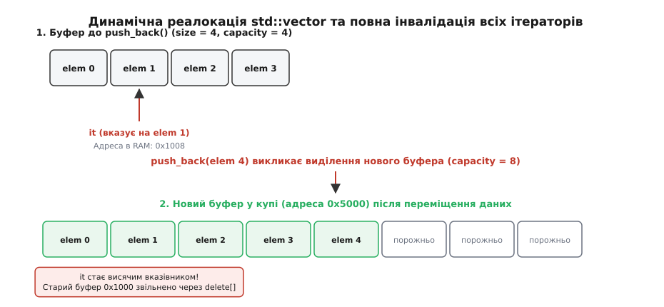
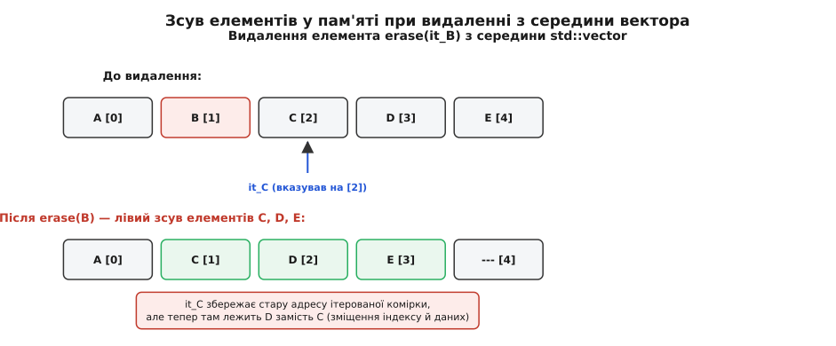
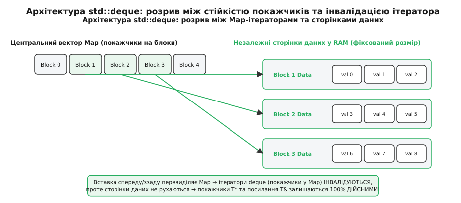
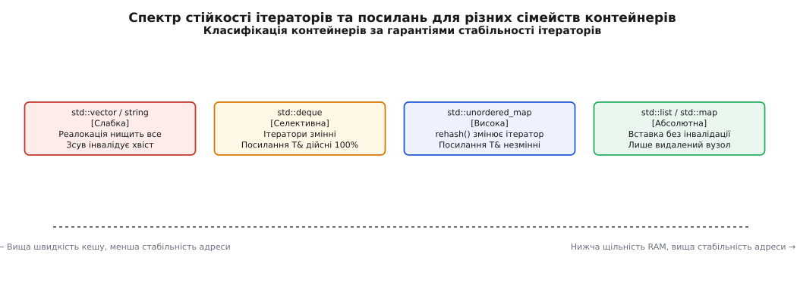

# Інвалідація ітераторів: механізми, правила та захист пам'яті

<preknowlist>
- [Ітератори: категорії й модель обходу](root:sys-plang-cpp/iterators-model) — модель абстракції курсорів та оператори розіменування/інкременту.
- [Контейнери STL: вибір під задачу і ціна операцій](root:sys-plang-cpp/stl-containers-choice) — внутрішня укладка `std::vector`, `std::list`, `std::deque`, `std::unordered_map` у RAM.
- [Адреси та вказівники](root:sf-lang/addresses-pointers) — як пам'ять адресується в системі, виділення у купі та арифметика вказівників.
</preknowlist>

Сервер фінансового моніторингу обробляє потік транзакцій у режимі реального часу, зберігаючи активні сесії у динамічному масиві `std::vector<Session>`. Під час циклу перевірки підозрілих операцій розробник додає новий запис про аудит за допомогою `sessions.push_back(audit_session)`. У той самий момент вектор вичерпує зарезервовану місткість, виділяє новий блок пам'яті у купі, переміщує туди наявні об'єкти та вивільняє старий буфер. Цикл `for (auto it = sessions.begin(); it != sessions.end(); ++it)` продовжує рух за старими адресами, що призводить до падіння процесу з помилкою Segmentation Fault або до прихованого псування чужих даних у пам'яті.

Подібні катастрофічні збої спричинені явищем, відомим як **інвалідація ітераторів** (від англ. *iterator invalidation*, від латинського *invalidus* — недійсний, слабкий). Розуміння фізичних причин інвалідації та суворих правил мови C++ є необхідною умовою для написання надійних і високопродуктивних систем.

---

## 1. Природа інвалідації: що фізично відбувається у пам'яті

Щоб зрозуміти, чому ітератор раптом стає недійсним, потрібно подивитися на нього не як на абстрактну математичну сутність, а як на конкретну структуру у фізичному адресному просторі комп'ютера.

У мові C++ ітератор розроблено як узагальнення сирого вказівника (англ. *raw pointer*). Головне завдання ітератора — забезпечити прозорий доступ до елемента контейнера через оператор розіменування `operator*()` та перехід до наступного елемента через оператор інкременту `operator++()`. Проте фізичне втілення цього інтерфейсу суттєво відрізняється залежно від архітектури контейнера:

1. **Для суцільного динамічного масиву (`std::vector<T>`)**: Ітератором є сирий вказівник `T*` на комірку в оперативній пам'яті або тонка обгортка над ним.
2. **Для двозв'язаного списку (`std::list<T>`)**: Ітератор містить вказівник `Node<T>*` на вузол списку у купі (англ. *heap*).
3. **Для двовенцевої черги (`std::deque<T>`)**: Ітератор є складною структурою із чотирьох покажчиків: на поточний елемент (`cur`), на початок сторінки (`first`), на кінець сторінки (`last`) та на комірку центрального масиву покажчиків сторінок (`node`).

**Інвалідація ітератора** відбувається тоді, коли внаслідок модифікуючої операції над контейнером руйнується фізичний або логічний інваріант пам'яті, на який спирався ітератор.

```
       Стан пам'яті до реалокації вектора:
       Vector Header [ ptr = 0x1000, size = 4, capacity = 4 ]
       RAM 0x1000: [ Elem 0 ][ Elem 1 ][ Elem 2 ][ Elem 3 ]
                                 ^
                                 |-- ітератор `it` збережає адресу 0x1008

       Виклик push_back(Elem 4) викликає реалокацію:
       1. new_ptr = allocate(8)  -> 0x5000 (новий блок у купі)
       2. move elements from 0x1000 to 0x5000
       3. deallocate(0x1000)     <- Старий блок повернуто ОС!

       Стан пам'яті після реалокації:
       Vector Header [ ptr = 0x5000, size = 5, capacity = 8 ]
       RAM 0x5000: [ Elem 0 ][ Elem 1 ][ Elem 2 ][ Elem 3 ][ Elem 4 ]...
       
       РЕЗУЛЬТАТ: ітератор `it` все ще зберігає адресу 0x1008!
       Спроба виконати *it викликає Use-After-Free (Undefined Behavior).
```

### Фізична модель пам'яті та адресація вказуваного об'єкта

Операційна система виділяє динамічну пам'ять для контейнерів C++ у вигляді віртуальних сторінок пам'яті (англ. *virtual memory pages*). Коли контейнер замовляє новий буфер через `allocator::allocate(N)`, менеджер купи (англ. *heap manager*) знаходить підрядний блок запитаного розміру і повертає базову адресу (наприклад `0x5000`).

Кожен ітератор для `std::vector` спирається на арифметику вказівників: адреса елемента `i` обчислюється як `base_ptr + i * sizeof(T)`.

Коли відбувається реалокація пам'яті, менеджер купи виконує системний виклик звільнення пам'яті (наприклад `free()` або `munmap()`) для старого буфера за адресою `0x1000`. Фізичні сторінки за цією адресою можуть бути віддані іншим потокам виконання або повернуті операційній системі. 

Якщо ітератор продовжує зберігати стару адресу `0x1008` і програма викликає `*it`, відбувається одна з двох форм руйнування програми:
1. **Просторова інвалідація (Spatial Invalidation / Use-After-Free)**: Адресу `0x1000` звільнено. Розіменування викликає апаратне переривання процесора (Page Fault) і операційна система завершує процес із помилкою `SIGSEGV` (Segmentation Fault).
2. **Часова інвалідація (Temporal Invalidation / Memory Corruption)**: Адреса `0x1000` вже перевиділена менеджером купи для абсолютно іншого об'єкта другого потоку. Розіменування `*it = 999` перезаписує чужі дані у пам'яті, що призводить до некоректних обчислень у випадковий момент часу.

### Три рівні втрати дійсності: Ітератори, Посилання та Покажчики

Стандарт C++ суворо розрізняє три рівні втрати стабільності адрес:

- **Інвалідація ітератора (Iterator Invalidation)**: Використання операцій `*it`, `it->`, `++it` або порівняння `it == end()` призводить до невизначеної поведінки (UB).
- **Інвалідація посилання (Reference Invalidation)**: Звернення через посилання `T&`, збережене раніше як `T& ref = vec[i];`, стає недійсним.
- **Інвалідація покажчика (Pointer Invalidation)**: Сирий вказівник `T* ptr = &vec[i];` перетворюється на висячий вказівник (англ. *dangling pointer*).

У багатьох контейнерах (наприклад, у `std::vector`) інвалідація ітератора, посилання та покажчика відбувається одночасно. Проте у посторінкових контейнерах (зокрема у `std::deque`) виникає унікальний розрив: ітератор `std::deque::iterator` інвалідується, а посилання `T&` та покажчик `T*` залишаються повністю дійсними. Осмислення цього розриву вимагає детального аналізу укладки даних у купі.

---

## 2. Суцільні контейнери: std::vector, std::string та std::array

Контейнери із суцільним розташуванням елементів у пам'яті (англ. *contiguous storage*) забезпечують максимальну швидкість обходу завдяки кеш-локальності процесора (англ. *CPU cache locality*), але сплачують за це найвищим ризиком інвалідації адрес.


*Динамічна реалокація буфера std::vector при перевищенні місткості. Усі ітератори та вказівники, що посилалися на старий буфер, стають висячими вказівниками (Use-After-Free).*

### Механіка реалокації у std::vector

Контейнер `std::vector<T>` у більшості реалізацій зберігає у структурі трійку вказівників:
- `T* m_first` — адреса початку виділеного буфера у купі.
- `T* m_last` — адреса за останнім конструйованим елементом (`size = m_last - m_first`).
- `T* m_end_of_storage` — адреса кінця зарезервованого буфера (`capacity = m_end_of_storage - m_first`).

Взаємодія операцій додавання елементів з ітераторами регулюється співвідношенням поточного розміру `size()` та зарезервованої місткості `capacity()`:

#### 1. Випадок перевищення місткості (`size() == capacity()`)
Коли викликається метод `push_back()`, `emplace_back()`, `insert()` або `resize()`, а вільний простір у буфері вичерпано (`m_last == m_end_of_storage`), контейнер виконує п'ять послідовних кроків:
1. Запитує у алокатора новий блок пам'яті більшого розміру (зазвичай геометрична прогресія з коефіцієнтом `k = 1.5` у MSVC та Clang або `k = 2.0` у GCC).
2. Виділяє новий буфер у купі за допомогою `allocator_traits<Alloc>::allocate`.
3. Переміщує наявні елементи зі старого буфера у новий за допомогою `std::uninitialized_move_if_noexcept`. Якщо конструктор переміщення типу `T` може кидати виняток (не позначений `noexcept`), вектор виконує копіювання елементів задля забезпечення суворої гарантії виняткобезпеки (англ. *Strong Exception Guarantee*).
4. Викликає деструктори старого масиву елементів.
5. Звільняє старий блок пам'яті через виклик `allocator_traits<Alloc>::deallocate`.

**Нормативний наслідок**: Усі без винятку ітератори, посилання та покажчики на будь-які елементи даного вектора, включаючи ітератор кінця `end()`, **інвалідуються**.

#### 2. Випадок наявності запасного простору (`size() < capacity()`)
Якщо реалокація не потрібна, старий буфер залишається на місці у купі. Проте інвалідація все одно відбувається для частини елементів через їхній фізичний зсув:
- **Додавання у кінець (`push_back`, `emplace_back`)**: Усі ітератори та посилання на існуючі елементи від `[0]` до `[size-1]` **залишаються 100% дійсними**. Інвалідується лише ітератор `end()`, оскільки межа масиву зсунулася праворуч.
- **Вставка у середину (`insert`, `emplace`)**: Елементи від позиції вставки `pos` до кінця масиву зміщуються праворуч на `N` комірок за допомогою `std::move_backward`. Усі ітератори та посилання на елементи **до позиції `pos` залишаються дійсними**, а у позиції `pos` та **після неї — інвалідуються**.


*Зсув елементів уліво при виконанні erase() з середини вектора. Фізичні адреси осередків не змінюються, проте значення у комірках зміщуються, роблячи існуючі ітератори недійсними.*

### Видалення елементів з std::vector

Операції видалення `pop_back()`, `erase()` або `clear()` ніколи не звільняють виділену місткість `capacity()` самостійно:
- `pop_back()` інвалідує лише ітератор `end()` та посилання на видалений останній елемент.
- `erase(pos)` зсуває всі елементи праворуч від `pos` уліво на одну позицію через `std::move`. Усі ітератори та посилання на елементи **до позиції `pos` залишаються дійсними**, а у позиції `pos` та **після неї — інвалідуються**.
- `clear()` інвалідує всі ітератори та посилання на елементи, хоча `capacity()` залишається незмінним.

```cpp
std::vector<int> vec = {10, 20, 30, 40, 50};
vec.reserve(10); // Забезпечуємо capacity = 10 (реалокацій не буде)

auto it_20 = vec.begin() + 1; // Вказує на значення 20 (адреса 0x1004)
auto it_40 = vec.begin() + 3; // Вказує на значення 40 (адреса 0x100C)

vec.erase(vec.begin() + 1); // Видаляємо елемент 20 (позиція [1])

// it_20 тепер інвалідований (елемент видалено)!
// it_40 зберігає адресу 0x100C, але після зсуву там тепер лежить 50 замість 40!
// Спроба використати it_40 за старою логікою є семантичною інвалідацією.
```

### Специфіка std::string та Small String Optimization (SSO)

Символьні рядки `std::string` підпорядковуються тим самим правилам інвалідації, що й `std::vector<char>`, але володіють небезпечною особливістю — **оптимізацією малих рядків (SSO)**.

У сучасних реалізаціях C++ об'єкт `std::string` містить у собі внутрішній буфер (зазвичай 15 або 22 байти). Поки довжина рядка не перевищує поріг SSO, символи зберігаються безпосередньо у стековій пам'яті самого об'єкта `std::string`. Як тільки рядок зростає, відбувається виділення буфера у купі та перехід від SSO до динамічного масиву.

Це означає, що звернення через сирий вказівник `const char* ptr = str.c_str();` інвалідується не лише при реалокаціях у купі, а й при першому виході рядка за межі порогу SSO! Про історичний шлях від небезпечних Copy-On-Write рядків до сучасної модель SSO читайте у вставці [📜 Історія та еволюція правил інвалідації ітераторів у стандарту C++](root:sys-plang-cpp/iterator-invalidation/hist-iterator-invalidation.md).

### Співвідношення з std::array

Контейнер `std::array<T, N>` зберігає елементи фіксованого розміру `N` безпосередньо на стеку або всередині структури. Оскільки `std::array` не підтримує додавання або видалення елементів, у ньому **відсутня інвалідація ітераторів**: ітератори та посилання залишаються дійсними протягом усього часу життя об'єкта `std::array`.

---

## 3. Посторінкові та вузлові контейнери

Контейнери, які зберігають дані у вигляді роззосереджених у купі блоків або вузлів, пропонують суттєво вищий рівень стабільності адрес.


*Архітектура std::deque. Центральний масив покажчиків Map може реалокуватися при push_front/back, що інвалідує ітератори deque, але сторінки даних залишаються нерухомими у RAM, зберігаючи дійсність покажчиків T* та посилань T&.*

### Розрив гарантій у std::deque

Двовенцева черга `std::deque<T>` складається з двох рівнів пам'яті:
1. Незалежні сторінки (блоки) пам'яті фіксованого розміру у купі, де зберігаються самі об'єкти `T`.
2. Центральний вектор покажчиків (Map), який містить адреси цих сторінок.

Структура ітератора `std::deque::iterator` описується такою концептуальною схемою:
```cpp
template <typename T>
struct deque_iterator {
    T* cur;       // Поточний елемент на сторінці
    T* first;     // Початок поточної сторінки
    T* last;      // Кінець поточної сторінки
    T** node;     // Вказівник на комірку масиву Map
};
```

Ця двоуровнева структура створює фундаментальний розрив у гарантіях інвалідації:

#### 1. Модифікація по краях (`push_front`, `push_back`, `pop_front`, `pop_back`)
При додаванні елементів у початок або кінець `std::deque` може знадобитися розширення центрального вектора покажчиків Map.
- Оскільки об'єкт `std::deque::iterator` зберігає вказівник `node` на комірку вектора Map, реалокація вектора Map **інвалідує всі ітератори `std::deque`**!
- Проте самі сторінки даних у купі ніколи не змінюють своїх адрес! Тому **усі посилання (`T&`) та покажчики (`T*`) на наявні елементи залишаються 100% ДІЙСНИМИ**.

```cpp
std::deque<int> dq = {10, 20, 30};
int& ref_20 = dq[1]; // Посилання на значення 20 у сторінці пам'яті
auto it_20 = dq.begin() + 1; // Ітератор на значення 20

dq.push_back(40); // Можлива реалокація центрального вектора Map!

// it_20 МОЖЕ БУТИ ІНВАЛІДОВАНИЙ (якщо вектор Map змінив адресу)!
// ref_20 ГАРАНТОВАНО ДІЙСНЕ! Операція ref_20 = 99 є повністю безпечною.
```

#### 2. Модифікація у середині (`insert`, `erase`)
Якщо елемент вставляється або видаляється з середини `std::deque`, контейнер виконує зсув елементів на сторінках для мінімізації переміщень. Це **інвалідує взагалі всі ітератори, посилання та покажчики** на всі елементи контейнера.

### Вузлові списки: std::list та std::forward_list

Оскільки кожен вузол двозв'язаного списку `std::list` або однозв'язного списку `std::forward_list` виділяється у купі як окремий об'єкт `Node<T>`, вони надають найсуворіші гарантії:
- **Вставка (`push_back`, `push_front`, `insert`, `emplace`)**: **Жоден існуючий ітератор, посилання чи покажчик не інвалідується**.
- **Видалення (`erase`)**: Інвалідується **лише** ітератор та посилання на вузол, який безпосередньо видаляється.
- **Переміщення вузлів (`splice`)**: Метод `splice()` дозволяє вирізати вузол з одного списку й вбудувати його у інший список за `O(1)` шляхом переприв'язки кількох вказівників. **Жоден ітератор чи посилання не інвалідується**, змінюється лише порядок обходу.

---

## 4. Асоціативні та геш-контейнери

Деревоподібні та геш-структури даних гарантують абсолютну ізоляцію пам'яті окремих вузлів.


*Класифікація стандартних контейнерів за ступенем стабільності адрес у пам'яті. Вузлові списки та дерев'яні контейнери забезпечують абсолютну стабільність, тоді як векторні контейнери вимагають обережності при реалокаціях.*

### Дерев'яні контейнери (std::map, std::set, std::multimap, std::multiset)

Впорядковані асоціативні контейнери побудовано на базі сбалансованих червоно-чорних дерев пошуку.
- Елементи зберігаються у нерухомих вузлах у купі.
- При вставці нових елементів або під час балансування дерева (поворотах вузлів) змінюються лише внутрішні вказівники зв'язків `left`, `right`, `parent` та колірні прапорці. Фізичні адреси вузлів залишаються незмінними.
- **Вставка не інвалідує жодного ітератора, посилання чи покажчика**.
- **Видалення `erase(pos)` інвалідує лише той ітератор та посилання, які посилалися на видалений вузол**.

З повною нормативною таблицею гарантій для всіх операцій контейнерів можна ознайомитися у довіднику [📋 Матриця правил інвалідації та контракти гарантій контейнерів C++](root:sys-plang-cpp/iterator-invalidation/api-invalidation-matrix.md).

#### C++17 Node Handles: Вилучення вузлів без інвалідації
Починаючи з C++17, методи `.extract()` дозволяють від'єднати вузол дерева у вигляді об'єкта `container::node_type` без знищення елемента. Це дозволяє переносити вузли між контейнерами `std::map` без викликів `malloc`/`free` із гарантованим збереженням дійсності посилань на дані всередині вузла.

### Геш-таблиці (std::unordered_map, std::unordered_set)

Контейнери невпорядкованого пошуку зберігають дані у вигляді однозв'язних списків елементів, розподілених по кошиках (англ. *buckets*).

1. **Вставка без повторного гешування (`load_factor() <= max_load_factor()`)**:
   - Посилання `T&` та покажчики `T*` на елементи **залишаються дійсними завжди**.
   - Ітератори можуть змінювати порядок послідовного обходу, оскільки новий елемент додається у початок ланцюжка кошика.
2. **Вставка з повторним гешуванням (`rehash()`)**:
   - При перевищенні `max_load_factor()` виділяється новий масив кошиків.
   - **Усі ітератори інвалідуються**, оскільки ітерація по кошиках перебудовується.
   - **Усі посилання `T&` та покажчики `T*` на об'єкти залишаються ДІЙСНИМИ**, бо самі об'єкти лежать у нерухомих вузлах купи.

### Адаптери C++23: std::flat_map та std::flat_set

У C++23 з'явилися адаптери `std::flat_map`, які зберігають ключі та значення у двох суцільних векторах `std::vector<Key>` та `std::vector<Value>`. Вони забезпечують найвищу швидкість бінарного пошуку завдяки кеш-локальності, але **їхні правила інвалідації повністю ідентичні rules `std::vector`**: будь-яка вставка чи видалення зсуває елементи в масивах й інвалідує ітератори та посилання.

---

## 5. Системні пастки, антипатерни та безпечні ідіоми

Розглянемо найтиповіші помилки розробників, пов'язані з неявною інвалідацією ітераторів.

### Антипатерн 1: Модифікація вектора під час ітерації у циклі for

Найдешевша і найнебезпечніша помилка — видалення елементів з `std::vector` у класичному циклі:

```cpp
// ❌ ПОМИЛКА: Невизначена поведінка (Undefined Behavior)!
std::vector<int> numbers = {1, 2, 3, 4, 5, 6};

for (auto it = numbers.begin(); it != numbers.end(); ++it) {
    if (*it % 2 == 0) {
        numbers.erase(it); // it інвалідується! 
                           // На наступній ітерації виконується ++it над недійсним ітератором.
    }
}
```

**Чому це ламається**: Метод `erase(it)` видаляє елемент, зсуває всі наступні елементи вліво і повертає **новий дійсний ітератор** на елемент, який став на місце видаленого. Виклик `numbers.erase(it)` інвалідує сам `it`, після чого заголовок циклу виконує `++it`, пропускаючи сусідній елемент або викликаючи падіння через Use-After-Free.

#### Коректне розв'язання (C++98 / C++11):
Приймаємо ітератор, який повертає метод `erase()`:

```cpp
// ✅ КОРЕКТНО: Використання значення, яке повертає erase()
for (auto it = numbers.begin(); it != numbers.end(); ) {
    if (*it % 2 == 0) {
        it = numbers.erase(it); // Отримуємо дійсний ітератор на наступний елемент
    } else {
        ++it; // Інкрементуємо лише якщо не видаляли
    }
}
```

#### Ідіоматичне рішення C++20 (`std::erase_if`):
У сучасному C++20 класичні цикли видалення замінено на безбезпечні вільні функції:

```cpp
// ✅ ІДЕАЛЬНО (C++20): Повна відсутність ризику інвалідації руками розробника
std::erase_if(numbers, [](int n) { return n % 2 == 0; });
```

### Антипатерн 2: Модифікація у range-based for циклі

Спроба додати елементи у вектор всередині діапазонного циклу `for (auto& item : vec)` виглядає лаконічно, але приховує смертельну пастку:

```cpp
// ❌ ПОМИЛКА: Скрито інвалідується кінець діапазону!
std::vector<int> data = {1, 2, 3};

for (int item : data) {
    if (item == 2) {
        data.push_back(99); // Якщо станеться реалокація, розгортання циклу впаде!
    }
}
```

**Механізм катастрофи**: Мовний синтаксис `for (int item : data)` компілятор розгортає у такий еквівалент:

```cpp
// Еквівалент розгортання range-based for компілятором:
auto&& __range = data;
auto __begin = __range.begin();
auto __end = __range.end(); // КЕШУЄТЬСЯ ІТЕРАТОР КІНЦЯ!

for (; __begin != __end; ++__begin) {
    int item = *__begin;
    if (item == 2) {
        data.push_back(99); // push_back інвалідує __begin та __end!
    }
}
```

Кешований ітератор `__end` стає недійсним при першій же реалокації або вставці, перетворюючи цикл на нескінченне падіння або вихід за межі масиву.

> 🔧 **Навіщо це у реальній розробці.**
> Під час розробки високонавантажених мережевих серверів або ігрових рушіїв видалення та вставка об'єктів під час ітерації є стандартною задачею. Знання правил інвалідації дозволяє обирати правильний патерн: використання `std::erase_if` для векторів, застосування ітератора від `erase()` для асоціативних контейнерів або відкладена модифікація через буфер команд (англ. *Command Buffer / Deferred Mutation*).

---

## 6. Діагностика, санітайзери та інструменти виявлення вбудованого UB

Для виявлення помилок інвалідації ітераторів на етапі розробки застосовують три рівні захисту:

### 1. Режим налагодження ітераторів компілятора (Iterator Debugging)
Сучасні компілятори вміють перетворювати сирі вказівники ітераторів на захищені обгортки:
- **GCC / Clang (`-D_GLIBCXX_DEBUG`)**: Вмикає перевірку поколінь ітераторів у `libstdc++`. Спроба розіменувати інвалідований ітератор перериває програму з виводом імені контейнера та лінії коду.
- **MSVC (`_ITERATOR_DEBUG_LEVEL=2`)**: Увімкнено за замовчуванням у Debug-збірках Visual Studio. Перевіряє приналежність ітераторів до контейнерів та їхню актуальність.

### 2. AddressSanitizer (ASan)
Прапорець компіляції `-fsanitize=address` додає інструментування коду операціями перевірки теневої пам'яті (англ. *shadow memory*). При зверненні до звільненого буфера старого вектора ASan миттєво зупиняє виконання та друкує точний стек викликів (Use-After-Free).

### 3. Власні безпечні обгортки (Epoch Tracker Pattern)
У відповідальних модулях розробники реалізують кастомні контейнери з перевіркою епох, які виявляють інвалідацію навіть у збірках без санітайзерів. Детальний лабораторний проект із реалізацією такого детектора наведено у вставці [⚙️ Лабораторний проект: Детектор інвалідації ітераторів у реальному часі](root:sys-plang-cpp/iterator-invalidation/proj-invalidation-detector.md).

---

## 7. Інженерний порадник: Практичний вибір

Щоб уникнути помилок інвалідації та зберегти максимальну швидкодію системи, дотримуйтеся п'яти золотих правил:

1. **Попереднє резервування пам'яті (`reserve`)**:
   Якщо відомо приблизну кількість елементів у `std::vector`, завжди викликайте `vec.reserve(expected_size)`. Це повністю гарантує відсутність реалокацій та зберігає дійсність усіх ітераторів при додаванні через `push_back()`.

2. **Індекси замість ітераторів для суцільних масивів**:
   Якщо контейнер зазнає модифікацій під час обходу, використовуйте індексування за допомогою `size_t i` замість ітераторів:
   ```cpp
   // Індекс `i` не інвалідується при реалокації буфера!
   for (size_t i = 0; i < vec.size(); ++i) {
       if (need_insert(vec[i])) {
           vec.push_back(new_val); // Безпечно для індексу i
       }
   }
   ```

3. **Використання C++20 `std::erase_if` та C++17 Node Handles**:
   Відмовтеся від ручного видалення елементів у циклах на користь `std::erase_if`. При переміщенні елементів між `std::map` або `std::set` використовуйте `c.extract(it)` для збереження стабільності посилань.

4. **Розділення стабільності ітераторів та посилань**:
   Якщо потрібен швидкий доступ за `O(1)` ззаду та спереду з гарантією стабільності посилань `T&`, обирайте `std::deque`. Якщо потрібна абсолютна стабільність ітераторів при вставках у будь-яке місце — обирайте `std::list` або `std::map`.

5. **Збирання з санітайзерами у CI/CD**:
   Завжди вмикайте `-fsanitize=address` та `-D_GLIBCXX_DEBUG` у юніт-тестах автоматизованих збірок для виявлення інвалідації ітераторів до виходу коду у продакшен.
