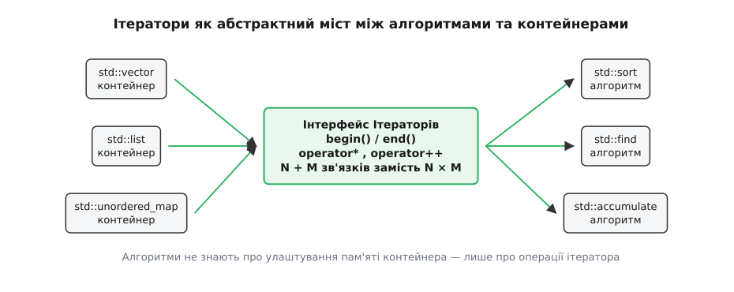
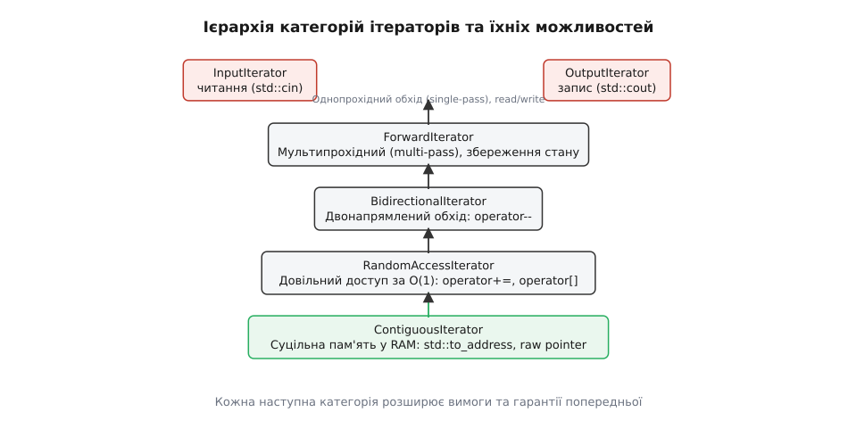
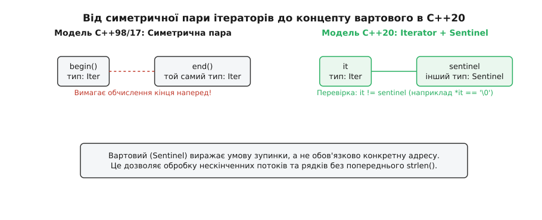

# Ітератори: категорії й модель обходу

<preknowlist>
- [Указівники та арифметика вказівників](root:sf-lang/addresses-pointers) — що таке адреса в пам'яті, розіменування та зсув через `++p` та `p + n`.
- [auto й виведення типу](root:sys-plang-cpp/auto-type-deduction) — механізми `auto` та `decltype` для узагальненого коду.
- [Контейнери STL: вибір під задачу і ціна операцій](root:sys-plang-cpp/stl-containers-choice) — як розміщені у пам'яті `std::vector`, `std::list`, `std::deque` та `std::unordered_map`.
</preknowlist>

Уявімо, що ти розробляєш бібліотеку алгоритмів обробки даних. Тобі потрібно написати функцію швидкого сортування, функцію бінарного пошуку та функцію обчислення суми елементів. Твої користувачі зберігають дані у найрізноманітніших контейнерах: один використовує суцільний динамічний масив `std::vector`, другий — двозв'язаний список `std::list`, третій — неперервний масив фіксованого розміру `std::array`, а четвертий зчитує дані в режимі реального часу зі стандартного потоку введення `std::cin`.

Якщо писати окрему версію сортування чи пошуку для кожного контейнера, обсяг коду миттєво вибухне. Маючи `N` алгоритмів і `M` контейнерів, доведеться створити й підтримувати `N × M` функцій.

Спроба розв'язати цю проблему через об'єктно-орієнтоване успадкування й віртуальні функції (наприклад, створити базовий клас `AbstractContainer` із віртуальним методом `get_element(index)`) виявляється катастрофічною для швидкодії: кожен крок обходу вимагатиме виклику через таблицю віртуальних методів (vtable), що унеможливить інлайнінг (англ. *inlining*) та заблокує векторизацію коду процесором.

Потрібна абстракція, яка поєднує **абсолютну універсальність** (можливість обробляти будь-який контейнер одним алгоритмом) із **нульовими накладними витратами** під час виконання (англ. *zero-cost abstraction*). У мові C++ такою абстракцією став **ітератор** (англ. *iterator*, від латинського *iterare* — повторювати, проходити).


*Ітератори виступають абстрактним містком між алгоритмами та контейнерами. Замість N × M зв'язків алгоритми взаємодіють лише з інтерфейсом ітератора, скорочуючи кількість рішень до N + M.*

Ітератор скорочує складність системи з `N × M` до `N + M`: кожен контейнер надає власний ітератор, а кожен алгоритм приймає ітератори замість самого контейнера.

## Чому алгоритмам потрібен міст: узагальнення вказівника

Найпростішим і найшвидшим ітератором у мові C є звичайний сирий вказівник на оперативну пам'яті (англ. *raw pointer*). Коли ми маємо суцільний масив цілих чисел у пам'яті, обхід реалізується трьома базовими операціями:

```cpp
int data[5] = {10, 20, 30, 40, 50};
int* begin = data;
int* end   = data + 5;

for (int* p = begin; p != end; ++p) {
    int value = *p; // 1. Розіменування (читання/запис)
                    // 2. Інкремент (++p — перехід до наступної комірки)
                    // 3. Порівняння (p != end — перевірка межі)
}
```

Вказівник є ідеальним курсором для суцільного блоку RAM. Але як бути, якщо елементи контейнера `std::list` розкидані по різних куточках оперативної пам'яті у вигляді окремих вузлів зв'язаного списку, де кожен вузол містить вказівник `next`? Або якщо елементи обчислюються прямо під час звернення (наприклад, у генераторі послідовностей чи файловому потоці)?

Ідея творця STL Олександра Степанова полягала у тому, щоб **підняти синтаксис вказівника до рівня мовної абстракції**. Подробиці виникнення цієї ідеї та її еволюційний шлях описані у вставці [📜 Історія еволюції ітераторів у C++](root:sys-plang-cpp/iterators-model/hist-iterator-evolution.md).

Класична модель ітератора C++ — це об'єкт будь-якого типу (клас або сирий вказівник), який перевизначає три базові оператори:
- `operator*()` — надати доступ до значення елемента (розіменування);
- `operator++()` — переміститися до наступного елемента послідовності;
- `operator==()` / `operator!=()` — перевірити, чи не досягнуто межі діапазону.

Алгоритму `std::find` абсолютно байдуже, що саме відбувається всередині `operator++()`. Для `std::vector` це додавання 4 або 8 байт до адреси регістру; для `std::list` — це перехід за вказівником `current = current->next`; для `std::cin_get` — це зчитування байта з системного буфера введення операційної системи. Код алгоритму залишається **єдиним і незмінним**:

```cpp
template<typename InputIt, typename T>
InputIt find(InputIt first, InputIt last, const T& value) {
    while (first != last) {
        if (*first == value) {
            return first;
        }
        ++first;
    }
    return first;
}
```

Цей простий цикл `while (first != last)` є фундаментом усвідомлення ітераторів: алгоритм бачить лише **дві точечні межі** діапазону та курсор між ними.

## Ієрархія категорій ітераторів: від читання потоку до суцільної пам'яті

Не всі структури даних дозволяють виконувати однакові операції над пам'яттю. Наприклад, по мови C-масиву можна легко стрибнути на 100 елементів вперед за один крок через `p + 100`. Але у зв'язаному списку `std::list` зробити це за один крок неможливо: доведеться послідовно пройти 100 вузлів за допомогою вказівників `next`.

У файловому потоці `std::cin` прочитаний байт взагалі неможливо "повернути назад", а операція повернення на один крок назад є недоступною.

Щоб алгоритми могли під час компіляції дізнатися про фізичні можливості контейнера й обрати найшвидший спосіб обходу, C++ класифікує ітератори за **категоріями**.


*Ієрархія категорій ітераторів у C++. Кожна наступна категорія успадковує та розширює вимоги попередньої, надаючи додаткові гарантії щодо зсуву та структури пам'яті.*

Розглянемо шість категорій ітераторів у порядку зростання їхніх можливостей:

### 1. Input Iterator (Ітератор вводу)
Призначений виключно для **однопрохідного читання** (англ. *single-pass reading*).
- **Операції**: `*it` (читання), `++it`, `it++`, `it1 == it2`, `it1 != it2`.
- **Особливість**: Не гарантує збереження стану при копіюванні. Інкремент однієї копії ітератора може зробити невалідними всі інші копії. Прикладом є `std::istream_iterator`, який зчитує дані з консольного або мережевого потоку.
- **Однопрохідна обмеженість**: Якщо ти розіменував `InputIterator`, просунув його вперед `++it` і знову спробував прочитати попередній стан — ти отримаєш невизначену поведінку (UB).

### 2. Output Iterator (Ітератор виводу)
Призначений виключно для **однопрохідного запису** (англ. *single-pass writing*).
- **Операції**: `*it = value` (запис), `++it`, `it++`.
- **Особливість**: Розіменування дозволене лише у лівій частині оператора присвоєння. Прикладами є `std::ostream_iterator` (запис у консоль) та `std::back_inserter` (додавання елементів у кінець вектора через `push_back`).

### 3. Forward Iterator (Однонапрямлений ітератор)
Розширює `InputIterator`, додаючи гарантію **багаторазового проходу** (англ. *multi-pass guarantee*).
- **Операції**: Усі операції `InputIterator` + створення скількох завгодно незалежних копій, що зберігають свій стан.
- **Особливість**: Дозволяє проходити по одній і тій самій послідовності декілька разів. Прикладом є ітератор однозв'язного списку `std::forward_list` або хеш-таблиці `std::unordered_map`.

### 4. Bidirectional Iterator (Двонапрямлений ітератор)
Розширює `ForwardIterator`, додаючи можливість **руху назад**.
- **Операції**: Усі операції `ForwardIterator` + префіксний та постфіксний декременти `--it`, `it--`.
- **Особливість**: Дозволяє обходити контейнер у зворотному напрямку. Прикладами є двозв'язаний список `std::list`, червоно-чорні дерева пошуку `std::set` та `std::map`.

### 5. Random Access Iterator (Ітератор довільного доступу)
Розширює `BidirectionalIterator`, додаючи можливість **арифметичного зсуву за `O(1)`**.
- **Операції**: Усі операції `BidirectionalIterator` + арифметика `it + n`, `it - n`, `it += n`, `it -= n`, віднімання ітераторів `it2 - it1` (повертає `difference_type`), оператор індексування `it[n]` та оператори порівняння порядку `<`, `>`, `<=`, `>=`.
- **Особливість**: Дозволяє обчислити адресу або позицію будь-якого елемента за один математичний крок. Прикладом є `std::deque`.

### 6. Contiguous Iterator (Ітератор суцільної пам'яті, додано в C++20)
Найсуворіша категорія, яка розширює `RandomAccessIterator`, додаючи **гарантію фізичної суцільності елементів у оперативній пам'яті (RAM)**.
- **Гарантія**: Елементи розташовані у пам'яті один за одним без проміжків. Стандарт гарантує, що для будь-якого ітератора цієї категорії виконується рівність: `&*(it + n) == &*it + n`.
- **Практична цінність**: Дозволяє безпечно передавати адресу першого елемента `&*it` або `std::to_address(it)` у низькорівневі C-функції (наприклад, `POSIX read()`, `OpenGL glBufferData()` або SIMD-інструкції). Прикладами є `std::vector`, `std::array`, `std::string`, `std::span` та сирі вказівники `T*`.

## Константність ітераторів: iterator проти const_iterator

Розробники-початківці часто плутають константність самого ітератора з константністю елемента, на який цей ітератор вказує.

У мові C++ існує суворий аналог між ітераторами та арифметикою сирих вказівників:

1. **`std::vector<T>::iterator`** відповідає неконстантному покажчикові `T*`. Можна рухати ітератор (`++it`) і змінювати елемент (`*it = newVal`).
2. **`const std::vector<T>::iterator`** відповідає константному покажчикові `T* const`. Можна змінювати елемент (`*it = newVal`), але **неможливо перемістити** сам ітератор (`++it` видасть помилку компіляції).
3. **`std::vector<T>::const_iterator`** відповідає покажчикові на константу `const T*`. Можна переміщати ітератор (`++it`), але **неможливо змінити** прочитаний елемент (`*it = newVal` заборонено).
4. **`const std::vector<T>::const_iterator`** відповідає константному покажчикові на константу `const T* const`. Заборонено і рух ітератора, і модифікацію елемента.

```cpp
std::vector<int> vec = {10, 20, 30};

// 1. Звичайний ітератор
auto it = vec.begin(); 
*it = 15; // OK
++it;    // OK

// 2. Константний ітератор (const_iterator)
std::vector<int>::const_iterator cit = vec.cbegin(); 
// *cit = 25; // ✗ Помилка компіляції: спроба модифікувати const даних
++cit;        // ✓ OK: ітератор вільно рухається

// 3. Константний об'єкт ітератора
const auto const_it = vec.begin();
*const_it = 99; // ✓ OK: вміст змінювати можна
// ++const_it;  // ✗ Помилка компіляції: сам ітератор є const
```

### Правила неявних перетворень
Стандарт C++ гарантує неявне перетворення (англ. *implicit conversion*) з `iterator` у `const_iterator`, що відповідає неплатному перетворенню вказівника `T*` у `const T*`. Проте зворотне перетворення з `const_iterator` у `iterator` є суворо забороненим за правилами збереження const-коректності. 

У C++11 для явного отримання константних ітераторів з будь-якого контейнера додано методи `cbegin()` та `cend()`, а у C++14 — незв'язані вільні функції `std::cbegin(container)` та `std::cend(container)`.

## Зворотні ітератори (std::reverse_iterator) та математичний зсув

Для обходу контейнера від останнього елемента до першого стандарт надає адаптер `std::reverse_iterator<It>`. Проте його алгебраїчний дизайн містить одну тонку математичну особливість.

У C++ напіввідкритий інтервал `[begin, end)` означає, що ітератор `end()` вказує на фіктивну позицію **за останнім елементом**. Якщо ми просто розвернемо напрямок руху, то `rbegin()` мав би вказувати на елемент за останнім, а `rend()` — на елемент перед першим.

Щоб зберегти валідність адрес у пам'яті та уникнути прочитання неіснуючої комірки перед `begin()`, розробники STL застосували **математичний зсув на один елемент назад під час розіменування**:

```cpp
template<typename BidirectionalIt>
class reverse_iterator {
public:
    using iterator_type = BidirectionalIt;

    explicit reverse_iterator(BidirectionalIt it) : current_(it) {}

    // Метод base() повертає базовий прямоточний ітератор
    BidirectionalIt base() const { return current_; }

    // Зворотний інкремент кличе декремент базового ітератора!
    reverse_iterator& operator++() {
        --current_;
        return *this;
    }

    // Розіменування читає елемент на один крок лівіше від current_!
    reference operator*() const {
        BidirectionalIt temp = current_;
        return *(--temp);
    }
private:
    BidirectionalIt current_;
};
```

Завдяки цьому зсувові виконуються такі тотожності:
- `container.rbegin().base() == container.end()`
- `container.rend().base() == container.begin()`
- Вираз `*rbegin()` розіменовує `*(end - 1)`, тобто дійсний останній елемент контейнера!

Це дозволяє зворотним ітераторам працювати над тим самим блоком пам'яті без виділення додаткових адрес і зберігати повну сумісність із напіввідкритими інтервалами.

## Потокові ітератори та доступ до буферів введення-виведення

Однією з найпрозоріших демонстрацій сили узагальненого програмування у C++ є **потокові ітератори** (англ. *stream iterators*) у заголовковому файлі `<iterator>`. Вони перетворюють стандартні файлові або консольні потоки `std::cin`, `std::cout`, `std::ifstream` на стандартний інтерфейс ітераторів STL.

### 1. `std::istream_iterator<T>` та `std::ostream_iterator<T>`
Дозволяють читати та писати форматовані дані через оператори `>>` та `<<`:

```cpp
#include <iostream>
#include <vector>
#include <algorithm>
#include <iterator>

int main() {
    // Зчитування масиву цілих чисел прямо з консольного вводу до кінця файлу (EOF)
    std::cout << "Введіть числа (Ctrl+D / Ctrl+Z для завершення): ";
    std::istream_iterator<int> cin_it(std::cin);
    std::istream_iterator<int> eos; // Конструктор за замовчуванням створює вартовий кінця потоку

    std::vector<int> numbers(cin_it, eos); // Заповнення вектора з потоку!

    // Друк елементів через ostream_iterator з розділювачем пробілом
    std::cout << "Прочитані числа: ";
    std::copy(numbers.begin(), numbers.end(), std::ostream_iterator<int>(std::cout, " "));
    std::cout << "\n";
}
```

### 2. `std::istreambuf_iterator<char>` та `std::ostreambuf_iterator<char>`
Коли потрібно прочитати файл без форматованого парсингу чисел та пропускання пробілів, `std::istream_iterator` стає надто повільним через перевірки локалі та форматування.

У таких задачах використовують `std::istreambuf_iterator<char>`, який працює безпосередньо з системним буфером `std::streambuf` операційної системи за один прохід:

```cpp
#include <fstream>
#include <string>
#include <iterator>

std::string read_entire_file(const std::string& path) {
    std::ifstream file(path, std::ios::binary);
    // Читання всього файла в пам'ять за один виклик алгоритму
    return std::string(std::istreambuf_iterator<char>(file),
                       std::istreambuf_iterator<char>());
}
```

Цей підхід є у десятки разів швидшим за обхід у циклі `file.get()` або `file >> val`, оскільки усуває створення тимчасових об'єктів та виклики функцій форматування.

## Ітератори вставлення (Insert Iterators) та динамічне розширення

Звичайне розіменування та присвоєння `*it = val` вимагає, щоб елемент за адресою `it` вже фізично існував у пам'яті. Якщо передати порожній вектор `std::vector<int> v;` у функцію `std::copy(src.begin(), src.end(), v.begin())`, програма негайно зазнає невизначеної поведінки (UB) або збою через запис за межі порожнього буфера.

Для розв'язання цієї проблеми C++ надає **ітератори вставлення** (англ. *insert iterators*):

1. **`std::back_insert_iterator<Container>`** (функція-генератор `std::back_inserter(c)`):
   Оператор присвоєння `*it = val` не записує за адресою, а викликає метод `c.push_back(val)`. Контейнер автоматично виділяє пам'ять та розширює свій розмір.
2. **`std::front_insert_iterator<Container>`** (функція-генератор `std::front_inserter(c)`):
   Оператор присвоєння викликає `c.push_front(val)`. Використовується для `std::deque` та `std::list`.
3. **`std::insert_iterator<Container>`** (функція-генератор `std::inserter(c, pos)`):
   Оператор присвоєння викликає `c.insert(pos, val)`. Використовується для асоціативних контейнерів `std::set`, `std::map` та довільних точок вставки.

```cpp
std::vector<int> src = {1, 2, 3, 4, 5};
std::vector<int> dest; // Порожній вектор без попереднього resize()

// back_inserter автоматично перетворює кожне присвоєння на push_back()
std::copy(src.begin(), src.end(), std::back_inserter(dest));
```

## Кастомізаційні об'єкти доступу: std::ranges::begin та ADL-захист

У C++11 для написання узагальненого коду пропонувалося використовувати незв'язані вільні функції `std::begin(x)` та `std::end(x)`. Проте для роботи з користувацькими типами у власному просторі імен розробники мали писати спеціальний ідіоматичний шаблон з ідіомою ADL (Argument Dependent Lookup):

```cpp
// Ідіома C++11/14 для виклику begin з підтримкою ADL
using std::begin;
auto it = begin(my_custom_container); // Шукає my_namespace::begin, а потім std::begin
```

Якщо програміст забував написати `using std::begin;` і кликав `std::begin(my_container)` напряму, ADL-пошук для користувацьких типів блокувався, і програма не компілювалася.

У C++20 цю проблему розв'язали через **Customization Point Objects (CPO)** у просторі імен `std::ranges`:
- `std::ranges::begin(x)`
- `std::ranges::end(x)`
- `std::ranges::cbegin(x)`
- `std::ranges::cend(x)`
- `std::ranges::rbegin(x)`
- `std::ranges::rend(x)`

Об'єкт `std::ranges::begin` є статичним функтором (англ. *function object*). Під час виклику `std::ranges::begin(x)` він автоматично виконує перевірки у суворо визначеному порядку:
1. Якщо `x` є сирим масивом `T[N]`, повертає сирий вказівник `x`.
2. Якщо тип `x` має метод-член `x.begin()`, викликає його.
3. Інакше шукає вільну функцію `begin(x)` у просторі імен типу `x` через ADL.
4. Запобігає виклику для тимчасових rvalue-об'єктів, які не є `borrowed_range`.

Завдяки цьому використання `std::ranges::begin` є суворо рекомендованим стандартом у всіх сучасних C++20 проєктах. Воно запобігає виникненню непередбачуваних помилок при зміні типів контейнерів у майбутньому.

Це гарантує безпечний виклики без потреби писати `using std::begin;` та захищає від помилок роботи із завислими тимчасовими об'єктами.

## Низькорівневий витяг адрес: std::to_address у C++20

Коли ми працюємо з категорією `ContiguousIterator` (наприклад, `std::vector<T>::iterator` або `std::span<T>::iterator`), нам нерідко потрібно передати адресу першого елемента у системні C-бібліотеки (POSIX, WinAPI, CUDA, Vulkan).

У C++98 розробники писали вираз `&*it`. Проте цей вираз є небезпечним: якщо ітератор `it` вказує на кінець порожнього вектора `vec.end()`, виклик `*it` створює розіменування невалідного вказівника — невизначену поведінку (UB), навіть якщо після цього одразу береться адреса `&`.

У C++20 для розв'язання цієї проблеми введено функцію **`std::to_address(it)`**:

```cpp
#include <memory>
#include <vector>

void process_c_api(const int* data, size_t count);

void example(const std::vector<int>& vec) {
    if (vec.empty()) return;

    // Безпечний витяг адреси пам'яті без розіменування!
    const int* ptr = std::to_address(vec.begin());
    process_c_api(ptr, vec.size());
}
```

Функція `std::to_address` під час компіляції розгортає сурогатний ітератор у сирий вказівник `T*` без виклику `operator*()`, забезпечуючи абсолютну безпеку роботи з C-API.

## Генератори нескінченних послідовностей та views::iota

Не всі ітератори вказують на реальні блоки в оперативно пам'яті. У C++20 з'явився клас ітераторів-генераторів, які створюють значення обчислювально прямо під час розіменування.

Яскравим прикладом є вид `std::views::iota(start, end)`:

```cpp
#include <iostream>
#include <ranges>

int main() {
    // Генерація числа від 1 до нескінченності без створення вектора
    auto infinite_range = std::views::iota(1);

    // Взяти перші 5 елементів і надрукувати
    for (int val : infinite_range | std::views::take(5)) {
        std::cout << val << " "; // 1 2 3 4 5
    }
}
```

Ітератор `iota_view::iterator` зберігає лише одне ціле число `current_`. Оператор `++it` робить `current_++`, а розіменування `*it` повертає поточне значення за копією. Витрати пам'яті складають рівно `sizeof(int)` (4 байти) для послідовності будь-якого довжини!

## Механізм Tag Dispatching та std::iterator_traits

Як саме шаблонний алгоритм (наприклад, `std::advance(it, n)`, який зсуває ітератор на `n` позицій) дізнається під час компіляції, до якої саме категорії належить переданий ітератор?

У мові C++98 для цього було винайдено механізм **Tag Dispatching** (диспетчеризація за тегами) та спеціальний меташаблон `std::iterator_traits`.

### Анатомія порожніх тегів
У заголовковому файлі `<iterator>` визначено порожні структури-теги, впорядковані у закриту ієрархію успадкування:

```cpp
namespace std {
    struct input_iterator_tag {};
    struct output_iterator_tag {};
    struct forward_iterator_tag : public input_iterator_tag {};
    struct bidirectional_iterator_tag : public forward_iterator_tag {};
    struct random_access_iterator_tag : public bidirectional_iterator_tag {};
    struct contiguous_iterator_tag : public random_access_iterator_tag {}; // C++20
}
```

Кожен клас-ітератор у своєму публічному інтерфейсі оголошує синонім типу `iterator_category`, який вказує на один із цих тегів.

### Роль std::iterator_traits для сирих вказівників
Але як бути зі звичайними вказівниками мови C (наприклад, `int*`), які не є класами і не можуть мати всередині оголошень `using iterator_category`?

Для розв'язання цієї проблеми розробники використовують шаблон `std::iterator_traits<It>`. Узагальнений шаблон витягує синонім типу з самого класу `It::iterator_category`:

```cpp
template<typename It>
struct iterator_traits {
    using iterator_category = typename It::iterator_category;
    using value_type        = typename It::value_type;
    using difference_type   = typename It::difference_type;
    using pointer           = typename It::pointer;
    using reference         = typename It::reference;
};
```

А для сирих вказівників у стандартній бібліотеці написано **часткову спеціалізацію**:

```cpp
template<typename T>
struct iterator_traits<T*> {
    using iterator_category = std::random_access_iterator_tag; // у C++20: std::contiguous_iterator_tag;
    using value_type        = T;
    using difference_type   = std::ptrdiff_t;
    using pointer           = T*;
    using reference         = T&;
};
```

Завдяки цьому меташаблону вираз `typename std::iterator_traits<It>::iterator_category` повертає коректний тег категорії **і для об'єктів-ітераторів, і для сирих вказівників C**. Повний технічний контракт усіх асоційованих типів детально розібрано у вставці [📋 Інтерфейс трейтів, концептів та категорій ітераторів](root:sys-plang-cpp/iterators-model/api-iterator-traits.md).

### Вибір реалізації під час компіляції
Тепер функція `std::advance` обирає найшвидшу реалізацію шляхом перевантаження приватних функцій під час компіляції:

```cpp
namespace detail {
    // Реалізація для ітераторів довільного доступу: O(1)
    template<typename RandomIt, typename Distance>
    void advance_impl(RandomIt& it, Distance n, std::random_access_iterator_tag) {
        it += n; // Одна інструкція зсуву адреси!
    }

    // Реалізація для звичайних ітераторів: O(n)
    template<typename InputIt, typename Distance>
    void advance_impl(InputIt& it, Distance n, std::input_iterator_tag) {
        while (n > 0) {
            ++it;
            --n;
        }
    }
}

template<typename It, typename Distance>
void advance(It& it, Distance n) {
    using category = typename std::iterator_traits<It>::iterator_category;
    detail::advance_impl(it, n, category{}); // Компілятор обирає потрібне перевантаження за тегом
}
```

У C++17 ця шаблонна магія з перевантаженням функцій була спрощена завдяки виразу `if constexpr`:

```cpp
template<typename It, typename Distance>
void advance(It& it, Distance n) {
    using category = typename std::iterator_traits<It>::iterator_category;

    if constexpr (std::is_base_of_v<std::random_access_iterator_tag, category>) {
        it += n; // Оптимізована гілка за O(1)
    } else {
        while (n > 0) { ++it; --n; } // Покроковий прохід за O(n)
    }
}
```

В обидвох випадках невідповідна гілка коду повністю відтинається компілятором і не потрапляє до фінального машинного коду.

## Революція C++20: Асиметричні вартівники (Sentinels) та Концепти

Попри успіх моделі C++98, вона мала один фундаментальний системний недолік: **примусову симетрію типів**.

У C++98/17 будь-який алгоритм вимагав двох ітераторів **однакового типу** `Iter` для позначення початку та кінця діапазону: `[begin, end)`.

Розглянемо класичний приклад зчитування нуль-термінованого C-рядка:

```cpp
const char* text = "Hello World";
```

Щоб передати цей рядок у стандартний алгоритм `std::for_each(begin, end, fn)`, розробникові доводилося спочатку обчислити адресу кінця за допомогою функції `std::strlen(text)`. Для цього процесор мусив виконати **перший повний прохід** по всьому рядку від початку до символу `\0`. І лише після цього алгоритм `std::for_each` виконував **другий прохід** по тих самих байтах для виклику функції.


*Порівняння моделей: у C++98/17 тип кінця діапазону end має збігатися з begin, що вимагає обчислення адреси наперед. У C++20 end може бути об'єктом-вартовим (Sentinel) іншого типу, який перевіряє умову зупинки під час обходу.*

Стандарт C++20 вирішив цю проблему, розірвавши симетрію типів. Діапазон у C++20 описується парою **`[Iterator, Sentinel)`**, де тип вартового `Sentinel` не зобов'язаний збігатися з типом `Iterator`!

Вартовий (англ. *sentinel*) — це об'єкт будь-якого типу, для якого визначено оператор порівняння рівності з ітератором `it == sentinel`.

### Реалізація вартового кінця рядка без strlen()
Завдяки асиметричній моделі ми можемо створити порожній вартовий `NullTerminatedSentinel`, який перевіряє досягнення символу `\0` прямо під час порівняння у циклі:

```cpp
struct NullTerminatedSentinel {
    friend bool operator==(const char* it, NullTerminatedSentinel) {
        return *it == '\0'; // Умова зупинки — досягнення нульового байта
    }
};

const char* text = "Hello World";
// Замість strlen() передаємо асиметричну пару [const char*, NullTerminatedSentinel]
for (auto it = text; it != NullTerminatedSentinel{}; ++it) {
    std::cout << *it; // Однопрохідна обробка без попереднього сканування!
}
```

Процесор виконує роботу за **один єдиний прохід** по пам'яті. Жодного попереднього обчислення довжини рядка не відбувається.

### Концепти ітераторів у C++20
Окрім вартових, C++20 замінив неявні вимоги документації на строгі **мовні концепти** у заголовковому файлі `<iterator>`:
- `std::input_iterator<I>`
- `std::forward_iterator<I>`
- `std::bidirectional_iterator<I>`
- `std::random_access_iterator<I>`
- `std::contiguous_iterator<I>`
- `std::sentinel_for<S, I>`

Якщо раніше передача `std::list::iterator` у функцію `std::sort` видавала 100 рядків незрозумілих шаблонних помилок всередині глибоких приватних методів STL, то у C++20 компілятор миттєво сигналізує на етапі підпису функції:

```
error: constraints not satisfied for class template 'sort'
note: because 'std::_List_iterator<int>' does not satisfy 'random_access_iterator'
```

Покрокову практичну реалізацію власного розрідженого ітератора кроку та адаптерів діапазонів на основі концептів C++20 показано у вставці [⚙️ Практика: реалізація власного ітератора та адаптера діапазонів](root:sys-plang-cpp/iterators-model/proj-custom-range-iterator.md).

## Архітектура ледачих видів і конвеєри C++20 Ranges

Введення асиметричних вартових та концептів у C++20 дозволило побудувати революційну підсистему **C++20 Ranges View Adaptors**.

Вид (англ. *view*) — це легковаговий адаптер діапазону, створення та копіювання якого виконується за `O(1)` незалежно від кількості елементів у контейнері. Види **не володіють** елементами пам'яті, а лишь зберігають ітератори або вказівники на вихідний контейнер.

```cpp
#include <iostream>
#include <vector>
#include <ranges>

int main() {
    std::vector<int> numbers = {1, 2, 3, 4, 5, 6, 7, 8, 9, 10};

    // Створення конвеєра обробки даних через оператор pipe |
    auto results = numbers 
                 | std::views::filter([](int n) { return n % 2 == 0; })
                 | std::views::transform([](int n) { return n * n; })
                 | std::views::take(3);

    // Ітерація виконується ледачо (lazy evaluation)!
    for (int val : results) {
        std::cout << val << " "; // Надрукує: 4 16 36
    }
}
```

### Як ітератори рухають ледачі конвеєри (Lazy Evaluation)
У наведеному вище прикладі жодного проміжного вектора або виділення динамічної пам'яті не створюється. 

Вирази `filter`, `transform` та `take` повертають спеціальний об'єкт `std::ranges::transform_view(std::ranges::filter_view(...))`. Коли цикл `for` запитує `begin()` підсумкового виду, створюється складний обгортковий ітератор.

Під час виконання інкременту `++it` внутрішній ітератор виконує такі кроки:
1. `filter_iterator` просуває базовий ітератор вектора вперед, поки не знайде елемент, для якого предикат `n % 2 == 0` повертає `true`.
2. При розіменуванні `*it` викликом `transform_iterator` застосовується лямбда-функція `n * n` прямо у момент запиту.
3. `take_iterator` відстежує лічильник виданих елементів і порівнює його з вартовим при досягненні 3.

В результаті виходить **нульова ціна абстракції**: такий конвеєр компілюється в один оптимізований машинний цикл, аналогічний ручному коду з операторами `if`.

## Інвалідація ітераторів та проксі-пастки

Ітератор за своєю внутрішньою суттю є обгорткою над адресами пам'яті або вказівниками на вузли структури даних. Якщо сама структура даних змінює своє розташування у оперативній пам'яті (наприклад, `std::vector` виділяє новий більший блок пам'яті при перевищенні `capacity`), старі ітератори перетворюються на **завислі вказівники** (англ. *dangling pointers*).

Цей процес називається **інвалідацією ітераторів** (англ. *iterator invalidation*). Використання інвалідованого ітератора є витоком невизначеної поведінки (UB), який призводить до пошкодження пам'яті або збоїв програми (segmentation fault).

### Детальні правила інвалідації для основних контейнерів

1. **`std::vector` / `std::string`**:
   - Будь-яка операція вставки (`push_back`, `insert`, `emplace_back`), яка спричиняє реалокацію (новий `size > capacity`), **інвалідує всі ітератори**, посилання та вказівники на елементи контейнера.
   - Якщо реалокації не відбулося (пам'яті вистачає), інвалідуються всі ітератори від місця вставки до кінця вектора. Ітератори до точки вставки залишаються повністю валідними.
   - Видалення елементів (`erase`, `pop_back`) інвалідує всі ітератори від першого видаленого елемента до кінця вектора.

2. **`std::deque`**:
   - Вставка або видалення елементів всередині двосторонньої черги інвалідує **всі ітератори** та посилання.
   - Вставка елементів у початок (`push_front`) або кінець (`push_back`) інвалідує всі ітератори `deque`, але дивовижним чином **залишає дійсними посилання та вказівники** на самі елементи! Це пояснюється ступенчастою укладкою блоків пам'яті у `std::deque`.

3. **`std::list` / `std::forward_list` / `std::set` / `std::map`**:
   - Вставка елементів у вузлові контейнери **ніколи не інвалідує** існуючі ітератори інших вузлів.
   - Видалення елемента інвалідує **лише той ітератор**, який вказував на видалений вузол. Ітератори решти вузлів залишаються повністю валідними.

4. **`std::unordered_map` / `std::unordered_set`**:
   - Вставка елементів не інвалідує ітератори доти, доки не відбувається автоматична повторна хешизація (англ. *rehash*, коли `load_factor() > max_load_factor()`).
   - При виклику `rehash()` усі ітератори інвалідуються, проте посилання на елементи `T&` залишаються валідними, оскільки самі вузли списків не змінюють своїх адрес у купі.

Саме тому при видаленні елементів у циклі на C++98 доводилося використовувати спеціальний синтаксис постакрокового інкременту або приймати повернутий ітератор:

```cpp
std::list<int> numbers = {1, 2, 3, 4, 5, 6};
for (auto it = numbers.begin(); it != numbers.end(); /* інкремент у тілі */) {
    if (*it % 2 == 0) {
        it = numbers.erase(it); // erase повертає ітератор на наступний елемент
    } else {
        ++it;
    }
}
```

У C++20 цей ручний цикл замінено безпечною стандартизованою функцією `std::erase_if(numbers, [](int n) { return n % 2 == 0; });`.

### Проксі-пастка: std::vector<bool>
Найвідомішою крайовою пасткою в історії стандарту C++ є спеціалізація `std::vector<bool>`.

У прагненні заощадити оперативну пам'ять творці стандарту C++98 вирішили упакувати значення `bool` у вигляді окремих бітів (8 біт у одному байті). Проте в архітектурі сучасних процесорів найменшою адресованої одиницею пам'яті є **один байт**. Отримати пряму адресу окремого біта (`bool&`) у C++ неможливо за законами фізики апаратури.

Тому розіменування `*it` для `std::vector<bool>::iterator` повертає не справжнє посилання `bool&`, а тимчасовий об'єкт-проксі `std::vector<bool>::reference`:

```cpp
std::vector<bool> vec = {true, false, true};
auto it = vec.begin();

// ✗ Помилка компіляції: розіменування повернуло тимчасовий проксі-об'єкт, а не bool&
bool& ref = *it; 

// ✓ Працює, але створює копію значення
bool val = *it; 
```

Через використання проксі-об'єкта `std::vector<bool>` ламає суворий контракт `ContiguousIterator` і `RandomAccessIterator`, оскільки його оператор розіменування не повертає справжнього lvalue-посилання `T&`. Це слугує наочним нагадуванням: **ітератор є абстракцією, і його техніка розіменування вимагає уваги до типів повернення**.

## Ціна абстракції та оптимізація компілятора

Чи платить програміст за використання ітераторів втратою швидкодії у порівнянні з низькорівневими C-циклами по масивах?

Відповідь стандарту C++: **ні, накладні витрати дорівнюють нулю (Zero-Overhead Principle)**.

Розглянемо, у що компілятори GCC та Clang з увімкненим прапорцем оптимізації `-O3` транслюють обхід контейнера `std::vector<int>` за допомогою ітераторів:

```cpp
int sum_vector(const std::vector<int>& vec) {
    int total = 0;
    for (auto it = vec.begin(); it != vec.end(); ++it) {
        total += *it;
    }
    return total;
}
```

Асемблерний код, згенерований компілятором для x86_64:

```assembly
sum_vector(std::vector<int> const&):
    mov     rax, QWORD PTR [rdi]        ; rax = адреса початку масиву (begin)
    mov     rdx, QWORD PTR [rdi+8]      ; rdx = адреса кінця масиву (end)
    xor     eax, eax                    ; total = 0
    cmp     rax, rdx
    je      .L1
.L3:
    add     eax, DWORD PTR [rax]        ; total += *p
    add     rax, 4                      ; p += sizeof(int)
    cmp     rax, rdx                    ; p != end
    jne     .L3
.L1:
    ret
```

Компілятор повністю інлайнить виклики `vec.begin()`, `vec.end()`, `operator*` та `operator++`. Клас-ітератор повністю розчиняється під час компіляції, перетворюючись на звичайну вказівникову арифметику на регістрах `rax` та `rdx`.

Більше того, для категорій `ContiguousIterator` сучасні компілятори здійснюють **автовекторизацію** (англ. *auto-vectorization*), замінюючи скалярне додавання `add` на векторизовані інструкції SIMD (`vpaddd` у регістри AVX2 / AVX-512), обробляючи по 8 або 16 елементів масиву за один такт процесора.

### Проблема кеш-стіни (Cache Latency Wall)
Незважаючи на алгебраїчну еквівалентність викликів `++it`, фізична швидкість виконання циклів над різними контейнерами різниться у десятки разів через апаратну укладку пам'яті.

При обході `std::vector` через `ContiguousIterator` елементи завантажуються в кеш процесора L1/L2 цілими кеш-лініями (по 64 байти). Апаратний префетчер процесора передбачає наступні адреси і прозоро підтягує їх з RAM.

При обході `std::list` через `BidirectionalIterator` кожен вузол знаходиться у довільному місці динамічної пам'яті (купа, heap). Розіменування `current = current->next` викликає промах кешу (англ. *cache miss*), змушуючи процесор простоювати сотні тактів в очікуванні відповіді від оперативної пам'яті.

Саме тому абстракція ітераторів дозволяє написати узагальнений код, але розуміння категорій та укладки пам'яті підказує розробникові, чому для високопродуктивних обчислень слід обирати контейнери з `ContiguousIterator`.

> 🔧 **Навіщо це у реальній розробці.**
> 1. **Пиши алгоритми під найменш вимогливу категорію**: Якщо твоєму алгоритмові достатньо послідовного проходу, вимагай концепт `std::forward_iterator` замість `std::random_access_iterator`. Це дозволить використовувати твій алгоритм не лише з `std::vector`, а й із `std::list` та `std::forward_list`.
> 2. **Віддавай перевагу префіксному інкременту `++it`**: Постфіксний інкремент `it++` змушений створювати тимчасову копію попереднього стану ітератора. Для складних ітераторів дерев чи хеш-таблиць це створює зайве копіювання у пам'яті. Префіксний `++it` змінює ітератор на місці без тимчасових об'єктів.
> 3. **Враховуй інвалідацію в циклах**: Ніколи не зберігай ітератор `vec.end()` у змінну перед циклом, якщо всередині циклу відбувається модифікація або додавання елементів у `vec`. Використовуй алгоритми `std::erase_if` (C++20) замість ручного видалення елементів у циклах.
> 4. **Використовуй Sentinels у C++20 для обробки потоків**: При роботі з нуль-термінованими рядками або мережевими пакетами невідомої довжини створюй вартівники замість розрахунку розміру контейнера наперед.
