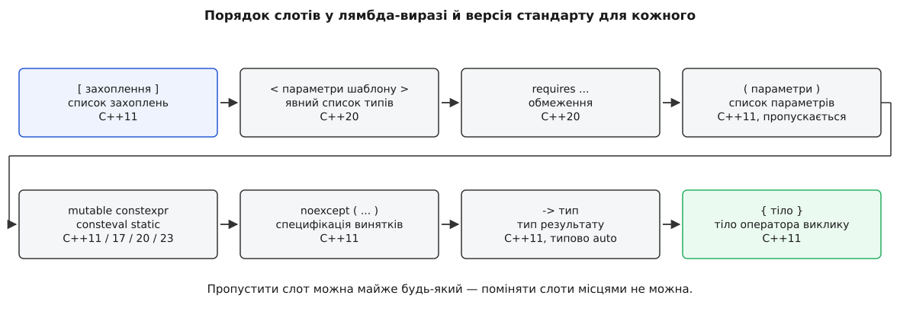

# 📋 Список захоплень: усі форми, поле за кожною, версія стандарту

Цей довідник відповідає на одне питання: **що саме опиниться в об'єкті-замиканні після кожного запису у квадратних дужках** — яке поле, якого типу, з копією чого всередині, з якого стандарту форма доступна й на чому на ній спотикаються. Далі — дзеркальний бік: що в дужки вписати не можна, що туди й не треба вписувати, і які ще слова стоять у граматиці лямбда-виразу поруч із дужками. Формулювання звірені з чинним робочим проєктом стандарту ([expr.prim.lambda]) і з паперами комітету, номери яких названі поіменно.

## Порядок слотів

Список захоплень — перший слот лямбда-виразу, і решта слотів стоїть за ним у жорстко визначеному порядку. Пропустити можна майже будь-який, поміняти місцями — жоден.



*Кожен слот з'явився у свою версію стандарту, але місце в записі має одне.*

| Слот | Запис | Обов'язковий | З якого стандарту |
|---|---|---|---|
| захоплення | `[…]` | так (хоч би порожні дужки) | C++11 |
| параметри шаблону | `<class T>` | ні | C++20 ([P0428R2](https://wg21.link/p0428r2)) |
| обмеження | `requires …` | ні | C++20 |
| атрибути | `[[…]]` | ні | C++11 (перед декларатором), позиція після параметрів — теж дозволена |
| параметри | `(int x)` | ні, якщо параметрів немає | C++11 |
| специфікатори | `mutable`, `constexpr`, `consteval`, `static` | ні | C++11 / C++17 / C++20 / C++23 |
| специфікація винятків | `noexcept(…)` | ні | C++11 |
| тип результату | `-> R` | ні, типово `-> auto` | C++11 |
| завершальне обмеження | `requires …` | ні | C++20 |
| тіло | `{ … }` | так | C++11 |

Одна деталь запису, яка донедавна ламала збірку: **порожні `()` перед `mutable`, `noexcept`, атрибутами чи `-> R` були обов'язкові до C++23**. Папір [P1102R2](https://wg21.link/p1102r2) («Down with ()!») цю вимогу зняв, тож `[]mutable{ … }` — коректний C++23 і помилка синтаксису в C++20.

## Усі форми захоплення

Стовпець «поле» відповідає на питання, що з'явиться в типі замикання; стовпець «копіюється» — що саме потрапить у це поле в момент обчислення лямбда-виразу.

| Форма | Поле в замиканні | Що копіюється | Стандарт | Типова помилка |
|---|---|---|---|---|
| `[]` | немає | нічого | C++11 | очікують, що тіло побачить локальну змінну поруч — це помилка компіляції, а не неявне захоплення |
| `[=]` | поле-копія на кожну **odr-використану** локальну сутність | значення кожної такої сутності | C++11 | усередині методу класу копіює **вказівник** `this`, а не поля об'єкта; читається як «усе скопійовано» |
| `[&]` | не визначено стандартом (на практиці — адреса) | нічого; `this`, якщо тіло його потребує, — як вказівник | C++11 | замикання зберігають далі — і посилання переживає свою змінну |
| `[x]` | поле типу `x` | значення `x` | C++11 | чекають, що зміна `x` після створення замикання буде видна у виклику |
| `[&x]` | не визначено (на практиці — адреса `x`) | нічого | C++11 | `x` мусить бути живим на кожен виклик, а не лише на момент створення |
| `[this]` | на практиці — поле-вказівник на клас (стандарт вважає це захопленням `*this` за посиланням) | **вказівник**, не об'єкт | C++11 | замикання переживає об'єкт — і `this` веде в нікуди |
| `[*this]` | поле типу класу | увесь об'єкт | C++17 ([P0018R3](https://wg21.link/p0018r3)) | копія цілого об'єкта там, де потрібне було одне число; зміни в копії ззовні не видно |
| `[=, this]` | те саме, що `[=]`, лише явно | вказівник `this` + копії решти | C++20 ([P0409R2](https://wg21.link/p0409r2)) | збірка старішим стандартом: у C++11–C++17 форма некоректна |
| `[&, this]` | те саме, що `[&]` | вказівник `this`, об'єкт — ні | усі версії, надлишкова | читають як «`this` копією» — насправді запис нічого не додає до `[&]` |
| `[=, *this]` | копія об'єкта + копії решти | увесь об'єкт | C++17 | ціна копії об'єкта в кожному створеному замиканні |
| `[&, *this]` | копія об'єкта, решта посиланнями | увесь об'єкт | C++17 | суміш власного й чужого часу життя в одному замиканні |
| `[=, &x]` | усе копіями, `x` — посиланням | усе, крім `x` | C++11 | читають `&x` як «додатково», а це **виняток** із типового захоплення |
| `[&, x]` | усе посиланнями, `x` — копією | тільки `x` | C++11 | те саме навпаки |
| `[xs...]`, `[&xs...]` | по полю на кожен елемент пакета | кожен елемент (або нічого) | C++11 | розкриття пакета в списку захоплень не те саме, що в списку аргументів: три крапки стоять після імені |
| `[x = вираз]` | нове поле `x`, «як `auto x = вираз;`» | результат виразу | C++14 ([N3648](https://wg21.link/n3648)) | `auto`-виведення відкидає посилання й розпадає масиви: `[s = "abc"]` дає `const char*` |
| `[&r = вираз]` | нове поле-посилання, «як `auto& r = вираз;`» | нічого | C++14 | до тимчасового об'єкта таке посилання просто не прив'яжеться, а до чужого — прив'яжеться й переживе його |
| `[...xs = std::forward<Xs>(xs)]` | по новому полю на елемент пакета | результат кожного виразу | C++20 ([P0780R2](https://wg21.link/p0780r2)) | без `mutable` поля константні — і `f(std::move(xs)...)` тихо скопіює замість перемістити |

### Тип поля при захопленні за значенням

Найменш очевидний рядок стандарту стосується випадку, коли захоплюють змінну, яка сама є посиланням:

> Для кожної сутності, захопленої копією, у типі замикання оголошується неіменоване нестатичне поле-член. Тип такого поля — **тип, на який посилається сутність**, якщо сутність є посиланням на об'єкт; lvalue-посилання на тип функції, якщо сутність є посиланням на функцію; інакше — тип самої сутності.

Практичний зміст — у трьох рядках:

| Оголошення змінної | `[x]` дає поле типу | Наслідок |
|---|---|---|
| `T x;` | `T` | звичайна копія |
| `T& x;` або `const T& x;` | `T` | копіюється **об'єкт**, а не спосіб доступу до нього |
| `T&& x;` (сама змінна — rvalue-посилання) | `T` | те саме: повноцінна копія об'єкта |
| `void (&f)(int);` | `void (&)(int)` | посилання на функцію лишається посиланням |

Тобто параметр `const Config& cfg` під `[cfg]` перетворюється на повноцінну копію `Config` — від висячої адреси це рятує, але коштує рівно стільки, скільки коштує конструктор копіювання. Про те, чому змінна-посилання поводиться тут як псевдонім об'єкта, а не як окрема сутність, — у [правилах зв'язування посилань](topic:sys-plang-cpp/references-binding): посилання не є об'єктом, воно лише інше ім'я чужого об'єкта, тому «скопіювати посилання» означає «скопіювати те, що воно називає».

Порядок полів у типі замикання стандарт не визначає взагалі, тож на розкладку й на `sizeof` покладатися не можна — на семантику копіювання можна цілком.

## Що можна сполучати з типовим захопленням

| Типове захоплення | Дозволені прості захоплення поруч | Заборонено |
|---|---|---|
| `=` | `&ім'я`, `this` (з C++20), `*this` (з C++17) | `[=, x]` — ім'я без `&`; `[=, =]` |
| `&` | будь-яке ім'я **без** `&`, `this`, `*this` (з C++17) | `[&, &x]` — ім'я з `&`; `[&, &]` |
| немає | будь-яке | — |

Правило стандарту для `=` звучить так: кожне просте захоплення при типовому `=` має бути форми `& ідентифікатор`, `this` або `*this`. Останні дві форми додано в C++20 і C++17 відповідно — саме тому `[=, this]` некоректне в C++17, хоча `[=, *this]` там уже працює.

Правило для `&` коротше: жодний ідентифікатор у простому захопленні не має бути перед ним позначений `&`. Про `[&, this]` стандарт додає окрему примітку — форма надлишкова, але залишена «для сумісності з ISO C++ 2014».

Незалежно від типового захоплення діє ще одне обмеження: **ідентифікатор або `this` не має з'являтися у списку захоплень більш ніж один раз**. Тому `[x, x]`, `[this, this]` і `[this, *this]` — помилки компіляції (`this` і `*this` позначають ту саму сутність). Виняток тут один: поява імені всередині *ініціалізатора* захоплення не рахується, тож `[x = x]` цілком законне.

## Захоплення з ініціалізатором

Форма з C++14 не «захоплює» нічого — вона **оголошує нове поле** й задає йому ініціалізатор. Стандарт формулює це так: захоплення з ініціалізатором поводиться так, наче оголошує й явно захоплює змінну, записану як `auto` плюс те, що стоїть у дужках.

| Запис у дужках | Еквівалентне оголошення | Що це означає |
|---|---|---|
| `[x = вираз]` | `auto x = вираз;` | поле-значення, тип виведено правилами `auto` |
| `[&r = вираз]` | `auto& r = вираз;` | поле-посилання на результат виразу |
| `[p = std::move(p)]` | `auto p = std::move(p);` | поле сконструйовано переміщенням — замикання стає власником |
| `[n = obj.size()]` | `auto n = obj.size();` | у замиканні одне число замість цілого об'єкта |
| `[...xs = std::forward<Xs>(xs)]` | `auto ...xs = std::forward<Xs>(xs);` | по полю на елемент пакета; C++20, до нього — обхід через `std::tuple` |

Два наслідки, які регулярно дивують.

**Тип виводиться правилами `auto`, а не копіюється з виразу.** [Виведення типу через `auto`](topic:sys-plang-cpp/auto-type-deduction) відкидає посилання й `const` верхнього рівня, а масиви й функції розпадаються на вказівники. Тому `[s = "текст"]` дає поле `const char*`, а не масив; `[v = someVector]` дає `std::vector`, а не `const std::vector&`.

**Ім'я ліворуч і ім'я праворуч належать різним областям.** Ліве — це нове поле замикання, праве шукається у зовнішній області за звичайними правилами. Через це `[x = x]` не є рекурсією й не є помилкою.

Форма `[&r = вираз]` розгортається саме в `auto& r = вираз;`, а інших форм граматика не знає — ані `const auto&`, ані `auto&&`. Звідси два наслідки: до тимчасового об'єкта таке поле не прив'яжеться взагалі (`[&r = makeThing()]` не збереться, бо неконстантне lvalue-посилання не приймає prvalue), а `const` у типі поля з'явиться лише тоді, коли константний сам вираз-ініціалізатор. Продовження часу життя тимчасового тут не рятує нікого: поле живе стільки, скільки живе замикання, а тимчасовий об'єкт — до кінця свого повного виразу.

Розкриття пакета в захопленні з ініціалізатором (`[...xs = std::forward<Xs>(xs)]`) тримається на двох механізмах: на [пакетах параметрів шаблону](topic:sys-plang-cpp/variadic-and-folds), які дають перелік «нуль або більше аргументів» і розкриваються трьома крапками, та на [ідеальному передаванні](topic:sys-plang-cpp/perfect-forwarding) — `std::forward<Xs>(xs)` зберігає для кожного аргумента його категорію значення, тож те, що прийшло тимчасовим, переміститься, а те, що прийшло lvalue, скопіюється.

## Що захопити не можна

| Що | Чому | Що робити натомість |
|---|---|---|
| глобальна змінна, змінна простору імен | не є локальною сутністю; тіло бачить її за іменем безпосередньо | нічого; якщо потрібен **знімок** значення — `[g = g]` |
| `static` усередині функції | має статичну тривалість зберігання, отже не локальна сутність | те саме |
| `thread_local` | та сама причина | `[v = tlsVar]`, якщо потрібне значення саме нитки-створювача |
| нестатичний член класу (`buf_`) | у тілі це `this->buf_`, а не ім'я змінної в області | `[this]`, `[*this]` або `[n = buf_.size()]` |
| структурована прив'язка `auto [a, b] = …` | до C++20 не була локальною сутністю | у C++20 захоплюється як звичайна змінна ([P1091R3](https://wg21.link/p1091r3), [P1381R1](https://wg21.link/p1381r1)); до C++20 — обхід `[a = a]` |
| `this` у вільній функції чи статичному методі | немає об'єкта, на який указувати | передати параметром |
| будь-яка локальна сутність у лямбді всередині **аргументу за замовчуванням** | локальні сутності там не є odr-придатними, тож лямбда в аргументі за замовчуванням не може захопити нічого — ні явно, ні неявно | передати значення окремим параметром |
| змінна зовнішньої функції, між якою і лямбдою стоїть звичайна функція | ланцюг досяжних областей переривається на не-лямбді | передати параметром |
| у вкладеній лямбді — те, чого не захопила зовнішня | внутрішня захоплює не змінну, а **поле** зовнішнього замикання | захопити спершу в зовнішній |
| те саме ім'я двічі: `[x, x]`, `[this, *this]` | ідентифікатор або `this` не має з'являтися у списку більш ніж один раз | лишити одне |

Транзитивне правило варто прочитати уважно: коли внутрішнє замикання захоплює те, що зовнішнє захопило копією, воно захоплює **поле зовнішнього типу замикання**, і якщо зовнішня лямбда не `mutable`, це поле вважається `const`-кваліфікованим. Звідси береться половина незрозумілих помилок «не можна змінити в тілі внутрішньої лямбди».

Про `thread_local` окремо: [змінна, приватна для потоку](topic:sys-plang-cpp/thread-local), існує в кожної нитки у своєму екземплярі. Замикання, що звертається до неї за іменем, у чужій нитці прочитає **інший** об'єкт — і компілятор про це не попередить, бо формально нічого не порушено.

Структуровані прив'язки — це форма оголошення, у якій одне `auto [a, b] = …` заводить кілька імен для частин об'єкта; [про них окремо](topic:sys-plang-cpp/structured-bindings). Для списку захоплень важливе лише те, що в C++17 такі імена не були локальними сутностями, і компілятори видають на їхнє захоплення попередження про розширення C++20.

## Що не захоплюється, хоч і згадане в тілі

| Ситуація | Поле з'явиться? | Чому |
|---|---|---|
| локальна змінна під `[=]` / `[&]`, яку тіло **не** odr-використало | ні | неявне захоплення відбувається лише для сутностей, які тіло справді odr-використало |
| стала, придатна до вживання в сталих виразах (`constexpr` або `const` ціла зі сталим ініціалізатором), з якої взяли лише значення | ні, навіть під `[=]` | читання значення сталої не є odr-використанням: адреса не потрібна |
| та сама стала, але взяли її адресу або передали в параметр `const T&` | так | звертання стало odr-використанням |
| статичний член класу, функція, тип, перелічувач, шаблон | ні | це не сутності з автоматичною тривалістю зберігання; звертання йде за іменем |
| змінна, **явно** захоплена копією, але не використана в тілі | так | для кожної сутності, захопленої копією, поле оголошується — незалежно від того, чи тіло її читає |
| сутність, захоплена за посиланням | не визначено | стандарт прямо каже: чи будуть для таких сутностей додаткові поля — не визначено |

Різниця між першим і п'ятим рядками — це різниця між неявним і явним захопленням, і саме її найчастіше проґавлюють. `[=]` не додає нічого зайвого: воно бере рівно те, що потрібно тілу. `[x]` додає поле завжди.

Слово «odr-використала» тут не жаргон, а точний термін: [правило одного визначення](topic:sys-plang-cpp/odr-and-linkage) розрізняє «згадати ім'я» й «використати сутність так, що потрібне її означення чи адреса». Саме на цій межі стоїть уся механіка неявного захоплення.

## Специфікатори й решта граматики

| Слово | Що змінює | Стандарт | Обмеження |
|---|---|---|---|
| `mutable` | знімає `const` з оператора виклику — поля стають змінюваними | C++11 | не поєднується зі `static` і з явним параметром-об'єктом |
| `constexpr` | вимагає, щоб оператор виклику був constexpr-функцією | C++17 ([P0170R1](https://wg21.link/p0170r1)) | без цього слова оператор **і так** стає constexpr, якщо задовольняє вимоги |
| `consteval` | оператор виклику — безпосередня функція, викликна лише на етапі компіляції | C++20 | не разом із `constexpr` |
| `static` | оператор виклику стає **статичною** функцією-членом: жодного прихованого `this` при виклику | C++23 ([P1169R4](https://wg21.link/p1169r4)) | заборонено з непорожнім списком захоплень; заборонено разом із `mutable` |
| `noexcept(…)` | специфікація винятків оператора виклику | C++11 | стоїть після списку параметрів, до `-> R` |
| `-> R` | явний тип результату | C++11 | без нього діє `-> auto` — виведення відкидає посилання й `const` |
| `auto`-параметр | оператор виклику стає шаблонним | C++14 ([N3649](https://wg21.link/n3649)) | — |
| `<class T>` | явний список параметрів шаблону замість `auto` | C++20 ([P0428R2](https://wg21.link/p0428r2)) | ставиться одразу після `]` |
| `requires …` | обмеження оператора виклику | C++20 | дві позиції: після `<…>` і в кінці декларатора |
| `this auto&& self` | явний параметр-об'єкт: замикання приходить у власне тіло аргументом | C++23 ([P0847R7](https://wg21.link/p0847r7)) | не разом зі `static` і `mutable` |

Дві сполуки з цієї таблиці варто прочитати як пару. `static` вимагає **порожніх** дужок захоплення — і це навмисне рішення паперу [P1169R4](https://wg21.link/p1169r4): беззахопне замикання не має стану, тож передавати в оператор виклику прихований вказівник немає сенсу, і статичний оператор цей вказівник прибирає. `this auto&& self`, навпаки, робить замикання явним першим аргументом — саме це дає рекурсію без `std::function`.

Слова `constexpr` і `consteval` спираються на [обчислення на етапі компіляції](topic:sf-lang/constexpr): функція, позначена `constexpr`, **може** виконатися компілятором, якщо всі аргументи відомі; `consteval` вимагає, щоб виконалася тільки так. `requires` спирається на [концепти й обмеження](topic:sys-plang-cpp/concepts-constraints) — предикати над типами, які беруть участь у доборі перевантажень.

## Тип замикання: що він має без вашої участі

| Властивість | Коли є | Стандарт |
|---|---|---|
| `operator()` — `const` | завжди, крім `mutable`, `static` і явного параметра-об'єкта | C++11 |
| перетворення на вказівник на функцію | лише коли список захоплень порожній | C++11 |
| шаблон перетворення на вказівник | те саме для узагальненої лямбди | C++14 |
| конструктор за замовчуванням і присвоєння | лише коли список захоплень порожній | C++20 ([P0624R2](https://wg21.link/p0624r2)) |
| копіювальний і переміщувальний конструктори | завжди (згенеровані) | C++11 |
| присвоєння при непорожньому захопленні | **видалене** | C++11 |

Останній рядок пояснює, чому замикання не можна покласти у вектор і потім присвоїти йому нове: скопіювати — можна, присвоїти — ні. Обхід — [`std::function`](topic:sys-plang-cpp/std-function-type-erasure) або `std::optional` навколо замикання.

Перетворення на [вказівник на функцію](topic:sf-lang/function-pointers) — єдиний місток у C-інтерфейси, і працює він рівно доти, доки дужки захоплення порожні: адреса коду не має куди подіти стан.

## Мінімальна перевірка на місці

Програма нижче збирається з `-std=c++17` і перевіряє чотири твердження з таблиць вище — два статичними перевірками, два виводом.

```cpp
#include <cstdio>
#include <string>
#include <type_traits>

struct Box {
    std::string tag = "box";

    auto viaThis()  const { return [this]  { return tag.size(); }; }   // копія ВКАЗІВНИКА
    auto viaValue() const { return [*this] { return tag.size(); }; }   // копія ОБ'ЄКТА
};

int main() {
    std::string s = "довгий рядок";
    std::string& r = s;                                  // змінна-посилання

    auto byCopy = [r] { return r.size(); };              // поле типу std::string — копія рядка
    static_assert(sizeof(byCopy) >= sizeof(std::string));

    auto counter = [n = 0]() mutable { return ++n; };    // нове поле: auto n = 0
    int first  = counter();
    int second = counter();
    std::printf("%d %d\n", first, second);               // 1 2

    Box box;
    auto keepPtr = box.viaThis();                        // ← тримає адресу box
    auto keepObj = box.viaValue();                       // ← носить власну копію box
    std::printf("%zu %zu\n", keepPtr(), keepObj());      // 3 3

    constexpr int kMax = 100;
    auto noField = [=] { return kMax; };                 // kMax лише прочитано → захоплення немає
    static_assert(std::is_empty_v<decltype(noField)>);
    std::printf("%d\n", noField());                      // 100
}
```

Що саме тут перевірено: поле від `[r]` має розмір рядка, а не вказівника (копіюється об'єкт, не посилання); `[n = 0]` створює власне поле, яке живе між викликами; `[*this]` відв'язує замикання від об'єкта, а `[this]` — ні; `[=]` не створює поля для сталої, яку тіло лише прочитало.

## Макроси перевірки можливостей

Коли код має збиратися кількома стандартами, форму захоплення вибирають не за роком, а за макросом — [підтримка можливостей компіляторами](topic:sys-plang-cpp/compiler-support) розходиться з номером стандарту частіше, ніж хотілося б.

| Макрос | Значення | Що вмикає | Папір |
|---|---|---|---|
| `__cpp_lambdas` | `200907L` | лямбди взагалі | [N2927](https://wg21.link/n2927) |
| `__cpp_init_captures` | `201304L` | `[x = вираз]`, `[&r = вираз]` | [N3648](https://wg21.link/n3648) |
| `__cpp_init_captures` | `201803L` | розкриття пакета в захопленні з ініціалізатором | [P0780R2](https://wg21.link/p0780r2) |
| `__cpp_generic_lambdas` | `201304L` | `auto`-параметри | [N3649](https://wg21.link/n3649) |
| `__cpp_generic_lambdas` | `201707L` | явний список параметрів шаблону | [P0428R2](https://wg21.link/p0428r2) |
| `__cpp_capture_star_this` | `201603L` | `[*this]`, `[=, *this]` | [P0018R3](https://wg21.link/p0018r3) |
| `__cpp_static_call_operator` | `202207L` | `static` у специфікаторах лямбди | [P1169R4](https://wg21.link/p1169r4) |
| `__cpp_explicit_this_parameter` | `202110L` | `this auto&& self` | [P0847R7](https://wg21.link/p0847r7) |

Для `[=, this]` окремого макроса немає — форму додано папером [P0409R2](https://wg21.link/p0409r2) разом із рештою C++20, тож перевіряють просто `__cplusplus >= 202002L`.

## Одне застаріле правило

Неявне захоплення `this` через типове `=` **застаріле в C++20** — папір [P0806R2](https://wg21.link/p0806r2). Причина названа в самому папері: `*this` при типовому `=` захоплюється **завжди за посиланням**, хай навіть у дужках стоїть знак копії, і це суперечить очікуванню. Заміна — явна: `[=, this]`, якщо треба саме вказівник, або `[=, *this]`, якщо треба копія об'єкта.

| Компілятор | Попередження |
|---|---|
| Clang | `-Wdeprecated-this-capture` («implicit capture of 'this' with a capture default of '=' is deprecated») |
| GCC | `-Wdeprecated` (реалізація P0806R2) |

У проєкті, що вже перейшов на C++20, це попередження варте того, щоб бути помилкою збірки: воно ловить рівно той клас місць, де замикання непомітно тримає адресу об'єкта.
