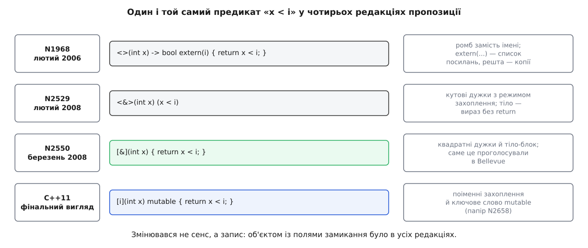

# 📜 Як лямбда потрапила в мову

Квадратні дужки перед списком параметрів виглядають як довільно обране позначення, але вони — уламок довгої суперечки: із 2006 по 2008 рік комітет тричі міняв запис лямбди й один раз розвернув на протилежне рішення про те, чи можна змінювати захоплену копію. Тут — звідки взялася сама потреба, чому бібліотеки її не закрили і в якому порядку доліплювали захоплення після C++11.

## Бібліотека, яка вдавала синтаксис

Перші анонімні функції в C++ ніхто не додавав до мови — їх зробили бібліотекою. Boost Lambda Library, авторства Яакко Ярві (фін. Jaakko Järvi) і Ґері Пауелла (англ. Gary Powell), із копірайтом 1999–2004 років, ставила собі скромну мету: дати «гнучкий і зручний спосіб визначати безіменні об'єкти-функції для алгоритмів STL». Виглядало це так:

```cpp
// Boost.Lambda, початок 2000-х
for_each(a.begin(), a.end(), std::cout << _1 << ' ');
find_if(v.begin(), v.end(), _1 < i);
```

Спокуса зрозуміла: замість оголошувати клас із полем і оператором виклику пишеш вираз, схожий на тіло циклу. Але механізм тут не той, що здається. `_1` — це об'єкт, і `_1 < i` не порівнює нічого: `operator<` для цього типу повертає не `bool`, а ще один об'єкт, який несе в собі всю подобу виразу, закодовану в типі. Це техніка [шаблонів виразів](root:sys-plang-cpp/expression-templates): вираз не обчислюється, а збирається в дерево з типів, і вже потім, коли [алгоритм](root:sys-plang-cpp/stl-algorithms) покличе `pred(x)`, дерево розгортається у справжнє порівняння.

За бібліографією самої бібліотеки, підхід визрівав кілька років: технічний звіт Ярві й Пауелла «The Lambda Library: Lambda Abstraction in C++» (Turku Centre for Computer Science, звіт 378, 2000), доповідь на другому воркшопі з шаблонного програмування на OOPSLA'01 у Тампа-Бей, і стаття Ярві, Пауелла та Ендрю Ламсдейна в *Software: Practice and Experience* (том 33, с. 259–291, 2003).

## Де бібліотека впирається в стелю

Бібліотека вміє перехоплювати рівно те, що мова дозволяє перевантажувати, — оператори. Усе інше для неї невидиме. Не можна перехопити `if`, не можна перехопити оголошення змінної, і — найболючіше — не можна перехопити виклик методу, бо `_1.size()` вимагає, щоб компілятор знайшов `size` у типі `_1`, а там його нема й не може бути.

Саме цей приклад комітет побачив у папері N1968=06-0038 (Джеремая Вілкок, Яакко Ярві, Даґ Ґреґор, Б'ярне Страуструп, Ендрю Ламсдейн, 26 лютого 2006). Автори навели справжній лист від користувача бібліотеки, Даніеля Лідстрема, наведений з його дозволу: людина намагалася порахувати елементи у списку списків через `var(count) += _1.size()` і дістала повідомлення, що `size` не є членом `boost::lambda::lambda_functor<T>`.

До того ж папір перелічив решту болю: помилки в лямбда-бібліотеках вивалюються нечитними полотнами тексту; час компіляції суттєво зростає; поведінка непередбачувана в дрібницях — `cout << _1 << "\n"` працює, а `cout << _1 << endl` не збирається, бо `endl` є шаблоном, чого більшість програмістів не усвідомлює. І — цифра, яку годі проігнорувати: автори виміряли, що `find_if` із простим `<` через Boost.Lambda працює у **2.5 раза** довше, ніж із рукописним об'єктом-функцією або рукописним циклом.

Звідси випливає ціль, яку N1968 сформулював першим пунктом дизайну: анонімна функція має бути **не повільнішою за цикл, написаний рукою**. Бібліотека такої обіцянки дати не могла — вона будує десятки проміжних викликів і сподівається, що оптимізатор їх поїсть. Мовна конструкція може, бо компілятор перекладає її в один клас із полями безпосередньо.

## Дві заявки 2006 року

У лютому 2006-го на розгляд лягли одразу два папери: N1958 Валентина Самка «A proposal to add lambda functions to the C++ standard» і згаданий N1968. Далі рухався N1968, але з N1958 теж дещо взяли — це зазначено в його наступниках.

Запис, який пропонував N1968, сьогодні впізнати важко:

```cpp
// N1968, лютий 2006
find_if(v.begin(), v.end(), <>(int x) -> bool extern(i) { return x < i; });
```

Ромб `<>` відкривав лямбду, стрілка задавала тип результату, а `extern(...)` перелічував змінні, які треба тримати **за посиланням**. Усе інше, до чого лямбда торкалася, копіювалося — тобто типовим було захоплення за значенням, а посилання треба було просити явно.

Найцікавіше — що робив `*this` у цьому списку. Він означав «тримати поточний об'єкт за вказівником»; а якщо його не згадати, копіювався **весь об'єкт цілком**. Тобто в редакції 2006 року за замовчуванням лямбда всередині методу везла з собою копію об'єкта. У C++11 усе вийшло рівно навпаки — `[=]` тягне вказівник, — а можливість скопіювати об'єкт повернули аж у C++17 як `[*this]`. Історія тут не пряма лінія, а маятник.

Ще одне рішення N1968 віддається луною до сьогодні: лямбди навмисне зробили мономорфними, тобто з явно вказаними типами параметрів. Причина — не лінощі: узагальнений оператор виклику конфліктував із модульною перевіркою типів у [концептах](root:sys-plang-cpp/concepts-constraints), які тоді ще планували в C++0x. Наступна редакція, N2529, додала до цього суто інженерний аргумент: узагальнені лямбди мають «істотно вищу вартість реалізації». Узагальнені лямбди після цього чекали вісім років.

## Кутові дужки, які не пережили Bellevue

Далі папір ішов ланцюжком редакцій — усі номери й дати наведені у списку літератури самого N2550:

```text
N1968=06-0038   лютий 2006     Вілкок, Ярві, Ґреґор, Страуструп, Ламсдейн
N2329=07-0189   червень 2007   ред. 1: Ярві, Фрімен, Кроул
N2413=07-0273   вересень 2007  wording для мономорфних лямбд
N2487=07-0357   грудень 2007   ред. 2
N2529=08-0039   4 лютого 2008  ред. 3 — за домовленістю з Kona 2007
N2550=08-0060   29 лютого 2008 ред. 4 — за домовленістю з Bellevue 2008
```

Між третьою й четвертою редакціями минуло двадцять п'ять днів, і за цей час запис змінився остаточно. У N2529 та сама вибірка службовців виглядала так:

```cpp
// N2529, редакція 3
std::find_if(employees.begin(), employees.end(),
             <&>(const employee& e) (e.salary() >= min_salary));
```

А в N2550 — так, як ми пишемо досі:

```cpp
// N2550, редакція 4 — саме її проголосували
std::find_if(employees.begin(), employees.end(),
             [&](const employee& e) { return e.salary() >= min_salary; });
```

Змінилося дві речі: кутові дужки стали квадратними, а тіло з виразу в круглих дужках перетворилося на звичайний блок із `return`. Прямого пояснення «чому квадратні» папери не дають, але напруга навколо граматики видна неозброєним оком: N2529 сам перелічує серед своїх змін «невелику зміну граматики для усунення неоднозначності», запропоновану Кларком Нельсоном. Кутові дужки в C++ уже зайняті аргументами шаблонів, і кожна нова конструкція на них додає роботи розбирачеві.



*Змінювався не сенс, а запис: об'єктом із полями замикання було в усіх редакціях.*

Специфікацію з N2550 проголосували в робочий документ на зустрічі в Беллв'ю (англ. Bellevue, штат Вашингтон) у березні 2008 року. Це не переказ — так починається наступний папір, N2658, і саме тому цю дату можна вважати днем народження лямбди в C++. Про те, що означає «проголосували в робочий документ» і чим evolution working group відрізняється від core working group, — [процес стандартизації](root:sys-plang-cpp/standardization-process).

## Суперечка про `const`, яка тривала півроку

Ось найцікавіша частина, бо її наслідок ви зустрічаєте щоразу, коли пишете `mutable`.

У N2529 оператор виклику замикання був `const` — але поля, зроблені копіями, оголошувалися `mutable`. Формулювання паперу пряме: нессилкові неконстантні члени оголошуються `mutable`, «щоб дозволити зміну збережених у замиканні змінних попри те, що оператор виклику оголошено `const`». Тобто замикання можна було кликати навіть через константне посилання, і при цьому воно спокійно міняло свої копії.

У Беллв'ю це рішення розвернули. N2550 більше не пише `mutable` ніде: поле має тип змінної як є, оператор виклику `const`, крапка. Наслідок негайний — ось цей код став некоректним:

```cpp
int acc = 0;
transform(a.begin(), a.end(), a.begin(),
          [acc](int x) { return acc += x; });   // помилка: acc фактично const
```

Приклад узято з паперу, який відкотив половину відкату. Ярві й Петер Дімов подали N2651 (травень 2008), а вже його редакція N2658=08-0168 (Ярві, Дімов, Джон Фрімен, 12 червня 2008) відбила рішення core working group із зустрічі в Софії-Антиполісі: додати ключове слово `mutable` між списком параметрів і специфікацією винятків. Немає `mutable` — оператор виклику `const`; є — не `const`.

Чому не повернули просто поведінку N2529? Аргумент у N2658 не про смак, а про паралельність. Обійти константність можна було й так — захопити змінну за посиланням, `[&acc]`. Але тоді стан живе поза замиканням, і чи є зміна `acc` очікуваним побічним ефектом — питання відкрите; «зокрема, якщо замикання викликаються в конкурентних нитках, такі проблеми з аліасингом і побічними ефектами ускладнюють міркування про програму». Отже, стан за замовчуванням мав бути недоторканним, а бажання його міняти — заявленим уголос. Саме тому `mutable` — це слово, яке треба дописати, а не поведінка, яку треба вимкнути.

```text
N2529   лютий 2008   operator() const, поля mutable  → копії міняти можна
N2550   березень     operator() const, поля звичайні → копії міняти НЕ можна
N2658   червень      з'явилося слово mutable         → можна, якщо попросив
```

## Що з N2550 не дожило до C++11

Проголосований у 2008-му текст містив кілька речей, яких у стандарті 2011 року вже немає, — корисно знати, бо вони пояснюють дивні краї сучасної поведінки.

**`std::reference_closure`.** N2550 вимагав: якщо всі захоплення в лямбді — за посиланням, її тип має публічно успадковуватися від `std::reference_closure<R(P)>`, а це фактично зобов'язувало реалізацію тримати пару «вказівник на функцію + вказівник на кадр». Ідея була в швидкості на межі двійкового інтерфейсу. Прибрав це папір N2845=09-0035 «Remove std::reference_closure» (Лоуренс Кроул, Даґ Ґреґор, Дейв Абрагамс, 5 березня 2009): користувачам довелося б писати додаткові перевантаження вручну, не всі замикання під це підходили, а головне — автори виміряли, що агресивно оптимізований [`std::function`](root:sys-plang-cpp/std-function-type-erasure) із оптимізацією малих об'єктів скорочує розрив із 23.5 раза до 1.6–2.2 раза. Другого двійкового подання замикань не вартувало.

**Присвоєння.** N2550 прямо оголосив оператор копійного присвоєння замикання видаленим, і так було до C++17 включно. Беззахопним замиканням повернули і присвоєння, і конструктор за замовчуванням лише в C++20 — папером P0624R2 «Default constructible and assignable stateless lambdas» Луї Діона (2017-11-10).

**Перетворення на вказівник на функцію.** У N2550 його теж не було. Додав його папір N3052=10-0042 «Converting Lambdas to Function Pointers» Лоуренса Кроула й Алісдера Мередіта (9 березня 2010), а поштовхом став коментар національного органу Великої Британії № 226: у лямбди з порожнім списком захоплення й у звичайної функції семантика однакова, тож нехай перша конвертується в другу й ходить у старі C-інтерфейси.

## Лінія захоплень після C++11

Далі кожна версія стандарту закривала одну конкретну дірку. Впорядковано за версіями, з номерами паперів — щоб можна було перевірити:

**C++14.** N3648 «Wording Changes for Generalized Lambda-capture» (Давід Вандевоорде, Вілле Воутілайнен, 17 квітня 2013) дав захоплення з ініціалізатором `[p = std::move(p)]` — до нього перемістити щось у замикання було нічим. N3649 «Generic (Polymorphic) Lambda Expressions» редакції 3 (Файсал Валі, Герб Саттер, Дейв Абрагамс) повернув `auto`-параметри, тобто ту саму поліморфність, яку мали бібліотеки й від якої свідомо відмовився N1968. Обидва папери ухвалили на зустрічі в Бристолі в квітні 2013 року.

**C++17.** P0018R3 «Lambda Capture of `*this` by Value as `[=,*this]`» (Г. Картер Едвардс, Давід Вандевоорде, Крістіан Тротт та інші, 4 березня 2016) повернув копію об'єкта — мотивація прямо названа: асинхронне розсилання замикань. P0170R1 «Wording for Constexpr Lambda» (Файсал Валі, Єнс Маурер, Річард Сміт, 1 березня 2016) — формулювання для прийнятої EWG пропозиції N4487, після якої замикання можна обчислювати на етапі компіляції.

**C++20.** Томас Кеппе (нім. Thomas Köppe) закрив історію з `this` двома паперами: P0409R2 (4 березня 2017) дозволив писати `[=, this]` явно, а P0806R2 (4 червня 2018) оголосив неявне захоплення `this` через `[=]` застарілим — саме тому, що `[=]` виглядає як «усе за значенням», а насправді тягне вказівник на об'єкт. P0780R2 Баррі Ревзіна (14 березня 2018) дозволив розкривати [пакети параметрів](root:sys-plang-cpp/variadic-and-folds) у захопленні, `[...args = std::move(args)]`; заборона трималася на побоюванні про іменовані члени замикання й відпала після того, як питання ядра CWG 1760 зробило члени від ініціалізаторного захоплення безіменними. І вже згаданий P0624R2 повернув беззахопним замиканням присвоєння.

**C++23.** P1169R4 «`static operator()`» (Баррі Ревзін, Кейсі Картер) прибрав неявний параметр-об'єкт там, де він не потрібен: якщо оператор виклику не вбудувався, `this` доводилося тягати зайвим регістром, а це суперечить правилу «не платиш за те, чим не користуєшся». P0847R7 «Deducing this» (Ґашпер Ажман, Сай Бренд, Бен Дін, Баррі Ревзін) дав явний параметр-об'єкт — і як побічний, але дуже бажаний наслідок, лямбда нарешті може покликати саму себе без обгортки.

Через усі ці двадцять років тягнеться одна нитка. Кожен папір після 2008-го відповідає на те саме питання: **чим саме замикання володіє і як довго**. Спершу відповідь була одна на всю лямбду (`[=]` або `[&]`), потім її дозволили давати для кожного поля окремо (`[p = ...]`), потім — для об'єкта (`[*this]`), потім — для пакета. А рішення від березня — червня 2008-го про константність оператора виклику лишилося недоторканим: замикання й досі поводиться як значення, поки ви не напишете `mutable`.
