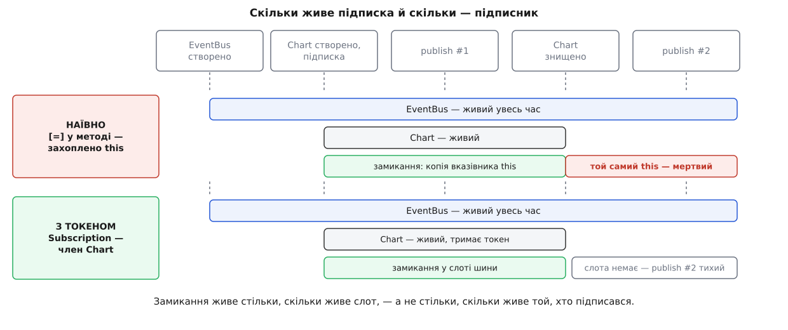

# ⚙️ Реєстр обробників подій: підписка, що пережила підписника

Тут ми напишемо маленький реєстр обробників на `std::function`, підпишемо в нього лямбди з різних місць — і подивимося, як звичайнісінька підписка перетворюється на звернення до мертвої пам'яті, щойно підписник помирає раніше за реєстр. Потім полагодимо це трьома способами, які доповнюють один одного, і розберемо три пастки, що чекають далі: самовідписку з тіла обробника, копію замикання всередині `std::function` і порядок знищення реєстру та підписників.

Реєстр обробників — це той самий [спостерігач](topic:sf-apps/observer): один об'єкт розсилає подію багатьом, не знаючи, хто саме її слухає. У C++ у ролі «слухача» майже завжди виступає лямбда, загорнута в `std::function`, — і саме на стику цих двох речей з'являється помилка, якої в мовах зі збиранням сміття просто не буває.

## Реєстр у тридцять рядків

Задача мінімальна: підписатися, відписатися, розіслати. Подія — один структурний тип, обробник — `std::function`, підписка ідентифікується числом.

```cpp
#include <cstddef>
#include <functional>
#include <utility>
#include <vector>

struct Tick { long long ms; double value; };

class EventBus {
public:
    using Handler = std::function<void(const Tick&)>;
    using Id = std::size_t;

    Id subscribe(Handler h) {
        const Id id = next_++;
        slots_.push_back(Slot{id, std::move(h)});
        return id;
    }

    void unsubscribe(Id id) {
        for (std::size_t i = 0; i < slots_.size(); ++i)
            if (slots_[i].id == id) { slots_.erase(slots_.begin() + i); return; }
    }

    void publish(const Tick& ev) {
        for (Slot& s : slots_) s.handler(ev);
    }

private:
    struct Slot { Id id; Handler handler; };
    std::vector<Slot> slots_;
    Id next_ = 1;
};
```

Це версія, яку пишуть за п'ять хвилин і яка проходить перший тест. Далі ми знайдемо діру ще й у самому `unsubscribe`, і в `publish`, — але почнімо з тієї, заради якої все затіяно.

## Перша підписка — і перша яма

Підпишемо об'єкт, який накопичує значення. Найприродніший запис — лямбда просто в конструкторі:

```cpp
class Chart {
public:
    explicit Chart(EventBus& bus) {
        bus.subscribe([=](const Tick& ev) { push(ev.value); });
    }
    void push(double v) { data_.push_back(v); }
private:
    std::vector<double> data_;
};
```

`[=]` читається як «усе за значенням», і саме тому цей запис такий небезпечний: єдине, що тут можна було захопити, — це `this`, бо `push` у тілі означає `this->push`. У замиканні лежить копія **вказівника**, тобто посилальне захоплення в костюмі значення. У C++20 неявне захоплення `this` через `[=]` оголошено застарілим саме через цю оманливість (папір P0806R2), і компілятори в режимі C++20 на нього попереджають — попередження, яке варте того, щоб бути помилкою збірки.

Тепер зіштовхнімо часи життя:

```cpp
#include <cstdio>

int main() {
    EventBus bus;
    {
        Chart chart(bus);
        bus.publish({1, 0.5});   // усе гаразд: chart живий
    }                            // ~Chart відпрацював; підписка лишилася в шині
    bus.publish({2, 0.7});       // this у замиканні вказує в нікуди
    std::puts("дійшли до кінця");
}
```

Другий `publish` викликає обробник, обробник кличе `push` за мертвим `this`, `push` дописує число у `data_` — вектор, чий буфер уже повернуто алокатору. Це [невизначена поведінка](topic:sf-lang/undefined-behavior) чистої води: [висяче посилання](topic:sys-plang-cpp/dangling-references), просто заховане в полі об'єкта, куди ніхто не заглядає.

Той самий провал, тільки без класу, — коли захоплюють локальні змінні:

```cpp
void watchThreshold(EventBus& bus) {
    double threshold = 3.5;
    int hits = 0;
    bus.subscribe([&](const Tick& ev) {
        if (ev.value > threshold) ++hits;
    });
}   // threshold і hits зникли; обробник у шині лишився й досі носить їхні адреси
```



*Замикання живе стільки, скільки живе слот у реєстрі, — а не стільки, скільки живе той, хто підписався.*

## Чому це «працює» на тестах

Найгірша риса цієї помилки не в тому, що вона падає, а в тому, що вона **не падає**. Обидва приклади вище на типовій збірці спокійно доходять до кінця й нічого не друкують у stderr. Причини суто механічні, і їх варто знати поіменно.

**Кадр стека нікуди не дівається.** Коли `watchThreshold` повертається, вказівник стека просто зсувається назад. Сторінка лишається відображеною, байти в ній — незмінними. Якщо між поверненням і викликом обробника не сталося жодного іншого виклику, `threshold` усе ще дорівнює 3.5 — не тому, що це законно, а тому, що ніхто не встиг записати туди своє.

**Звільнений блок купи ще цілий.** `operator delete` віддає блок алокатору. Типова реалізація `malloc` пише в початок блока кілька байтів службових даних (посилання на наступний вільний блок) і більше нічого не чіпає. Об'єкт розміром у сотню байтів після знищення читається майже повністю правильно — псуються перші вісім-шістнадцять.

**Оптимізація змінює розкладку.** Інлайнінг, розміщення змінних у регістрах і повторне використання ділянок кадру відрізняються між `-O0` і `-O2`. Тому та сама помилка поводиться по-різному в зневаджувальній і випусковій збірках — і це головна причина легенд про «падає тільки в релізі».

Зробити провал відтворюваним можна дешево: досить забруднити пам'ять між смертю власника й розсилкою.

```cpp
void clobberStack() {
    volatile char noise[1024];
    for (int i = 0; i < 1024; ++i) noise[i] = char(0xA5);
}

void reproduce(EventBus& bus) {
    watchThreshold(bus);
    clobberStack();          // кадр watchThreshold перезаписано
    bus.publish({3, 9.9});   // порівняння зі сміттям, інкремент у чужий байт
}
```

Чесний інструмент тут один — [санітайзери пам'яті](topic:sf-release/address-sanitizer): збірка з `-fsanitize=address` ловить звернення до звільненої купи одразу й друкує обидва стеки — де звільнили і де звернулися. Для випадку зі стеком потрібен ще й ключ середовища `ASAN_OPTIONS=detect_stack_use_after_return=1`: перевірка коштує пам'яті й часу, тому вмикається окремо (на Linux у свіжих clang вона типово ввімкнена, покладатися на це між платформами не варто).

> 🔧 **Навіщо це.** Підписка — найтихіший спосіб віддати чужому об'єктові адресу свого. Ані компілятор, ані тест не скажуть вам, що ви це зробили: `bus.subscribe([=]{ … })` виглядає як рядок реєстрації, а не як передача вказівника на десять років уперед. Тому питання «що станеться з цим обробником, коли `this` помре?» треба ставити собі в момент написання підписки — потім його ніхто не поставить.

## Виправлення перше: підписка, яка володіє

Правило коротке: **замикання, яке кудись зберігають, не має права дивитися назовні**. Усе, чим воно користується, мусить лежати в ньому самому. Механізм для цього — захоплення з ініціалізатором: у списку захоплень оголошується нове поле, і йому задається довільний вираз.

Наївний варіант із `[&]` переписується так:

```cpp
#include <memory>

struct Stats { double threshold; int hits; };

std::shared_ptr<Stats> watchThreshold(EventBus& bus) {
    auto st = std::make_shared<Stats>(Stats{3.5, 0});
    bus.subscribe([st](const Tick& ev) {          // замикання володіє станом
        if (ev.value > st->threshold) ++st->hits;
    });
    return st;                                    // той, хто підписав, читає ті самі лічильники
}
```

Зверніть увагу, що змінилося не тільки захоплення. Посилальний варіант був спокусливий саме тим, що результат лишався «тут», у локальних змінних. Коли замикання стає власником, стан мусить переїхати в спільне місце — і хтось має його повернути назовні. Володіння не безкоштовне з погляду будови коду: ви більше не можете писати в локальну змінну з обробника, ви пишете у спільний об'єкт.

Те саме працює для речей, які копіювати не хочеться, — їх переміщують у замикання:

```cpp
EventBus::Id logToFile(EventBus& bus, std::string path) {
    auto out = std::make_shared<std::ofstream>(path);
    return bus.subscribe([out, prefix = std::move(path)](const Tick& ev) {
        *out << prefix << ' ' << ev.ms << ' ' << ev.value << '\n';
    });
}
```

Поле `prefix` тут сконструйовано [переміщенням](topic:sys-plang-cpp/move-semantics) із зовнішнього `path`: ліве ім'я в захопленні — це нове поле замикання, праве — зовнішня змінна, і після переміщення вона лишається порожньою. Чому потік загорнуто в `shared_ptr`, а не в `unique_ptr`, — окрема історія, до якої ми ще дійдемо в пастках.

## Виправлення друге: слабке посилання на об'єкт

Копіювати стан добре, поки стану мало. Коли обробник має викликати **метод** живого об'єкта — а це типова ситуація в інтерфейсному й мережевому коді, — копія не годиться: потрібен саме той екземпляр, а не його двійник. Тут працює [слабке посилання](topic:sys-plang-cpp/shared-weak-ptr): замикання тримає не адресу, а квиток, за яким можна спробувати отримати володіння й дізнатися, чи є ще кого тримати.

```cpp
class Chart : public std::enable_shared_from_this<Chart> {
public:
    static std::shared_ptr<Chart> create() { return std::shared_ptr<Chart>(new Chart); }

    void attach(EventBus& bus) {
        std::weak_ptr<Chart> weak = weak_from_this();
        bus.subscribe([weak](const Tick& ev) {
            if (std::shared_ptr<Chart> live = weak.lock())
                live->push(ev.value);
        });
    }

    void push(double v) { data_.push_back(v); }

private:
    Chart() = default;
    std::vector<double> data_;
};
```

Підписка виконується в окремому `attach`, а не в конструкторі, і це не примха. `shared_from_this()` вимагає, щоб на об'єкт уже існував `shared_ptr`; у конструкторі його ще немає, і з C++17 виклик кидає `std::bad_weak_ptr` (до C++17 це була невизначена поведінка). `weak_from_this()`, доданий у C++17, не кидає — але в конструкторі поверне порожнє слабке посилання, з якого `lock()` ніколи нічого не дасть. Тому конструктор ховають, а об'єкт видають фабрикою; підписка — окремим кроком, коли `shared_ptr` уже існує.

Що дає `lock()` під час виклику: якщо об'єкт живий, ми отримуємо повноцінне володіння на час тіла обробника — тобто об'єкт гарантовано не помре посеред `push`. Якщо мертвий — `lock()` повертає порожній `shared_ptr`, і ми тихо нічого не робимо. Жодного звернення до звільненої пам'яті ні в тому, ні в тому випадку.

Але одну проблему `weak_ptr` не розв'язує: **слот у реєстрі лишається**. Об'єкта немає, а замикання далі викликається на кожній події, робить `lock()`, отримує порожнечу й повертається. Тисяча коротких сесій за годину — тисяча мертвих слотів, які реєстр сумлінно обходить на кожному `publish`. Слабке посилання прибрало невизначену поведінку, але не прибрало сміття, і прибрати його має той, хто підписався.

## Токен відписки: RAII на підписці

Ідея [RAII](topic:sf-lang/raii) тут застосовується дослівно: підписка — це ресурс, отриманий при створенні об'єкта, і звільнити його має деструктор.

```cpp
class Subscription {
public:
    Subscription() = default;
    Subscription(EventBus& bus, EventBus::Id id) : bus_(&bus), id_(id) {}

    Subscription(const Subscription&) = delete;
    Subscription& operator=(const Subscription&) = delete;

    Subscription(Subscription&& other) noexcept
        : bus_(other.bus_), id_(other.id_) { other.bus_ = nullptr; }

    Subscription& operator=(Subscription&& other) noexcept {
        if (this != &other) {
            reset();
            bus_ = other.bus_;
            id_  = other.id_;
            other.bus_ = nullptr;
        }
        return *this;
    }

    ~Subscription() { reset(); }

    void reset() {
        if (bus_) { bus_->unsubscribe(id_); bus_ = nullptr; }
    }

private:
    EventBus* bus_ = nullptr;
    EventBus::Id id_ = 0;
};

inline Subscription EventBus::connect(Handler h) {
    return Subscription(*this, subscribe(std::move(h)));
}
```

Копіювання заборонено, переміщення дозволено — інакше два токени зняли б один слот двічі. Це [правило п'яти](topic:sys-plang-cpp/rule-of-five-zero) у чистому вигляді: щойно клас відповідає за звільнення ресурсу, він мусить сказати, що робити з копією й переміщенням. Переміщений токен лишається з `bus_ == nullptr` і в деструкторі не робить нічого.

Метод `connect` треба дописати в `EventBus`, і тут є технічна дрібниця: щоб оголосити його всередині класу шини, достатньо попереднього оголошення `class Subscription;` вище — в **оголошенні** функції неповний тип повернення дозволено, а тіло виноситься нижче, коли `Subscription` уже визначено. Позначити метод варто `[[nodiscard]]`: викинутий токен означає підписку, яку негайно ж і зняли.

Тепер підписник із попереднього розділу дописується одним полем і одним знаком рівності:

```cpp
class Chart : public std::enable_shared_from_this<Chart> {
public:
    // …
    void attach(EventBus& bus) {
        std::weak_ptr<Chart> weak = weak_from_this();
        sub_ = bus.connect([weak](const Tick& ev) {
            if (std::shared_ptr<Chart> live = weak.lock())
                live->push(ev.value);
        });
    }
private:
    std::vector<double> data_;
    Subscription sub_;      // ~Chart зніме слот
};
```

Тут напрошується питання: якщо токен і так знімає слот у деструкторі, навіщо ще й `weak_ptr`? В однонитковому реєстрі з негайною розсилкою — справді ні до чого, вистачить токена. Слабке посилання потрібне рівно в двох випадках: коли розсилка йде з іншої нитки, ніж знищення підписника, і коли шина не викликає обробники одразу, а складає події в чергу. В обох ситуаціях між «відписалися» й «обробник уже почав виконуватися» є щілина, яку токен закрити не може.

## Пастка перша: самовідписка з тіла обробника

Тепер повернімося до реєстру. Найзвичайніша річ у світі — обробник, який після спрацювання знімає сам себе:

```cpp
bus.unsubscribe(myId);   // з тіла обробника, який зараз виконується
```

У наївній версії `unsubscribe` робить `slots_.erase(...)`. Це означає **знищення `std::function`, оператор виклику якої зараз на стеку**. Замикання — це об'єкт, його захоплення — його поля; знищивши його посеред виклику, ви перетворили `this` оператора виклику на висячий. Усе, що обробник зробить після цього рядка, читатиме мертві поля. Плюс `erase` посуває решту елементів вектора, а цикл `for (Slot& s : slots_)` у `publish` саме зараз тримає на них ітератор — друге порушення в тому самому рядку.

Дзеркальна біда — підписка з тіла обробника: `push_back` може перерозподілити вектор, і тоді знищиться не тільки чужий слот, а й той, що виконується.

Виправлення розділяє два поняття, які легко сплутати: **зняти слот** і **знищити обробник**. Зняття — це позначка, знищення — окрема операція після розсилки.

```cpp
#include <algorithm>   // std::remove_if

class Subscription;    // повне визначення — нижче

class EventBus {
public:
    using Handler = std::function<void(const Tick&)>;
    using Id = std::size_t;

    Id subscribe(Handler h) {
        const Id id = next_++;
        std::vector<Slot>& target = (depth_ == 0) ? slots_ : pending_;
        target.push_back(Slot{id, true, std::move(h)});
        return id;
    }

    void unsubscribe(Id id) {
        if (!markDead(slots_, id)) markDead(pending_, id);
        if (depth_ == 0) flush();
    }

    void publish(const Tick& ev) {
        ++depth_;
        const std::size_t n = slots_.size();   // підписки, створені зараз, чекають наступної події
        for (std::size_t i = 0; i < n; ++i)
            if (slots_[i].alive) slots_[i].handler(ev);
        if (--depth_ == 0) flush();
    }

    [[nodiscard]] Subscription connect(Handler h);

private:
    struct Slot { Id id; bool alive; Handler handler; };

    static bool markDead(std::vector<Slot>& v, Id id) {
        for (Slot& s : v)
            if (s.id == id && s.alive) { s.alive = false; return true; }
        return false;
    }

    void flush() {
        slots_.erase(std::remove_if(slots_.begin(), slots_.end(),
                                    [](const Slot& s) { return !s.alive; }),
                     slots_.end());
        for (Slot& s : pending_)
            if (s.alive) slots_.push_back(std::move(s));
        pending_.clear();
    }

    std::vector<Slot> slots_;
    std::vector<Slot> pending_;
    Id next_ = 1;
    int depth_ = 0;
};
```

Три речі тримають цю версію купи. По-перше, під час розсилки `slots_` не змінює розміру: нові підписки йдуть у `pending_`, зняті лише міняють прапорець. Тому `slots_[i]` лишається дійсним посиланням на весь час виклику. По-друге, обхід іде до знімка `n`, а не до поточного розміру, — обробник, підписаний під час розсилки, не отримає ту саму подію, що його породила (інакше легко написати нескінченний цикл). По-третє, лічильник `depth_` враховує вкладені `publish`: чистка відбувається один раз, коли розсилка справді закінчилася.

Зверніть увагу й на те, чого тут **немає**: на шляху зняття слота немає жодного виділення пам'яті. Це не випадковість, а вимога — `unsubscribe` викликається з деструктора токена, а деструктори неявно `noexcept`, і виняток звідти означає негайний `std::terminate`. Тому зняття — це позначка й `remove_if`, а не вставка.

Одноразовий обробник тепер пишеться чесно:

```cpp
auto slot = std::make_shared<EventBus::Id>(0);
*slot = bus.subscribe([&bus, slot](const Tick& ev) {
    report(ev);
    bus.unsubscribe(*slot);   // лише позначка — замикання доживе до кінця виклику
});
```

Ідентифікатор доводиться класти у спільну комірку, бо його ще не існує в момент, коли пишеться тіло. Захоплення `&bus` тут законне рівно тому, що шина — це той, хто нас зараз викликає, отже, вона гарантовано жива; будь-яке інше посилання в цьому списку захоплень було б помилкою.

## Пастка друга: у `std::function` лежить копія

`std::function` не тримає ваше замикання — вона тримає **його копію**, зроблену при конструюванні. Звідси три наслідки, на яких спотикаються регулярно.

**Стан живе в копії, а не у вас.** Класичний спантеличений баг:

```cpp
auto h = [count = 0](const Tick&) mutable { ++count; };
bus.subscribe(h);        // у шину поїхала копія з власним count
h({0, 0.0});             // а це вже інший лічильник
```

Обидва об'єкти працюють правильно, просто їх два. Якщо стан мусить бути спільним — його треба винести у спільний об'єкт (як `Stats` вище), а не сподіватися на замикання.

**Обробник мусить бути копійовним.** Стандарт вимагає від цілі `std::function` бути `CopyConstructible`. Замикання, яке захопило `unique_ptr`, відкритий сокет чи `std::promise`, копіювати неможливо — і збірка ламається довжелезним повідомленням десь усередині `<functional>`, де компілятор безуспішно шукає копіювальний конструктор. Саме тому в прикладі з файлом вище стояв `shared_ptr<std::ofstream>`, а не `unique_ptr`: `shared_ptr` копіюється. C++23 нарешті дав правильний інструмент — `std::move_only_function` (папір P0288R9), яка вимагає лише переміщення; на старіших стандартах доводиться або ділити володіння через `shared_ptr`, або писати власне стирання типу.

**Копія може коштувати виділення пам'яті.** `std::function` зберігає маленькі цілі всередині себе, великі — у купі, і межа залежить від реалізації. У libstdc++ внутрішній буфер — 16 байтів, і туди кладуться лише тривіально копійовані цілі; у libc++ буфер 24 байти. Наслідок неприємно іронічний: замикання з `[=]` у методі — це вісім байтів вказівника, тривіально копійовані, тобто **найдешевша** підписка з можливих і водночас та сама, що ламає програму. А безпечна версія із захопленим `shared_ptr` тривіально копійованою не є й у libstdc++ виділяє блок купи на кожну підписку. Про механіку цієї плати — [стирання типу у std::function](topic:sys-plang-cpp/std-function-type-erasure).

І дрібниця, яка колись здивує: `operator()` у `std::function` позначено `const`, але ціль викликається не через константний шлях. Тому `const std::function<void(const Tick&)>&` спокійно викличе `mutable`-замикання й змінить його стан — константність обгортки нічого не обіцяє про константність обробника. Проблему описано ще в папері N4348, і в мові її не полагодили; `std::move_only_function` дозволяє явно вказати кваліфікатори в сигнатурі.

## Пастка третя: хто кого переживає

Токен носить голий `EventBus*`. Ми домовилися, що підписник не має пережити шину, — але **шина не має пережити токен**, і це вже дзеркальна вимога поверхом вище. Якщо `EventBus` помре першим, `~Subscription` викличе `unsubscribe` за мертвою адресою, і ми повернемося рівно до тієї помилки, з якої почали.

Розв'язків три, і вони не рівноцінні.

**Архітектурне правило.** Шина живе на рівні, який охоплює всіх підписників: створюється в `main` або в кореневому об'єкті застосунку й передається посиланням. Тоді порядок гарантовано правильний, і жодного коду не треба. Це найдешевший варіант і майже завжди достатній — за однієї умови: шина не є глобальним чи статичним об'єктом. Порядок знищення статичних об'єктів у різних одиницях трансляції не визначений, тож глобальна шина плюс глобальний підписник — це лотерея.

**Слабке посилання на саму шину.** Якщо шиною володіє `shared_ptr`, токен тримає `std::weak_ptr<EventBus>` і в деструкторі робить `lock()` — той самий прийом, що й для об'єкта-підписника. Чесно, але змушує всіх власників шини перейти на спільне володіння.

**Двобічний зв'язок.** Шина веде список живих токенів і в своєму деструкторі обнуляє в кожному вказівник. Це найгнучкіше і найдорожче: кожна підписка тепер має два посилання, які треба узгоджено оновлювати при переміщенні токена. Саме так влаштовані з'єднання в бібліотеках із власним механізмом сигналів.

Є й четвертий бік того самого питання, менш очевидний. `~EventBus` знищує обробники, а обробники володіють захопленим станом — отже, у деструкторі шини гине багато чужих об'єктів. Якщо чийсь деструктор при цьому спробує щось опублікувати або відписатися, він зайде в шину, яка вже наполовину зруйнована. Тому в реальних реєстрах деструктор спочатку забирає вектор слотів у локальну змінну (`auto dying = std::move(slots_);`), і лише потім дає їй померти — до моменту знищення обробників шина вже в порожньому, але коректному стані.

## Скільки це коштує

| Операція | Складність | Що насправді відбувається |
|---|---|---|
| `subscribe` | O(1) амортизовано | `push_back` + можливе виділення під замикання |
| `unsubscribe` | O(n) | лінійний пошук за `id`, потім `remove_if` |
| `publish` | O(n) | n непрямих викликів крізь стирання типу |
| пам'ять на слот | стала | `Id` + прапорець + `std::function` (плюс блок купи, якщо замикання не влізло) |

Лінійний `unsubscribe` — свідоме спрощення. Коли підписок сотні й вони швидко змінюються, замість пошуку тримають `std::unordered_map<Id, std::size_t>` з індексом слота (тоді `flush` мусить оновлювати індекси) або масив слотів із вільним списком, де `Id` складається з номера комірки й номера покоління — так відписка стає O(1), а старий токен не може випадково зняти чужу підписку, що зайняла звільнену комірку.

Ціна `publish` — це n непрямих викликів, які компілятор не може вбудувати: за `std::function` він не бачить, кого саме викличе. Для сотень подій на секунду це не має жодного значення; для внутрішнього циклу обробки сигналу — має, і там реєстр замінюють на щось із відомими на етапі компіляції обробниками.

І окремо про нитки, бо весь реєстр вище — однонитковий: `publish`, `subscribe` і `unsubscribe` викликаються з одного місця. Захистити його м'ютексом недостатньо й навіть небезпечно: замок, узятий на весь `publish`, тримається під час виконання чужого коду, а чужий код має право відписатися або опублікувати щось у відповідь — і взяти той самий замок удруге. Робочі реєстри або тримають замок лише на час роботи зі слотами, копіюючи перелік обробників перед розсилкою (ціна — копія кожної `std::function`), або складають події в чергу й розсилають їх з однієї виділеної нитки. І в тому, і в тому випадку між зняттям слота та викликом обробника лишається щілина, яку закриває `lock()` слабкого посилання, — про природу цієї щілини докладніше в темі про [перегони даних і замки](topic:sf-tasks/data-races-locks).

## Що з цього забрати

Підсумок вкладається в кілька рядків, які варто перевіряти щоразу, коли пишеться `subscribe`.

Замикання, яке зберігають, не має права містити `&` у списку захоплень — і `[=]` всередині методу теж, бо він захоплює `this`. Обробник, що звертається до об'єкта, тримає `weak_ptr` і перевіряє `lock()`. Кожна підписка повертає токен, який знімає слот у деструкторі підписника, — інакше реєстр росте мертвими слотами. Зняття слота — це позначка, а не знищення: обробник має право відписати сам себе. І останнє: за кожним «підписатися» стоїть питання, хто помре першим, — на нього треба відповісти в момент написання підписки, бо потім відповідь дасть санітайзер, і то не одразу.
